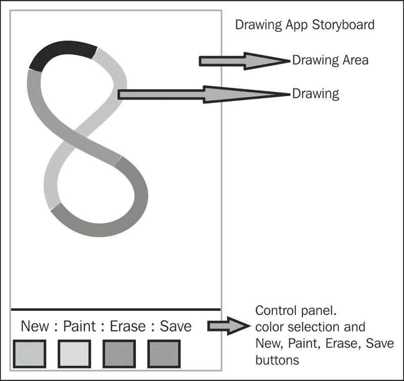
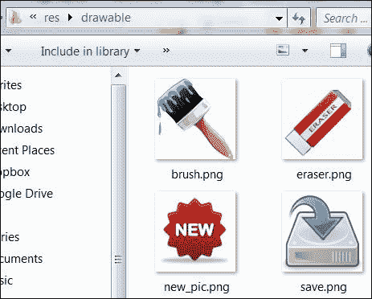
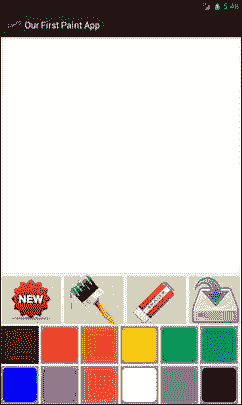
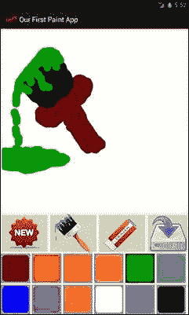
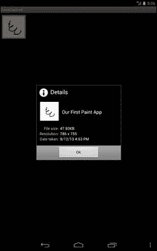
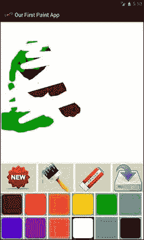

# 第六章：将它们整合在一起

最后，我们已经学完了使用 Android Canvas 的基础知识和技能的过程。在本章中，我们将从零开始逐步开发一个完整的应用程序，实现所有功能，使用我们在前几章中学到的所有知识和技巧。在本书的每一章中，我们都学习和练习了使用 Canvas 绘图的一个核心基本组件。现在，在本章中，我们将把这些组件与一些额外的功能结合起来，创建一个功能齐全的应用程序。

要创建任何应用程序或游戏，我们需要有一个计划、情节或故事板。故事板将告诉我们应用程序中事物的工作和展示方式，应用程序的核心功能或输出是什么，以及我们需要使应用程序有用和完整的一些额外或支持功能。计划可以是纸上的一些粗略的子弹笔记，也可以是一些手绘草图，但它将包含我们从它那里需要的所有需求和输出。附在绘图上的一些注释将完成我们的计划和对应用程序的整体构想。规划的好处在于它冻结了需求和我们的应用程序。在正常的软件工程中，在开始应用程序开发之前，会准备一份**软件需求规范**文档，其中写明了所有需求，并由双方签字。它定义了项目的边界，这非常重要。如果没有定义需求的边界或限制，应用程序的开发将永无止境，因为在开发过程中，随着时间的推移，需求会增加。所以我们必须有一套明确的需求和功能。以后，我们可以在应用程序的新版本中添加更多功能，但至少基础应用程序中的核心需求和功能将是完整的。

# 故事板

我们将从应用程序的线框开始，上面有一些注释、指针和部分内容；然后我们会解释这个草图。

下图展示了我们将要开发的应用程序的故事板：



前面的图表非常直观，为我们提供了完整的设计草图，展示了我们计划要做的事情。最顶部区域显示应用程序标题，如果我们创建应用程序时使用了小图标，它也会显示出来。标题栏下方是主要的空白**绘图区域**，我们将在那里进行所有的自由手绘和绘画。在屏幕底部，我们将有一个**控制面板**，从中可以选择功能以及绘图和绘画风格。**控制面板**将帮助我们选择画笔的颜色。我们可以改变画笔的大小。我们可以执行某些功能，如创建新绘图、保存现有绘图、选择画笔大小、点击橡皮擦以选择它，以及擦除当前绘制的画作。我们将使用手指和触摸事件在 Canvas 上绘图。稍后，我们可以选择**保存**、**擦除**，或者更改颜色和画笔大小，然后继续我们的绘画。所以我们的目标是开发一个类似 Paint 的简单 Android 应用程序。

# 项目和应用开发

我们将通过将项目划分为四个阶段来实现我们的目标。在开发过程中，我们会逐步完成每个阶段，最终开发出我们自己的绘图应用程序。以下是各个阶段：

+   用户界面

+   启用触摸和绘画

+   启用颜色选择

+   为我们的应用程序增加更多功能

## 用户界面

我们将通过在 Eclipse 中通过向导创建一个新的 Android 应用程序来开始我们的项目，正如我们在本书前面练习的那样。仅附上了新 Android 应用程序向导的第一屏。

下面的截图展示了新 Android 应用程序向导的第一屏：


我们将我们的应用程序命名为`OurFirstPaintApp`，**项目名称**将会自动填充，我们将**包名称**更改为`com.learningandroidcanvasmini`。在开发这个应用程序的过程中，我们将在项目的`res`文件夹中的 XML 文件和`src`文件夹中的 Java 文件中工作。

### 屏幕方向

在开始之前，我们需要决定我们的项目将支持哪种方向。假设我们希望我们的项目应用程序即使在用户横屏持设备时也始终保持**纵向**形式。为此，我们将打开`AndroidManifest.xml`文件，并将`Activity`标签中的`android:screenOrientation="landscape"`更改为`android:screenOrientation="portrait"`。

### 画笔

从我们的故事板中，我们知道需要使用不同大小的画笔；为此，我们将定义一些数字，这些数字将代表特定的画笔大小。我们将转到 `res/values` 文件夹，并打开 `dimens.xml` 文件。如果文件不在那里，我们将创建一个名为 `dimens.xml` 的新 XML 文件，并将我们的值放入其中。在这个文件中，我们将查找 `<resources></resources>` 标签。在这个标签内部，我们将按如下方式放置我们的值：

```kt
<!-- Available brushes --> 
<dimen name="small_brush">10dp</dimen>
<integer name="small_size">10</integer>
<dimen name="medium_brush">20dp</dimen>
<integer name="medium_size">20</integer>
<dimen name="large_brush">75dp</dimen>
<integer name="large_size">75</integer>
```

我们将保持尺寸和整数值相同，以便用户界面在我们绘图时可以显示确切的画笔大小。

### 设计控制面板

在我们故事板草图中的控制面板中，我们有一排颜色和另一排执行某些功能的按钮。现在我们将开始设计**控制面板**。首先，我们将添加所有在**控制面板**中使用的字符串。为此，我们将打开 `res/values` 文件夹中的 `string.xml` 文件，并将以下代码添加到文件中：

```kt
<string name="start_new_painting">New Painting</string>
<string name="brush_size">Brush Size</string>
<string name="erase">Erase</string>
<string name="save_painting">Save Painting</string>
<string name="paint">Paint</string>
```

### 设置布局

首先，我们将从网上创建或下载以下图片，并将它们复制到 `res/drawable` 文件夹中。以下屏幕截图显示了 `res/drawable` 文件夹中的图片：



现在，我们将为我们的画布和控制面板设置**布局**，绘图空间以及将容纳我们按钮的空间。我们将打开 `activity_main.xml` 文件。在主 `Layout` 标签内部，我们将输入以下代码片段中提到的三个子布局标签。第一个将包含新建、画笔、擦除和保存按钮的图像，接下来的两个将分别包含一排颜色。

```kt
<LinearLayout
  android:layout_width="wrap_content"
  android:layout_height="100dp"
  android:layout_gravity="center"
  android:orientation="horizontal">

  <!-- content code starts here -->
  <ImageButton
    android:id="@+id/new_btn"
    android:layout_width="wrap_content"
    android:layout_height="fill_parent"
    android:contentDescription="@string/start_new"
    android:src="img/new_pic" />

  <ImageButton
    android:id="@+id/draw_btn"
    android:layout_width="wrap_content"
    android:layout_height="fill_parent"
    android:contentDescription="@string/brush"
    android:src="img/brush" />

  <ImageButton
    android:id="@+id/erase_btn"
    android:layout_width="wrap_content"
    android:layout_height="fill_parent"
    android:contentDescription="@string/erase"
    android:src="img/eraser" />

  <ImageButton
    android:id="@+id/save_btn"
    android:layout_width="wrap_content"
    android:layout_height="fill_parent"
    android:contentDescription="@string/save"
    android:src="img/save" />
  <!-- content code ends here -->

</LinearLayout>
```

接下来，我们将添加两个更多布局，我们将在其中有两排彩色按钮，如下所示：

```kt
<LinearLayout
  android:id="@+id/paint_colors"
  android:layout_width="wrap_content"
  android:layout_height="wrap_content"
  android:orientation="horizontal" >

  <ImageButton android:layout_width="@dimen/large_brush"
    android:layout_height="@dimen/large_brush"
    android:layout_margin="2dp"
    android:background="#FF660000"
    android:contentDescription="@string/paint"
    android:onClick="paintClicked"
    android:src="img/paint"
    android:tag="#FF660000" />
.
.
.
```

前面代码中的点代表我们想要添加的其余颜色按钮的代码。在前面代码块中唯一需要更改的是 `android:tag="#FF660000"` 代码，这是颜色的值。现在我们已经为控制面板准备好了布局。我们需要在布局中为我们的绘图预留一些空间。这里，我们将在 `src` 文件夹中创建一个名为 `CustomDrawingView` 的新 Java 类，该类将扩展 View。目前，我们只创建类的骨架代码，以便可以在布局 XML 文件中引用它。稍后，我们将定制 `CustomDrawingView` 类的每个部分，并加入我们希望应用程序拥有的所有功能。骨架代码如下所示：

```kt
import android.content.Context;
import android.util.AttributeSet;

public class CustomDrawingView extends View
{
  public CustomDrawingView(Context context, AttributeSet attrs){
    super(context, attrs);
    setupDrawing();
}

private void setupDrawing(){
  //get drawing area setup for interaction
}

}
```

这样，我们已经添加了一个 `CustomDrawingView` 类以及它的构造函数和 `setupDrawing()` 方法。这些是目前最核心的组件。没有构造函数，程序将生成错误。现在，我们将回到 `activity_main.xml` 文件，并在父级 `layout` 标签的打开标签下方添加以下代码：

```kt
<com.learningandroidcanvasmini.ourfirstpaintapp.CustomDrawingView
  android:id="@+id/drawing"
  android:layout_width="fill_parent"
  android:layout_height="0dp"
  android:layout_marginBottom="3dp"
  android:layout_marginLeft="5dp"
  android:layout_marginRight="5dp"
  android:layout_marginTop="3dp"
  android:layout_weight="1"
  android:background="#FFFFFFFF" />
```

我们 XML 文件中的代码行`<com.learningandroidcanvasmini.ourfirstpaintapp.CustomDrawingView`显示了我们的自定义视图的包目录。其次，这也告诉我们如何在我们的 XML 布局文件中添加基于自定义代码的布局。

尽管我们的布局几乎已经准备好了，但仍然不完整。我们需要在**控制面板**中添加适当的矩形颜色选择按钮。到目前为止，我们已经定义了图像按钮，但还需要一些配置，比如这些按钮的形状。我们希望这些按钮是略带圆角的正方形。为此，我们将在`res/drawables`文件夹中创建一个新的`paint.xml`文件。在这个文件中，我们将使用资源 XML 中的 Drawables 技术。我们将创建一个双层 Drawable 形状：一层用于矩形对象，另一层用于圆角。

```kt
<layer-list  >
<item>
  <shape android:shape="rectangle" >
    <stroke
      android:width="5dp"
      android:color="#FF999999" />
    <solid android:color="#ff000000" />
    <padding
      android:bottom="0dp"
      android:left="0dp"
      android:right="0dp"
      android:top="0dp" />
  </shape>
</item>
<item>
  <shape  >
    <stroke  android:width="4dp"  android:color="#FF999999" />
    <solid android:color="#ff000000" />
    <corners android:radius="15dp" />
  </shape>
</item>
</layer-list>
```

在前面的代码中，我们使用了 layer-list 标签，在其中我们使用了两个项目。第一个项目用于矩形形状，第二个用于圆角。我们将保存所有文件，并在模拟器中运行我们的代码。

下面的截图展示了我们没有任何功能的应用程序：



到目前为止，我们已经完成了用户界面并完成了图形工作。现在，我们需要使我们的应用程序能够响应触摸。

## 启用触摸并使用触摸绘画

目标是启用触摸：换句话说，我们的应用程序将在我们拖动手指在屏幕上时进行绘画。我们将从打开我们的`CustomDrawingView`类开始，并添加以下对象和变量：

```kt
private Path drawPath;
private Paint drawPaint, canvasPaint;
private int paintColor = 0xFF660000;
private Canvas drawCanvas;
private Bitmap canvasBitmap;
```

在此之后，在`setupDrawing()`方法中，我们将实例化`Path`和`Paint`对象，并将其不同的属性设置为某些我们希望它获得的默认值：

```kt
drawPath = new Path();
drawPaint = new Paint();
drawPaint.setColor(paintColor);
drawPaint.setAntiAlias(true);
drawPaint.setStrokeWidth(20);
drawPaint.setStyle(Paint.Style.STROKE);
drawPaint.setStrokeJoin(Paint.Join.ROUND);
drawPaint.setStrokeCap(Paint.Cap.ROUND);
```

最后，在方法中，我们将实例化 canvasPaint 对象：

```kt
canvasPaint = new Paint(Paint.DITHER_FLAG);
```

现在，我们将跳转到`onDraw()`方法，并添加以下代码行：

```kt
canvas.drawBitmap(canvasBitmap, 0, 0, canvasPaint);
canvas.drawPath(drawPath, drawPaint);
```

`onDraw()`方法接收一个类型为`Canvas`的对象作为参数，用于绘制位图和我们想要的绘图或绘画。每次我们触摸屏幕并拖动手指，`Canvas`上之前的绘画将调用`invalidate()`方法，`onDraw()`方法将自动被调用，显示我们当前的绘画。

我们几乎已经准备好了一切，但我们还没有使我们的应用程序能够响应触摸。为此，我们将向我们的`CustomDrawingView`类添加一个`onTouchEvent()`方法，如下所示：

```kt
public boolean onTouchEvent(MotionEvent event) {
}
```

在这个方法中，我们需要完成两项工作：检测用户的触摸动作并检查移动的方向。触摸可以是向上的，意味着手指没有接触屏幕；也可以是向下的，意味着手指按在屏幕上。动作可以是按下的手指向任何方向移动。首先，我们将使用以下代码获取触摸的 x、y 位置：

```kt
float touchX = event.getX();
float touchY = event.getY();
```

然后，我们将根据以下开关代码中包含的可能情况之一响应触摸事件：

```kt
switch (event.getAction()) {
```

当按下动作事件时，手指按下。将绘制点移动到触摸的位置：

```kt
case MotionEvent.ACTION_DOWN:
  drawPath.moveTo(touchX, touchY);
  break;
```

通过动作事件，手指按住并向某个方向拖动。首先，绘制点将是触摸的点，然后在拖动动作期间沿着手指的移动绘制一条线：

```kt
case MotionEvent.ACTION_MOVE:
  drawPath.lineTo(touchX, touchY);
  break;
```

最后，当手指抬起时，在 Canvas 上将会绘制一条路径，并且`Path`对象将被刷新，以便它准备好从下一个触摸位置开始绘制新线：

```kt
case MotionEvent.ACTION_UP:
  drawPath.lineTo(touchX, touchY);
  drawCanvas.drawPath(drawPath, drawPaint);
  drawPath.reset();
  break;
  default:
  return false;
}
```

最后，我们将调用`invalidate()`方法，以便我们可以激活`onDraw()`方法：

```kt
invalidate();
return true;
```

整个类的代码如下：

```kt
public class CustomDrawingView extends View {
  private Path drawPath;
  private Paint drawPaint, canvasPaint;
  private int paintColor = 0xFF660000;
  private Canvas drawCanvas;
  private Bitmap canvasBitmap;
  public CustomDrawingView(Context context, AttributeSet attrs){
    super(context, attrs);
    setupDrawing();
  }
  private void setupDrawing(){
    drawPath = new Path();
    drawPaint = new Paint();
    drawPaint.setColor(paintColor);
    drawPaint.setAntiAlias(true);
    drawPaint.setStrokeWidth(20);
    drawPaint.setStyle(Paint.Style.STROKE);
    drawPaint.setStrokeJoin(Paint.Join.ROUND);
    drawPaint.setStrokeCap(Paint.Cap.ROUND);
    canvasPaint = new Paint(Paint.DITHER_FLAG);
  }
  @Override
  protected void onSizeChanged(int w, int h, int oldw, int oldh) {
    super.onSizeChanged(w, h, oldw, oldh);
    canvasBitmap = Bitmap.createBitmap(w, h, Bitmap.Config.ARGB_8888);
    drawCanvas = new Canvas(canvasBitmap);
  }
  @Override
  protected void onDraw(Canvas canvas) {
    canvas.drawBitmap(canvasBitmap, 0, 0, canvasPaint);
    canvas.drawPath(drawPath, drawPaint);
  }
  @Override
  public boolean onTouchEvent(MotionEvent event) {
    float touchX = event.getX();
    float touchY = event.getY();
    switch (event.getAction()) {
    case MotionEvent.ACTION_DOWN:
      drawPath.moveTo(touchX, touchY);
      break;
    case MotionEvent.ACTION_MOVE:
      drawPath.lineTo(touchX, touchY);
      break;
    case MotionEvent.ACTION_UP:
      drawPath.lineTo(touchX, touchY);
      drawCanvas.drawPath(drawPath, drawPaint);
      drawPath.reset();
      break;
    default:
      return false;
    }
    invalidate();
    return true;
  }
}
```

## 启用颜色选择

我们将启用之前创建的用户界面进行颜色选择。我们知道我们有两行不同的颜色。现在我们需要应用程序能够将画笔颜色设置为从可用调色板中选择的颜色。为此，我们将打开主活动类，并在主活动类的导入部分添加`View`、`ImageButton`和`LinearLayout`的`import`语句：

```kt
import android.view.View;
import android.widget.ImageButton;
import android.widget.LinearLayout;
```

然后，在我们的主活动类内部，我们将创建我们`CustomDrawingView`类的一个对象：

```kt
private CustomDrawingView drawView;
```

在主活动类的`onCreate()`方法中，我们将通过获取其在`activity_main.xml`文件中定义的布局引用来实例化`drawView`对象：

```kt
drawView = (CustomDrawingView)findViewById(R.id.drawing);
```

我们将添加另一个对象，以便我们知道哪个画笔按钮被点击了：

```kt
private ImageButton imgBtnSelectedPaint;
```

接下来，在`onCreate()`方法中，我们将添加以下代码。首先，我们会获取承载我们画笔按钮的布局。`paint_colors`属性在`activity_main.xml`文件中定义：

```kt
LinearLayout paintLayout =(LinearLayout)findViewById(R.id.paint_colors);
```

然后，我们将选择顶部颜色行中的第一个颜色作为默认选中颜色：

```kt
imgBtnSelectedPaint = (ImageButton)paintLayout.getChildAt(0);
```

为了区分选中颜色按钮与其他按钮，我们将为选中的按钮使用不同的 Drawable。为了给选中的按钮一个单独的`Drawable`对象，我们将在`drawable`文件夹中先定义一个单独的 XML 文件。XML 文件中选中按钮的代码如下所示：

```kt
<layer-list  >
    <item>
      <shape android:shape="rectangle" >
        <stroke
          android:width="4dp"
          android:color="#FF333333" />
          <solid android:color="#00000000" />
          <padding
            android:bottom="0dp"
            android:left="0dp"
            android:right="0dp"
            android:top="0dp" />
        </shape>
    </item>
    <item>
      <shape  >
        <stroke
          android:width="4dp"
          android:color="#FF333333" />
          <solid android:color="#00000000" />
          <corners android:radius="10dp" />
        </shape>
    </item>

</layer-list>
```

代码与我们在`drawable`文件夹中为普通画笔按钮创建的前一个 XML 文件完全相同。这里唯一的区别是`android:color`和`solid android:color`的不同值。在此之后，我们将打开主活动类，并在最近添加的图片按钮代码下面的`onCreate()`方法中，添加以下行以启用选择按钮的不同样式：

```kt
imgBtnSelectedPaint.setImageDrawable(getResources().getDrawable(R.drawable.paint_pressed));
```

接下来，在`CustomDrawingView`类中，我们将创建一个方法来更新我们在绘制绘画时使用的画笔颜色：

```kt
public void setColor(String newColor){
  invalidate();
  paintColor = Color.parseColor(newColor);
  drawPaint.setColor(paintColor);
}
```

我们很快将在主活动类中使用前面的方法。请注意，在 XML 文件中的图像按钮代码中，我们提到了一个`onClick()`方法，方法名为`paintClicked`。现在是时候在我们的主活动类中创建`paintClicked`方法了。我们将从以下方式定义该方法开始：

```kt
public void paintClicked(View view){
```

现在，我们将检查点击的颜色按钮是否已经被选择：

```kt
if(view!=imgBtnSelectedPaint){ 
```

如果没有选择，我们将从点击的按钮获取标签，并将当前绘画颜色设置为选中标签的颜色：

```kt
ImageButton imgView = (ImageButton)view;
String color = view.getTag().toString();
```

以下代码行将调用在`CustomDrawingView`类中先前创建的`setColor()`方法，以改变画笔颜色：

```kt
drawView.setColor(color);
```

在此之后，我们将简单地更新**控制面板**，通过更改选中按钮的 Drawable 来显示选中的按钮已被修改；我们将把之前选中的按钮恢复到正常状态：

```kt
imgView.setImageDrawable(getResources().getDrawable(R.drawable.pa int_pressed));
imgBtnSelectedPaint.setImageDrawable(getResources().getDrawable(R.drawable.paint));
imgBtnSelectedPaint=(ImageButton)view;
}}
```

我们的进度状态显示，我们已经完成了项目的四分之三：

+   我们的应用程序已经拥有相对吸引人的用户界面。

+   我们的应用程序支持触摸操作。

+   我们能够通过手指触摸和拖动进行绘画；此外，我们还可以更改绘画时所使用的颜色或画笔。

下面的截图展示了我们当前的状态，带有一个粗糙的绘画：



我试图在如图所示的画笔按钮上绘制一个画笔。我不是一个好的艺术家，这甚至不是一个好的绘画，但它足以解释我们目前的位置。

## 为我们的应用程序增加更多功能，使其更加丰富。

我们的应用程序核心结构已经完成，但我们仍应使其更有用、更吸引人；我们需要通过增加更多功能来让它更加有趣，而不仅仅是提供颜色选择和绘画。我们将从将绘画保存到设备的功能开始。

### 保存绘画。

我们将在主活动类中创建`savePaintingButton`的实例：

```kt
private ImageButton savePaintingButton;
```

接下来，我们将在主活动类的`onCreate()`方法中创建它的实例，并监听其点击事件：

```kt
savePaintingButton = (ImageButton)findViewById(R.id.save_btn);
savePaintingButton.setOnClickListener(this);
```

当我们为点击监听器编写前面的代码行时，下面会出现一条红线，警告我们有问题。右键点击这条线将给我们所有可能解决问题的选项。选择最能解决问题的选项。假设在示例中，我们选择了主活动实现继承的`OnClickListner`的选项；会发生两件事。首先，我们的主活动类将继承`OnClickListner`，如代码行所示：

```kt
public class MainActivity extends Activity implements OnClickListener {
```

其次，以下方法将在我们的主活动类内部创建，其内容为空。

```kt
public void onClick(View v) {
}
```

现在，我们将在前面的方法内编写我们的保存逻辑。为了保存我们的画作，我们将从包含我们画作的布局开始，并为它启用绘图缓存。然后，我们将创建一个`Bitmap`对象，并提供一个带有我们视图对象的绘图缓存。

```kt
View ourView = findViewById(R.id.drawing);
ourView.setDrawingCacheEnabled(true);
Bitmap ourBitmapImage = ourView.getDrawingCache();
```

接下来，我们将定义一个字符串，其中包含我们保存文件的路径，并创建一个`File`对象，该对象将提供该路径：

```kt
String extr = Environment.getExternalStorageDirectory().toString()
  + "/SaveCapture";
File myPath = new File(extr);
```

如果路径不存在，我们将在该位置创建一个新目录，如果路径存在，我们将在该位置创建我们的文件，如下所示：

```kt
if (!myPath.exists()) {
  boolean result = myPath.mkdir();
}
  myPath = new File(extr, getString(R.string.app_name) + ".jpg");
```

之后，我们将创建一个`FileOutputStream`对象。如果文件存在，输出流将字节写入文件；如果不存在，将创建一个新文件，并将流写入其中。我们之前创建的带有我们绘图缓存的`Bitmap`对象，我们将使用它来调用`compress()`方法，提供压缩类型信息和`FileOutputStream`对象，以创建具有`JPEG`扩展名的图像文件。为了追踪它，即查看画作信息是如何进入这个 JPEG 文件的，`Bitmap`对象提供了包含`myPath`对象的`FileOutputStream`对象。`myPath`对象包含文件必须保存的完整路径以及保存文件的名称。此外，`Bitmap`对象已经从我们创建的`View`对象中获取了画作的必要信息，以及特定时刻绘图缓存中可用的内容。代码块解释了输出流对象的创建，并将其提供给我们已经创建的`Bitmap`对象。`try`块中的最后一行使用了`MediaStore`。`MediaStore`包含外部和内部存储设备上所有可用媒体的元数据。`MediaStore`的`insertImage`将插入图像，并在我们的图库中为其创建缩略图：

```kt
FileOutputStream fos = null;
  try {
    fos = new FileOutputStream(myPath);
    ourBitmapImage.compress(Bitmap.CompressFormat.JPEG, 100, fos);
    fos.flush();
    fos.close();
    MediaStore.Images.Media.insertImage(getContentResolver(), ourBitmapImage,
      "Screen", "screen");
  }

  catch (FileNotFoundException e) {
    Log.e("Error", e + "");
  }

  catch (Exception e) {
    Log.e("Error", e + "");
  }
```

最后，我们将在`AndroidManifest.xml`文件中添加以下权限：

```kt
<uses-permission android:name="android.permission.WRITE_EXTERNAL_STORAGE"/>
  <uses-permission android:name="android.permission.READ_EXTERNAL_STORAGE"/>
```

如果没有这些权限，我们的应用程序将不允许从存储驱动器中读取或写入。有关权限及其理解的更多详细信息，请访问链接[`developer.android.com/guide/topics/security/permissions.html`](http://developer.android.com/guide/topics/security/permissions.html)。

在这段代码的末尾，我们的保存功能完成了。现在我们可以在图库中绘制并保存我们的画作。以下屏幕截图显示了已保存的画作：



如果我们查看图库，会发现如果我们在查看新创建图像的详情时，它会显示图像的缩略图、名称和创建日期。我们的图像以我们的应用程序名称保存，因为这是我们代码中提供的文件名。我们还必须确保我们的模拟器创建时包含 SD 卡选项。如果我们的模拟器在未选择 SD 卡选项的情况下创建，这段代码将无法工作。

### 创建新绘图

要创建新绘画或启用新按钮的功能，我们需要清除画布上当前绘制的任何内容，并清除之前的绘图缓存。为此，我们将创建一个新按钮的实例、一个监听器以及一个`onCreate()`方法，就像我们对`savePaintingButton`按钮所做的那样。我们将在新按钮的监听器中添加以下代码：

```kt
drawCanvas.drawColor(0, PorterDuff.Mode.CLEAR);
invalidate();
```

上述代码将清除屏幕和缓存。我不会详细介绍`PorterDuff`，但只想在这里写一下它不是 Android 特有的。`PorterDuff`是实现 Porter 和 Duff 定义的 12 条规则的`AlphaComposite`类。关于 Android 的更多详细信息可以在以下链接中找到：

[PorterDuff 参考文档](http://developer.android.com/reference/android/graphics/PorterDuff.html)

### 在我们的应用程序中启用橡皮擦

在本章中，我们将为我们的应用程序增加一个功能：使用橡皮擦。我知道我不是毕加索，而且在我的绘画应用程序中我肯定需要橡皮擦。因此，我们将编写更多代码，使我们的应用程序支持使用橡皮擦。首先，我们将创建一个橡皮擦按钮的实例，并为它设置一个监听器，就像我们对`savePaintingButton`按钮所做的那样。实现橡皮擦功能的最简单方法是将画笔颜色设置为背景色。这样看起来我们像是在擦除绘图，但实际上，我们是用设置为背景色的画笔颜色来绘制。

这是我们选择画笔的代码：

```kt
if(view!=imgBtnSelectedPaint){
  ImageButton imgView = (ImageButton)view;
  String color = view.getTag().toString();
  drawView.setColor(color);
  imgView.setImageDrawable(getResources().getDrawable(R.drawable.paint_pressed));
  imgBtnSelectedPaint.setImageDrawable(getResources().getDrawable(R.drawable.paint));
  imgBtnSelectedPaint=(ImageButton)view;
```

我们知道我们的背景色是白色，从我们的 XML 布局文件中，我们知道我们为白色定义的标签是`#FFFFFFFF`，我们白色按钮的背景色是`#FFFFFFFF`。因此，要在我们的应用程序中启用擦除功能，我们只需将`String color = view.getTag().toString();`的值更改为`String color = "#FFFFFFFF";`。

保存文件并运行应用程序。现在我们的应用程序将具有擦除功能。以下屏幕截图显示了我们应用程序中使用的橡皮擦，针对我们之前的画笔绘图：



随着橡皮擦功能的实现，我们基本的绘图应用程序已经完成，但说到增加趣味，额外的功能不仅限于新画、擦除和保存。只要我们的想象力足够，我们可以加入许多其他功能。但有一点很清楚：无论我们计划加入什么功能，我们都会用到本书中讲解的内容。虽然实现的方法和顺序可能有所不同，但就基本的 2D 图形而言，本书中的课程和示例将会涵盖。

# 总结

在本章中，我们学到的内容比一开始承诺的要多。我们学到的东西如下：

+   规划我们的应用程序和故事板的使用

+   使用嵌套布局创建丰富、复杂的用户界面

+   仅使用 XML 创建图形对象

+   创建我们自己的独立`View`类并在 XML 文件和主活动文件代码中引用该类

+   使用`Path`、`Paint`、`Bitmap`和`Canvas`对象

+   定义监听器并捕获触摸事件

+   对触摸事件做出响应

+   切换画笔的颜色

+   与文件系统和输出流合作

+   将文件保存到存储设备

+   在`AndroidManifest.xml`文件中添加权限

+   清除画布、绘图缓存，并创建新的绘图

+   使用非常简单的逻辑擦除已经绘制的画作

我们已经读到了这本书的结尾。本书仅关注最基础的内容，从 0 级到中级关于使用 Android 的 Canvas 进行工作的知识。尽管如此，本书中包含的知识适用于所有类型的基本的 2D Android 图形应用程序。对于更复杂的带有动画的应用程序，我们可能需要更高级的 Android Canvas 知识和一些在 OpenGL ES 中处理 3D 的核心知识。OpenGL ES 是针对嵌入式设备或手持设备的 OpenGL 版本。
