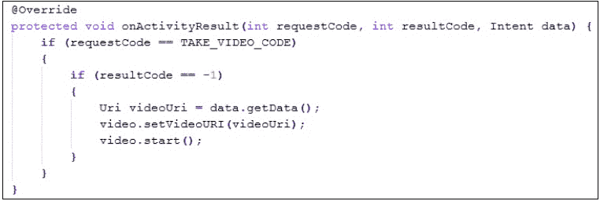

# 前言

Android 是一项新兴技术，Google Play 市场上有很多应用程序。到目前为止，它是智能手机技术中最大的奇迹，推动着越来越多的开发者从事 Android 开发。意图是任何 Android 应用程序的重要组成部分，没有使用意图的 Android 应用程序是不完整的。通过使用意图，你的 Android 应用程序可以轻松地实现监听广播、发送消息、通过社交网络分享、发送通知以及访问摄像头、传感器和 Wi-Fi 等硬件组件等功能。

《学习 Android 意图》专注于使用意图来充分利用 Android 平台的各种功能。它非常适合那些想要了解 Android 意图的框架和领域、它的强大功能以及在 Android 应用程序内部的需求的开发者。全书使用实用的深入示例来帮助理解使用意图的关键概念。

本书从介绍 Android 的基本概念及其各种事实和数据开始，例如不同的 Android 版本、它们的发布日期以及 Android 设备的演变。在介绍基本技术概念的同时，从最简单的 Android 意图介绍途径逐步过渡到从组件和功能的角度更实际地看待 Android 意图。

在这本书中，你将学习如何使用不同的组件和功能，例如在活动之间传输数据、调用 Android 的各种功能和组件、执行不同的内置和自定义服务、访问 Android 设备的硬件和软件组件以及发送通知和闹钟。你将获得关于 Android 意图背后概念的理论知识，以及使用 Android 意图以移动高效方式执行特定任务的实际知识。

在书的最后，你将对 Android 意图及其功能有一个清晰的认识和实际掌握。

# 本书内容

第一章，*理解 Android*，涵盖了 Android 系统的基本知识和关键概念，它的版本、Android 操作系统的简要历史、Google Play 市场和 Android Studio。这一章还从开发的角度涵盖了主题，包括 Android 应用程序的构建块、活动生命周期及其回调方法。

第二章，*Android 意图介绍*，涵盖了意图的介绍、意图的基本关键概念、意图在 Android 应用程序中的作用、意图的技术概述、`android.content.Intent`类中使用对象及其结构。此外，这一章还解释了两个实际示例，说明如何使用意图从一个活动导航到另一个活动。

第三章，*意图及其分类*，更详细地介绍了意图，并扩展了它们的类别，如显式意图和隐式意图。本章还提供了使用意图的实际实现示例，例如与其他应用共享数据、从其他 Android 应用获取共享数据、从图库中选择图片以及通过意图启动活动或服务。

第四章，*移动组件的意图*，涵盖了每个 Android 设备中最常见硬件组件的基本知识，如 Wi-Fi、蓝牙、蜂窝数据、全球定位系统（GPS）、地磁场和运动位置传感器。之后，本章详细介绍了意图与这些硬件组件的角色，以及使用意图的实际示例，包括打开/关闭蓝牙、使设备可被发现、打开/关闭 Wi-Fi、打开 Wi-Fi 设置、拍照、录视频以及执行语音识别和文本到语音转换。

第五章，*使用意图进行数据传输*，深入探讨了使用意图进行数据传输的细节。本章讨论了通过不同方法在活动之间传输数据，使用`Intent`类的`putExtra()`方法进行简单的数据传输，通过`Parcelable`和`Serializeable`类对象发送自定义数据对象，以及 Android 系统中数据传输的一些场景。

第六章，*使用意图访问 Android 功能*，涵盖了 Android 操作系统中最常见的软件功能，如布局、显示、连接性、通信、可访问性、触摸和硬件支持。本章讨论了两个重要的`AndroidManifest`标签，`<uses-feature>`和`<uses-permission>`，它们的使用，以及将这些标签与移动硬件组件和 Android OS 功能进行比较。本章提供了在 Android 应用程序中使用意图的实际示例实现，如拨打电话、发送短信/MMS 消息、确认消息送达、接收消息以及使用自定义布局发送通知。

第七章，*意图过滤器*，详细介绍了意图和意图过滤器，以及它们如何向 Android 操作系统提供关于应用内部存在的活动信息。本章还涵盖了过滤器测试的细节，例如动作测试、数据测试、类别测试，以及在使用意图时这些测试的便利性。

第八章，*广播意图*，涵盖了 Android 中的广播以及广播意图。本章讨论了 Android 操作系统的系统广播意图，例如电量低、电源连接/断开、启动完成以及耳机插入/拔出等，并附有一些意图的实际示例实现。此外，本章还介绍了自定义广播意图及其在各种情况下的实际应用示例。

第九章，*意图服务与待定意图*，涵盖了意图的一些最先进的话题，例如与常见的`Thread`、`Service`或`AsyncTask`方法相比，使用`IntentService`对象。本章介绍了`PendingIntent`对象及其在实际示例实现中的使用。

# 您阅读本书所需的内容

为了执行书中各种示例，所需的软件包括任何 Android 开发 IDE，最好是带有最新 Android SDK 的 Eclipse IDE 或 Android Studio（在撰写本书时处于预览发布状态）。

# 本书的目标读者

《学习 Android 意图》面向希望扩展他们对 Android 意图知识的初学者或中级开发者。我们期望读者具备 Android 开发的基本了解，包括如何使用不同的 Android IDE 以及如何使用原生 Android SDK API 开发应用程序。

这本书对每个 Android 应用开发者都很有用。从最初几章开始，读者将开始学习意图的基础知识，即使是中级开发者也会在整本书中找到有用的提示。随着读者章节的深入，将涵盖更难的主题；因此，初学者不要跳过内容非常重要。

建议读者具备 Java 编程语言和 Android 开发的基本理解。

# 约定

在这本书中，您会发现多种文本样式，用于区分不同类型的信息。以下是一些样式示例及其含义的解释。

文本中的代码字如下所示："为了创建一个活动，我们将从`Activity`类扩展我们的类并覆盖`onCreate()`方法。"

代码块设置如下：



还可以是以下格式：

```kt
public class Activity1 extends Activity {

  @Override
  protected void onCreate(Bundle savedInstanceState) {
    super.onCreate(savedInstanceState);
    setContentView(R.layout.main_first);
```

**新术语**和**重要词汇**以粗体显示。例如，在菜单或对话框中屏幕上看到的单词，会在文本中以这样的形式出现："点击**下一步**按钮会将您带到下一个屏幕"。

### 注意

警告或重要注意事项会以这样的框出现。

### 提示

提示和技巧会像这样出现。

# 读者反馈

我们非常欢迎读者的反馈。请告诉我们您对这本书的看法——您喜欢或可能不喜欢的地方。读者的反馈对我们来说非常重要，它帮助我们开发出您真正能够充分利用的图书。

如果您想要发送一般反馈，只需发送电子邮件到`<feedback@packtpub.com>`，并在邮件的主题中提及书名。

如果您在某个主题上有专业知识，并且对撰写或参与书籍有兴趣，请查看我们在[www.packtpub.com/authors](http://www.packtpub.com/authors)上的作者指南。

# 客户支持

既然您已经拥有了 Packt 的一本书，我们有一些事情可以帮助您最大限度地利用您的购买。

## 下载示例代码

您可以从您的账户[`www.packtpub.com`](http://www.packtpub.com)下载您购买的所有 Packt 图书的示例代码文件。如果您在其他地方购买了这本书，可以访问[`www.packtpub.com/support`](http://www.packtpub.com/support)注册，我们会直接将文件通过电子邮件发送给您。

## 错误更正

尽管我们已经尽力确保内容的准确性，但错误仍然会发生。如果您在我们的书中发现错误——可能是文本或代码中的错误——我们非常感激您能向我们报告。这样做，您可以避免其他读者感到沮丧，并帮助我们改进该书的后续版本。如果您发现任何错误，请通过访问[`www.packtpub.com/submit-errata`](http://www.packtpub.com/submit-errata)，选择您的书籍，点击**错误更正提交表单**链接，并输入您的错误详情。一旦您的错误更正得到验证，您的提交将被接受，错误更正将会上传到我们的网站，或添加到该标题下的现有错误更正列表中。任何现有的错误更正都可以通过从[`www.packtpub.com/support`](http://www.packtpub.com/support)选择您的标题来查看。

## 盗版

互联网上版权材料的盗版问题在所有媒体中持续存在。在 Packt，我们非常重视保护我们的版权和许可。如果您在互联网上以任何形式遇到我们作品非法副本，请立即提供位置地址或网站名称，以便我们可以寻求补救措施。

若发现疑似盗版材料，请通过`<copyright@packtpub.com>`联系我们，并提供相关链接。

我们感谢您帮助我们保护作者以及我们为您带来有价值内容的能力。

## 常见问题

如果您在书的任何方面遇到问题，可以通过`<questions@packtpub.com>`联系我们，我们将尽力解决。
