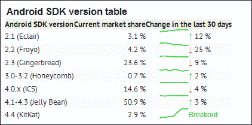
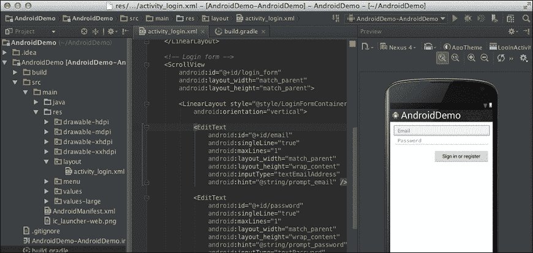
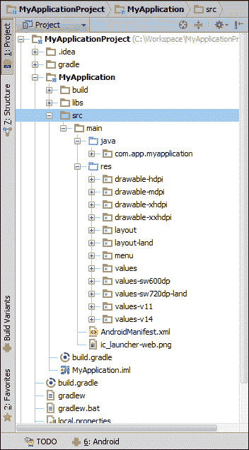
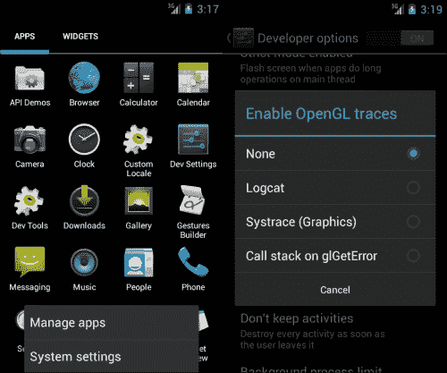
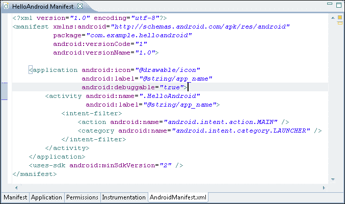
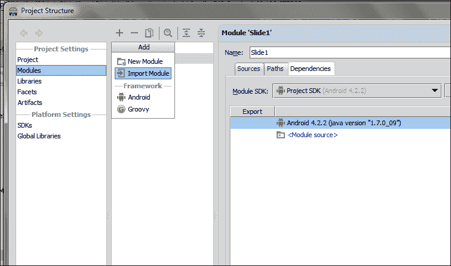
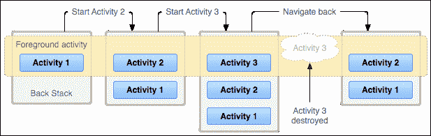
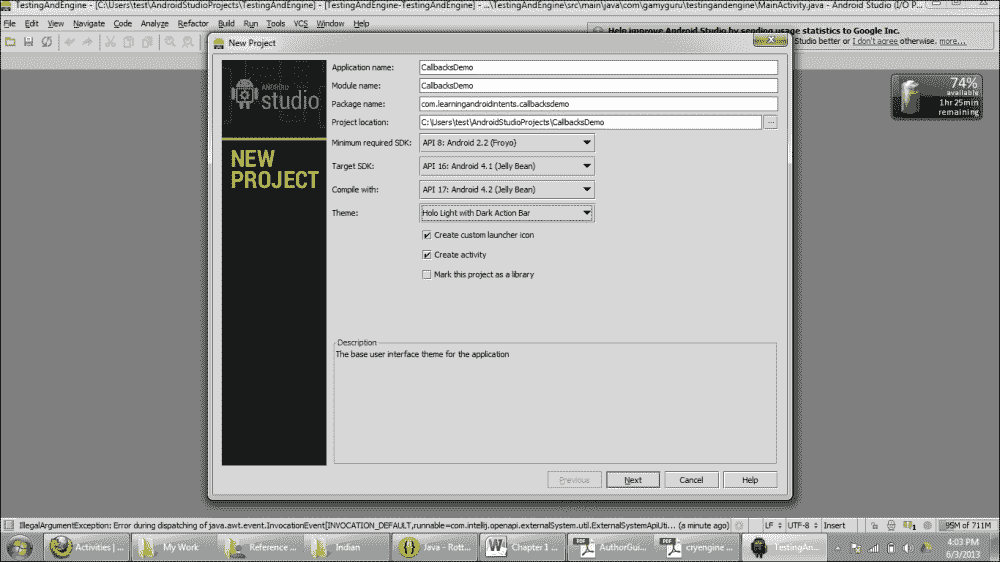
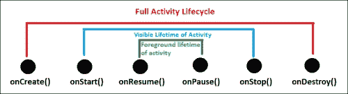
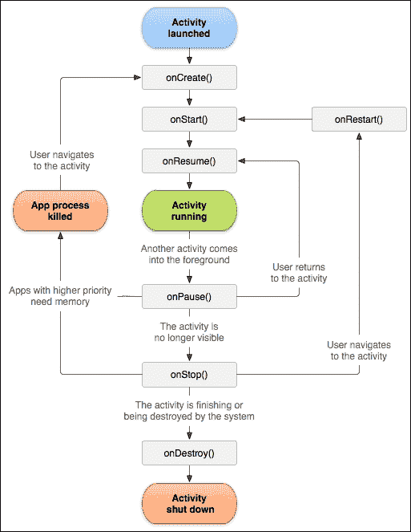

# 第一章：了解安卓

本章为您提供了关于安卓的强大理论知识。很明显，这个术语对于任何新手技术用户来说都不陌生。由于这个伟大的操作系统普及，许多开发者开始从网页开发和其他平台转移过来。这次大规模的迁移为安卓应用市场带来了显著变化，并为新的移动应用开发者开启了无限的新大门。安卓是苹果公司 iOS 操作系统的一个强大的对手。然而，正如统计数据所示，在收入方面，安卓正在追赶 iOS 市场，因为谷歌 Play 是下载总量方面增长最快的应用市场。

本章包括以下主题：

+   介绍安卓

+   了解安卓的为什么和何时

+   安卓开发者的官方谷歌 IDE——安卓工作室

+   安卓应用程序的结构

+   展示安卓活动生命周期

# 介绍安卓

安卓是一个基于 Linux 的操作系统，因此它是一款开源软件。谷歌将其许可协议在 Apache 许可协议下发布。安卓代码的可用性使得它成为一个易于修改的操作系统，供应商也可以对其进行定制。由于其高度灵活的设计，一些批评者称它不安全，在一段时间内这是正确的，但现在，安卓已经是一个具有高级安全架构的成熟操作系统。据说最新的安卓版本（即果冻豆）是谷歌有史以来生产的最安全的操作系统。下面让我们通过了解不同版本的安卓操作系统来进一步了解。

## 探索不同的安卓版本

自从发布以来，安卓通过不同版本的发布一直在进行自我转变。不仅仅是 UI，每个新版本都增加了许多功能，进行了修改和增强。第一个正式使用甜点名称的版本是安卓 1.5 纸杯蛋糕，基于 Linux 2.6.27。每个新的安卓版本都伴随着一组新的 API 级别，这基本上是对以前的 API 进行一些修改，过时处理，以及新增新的控件。

从开发者的角度来看，发布安卓新版本带来了一些旧方法/功能的过时。然而，这将带来警告而不是错误；你仍然可以在新的 API 级别中使用以前的方法调用。

下表展示了不同安卓版本及其 API 级别和主要亮点：

| 安卓版本 | 版本名称 | 主要功能 | API 级别 | 发布日期 |
| --- | --- | --- | --- | --- |
| 安卓 4.1/4.2/4.3 | 果冻豆 | 谷歌即时语音搜索锁屏小部件速度提升键盘中的手势输入（仅限开发者）安全的 USB 调试 OpenGLES 3.0 支持改进的相机用户界面从右至左语言支持 | 16, 17 和 18 | 2012 年 7 月 9 日，2012 年 11 月 13 日，2013 年 7 月 24 日 |
| 安卓 4.0 | Ice Cream Sandwich | 重大 UI 变化增强锁屏操作屏幕方向动画带 EAS v14 的邮件应用面部解锁增强的网页浏览器支持平板和手机 | 14 和 15 | 2011 年 10 月 19 日 |
| 安卓 3.x | Honeycomb | 首个为平板设计的操作系统增加系统栏和动作栏快速访问相机及其功能双窗格邮件 UI 视图多核支持 | 11、12 和 13 | 2011 年 2 月 22 日 |
| 安卓 2.3 | GingerBread | 增强的 UI 原生 VoIP/SIP 支持 Google Talk 和 Google Wallet 视频通话支持 | 9 和 10 | 2010 年 12 月 6 日 |
| 安卓 2.2 | Froyo | 提升了速度 USB 网络共享 JIT 实现 | 8 | 2010 年 5 月 20 日 |
| 安卓 2.0/2.1 | Eclair | 更新的 UI 动态壁纸蓝牙 2.1 | 5、6 和 7 | 2010 年 1 月 12 日 |
| 安卓 1.6 | Donut | 手势识别 | 4 | 2009 年 9 月 15 日 |
| 安卓 1.5 | Cupcake | 键盘文本预测录制和观看视频 | 3 | 2009 年 4 月 30 日 |

### 注意

有趣的是，安卓系统的版本是按字母顺序排列的。从 Apple Pie 1.0 开始，然后是 Banana Bread 1.1，按字母顺序连贯地发展到了 Jelly Bean，并保持了这一传统；预计下一个版本将是 Key Lime Pie。

如前所述，由于安卓的开源性质，厂商可以对其进行修改，许多著名的手机制造商都在自己的手机中安装了定制版的安卓系统。例如，三星在安卓上制作了自定义触摸界面，称之为 TouchWiz（三星 Galaxy S4 配备了 TouchWiz Nature UX 2.0）。同样，HTC 和索尼 Xperia 也推出了自己的定制用户界面，分别称之为 HTC Sense 和 TimeScape。


## Google Play – 安卓官方应用商店

与其他著名的移动操作系统一样，安卓也有自己的应用商店，名为 Google Play。此前，应用商店被称为 Android Market，在 2012 年初，更名为 Google Play，用户体验得到了新的改进。该更新将整个娱乐世界统一在 Google Play 之下。音乐、应用、书籍和电影，都变得像苹果著名的 App Store（iTunes）一样易于用户访问。您可以在[`play.google.com/about/`](http://play.google.com/about/)上详细了解安卓商店的信息。

### 注意

Google Movies & TV、Google Music、Google Books 和 Google Magazines 仅在部分国家可用。

Google Play 提供各种应用、电影、电子书和音乐。最近，他们还在同一应用商店下推出了 Google Play TV 服务。谈到应用方面，Google Play 提供了不同的类别供用户选择应用。从游戏到漫画，再到社交应用，应有尽有。用户可以享受许多付费应用，并通过 Google Play 提供的应用内购买服务解锁许多功能。

还有不同的厂商特定的应用商店，如 Kindle 的亚马逊应用商店、Nook 商店等，它们根据自身的条款和条件提供许多应用程序。

# 理解 Android 的为何与何时

Android 是基于 Linux 的开源操作系统，主要针对触屏手机和平板电脑。安迪·鲁宾、Rich Miner、Nick Sears 和 Chris White 在 2003 年 10 月创立了这个操作系统。Android 背后的基本意图是开发一个用于数字内容的操作系统。这是因为当时，手机使用的操作系统是 Symbian 和 Windows Mobile。

### 注意事项

2007 年 6 月，苹果公司推出了 iPhone。2007 年 11 月，谷歌公司推出了 Android。

然而，当他们意识到像相机这样的设备市场并不大时，他们将注意力转向了对抗 Symbian 和 Windows Mobile 的手机。当时 iPhone 还没有上市。作为当今智能手机操作系统市场的佼佼者，占据 75%市场份额的 Android Inc.当时还在秘密运行。除了他们在开发手机软件之外，没有向市场透露任何信息。同年，Android 的联合创始人鲁宾资金耗尽，他的好朋友 Steve Perlman 给他带来了一封装有 10,000 美元现金的信封。

2005 年 8 月，谷歌公司收购了 Android Inc.，使其成为谷歌公司的子公司。收购后，Android 的主要员工留在了 Android Inc.。安迪·鲁宾开发了一个由 Linux 内核提供支持的移动设备平台。谷歌向手机制造商和运营商承诺提供一个灵活且可升级的操作系统。由于谷歌没有在媒体上发布关于 Android 的消息，谣言开始传播。流传的猜测包括谷歌正在开发谷歌品牌的手机，谷歌正在定义手机原型和技术规格。这些猜测和谣言一直持续到 2006 年 12 月。

后来，在 2007 年 11 月，开放手机联盟透露他们的目标是开发移动设备的开放标准。Android 作为他们的首款产品发布，这是一个基于 Linux 内核版本 2.6 构建的移动设备平台。开放手机联盟是由 65 家参与移动领域的公司组成的联盟，倡导移动行业的开源标准。

2008 年 10 月，首款搭载 Android 操作系统的商业手机由 HTC 推出，名为 HTC Dream。下图展示了 HTC Dream。自那时起，Android 一直在进行升级。谷歌在 2010 年推出了 nexus 系列。


HTC Dream，首款使用 Android Activity 堆栈的 Android 手机

## Android 操作系统的演变

安卓操作系统在 HTC Dream 首次亮相后，迅速在消费者中获得了普及。谷歌不断升级安卓系统。每个主要版本都包括修复上一个版本的 bug 和新增功能。

安卓在 2008 年 9 月发布了第一个版本，设备为 HTC Hero。安卓 1.1 是一个修复了 bug 和问题的更新，没有主要版本发布。在安卓 1.1 之后，发布了名为 Cupcake 的安卓 1.5 版本，增加了视频上传、文本预测等功能。2009 年底发布了安卓 1.6 Donut 和安卓 2.0/2.1 Éclair 版本，2010 年 1 月发布的 2.1 版本引入了包括 Google Maps、增强的照片视频功能、蓝牙、多点触控支持、动态壁纸等重大更新。2010 年 5 月，名为 Frozen Yogurt（或 Froyo）的安卓 2.2 版本成为主要发布，增加了对 Wi-Fi 热点连接的支持。

这个版本在开发者中变得非常流行，通常被用作安卓应用的最小 API 级别。2010 年 5 月发布的安卓 2.3 Gingerbread 版本引入了近场通信（NFC）功能，允许用户执行如移动支付和数据交换等任务。这个版本的安卓成为了开发者中最受欢迎的版本。专为平板设备优化的安卓 3.0/3.1 Honeycomb 版本，为开发者提供了更多的 UI 控制，这是一个很大的优势。2011 年 10 月发布的安卓 4.0 Ice Cream Sandwich 版本。由于安卓 3.0/3.1 仅适用于平板电脑，Ice Cream Sandwich 版本弥补了这一差距，同时支持手机和平板电脑。最新的安卓版本，安卓 4.2 Jelly Bean 进一步提升了 UI，优化了软件，还有其他改进。

### 注意

谷歌从安卓 1.1 版本开始，按照字母顺序以甜点命名安卓版本。

下图以视觉格式展示了所有版本：


下面的截图显示了 2013 年 3 月安卓版本的当前分布情况。从截图中可以看出，安卓 2.3 Gingerbread 是最受欢迎的版本，其次是安卓 4.0 Ice Cream 版本。



安卓版本的当前分布

# 谷歌官方 IDE - 安卓工作室

在 2013 年谷歌 I/O 大会之前，安卓官方一直使用 Eclipse 作为其开发 IDE。官方安卓支持明确提到了这款 IDE 与**安卓开发工具**（**ADT**）和**安卓软件开发工具包**（**SDK**）及其文档的使用。


安卓工作室（Windows 7）的加载屏幕

在 2013 年的谷歌 I/O 大会上，谷歌推出了一款专为安卓应用开发设计的新 IDE。这个 IDE 被称为 Android Studio，它是一款基于 IntelliJ 的软件，为开发者提供了许多有前景的功能。

## 安卓工作室的特点

Android Studio 在 IntelliJ-based IDE 的基础上提供了各种功能。以下是 Android Studio 中引入的功能列表：

+   Android Studio 内置了 Android 开发工具

+   Android Studio 提供基于 Gradle 的构建支持

+   用于构建 Android UI 的灵活控制，并支持不同屏幕尺寸的同步视图

+   Android 重构、快速修复以及技巧和窍门

+   带有拖放功能的 Android 应用高级 UI 制作工具

下面的截图展示了带有 UI 制作器的 Android Studio 多屏幕查看器：



### 注意事项

当前 Android Studio 的版本是 v0.1.1。

此外，Android Studio 还提供了许多其他功能。谷歌在发布时提到，版本（v0.1）不稳定，需要在进行 100% 准确使用之前进行各种修复。

## Android Studio 的限制

Android Studio 处于早期阶段，这使得它成为一款成熟度低且有限制的软件。根据谷歌的说法，他们正在努力更新该软件，并很快将纠正这些问题。在版本 0.1.1 中，开发者面临的问题如下：

+   Android Studio 只能编译为 Android 4.2 Jelly Bean

+   用户界面只能使用 Android 4.2 Jelly Bean 的 UI 和小部件来制作

+   Eclipse 项目不能直接导入到 Android Studio（参考 [`developers.android.com/`](http://developers.android.com/)）

+   导入库项目时的错误

# Android 应用的构建块

Android 应用由多种构建块组成，帮助开发者保持事物的组织性。它提供了维护资产、图片、动画、视频片段以及实现本地化功能的灵活性。此外，还有一些组件包含有关您的应用程序支持的最小和最大 Android 版本的信息。同样，菜单在 Android 应用项目中是单独处理的。



在 Android Studio 中显示的 Android 应用程序的各种组件

与 Eclipse IDE 类似，Android Studio 提供了各种便捷的功能来操作这些特性。展望 Android 应用的构建块，我们可以将这些组件分为以下部分：

+   编码组件

+   媒体组件

+   XML 组件

+   引用组件

+   库组件

## 编码组件

将组件分解有助于更容易理解 Android 应用的结构。编码组件与 Android 项目的源代码直接相关。为了编写应用程序，开发者需要编写一些代码，以响应用户的期望。

在编码组件中，保存所有开发者代码的主要文件夹是`src`。该文件夹包含一个或多个 Java 包，开发者根据所完成工作的类型对代码进行分类。编写包名称的默认方式是用点分隔（例如，`com.app.myapplicationproject`），这样可以轻松将其与其他任何项目的任何其他包区分开来。

### 注意

Android 应用程序的包名称用于在 Google Play 上唯一标识它。

在这些包内，有`.java`文件，供开发者从 Android 库引用并继续到期望的输出。这些 Java 类可能继承自 Android API，也可能不继承。我们还可以在编写代码时使用大多数 Java 函数。

## 媒体组件

由于高度配置的硬件，用户需要具有良好图形、动画、声音和视频文件的应用程序。因此，你可以轻松引入任何一种，但应确保它们都不应影响应用程序的质量，因为市面上有数千种不同类型的 Android 设备。Android 提供了一种灵活的方法，你可以使用它将媒体文件放置在项目内。按分类，有两种在应用程序项目中维护媒体文件的方法：

+   `Assets`文件夹

+   `res`文件夹

### `Assets`文件夹

Android 项目包含一个名为`assets`的文件夹。这个文件夹负责保存所有媒体文件，包括音乐、图片等。开发者可以通过在继承的`Activity`类中编写`getAssets()`函数直接从代码访问文件夹。这个函数返回`AssetManager`，可以轻松地用来访问主`assets`文件夹内的子文件夹和文件。

`assets`文件夹的主要优点是无需为放置的文件保持引用，这对于开发者需要进行测试和运行时更改的情况非常方便。尽管它没有任何引用，但由于输入错误，它可能会引入错误。使用资源的另一个优点是开发者可以根据自己的意愿来安排文件夹；同样，这些文件夹的命名约定也可以根据开发者的方便轻松选择。

### `res`文件夹

`res`文件夹用于管理 Android 应用程序中的应用程序资源，如媒体文件、图片、用户界面布局、菜单、动画、颜色和字符串（文本）；换句话说，你可以认为这是处理媒体文件的最智能方式。它包括许多子文件夹，如`drawable`、`drawable-ldpi`、`drawable-mdpi`、`drawable-hdpi`、`drawable-xhdpi`、`drawable-xxhdpi`、`raw`、`layout`、`anim`、`menu`和`values`。

**Drawable**与 Android 项目中使用的图片直接相关。这是一种在项目中保存图片的智能方式。我们知道市场上存在各种支持 Android OS 的设备。为了区分这些设备，低分辨率的图片被放在`ldpi`文件夹中，供低分辨率设备使用。同样，`mdpi`文件夹适用于中等屏幕密度的设备，`hdpi`适用于高密度设备，`xhdpi`适用于超高密度设备，依此类推。

### 提示

放在这些 drawable 文件夹中的图片应该有唯一的名称，以便从代码中通过单一引用来访问它们。

同样，为了放置音乐和声音内容，我们使用`raw`文件夹以便从代码中访问它们。除了音乐和声音之外，任何其他文件也可以放在`raw`文件夹中（例如，JSON 文件）。`anim`、`values`、`menus`和`layout`文件夹也是如此，分别用于放置动画、值、自定义菜单和不同类型的布局。 

## XML 组件

在 Android 中，开发者需要使用 XML 来创建用户界面。布局、菜单、子菜单以及许多其他内容都是以不同的 Android 标签形式基于 XML 定义的。除了布局，你还可以以 XML 文件的形式存储字符串、颜色代码等许多其他内容。该组件支持维护应用程序的层次结构，使所有开发者易于理解。

让我们看一下一些最重要的 XML 文件，它们是任何 Android 应用程序的支柱。

### 布局文件夹

在`res`文件夹内，有一个名为`layout`的文件夹，其中包含了所有活动的布局。需要注意的是，这个文件夹也有一些扩展，就像 drawable 文件夹一样。`layout-land`和`layout-port`方法分别用于在横屏和竖屏模式下保持布局的良好组织。

### 提示

XML 还可以用于创建自定义 drawable，这些 drawable 可以在不同场景下作为图片使用。例如，可以使用 XML 制作自定义按钮的图片，它会在点击和未点击状态下呈现不同的 UI 行为。

前面的截图是 Android Studio 的界面，你可以看到一个`activity_main.xml`文件，该文件用于描述一个活动的布局。有一些 Android 定义的 XML 标签用于`RelativeLayout`和`TextView`（阅读下面的信息框）。同样，还有一些其他标签供开发者使用，以便在布局中包含不同类型的控件。

### 注意

`RelativeLayout`是一个布局，其中子元素按照相对位置进行放置。这个布局经常被 Android 移动开发者使用。

`TextView`是用于显示文本（包括数字、字符串和可编辑内容）的视图之一。

### 菜单文件夹

Android 提供了不同类型的菜单，以便在活动中快速访问常用的功能。可用的不同菜单如下：

+   上下文菜单

+   选项菜单（带操作栏）

+   弹出菜单

+   自定义菜单

由于本章的重点有限，我们无法完全展开讨论各种菜单的功能并给出示例。然而，所有类型的菜单都基于 XML 文件，在这些文件中，使用 Android 定义的标签如`<menu>`、`<item>`和`<group>`来引入应用程序中的菜单。以下截图供参考：



Android ICS 选项菜单在左侧，自定义弹出菜单在右侧

### `values`文件夹

`values`文件夹包含各种 XML 文件，开发者在许多场景下都可以使用它们。这个文件夹中最常见的文件是`styles.xml`和`strings.xml`。`style`文件包含与任何 UI 样式相关的所有标签。同样，`strings.xml`文件包含在 Android 项目的源代码中使用的所有字符串。除此之外，`strings.xml`文件还包含`<color>`标签的哈希编码，用于在 Android 应用程序的源代码中识别许多颜色。

### AndroidManifest.xml

与前面提到的文件夹不同，`AndroidManifest.xml`是一个包含关于 Android 应用程序重要信息的文件。清单文件由各种标签组成，如`<application>`、`<uses-sdk>`、`<activity>`、`<intent-filter>`、`<service>`等，它们都被包含在`<manifest>`主标签内。

正如标签所示，这个 XML 文件包含了关于活动、服务、SDK 版本以及与应用程序相关的所有信息。如果你在`AndroidManifest.xml`文件中输入的信息不正确或遗漏了任何内容，可能会出现各种错误。

`AndroidManifest.xml`文件的另一个主要优点是，它是跟踪任何 Android 应用程序结构最佳方式。通过这个文件，可以轻松查看活动、服务和接收器的总数。除此之外，我们只需调整`AndroidManifest.xml`文件，就可以更改样式、字体、SDK 限制、屏幕尺寸限制以及许多其他功能。

在签名`.apk`构建时，我们会提到包名、版本名称和版本代码，Google Play 通过这些信息来唯一标识应用程序并将其发布到市场。应用程序将通过这个包名被识别，后续的发布基于在`AndroidManifest.xml`文件中更改版本代码和版本名称。



## 引用组件

安卓应用程序的另一个基本组件是引用组件。简单来说，这个组件帮助基于 XML 的文件与 Java 代码进行交互。在 Android Studio 中，`R.java`文件位于源文件夹下，该文件夹是项目层次结构中构建文件夹的子文件夹。`R.java`文件包含了所有在 XML 文件中用于布局、菜单、可绘制资源、动画等的引用。然后，此文件向活动文件公开，以获取引用并获取执行各种功能和参数的对象。

通常，这个`R.java`文件是作为项目导入的一部分获得的，并用作`R.layout.main`。在这个例子中，它清楚地表明我们需要获取`res`布局文件夹中的一个名为`main`的布局。因此，它将返回一个资源 ID，这个 ID 对开发者是隐藏的，并直接引用`res`文件夹中的特定布局。

### 注意

在构建项目时，`R.java`文件会自动生成。因此，它不应该被推送到仓库中。确保不要手动修改`R.java`文件的内容。项目`gen`文件夹中存在的`R.java`文件是在项目创建或编译时由安卓定义的。

## 库组件

库是预构建的 Java 文件/项目，任何人都可以使用它们在应用程序内执行特定任务。有许多第三方付费/免费的库，为开发者提供各种功能。库组件本身不是库；它们是保存库的项目文件夹。

在安卓项目中，主应用文件夹（Android Studio）内有一个名为`libs`的文件夹，用作库组件。任何`.jar`库文件都可以放在这个文件夹下，以便从代码中引用。在使用这些库的 Java 代码中，需要导入`.jar`文件中存在的相应包名称，才能使用该特定类的功能。

同样，你可以通过将其他安卓项目作为一个模块并导入到你的项目中，来使用它作为库。这个功能在 Eclipse 中以前被称为库项目，通过**项目属性** | **安卓** | **库引用**进行导入。



安卓 Studio 模块导入窗口

# 安卓活动生命周期

一个 Android 应用程序由一个或多个活动组成。这些活动在执行任务、接收用户输入和向用户展示结果时的转换流程中，是应用程序的可视化表现。每个活动在屏幕上为用户提供了一个可视化的交互界面。Android 按照后进先出的原则，将所有活动保存在后退栈中。每当新活动启动时，当前活动就会被推入后退栈。因此，Android 将焦点转移到新活动上。活动可以占据设备的整个屏幕，也可以只占用屏幕的一部分，或者还可以被拖动。无论活动是占据整个屏幕区域还是屏幕的一小部分，在 Android 中一次只会有一个活动获得焦点。当任何现有活动停止时，它会被推入后退栈，这反过来又导致下一个顶部活动获得焦点。

### 注意

Android 4.x 版本引入了片段（Fragments）。片段可以被视为子活动，它们被嵌入到活动中，以在单个活动中同时执行不同的任务，与活动不同。

通常，一个 Android 应用程序由多个活动组成。这些活动之间是松散耦合的。最佳实践是为每个要执行的具体任务创建一个活动。例如，在一个简单的电话拨号应用中，可能会有一个活动显示所有联系人，一个显示任意特定联系人的完整联系信息，一个用于拨号，等等。在所有应用中，都有一个主活动，它作为应用的启动点。当应用启动时，这个活动就会开始运行。然后这个活动会启动另一个活动，后者再启动其他活动，依此类推。Android 通过后退栈管理所有活动。



Android 活动后退栈

前面的图示展示了后台堆栈如何工作的简单表示。堆栈中突出显示的顶部活动代表前台活动，有时也称为焦点活动或运行活动。当一个新活动被创建时，它被推入堆栈；当一个现有活动被销毁时，它从堆栈中移除。这个被推入堆栈和从堆栈中移除的过程由 Android 的活动生命周期管理。这个生命周期被称为活动生命周期。生命周期管理堆栈中的活动，并通过回调方法通知活动状态的变化。由于状态变化，活动会接收到诸如活动创建、活动销毁等不同类型的状态。开发者重写这些回调方法以执行相应状态变化所需的步骤。例如，当活动开始时，应加载必要的资源；当活动被销毁时，应卸载这些资源以获得更好的应用性能。所有这些回调方法在管理活动生命周期方面都扮演着关键角色。开发者可以选择不重写、重写部分或全部方法。

## 活动的基本状态

基本上，活动存在三种状态：`Resumed`（恢复），`Paused`（暂停），和`Stopped`（停止）。当活动恢复时，它显示在屏幕上并获得用户的焦点。这个活动保持在后台堆栈的前台部分。当另一个活动开始并在屏幕上可见时，这个活动就会被暂停。这个活动仍然在前台任务中，仍然存活，但它没有获得任何用户焦点。也有可能是新活动部分覆盖了屏幕。在这种情况下，暂停活动的部分仍然会在屏幕上可见。当活动完全从屏幕上消失并被前台另一个活动替换时，它进入停止状态。在这个停止状态下，活动仍然存活，但在后台堆栈的背景部分。暂停状态和停止状态之间的区别在于，在暂停状态下，活动附着在窗口管理器上，但在停止状态下，它没有附着在窗口管理器上。

### 注意

在极端低内存的情况下，Android 系统可能会通过要求其完成或直接杀死进程来杀死任何暂停或停止的活动。为了避免这个问题，开发者应该在暂停和停止的回调中保存所有必要的数据，并在恢复回调中检索这些数据。

## 活动生命周期的回调方法

当任何活动的状态发生改变时，会有各种回调方法被调用。开发者在这些方法中执行必要的任务和操作，以提高应用的性能。为了展示活动生命周期的实际应用，我们将在本节中创建一个小的 Android 应用程序。以下是逐步操作的步骤：

1.  启动**Android Studio**。

1.  创建一个空项目，详细信息如下截图所示：

    Android Studio 中的新建项目对话框

1.  在项目的`MainActivity.java`文件中添加以下代码：

    ```kt
    package com.learningandroidintents.callbacksdemo;
    import android.os.Bundle;
    import android.app.Activity;
    import android.view.Menu;
    import android.widget.Toast;
    public class MainActivity extends Activity {

     @Override
            public void onCreate (Bundle savedInstanceState){
                super.onCreate(savedInstanceState);
                Toast.makeText( this, "Activity Created!", Toast.LENGTH_SHORT
                ).show();
            }
    @Override
            protected void onStart ()
            {
                super.onStart();
                Toast.makeText(this, "Activity Started!", Toast.LENGTH_SHORT
                ).show();
            }

     @Override
            protected void onResume()
            {
                super.onResume();
                Toast.makeText(this, "Activity Resumed!", Toast.LENGTH_SHORT
                ).show();
            }

    @Override
            protected void onPause()
            {
                super.onPause();
                Toast.makeText(this, "Activity Paused!", Toast.LENGTH_SHORT
                ).show();
            }

    @Override
            protected void onStop()
            {
                super.onStop();
                Toast.makeText(this, "Activity Stopped!", Toast.LENGTH_SHORT
                ).show();
            }

    @Override
            protected void onDestroy()
            {
                super.onDestroy();
                Toast.makeText(this, "Activity Destroyed!", Toast.LENGTH_SHORT
                ).show();
            }
        }
    ```

1.  在模拟器中运行项目，你会看到以下顺序在屏幕上打印提示：

    +   活动创建

    +   活动启动

    +   活动恢复

    +   活动暂停

    +   活动停止

    +   活动销毁

让我们看看之前提到的代码是如何工作的。

当你运行项目时，模拟器将按照之前给出的顺序在屏幕上显示所有的提示。在项目开始时，会创建一个活动，然后启动该活动。活动启动后，它会在屏幕上显示，并且模拟器会打印**恢复**。现在，我们通过按后退键返回，Android 系统准备结束该活动。因此，活动首先会被暂停，然后停止，最后被销毁。所有这些回调一起被称为活动生命周期。活动生命周期从`onCreate()`方法开始，在`onStop()`方法结束。活动从`onStart()`方法到`onStop()`方法是可见的，并且从`onResume()`方法到`onPause()`方法活动保持在前台。下图展示了这个周期的分布：



## 活动生命周期流程

到目前为止，我们已经讨论了使用的生命周期回调方法、它们的状态和目的。现在，我们将探讨回调方法的流程。在 Android 中，当一个活动被启动时，已经打开的活动会被停止，这种活动的变化是按流程发生的。下图展示了活动生命周期的可视化流程图：



回调方法用矩形表示。活动生命周期的第一步是创建一个活动。如果同一任务中没有运行该活动的实例，Android 会创建一个活动。`noHistory`标签不允许有多个活动，它会决定活动是否会有历史痕迹（参考[`developer.android.com/guide/topics/manifest/activity-element.html#nohist`](http://developer.android.com/guide/topics/manifest/activity-element.html#nohist)），您可以通过`android:launchmode`标志标签确定多个实例。将此标签的值设为`true`意味着在堆栈中只创建一个活动实例，并且每次调用活动意图时，都会将同一实例推送到堆栈顶部以在屏幕上显示活动。

在`onCreate()`方法之后，会调用`onStart()`方法。这个方法负责初始化设置，但最佳实践是在`onResume()`方法中进行配置，该方法是继`onStart()`之后被调用的。请记住，前台阶段是从`onResume()`方法开始的。假设用户在电话中接到一个电话，那么这个活动将通过`onPause()`方法暂停。因此，在活动暂停时涉及存储必要数据的所有步骤都应该在这里完成。在关键内存情况下，这个方法可能非常有用，因为在这种情况下，Android 可能会停止暂停的活动，这反过来可能会导致应用程序出现意外行为。如果活动因关键内存情况被杀死，那么会调用`onCreate()`方法，而不是`onResume()`方法，这将导致创建活动的新实例。

但是，如果一切顺利，活动将通过`onResume()`方法返回到其之前的状态。在这个方法中，用户可以重新加载在`onPause()`方法中存储的所有数据，可以让活动恢复生机。在`onResume()`启动后关闭活动，会调用`onStop()`方法。这会根据用户行为触发`onRestart()`方法或`onDestroy()`方法。简而言之，开发者可以利用回调方法控制活动的生命周期。一种良好的实践是使用`onPause()`和`onResume()`方法进行数据管理，无论活动是否保持在前台，而`onCreate()`和`onDestroy()`应分别只用于初始数据管理和清理资源。

### 注意

除了`onCreate()`方法之外的所有回调方法都不带参数或论据。在关键内存情况下，如果活动被销毁，那么在创建该活动时，该实例状态会传递给`onCreate()`方法。

并没有必要重写所有的方法。用户可以根据需要重写任意数量的方法，因为没有这样的限制。用户应该在`onCreate()`方法中设置视图。如果你没有为内容设置任何视图，将会显示一个空白屏幕。在每一个回调中，首先应该调用超类的同名回调方法，然后再进行其他操作。这个超回调方法通过 Android 系统开发的标准流程来操作 Activity 的生命周期。

# 总结

在本章中，我们探讨了 Android 的关键概念。我们讨论了 Android 及其以糖果命名的版本，回顾了 Android 的历史，以及其创始人如何与谷歌一起发布 Android。我们还讨论了 Google Play，这是 Android 应用的官方商店；Android Studio，这是谷歌推出的官方 IDE，以及它的功能和局限性。然后我们从开发的角度进行了讨论，并介绍了任何 Android 应用的基础构建模块。我们还讨论了 Activity 生命周期，这在任何 Android 应用中都扮演着非常重要的角色，其流程、回调方法，并查看了一个示例。

在下一章中，我们将讨论 Android 中意图的作用、技术概览、结构及其在 Android 中的用途。
