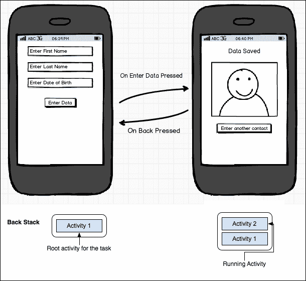
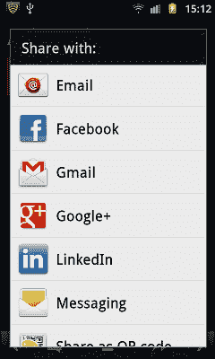
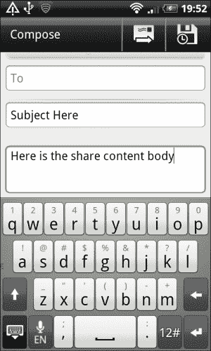
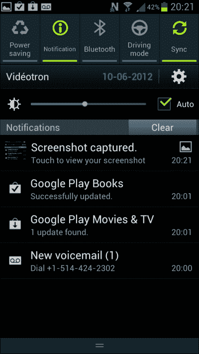
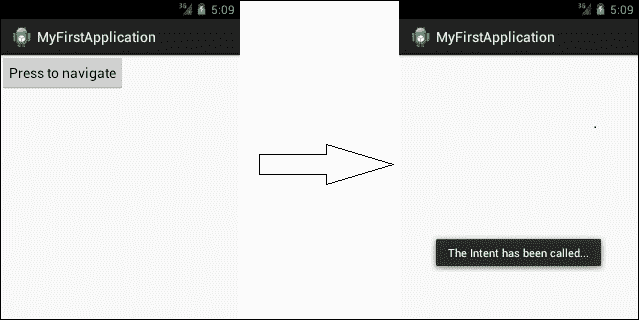
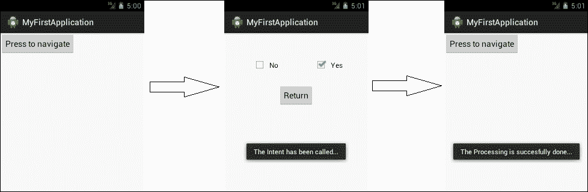

# 第二章：Android 意图介绍

复习上节课的内容——Android 活动是控件、小部件以及用户交互的许多其他事物的可视化表示。一个 Android 应用是由许多相互交互的活动组合而成，以便执行一个或多个应用所专门指定的任务。大多数情况下，在特定时间屏幕上只显示一个活动。某些操作（如按钮点击或手势）可能导致从当前活动导航到活动堆栈上的一个新活动。

Android 意图帮助开发者执行两个活动之间的交互，但这并不是意图唯一的功能。这种交互包括从一个活动移动到另一个活动，从一个活动向另一个活动推送数据，以及在任何特定活动关闭后带回结果。简而言之，可以说意图是 Android 中一个抽象的术语，指的是需要执行的任务。随着你阅读这本书，随着时间的推移，我们将探索其他各种事物。

本章包括以下主题：

+   意图在 Android 应用中的作用

+   意图——技术概览

+   意图的结构

### 提示

如前一章所讨论的 Android 活动、活动生命周期和活动堆栈的概念，是理解本章及后续章节的前提。如果你对这些基础知识没有概念，我们建议你先阅读第一章《理解 Android》，以便继续前进。

# 意图在 Android 应用中的作用

在本节中，我们将了解 Android 意图的范围。到目前为止，我们已经完全了解了为什么需要活动，以及为什么有必要维护和跟踪从一个活动到另一个活动的流程。



按钮点击（使用意图）在不同活动之间的导航及其通过活动堆栈的表示

可以说，这部分书籍是我们从 Android 意图中获得好处的总结。其范围涉及 Android 活动、服务、数据传输以及许多其他因素。我们将在以下列表中看到这一点：

+   从一个活动过渡到另一个活动

+   从一个活动向另一个活动传输数据

+   与 Wi-Fi 和蓝牙建立连接

+   访问 Android 摄像头

+   使用 GPS 传感器获取当前位置

+   发送短信和彩信

+   自定义移动通话

+   发送电子邮件和社交媒体帖子

+   启动和控制 Android 服务

+   处理广播消息

+   更改时区

+   通知栏提醒

+   以及更多内容

我们现在将看看 Android 意图的每个关键角色。以下各节给出了关于 Android 意图这些主要特性的简短描述。

## 意图在 Android 活动中的作用

Intents 最重要的广泛应用是在 Android 活动中。Android 应用程序由许多活动组成，要在这些活动之间过渡，我们需要使用 Android Intents。在之前的图中，你可以看到在**活动 1**（左侧）内容填写完毕，用户点击**输入数据**按钮后，Android 将使用 Intents 导航到**活动 2**（右侧）。

除了之前提到的 Intents 的作用外，还可以用来调用其他应用程序，例如浏览器（从你的活动中打开特定网站）和电子邮件客户端（如 Gmail 或其他，通过发送捆绑信息，带上合适的主题和邮件正文）。

## Intents 在活动间数据传输中的作用

现在很清楚，我们使用 Intents 从一个活动导航到另一个活动。但正如我们都知道数据在 Android 应用程序中的巨大作用，用户需要获取、操作和显示数据以执行特定任务。处理这些数据，并确保其安全地在活动之间传输，也是 Android Intents 的另一个目的。

在之前的图中，一旦用户在活动 1 中填写了表单，点击**输入数据**按钮后，Intents 将执行两项任务。一项是将用户从一个活动带到另一个活动，第二个任务是传输填写的数据到下一个活动，以便显示/计算结果。

## Intents 在 Wi-Fi 和蓝牙传输中的作用

在应用程序内部，如果你想实现一个功能，让用户能够更改当前的 Wi-Fi/蓝牙连接，你需要使用 Android 的 Intents。通过 Android Intents，你可以轻松地提供内部接口，让用户在停留在应用内的同时，切换 Wi-Fi 和蓝牙连接。

## Intents 在 Android 相机中的作用

当谈论 Android 应用程序时，Android 硬件可能非常重要。这些组件的使用可能是你 Android 应用程序的基本部分。以 1D 或 2D 条形码阅读器为例，应用程序需要扫描条形码并解码以提取信息。这个操作只能通过从应用程序内部打开相机来完成。相机的开启同样由 Android Intents 处理。

## Intents 在 GPS 传感器中的作用

Android 应用程序市场在许多类别中都取得了惊人的成绩。如今市场上存在各种类型的 Android 应用程序，包括基于位置的应用程序，它们通过追踪用户的位置执行各种任务。开发者可以通过 Intents 轻松获取用户当前的地理位置，以满足计算需求。

## Intents 在发送短信/彩信中的作用

Android 意图可以用来使你的应用程序能够发送短信/彩信。这个任务可以通过从你的活动中设置短信/彩信正文并将其设置在捆绑包中，以调用发送短信/彩信的本机内置应用程序来完成。然后可以通过实现广播接收器来增强此短信/彩信发送功能，这使得你的活动能够知道消息何时已发送或何时已投递。

## 意图在移动呼叫中的作用

应用程序中触发移动呼叫的任何条件都可以通过 Android 意图实现。Android 应用程序将使用内置应用程序拨打意图中以数据形式提供的任何特定号码。

## 意图在电子邮件和社交网络帖子中的作用

从你的应用程序访问 Gmail 发送电子邮件是由 Android 意图管理的。有一个意图调用，我们在其中放入收件人的电子邮件、附件、邮件正文和主题，并在活动上启动意图。这将打开带有这些参数填充的本机 Gmail 应用程序，用户可以将其发送给期望的收件人。

同样，我们可以通过意图发送各种社交网络更新，如 Facebook、Twitter 和 Google+。这个任务是通过使用共享意图完成的。我们将内容以文本或捆绑包的形式放入，并通过 Android 意图发送。然后 Android 打开所有可用的共享应用程序（如前图所示），并让用户选择最佳的共享应用程序。唯一条件是，需要有预先安装的应用程序，以便 Android 意图与之交互并发送所需的帖子，如下所示：

```kt
Intent sharingIntent = new Intent(android.content.Intent.ACTION_SEND);

```

### 注意

Android 意图除了在墙上发帖或推送到时间线之外，没有透露社交网络的任何其他功能。要观察完整的功能集，互联网上有许多作为免费许可软件或付费的第三方 API。



使用共享意图在各种平台上分享帖子的意图

下一个屏幕截图显示了当您向用户提供了某个功能，例如用户想要通过 Gmail 分享时会发生什么。在这种情况下，屏幕将显示您的内容，并如下所示：



通过共享意图传递数据后的 Gmail 界面

## 意图在 Android 服务中的作用

与 Android 活动（Activity）类似，intents 也用于启动**Android 服务（Services）**。Android 服务基本上是 Android 应用在不对用户界面产生影响的情况下执行的长运行任务。即使用户切换应用，这一后台任务也可以继续运行。换句话说，服务可以与活动绑定，也可以独立运行以执行任务。不过，在所有情况下，都会使用 intent 来启动服务。

## Intent 在广播接收器中的作用

Intent 在广播接收器中有着广泛的应用。广播接收器用于响应任何其他应用甚至系统发起的广播消息。在这个背景下，我们捕获 Android 消息并提取数据，以便在我们的应用中显示。例如，当我们需要接收系统启动完成信号时，会使用 `Intent.ACTION_BOOT_COMPLETED`。同样，许多其他的 intent 值和 intent 对象可以在应用的不同位置使用，以便执行与广播接收器相关的各种任务。

另一个例子可以是发送短信/彩信，你可以创建一个广播接收器来查看发送是否完成或消息是否已投递。

## Intent 在时区中的作用

你的应用可能需要做与时区相关的操作。一旦你在旅行中遇到时区变化，你可能希望应用能做出不同的响应。在这种情况下，我们可以使用广播接收器来检测时区的变化，从 intent 中获取数据以访问当前时区，并执行特定任务。这是一种非常方便的方法，可以根据你的时区来维护应用结构和数据。

## Intent 在状态栏中的作用

Android 状态栏用于向用户提供即时通知，同时不会占用屏幕过多空间。从上至下滑动的通知面板包含许多功能，例如一些快速访问项，如无线连接管理器（目前仅在少数手机上可用）等。我们可以将通知放在状态栏中，以告知用户任何信息。Android Intents 用于放置内容，并在其中提供状态栏通知。



Android 通知面板和通知

# Intent – 技术概览

在前几节课中，我们已经对 Android Intents 进行了理论上的概述。现在让我们深入了解一下这一 Android 特性的技术细节。在本部分，我们将从更宏观的角度来看待 Android Intents，包括示例代码及其解释。

从技术上讲，Android Intent 由两个组件组成，这两个组件都可以独立工作。这两个组件如下：

+   编码组件

+   XML 组件

## 编码组件

在编写类时，会在 Java 代码中实现 Android Intents。通常在 Android 项目中，我们会为处理活动(activity)创建一个单独的包。如前所述，为了记录应用程序的完整追踪，有一个`AndroidManifest.xml`文件，其中应包含每个活动(activity)、服务(service)、权限(permission)以及其他内容的记录。

### 提示

在实现代码时，我们需要确保所有活动(activity)都在`AndroidManifest.xml`文件中声明，以便从代码中访问它们。否则，Android 将抛出`ActivityNotFoundException`错误。

为活动(activity)、服务(service)和广播接收器(Broadcast Receivers)实现 Android Intents 的方式是相同的。在活动(activity)中实现 Android Intents 时，我们需要注意以下事项：

+   在实现 intent 之前导入`android.content`包（这是 Android 的父包，其中包含 intent 类）。

+   Intent 构造函数应该在 Android 活动的上下文中。如果不是，它应该具有上下文对象，以确定在哪个活动中调用 intent。

+   应导入目标活动类（如果它位于源活动所在包的其他包中）。

+   只有在 intent 处于 Android 活动的上下文中，或者如果源活动的上下文存在于上下文对象中，你才能调用`startActivity()`方法。

## XML 组件

intent 依赖的第二个也是最重要的组件位于`AndroidManifest.xml`文件中。回顾一下这个文件包含的内容——`AndroidManifest`是包含有关应用程序所有信息的文件。它包含所有活动(activity)、服务(service)、权限(permission)、版本代码(version codes)、sdk 版本等许多其他信息。

同样，此文件中也提到了 Intent Filters。此时，我们只想涵盖 Intent Filters 的主要用途。以下是 Intent Filter 的简要介绍：

+   Intent Filters 有一些条件，必须满足这些条件才能处理 Android Intents。

+   Intent Filters 包含有关 Android Intent 的数据和类别(category)的额外信息。

简而言之，Intent Filter 描述了 Android 系统如何识别在特定 Android Intent 上应采用的行为。

```kt
<activity
  android:name=".MyFirstActivity"
  android:label="@string/app_name" >
  <intent-filter>
    <action android:name="android.intent.action.MAIN" />

    <category android:name="android.intent.category.LAUNCHER" />
  </intent-filter>
</activity>
```

### 提示

你可以在`AndroidManifest.xml`中的单个活动中包含许多 Intent Filters。

如前述代码所示，明确指出`<intent-filter>`标签包含有关类别(category)和动作(action)的信息。当应用程序尝试执行系统未知任务时，这些标签是`AndroidManifest`中活动(activity)的重要组成部分。

要理解为什么在 Intent Filter 的代码中会出现`<category>`，可以举个例子：我们开发一个应用，其中有两个活动。如果我们没有告诉系统哪个是启动应用时的第一个活动；系统就会混淆并显示错误`No Launcher Activity Found`，并且不会启动应用。因此，为了完成这项任务，我们需要将其中一个活动的类别设置为`android.intent.category.LAUNCHER`。这将帮助系统识别应用启动的基础活动，并继续流程。

# 实现 Android Intents 进行活动导航

在这一节中，我们将看看 Android Intent 的实现。让我们开始吧。

要开始这个示例，你需要构建一个 Android 项目。你可以使用 Android Studio 或 Eclipse（根据你的方便），但如果你使用 Eclipse，确保你已经正确安装了 JDK、ADT 和 Android SDK，以及它们的兼容性包。如果你不知道这些 IDE 之间的区别，可以参考本书的第一章，《理解 Android》。

在 Android Studio 中创建项目的内容在上一章已经介绍过。重复这些步骤可以帮助你创建一个带有一些预定义文件和文件夹的完整 Android 项目。

要开始实现 Android Intents，你需要执行以下步骤：

1.  创建一个新的 Android 项目，或者选择任意一个现有的你想要在其中实现 Android Intents 的项目。

1.  打开你想要实现意图的源活动。

    ### 注意

    提醒一下，当活动中有事件调用发生时，会调用意图。例如，点击按钮时，下一个活动应该出现。所以按钮点击就是事件。

1.  实现以下代码以实现此结果：

    ```kt
    //-------------------------------------------------------------------------
    Part One - MainActivity Class

    public class MainActivity extends Activity {

      @Override
      protected void onCreate(Bundle savedInstanceState) {
        super.onCreate(savedInstanceState);
        setContentView(R.layout.activity_main);
        Button button = (Button) findViewById(R.id.button1);
        button.setOnClickListener(new OnClickListener() {

          @Override
          public void onClick(View v) {
            // TODO Auto-generated method stub
            Intent myIntent = new Intent(MainActivity.this,MySecondActivity.class);
            startActivity(myIntent);
          }
        });
      }
    }

    //---------------------------------------------------------------------------
    Part Two - MySecondActivity Class

    public class MySecondActivity extends Activity {
      @Override
      protected void onCreate(Bundle savedInstanceState) {
        // TODO Auto-generated method stub
        super.onCreate(savedInstanceState);
        setContentView(R.layout.activity_two_layout);
        Toast.makeText(this, "The Intent has been called...",Toast.LENGTH_LONG).show();
      }
    }

    //----------------------------------------------------------------------------
    Part Three - activity_main.xml File

    <?xml version="1.0" encoding="utf-8"?>
    <LinearLayout 
      android:layout_width="match_parent"
      android:layout_height="match_parent"
      android:orientation="vertical" >

      <Button
        android:id="@+id/button1"
        android:layout_width="wrap_content"
        android:layout_height="wrap_content"
        android:text="Press to navigate"
      />

    </LinearLayout>

    //----------------------------------------------------------------------------
    Part Four - activity_two_layout.xml File

    <?xml version="1.0" encoding="utf-8"?>
    <LinearLayout 
      android:layout_width="match_parent"
      android:layout_height="match_parent"
      android:orientation="vertical" >

    </LinearLayout>

    //---------------------------------------------------------------------------
    Part Five - AndroidManifest.xml File

    <?xml version="1.0" encoding="utf-8"?>
    <manifest 
      package="com.app.fragmenttestingapplication"
      android:versionCode="1"
      android:versionName="1.0" >

      <uses-sdk
        android:minSdkVersion="8"
        android:targetSdkVersion="16" />

      <application
        android:allowBackup="true"
        android:icon="@drawable/ic_launcher"
        android:label="@string/app_name"
        android:theme="@style/AppTheme" >
      <activity
        android:name="com.app.fragmenttestingapplication.MainActivity"
          android:label="@string/app_name" >
          <intent-filter>
            <action android:name="android.intent.action.MAIN" />

            <category android:name="android.intent.category.LAUNCHER" />
          </intent-filter>
        </activity>
      <activity
        android:name="com.app.fragmenttestingapplication.MySecondActivity"
        android:label="@string/app_name" >
      </activity>
    </application>

    </manifest>
    ```

1.  运行项目，会出现一个按钮。点击按钮，通过意图导航到下一个活动。



指示应用从第一个活动到第二个活动的流程

## 理解流程

之前的代码分为五个部分；我们将逐一描述它们。请记住，这些部分指的是 Android 项目中的五个不同文件。考虑到你将在这个预定义项目中使用这些代码，我们将从新创建项目的角度来描述，以便使其更加详尽和清晰。

### 第一部分 – MainActivity.java

`MainActivity.java`是在创建项目时生成的第一个类。由于它是一个 Android 活动，因此它带有一个`onCreate`方法，该方法在活动创建后立即被调用（如第一章，*理解 Android*，*Android 活动生命周期*所述）。与此活动关联的布局名为`activity_main.xml`。因此，在`onCreate()`方法中，行`setContentView(R.layout.activity_main)`指的是那个 XML，并用于根据`activity_main.xml`中的布局设置该活动的视图。

现在，在第二步中，通过在`Activity`类中使用`findViewById(int id)`方法，在代码中获取`activity_main.xml`布局中具有 ID `button1`的按钮。它将返回`View`类的对象，因此我们可以轻松地将其转换为按钮以获得按钮对象。

一旦提取了按钮对象，我们就在其上实现`setOnClickListener()`方法。`setOnClickListener()`方法属于`View`类，它需要一个`View.OnClickListener`（一个接口）作为参数。这个接口要求我们重写`onClick()`功能以实现。每当在 UI 中点击按钮时，都会触发这个事件。

在这个`onClick()`方法内部，将进行意图的实际实现。由于我们希望在点击按钮时调用我们的意图，因此我们将在该方法中处理所有与意图相关的操作。使用带有上下文和目标类参数的构造函数声明意图对象。`MySecondActivity.class`文件是我们想要导航到的目标活动，而我们通过获取`MainActivity`（或者你可以使用`getContext()`方法，它基本上返回相同的活动上下文）来访问当前活动的上下文。这是因为我们现在处于`OnClickListener`的上下文中。

在此阶段，我们拥有了意图对象。我们可以用这个对象做更多的事情，但目前我们的任务是仅将其导航到下一个活动。这就是为什么我们要调用`startActivity()`方法并将此意图作为参数传递。这将把应用导航到下一个活动，该活动将从活动堆栈顶部出现，而前一个活动将位于其下方。

### 第二部分 – MySecondActivity.java

`MySecondActivity.java`活动是意图的目标活动。这是一个简单的活动，其中包含一个`onCreate()`方法，该方法在屏幕上设置内容视图。在布局创建后，我们通过`show()`方法在屏幕上显示一个吐司消息，以便识别第二个活动已被加载并在显示消息`The intent has been called`。

### 注意

吐司消息是一个简单的消息框，显示几秒钟后消失。默认情况下，这个消息包含文本，但可以轻松定制吐司以包含图片和其他许多内容。

### 第三部分 – activity_main.xml

这个 XML 文件是`MainActivity.java`类的布局。如您所见，我们试图从布局中获取按钮的引用。这个按钮在`activity_main`文件中声明，并带有用于从 XML 中提取的 ID。

### 注意

所有在 XML 文件中声明的布局引用都放在 R 文件中，Java 代码/类通过它来在代码中获取对象。

描述`activity_main.xml`文件，有一个带有关于其长度、宽度和方向的某些参数的线性布局。在线性布局的标签内，你可以看到被带入 Java 代码中的按钮声明。这个标签还带有关于高度、宽度、ID 以及将在布局中显示的文本的某些参数。

### 注意

为了给任何视图分配 ID，请采取预防措施。所有这些 ID 都存在于 R 文件中，该文件在一个类中处理所有内容。尝试自定义你的 ID，以避免将一个活动的视图与另一个混淆。

### 第四部分 – activity_two_layout.xml

这是一个简单的布局文件，包含父级线性布局，以创建一个简单的空白活动。这个布局文件被分配给第二个活动，用户点击按钮后意图会带用户到这个活动，并在这里显示吐司消息。

### 第五部分 – AndroidManifest.xml

没有完整的`AndroidManifest.xml`文件，因为该文件包含有关应用程序的所有信息。在这个 XML 文件中，有一个 manifest 父标签，其中包含关于项目的三个最重要的属性：

+   **包名**：这是项目的名称，应用程序将由此名称进入谷歌应用市场（或其他任何市场）。这个名称应该为整个应用程序唯一定义，并且不应与市场上其他任何包名匹配。

+   **版本代码**：这是一个整数值，表示与之前版本应用程序相比的版本号。

+   **版本名称**：这是一个字符串值，用于向用户显示。它是应用程序的发布版本名称。

在`Manifest`标签内，有一个名为`<uses-sdk>`的标签，在其属性中定义了应用程序可访问的最低和最高 Android API 版本。在此之后是一个应用程序标签，其中存储有关应用程序的信息，包含图标、标签和应用程序的主题。

在主标签中，描述了应用程序中的活动，有`<activity>`标签。它的数量应与应用程序中使用的活动数量相等。如你所见，意图的 XML 组件存在于第一个活动中，即`<intent-filter>`，它告诉系统`MainActivity.java`是应该用作启动器的活动类。与第一个活动不同，第二个活动不包含意图过滤器的标签。你可以分析出，第二个活动无需包含这些标签，因为它与第一个活动在流程中是一致的。

从第一个活动到第二个活动，前景意图应该是连续的。这就是为什么它不需要包含`<category>`和`<action>`标签的原因。即使没有这些，应用程序也能正常工作。

#### 未来的考量

在本书中，我们将详细了解我们还可以用意图做些什么。到目前为止，我们只介绍了意图的基本功能以及它在活动栈中的流程。在接下来的内容中，你将遇到很多相关知识。

## android.content.Intent 类的其他构造函数

Intent 类提供了多种构造函数，帮助开发者在各种场景中。在上一节中，我们只使用了一种构造函数类型。其他构造函数的多态形式在 Google 上也是可用的。

以下各节将解释各种构造函数。

### Intent()

这是默认构造函数，它返回一个空的意图对象。但是，这里的“空”并不意味着它是一个 null 对象。

### Intent(intent o)

这个构造函数用于创建一个现有意图的克隆。我们传递想要克隆的意图对象，并将其作为构造函数的参数。在这种情况下，返回的意图是原始意图的副本。它还将映射原始意图中放入的每个值（额外数据）并返回该意图的副本。

### Intent(Context c, Class<?> cls)

这是我们在前面示例中使用的构造函数。它基本上接收两个参数：源上下文和目标类。源上下文是你当前正在使用的活动的上下文，而第二个参数是你想要导航到的类。

### Intent(String action)

带有动作的构造函数用于创建一个写入动作的意图对象。动作的正确使用和定义，如在意图中的使用，将在接下来的章节中介绍。还要记住，这个构造函数用于广播动作。

### Intent(String action, URI uri)

这个构造函数用于创建一个带有期望动作以及一些数据 URL 的意图。例如，我们传递参数`new Intent(Intent.ACTION_VIEW, Uri.parse("http://www.google.com"));`。这个构造函数清楚地表示意图将支持用于查看的动作，并通过另一个参数解析 URL 的 URI [`www.google.com`](http://www.google.com)。这将打开浏览器，其中将加载 Google 的网站。再看一个这种构造函数的例子：`new Intent(Intent.ACTION_DIAL, Uri.parse("tel: (+1) 123456789"));`。通过编写这个语句，我们清楚地表明我们想要创建一个用于激活电话拨号器的意图，并通过 URI 的值来执行通过意图拨打电话的功能。

### 注意

这种形式的构造函数主要用于调用隐式意图。关于代码的更多信息可以在[`developer.android.com/reference/android/content/Intent.html`](http://developer.android.com/reference/android/content/Intent.html)找到。

## 从 Android Intent 获取结果

正如我们之前所见，Android Intent 用于从一个活动导航到另一个活动，但在实际场景中，这种导航需要许多其他东西。这里将讨论 Android Intent 最重要的特性之一。我们将在这里看到的是，一旦目标活动关闭，源活动将获得什么响应。

为了进一步解释前面的陈述，我们有一个场景：

+   有一个源活动（将从这里开始导航）

+   一个目标活动（将进行导航的地方）

+   目标活动关闭时，它将向源活动返回一个结果。

这是 Android Intent 中一个非常方便的选项，用于从活动中带回结果。我们将通过示例代码详细讨论这个特性。

### 通过示例理解

在这个例子中，我们将查看有两个活动的情况。第一个活动将作为启动活动。第二个活动将作为目标活动，它还将向第一个活动返回一些结果。第一个活动将捕获结果，并根据该代码决定第二个活动中完成了或失败的任务类型。最后，根据返回的结果，在第一个活动中显示一些对话框消息。

### 深入示例

再次，以下代码分为五部分。这是上一个示例的修改，其中描述了意图的正常使用。为了实现这个示例，请执行以下步骤：

1.  创建一个新项目或打开任何现有项目，以便进行更改。

1.  打开源活动，在其中实现意图。

1.  实现以下代码：

    ```kt
    //----------------------------------------------------------------
    //Part One - MainActivity Class

    public class MainActivity extends Activity {

      @Override
      protected void onCreate(Bundle savedInstanceState) {
        super.onCreate(savedInstanceState);
        setContentView(R.layout.activity_main);
        Button button = (Button) findViewById(R.id.button1);
        button.setOnClickListener(new OnClickListener() {

          @Override
          public void onClick(View v) {
            // TODO Auto-generated method stub
            Intent myIntent = new Intent(MainActivity.this, MySecondActivity.class);
            startActivityForResult(myIntent, 1);
          }
        });
      }

      @Override
      protected void onActivityResult(int requestCode, int resultCode, Intent data) {

      if(requestCode == 1){
        if(resultCode == RESULT_OK){      
        Toast.makeText(this, "The Processing is succesfully done...", Toast.LENGTH_LONG).show();       
        }
        if (resultCode == RESULT_CANCELED) {    
          Toast.makeText(this, "The Processing failed,try again later..", Toast.LENGTH_LONG).show();
        }
      }
    }
    }

    //----------------------------------------------------------------
    //Part Two - MySecondActivity Class

    public class MySecondActivity extends Activity {

      @Override
      protected void onCreate(Bundle savedInstanceState) {
        // TODO Auto-generated method stub
        super.onCreate(savedInstanceState);
        setContentView(R.layout.activity_two_layout);
        Toast.makeText(this, "The Intent has been called...", Toast.LENGTH_LONG).show();

        Intent returnIntent = new Intent();

        CheckBox yesCheckBox = (CheckBox)findViewById(R.id.checkBox1);
        CheckBox noCheckBox = (CheckBox)findViewById(R.id.checkBox2);
        Button button = (Button) findViewById(R.id.button2);
        button.setOnClickListener(new OnClickListener() {

          @Override
            public void onClick(View v) {
            // TODO Auto-generated method stub
            if(yesCheckBox != null && yesCheckBox.isChecked()){
              setResult(RESULT_OK, returnIntent);
            finish();
          }else if(noCheckBox != null &&noCheckBox.isChecked()){
           setResult(RESULT_CANCELED, returnIntent);
           finish();
           }
          }
        });
      }
    }
    }

    //----------------------------------------------------------------------------
    Part Three - activity_main.xml File

    <?xml version="1.0" encoding="utf-8"?>
    <LinearLayout 
      android:layout_width="match_parent"
      android:layout_height="match_parent"
      android:orientation="vertical" >

      <Button
        android:id="@+id/button1"
        android:layout_width="wrap_content"
        android:layout_height="wrap_content"
        android:text="Press to navigate"
      />

    </LinearLayout>

    //----------------------------------------------------------------------------
    Part Four - activity_two_layout.xml File

    <?xml version="1.0" encoding="utf-8"?>
    <RelativeLayout 

      android:layout_width="match_parent"
      android:layout_height="match_parent"
      tools:context=".MainActivity" >
      <Button
        android:id="@+id/button2"
        android:layout_width="wrap_content"
        android:layout_height="wrap_content"
        android:layout_below="@+id/checkBox1"
        android:layout_centerHorizontal="true"
        android:layout_marginTop="24dp"
        android:text="@string/return_string" />

      <CheckBox
        android:id="@+id/checkBox2"
        android:layout_width="wrap_content"
        android:layout_height="wrap_content"
        android:layout_alignBaseline="@+id/checkBox1"
        android:layout_alignBottom="@+id/checkBox1"
        android:layout_toRightOf="@+id/button1"
        android:text="@string/no_string" />

      <CheckBox
        android:id="@+id/checkBox1"
        android:layout_width="wrap_content"
        android:layout_height="wrap_content"
        android:layout_alignParentTop="true"
        android:layout_marginTop="50dp"
        android:layout_toLeftOf="@+id/button1"
        android:text="@string/yes_string" />

    </RelativeLayout>

    //---------------------------------------------------------------------------
    Part Five - AndroidManifest.xml File

    <?xml version="1.0" encoding="utf-8"?>
    <manifest 
      package="com.app.fragmenttestingapplication"
      android:versionCode="1"
      android:versionName="1.0" >

      <uses-sdk
        android:minSdkVersion="8"
        android:targetSdkVersion="16" />

      <application
        android:allowBackup="true"
        android:icon="@drawable/ic_launcher"
        android:label="@string/app_name"
        android:theme="@style/AppTheme" >
        <activity
          android:name="com.app.fragmenttestingapplication.MainActivity"
          android:label="@string/app_name" >
          <intent-filter>
          <action android:name="android.intent.action.MAIN" />

          <category android:name="android.intent.category.LAUNCHER" />
        </intent-filter>
      </activity>
      <activity
        android:name="com.app.fragmenttestingapplication.MySecondActivity"
          android:label="@string/app_name" >
          </activity>
      </application>

    </manifest>
    ```

1.  运行项目，会出现一个按钮。点击按钮，通过意图导航到下一个活动。

1.  当意图成功执行后，新的活动将会出现。点击模拟器或你正在测试的 Android 手机上的返回键，系统将会带你回到第一个活动。

1.  返回第一个活动后，它会显示吐司通知，以便从目标活动中传达结果。

    指示应用程序从第一个活动到第二个活动，并将结果返回到第一个活动的流程

### 解释代码

在这个例子中，如前所述，我们将了解如何获取结果，以验证（在第一个活动中）在第二个活动中执行的任务是否成功完成。

在继续之前，请记住这是之前定义例子的扩展；因此，我们之前讨论过的内容在这个例子中不会解释。如果你在这里发现任何难以理解的内容，请阅读之前的例子。

让我们一步一步开始。

#### 第一部分 – MainActivity.java

与之前一样，这是在点击按钮后开始导航的第一个活动。这个活动的大部分内容与之前的例子相同，但如果你仔细观察，会发现使用了`startActivityForResult()`方法来启动活动。这是因为我们启动的活动将在第二个活动关闭后返回一个结果。

`startActivityForResult()`方法有两个参数。第一个是意图，与之前描述的`startActivity()`方法类似。让我们看看第二个参数是什么。设想一个场景，第一个活动调用了多个将返回结果的活动。现在，在捕捉结果时，我们需要确定它来自哪个活动。因此，我们分配一个请求码，当意图将用户带回第一个活动时，它将返回结果。然后我们将进行检查，以了解结果来自哪个活动。

接下来，如果你仔细查看代码，会发现有一个被重写的方法名为`onActivityResult()`。当第二个活动关闭时，这个方法将被调用。正如你在代码中所见，它有三个参数。第一个是`requestCode`，它与发送结果返回的活动相符合。除此之外，我们还有`resultCode`，它会告诉你在第二个活动中执行的任务是否成功。第三，我们有意图，基本上是这个对象导致活动返回到第一个活动。我们还可以通过这个意图将一些数据发送回第一个活动。

#### 第二部分 – MySecondActivity.java

这与第一个示例相同；实际上，它包含了布局文件中的两个复选框对象，这些对象用于在第二个活动中生成结果。我们通过 ID 找到视图，并根据选中的复选框判断哪个是启用的。当按下按钮时，它会检查哪个复选框被启用，并根据启用的优先级调用`setResult()`函数。这个函数为意图设置一个结果，这将帮助活动返回到第一个活动。

设置结果后，我们将结束第二个活动，并带着结果返回到第一个活动。在活动结束后，第一个活动的`onActivityResult()`方法将被执行，以便查看由第二个活动发送的结果。

#### 第三部分 – activity_main.xml

这部分代码与第一个示例相似；请参考第一个示例的解释。

#### 第四部分 – activity_two_layout.xml

这个布局文件指的是第二个活动。我们放置了两个复选框，根据这些复选框的决定，将决定要发送哪个结果返回到第一个活动。有一些属性与上一个示例中的相同，因此可以参考那个示例。

#### 第五部分 – AndroidManifest.xml

同样，此文件未作修改，与第一个示例相同。请参考第一个意图的简单示例。

#### 未来考虑事项

我们可以关注两种未来考虑的场景。第一种是当所有活动都在发送结果回来时如何处理两个或更多活动。这当然是通过`requestCode`参数的帮助。第二重要的是，在只发送响应码的场景中，可能还需要发送一些字符串、整数值或自定义对象作为结果。在这种情况下，我们需要其他方法通过意图将这些对象发送回第一个活动。

### 注意

在第五章，*使用意图进行数据传输*，我们将全面了解如何在意图中传输不同类型的数据。

# 意图的构造

在本节中，我们将研究在 Android 中使用的意图对象的结构。意图是包含多个事物以方便的信息包。它包含了在执行意图时应采取的操作信息。同样，它也包含了将处理意图的类别信息。数据在意图中起着至关重要的作用。因此，意图具有以 URI 形式执行的数据信息。

### 注意

由于这里空间有限，我们无法解释每个组件中的每个常量。为了获取 Android 使用的完整常量列表，您可以在这里查看：

[`developer.android.com/reference/android/content/Intent.html`](http://developer.android.com/reference/android/content/Intent.html)

我们现在将逐一了解这些组件，以了解它们的真正含义。

## 组件

这将解释哪个组件将受到特定意图执行的影响或处理。例如，有一个负责执行与调用它的活动相关的动作的意图。同样，有一个由广播接收器处理的意图，在执行某些与系统相关的任务时会报告。如果没有设置组件名称，它将使用其他信息自行识别组件。下表显示了在 Android 意图中使用的不同类型的组件：

| 常量 | 描述 |
| --- | --- |
| `CATEGORY_BROWSABLE` | 表示该意图可以安全地由浏览器执行以显示数据。 |
| `CATEGORY_LAUNCHER` | 表示在应用程序启动时，该活动应作为启动器执行。 |
| `CATEGORY_GADGET` | 活动可以放入从任何小工具启动的另一活动中。 |

## 操作

操作基本上指明了这个意图将引发什么动作。例如，如果我们初始化一个名为`ACTION_CALL`的动作的意图对象，这个意图将通过以 URI 形式传递带有`ACTION_CALL`动作的数据字符串来启动通话功能。再以`ACTION_BATTERY_LOW`为例，它与广播接收器组件相关。将此动作放在意图过滤器中，如果电池电量低于阈值，它将触发事件（或简而言之，弹出低电量提示）。

Android 中存在各种类型的操作。下表显示了一些意图操作及其描述：

| 常量 | 组件 | 描述 |
| --- | --- | --- |
| `ACTION_CALL` | 活动 | 开始电话通话 |
| `ACTION_EDIT` | 活动 | 显示用户数据以进行编辑 |
| `ACTION_MAIN` | 活动 | 作为初始活动启动，无数据 |
| `ACTION_SYNC` | 活动 | 将服务器上的数据与移动设备同步 |
| `ACTION_BATTERY_LOW` | 广播接收器 | 显示电池电量低警告 |
| `ACTION_HEADSET_PLUG` | 广播接收器 | 当插入或拔出耳机时显示警告 |
| `ACTION_SCREEN_ON` | 广播接收器 | 当屏幕开启时触发 |
| `ACTION_TIMEZONE_CHANGED` | 广播接收器 | 当时区设置更改时 |

## 数据

这不应被视为独立的组件；相反，它是用来辅助动作组件的。如前所述，有些组件需要传递一些数据。例如，`ACTION_CALL`函数需要通过一个数据值来识别应该拨打哪个电话号码。在这种特定情况下，我们需要将`tel: xxxxxxxxxxx` URI 放入数据中，并将其转发给动作。同样，当执行`ACTION_EDIT`或`ACTION_VIEW`动作时，它们需要提供一个文档或 HTTP URL 以完成动作。数据以**URI**（**通用资源标识符**）的形式提供给意图。

## 附加信息

这些基本上是 Android Intent 所需的附加数据的键值对。我们可以从代码中获取这些值（当我们创建意图对象时），并将这些数据传递到下一个活动。就动作而言，有些动作需要额外的数据来完成任务。例如，`ACTION_TIMEZONE_CHANGED`动作需要一个额外的时区，该时区描述了新的时区，基于此可以执行进一步的任务。

# 总结

在本章中，我们讨论了意图的介绍及其角色、技术概览、在 Android 应用程序中的基本实现，以及基于意图的结构，我们将进一步探索可以执行的不同类型的任务。本章还提供了两个非常重要的 Android Intent 实现，其中一个是活动到另一个活动的导航，而在第二个中，将特定活动的结果发送回第一个活动。本章讨论的概念是理解 Android Intent 高级概念的关键工具，这将在本书的后面讨论。在下一章中，我们将学习关于 Android Intent 的分类及其理论，以及在各种实用示例中的实现，这些示例可以轻松地在 Eclipse 环境中实现。
