# 第三章：意图及其分类

**意图** 是用来激活一个 Android 组件的异步消息，通过另一个组件来实现。这些意图用于在发生某些事件时触发 Android 操作系统，并采取一些行动。根据接收到的数据，Android 操作系统确定意图的接收者并触发它。

通常，有两种类型的意图：**显式** 和 **隐式**。顾名思义，显式意图由开发者明确指定触发 Android 操作系统的特定组件。然而，隐式意图触发的是 Android 操作系统任何类别的一般组件。由 Android 操作系统决定需要激活哪个组件。如果有一个以上的通用组件，系统会要求用户从所有组件的列表中选择一个。Android 操作系统中意图的这项功能使得应用程序更具交互性，因为其他应用程序和开发者也可以访问它。例如，你正在开发一个图片编辑的 Android 应用程序，用于编辑任何图片，应用滤镜等。所以，如果应用程序接收到来自 Android 系统任何来源的图片，比如电子邮件附件、图库图片、其他图片工具等，与仅从应用程序本身加载图片的应用程序相比，该应用程序将变得更加互动和响应迅速。这种应用程序的互动，无论是通过电子邮件发送图片还是在编辑应用程序中接收图片，都是通过隐式意图实现的。

在本章中，你将了解到以下主题：

+   意图的类型

+   显式意图

+   在 Android 应用程序中使用显式意图

+   隐式意图

+   在 Android 应用程序中使用隐式意图

+   意图和 Android 晚期绑定

### 提示

如前一章所讨论的意图及其结构的概念，是理解本章及后续章节的前提条件。如果你对这些内容没有基本的了解，请阅读 第二章 *Android 意图简介*，以便继续学习。

这两种意图，即显式和隐式意图，在功能上有很大的不同。让我们从最简单的意图类型开始说起。

# 显式意图

最简单的意图类型是显式意图。当开发者知道要使用哪个组件，并且不希望向用户提供自由访问时，显式意图是最佳选择。在这里，开发者在意图声明中明确指定了要触发的组件。这个组件可以是任何活动、服务或广播接收器。例如，一个 Android 应用程序通常包含一个以上对应功能的活动。为了从一个活动导航到另一个活动，会使用显式意图。以下代码段展示了这样一个显式意图的简单声明，它从活动 A 指向活动 B：

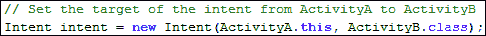

意图是`android.content.Intent`类的实例。显式组件被指定为 Java 类标识符，它们被 Android 操作系统用于在开发者发送意图时激活它们。如前几章所述，意图对象接收两个参数：**上下文**和**类**。上下文参数接收触发其他组件激活的源上下文。类参数取特定类的类对象，用于指定目标组件。在前面的代码段中，`intent`对象以`ActivityA`类作为源组件，以`ActivityB`作为要激活的目标组件。现在，这个在代码段中声明的具有特定组件作为目标的`intent`对象可以在任何地方使用。例如，它可以用于以`ActivityA`作为父活动启动`ActivityB`。以下部分描述了使用显式意图触发各种组件（如活动、服务等）的用途。

## 在 Android 应用程序中使用显式意图

在本节中，我们将讨论在 Android 应用程序中显式意图的各种用途。如前所述，显式意图可以用于激活其他组件，如活动、服务和广播接收器。我们将讨论两个显式意图的示例；第一个是从一个活动启动另一个活动，另一个是在后台启动服务。

### 通过显式意图启动一个活动

任何 Android 应用程序至少包含一个或多个活动。因此，在存在多个活动的情况下，如何在它们之间导航对开发者来说变得很重要。在本节中，我们将开发一个包含两个活动的示例，我们将从一个活动启动另一个活动，并在停止/完成当前打开的活动后返回到它。下图展示了我们即将开发的示例的简单原型：

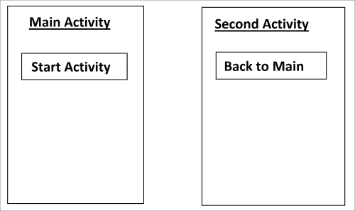

如前图所示，我们有两个活动：**主活动（Main Activity）**和**第二个活动（Second Activity）**。这两个活动都有一个用于导航的单一按钮和一个显示活动名称的标题。现在，让我们开始开发第一个示例。但是，要开始这个示例，你需要构建一个 Android 项目。你可以使用 Android Studio 或 Eclipse（根据你的方便），但在使用 Eclipse 的情况下，请确保你已经正确安装了 JDK、ADT 和 Android SDK 及其兼容性。如果你不知道这些 IDE 之间的区别，请参考本书的第一章。在上一章中已经解释了如何在 Android Studio 中创建项目。重复这些步骤将给你一个带有一些预定义文件和文件夹的完整 Android 项目。

创建一个空的 Android 项目后，我们将实现显式意图的使用。在示例中，我们将编写或修改许多不同类型的文件，如 Java、XML 等。每个文件都有其自身的目的，并在示例中执行其自身的功能。现在，让我们逐一探索这些文件。

#### MainActivity.java 类

项目的主文件是`MainActivity.java`。以下是在此文件中需要实现的代码片段：

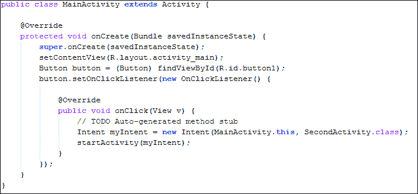

拥有一个以上活动的应用程序必须有一个主活动。这个主活动定义了应用程序的启动点。在我们的示例中，`MainActivity.java`类是项目的主活动。为了向活动提供布局文件以进行视觉展示，我们将在活动的`onCreate()`方法中调用`setContentView(R.layout.activity_main)`。`activity_main.xml`文件是项目目录中`layout`文件夹里的布局文件，代表了应用的主屏幕。设置活动的视图后，我们可以通过从布局文件获取它们的视图来获取活动中将使用的所有组件。要获取任何组件的视图，我们将使用`findViewById()`方法，该方法接收视图的 ID 并返回一个`View`对象，根据我们的需求进行类型转换。在这个文件中，我们从布局文件中获取了 ID 为`button1`的按钮的`View`对象，并将其类型转换为`Button`并引用到我们的按钮。任何按钮都应该有监听器以便与视图进行用户交互并自定义视图的行为。在我们的文件中，我们只为按钮设置了`View.OnClickListener`以获取按钮的点击/轻触。

### 注意

Android SDK 中有两个`OnClickListener`类。一个位于`View`类中，用于诸如按钮、文本字段等视图。另一个位于`DialogInterface`类中，用于检测对话框中的点击和轻触。开发者在导入类及其包时应小心谨慎。

我们使用了`Button`对象的`setOnClickListener()`方法来设置按钮的`OnClickListener`对象。我们在方法的参数中引用了一个匿名监听器，并覆盖了`onClick()`方法。在`onClick()`方法中，我们需要提供当按钮被点击时我们想要展示的行为。

### 提示

匿名对象是开发者没有指定对象名称的对象。由于这个原因，开发者在代码中不能直接访问该对象。你也可以通过创建接口对象，并在`setOnClickListener()`方法中传递它来设置视图的`OnClickListener`对象。

我们已经创建了一个意图对象，其源上下文为`MainActivity`，而`SecondActivity`类是要激活的目标组件。这里需要注意的是，我们不是传递`SecondActivity`的对象，而是显式传递了`SecondActivity`的 Java 类表示。这就是我们声明一个显式意图对象的方式。现在，通过这个意图对象，我们可以根据需求执行许多不同的任务，但在我们这个案例中，选项是有限的。我们创建了一个包含非常具体信息的显式意图，因此，这个意图仅可用于有限的目的。在这个例子中，意图被用来通过调用`startActivity()`方法在返回栈上启动另一个活动。这个方法接收一个显式意图对象的参数，该参数具有源上下文和目标活动的信息。

### 提示

要在一个除了正在运行的活动之外的类中声明意图，我们可以使用应用上下文来传递意图构造函数的上下文参数。这可以通过`getApplicationContext()`方法来获取。

因此，总结这个文件的功能，该文件表示应用程序的启动点，显示了一个按钮。点击按钮后，应用程序将导航到另一个活动。这种活动之间的导航是通过一个显式意图对象实现的。在实现了`MainActivity`文件之后，让我们在`SecondActivity.java`文件中实现我们的第二个活动。

#### `SecondActivity.java`类

`SecondActivity.java`类是我们显式意图的目标活动。以下是这个文件中实现代码片段：


同样，这个类是从`Activity`类扩展而来的，遵循活动生命周期。它也应该重写生命周期回调方法。在`onCreate()`方法中，我们通过调用`setContentView()`方法来设置活动的视图，这次，我们通过`R.layout.activity_main2`传递了`activity_main2.xml`文件的引用。这个 XML 文件放在了`res`目录下的`layout`文件夹中。我们再次通过调用`findViewById()`方法从布局文件中获取按钮的`View`组件，并将其类型转换为`Button`。然后，我们将按钮的`OnClickListener()`设置为一个匿名监听器，并重写`onClick()`方法来定义点击按钮时的行为。这次，我们在`onClick()`方法中调用了`Activity.finish()`方法。这个方法只是简单地将位于返回栈顶部的活动移除。

由于我们是直接从`MainActivity`启动的`SecondActivity`，当我们结束`SecondActivity`时，我们将会再次看到`MainActivity`。

### 提示

安卓设备上的返回按钮仅仅调用了活动（Activity）的`finish()`方法，或者是对话框（Dialog）的`dismiss()`方法。

我们还可以创建一个带有`SecondActivity`上下文和目标类`MainActivity.java`的意图对象。但这会在返回栈中创建`MainActivity`的新实例，并将其推到`SecondActivity`的顶部。在这种情况下，我们在返回栈中会有两个`MainActivity`实例和一个位于它们之间的`SecondActivity`实例。

### 注意

如果我们在`AndroidManifest.xml`文件中`MainActivity`的`<activity>`标签里将`android:noHistory`属性设为`true`，那么启动`MainActivity`的新实例将会导致已创建的实例被置于返回栈的顶部，从而避免了新对象的创建。开发者在构建应用流程和导航控制时应该更加小心，因为这类流程可能导致应用中的循环。这可能会造成应用无休止的问题。

我们应该注意到，这两个活动文件`MainActivity.java`和`SecondActivity.java`几乎包含相同的代码，除了`MainActivity`的按钮监听器使用显式意图启动新活动，以及`SecondActivity`的按钮监听器只是通过自动按下安卓手机的返回按钮来将应用拉回。

到目前为止，我们已经了解到如何使用显式意图导航到另一个活动。但是，应该记住，这两个活动使用了不同的布局文件进行可视化表示，包含执行两项任务的操作按钮。需要注意的是，布局文件在显式意图的导航中不起任何作用。这些文件只是展示活动的视觉内容，以简化用户交互。现在，让我们关注这些布局文件。

#### `activity_main.xml`文件

`activity_main.xml`文件是`MainActivity.java`的布局文件，采用 XML 编写。以下代码展示了布局文件的实现：

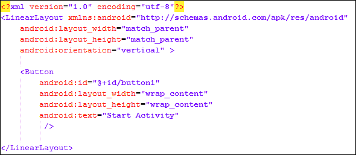

在布局文件中，我们有`LinearLayout`和`<Button>`视图在布局内。请记住，这个按钮是在将活动的视图设置为`OnClickListener`之后，由`MainActivity`文件提取的。

### 注意

在 XML 文件中声明的所有布局和视图的引用都会在`R.java`文件中自动生成。在 Java 中，我们可以使用`R`类以静态方式访问组件。例如，我们可以使用`R.layout.layout_name`来引用布局。然而，在 XML 中，可以通过放置`@`来访问`R`。例如，访问颜色时可以使用`android:name="@color/my_custom_color"`。

描述`activity_main.xml`文件，其中有一个带有关于`height`、`width`和`orientation`参数的`<LinearLayout>`。正如你所见，在`<LinearLayout>`标签内部，声明了通过活动中的`findViewById()`方法引入 Java 代码的`<Button>`标签。这个标签还带有如`id`、`width`、`height`和`text`等参数，这些参数将显示在布局中。

#### `activity_main2.xml`文件

`activity_main2.xml`文件布局是`SecondActivity`类的视觉表示。以下代码展示了这个文件：

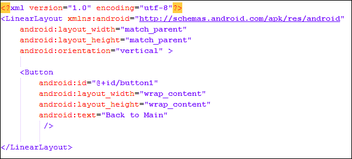

这个布局与`activity_main`布局相同，只是按钮的文本值不同。这被用在`SecondActivity.java`类中。同样，按钮是从 XML 通过活动中的`findViewById()`方法引用到 Java 的，并且设置了`OnClickListener`以定义点击按钮时要执行的自定义操作。

没有包含`AndroidManifest`文件的 Android 应用程序是不完整的。我们已经实现了示例应用的视觉布局以及它们使用显式意图从一个活动导航到另一个活动的功能。然而，当应用程序有多个活动时，必须通知 Android 操作系统所有这些活动及其属性。为了告知 Android 操作系统使用了多少个活动类，使用了`AndroidManifest`文件。让我们看看这个文件是如何通知 Android 操作系统有关活动的。

#### `AndroidManifest.xml`文件

`AndroidManifest.xml`文件包含应用程序的所有设置和偏好。在处理多个活动时，开发者在声明活动时应小心。只有一个定义应用程序启动点的活动应该具有启动器的意图过滤器。所有活动都应该在这里保存。关于活动的信息可以包括活动的标签、活动的主题、方向等。对于活动来说，`AndroidManifest.xml`文件就像一个注册中心，应用中的所有组件，如`Activity`类、`Service`类等，都应该在这里注册。如果任何活动没有在`AndroidManifest.xml`文件中注册，Android 操作系统在调用该活动时将抛出`ActivityNotFoundException`异常。

关于我们的显式意图应用，两个活动`MainActivity`和`SecondActivity`都在`AndroidManifest.xml`文件中注册。需要在此注意的是，`MainActivity`有一个`<intent-filter>`子标签，它将`MainActivity`声明为整个应用程序的启动或入口活动。以下是`AndroidManifest.xml`文件中实现的代码：

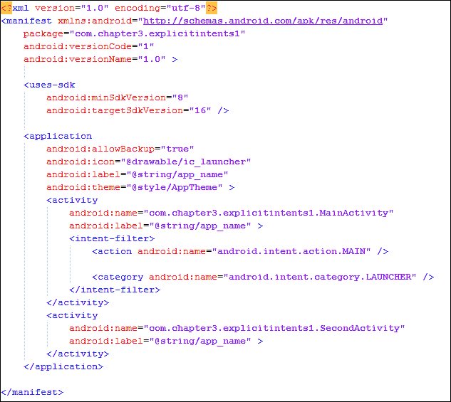

通过`AndroidManifest.xml`文件，我们的显式意图示例就完成了。在这个例子中，我们定义了两个活动；其中一个是主活动。主活动通过显式声明另一个活动的名称，使用显式意图来启动该活动。该示例包含了两个布局文件，用于两个活动以及清单文件的视觉表示，并注册所有活动以及应用程序的基本设置。当你运行项目时，你应该能看到如下所示的屏幕转换：

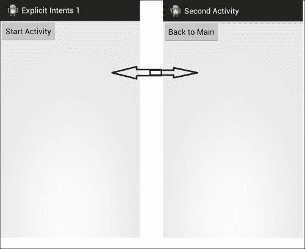

在下一节中，我们将了解显式意图在服务中的另一种用途。我们将学习如何从活动中显式使用意图来启动服务。

### 通过显式意图启动服务。

与活动不同，服务在后台执行特定的任务和动作。服务没有任何视觉布局或 UI。需要注意的是，服务运行在应用的主线程上；因此，当 Android 需要内存时，它会停止那些不在运行或处于暂停状态的服务。在下一个示例中，我们将使用显式意图启动服务，并使用相同的显式意图停止它。因此，为了开始这个示例，请使用任何 Android IDE（如带有 ADT 插件的 Eclipse 或 Android Studio）创建一个空项目。在这个项目中，我们将实现使用显式意图来启动/停止服务。由于我们的主要关注点是显式意图，我们将创建一个非常简单的服务，在被活动启动或停止时显示吐司通知。我们在示例应用程序中修改/实现了四个部分。下面，我们逐一看看这些文件的作用。

#### ServiceExample.java 类

由于我们的示例应用包含一个服务，这个文件是我们应用中使用的服务类的表示。以下代码展示了服务的实现：

```kt
public class ServiceExample extends Service {

    @Override
    public IBinder onBind(Intent intent) {
        return null;
    }

    @Override
    public void onCreate() {
        super.onCreate();
        Toast.makeText(this,"Service Created",300);
    }

    @Override
    public void onStart(Intent intent, int startId) {
        super.onStart(intent, startId);
        Toast.makeText(this,"Service start",300);
    }

    @Override
    public int onStartCommand(Intent intent, int flags, int startId) {

        Toast.makeText(this,"task perform in service",300);
        return super.onStartCommand(intent, flags, startId);
    }
}
```

在 Android 开发中，我们必须从`Service`类扩展我们的类，并根据我们的自定义覆盖和实现所需的方法，以创建任何服务。首先，开发者必须实现`onBind()`方法，这是必须的。这个方法是`Service`的一个抽象方法。该方法用于在运行时绑定正在运行的服务。然后，`onCreate()`和`onStart()`方法与活动类中的相同。开发者在这些方法中进行必要的初始化设置。在我们的示例中，我们只是将显示通知用户方法调用的吐司。`onStartCommand()`方法是一个非常重要的方法，我们在这里完成所有后台工作。需要注意的是，服务在主线程中运行。因此，如果你想要执行繁重的处理任务，你应该在这个方法中创建一个单独的线程并启动它。这就是标准方式下进行后台处理的方法。

### 注意

我们也可以在主线程中创建线程，在后台执行繁重的处理；那么为什么我们需要服务来创建线程呢？在 Android 操作系统中，服务是进行后台处理的标准方法。当 Android 操作系统内存不足时，它可以停止空闲的服务以获取其内存。但它不能停止线程；因此，使用服务是在后台持续执行任务的一种更好的方式。

在`onStartCommand()`方法中，我们除了像服务类的其他方法一样显示一个吐司外，没有做任何事情。关于服务类没有特别需要提及的地方。与上一个示例一样，这个示例应用中最重要的部分是主活动。现在让我们详细看看主活动类。

#### ServiceDemoActivity.java 类

ServiceDemoActivity.java 类是我们应用的主活动，定义了应用程序的启动点。以下代码展示了类的实现：

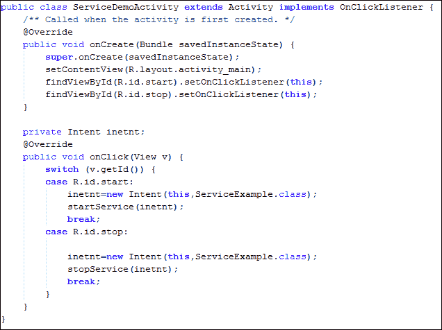

这个类是从 `Activity` 类扩展而来的，我们覆盖了一些其方法。在 `onCreate()` 方法中，我们通过引用存储在应用 `res/layout` 文件夹中的布局来设置活动的 ContentView 布局。然后，我们在布局中提取按钮并为这些按钮设置 `OnClickListener`。在早期的示例中，我们为按钮使用了 `OnClickListener` 接口的匿名对象。在这个示例中，我们通过在 `setOnClickListener()` 方法参数中传递 `this` 来提供 `Activity` 类作为我们的 `OnClickListener`。传递给参数的对象必须实现 `OnClickListener` 接口并覆盖 `onClick()` 方法。因此，我们的活动类实现了这个接口以及扩展的活动。我们还在这个类中覆盖了 `onClick()` 方法。由于这次我们有两个按钮并且只有一个 `OnClickListener` 接口，我们必须首先找出哪个按钮被按下，然后相应地采取行动。

一种实现方式是获取按下视图的 ID，并与资源中的 ID 进行比较。因此，`getId()` 方法为我们返回视图的 ID；我们在 switch 代码块中传递 ID，并与我们按钮的 ID 进行比较。在这两种情况下，我们都在创建一个显式意图，传递活动的上下文和我们的服务类名作为要激活的目标组件，就像我们在活动示例中所做的那样。需要注意的是，服务是通过 `startService()` 方法启动并通过 `stopService()` 方法停止的。这些方法采用显式意图，包括有关需要启动或停止哪个服务的信息。这个类向我们展示了如何容易地使用显式意图从任何活动中启动或停止任何服务。像往常一样，这个主活动使用了两个按钮，`Start` 和 `Stop`，这两个按钮是从位于 Android 项目目录资源文件夹中的布局中提取的。让我们看看这个布局文件包含什么。

#### `activity_main.xml` 文件

`activity_main.xml` 文件是 `ServiceDemoActivity` 的布局文件，采用 XML 编写。以下代码显示了该文件的实现：


我们在布局中有一个 `<LinearLayout>` 元素和两个按钮视图。请记住，这些按钮是由 `ServiceDemoActivity` 文件提取的，以在设置活动的视图后为两个按钮设置 `OnClickListener`。

### 注意

我们可以在 XML 以及 Java 中创建布局。Android 建议在 XML 中创建所有布局，因为 Java 在 Android 中用于处理。如果我们用 Java 创建布局，布局的创建也将被处理；这可能导致应用程序更加耗电。只有在动态布局中，例如在游戏中使用的布局，才使用 Java。

在描述`activity_main.xml`文件时，有一个`<LinearLayout>`元素，它具有关于`height`（高度）、`width`（宽度）和`orientation`（方向）的特定参数。如您所见，在`<LinearLayout>`标签内，声明了按钮，这些按钮被引入到 Java 代码中。此标签还带有关于`height`（高度）、`width`（宽度）、`id`和`text`（将出现在布局中的文本）的特定参数。最后但同样重要的是，Android 的 manifest 文件用于应用程序设置。与活动一样，开发者必须在 manifest 文件中注册应用程序中实现的所有服务。让我们看看文件，了解我们是如何在示例应用的 manifest 文件中注册服务的。

#### `AndroidManifest.xml`文件

要注册一个服务，我们必须在`<application>`标签内提供代码。以下代码展示了`AndroidManifest.xml`文件的完整实现：


可以注意到，在`<activity>`标签之后，我们放置了带有属性名称的`<service>`标签，以定义我们正在注册哪个服务。如果我们不在`AndroidManifest.xml`文件中注册我们的服务，我们将遇到`ServiceNotFoundException`异常抛出，并且我们会得到错误日志，例如 "`Unable to start service (service package with name): not found`"。

### 注意

**LogCat**位于 Android Studio 的 DDMS 视图中。LogCat 记录了连接设备或模拟器中执行的所有活动。任何抛出的`Force Close`崩溃异常都会在 LogCat 中记录，开发者可以通过它找到崩溃的原因并解决。

到目前为止，我们关注的是显式意图，并创建了两个使用显式意图的简单应用。现在，让我们转向另一种称为隐式意图的意图类型。

# 隐式意图

与显式意图不同，当开发者不知道要使用哪个组件时，隐式意图是一个很好的选择。隐式意图不会像显式意图那样直接指定要激活的 Android 组件，而只是指定需要执行哪些操作。Android 操作系统将选择要触发的组件。如果有多個可以触发的组件，Android 操作系统会为用户提供选项，让用户选择一个组件。例如，我们想要在浏览器中打开一个网页链接。如果我们使用显式意图，我们有一个选项是开发我们自己的自定义浏览器，并从我们的应用程序中明确触发它来查看网页链接。另一种更可取的方法是使用隐式意图打开手机中已安装的任何浏览器。如果手机中安装了不止一个浏览器，用户将被给予选择一个来执行操作，即查看网页链接。隐式意图的这项功能作为在 Android 操作系统中执行任何操作的一般形式。我们在意图中指定数据和操作，Android 根据该数据选择合适的组件。以下代码段展示了一个隐式意图的简单声明，它提供了一个链接，由 Android 在最适合的组件或浏览器中浏览：

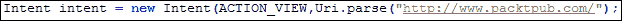

与显式意图一样，隐式意图的构造函数中传递了两个参数。你可以在第二章《Android 意图简介》中阅读更多关于意图构造函数的内容。第一个参数是 Android 操作系统要执行的操作；我们在这里指定为`ACTION_VIEW`。这将告诉 Android 系统，即将查看某物。另一个参数是数据，通常以`URI`格式定义。我们使用了 PacktPub 网站作为示例。Android 操作系统将在手机默认浏览器中打开这个网页地址。如果找到多个浏览器，用户将看到一个所有可用浏览器的列表，以选择一个查看地址。

### 注意

这里可以传递任何 URI，不仅限于网页地址。例如，手机中任何联系人的 URI 或图库中的任何图片也可以传递，Android 操作系统将为传递在 URI 中的数据采取最合适的操作。

这种意图的通用行为在 Android 开发中显得尤为重要。开发者通过制作通用应用节省了大量时间。这对开发者来说很有利，因为他们只需发送信息即可。其余的由 Android 操作系统定义，用户可以根据自己的意愿选择执行操作。开发者不仅可以为用户提供选择其他应用执行隐式意图中动作的功能，还可以开发自己的自定义应用，并将其添加到选择列表中。例如，我们开发了一个图片编辑应用。我们希望该应用能够实现在用户从任何其他应用中选择图片时，我们的应用能出现在选项列表中，这样用户就可以轻松地从手机中的任何位置导航到我们的应用来编辑图片。这可以通过隐式意图实现。但这次的差别是，我们不会发送隐式意图；相反，我们将从其他应用接收隐式意图。我们可以通过在我们的`AndroidManifest.xml`文件中注册意图过滤器来实现这一点，在这里我们需要定义应用将执行的操作。这个特性使得应用与其他应用的互动性更强，不同应用与 Android 操作系统之间的集成对开发者来说变得非常简单。在以下各节中，我们将开发两个隐式意图的示例，并看看我们可以用这些示例做什么。

## 在 Android 应用程序中使用隐式意图

本节将讨论在 Android 应用程序中隐式意图的各种用途。如前所述，隐式意图可以以通用形式用于与其他 Android 组件进行通信，与显式意图不同。让我们通过以下两个示例来看隐式意图的实际应用：一个用于共享内容，另一个用于从其他 Android 应用获取内容。

### 使用隐式意图共享内容

如今，社交网络是使任何应用程序病毒式传播并推广给其他用户的原因。由于社交网络的种类繁多，将所有共享功能都放入应用中变得困难。大多数情况下，开发者在他们的应用中添加 Facebook、Twitter 和 Instagram，但有时在应用中添加这些 SDK 不仅给开发者带来麻烦，也给用户带来麻烦。例如，多个 SDK 会在构建文件中增加一些大小；应用由于功能过多而变得复杂。

幸运的是，我们可以通过几行代码使用隐式意图来解决此问题。让我们通过创建一个简单的内容共享示例来看看这是如何可能的。首先，使用任何 Android IDE（如带有 ADT 插件的 Eclipse 或 Android Studio）创建一个空项目，或者打开您想要添加共享功能的任何现有项目。我们现在将实现使用隐式意图在社交网络上共享任何数据。

我们实现了一个简单的单行分享应用，该应用会要求用户选择分享方式，并在该网络上分享这一行内容。在任何空项目中，都有两个主要文件会被修改。让我们逐一探索这两个文件。

#### activity_main.xml 文件

activity_main.xml 文件是我们简单的行分享应用的视觉布局。以下代码片段展示了这个文件的实现：

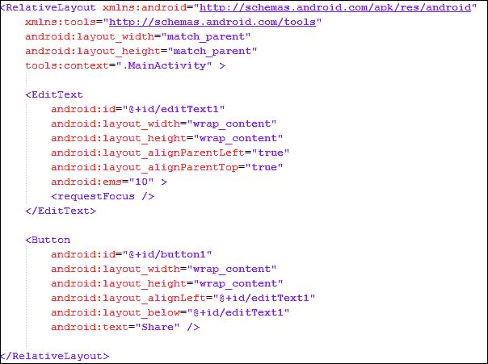

我们有一个相对布局，在其中放置了两个视图：一个带有`text`为`Share`的按钮和一个`<EditText>`标签，用于获取用户的输入行。在之前的例子中，我们使用了`<LinearLayout>`来在屏幕上对齐视图。这次，我们使用了`<RelativeLayout>`来添加视图。在相对布局中，我们根据其他视图来放置我们的视图。例如，`android:layout_alignLeft`获取任何视图的 ID，并将此视图放在主视图的左侧。同样，在`Share`按钮中，我们也使用了`android:layout_below`属性，将其放置在文本字段下方。关于文本字段，这是屏幕上的第一个视图；因此，它可以相对于父视图放置。

### 注意

`layout_ android:layout_alignParentLeft`和`android:layout_alignParentTop`布尔标志将`EditText`视图放置在父视图的左上角，即屏幕的左上角。在 Android 操作系统中，使用相对布局来对齐视图是最推荐的方法。

这就是我们的单行分享应用的视觉表示。现在，让我们看看在主活动文件中是如何使用隐式意图的。

#### MainActivity.java 类

MainActivity.java 类文件是行分享应用的主活动。以下代码展示了该文件的实现：

```kt
public class MainActivity extends Activity {

  @Override
  protected void onCreate(Bundle savedInstanceState) {
    super.onCreate(savedInstanceState);
    setContentView(R.layout.activity_main);

    Button shareBtn = (Button) findViewById(R.id.button1);
    shareBtn.setOnClickListener(new OnClickListener() {
      @Override
      public void onClick(View arg0) {
        // TODO Auto-generated method stub
        String msg = ((EditText) findViewById(
          R.id.editText1)).getText().toString();

        Intent in = new Intent(Intent.ACTION_SEND);
        in.putExtra(Intent.EXTRA_TEXT, msg);
        in.setType("text/html");
        startActivity(Intent.createChooser(in, "Share via..."));
      }
    });
  }
}
```

这个类是从`Activity`类扩展而来的，目的是使其成为一个活动。像往常一样，我们重写了`onCreate()`方法，通过`setContentView()`方法设置活动的 Content View，并引用了一个布局，这个布局就是位于`res/layout`目录下的`activity_main.xml`文件。设置布局后，我们通过`findViewById()`方法从布局中获取按钮的引用，并将其`View.OnClickListener`接口设置为一个匿名对象。

设置视图后，让我们设置监听器并在可触摸视图上定义功能。为此，我们重写了监听器的`onClick()`方法，并在该方法中放置了我们的主要功能代码，因为我们要在按钮点击时分享行内容。我们首先通过获取其引用从文本字段中获取消息文本，然后获取字段中的文本。我们创建了一个`Intent`对象，并在构造函数中传递了`ACTION_SEND`作为其类别。`ACTION_SEND`意图将数据传递给 Android 操作系统。

请记住，我们没有像显式意图中那样明确指定数据的接收者。这个动作的接收者会通过选择器对话框询问用户数据应该发送到哪里。

在创建意图实例后，我们在意图中添加了消息行的额外数据。我们选择了`EXTRA_TEXT`键来添加我们的数据。例如，如果我们想发送短信，我们必须将数据插入到短信正文中；如果我们想发送电子邮件，我们必须将数据放入电子邮件正文中。因此，我们选择了一般文本类型，Android 操作系统将检测到合适的位置放置数据。

到目前为止，我们已经设置了类别和数据，但我们还必须设置数据的类型。Android 操作系统将根据数据的类型在我们的选择器对话框中放置应用。例如，我们将类型设置为`text/html`；这将把所有支持文本或 HTML 数据格式的应用，如电子邮件、Facebook、Twitter 等，放在选择器中。如果我们将其设置为`image/png`，所有支持图像编辑、图库等的应用将被放入选择器列表中。此外，我们可以通过放置一个斜杠后跟一个星号来定义支持的图像的一般类型。例如，`image/*`将把所有支持图像的应用，不仅限于 PNG，放在选择器列表中。

最后，我们通过调用`startActivity()`方法启动这个意图的活动。你应该小心，在`startActivity()`方法或`Intent.chooser()`方法中传递意图。如果我们通过`startActivity`传递意图，我们将得到`ActivityNotFoundException`异常。我们不知道为了共享应用而具体要启动哪个活动；在这种情况下，我们将创建一个选择器列表，用户将决定要启动哪个活动。这就是我们为用户提供选择他或她喜欢的共享内容方式的方法。

现在，运行项目，你会看到一个屏幕，上面有一个**共享**按钮和一个输入要共享内容的文本字段。按下**共享**按钮后，你会看到一个对话框，询问你选择共享的方法。这个对话框将包括所有用于共享文本的应用，如短信、SMS、MMS、电子邮件和 Facebook。以下截图展示了应用屏幕：

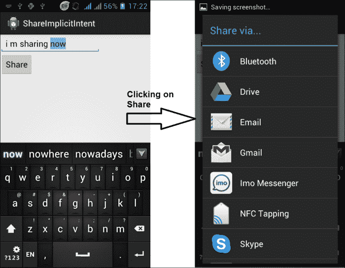

在本例中，我们使用隐式意图与 Android 操作系统的其他应用进行通信。在下一个示例中，我们将看到其他应用如何与我们的应用通信。

#### 为共享意图注册你的应用

在上一个示例中，我们从我们的应用触发了其他共享应用。在本例中，我们将为共享意图注册我们的应用，以便其他应用开发者和用户可以使用隐式意图与我们的应用通信。两个示例都使用了隐式意图，但使用方法在这两种情况下是不同的。

在上一个示例中，我们在 Java 文件中使用了隐式意图，并在`OnClickListener`中的按钮点击时触发了意图。在此示例中，为了注册我们的应用以接收任何意图，例如此例中的分享意图，我们必须在`AndroidManifest.xml`文件的 XML 文件中放置我们的代码。稍微复习一下，`AndroidManifest.xml`文件管理我们应用的所有设置。现在让我们学习如何实现应用。

要开始此示例，请使用任何 Android IDE（如带有 ADT 插件的 Eclipse 或 Android Studio）创建一个空项目，或打开你想要接收发送意图的任何现有项目。在这个项目中，我们将探索在应用中获取其他应用共享数据时隐式意图的使用。我们首先将我们的应用注册为文本共享应用。然后，所有在 Android 中共享任何`text/html`类型文件的应用都可以在用户选择时触发我们的应用。为了执行这个任务，我们修改了三个文件中的代码：一个布局文件、一个活动文件和清单文件。现在让我们逐一看看这些文件。

#### `activity_main.xml`文件

`activity_main.xml`文件是我们共享应用的视觉布局。以下代码展示了此文件的实现：

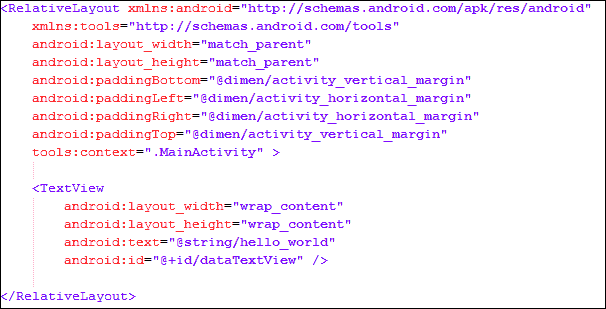

我们有一个包含文本视图组件的相对布局。我们将文本视图的初始文本值设置为“Hello World”；记住，我们从其他应用共享时得到的数据将打印在此文本视图内容中。在视觉表现之后，接下来总是应用的处理和编码逻辑。现在让我们看看下一个活动文件，它执行主要任务并实现使用隐式意图的逻辑。

#### `MainActivity.java`类

`MainActivity.java`类文件是显示来自任何其他应用共享数据的活动。以下代码展示了此文件的实现方法：

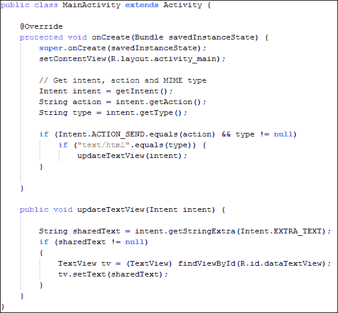

当用户从**分享**对话框中选择我们的应用时，此活动将被打开。我们还已将此活动设置为我们的主活动。应用中的任何活动都可以注册以接收分享意图。主活动不一定需要注册以接收共享数据。我们已设置活动的布局，之后我们获取意图数据。这是将从任何其他分享应用抛出的数据。我们首先通过调用`getIntent()`方法获取意图。有许多类型的意图；我们必须确保我们的活动只对我们在`AndroidManifest.xml`文件中注册的意图类型起作用。为了检测此意图是否用于分享，我们必须检查意图动作。因此，我们通过调用`Intent.getAction()`方法获取了意图的动作。我们可以使用`Intent.getType()`方法获取意图的类型。然后，我们检查类型和动作。

如果意图动作是`Intent.ACTION_SEND`且类型为`text/html`，这意味着我们可以在应用中显示那种类型的数据。如果两个条件都为`true`，我们将文本视图内容设置为从意图中得到的数据。我们可以通过`Intent.getStringExtra()`方法从意图中获取数据。这个方法将数据类型作为输入参数或参数。在这个例子中，我们获取了`Intent.EXTRA_TEXT`数据类型，它表示意图中通常用于电子邮件正文、Facebook 帖子或短信的消息或文本数据。

通过理解`MainActivity`类，我们得知我们只是接收了意图并检查了它。但还有一个问题，就是其他应用如何识别我们的应用，以及它们如何知道我们的应用可以显示`text/html`数据。如果我们从同一应用的另一个活动中显式打开这个活动，同样会接收到相同的意图，并检查相同的条件。但这次，没有条件会为`true`，因此布局中的文本不会改变。为了让其他应用看到我们的应用，我们必须注册一个意图过滤器。这是在`AndroidManifest.xml`文件中完成的。

#### `AndroidManifest.xml`文件

为了让我们的应用在分享内容时可见，我们必须在文件中为应用的接收活动注册一个意图过滤器。以下代码展示了此文件的实现：


在`MainActivity`的`<activity>`标签中，我们插入了两个意图过滤器。第一个意图过滤器是为了让这个活动成为主活动，也就是应用的启动器。第二个意图过滤器是一段执行应用核心功能的代码。我们插入了一个意图过滤器，其动作为`android.intent.action.SEND`，`mimeType`为`text/html`。这告诉安卓操作系统，每当触发具有`Send`动作的意图，并且包含`text/html`类型的数据时，应用都可以处理这个意图。这样我们的应用就会显示在应用的 chooser 对话框中。

现在，运行项目，你会看到**Hello World**的屏幕。关闭应用并运行我们之前的示例应用**ShareImplicitIntent**。在文本字段中写些东西，然后点击**分享**按钮。在 chooser 对话框中，你会在列表中看到我们的应用**GettingSharedData**。选择这个应用会打开活动，这次，文本字段中不会显示**Hello World**，而是会显示从另一个应用共享的数据。以下截图展示了应用的演示效果：


到目前为止，我们已经看到了两个隐式意图的例子。在一个例子中，我们与其他应用如电子邮件、短信、Facebook 等共享了一些数据。在另一个例子中，其他应用与我们的应用共享内容，我们接收了这些数据并进行了展示。但是，隐式意图并不仅限于共享内容。使用隐式意图可以执行很多操作和选择，包括拨打电话、发送短信、显示地图、搜索任何内容、拍照、显示和编辑联系人等等。

在下一个例子中，我们将学习如何从图库中选择任何图片并在我们的活动中显示它。

### 通过隐式意图选择图片

在这个项目中，我们将实现使用隐式意图从图库中选择任何图片的功能。我们将放置一个 ImageView，以在我们的应用中显示图片。这张图片将由用户从图库中选择。现在就让我们来实现它吧！为了开始这个例子，请使用任何 Android IDE（如带有 ADT 插件的 Eclipse 或 Android Studio）创建一个空项目，或者打开任何你想要添加图片选择功能的项目。

我们将注册我们的应用作为一个图片分享应用，这样在 Android 操作系统中所有分享图片的应用都可以在用户选择的情况下触发我们的应用。我们修改了三个文件中的代码：一个布局文件、一个活动文件和清单文件。让我们看看这些文件的作用。

#### `activity_main.xml`文件

与所有 Android 应用一样，`activity_main.xml`文件代表了主活动的布局文件。以下代码展示了此文件的实施例：


我们放置了两个视图组件；一个按钮视图，用于点击时打开图库，以及一个用于显示图片的 ImageView。与其他应用不同，我们在布局文件中设置了按钮监听器。回顾最后一种方法，我们通过在活动类文件中调用`button.setOnClickListener()`方法来设置我们的点击监听器。在这个例子中，我们在`<Button>`标签中使用了`android:onClick`属性，并在属性另一侧提供了监听器的名称。我们必须提供一个方法名，该方法应该在此布局使用的活动文件中定义。

### 提示

Android 操作系统建议你在 XML 布局文件中设置监听器。但是，如果布局被多个活动使用，开发者应该注意，因为属性值是一个方法名，并且应该在活动文件中定义。这意味着要么所有使用布局文件的活动都定义该方法，要么所有活动都应该在 Java 文件中设置监听器，而不是在 XML 中。

我们布局文件中的另一个视图组件是 ImageView。这个 ImageView 将显示从图库或其他图片分享应用中选择的图片。我们将 ImageView 的来源设置为启动器图标图像作为默认图片。

在开发应用程序的布局之后，让我们关注应用程序的逻辑。`MainActivity`文件展示了应用程序如何从其他应用程序获取图像并显示它。

#### MainActivity.java 类

MainActivity.java 类是主活动 Java 文件，它执行应用程序中的所有功能。以下代码段是此文件的实现：

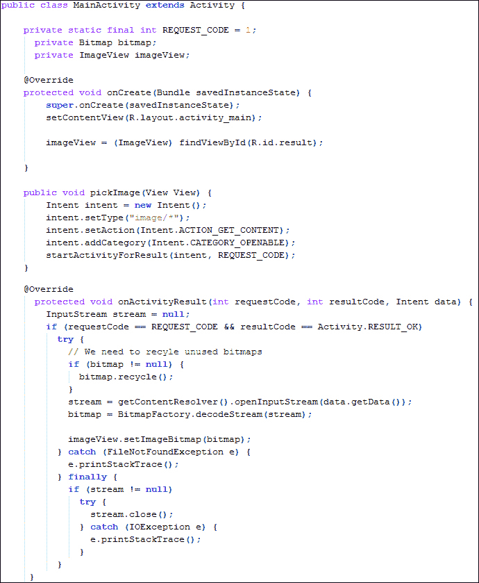

我们从`onCreate()`方法开始，首先将活动的 Content View 设置为我们布局文件。我们在类中创建了三个私有字段。第一个是`REQUEST_CODE`常量，它是一个整数值。这个常量用作从任何其他 Android 应用获取数据的请求代码。由于我们要从图库中选择图片，因此需要一个请求代码来识别正确的结果和数据。第二个字段是位图。这个位图用于以位图格式存储选中的图片。活动类的第三个也是最后一个字段是 Image View。这用于在 XML 文件中引用 Image View。

`pickImage()`方法是设置在 XML 布局文件的`<Button>`标签中的按钮监听器。这个方法应该带有`View`参数。这个参数包含了在运行时被点击的视图。根据我们应用程序的要求，我们希望在按钮点击时打开图库；因此，为了打开图库，在这个方法中将触发一个隐式意图。我们使用无参数构造函数创建一个空的意图对象。然后，我们使用`image/*`将其类型设置为任何图像格式。之后，我们将它的意图动作设置为`Intent.ACTION_GET_CONTENT`。这告诉 Android 操作系统显示所有共享内容的应用程序。

现在，我们已经告诉 Android 操作系统，我们只需要图像内容，通过设置类型；因此，Android 操作系统只显示那些共享图像的应用程序，如图库。我们将类别设置为`Intent.CATEGORY_OPENABLE`。这用于指示`GET_CONTENT`意图只需要可以用`ContentResolver.openInputStream`打开的 URIs。

最后，我们通过调用`startActivityForResult()`方法来启动活动。请记住，在我们之前的应用程序中使用了`startActivity()`方法。

### 提示

`startActivity()`方法和`startActivityForResult()`方法之间的区别在于，`startActivityForResult()`方法在停止后会将一些结果返回给父活动，而`startActivity()`则不返回任何内容。

因为我们需要从图库中获取任何图片，图库应用将返回我们将在应用中使用的图片 URI 以显示它。为了在我们的活动中获取结果，我们需要在类中覆盖`onActivityResult()`方法。这个方法有三个参数。第一个是请求码，是一个整数值。这个值定义了我们用于启动活动的请求 ID。我们在类中使用了一个常量私有字段`REQUEST_CODE`作为这个值；因此，在我们的`onActivityResult()`方法中，我们将请求码与这个常量值进行比较以确认。第二个参数`RESULT_CODE`是一个整数值。这个值告诉我们得到的结果是否正确且可以使用。第三个参数是意图，它包含我们将要在应用中使用的结果数据。

在`onActivityResult()`方法中，我们创建了一个`InputStream`对象，然后通过比较请求码和结果码来确定是否应该处理意图数据。如果一切顺利，我们可以通过调用`Intent.getData()`方法获取选定的图片 URI，并将其传递给本活动的`ContentResolver`的`openInputStream()`。任何活动的`ContentResolver`都可以通过调用`Activity.getContentResolver()`方法获得。获取到 URI 的数据流后，我们通过调用`BitmapFactory.decodeStream()`方法将其解码为位图，并将输出位图设置到我们的活动位图字段中。然后，我们在图像视图中设置位图。在`try/catch`块的最后一部分，我们关闭了流。

现在，运行项目，您将看到如下截图所示的屏幕。用户点击按钮，将显示图库。然后，用户选择他喜欢的照片以显示，应用将在应用屏幕上展示它：

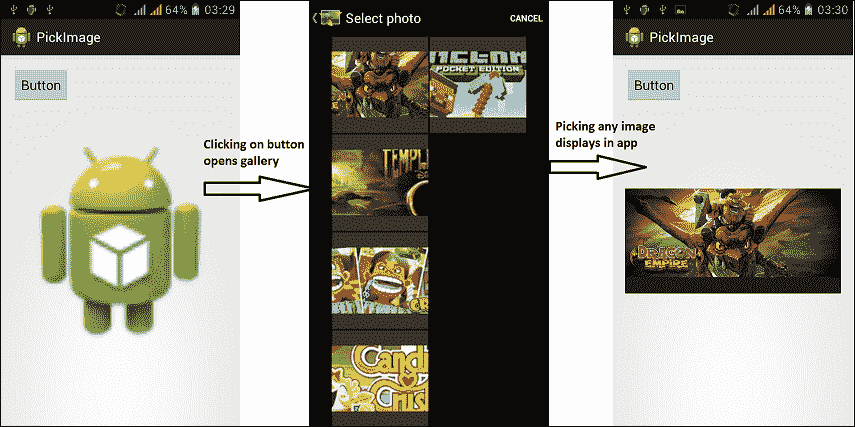

总结关于隐式意图的整个部分，我们实现了三个示例。在第一个示例中，我们学习了如何与其他应用共享数据。在第二个示例中，我们了解了其他应用如何与我们的应用共享数据。最后，在第三个也是最后一个示例中，我们学习了如何从图库获取图片并在我们的应用中使用它。在下一节也是最后一节中，我们将讨论 Android 晚期绑定。

# 意图和 Android 晚期绑定

众所周知，Android 应用程序最核心的三个组件是活动（activities）、服务（services）和广播接收器（broadcast receivers）。这些组件通过消息传递进行通信和触发。这种消息传递是通过意图（intents）完成的。意图消息传递是同一应用程序或不同应用程序中组件之间的晚期运行时绑定（晚期绑定）的机制。在每种情况下，Android 系统都会找到正确的组件，例如要触发的活动、服务或接收器，并在必要时实例化它们。这些意图之间没有重叠。例如，广播接收器意图只发送给广播接收器，而不会发送给任何活动或服务。另一个例子是，通过`startActivity()`或`startActivityForResult()`方法传递的意图永远不会发送给任何如服务或接收器这样的组件，而只发送给一个活动。

在本章使用的示例中，隐式意图总是执行开发者不确定这些操作将如何执行以及使用什么应用程序的动作。这种将动作分配给组件的运行时行为称为 Android 晚期运行时绑定，这可以通过隐式意图轻松完成。

# 总结

在本章中，我们讨论了意图的分类，包括隐式意图、显式意图和晚期绑定。本章还提供了 Android 意图的一些重要实现，我们通过这些实现与其他应用程序共享数据，其他应用程序与我们的应用程序共享数据，从图库中选择任何图片，通过显式意图启动活动或服务等等。

在下一章中，我们将学习如何通过意图触发移动组件，例如摄像头，以及它们在我们的应用程序中的使用方式。
