# 第四章：移动组件的意图

在上一章中，我们讨论了意图的分类以及不同类别意图的使用方法。我们还讨论了隐式意图和显式意图等类别的优缺点。但是，除了我们至今讨论的关于意图的理论之外，现在是我们讨论一些更实用的意图应用的时候了。在本章中，我们将讨论所有安卓手机中常见的移动组件，并了解如何通过意图非常容易地访问和使用这些移动组件。安卓提供了丰富的库和功能，开发者可以利用这些来使用移动组件，这就像在公园里散步一样简单。本章主要包括四类不同的组件：视觉组件如摄像头，通信组件如 Wi-Fi 和蓝牙，媒体组件如视频和音频录制、语音识别以及文本到语音转换，最后是运动组件，如接近传感器。本章将讨论以下主题：

+   常见移动组件

+   组件与意图

+   通信组件

+   通过意图使用蓝牙

+   通过意图使用 Wi-Fi

+   媒体组件

+   通过意图拍照和录制视频

+   使用意图进行语音识别

+   意图在文本到语音转换中的作用

+   运动组件

+   通过意图设置接近提醒

本章以及后续章节的理解需要依赖于前几章中讨论的意图的概念和结构。如果你对这些内容没有基本的了解，我们建议你阅读第二章，*安卓意图简介*和第三章，*意图及其分类*，以便继续深入学习。

# 常见移动组件

由于安卓操作系统的开源性质，许多不同的公司如 HTC 和三星在他们的设备上移植了具有许多不同功能和风格的安卓操作系统。每款安卓手机在某种程度上都是独一无二的，拥有许多与其他品牌和手机不同的独特功能和组件。但在所有安卓手机中，有一些组件是共通的。

### 注意

这里我们使用了两个关键术语：组件和功能。**组件**是安卓手机的硬件部分，如摄像头、蓝牙等。而**功能**是安卓手机的软件部分，如短信功能、电子邮件功能等。本章全部关于硬件组件，以及如何通过意图访问和使用这些组件。

这些通用组件可以独立于任何手机或型号进行普遍使用和实现。毫无疑问，意图是激活这些 Android 组件的最佳异步消息。这些意图用于在发生某些事件时应采取某些操作时触发 Android 操作系统。Android 根据接收到的数据，确定意图的接收者并触发它。以下是每部 Android 手机中都存在的几个常见组件：

## Wi-Fi 组件

每部 Android 手机都配备了完整的 Wi-Fi 连接组件支持。具有 Android 版本 4.1 及以上的新 Android 手机还支持 Wi-Fi Direct 功能。这使得用户无需连接热点或网络接入点即可连接到附近的设备。

## 蓝牙组件

Android 手机包括蓝牙网络支持，允许 Android 手机用户与其他设备在低范围内无线交换数据。Android 应用程序框架为开发者提供了通过 Android 蓝牙 API 访问蓝牙功能的方法。

## 蜂窝组件

没有手机是不完整的，每个 Android 手机都有一个用于通过短信、通话等进行移动通信的蜂窝组件。Android 系统提供了非常高级、灵活的 API 来利用电话和蜂窝组件创建非常有趣和创新的应用程序。

## 全球定位系统（GPS）和地理位置

GPS 是任何 Android 手机中非常有用但耗电的组件。它用于为 Android 用户开发基于位置的应用程序。谷歌地图是与 GPS 和地理位置相关的最佳功能。开发者已经提供了许多利用谷歌地图和 Android 中的 GPS 组件的创新应用程序和游戏。

## 地磁场组件

地磁场组件在大多数 Android 手机中都可以找到。此组件用于估计在地球给定点的 Android 手机的磁场，特别是计算从北磁偏角。

### 注意事项

地磁场的组件使用由美国国家地理空间情报局生产的**世界磁模**。目前用于地磁场的模型有效期至 2015 年。较新的 Android 手机将拥有地磁场的新版本。

## 传感器组件

大多数 Android 设备内置有测量运动、方向、环境条件等的传感器。这些传感器有时充当应用的大脑。例如，它们根据手机的周围环境（天气）采取行动，并允许用户与应用自动互动。这些传感器为测量相应传感器值提供高精度和准确性的原始数据。例如，重力传感器可以用于在任何应用或游戏中追踪手势和动作，如倾斜、震动等。同样，温度传感器可以用来检测手机温度，或者如前所述的地磁传感器可以在任何旅行应用中使用来追踪指南针方位。总的来说，Android 中有三大类传感器：运动传感器、位置传感器和环境传感器。以下小节将简要讨论这些类型的传感器。

### 运动传感器

运动传感器允许 Android 用户监控设备的运动。既有基于硬件的传感器，如加速度计、陀螺仪，也有基于软件的传感器，如重力、线性加速度和旋转矢量传感器。运动传感器用于检测设备的运动，包括倾斜效果、震动效果、旋转、摆动等。如果使用得当，这些效果可以使任何应用或游戏变得非常有趣和灵活，并能证明提供极佳的用户体验。

### 位置传感器

两个位置传感器，地磁传感器和方向传感器，用于确定移动设备的位置。另一个传感器，近距离传感器，允许用户确定设备的面部与物体的距离有多近。例如，当我们在 Android 手机上接到任何电话时，将手机放在耳朵上会关闭屏幕，当我们把手机拿回手中时，屏幕显示会自动出现。这个简单的应用使用近距离传感器来检测耳朵（物体）与设备面部（屏幕）的接触。

### 环境传感器

这些传感器在 Android 应用中使用不多，但被 Android 系统广泛用于检测许多小事物。例如，温度传感器用于检测手机的温度，并可用于节省电池和延长手机寿命。

### 注意

在撰写本书时，三星 Galaxy S4 Android 手机已经发布。该手机通过允许用户通过无需触摸的手势，如移动手或脸在手机前执行操作，展现了环境手势的极大使用，例如拨打电话。

# 组件和意图

Android 手机包含大量的组件和功能。这对 Android 开发者和用户都有利。Android 开发者可以使用这些移动组件和功能来定制用户体验。对于大多数组件，开发者有两个选择；他们可以扩展组件并根据应用程序需求进行定制，或者使用 Android 系统提供的内置接口。由于扩展组件超出了本书的范围，我们不会讨论第一个选择。但是，我们将研究使用移动组件的内置接口的另一种选择。

通常，为了从我们的 Android 应用程序中使用任何移动组件，开发者会向 Android 系统发送意图，然后 Android 根据意图调用相应的组件。正如我们之前所讨论的，意图是发送给 Android 操作系统的异步消息，以执行任何功能。大多数移动组件只需使用几行代码就可以通过意图触发，并且开发者可以在他们的应用程序中充分利用这些组件。在本章的以下部分，我们将通过实际示例看到一些组件以及如何通过意图使用和触发它们。我们将组件分为三种方式：通信组件、媒体组件和运动组件。现在，让我们在以下各节中讨论这些组件。

## 通信组件

任何手机的核心用途都是通信。除了通信功能外，Android 手机还提供了许多其他功能。Android 手机包含用于通信目的的短信/彩信、Wi-Fi 和蓝牙。本章关注硬件组件；因此，我们将在本章中仅讨论 Wi-Fi 和蓝牙。Android 系统提供了内置 API 来管理和使用蓝牙设备、设置、可发现性等。它不仅为蓝牙，也为 Wi-Fi、热点、配置设置、互联网连接等提供了完整的网络 API。更重要的是，通过意图编写少量代码，可以非常容易地使用这些 API 和组件。我们将从讨论蓝牙开始，在下一节中，我们将介绍如何通过意图使用蓝牙。

### 通过意图使用蓝牙

蓝牙是一种通信协议，旨在实现短距离、低带宽的点对点通信。在本节中，我们将讨论如何与本地蓝牙设备进行交互和通信，以及如何通过蓝牙与附近的远程设备进行通信。蓝牙是一种非常短距离的协议，但可以用来传输和接收文件、媒体等数据。由于数据加密，截至 Android 2.1 版本，只有配对的设备才能通过蓝牙设备相互通信。

### 注意

从 Android 2.0 版本（SDK API 级别 5）开始，蓝牙 API 和库变得可用。还应该注意的是，并非所有 Android 手机都必然包含蓝牙硬件。

安卓系统提供的蓝牙 API 用于执行许多与蓝牙相关的操作，包括打开/关闭蓝牙、与附近设备配对、与其他蓝牙设备通信等等。但并非所有这些操作都可以通过意图执行。我们将仅讨论那些可以通过意图执行的操作。这些操作包括从我们的安卓应用中设置蓝牙的开启/关闭、跟踪蓝牙适配器状态以及使我们的设备在短时间内可被发现。无法通过意图执行的操作包括向其他蓝牙设备发送数据和文件、与其他设备配对等。接下来，让我们在以下各节中逐一解释这些操作。

#### 一些蓝牙 API 类

在本节中，我们将讨论安卓蓝牙 API 中一些在所有使用蓝牙的安卓应用中都会用到的类。理解这些类将帮助开发者更容易理解以下示例。

##### BluetoothDevice

这个类代表与用户通信的每个远程设备。这个类是对手机蓝牙硬件的薄封装。要对此类的对象执行操作，开发者必须使用`BluetoothAdapter`类。这个类的对象是不可变的。我们可以通过调用`BluetoothAdapter.getRemoteDevice(String macAddress)`并传递任何设备的 MAC 地址来获取`BluetoothDevice`。这个类的一些重要方法包括：

+   `BluetoothDevice.getAddress()`: 它返回当前设备的 MAC 地址。

+   `BluetoothDevice.getBondState()`: 该方法返回当前设备的绑定状态，例如未绑定、正在绑定或已绑定。

### 注意

**MAC 地址**是一个由 12 个字符组成的字符串，以 xx:xx:xx:xx:xx:xx 的格式表示。例如，00:11:22:AA:BB:CC。

##### BluetoothAdapter

这个类代表当前运行我们安卓应用的设备。需要注意的是，`BluetoothAdapter`类代表当前设备，而`BluetoothDevice`类代表其他可能与我们的设备配对或未配对的设备。这个类是一个单例类，不能被实例化。要获取这个类的对象，我们可以使用`BluetoothAdapter.getDefaultAdapter()`方法。要执行与蓝牙通信相关的任何操作，这个类是主要的起点。这个类的一些方法包括`BluetoothAdapter.getBondedDevices()`，它返回所有已配对的设备，`BluetoothAdapter.startDiscovery()`，它搜索附近所有可发现的设备等等。还有一个名为`startLeScan(BluetoothAdapter.LeScanCallback callback)`的方法，用于在发现设备时接收回调。这个方法在 API 级别 18 中引入。

### 注意

`BluetoothAdapter` 和 `BluetoothDevice` 类中的某些方法需要 `BLUETOOTH` 权限，有些还需要 `BLUETOOTH_ADMIN` 权限。因此，当在您的应用中使用这些类时，不要忘记在 Android 清单文件中添加这些权限。

到目前为止，我们已经讨论了 Android OS 中的一些蓝牙类以及这些类中的某些方法。在下一节中，我们将开发我们的第一个 Android 应用，它将要求用户打开蓝牙。

#### 打开蓝牙应用

要执行任何蓝牙操作，必须先打开蓝牙。因此，在本节中，我们将开发一个 Android 应用，如果蓝牙设备尚未打开，它会要求用户打开蓝牙设备。用户可以接受并打开蓝牙，或者用户也可以拒绝。在后一种情况下，应用程序将继续运行，而蓝牙将保持关闭状态。可以说，使用意图可以非常容易地执行此操作。让我们通过查看代码来看看如何做到这一点。

首先，在您喜欢的 IDE 中创建一个空的 Android 项目。我们是在 Android Studio 中开发的。在撰写这本书的时候，项目处于预览模式，预计不久将进行测试版发布。现在，我们将修改项目中的几个文件，以创建我们的 Android 蓝牙应用。我们将修改两个文件。让我们在以下章节中看看这些文件。

##### MainActivity.java 文件

这个类代表我们 Android 应用的主活动。以下代码是在此类别中实现的：

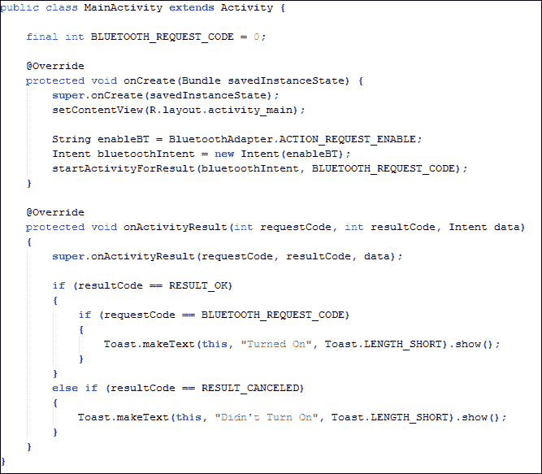

在我们的活动中，我们声明了一个名为 `BLUETOOTH_REQUEST_CODE` 的常量值。这个常量作为请求代码或请求唯一标识符，在我们的应用与 Android 系统之间的通信中使用。当我们请求 Android 操作系统执行某些操作时，我们会传递任何请求代码。然后，Android 系统执行操作并将相同的请求代码返回给我们。通过比较我们的请求代码与 Android 的请求代码，我们就可以知道已执行的操作。如果代码不匹配，则意味着此操作是针对其他请求的，不是我们的请求。在 `onCreate()` 方法中，我们通过调用 `setContentView()` 方法设置活动的布局。然后，在接下来的几行中，我们执行实际的任务。

我们创建了一个字符串`enableBT`，它获取与`BluetoothAdapter`类相关的`ACTION_REQUEST_ENABLE`方法的值。这个字符串在意图构造函数中传递，以告诉意图它的目的是启用蓝牙设备。与蓝牙启用请求字符串一样，安卓操作系统还包含许多其他请求，用于各种动作，如 Wi-Fi、传感器、相机等。在本章中，我们将了解一些请求字符串。在创建请求字符串之后，我们创建我们的意图，并将请求字符串传递给它。然后，我们通过在`startActivityForResult()`方法中传递它来启动我们的意图。

需要注意的是，在之前的章节中，我们使用了`startActivity()`方法，而没有使用`startActivityForResult()`方法。基本上，`startActivity()`方法仅通过意图启动任何活动，但`startActivityForResult()`方法启动任何活动，在执行某些操作后，它会返回到原始活动并呈现操作结果。因此，在这个例子中，我们调用了请求安卓系统启用蓝牙设备的活动。安卓系统执行操作并询问用户是否应该启用设备。然后，安卓系统将结果返回给之前启动意图的原始活动。为了从其他活动获取任何结果到我们的活动，我们重写了`onActivityResult()`方法。此方法在从其他活动返回后调用。该方法包含三个参数：`requestCode`、`resultCode`和`dataIntent`。`requestCode`参数是一个整数值，包含开发者提供的请求代码值。`resultCode`参数是操作的结果。它告诉开发者操作是否已成功执行，是正面响应还是负面响应。`dataIntent`对象包含原始调用意图数据，例如哪个活动启动了意图以及所有相关信息。现在，让我们详细看看我们重写的方法。我们首先检查`requestCode`，我们的请求代码，是否为`BLUETOOTH_REQUEST_CODE`。如果两者相同，我们比较结果代码以检查我们的结果是否正常。如果正常，这意味着蓝牙已被启用；因此，我们显示一个通知用户关于它的吐司，如果结果不正常，这意味着蓝牙尚未启用。这里我们也通过显示吐司来通知用户。

这就是执行我们蓝牙启用应用核心功能的活动类。现在，让我们在下一节中看看 Android 的清单文件。

##### AndroidManifest.xml 文件

AndroidManifest.xml 文件包含应用的所有必要设置和偏好。以下是此清单文件中包含的代码：

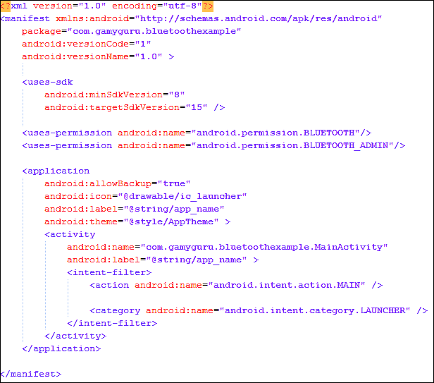

任何使用蓝牙设备的 Android 应用都必须有使用蓝牙的权限。因此，为了向用户提供权限，开发者会在 Android 清单文件中声明`<uses-permission>`标签，并写入必要的权限。如代码所示，我们提供了两个权限：`android.permission.BLUETOOTH`和`android.permission.BLUETOOTH_ADMIN`。对于大多数启用蓝牙的应用，仅`BLUETOOTH`权限就可以完成大部分工作。`BLUETOOTH_ADMIN`权限仅适用于那些使用蓝牙管理设置的应用，例如使设备可被发现、搜索其他设备、配对等。当用户首次安装应用程序时，他会收到有关应用程序需要哪些权限的详细信息。如果用户接受并授予应用权限，应用将被安装；否则，用户无法安装应用。文件的其余部分与书中其他示例中的相同。

讨论了 Android 清单和活动文件之后，我们将通过编译和运行项目来测试我们的项目。当我们运行项目时，我们应该看到如下截图所示的屏幕：

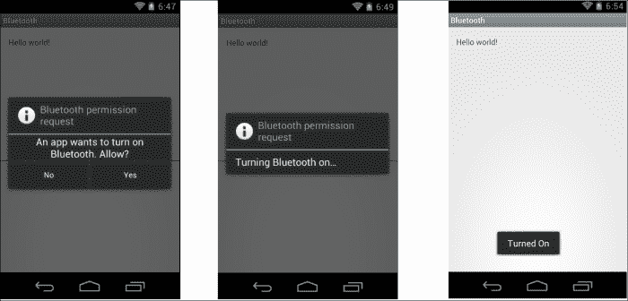

启用蓝牙应用

当应用启动时，用户会看到一个对话框，以启用或禁用蓝牙设备。如果用户选择**是**，蓝牙将被打开，并且一个提示会通过显示蓝牙状态来更新状态。

#### 跟踪蓝牙适配器状态

在上一个示例中，我们看到了如何仅通过将蓝牙请求的意图传递给 Android 系统，在几行代码内打开蓝牙设备。但是启用和禁用蓝牙是耗时的异步操作。因此，我们可以使用广播接收器来监听状态变化，而不是轮询蓝牙适配器的状态。在这个示例中，我们将看到如何使用广播接收器中的意图来跟踪蓝牙状态。

这个示例是之前示例的扩展，我们将使用相同的代码并添加新的代码。现在让我们看看代码。我们有三个文件，`MainActivity.java`，`BluetoothStateReceiver.java`和`AndroidManifest.xml`。让我们逐一讨论这些文件。

##### MainActivity.java 文件

这个类表示我们 Android 应用的主活动。以下代码在这个类中实现：

```kt
public class MainActivity extends Activity {
  final int BLUETOOTH_REQUEST_CODE = 0;
  @Override
  protected void onCreate(Bundle savedInstanceState) {
    super.onCreate(savedInstanceState);
    setContentView(R.layout.activity_main);
    registerReceiver(new BluetoothStateReceiver(), new IntentFilter(
      BluetoothAdapter.ACTION_STATE_CHANGED));
    String enableBT = BluetoothAdapter.ACTION_REQUEST_ENABLE;
    Intent bluetoothIntent = new Intent(enableBT);
    startActivityForResult(bluetoothIntent,
      BLUETOOTH_REQUEST_CODE);
  }
  @Override
  protected void onActivityResult(int requestCode, int resultCode,
    Intent data) {

    // TODO Auto-generated method stub
    super.onActivityResult(requestCode, resultCode, data);
    if (resultCode == RESULT_OK) {
      if (requestCode == BLUETOOTH_REQUEST_CODE) {
        Toast.makeText(this, "Turned On", Toast.LENGTH_SHORT).show();
      }
    }
    else if (resultCode == RESULT_CANCELED) {
      Toast.makeText(this, "Didn't Turn On", Toast.LENGTH_SHORT).show();
    }
  }
}
```

从代码中可以看出，这段代码与之前的示例几乎相同。唯一的区别是在设置活动的内容视图后，我们增加了一行代码。我们调用了`registerReceiver()`方法，它以编程方式向 Android 系统注册任何广播接收器。我们也可以通过在 Android 清单文件中声明它们，通过 XML 注册接收器。广播接收器用于接收来自 Android 系统的广播。

在执行诸如打开蓝牙、打开/关闭 Wi-Fi 等常规操作时，安卓系统会发送广播通知，开发者可以利用这些通知来检测手机状态的变化。有两种类型的广播。正常广播是完全异步的。这些广播的接收者以无序的方式运行，多个接收者可以同时接收广播。与另一种类型的有序广播相比，这些广播更有效。有序广播一次发送给一个接收者。每个接收者收到结果后，它会将结果传递给下一个接收者或完全终止广播。在这种情况下，其他接收者不会收到广播。

尽管`Intent`类用于发送和接收广播，但意图广播是一种完全不同的机制，并且与`startActivity()`方法中使用的意图是分开的。广播接收器无法查看或捕获与`startActivity()`方法一起使用的意图。这两种意图机制之间的主要区别在于，`startActivity()`方法中使用的意图执行用户当前正在进行的前台操作。然而，与广播接收器一起使用的意图执行一些用户不知道的后台操作。

在我们的活动代码中，我们使用了`registerReceiver()`方法来注册在`BluetoothStateReceiver`类中定义的自定义广播接收器对象，并且我们根据接收器的类型传递了一个意图过滤器`BluetoothAdapter.ACTION_STATE_CHANGED`。这个状态告诉意图过滤器，我们的广播接收器对象用于检测应用中蓝牙状态的变化。注册接收器后，我们创建了一个意图，传递`BluetoothAdapter.ACTION_REQUEST_ENABLE`，告诉应用打开蓝牙。最后，我们通过调用`startActivityForResult()`启动我们的操作，并在`onActivityResult()`方法中比较结果，以查看是否打开了蓝牙。你可以在本章的上一示例中阅读这些过程。

### 注意事项

当你在活动的`onCreate()`或`onResume()`方法中注册接收器时，你应在`onPause()`或`onDestroy()`方法中注销它。这种方法的好处是，当应用暂停或关闭时，你不会收到任何广播，这可以减少安卓不必要的开销操作，从而提高电池寿命。

现在，让我们看看我们自定义的广播接收器类的代码。

##### BluetoothStateReceiver.java 文件

这个类表示我们的自定义广播接收器，用于跟踪蓝牙设备的状态变化。以下代码显示了该文件的实现：

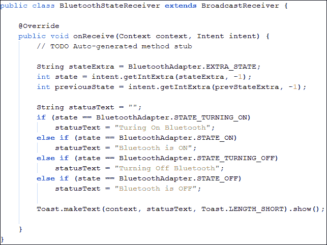

正如我们对活动和服务的操作一样，要创建自定义广播接收器，我们需要从`BroadcastReceiver`类继承并重写方法以声明自定义行为。我们重写了`onReceive()`方法，并在该方法中执行了跟踪蓝牙设备状态的主要功能。首先，我们将创建一个字符串变量来存储当前状态的字符串值。为了获取字符串值，我们使用了`BluetoothAdapter.EXTRA_STATE`。现在，我们可以将这个值传递给意图的`get()`方法来获取我们需要的数据。由于我们的状态是整数并且也是额外的信息，我们调用了`Intent.getIntExtra()`并在其中传递了我们需要的字符串以及默认值`-1`。现在，既然我们已经得到了当前状态码，我们可以将这些码与`BluetoothAdapter`中预定义的码进行比较，以查看蓝牙设备的状态。有四个预定义的状态。

+   `STATE_TURNING_ON`：此状态通知用户蓝牙正在打开的操作正在进行中。

+   `STATE_ON`：此状态通知用户蓝牙已经打开。

+   `STATE_TURNING_OFF`：此状态通知用户蓝牙设备正在关闭。

+   `STATE_OFF`：此状态通知用户蓝牙已经关闭。

我们将当前状态与这些常量进行比较，并根据得到的结果显示提示信息。Android 的清单文件与之前的示例相同。

因此，简而言之，我们讨论了如何启用蓝牙设备，并通过意图让用户打开或关闭它。我们还看到了如何在广播接收器中使用意图跟踪蓝牙操作的状态并显示提示信息。以下屏幕截图显示了应用程序的演示：

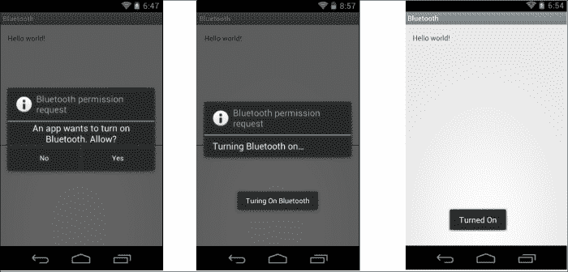

启用蓝牙应用

#### 设置为可发现

到目前为止，我们仅通过打开或关闭与蓝牙进行交互。但是，要通过蓝牙开始通信，一个设备必须设置为可发现以开始配对。我们不会为此意图的应用创建任何示例，但只会解释如何通过意图完成这一操作。要打开蓝牙，我们使用了`BluetoothAdapter.ACTION_REQUEST_ENABLE`意图。我们将意图传递给`startActivityForResult()`方法，并在`onActivityResult()`方法中检查结果。现在，要使设备可发现，我们可以在意图中传递`BluetoothAdapter.ACTION_REQUEST_DISCOVERABLE`字符串。然后，我们将此意图传递给`startActivityForResult()`方法，并在`onActivityResult()`方法中跟踪结果以比较结果。

下面的代码片段展示了使设备可发现的意图创建过程：

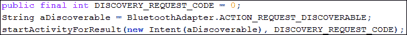

在代码中，你可以看到没有什么新内容是没有在之前讨论过的。只是意图动作字符串类型发生了变化，其余部分保持不变。这就是意图的力量；你只需用几分钟和几行代码就可以完成几乎任何事情。

#### 监控可发现性模式

正如我们追踪蓝牙状态变化一样，我们也可以使用本章前面介绍的确切方法来监控可发现性模式。我们必须通过扩展`BroadcastReceiver`类来创建一个自定义的广播接收器。在`onReceive()`方法中，我们将得到两个额外的字符串：`BluetoothAdapter.EXTRA_PREVIOUS_SCAN_MODE`和`BluetoothAdapter.EXTRA_SCAN_MODE`。然后，我们将这些字符串传递给`Intent.getIntExtra()`方法以获取模式的整数值，然后我们将这些整数与预定义的模式进行比较以检测我们的模式。下面的代码片段展示了代码示例：

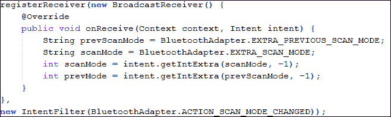

#### 通过蓝牙进行通信

蓝牙通信 API 只是围绕标准的**RFCOMM**（标准蓝牙射频通信协议）的封装。为了与其他蓝牙设备通信，它们必须配对。我们可以使用`BluetoothServerSocket`类通过蓝牙进行双向通信，该类用于建立监听套接字以启动设备间的链接，以及`BluetoothSocket`用于创建一个新的客户端套接字来监听蓝牙服务器套接字。一旦建立连接，服务器套接字就会返回这个新的客户端套接字。我们将不讨论蓝牙在通信中的使用，因为这超出了本书的范围。

### 通过意图使用 Wi-Fi

在互联网时代，以及其在手机上的广泛应用，使得全球信息触手可及。几乎每一位安卓手机用户都期望所有应用能充分利用互联网。因此，为应用添加互联网接入成为了开发者的责任。例如，当用户使用你的应用时，他们可能会想要与朋友分享在应用中的活动，如完成一个游戏关卡或阅读新闻应用中的文章，通过各种社交网络分享，或者发送短信等等。所以，如果用户不能通过你的应用连接到互联网、社交平台或全球信息，那么这个应用就会变得非常局限，甚至可能令人感到无聊。

要执行任何使用互联网的活动，我们首先必须处理互联网连接本身，比如手机是否有任何活动的连接。在本节中，我们将了解如何通过我们的核心主题——意图——访问互联网连接。像蓝牙一样，我们可以通过意图完成许多与互联网连接相关的任务。我们将实现三个主要示例：检查手机的互联网状态、选择任何可用的 Wi-Fi 网络以及打开 Wi-Fi 设置。让我们开始第一个示例，使用意图检查手机的互联网连接状态。

#### 检查互联网连接状态

在我们开始编写示例代码之前，我们需要了解一些重要的事情。任何连接到互联网的 Android 手机都可能拥有任何类型的连接。手机可以通过数据连接连接到互联网，也可以是任何开放的或安全的 Wi-Fi。数据连接被称为移动连接，通过 SIM 卡和服务提供商提供的移动网络连接。在这个例子中，我们将检测手机是否连接到任何网络，如果连接了，它连接的是哪种类型的网络。现在让我们实现代码。

有两个主要的文件负责应用程序的功能：`NetworkStatusReceiver.java`和`AndroidManifest.xml`。你可能对`MainActivity.java`文件感到好奇。在以下示例中，由于应用程序的需求，这个文件没有被使用。我们在这个例子中要实现的功能是，无论手机的互联网连接状态如何改变，比如 Wi-Fi 开启或关闭，这个应用程序都会显示一个吐司来展示状态。该应用将在后台执行其工作，因此不需要活动和布局。现在，让我们逐一解释这些文件：

##### NetworkStatusReceiver.java 文件

这个类表示我们自定义的广播接收器，用于跟踪设备网络连接状态的变化。以下代码展示了该文件的实现：

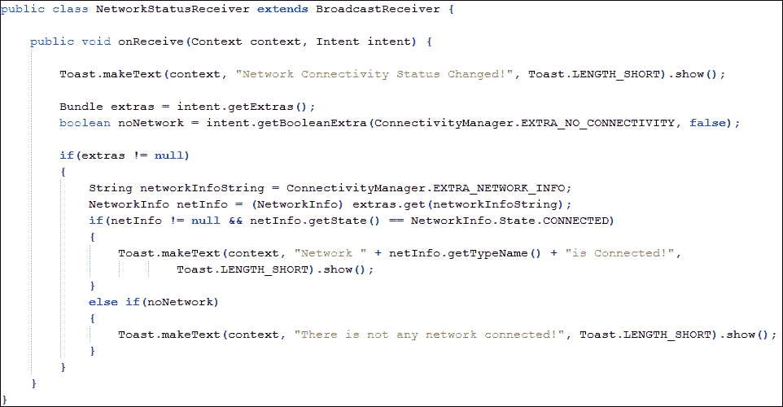

正如我们对活动和服务的处理一样，要创建自定义广播接收器，我们需要从`BroadcastReceiver`类继承并重写方法以声明自定义行为。我们重写了`onReceive()`方法，并在该方法中执行了跟踪 Wi-Fi 设备状态的主要功能。我们已经在 Android 清单文件中将此接收器注册为网络状态更改，我们将在下一节讨论该文件。这个`onReceive()`方法只在网络状态改变时被调用。因此，我们首先显示一个吐司，声明网络连接状态已改变。

### 注意

需要注意的是，任何广播接收器都不能在`Toast`的上下文参数中使用`this`来传递，就像我们在`Activity`类中所做的那样，因为`BroadcastReceiver`类没有像`Activity`类那样扩展`Context`类。

我们已经通知了用户关于网络状态的变化，但我们还没有通知用户具体发生了哪种变化。因此，在这个时候，我们的意图对象变得非常有用。它包含了网络的所有信息和数据，以`extra`对象的形式存在。回顾前面的章节，`extra`是`Bundle`类的一个对象。我们创建一个本地的`Bundle`引用，并通过调用`getExtras()`方法将意图的`extra`对象存储在其中。同时，我们还将在一个`boolean`变量中存储无连接的`extra`对象。`EXTRA_NO_CONNECTIVITY`是一个`boolean`变量的查找键，用于指示是否完全缺乏网络连接，即是否有任何网络可用。如果这个值为真，意味着没有网络可用。

在存储了我们需要的`extra`对象之后，我们需要检查`extra`对象是否存在。因此，我们用 null 检查了`extra`对象，如果`extra`对象可用，我们会从中提取更多的网络信息。在 Android 系统中，开发者会以常量字符串的形式被告知感兴趣的数据。所以，我们首先获取我们网络信息的常量字符串，即`EXTRA_NETWORK_INFO`。我们将其存储在一个字符串变量中，然后将其作为`extra`对象的`get()`方法的键值参数使用。`Bundle.get()`方法返回一个`Object`类型的对象，我们需要将其类型转换为所需的类。我们正在寻找网络信息，因此我们使用`NetworkInfo`类对象。

### 提示

`Intent.EXTRA_NETWORK_INFO`字符串在 API 级别 14 中已被弃用。由于`NetworkInfo`可以根据**用户 ID**（**UID**）而有所不同，应用程序应始终通过`getActiveNetworkInfo()`或`getAllNetworkInfo()`方法获取网络信息。

我们已经得到了我们感兴趣的所有值和数据；现在，我们将比较并检查数据以找到连接状态。我们检查这个`NetworkInfo`数据是否为`null`。如果不是`null`，我们通过检查`NetworkInfo`的`getState()`方法的值来确认网络是否已连接。`NetworkInfo.State`枚举表示粗粒度的网络状态。如果`NetworkInfo.State`枚举等于`NetworkInfo.State.CONNECTED`，意味着手机已连接到任何网络。请记住，我们仍然不知道我们连接的是哪种类型的网络。我们可以通过调用`NetworkInfo.getTypeName()`方法来找到网络的类型。此方法将根据相应的情况返回`Mobile`或`Wi-Fi`。

### 注意

粗粒度的网络状态在应用中比`DetailedState`使用得更广泛。这两种状态映射之间的区别在于，粗粒度网络只显示四种状态：`CONNECTING`（连接中）、`CONNECTED`（已连接）、`DISCONNECTING`（断开中）和`DISCONNECTED`（已断开）。然而，`DetailedState`提供了更多细节的状态，例如`IDLE`（空闲）、`SCANNING`（扫描中）、`AUTHENTICATING`（认证中）、`UNAVAILABLE`（不可用）、`FAILED`（失败）以及前面提到的四种粗粒度状态。

剩下的部分是一个`if`-`else`代码块，用于检查网络状态并在屏幕上显示相应的状态提示。总的来说，我们首先从意图中提取了`extra`对象，将它们存储在局部变量中，从额外信息中提取网络信息，检查状态，并最终以提示信息的形式显示出来。接下来，我们将在下一节讨论 Android 的清单文件。

##### AndroidManifest.xml 文件

由于我们的应用中使用了一个广播接收器来检测网络连接状态，因此有必要在应用中注册和注销广播接收器。在我们的清单文件中，我们执行了两项主要任务。首先，我们添加了访问网络状态的权限，使用了`android.permissions.ACCESS_NETWORK_STATE`。其次，我们使用接收器标签注册了我们的接收器，并添加了类的名称。

同时，我们添加了意图过滤器。这些意图过滤器定义了接收器的目的，比如应该从系统接收哪种类型的数据。我们使用了`android.net.conn.CONNECTIVITY_CHANGE`过滤器动作来检测网络连接变化广播。除了这两点之外，这个文件中没有新的内容，其余代码与我们在前面章节中讨论的一致。以下是该文件的代码实现：

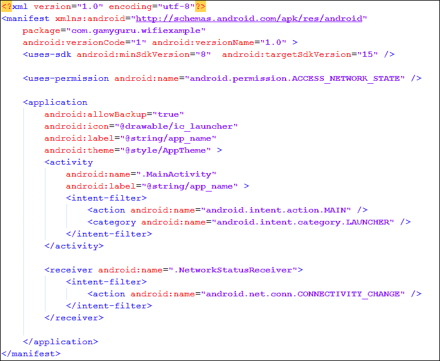

总结前面应用的细节，我们创建了一个自定义的广播接收器，并定义了网络变化的自定义行为，即显示提示信息，然后在清单文件中注册了我们的接收器，并声明了所需的权限。以下截图显示了在手机开启 Wi-Fi 时应用的一个简单演示：

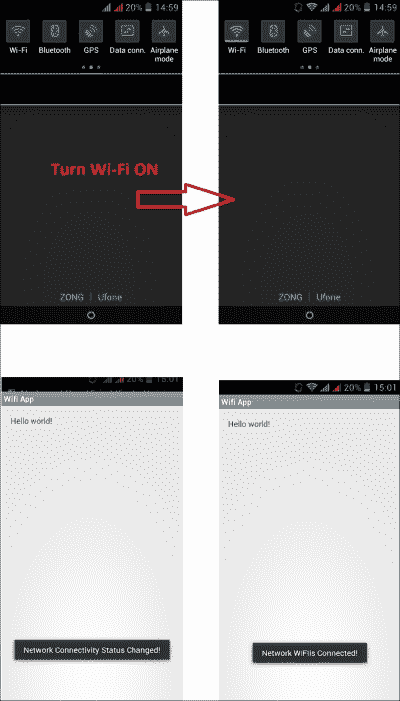

网络状态变化应用

在前面的截图中，我们可以看到当开启 Wi-Fi 时，应用会显示一个提示框告知网络状态已改变。提示框之后，它会显示变化；在我们的案例中，Wi-Fi 已连接。你可能会好奇在这个应用中意图（intents）的作用。没有使用意图，这个应用是不可能实现的。首先在清单文件中使用意图来注册接收器，以便筛选网络状态变化。另一个意图的使用是在接收器中，当我们收到更新并想知道变化时。因此，我们使用了意图，并以`extra`对象的形式从中提取数据，用于我们的目的。在这个例子中，我们没有创建自己的意图；而是仅使用了提供的意图。在下一个例子中，我们将创建自己的意图，并使用它们从应用中打开 Wi-Fi 设置。

#### 打开 Wi-Fi 设置应用

到目前为止，我们仅将意图用于网络和 Wi-Fi 目的。在这个例子中，我们将创建意图对象并在我们的应用中使用它。在之前的示例应用中，我们检测了手机的 network change 状态并在屏幕上显示。在这个例子中，我们将在同一个应用中添加一个按钮。点击或轻触按钮，应用将打开 Wi-Fi 设置。用户可以从那里打开或关闭 Wi-Fi。当用户执行任何操作时，应用将在屏幕上显示网络状态变化。对于网络状态，我们使用了`NetworkStatusReceiver.java`和`AndroidManifest.xml`文件。现在，让我们打开同一个项目，并更改我们的`MainActivity.java`和`layout_main.xml`文件，为它们添加一个按钮及其功能。让我们逐一看看这两个文件：

##### `activity_main.xml`文件

这个文件是我们主活动文件的视觉布局。我们将在这个 XML 文件中添加一个按钮视图。该文件的代码实现如下：


我们在布局中添加了一个按钮，其视图 ID 为`btnWifiSettings`。我们将使用这个 ID 在布局文件中获取按钮视图。我们已经在之前的章节中讨论过布局。现在，让我们看看将使用此布局作为视觉内容的主活动文件。

##### `MainActivity.java`文件

这个文件表示作为应用启动点的活动主文件。我们将在本文件中实现我们按钮的核心功能。该文件的代码实现如下：


如同之前多次讨论的那样，我们从`Activity`类扩展了我们的类，并覆盖了类的`onCreate()`方法。在调用超类方法之后，我们首先使用`setContentView()`方法引用了我们的布局文件（在上一节中解释），并将布局 ID 作为参数传递。在获取布局文件之后，我们通过调用`findViewById()`方法从布局中提取了我们的 Wi-Fi 设置按钮。记住，我们将按钮视图的 ID 设置为`btnWifiSettings`；因此，我们将此 ID 作为参数在方法中传递。我们在一个本地`Button object.reference`对象中存储了按钮的引用文件。现在，我们将设置本地按钮的`View.OnClickListener`，以在按钮点击时执行我们的任务。我们在`button.setOnClickListener()`方法中传递了一个`OnClickListener`的匿名对象，并覆盖了匿名对象的`onClick()`方法。

至今为止，我们仅完成了创建应用设置的一些初始步骤。现在，让我们集中精力打开 Wi-Fi 设置任务。我们将创建一个`Intent`对象，并且必须传递一个常量字符串 ID 来告诉意图要启动什么。我们将使用`Settings.ACTION_WIFI_SETTINGS`常量，它展示了允许配置 Wi-Fi 的设置。创建`Intent`对象后，我们将在`startActivity()`方法中传递它，以打开包含 Wi-Fi 设置的活动。这非常简单，完全没有火箭科学那么复杂。当我们运行这个应用时，我们将看到与以下截图类似的内容：

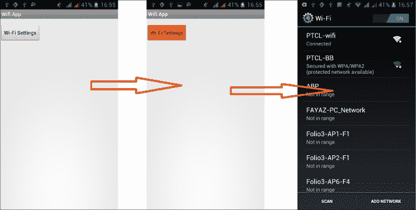

打开 Wi-Fi 设置应用

如从前面的截图中所见，当我们点击或轻触 Wi-Fi 设置按钮时，它将打开 Android 手机的 Wi-Fi 设置屏幕。在更改设置时，比如打开 Wi-Fi，它将显示吐司通知来展示更新的更改和网络状态。

我们已经讨论了使用意图进行通信的组件，在其中我们通过意图使用了蓝牙和 Wi-Fi，并看到了它们在各种示例和应用中的使用方法。现在，我们将讨论如何通过意图使用媒体组件，以及我们在以下各节中可以为媒体组件做些什么。

## 媒体组件

前一节我们讨论了通信组件的全部内容。但旧手机与新型智能手机的区别在于多媒体功能，比如高清音视频特性。手机的多媒体功能已成为许多消费者更为重视的考量因素。幸运的是，Android 系统为许多功能提供了多媒体 API，比如播放和记录各种图像、音频和视频格式，无论是本地还是流式传输。如果用简单的语言来描述媒体组件，这个主题只能在一个专门的章节中详细讲解，这超出了本书的范围。我们仅讨论那些可以通过意图触发、使用和访问的媒体组件。本节将要讨论的组件包括使用意图拍照、使用意图录制视频、使用意图的语音识别以及意图在文本到语音转换中的作用。前三个主题使用意图执行操作；但文本到语音转换的最后一个主题并不完全使用意图。我们还将开发一个示例应用程序来实际观察意图的使用。让我们逐一在以下小节中讨论这些主题。

### 使用意图拍照

现在，几乎每部手机都有数码相机组件。嵌入在手机中的数码相机的普及使得它们的价格和体积都下降了。Android 手机也包含从 320 万像素到 3200 万像素不等的数码相机。从开发的角度来看，可以通过许多不同的方法拍照。Android 系统也提供了相机控制和拍照的 API，但我们只关注一种使用意图的方法。这是 Android 开发中拍照最简单的方式，代码不超过几行。

我们将首先创建一个带有图像视图和按钮的布局。然后，在`Activity`类中，我们从布局文件中获取我们视图的引用，并设置按钮的点击监听器。点击按钮时，我们将创建捕获图像的意图，并以子类的形式启动另一个活动。在得到结果后，我们将在我们的图像视图中显示那捕获的图像。

那么，准备好基本的空 Hello World 项目后，我们将修改三个文件并在其中添加我们的代码。这些文件是`activity_main.xml`、`MainActivity.java`和`AndroidManifest.xml`。让我们逐一解释每个文件中的更改：

#### activity_main.xml 文件

这个文件代表了视觉布局。我们将添加一个`ImageView`标签以显示捕获的图像，以及一个`Button`标签以拍照并触发相机。该文件的代码实现如下：

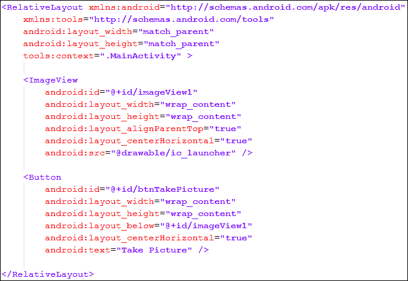

如代码所示，我们在相对布局中放置了一个带有`imageView1` ID 的`ImageView`标签。这个 ID 将在主活动文件中使用，从布局中提取视图以在 Java 文件中使用。我们将视图通过在`android:layout_centerHorizontal`标签中赋值为`true`来放置在布局的水平中心。最初，我们将应用启动图标的默认图像设置到我们的图像视图中。在图像视图下方，我们放置了一个按钮视图。点击按钮时，将启动相机。按钮的 ID 通过图像视图布局下的`android:layout_below`标签设置为`btnTakePicture`。这种相对性是相对布局与线性布局相比的主要优势。现在，让我们看看执行主要功能并使用此布局作为视觉部分的应用的活动。

#### MainActivity.java 文件

此文件表示应用的主要启动活动。该文件使用`layout_main.xml`文件作为视觉部分，并从`Activity`类扩展而来。文件的代码实现如下：

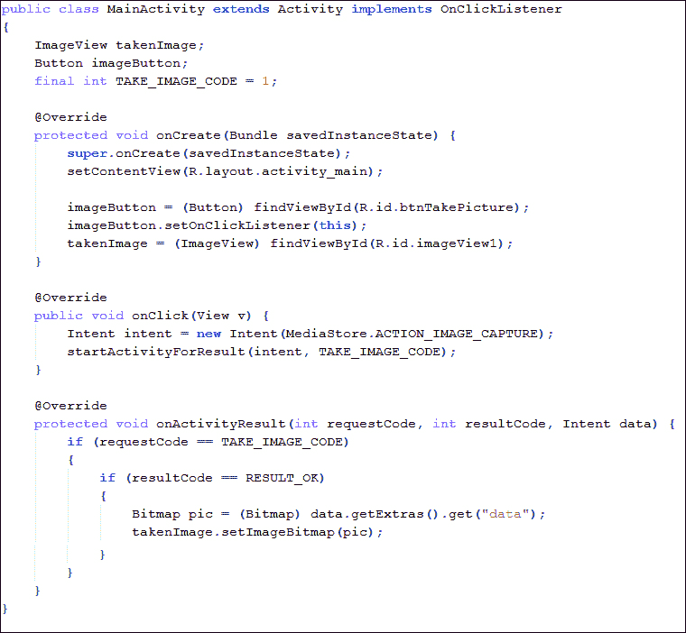

我们通过重写活动的`onCreate()`方法来开始我们的类。通过调用`setContentView()`方法，我们将活动的视觉布局设置为`activity_main.xml`布局。现在，由于布局已设置，我们可以获取布局文件中视图的引用。

我们在类中创建两个字段；`ImageView`类的`takenImage`用于显示捕获的图像，以及`Button`类的`imageButton`用于点击触发相机。当点击按钮时，将调用`onClick()`方法。因此，我们将在该方法中定义相机触发的代码。在这个方法中，我们正在创建`Intent`类的一个实例，并在构造函数中传递`MediaStore.ACTION_IMAGE_CAPTURE`常量。这个常量将告诉 Android，该意图是为了图像捕获，当启动这个意图时，Android 将启动相机。如果用户安装了不止一个相机应用，Android 将呈现所有有效相机应用的列表，用户可以选择任何应用来拍摄图像。

创建意图实例后，我们将这个意图对象传递给`startActivityForResult()`方法。在我们的拍照应用中，点击按钮将启动相机的另一个活动。当我们关闭相机活动时，它将返回到我们应用的原始活动，并给我们一些捕获图片的结果。因此，要在任何活动中获取结果，我们必须重写`onActivityResult()`方法。当子活动完成后，父活动开始时，将调用此方法。当调用此方法时，意味着我们已经使用了相机，现在回到了父活动。如果结果成功，我们可以在图像视图中显示捕获的图像。

首先，我们可以了解此方法是在使用相机后调用，还是发生了另一个动作。为此，我们必须比较方法的`requestCode`参数。记住，当调用`startActivityForResult()`方法时，我们将`TAKE_IMAGE_CODE`常量作为另一个参数传递。这就是要比较的请求代码。

之后，为了检查结果，我们可以查看方法的`resultCode`参数。由于我们使用这段代码来启动相机拍照意图，我们将我们的`resultCode`与`RESULT_OK`常量进行比较。两个条件都成功后，我们可以得出我们已经收到图像的结论。因此，我们通过调用`getExtras().get()`方法使用意图获取我们的图像数据。这将给我们`Object`类型的数据。我们进一步将其类型转换为`Bitmap`，以便为`ImageView`准备。

最后，我们调用`setImageBitmap`方法，将新的位图设置到我们的图像视图中。如果你运行代码，你会看到一个图标图像和一个按钮。点击按钮后，将启动相机。当你拍照时，应用会崩溃并关闭。你可以在以下截图中看到：

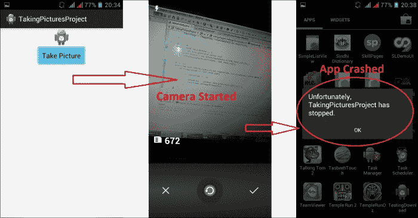

拍照后应用崩溃了

你可能想知道为什么会发生崩溃。我们忘记提到一件事；每当任何应用使用相机时，我们必须在我们的清单文件中添加`uses-feature`标签，告诉应用它将使用相机功能。让我们看看我们的 Android 清单文件，了解`uses-feature`标签。

#### AndroidManifest.xml 文件

此文件定义了在我们的应用程序中要使用的所有设置和功能。只有一个我们没见过的新东西。文件的代码实现如下：

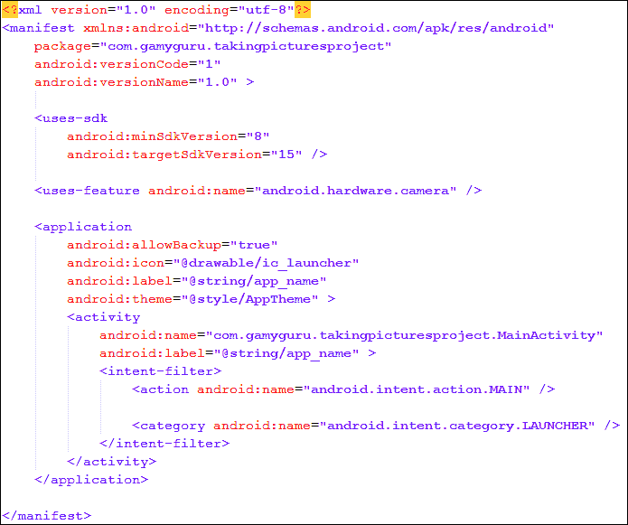

你可以看到我们添加了`uses-feature`标签，并在`android:name`属性中指定了`android.hardware.camera`。这个标签告诉应用程序它将如何使用相机，Android 操作系统允许我们的应用程序使用外部相机。

在清单文件中添加这行代码并运行后，如果你手机里有多个相机应用，你会看到类似以下截图的内容：

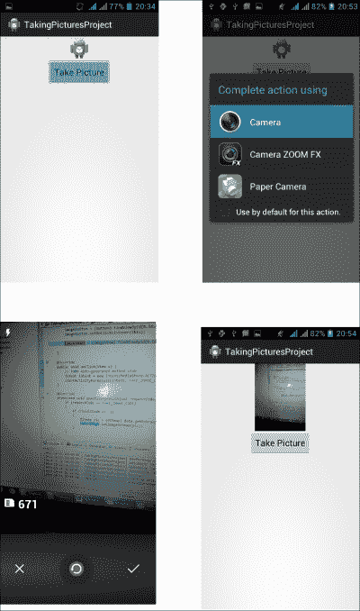

通过意图应用拍照

在截图中，你可以看到用户被要求选择相机，拍照后，图像会在应用中显示。

当我们总结代码时，我们首先创建了一个带有图像视图和按钮的布局。然后在`Activity`类中，我们从布局文件中获取我们视图的引用，并设置了按钮的点击监听器。点击按钮后，我们创建了捕获图像的意图，并启动了另一个作为子活动的活动。获取结果后，我们在图像视图中显示了捕获的图像。这就像在公园里散步一样简单。在下一节中，我们将了解如何使用意图录制视频。

### 使用意图录制视频

到目前为止，我们已经看到了如何使用意图拍照。在本节中，我们将看到如何使用意图录制视频。我们不会在本节中讨论整个项目。使用意图录制视频的流程与拍照几乎相同，只有一些小的变化。我们只在本节中讨论这些变化。现在，让我们看看应用是如何录制视频的。

我们做的第一个更改是在我们的布局文件中。我们移除了图像视图部分，并放置了`VideoView`标签。以下代码实现展示了该标签：

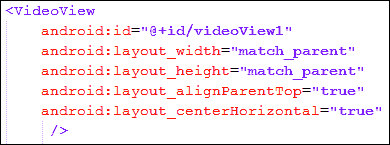

你可以看到，这与`ImageView`中的内容是一样的。现在，由于我们在布局中将图像视图更改为视频视图，因此我们也必须在活动中进行相应的更改。正如我们对`ImageView`所做的那样，我们将创建一个`VideoView`的字段对象，并在活动的`onCreate()`方法中获取它的引用。以下代码示例展示了`VideoView`字段对象的行：


一切都保持不变，我们已经讨论过这部分内容。现在，在我们的`onClick()`方法中，我们将看到如何发送触发视频录制的意图。要放在`onClick()`方法中发送意图的代码实现如下：

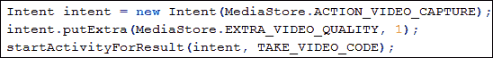

你可以看到我们创建了一个意图对象，并且在构造函数中，我们没有传递`MediaStore.ACTION_IMAGE_CAPTURE`，而是传递了`MediaStore.ACTION_VIDEO_CAPTURE`。此外，我们还通过调用`putExtra()`方法在意图中放置了一个`extra`对象。我们通过将`MediaStore.EXTRA_VIDEO_QUALITY`值赋为`1`来定义视频质量为`high`的`extra`对象。然后，我们再次将意图传递给`startActivityForResult()`方法，以启动相机活动。

下一个变化是在我们从意图获取视频的`onActivityResult()`方法中。以下代码展示了一些获取视频并将其传递给`VideoView`标签并播放的示例代码：

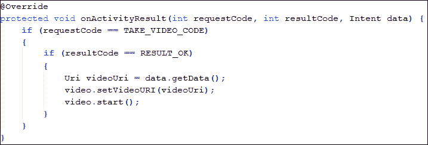

在拍照的情况下，我们从意图中恢复了原始数据，将其类型转换为`Bitmap`，然后将我们的`ImageView`设置为`Bitmap`。但是在这里，在录制视频的情况下，我们只获取了视频的 URI。`Uri`对象声明了手机中数据的引用。我们获取视频的 URI，并使用`setVideoURI()`方法将其设置在我们的`VideoView`中。最后，我们通过调用`VideoView.start()`方法播放视频。

从这些部分，你可以看到使用意图捕获图像或录制视频是多么容易。通过意图，我们使用了已经内置的相机或相机应用。如果我们想要自己的自定义相机来捕获图像和视频，我们就必须使用 Android 的 Camera API。

我们可以使用 `MediaPlayer` 类来播放视频、音频等。`MediaPlayer` 类包含 `start()`、`stop()`、`seekTo()`、`isLooping()`、`setVolume()` 等方法。要录制视频，我们可以使用 `MediaRecorder` 类。这个类包含 `start()`、`stop()`、`release()`、`setAudioSource()`、`setVideoSource()`、`setOutputFormat()`、`setAudioEncoder()`、`setVideoEncoder()`、`setOutputFile()` 等方法，还有更多。

### 注意

在您的应用中使用 `MediaRecorder` API 时，别忘了在您的清单文件中添加 `android.permission.RECORD_AUDIO` 和 `android.permission.RECORD_VIDEO` 权限。

若要不用意图（intents）拍照，我们可以使用 `Camera` 类。这个类包含了 `open()`、`release()`、`startPreview()`、`stopPreview()`、`takePicture()` 等方法，还有更多。

### 注意

当您在应用中使用 Camera API 时，别忘了在您的清单文件中添加 `android.permission.CAMERA` 权限。

到目前为止，我们已经使用意图来处理视频和图片的可视媒体组件。在下一节中，我们将使用意图来处理手机的音频组件。我们将在接下来的章节中看到如何使用意图来支持语音识别和文本转语音。

### 使用意图进行语音识别

智能手机引入了语音识别功能，这对残疾人士来说是一大成就。安卓在 API 级别 3 的版本 1.5 中引入了语音识别。安卓通过 `RecognizerIntent` 类支持语音输入和语音识别。安卓的默认键盘上有一个带有麦克风图标的按钮。这让用户可以选择说话而不是输入文本。它为此目的使用语音识别 API。以下截图显示了带有麦克风按钮的键盘：


带有麦克风按钮的安卓默认键盘

在本节中，我们将创建一个示例应用，其中包含一个按钮和文本字段。点击按钮后，将显示安卓的标准语音输入对话框，并要求用户说些什么。应用将尝试识别用户所说的话并将其输入到文本字段中。我们将从在 Android Studio 或其他 IDE 中创建一个空项目开始，并修改其中的两个文件。下一节我们将从布局文件开始。

#### activity_main.xml 文件

这个文件代表了应用的可视内容。我们将在该文件中添加文本字段和按钮视图。该文件的代码实现如下：

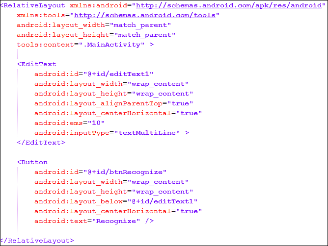

如你所见，我们放置了一个`EditText`字段。我们将`android:inputType`设置为`textMultiLine`以在多行中输入文本。在文本字段下方，我们添加了一个带有 ID 为`btnRecognize`的`Button`视图。当点击此按钮时，它将用于启动语音识别活动。现在，让我们讨论一下主要活动文件。

#### MainActivity.java 文件

此文件代表了项目的主要活动。该文件的代码实现如下：

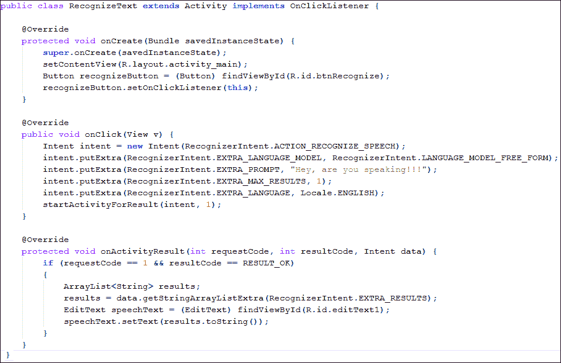

与往常一样，我们重写了`onCreate()`方法，并通过`setContentView()`方法设置的布局获取按钮引用。我们将按钮的监听器设置为此类，并在活动中实现`OnClickListener`，同时重写`onClick()`方法。在`onClick()`方法中，我们创建了一个意图对象，并在构造函数中将`RecognizerIntent.ACTION_RECOGNIZE_SPEECH`作为动作字符串传递。这个常量会告诉 Android，该意图是为了语音识别。然后，我们需要添加一些`extra`对象，向 Android 提供有关意图和语音识别的更多信息。要添加的最重要的`extra`对象是`RecognizerIntent.EXTRA_LANGUAGE_MODEL`。这会告诉识别器在识别语音时使用哪个语音模型。识别器使用这个额外信息来更精确地调整结果。这个`extra`方法在调用语音识别意图时是必须提供的。我们传入了`RecognizerInent.ACTION_LANGUAGE_MODEL_FREE_FORM`模型进行语音识别。这是一个基于自由形式语音识别的语言模型。现在，我们有一些可选的`extra`对象可以帮助识别器得到更准确的结果。我们添加了`RecognizerIntent.EXTRA_PROMPT`的`extra`，并在其中传递了一些字符串值。这将通知用户语音识别已开始。

接下来，我们添加了`RecognizerIntent.EXTRA_MAX_RESULTS`的`extra`，并将其值设置为`1`。语音识别的准确性总是有所变化。因此，识别器将尝试更精确地识别。它会创建不同准确性和可能不同含义的不同结果。通过这个`extra`，我们可以告诉识别器我们感兴趣的结果数量。在我们的应用中，我们将其设置为`1`。这意味着识别器将只为我们提供一个结果。不能保证这个结果足够准确；这就是为什么建议传递大于`1`的值。对于简单的情况，你可以传递一个值高达`5`。记住，你传递的值越大，识别所需的时间就越长。

最后，我们添加了最后一个关于语言的可选`extra`。我们将`Locale.ENGLISH`作为`RecognizerIntent.EXTRA_LANGUAGE`的值传递。这将告诉识别器语音的语言。因此，识别器无需检测语言，这使语音识别的准确性更高。

### 注意

语音识别引擎可能无法理解`Locale`类中所有可用的语言。同样，也不是所有设备都支持语音识别。

添加所有`extra`对象后，我们确保了意图对象已准备好。我们将其传递给`startActivityForResult()`方法，并设置`requestCode`为`1`。当调用此方法时，会显示一个标准的语音识别对话框，并带有我们给出的提示信息。说话结束后，我们父活动的`onActivityResult()`方法将被调用。我们首先检查`requestCode`是否为`1`，以确保这是我们语音识别的结果。之后，我们将检查`resultCode`以确定结果是否正常。成功的结果后，我们会得到一个字符串数组列表，其中包含识别器识别的所有单词。我们可以通过调用`getStringArrayListExtra()`方法并传递`RecognizerIntent.EXTRA_RESULTS`来获取这些单词的列表。当`resultCode`正常时，才会返回此列表；否则，我们会得到一个 null 值。在完成语音识别的相关操作后，我们现在可以将文本值设置为结果。为此，我们首先从布局中提取`EditText`视图，并通过调用`setText()`方法将我们的结果设置为文本字段的值。

### 注意

运行语音识别需要活跃的互联网连接。语音识别过程是在谷歌的服务器上执行的。安卓手机接收语音输入，将其发送到谷歌服务器，并在那里进行处理以识别。识别完成后，谷歌将结果发送回安卓手机，手机会通知用户关于结果，这样整个循环就完成了。

如果你运行这个项目，你会看到类似于以下截图的内容：

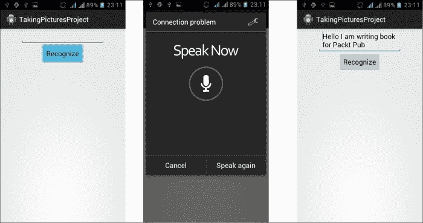

使用意图进行语音识别

在图片中，你可以看到点击**识别**按钮后，会显示一个标准的语音输入对话框。说话之后，我们会返回到父活动，并在识别语音后，它将在文本字段中打印所有文本。

### 意图在文本到语音转换中的作用

在上一节中，我们讨论了 Android 系统如何识别我们的语音并执行操作，例如通过语音命令控制手机。我们还使用意图开发了一个简单的语音到文本示例。这一节与上一节相反。在本节中，我们将讨论 Android 系统如何将我们的文本转换成优美的语音叙述。我们可以称之为文本到语音转换。Android 在版本 1.6（API 级别 4）中引入了**文本到语音**（**TTS**）转换引擎。我们可以使用这个 API 在应用程序内部产生语音，从而允许我们的应用与用户对话。如果我们添加语音识别，它将像是与应用程序对话一样。文本到语音转换需要预装语言包，由于手机存储空间有限，不能保证手机已经预装了任何语言包。因此，在使用文本到语音引擎创建任何应用时，检查语言包是否已安装是一个好习惯。

我们不能通过意图使用文本到语音转换。我们只能通过称为 TTS 的文本到语音引擎使用它。但在文本到语音转换中，意图有一个小作用。意图仅用于检查语言包是否预装。因此，任何使用文本到语音的应用在创建时，首先必须使用意图来检查语言包的安装状态。这就是意图在文本到语音转换中的作用。下面是检查语言包安装状态的示例代码：

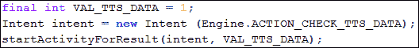

在进行文本到语音转换时，我们首先要检查语言包。在代码中，我们可以看到我们正在创建一个意图对象。我们传递了`Engine.ACTION_CHECK_TTS_DATA`常量，这会告诉系统该意图将检查文本到语音（TTS）数据和语言包。然后我们在`startActivityForResult()`方法中传递该意图，并附上作为`requestCode`使用的`VAL_TTS_DATA`常量值。现在，如果安装了语言包且一切正常，我们将在`onActivityResult()`方法中得到`resultCode`为`RESULT_OK`。所以，如果结果正常，我们可以使用文本到语音转换。下面是`onActivityResult()`方法的代码示例，如下截图所示：

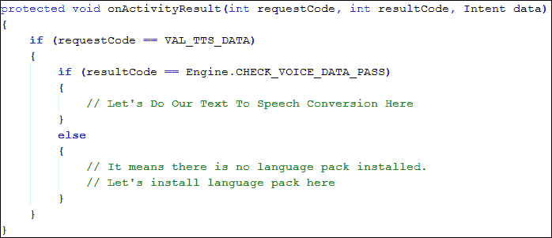

因此，我们首先检查传递的代码的`requestCode`。然后，我们将`resultCode`检查为`Engine.CHECK_VOICE_DATA_PASS`。这个常量用于判断是否有语音数据。如果我们的手机中有数据，我们可以在那里进行文本到语音转换。否则，很明显，在进行文本到语音转换之前，我们必须先安装语音数据。你会很高兴知道，安装语音数据也非常简单；它使用意图来完成这个目的。以下代码片段展示了如何使用意图安装语音数据：

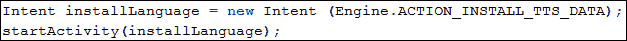

我们创建了一个意图对象，并在构造函数中传递了`Engine.ACTION_INSTALL_TTS_DATA`。这个常量将告诉 Android，这个意图是用来安装文本到语音语言数据包的。然后，我们将意图传递给`startActivity()`方法以开始安装。在语言包安装之后，当我们想要进行文本到语音转换时，我们必须创建一个`TextToSpeech`类的对象，并在`onActivityResult()`方法中调用其`speak()`方法：

```kt
protected void onActivityResult(int requestCode, int resultCode,
  Intent data) {

  if (requestCode == VAL_TTS_DATA) {
    if (resultCode == Engine.CHECK_VOICE_DATA_PASS) {
      TextToSpeech tts = new TextToSpeech(this,
        new OnInitListener() {
        public void onInit(int status) {
          if (status == TextToSpeech.SUCCESS) {
            tts.setLanguage(Locale.US);
            tts.setSpeechRate(1.1f);
            tts.speak("Hello, I am writing book for Packt",
              TextToSpeech.QUEUE_ADD, null);
          }
        }
      });
    }
    else {
      Intent installLanguage = new Intent (
        Engine.ACTION_INSTALL_TTS_DATA);
      startActivity(installLanguage);
    }
  }
}
```

如代码所示，在成功安装语言数据包后，我们创建了一个`TextToSpeech`实例，并传递了一个匿名`OnInitListener`对象。我们实现了`onInit()`方法。这个方法将设置`TextToSpeech`对象的初始设置。如果状态是成功的，我们将设置语言、语速，最后调用`speak()`方法。在这个方法中，我们传递了一个字符串，Android 将会大声读出这些字母。

总结整个话题，意图在文本到语音转换中的作用是检查和安装语音数据包。意图并不直接贡献于文本到语音转换，但它们只是为文本到语音转换设置了初始设置。

通过文本到语音转换，我们已经完成了关于媒体组件的讨论。在媒体组件中，我们讨论了拍照、录制视频、语音识别和文本到语音转换。在下一节中，我们将讨论运动组件，并看看意图在这些组件中扮演的角色。

## 运动组件

安卓手机的运动组件包括许多执行不同任务和动作的不同类型的传感器。在本节中，我们将讨论运动和位置传感器，如加速度计、地磁传感器、方向传感器和接近传感器。所有这些传感器都参与了安卓手机的运动和位置。我们将只讨论那些使用意图来触发的传感器。只有一个这样的传感器使用意图，那就是接近传感器。让我们在下一节中讨论它。

### 意图和接近警报

在了解意图在近距离警报中的作用之前，我们将讨论近距离警报是什么以及它们在各种应用程序中如何有用。

#### 什么是近距离警报？

近距离传感器让用户确定设备与物体的接近程度。当你的应用程序对手机屏幕移向或远离任何特定物体时做出反应时，这通常很有用。例如，当我们在 Android 手机上接到来电时，将手机放在耳朵上会关闭屏幕，将其拿回手中会自动开启屏幕。这个应用正在使用近距离警报来检测耳朵与设备近距离传感器之间的距离。下图以视觉形式展示了这一点：


另一个例子可能是当手机闲置一段时间并且屏幕关闭时，如果有未接电话，它将震动或者给出通知提示我们检查手机。这也可以通过使用近距离传感器来完成。

近距离传感器使用近距离警报来检测手机传感器与任何物体之间的距离。这些警报允许你的应用程序设置触发器，当用户移动到或超出设定的地理位置距离时，这些触发器会被触发。本节不讨论近距离警报使用细节，但将涵盖一些基本信息以及意图在近距离警报中的作用。例如，我们为特定的覆盖区域设置一个近距离警报。我们选择一个经纬度形式的点，围绕该点的半径（米），以及警报的过期时间。现在，设置近距离警报后，如果设备越过该边界，将触发警报。可能是设备从外部移动到半径内，或者从半径内移动到外部。

### 意图在近距离警报中的作用

当近距离警报被触发时，它们会激活意图。我们将使用一个`PendingIntent`对象来指定要触发的意图。让我们看看前面章节中讨论的距离应用的一些代码示例，以下是其实现：

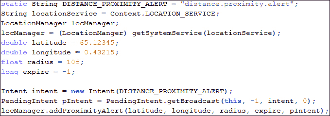

在前面的代码中，我们正在实现使用应用程序中近距离警报的第一步。首先，我们通过`PendingIntent`创建一个近距离警报。我们将警报的名称定义为`DISTANCE_PROXIMITY_ALERT`，然后通过调用当前活动中编写的代码的`getSystemService()`方法来获取位置管理服务。然后，我们为纬度、经度、半径和过期时间设置了一些随机值，过期时间设为无限。应该记住，这些值可以根据你正在创建的应用程序类型设置为任何值。

现在我们来到了创建接近警报最重要的部分。我们创建意图，并在构造函数中传递我们自己的警报名称以创建我们自己的意图。然后，我们通过使用`getBroadcast()`方法获取一个广播意图来创建一个`PendingIntent`对象。最后，我们通过调用`addProximityAlert()`方法，在位置管理服务中添加接近警报。

这段代码仅创建了警报并为其设置了初始值。现在，假设我们已经完全完成了我们的距离应用。因此，无论何时我们的设备穿过我们在应用中指定的边界或进入该边界内，`LocationManager`将会检测到我们已经越过了边界，并且会触发一个带有`LocationManager.KEY_PROXIMITY_ENTERING`额外值的意图。这个值是一个布尔值。如果它的值是`true`，意味着我们已经进入了边界；如果是`false`，则我们离开了边界。为了接收这个意图，我们将创建一个广播接收器并执行操作。以下代码段展示了接收器的示例实现：

```kt
public class ProximityAlertReceiver extends BroadcastReceiver {
  @Override
  public void onReceive(Context context, Intent intent) {
    Boolean isEntered = intent.getBooleanExtra(
      LocationManager.KEY_PROXIMITY_ENTERING, false);
    if (isEntered)
      Toast.makeText(context, "Device has Entered!",
        Toast.LENGTH_SHORT).show();
    else
      Toast.makeText(context, "Device has Left!",
        Toast.LENGTH_SHORT).show();
  }
}
```

在代码中，你可以看到我们使用`getBooleanExtra()`方法获取`LocationManager.KEY_PROXIMITY_ENTERING`的额外值。我们比较这个值，并相应地显示吐司提示。正如你所见，这是相当简单的。但是，像所有接收器一样，这个接收器在注册到`AndroidManifest.xml`或通过 Java 代码注册之前是不会工作的。注册接收器的 Java 代码如下：

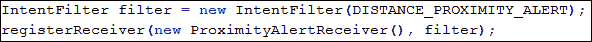

这里除了我们调用了`Activity`类的`registerReceiver()`方法外，没有什么需要解释的。我们将在接下来的章节中更详细地讨论`IntentFilter`。

简而言之，意图在获取接近警报方面起着次要的作用。意图仅用于告诉 Android 操作系统已添加了哪种类型的接近警报，它何时触发，以及它应该包含哪些信息，以便开发人员可以在他们的应用中使用它。

# 概述

在本章中，我们讨论了几乎所有 Android 手机中常见的移动组件。这些组件包括 Wi-Fi 组件、蓝牙、蜂窝网络、全球定位系统、地磁场、运动传感器、位置传感器和环境传感器。然后，我们讨论了这些组件中使用意图的作用。为了更详细地解释这个作用，我们使用了蓝牙通信、打开/关闭蓝牙、使设备可被发现、打开/关闭 Wi-Fi 以及打开 Wi-Fi 设置的意图。我们还看到了如何通过意图拍照、录制视频、进行语音识别和文本到语音的转换。最后，我们看到了如何通过意图使用接近传感器。

在下一章中，我们将看到如何在不同活动、服务和其他移动组件之间通过意图传输数据。
