# 第五章：使用意图进行数据传输

到目前为止，我们已经学习了意图的分类、它们在安卓组件中的用途以及在安卓应用程序中逐步实现它们的方法。现在是查看安卓应用程序最重要的部分的时候了。在安卓应用程序中，从一项活动向另一项活动传输数据（无论是隐式还是显式）是必不可少的。本章的主要焦点是数据的安全传输和检索。

本章包括以下主题：

+   传输数据的必要性

+   活动之间的数据传输——一种*有意*的方式

+   在显式意图中进行数据传输

+   使用意图显式传输数据的方法

+   在隐式意图中进行数据传输

# 寻找需要传输数据的需求

从技术上讲，一个安卓应用程序是由不同的活动组合而成的。这些活动包括布局、视图和一些内容。这些内容大多数不是动态的，也不是预先决定的。例如，如果一个安卓布局包含一个按钮，那么该按钮中的文本可以是静态的或预定义的。同样，如果一个活动中有任何文本字段或列表视图，它通常包含来自任何服务器或其他手段的动态数据。

在这些情况下，我们需要一些动态数据，这些数据我们的应用程序可以从服务器（或其他地方）获取，并在活动之间传输。正是在这种场景下发生数据传输。此外，在其中一个活动对数据进行一些操作，而另一个活动需要在其视图中显示它的情况下，数据传输的可能性非常高。

## 举一个简单的例子

为了更好地理解这张图片，让我们从理论上举例说明为什么需要在活动之间进行数据传输。读者应用程序可以作为一个很好的例子，来理解数据传输的原因。

读者应用程序是一个包含不同种类新闻的列表视图的应用程序，点击新闻可以进入描述页面，页面中会展示整条新闻以及图片和其他文本。让我们一步步了解这个应用程序的流程（以 TechCrunch 安卓应用为例）。应用程序将以一个启动屏幕开始，向读者或开发者描述谁制作了这个应用。

下面的截图是启动屏幕；应用程序将搜索互联网连接，以便将新闻源显示到应用程序的屏幕上。一旦本地获取了数据，它就会解析数据并将其放入列表视图中。请注意，以下列表视图的截图基本上是自定义列表视图，并不是直接通过安卓的内置布局获得的。我们需要为此制作一个自定义布局，然后在常规列表视图中填充它。为此，需要使用适配器（请参考互联网，了解如何在安卓中创建基本的列表视图）。


读者应用的活动，其中新闻在列表视图中列出。

现在，有两种可能的数据传输方式，如下所述：

+   获取包括描述在内的所有数据

+   一旦点击了列表视图中的馈送，将立即获取该馈送的描述。


显示前一个活动中点击的故事描述的活动

无论哪种情况，这一步都需要将数据从第一个活动传输到下一个活动。如果是第一种情况，由第一个活动解析的描述数据将被传递到第二个活动，以便在视图中填充它。否则，在第二种情况下，它将传递一些 URL 给第二个活动，从那里它可以获取新闻的描述。请参考前面的屏幕截图。

# 活动之间的数据传输——一种 INTENTed 方式

当我们讨论活动之间的数据传输时，我们需要记住，管理与活动流程交互的唯一方式是通过意图。在上一章中，我们详细讨论了如何使用意图从一个活动移动到另一个活动。在这里，我们将看到如何将数据与这些意图一起传输，以及如何在目标活动中安全地捕获传输的数据。

# 显式意图中的数据传输

你可以通过注意显式意图中数据传输的使用来开始理解意图中的数据传输。回想一下显式意图的定义，它们是指向另一个活动（在同一应用内或另一个应用内）的意图。显式意图通常指向同一应用内的活动，但根据应用需求，它们也可以指向属于其他应用的活动（例如，设备相机）。

# 活动间数据传输的方法

在本节中，我们将开始了解在 Android 应用程序中使用的各种数据传输技术。这些技术各有优缺点。总共有三种方法可以从一个活动显式地传输数据到另一个活动。我们很快就会看到它们以及它们的示例。这三种方法如下：

+   使用`putExtras()`进行数据传输

+   使用`Parcelable`进行数据传输（仅适用于自定义数据对象）

+   使用`Serializable`进行数据传输（仅适用于自定义数据对象）

## 使用 putExtras()进行数据传输

在 Android 中，将数据从一个活动传输到另一个活动的最简单方式是通过 extras 发送。意图 extras 支持原始数据类型以发送数据。这意味着你可以以不同的数据类型如`String`、`Boolean`、`Integer`或`Float`的形式发送数据。

从理论上讲，意图额外信息可以在 Android API 的 `Intent` 类中找到。开发者需要创建一个 `Intent` 类的对象。这个对象将用于在活动之间导航。有了这个对象，就会有 `putExtras()` 函数的多种多态形式。这些多态形式接受不同的数据类型（如前所述）作为参数，并将意图对象加载到该数据中。这样，对象就完成了。现在，从 `Activity` 类中调用 `startActivity()` 方法开始执行意图。

这只是问题的一面。这个意图将应用程序的流程引导到第二个活动；在显式调用的情况下，它是同一应用程序的活动，或者在隐式意图的情况下，它可以是其他应用程序。这个新活动将接收意图对象并从中提取数据。因此，`Intent` 类中还有另一个方法，称为 `getExtras()`。结果，它将给出源活动在意图对象中添加的所有额外信息，并使用它，我们可以轻松提取意图中额外信息中所需的数据。

这个理论解释可能不会让你完全理解使用意图进行数据传输的每一个细节。我们将在下一节通过示例更多地了解使用意图进行数据传输，其中将给出数据传输的分步解释。

### `putExtras()` 的实现

在这一节中，我们将逐步学习如何借助额外信息从一个活动向另一个活动传输数据。正如你可能之前读到的，考虑到活动之间的数据传输，这种方法是最简单的。为了理解这个方法的运作和实现，你必须了解活动生命周期、不同活动的处理以及意图的实现，以便在活动之间导航作为前提条件。

为了开始第一个示例，第一步是创建一个 Android 项目。在 Android Studio 中创建项目的步骤在之前的章节中已经描述；如果你需要，可以参考它们。你最终会创建一个带有许多文件和文件夹的项目（这是 Android 项目的默认设置）。

#### 实现一个现成的教程

为了简单起见，我们将源活动命名为 `Activity1`，目标活动命名为 `Activity2`。现在，按照以下步骤成功实现示例。

1.  首先，创建一个新的 Android 项目，或者选择你想要使用意图实现数据传输的任何现有项目。在你新创建的项目中，相应类里实现以下代码：

    ```kt
    //---------------------------------------------------------------
    //Activity1 Class

    public class Activity1 extends Activity {

      @Override
      protected void onCreate(Bundle savedInstanceState) {
        super.onCreate(savedInstanceState);
        setContentView(R.layout.main_first);

        final EditText editTextFieldOne = (EditText) findViewById(R.id.edittext1);
        final EditText editTextFieldTwo  = (EditText) findViewById(R.id.edittext2);
        final EditText editTextFieldThree  = (EditText) findViewById(R.id.edittext3);

        Button transferButton = (Button) findViewById(R.id.button);

        String valueOne = editTextFieldOne.getText().toString();
        String valueTwo = editTextFieldTwo.getText().toString();
        String valueThree = editTextFieldThree.getText().toString();

        transferButton.setOnClickListener(new OnClickListener() {

          @Override
          public void onClick(View v) {
            // TODO Auto-generated method stub

            Intent intent = new Intent(Activity1.this,Activity2.class);
            intent.putExtra("EDITTEXT_ONE_VALUE",valueOne);
            intent.putExtra("EDITTEXT_TWO_VALUE",valueTwo);
            intent.putExtra("EDITTEXT_THREE_VALUE",valueThree);
            Activity1.this.startActivity(intent);

          }
        });

      }
    }

    //----------------------------------------------------------------
    //Activity2.java

    public class Activity2 extends Activity {

      @Override
      protected void onCreate(Bundle savedInstanceState) {
        // TODO Auto-generated method stub
        super.onCreate(savedInstanceState);
        setContentView(R.layout.main_second);

        Intent intent = getIntent();

        String valueOne = intent.getExtras().getStringKey("EDITTEXT_ONE_VALUE");
        String valueTwo = intent.getExtras().getStringKey("EDITTEXT_TWO_VALUE");
        String valueThree = intent.getExtras().getStringKey("EDITTEXT_THREE_VALUE");

        TextView textViewOne = (TextView) findViewbyId(R.id.textView1);
        TextView textViewTwo = (TextView) findViewbyId(R.id.textView2);
        TextView textViewThree = (TextView) findViewbyId(R.id.textView3);

        textViewOne.setText(valueOne);
        textViewTwo.setText(valueTwo);
        textViewThree.setText(valueThree);

      }
    }

    //----------------------------------------------------------------
    //main_first.xml File

    <RelativeLayout

      android:layout_width="match_parent"
      android:layout_height="match_parent"
      android:paddingBottom="@dimen/activity_vertical_margin"
      android:paddingLeft="@dimen/activity_horizontal_margin"
      android:paddingRight="@dimen/activity_horizontal_margin"
      android:paddingTop="@dimen/activity_vertical_margin"
      tools:context=".Activity1" >

      <EditText
        android:id="@+id/edittext1"
        android:layout_width="wrap_content"
        android:layout_height="wrap_content"
        android:layout_alignBaseline="@+id/textView1"
        android:layout_alignBottom="@+id/textView1"
        android:layout_alignParentRight="true"
        android:layout_toRightOf="@+id/textView1"
        android:ems="10"
        android:inputType="textPersonName" >

        <requestFocus />
      </EditText>

      <EditText
        android:id="@+id/edittext2"
        android:layout_width="wrap_content"
        android:layout_height="wrap_content"
        android:layout_alignBaseline="@+id/textView2"
        android:layout_alignBottom="@+id/textView2"
        android:layout_alignLeft="@+id/edittext_enter_name"
        android:layout_alignRight="@+id/edittext_enter_name"
        android:ems="10" />

      <EditText
        android:id="@+id/edittext3"
        android:layout_width="wrap_content"
        android:layout_height="wrap_content"
        android:layout_alignLeft="@+id/edittext_enter_sirname"
        android:layout_alignRight="@+id/edittext_enter_sirname"
        android:layout_alignTop="@+id/textView3"
        android:ems="10" />

      <Button
        android:id="@+id/button"
        android:layout_width="wrap_content"
        android:layout_height="wrap_content"
        android:layout_alignRight="@+id/edittext_enter_address"
        android:layout_below="@+id/textView3"
        android:layout_marginRight="10dp"
        android:layout_marginTop="33dp"
        android:text="@string/enter_button_text" />

    </RelativeLayout>

    //----------------------------------------------------------------
    //main_second.xml File

    <?xml version="1.0" encoding="utf-8"?>
    <LinearLayout

      android:layout_width="match_parent"
      android:layout_height="match_parent"
      android:orientation="vertical" >

      <TextView
        android:id="@+id/textView1"
        android:layout_width="wrap_content"
        android:layout_height="wrap_content"
        android:text="@string/null_string"
        android:textAppearance="?android:attr/textAppearanceMedium" />

      <TextView
        android:id="@+id/textView2"
        android:layout_width="wrap_content"
        android:layout_height="wrap_content"
        android:text="@string/null_string"
        android:textAppearance="?android:attr/textAppearanceMedium" />

      <TextView
        android:id="@+id/textView3"
        android:layout_width="wrap_content"
        android:layout_height="wrap_content"
        android:text="@string/null_string"
        android:textAppearance="?android:attr/textAppearanceMedium" />

    </LinearLayout>

    //----------------------------------------------------------------
    //AndroidManifest.xml File

    <?xml version="1.0" encoding="utf-8"?>
    <manifest

      package="com.app.application"
      android:versionCode="1"
      android:versionName="1.0" >

      <uses-sdk
        android:minSdkVersion="8"
        android:targetSdkVersion="17" />

      <application
        android:allowBackup="true"
        android:icon="@drawable/ic_launcher"
        android:label="@string/app_name"
        android:theme="@style/AppTheme" >
        <activity
          android:name="com.app.application.Activity1"
          android:label="@string/app_name" >
          <intent-filter>
            <action android:name="android.intent.action.MAIN" />

            <category android:name=
              "android.intent.category.LAUNCHER" />
          </intent-filter>
        </activity>
        <activity
          android:name="com.app.application.Activity2"
          android:label="@string/app_name" >
        </activity>
      </application>

    </manifest>
    ```

1.  运行项目，屏幕上会出现以下截图：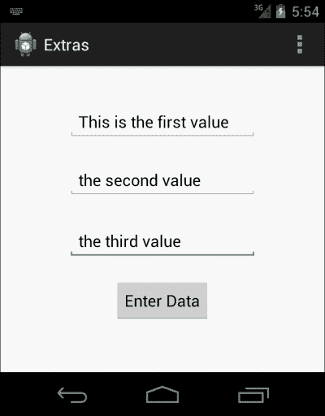

    `Activity1.java`布局用于通过`PutExtra()`从用户处获取输入。

1.  填写`EditText`字段并点击按钮以传输数据。`Activity2`屏幕将出现，并显示在`Activity1`屏幕中输入的表单数据：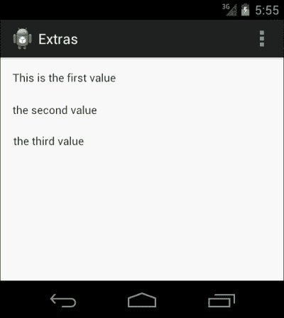

    `Activity2.java`文件的视图，显示数据已成功捕获并显示。

#### 理解代码

前一节“*实现一个现成的教程*”包含五个部分，我们将在以下各节中详细查看。像本书中呈现的每个示例一样，我们已根据新项目描述此示例，以使其灵活且易于理解。你可以轻松地将此示例放入你自己的应用程序中；一旦你正确理解了意图额外信息，这样做不会花费额外的努力。

##### `Activity1.java`类

开始，这是源活动，它将启动意图以导航到下一个活动。

这是一个在创建新的 Android 项目时构建的简单活动。回顾基础知识，它将有一个`onCreate()`方法，该方法将在活动由 Android 创建时首先执行。一旦创建了活动，在`Layout`文件夹中的`main_first.xml`文件中定义的布局将在屏幕上呈现。

现在，是获取布局文件中所有`EditText`字段对象的时候了。为此，我们将在代码中添加以下几行，通过 ID 查找视图并返回对象：

```kt
EditText editTextFieldOne = (EditText) findViewById(R.id.edittext1);
```

### 提示

为你的对象使用有意义的名称是很好的。由于这本书面向初学者，他们通常不处理大型应用程序，因此给出的对象名称是为了使代码尽可能简单。

`findViewById()`方法属于`Activity`类，其目的是找到可以是任何布局子视图的特定视图并返回对象。同样，通过编写以下几行代码，我们将获得另外两个`EditText`对象：

```kt
EditText editTextFieldTwo = (EditText) findViewById(R.id.edittext2);
EditText editTextFieldThree = (EditText) findViewById(R.id.edittext3);
```

目前，我们拥有`Activity1.java`类中所有输入字段的对象。下一步是实现按钮的功能，该功能将从这些字段获取输入，将它们添加到意图对象中，并发送出去。

### 注意

`findViewById()`方法的返回类型是`View`类的对象。因此，在使用`findViewbyId()`时，我们需要将返回的对象强制转换为特定的类类型。为了理解这一点，你可以看到在前面的代码中，视图被转换为`EditText`。

现在，下一步是在按钮上实现`OnClickListener()`方法。为此，第一步是使用与输入字段类似的方法获取按钮对象。

```kt
Button transferButton = (Button) findViewById(R.id.button);
```

一旦我们获得了按钮对象，我们将使用参数`OnClickListener()`实现`setOnClickListener()`方法及其实现：

```kt
transferButton.setOnClickListener(new OnClickListener(){});
```

如你所见，在前面的代码行中，我们已经为`transferButton`附加了一个`OnClickListener()`对象，以及它自己的`setOnClickListener`方法。请记住，它仍然是一个原始方法。现在，是时候重写`onClick()`方法了。

在前面的代码中，你可以看到给出了`onClick()`方法的定义，在这个方法中，我们将从`EditText`字段获取数据并将其放入意图额外数据中。如代码所述，通过在每个`EditText`对象上调用以下行来从`EditText`字段获取数据：

```kt
String valueOne = editTextFieldOne.getText().toString();
```

这将获取输入字段中当前存在的值。我们获取所有`EditText`字段的值，并依次存储在`valueOne`、`valueTwo`和`valueThree`中。

现在，我们已经有了要放入意图对象中的数据，我们使用之前描述的方法创建一个意图对象。我们设置源活动和目标活动（即`Activity1.java`作为源活动，`Activity2.java`作为目标活动）。下一步是在代码中传递值。`Intent.putExtra(String name, String data)`方法最适合将字符串值放入额外数据中。

`putExtra()`的参数有些像键值对。第一个参数`name`，基本上是到达目标活动后用来识别它的键。另一个就是与该键相关联的额外传输的值。因此，在下面的代码行中，我们使用一个键将字符串放入意图对象中：

```kt
intent.putExtra("EDITTEXT_ONE_VALUE",valueOne);
```

现在，我们已经将第一个`EditText`字段的值使用键`EDITTEXT_ONE_VALUE`放入了意图对象中，对于其他两个值，我们重复这一信息。一旦值被加载到意图对象中，我们就调用`startActivity()`方法来执行这个意图。

##### `Activity2.java`类

这是处理传入意图的目标类。这个类包含一个简单的布局文件，其中包含三个`TextView`视图，以显示来自前一个活动的值。在`onCreate()`方法中，意图是通过`getIntent()`方法接收的。这个方法属于`Activity`类，用于获取将导航到它的意图。

`Intent`类中有一个方法，用于获取与特定意图对象一起到来的所有额外数据。以下方法用于识别带有描述键的特定数据集：

```kt
String valueOne = intent.getExtras().getStringKey("EDITTEXT_ONE_VALUE");
```

与键`EDITTEXT_ONE_VALUE`关联的值将从意图对象中提取，并保存到`valueOne`字符串中。同样，所有的数据都将从意图对象中取出并保存在这个目标类中。

数据保存到变量后，是获取`TextView`视图的对象，并将这些值设置给它们的时候了。如前所述，使用`findViewById()`方法获取`TextView`视图。

```kt
textViewOne.setText(valueOne);
```

`setText()`方法用于在`TextView`中设置文本，因此它保存的是来自第一个活动传入的值。这就是目标活动如何通过使用`putExtras()`功能从源活动中获取数据。

##### main_first.xml 文件

main_first.xml 文件是一个简单的 XML 文件，其中包含三个`EditText`字段，用于活动从中获取输入。此外，它还包含一个按钮，用于触发事件以便导航到下一个活动。这些视图的 ID 分别被指定为`edittext1`、`edittext2`、`edittext3`和`button1`。

### 提示

你可以通过在 GUI 中拖放来制作你想要的布局文件。布局文件的 XML 代码很简单，并且在之前的章节中也有解释。但是，请记住，*拖放特别不推荐*给新的 Android 开发者使用；因此，实现它的最佳方式是通过 XML 文件。

##### main_second.xml 文件

这是第二个活动的布局文件，实际上它是目标活动和数据接收活动。布局包括三个`TextView`视图，用于显示从`Activity1`即源活动发送的`valueOne`、`valueTwo`和`valueThree`。

##### AndroidManifest.xml 文件

`AndroidManifest.xml`文件是 Android 应用程序的基本部分。它跟踪整个应用程序的结构。它包含所有的活动、接收器、权限、与版本相关的问题、最小和最大 SDK 以及其他许多内容。由于我们的项目中有两个活动，`Activity1`和`Activity2`，因此`AndroidManifest.xml`文件中包含了这些活动以及像应用程序版本名称和版本代码等不同的内容。

### 注意

从一个活动向另一个活动发送数据不需要特殊权限，但在 SD 卡或内部存储上进行数据读写时，我们确实需要某些权限来完成这项任务。

##### 未来的考虑事项

通过包裹发送数据是 Android 意图使用的基本技术之一。它有许多改进和效率提升，我们将在以下数据传输方法中进行进一步研究。我们还应该记住，这种方法仅限于某些特定的数据类型（在下一节中给出）。为了从从一个活动向另一个活动传输自定义对象，我们需要使用下一个数据传输方法。

### 支持的数据类型

Intent 的`putExtra()`方法支持多种数据类型，可以传输到目标活动。在之前的示例中，我们只使用了一种数据类型（`String`），但除此之外，我们还可以添加其他各种数据类型。除了`putParcelable()`和`putSerializable()`之外，这些方法都是不言自明的，它们是本章的下一个主要话题。请查看以下截图，展示了各种数据类型：

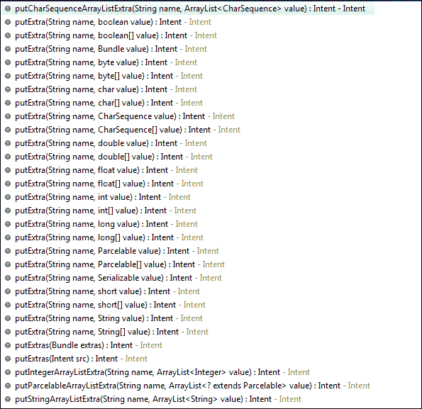

可以在 putExtras() 意图中添加的不同的数据类型

### 安卓捆绑包（Android Bundles）的概念

安卓数据 Bundle 是一个可以添加和一起发送各种值的捆绑包。例如，如果我们想通过`putExtra()`发送多个值，我们会创建一个 Bundle，将所有这些值添加到 Bundle 中，然后使用`intent.putExtras()`方法发送此 Bundle。

### 注意

你可以直接将所有值分别添加到意图中，以直接向意图提供数据，或者第二种方法是将所有值添加到 Bundle 中，并通过意图发送它。

我们现在将探讨如何将数据提供给 Bundle，并通过修改上一个活动来将此 Bundle 发送到下一个活动。在从`Activity1`发送数据时，我们不是直接将不同的值添加到意图中，而是进行以下操作：

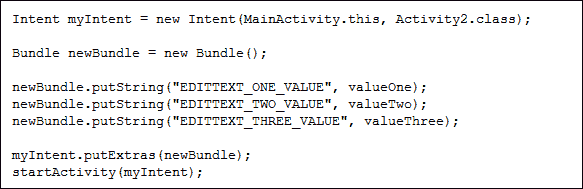

如你在代码中所见，`valueOne`、`valueTwo`和`valueThree`通过使用`newBundle.putString()`函数和每个数据值统一的关键字添加到 Bundle 中。现在，这个 Bundle 通过`intent.putExtras(newBundle)`函数添加到意图中，然后我们像在之前的例子中一样调用`startActivity()`函数。

在目标活动中，我们可以通过首先使用`getIntent().getExtras()`函数提取数据捆绑包直接捕获数据。这将返回 Bundle 对象，通过引用我们在源活动中添加的特定关键字，我们可以使用以下函数提取所有三个值的数据：

```kt
Bundle.getString("EDITTEXT_ONE_VALUE","DEFAULT_VALUE");
```

### 注意

`Bundle.getString(key, defaultValue)`中的第二个参数是默认值，如果找不到指定键的值，将返回该默认值。

查看以下截图。你将看到可以同时添加到 Bundle 中的不同数据类型：

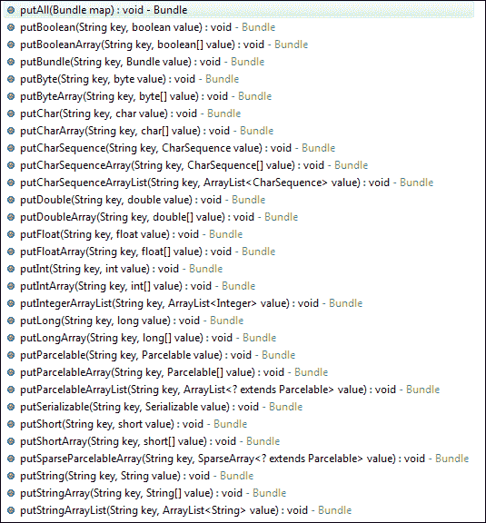

在 Bundle 中添加不同数据类型的各种函数

## 使用 Parcelable 进行数据传输

在活动之间传输数据的第二个也是最重要的方法是`Parcelable()`。前面的方法有一个限制，即我们只能发送基本数据类型，如`Strings`、`Integers`、`Doubles`和`Floats`。在实际项目中，我们需要在活动之间传输自定义对象。这些自定义数据对象根据应用程序的需求保存信息。因此，应该相应地传输它们。

现在很清楚，上一个版本仅用于基本数据类型的数据传输，而 Parcelable 可以被称为前一个类型的子类型。

在此方法中，数据类通过实现`Parcelable`类接口来继承，以使其对象与`putExtra()`意图方法兼容。我们还需要覆盖`Parcelable`类接口中的一些方法，以赋予其功能。一旦完成，该类的对象可以放入意图或 Bundle 中，以便在活动之间传递。

### `Parcelable`的实现

在本节中，我们将学习如何在数据类上实现`Parcelable`，然后如何在不同活动之间传输该对象。对此有两种情况：

+   只有一个对象从源类发送到目标类

+   自定义对象数组正在从源类发送到目标类

按照传统，我们将从创建一个新的 Android 项目开始。在给定的示例中，我们将其称为 Parcel 应用。该项目在创建时将创建`Activity1.java`作为默认活动，它也将作为源活动。第二个活动将是`Activity2.java`，它将作为接收 parcel 的目标活动。

#### 实现一个现成的教程

完成新项目的创建后，将此代码插入到你的应用程序中。这将影响`Activity1.java`、`Activity2.java`、`layout_activity1.xml`、`layout_activity2.xml`和`AndroidManifest.xml`，并引入另一个名为`Person.java`的类。

```kt
//----------------------------------------------------------------
//The Activity1 Class

public class Activity1 extends Activity {

  @Override
  protected void onCreate(Bundle savedInstanceState) {
    super.onCreate(savedInstanceState);
    setContentView(R.layout.layout_activity1);

    final EditText nameText = (EditText) findViewById(R.id.edittext_enter_name);
    final EditText sirnameText = (EditText) findViewById(R.id.edittext_enter_sirname);
    final EditText addressText = (EditText) findViewById(R.id.edittext_enter_address);

    Button enterButton = (Button) findViewById(R.id.button1);
    final Person firstPerson = new Person();
    enterButton.setOnClickListener(new OnClickListener() {

      @Override
      public void onClick(View v) {
        // TODO Auto-generated method stub
        firstPerson.setFirstName(nameText.getText().toString());
        firstPerson.setSirName(sirnameText.getText().toString());
        firstPerson.setAddress(addressText.getText().toString());

        Intent parcelIntent = new Intent(Activity1.this,Activity2.class);
        parcelIntent.putExtra("FIRST_PERSON_DATA", firstPerson);
        Activity1.this.startActivity(parcelIntent);

      }
    });

  }

  @Override
  public boolean onCreateOptionsMenu(Menu menu) {
    // Inflate the menu; this adds items to the action bar if it//is present.

    getMenuInflater().inflate(R.menu.activity1, menu);
    return true;}

}

//----------------------------------------------------------------
//The MySecondActivity Class

public class Activity2 extends Activity {

  @Override
  protected void onCreate(Bundle savedInstanceState) {
    // TODO Auto-generated method stub
    super.onCreate(savedInstanceState);
    setContentView(R.layout.layout_activity1);

    Person incomingPersonObj = getIntent().getParcelableExtra("FIRST_PERSON_DATA");
    TextView nameTextView= (TextView) findViewById(R.id.person_name_text);
    TextView sirnameTextView= (TextView) findViewById(R.id.person_sirname_text);
    TextView addressTextView= (TextView) findViewById(R.id.person_address_text);

    nameTextView.setText(incomingPersonObj.getFirstName());
    sirnameTextView.setText(incomingPersonObj.getSirName());
    addressTextView.setText(incomingPersonObj.getAddress());

  }
}

//----------------------------------------------------------------
//The layout_activity1.xml File

<RelativeLayout
  xmlns:android=http://schemas.android.com/apk/res/android
  xmlns:tools=http://schemas.android.com/tools
  android:layout_width="match_parent"
  android:layout_height="match_parent"
  android:paddingBottom="@dimen/activity_vertical_margin"
  android:paddingLeft="@dimen/activity_horizontal_margin"
  android:paddingRight="@dimen/activity_horizontal_margin"
  android:paddingTop="@dimen/activity_vertical_margin"
  tools:context=".Activity1" >

  <TextView
    android:id="@+id/textView1"
    android:layout_width="wrap_content"
    android:layout_height="wrap_content"
    android:layout_alignParentLeft="true"
    android:layout_alignParentTop="true"
    android:layout_marginTop="20dp"
    android:text="@string/name_text"
    android:textAppearance="?android:attr/textAppearanceMedium" />

  <EditText
    android:id="@+id/edittext_enter_name"
    android:layout_width="wrap_content"
    android:layout_height="wrap_content"
    android:layout_alignBaseline="@+id/textView1"
    android:layout_alignBottom="@+id/textView1"
    android:layout_alignParentRight="true"
    android:layout_toRightOf="@+id/textView1"
    android:ems="10"
    android:inputType="textPersonName" >

  <requestFocus />
  </EditText>

  <TextView
    android:id="@+id/textView2"
    android:layout_width="wrap_content"
    android:layout_height="wrap_content"
    android:layout_below="@+id/edittext_enter_name"
    android:layout_marginTop="20dp"
    android:layout_toLeftOf="@+id/edittext_enter_sirname"
    android:text="@string/sirname_text"
    android:textAppearance="?android:attr/textAppearanceMedium" />

  <EditText
    android:id="@+id/edittext_enter_sirname"
    android:layout_width="wrap_content"
    android:layout_height="wrap_content"
    android:layout_alignBaseline="@+id/textView2"
    android:layout_alignBottom="@+id/textView2"
    android:layout_alignLeft="@+id/edittext_enter_name"
    android:layout_alignRight="@+id/edittext_enter_name"
    android:ems="10" />

  <EditText
    android:id="@+id/edittext_enter_address"
    android:layout_width="wrap_content"
    android:layout_height="wrap_content"
    android:layout_alignLeft="@+id/edittext_enter_sirname"
    android:layout_alignRight="@+id/edittext_enter_sirname"
    android:layout_alignTop="@+id/textView3"
    android:ems="10" />

  <TextView
    android:id="@+id/textView3"
    android:layout_width="wrap_content"
    android:layout_height="wrap_content"
    android:layout_below="@+id/edittext_enter_sirname"
    android:layout_marginTop="20dp"
    android:layout_toLeftOf="@+id/edittext_enter_address"
    android:text="@string/address_text"
    android:textAppearance="?android:attr/textAppearanceMedium" />

  <Button
    android:id="@+id/button1"
    android:layout_width="wrap_content"
    android:layout_height="wrap_content"
    android:layout_alignRight="@+id/edittext_enter_address"
    android:layout_below="@+id/textView3"
    android:layout_marginRight="10dp"
    android:layout_marginTop="33dp"
    android:text="@string/enter_button_text" />

</RelativeLayout>

//----------------------------------------------------------------
//The activity_two_layout.xml File

<?xml version="1.0" encoding="utf-8"?>
<LinearLayout
  xmlns:android=http://schemas.android.com/apk/res/android
  android:layout_width="match_parent"
  android:layout_height="match_parent"
  android:orientation="vertical" >

  <TextView
    android:id="@+id/person_name_text"
    android:layout_width="wrap_content"
    android:layout_height="wrap_content"
    android:text="@string/null_string"
    android:textAppearance="?android:attr/textAppearanceMedium" />

  <TextView
    android:id="@+id/person_sirname_text"
    android:layout_width="wrap_content"
    android:layout_height="wrap_content"
    android:text="@string/null_string"
    android:textAppearance="?android:attr/textAppearanceMedium" />

  <TextView
    android:id="@+id/person_address_text"
    android:layout_width="wrap_content"
    android:layout_height="wrap_content"
    android:text="@string/null_string"
    android:textAppearance="?android:attr/textAppearanceMedium" />

</LinearLayout>

//----------------------------------------------------------------
//The Person.java File

public class Person implements Parcelable {

  private String firstName;
  private String sirName;
  private String address;

  public Person(){
    firstName = null;
    sirName = null;
    address = null;
  }
  public Person(String fName, String sName, String add) {
    firstName = fName;
    sirName = sName;
    address = add;
  }

  public Person(Parcel in) {
    firstName = in.readString();
    sirName = in.readString();
    address = in.readString();
  }

  public String getFirstName() {
    return firstName;
  }

  public void setFirstName(String firstName) {
    this.firstName = firstName;
  }

  public String getSirName() {
    return sirName;
  }

  public void setSirName(String sirName) {
    this.sirName = sirName;
  }

  public String getAddress() {
    return address;
  }

  public void setAddress(String address) {
    this.address = address;
  }

  @Override
  public int describeContents() {
    // TODO Auto-generated method stub
    return 0;
  }

  @Override
  public void writeToParcel(Parcel dest, int flags) {
    // TODO Auto-generated method stub
    dest.writeString(firstName);
    dest.writeString(sirName);
    dest.writeString(address);
  }

  public static final Parcelable.Creator<Person> CREATOR =new Parcelable.Creator<Person>() {

    public Person createFromParcel(Parcel in) {
      return new Person(in);
    }

    public Person[] newArray(int size) {
      return new Person[size];
    }
  };
}

//----------------------------------------------------------------
//The AndroidManifest.xml File

<?xml version="1.0" encoding="utf-8"?>
<manifest

  package="com.app.parcelapplication"
  android:versionCode="1"
  android:versionName="1.0" >

  <uses-sdk
    android:minSdkVersion="8"
    android:targetSdkVersion="17" />

  <application
    android:allowBackup="true"
    android:icon="@drawable/ic_launcher"
    android:label="@string/app_name"
    android:theme="@style/AppTheme" >
    <activity
      android:name="com.app.parcelapplication.Activity1"
      android:label="@string/app_name" >
      <intent-filter>
        <action android:name="android.intent.action.MAIN" />
        <category android:name="android.intent.category.LAUNCHER" />
      </intent-filter>
    </activity>
    <activity
      android:name="com.app.parcelapplication.Activity2"android:label="@string/app_name" >
    </activity>
  </application>

</manifest>
```

运行此应用程序，它将在你的设备上显示`Activity1`的输出屏幕。查看以下截图，了解应用程序在 Android 屏幕上的显示效果：

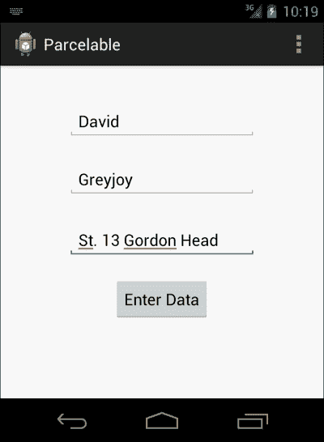

`Activity1`包含三个`EditText`字段以接收用户输入，以及一个按钮用于将数据传输到下一个活动

当你处于第一个屏幕时，输入数据并按下按钮，迁移到下一个活动，该活动将显示输入的数据。屏幕将如下所示：

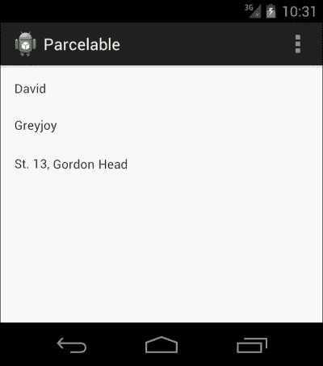

`Activity2`以`Parcelable`的形式显示从`Activity1`传输的数据

#### 理解`Parcelable`实现

为了理解此示例的工作原理，我们首先需要了解`Parcelable`的工作方式。在 Android 中，需要将自定义数据（即自定义对象和自定义对象数组）从一个活动传输到另一个活动。通常，自定义数据类与 extras 不兼容；因此，我们为该类实现`Parcelable`接口。

`Parcelable`对自定义数据类的作用是它与 extras 兼容。使用`Parcelable`实现的类的对象可以轻松地添加到意图的`putExtra()`方法中。同样，它也可以成为 Bundle 对象的一部分，稍后可以通过意图进行传输。

我们现在可以解释前面的代码。

##### `Activity1.java`类

这是`Parcelable`对象开始迁移的源类。它从实现`onCreate()`方法开始。在这个方法中，在设置主视图之后，我们通过它们的 ID 找到视图并将它们的对象带到活动中。这些视图包括三个`EditText`字段和一个按钮。它们用于获取用户的输入并触发事件，以便开始将数据传输到下一个活动。

在`button.setOnClickListener()`方法中，我们传递了一个新的`OnClickListener()`对象，在其中覆盖了`onClick()`方法。我们希望一旦点击按钮就启动意图，因此我们在`onClick()`方法中实现了意图，并从字段中获取数据。

现在，我们不希望该方法直接将数据传输到意图中。这就是为什么我们要创建一个`Person.java`类的对象，该对象将保存从字段中获取的值。我们将这个对象命名为`firstPerson`。为了将值设置到这个对象中，我们实现了以下代码行：

```kt
firstPerson.setFirstName(nameText.getText().toString());
```

前面的行将把该对象的名字设置为从第一个`EditText`字段中获取的值。第一个`EditText`字段，`nameText`，保存了名字的值。因此，使用`nameText.getText()`方法，它将返回可以轻松通过调用其上的`toString()`方法转换的`Editable`对象。

为了从第二个和第三个`EditText`字段获取值，将重复相同的方法。它们将被设置在同一个`Person`对象中。你可以通过以下代码行看到这一操作：

```kt
firstPerson.setSirName(sirNameText.getText().toString());.
firstPerson.setAddress(addressText.getText().toString());.
```

在这个阶段，`firstPerson`对象已经准备好从`Activity1`传递到`Activity2`。由于该对象是通过实现`Parcelable`来继承的，我们可以直接将其添加到额外数据中。我们将在接下来的部分学习如何实现`Parcelable`。在这里，我们将看到如何将`Parcelable`添加到意图对象中。

创建一个`Intent`类的对象，并为其提供源和目标，即源上下文和目标类的`.class`引用，以让它知道从哪里启动这个意图以及在哪里结束。我们可以通过调用`parcelIntent.putExtra()`来添加`Parcelable`。请看以下代码行：

```kt
parcelIntent.putExtra("FIRST_PERSON_DATA", firstPerson);
```

使用这个方法，我们可以轻松地将自定义的`Parcelable`数据对象添加到意图对象中，然后在下一行简单地调用`startActivity()`函数以启动意图。

##### Activity2.java 类

在这个类中，我们将学习如何在目标类中捕获传递的`Parcelable`对象。为此，首先按照实现活动的`onCreate()`方法的正常流程开始。设置内容视图并通过查找布局中的 ID 引入三个文本视图。这三个文本视图将显示第一个活动对象的接收值。

`getIntent()`方法将接收由`Activity1.java`类传输的意图对象，该对象持有数据。一旦获取到对象，我们可以通过调用`getExtras()`方法来获取其额外信息，这将返回一个包含数据的`Bundle`。在那个`Bundle`上调用`getParcelable()`函数，并带上键，以获取对象。现在，这个对象被一个新的`Person`类对象`incomingPersonObj`接收。

现在，我们有了一个在从`startActivity()`调用意图时从源类初始化的相同对象。我们现在将通过调用以下代码行来设置文本视图的文本：

```kt
nameTextView.setText(incomingPersonObj.getFirstName());
sirnameTextView.setText(incomingPersonObj.getSirName());
addressTextView.setText(incomingPersonObj.getAddress());
```

`incomingPersonObj.getFirstname()`方法将从`incomingPersonObj`获取人的名字，并在第一次调用方法时直接将其值设置给`nameTextView`。对于`sirnameTextView`和`addressTextView`对象，过程相同。

##### `layout_activity1.xml`文件

这是包含`Activity1.java`视图的布局文件。如代码中所述，它包含三个`EditText`字段，其 ID 分别为：`edittext_enter_name`、`edittext_enter_sirname`和`edittext_enter_address`。除此之外，还有三个文本视图，用于简单地指示哪个`EditText`字段包含哪个值。

每个活动都需要一个事件触发器，用于启动任何进程。在这个布局中，按钮将执行任务；因此，它也被放置在`EditText`字段下方。

##### `layout_activity2.xml`文件

这个布局文件创建了`Activity2.java`的布局，即目标活动。这个活动负责提取数据并在其布局中显示。布局包括三个`TextView`视图，其 ID 分别为`person_name_text`、`person_sirname_text`和`person_address_text`。这些 ID 用于将这些视图带到代码中（如代码的第二部分所示）。

##### `Person.java`类

`Person`类基本上是一个数据持有类，其对象将在应用程序的任何地方创建。这也被称为**豆类**，用于接收来自服务器以 JSON、XML 或其他任何格式的数据。在我们的`Person`类中，有三个字段。所有字段都是私有的，并具有它们各自的公共获取器和设置器。`firstName`、`sirName`和`address`对象表示它们将持有的信息类型。`Activity1.java`类创建了此类的一个对象，从`EditText`字段获取数据，并将其添加到对象内部。

这个类通过实现`Parcelable`接口来继承。这个`Parcelable`接口需要实现一些重要的事情。首先，我们将实现一个接受`Parcel`作为参数的此类构造函数。这个构造函数将在实现`Parcelable`接口时从类内部使用。`in.readString()`方法用于从包裹中读取值。

### 提示

为了使这项技术工作，需要按照在`writeToParcel()`方法中写入的顺序读取 Parcel。查看代码中写入 Parcel 的顺序。它是`firstName`、`sirName`和`address`。在构造函数中也可以观察到同样的顺序。

重写`writeToParcel()`方法是为了通过`Parcelable`生成同类对象，以便可以使用。`Parcelable.Creator<Person>`用于创建类的实例，供`Parcel`使用；它使用`writeToParcel()`方法来完成这项工作。

一旦准备好对象，就会将其转发到下一个活动，并由`Activity2.java`类捕获，如给定代码的第一和第二部分所解释的那样。

##### AndroidManifest.xml 文件

当谈论开发 Android 应用程序时，这个文件的重要性不容忽视。我们需要在这个文件中添加这两个活动，以便它们被 Android 应用程序识别。如您在文件中所见，这两个活动在清单文件中都有自己的标签，以及它们的参数和意图过滤器。

#### 未来考虑

前述实现`Parcelable`的方法是用于在 extras 或 Bundle 中传输单个`Parcelable`对象的。同样，我们可以通过实现`Parcelable`来传输自定义数据豆的数组或 ArrayList。

## 使用 Serializable 进行数据传输

在意图中使用的第三种数据传输方法是`Serializable`。许多 Java 开发人员已经熟悉`Serializable`这个词，因为它在 Android 引入之前就已经使用了。Android 最大的优势在于，其开发在 SDK 中是 Java，在 NDK 中是 C++。这使得它非常灵活且强大。

功能方面也是如此；`Java.io.Serializable`是纯 Java 功能，可以原封不动地在 Android 开发中使用。`putExtras()`意图有一个选项，可以在不进行任何特定努力的情况下将 Java 序列化对象从一个活动传输到另一个活动。我们从`Serializable`的介绍开始这一部分，供非 Java 用户了解。

### 什么是 Serializable？

Java 带有一个机制，可以将对象表示为字节数组。这里不仅序列化了数据，而且还可以找到关于对象类型以及对象内部放置了什么类型的数据的信息。

这些序列化对象可以写入文件并存储在任何外部存储中（例如 SD 卡）。重新制作对象的过程称为反序列化，在这个过程中，可以收集隐藏在字节数组中的信息，以便在需要时在内存中重新生成对象。

制作和重新制作任何序列化对象的过程完全独立于 JVM。这意味着可以在 Java 中序列化对象，并且可以在支持与序列化时相同版本的 Java 的 JVM 的任何语言中重新制作。

在 Java 中，`ObjectOutputStream`类用于序列化对象，而`ObjectInputStream`类用于当我们从现有的序列化对象重新生成对象时。这些类分别包含`writeObject()`和`readObject()`方法。这些方法实际上开始了序列化或反序列化的过程。

### `Serializable`的一个例子

在本节中，我们将了解 Java 中如何实现`Serializable`。这是 Android 处理这些对象的内部机制。这个例子包含两种方法，用于执行序列化和反序列化的任务。

首先，序列化的方法如下：

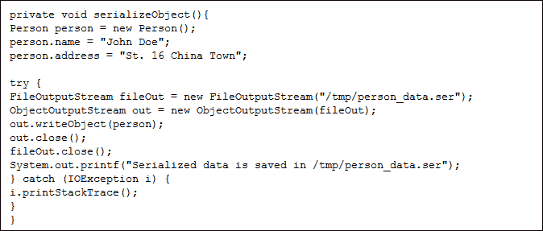

`Person`类实现了`Serializable`接口。这将使对象能被`ObjectOutputStream`类的对象识别。首先，我们将通过设置名称和地址创建一个序列化的对象，如代码所示。

一旦创建了对象，它就可以被序列化。我们从创建一个`FileOutputStream`对象开始，该对象用于将数据写入文件；同时添加将引用序列化文件所在位置的路径。创建一个将引用该文件的`ObjectOutputStream`对象，即`ObjectOutputStream out = new ObjectOutputStream(fileOut)`。现在我们可以通过调用`out.writeObject(person)`来写入对象。这将开始序列化对象（将其转换为字节数组）并将其添加到给定位置。然后我们将关闭`out`和`fileOut`对象。

下一步，我们将看到如何从序列化源读取数据。请看以下代码：

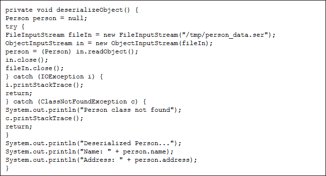

代码很容易理解，因为它几乎包含了将对象写入序列化文件所需的所有步骤。我们将创建一个`Person`类的实例以保存重建的对象。创建`FileInputStream`对象。它指向要反序列化的文件的位置。使用`ObjectInputStream`对象获取该文件路径并使其准备好读取。通过这种方式，调用`in.readObject()`方法以反序列化对象，并将返回`person`对象。完成此操作后，我们将关闭`in`和`fileIn`对象。

现在我们有了反序列化`Person`类的对象，可以在日志中或打印在控制台上。

### 注意事项

在 Java 和 Android 中编写可序列化对象的方法是相同的。当我们在 Android 中执行此操作时，我们可以将文件写入 SD 卡。之后，该文件可以被任何其他活动或应用程序获取并反序列化。

### `Serializable`的实现

到目前为止，我们已经理解了使用 `Serializable` 的主要原因。快速复习总是好的。`Serializable` 技术用于将对象转换为字节数组；我们可以将其写入文件，并将其存储为 SD 卡或其他存储设备上的 `.ser` 文件。然后可以在任何位置读取此序列化对象，而与活动无关。

### 注意

`Serializable` 是执行数据传输的最简单方法。它还用于从一个活动向另一个活动传递一个或多个自定义数据对象。

序列化文件不一定总是需要 `.ser` 扩展名。

与其他示例和实现一样，我们将通过创建一个全新的项目来开始这一过程。这个项目将包含两个活动；一个作为源活动，另一个作为目标活动。序列化的对象将从其中一个活动开始导航，目标活动将捕捉它以便从中提取数据。Android 原生支持 Java 的对象序列化和反序列化过程；因此，我们不需要做任何额外的工作，因为序列化的现象由 Android 自身处理。

#### 传递可序列化对象 —— 教程

在本章中，将通过创建一个新项目来开始实现 `Serializable`。默认情况下，这个项目将包含一个活动（假设为 `Activity1.java`）。实施以下步骤，您将制作一个实现了 `Serializable` 的项目。然后我们将了解其解释。

从第一步开始，在您新创建的 Android 项目中实现以下代码。这将引入三个新文件：

+   `Activity2.java`：这将作为目标活动。

+   `layout_activity2.xml`：这个文件将保存目标活动的布局。

+   `Person.java`：这是负责提供数据豆（data beans）对象的序列化类。

    ```kt
    // =============================================================
    //The Activity1.java file

    public class Activity1 extends Activity {

    @Override
    protected void onCreate(Bundle savedInstanceState) {
    super.onCreate(savedInstanceState);
    setContentView(R.layout.layout_activity1);

    final EditText edittext1 = (EditText) findViewById(R.id.editText1);
    final EditText edittext2 = (EditText) findViewById(R.id.editText2);
    final EditText edittext3 = (EditText) findViewById(R.id.editText3);

    Button button = (Button) findViewById(R.id.button1);
    button.setOnClickListener(new OnClickListener() {

    @Override
    public void onClick(View v) {
    // TODO Auto-generated method stub
    Person person = new Person();
    person.setName(edittext1.getText().toString());
    person.setSirname(edittext2.getText().toString());
    person.setAddress(edittext3.getText().toString());

    Intent intent = new Intent(Activity1.this, Activity2.class);
    intent.putExtra("PERSON_OBJECT", person);
    startActivity(intent);

    }
    });
    }

    @Override
    public boolean onCreateOptionsMenu(Menu menu) {
    // Inflate the menu; this adds items to the action bar if it is present.
    getMenuInflater().inflate(R.menu.main, menu);
    return true;
    }

    }

    //================================================================
    //The Activity2.java file

    public class Activity2 extends Activity {

    String TAG = "MainActivity2";
    @Override
    protected void onCreate(Bundle savedInstanceState) {
    super.onCreate(savedInstanceState);
    setContentView(R.layout.layout_activity2);
    Person person = (Person) getIntent().getExtras().getSerializable("PERSON_OBJECT");
    TextView tView = (TextView) findViewById(R.id.data_text);

    if(person != null){
    tView.setText("Data Successfully catched");
    Log.d(TAG, person.getName);
    Log.d(TAG, person.getSirName);
    Log.d(TAG, person.getAddress);

    }else{
    tView.setText("Data Object is null");
    } 
    }

    @Override
    public boolean onCreateOptionsMenu(Menu menu) {
    // Inflate the menu; this adds items to the action bar if it is present.
    getMenuInflater().inflate(R.menu.main, menu);
    return true;
    }

    }

    //================================================================
    //The Person.java
    public class Person implements Serializable {
    String name;
    String sirname;
    String address;

    private static final long serialVersionUID = 1L;

    public String getName() {
    return name;

    }
    public void setName(String name) {
    this.name = name;
    }

    public String getSirname() {
    return sirname;
    }

    public void setSirname(String sirname) {
    this.sirname = sirname;
    }

    public String getAddress() {
    return address;
    }

    public void setAddress(String address) {
    this.address = address;
    }
    }

    //================================================================
    //The layout_activity1.xml file

    <RelativeLayout 

        android:layout_width="match_parent"
        android:layout_height="match_parent"
        android:paddingBottom="@dimen/activity_vertical_margin"
        android:paddingLeft="@dimen/activity_horizontal_margin"
        android:paddingRight="@dimen/activity_horizontal_margin"
        android:paddingTop="@dimen/activity_vertical_margin"
        tools:context=".MainActivity" >

        <EditTextandroid:id="@+id/editText1"
            android:layout_width="wrap_content"
            android:layout_height="wrap_content"
            android:layout_alignParentTop="true"
            android:layout_centerHorizontal="true"
            android:layout_marginTop="26dp"
            android:ems="10" >

            <requestFocus />
        </EditText>

        <EditText
            android:id="@+id/editText2"
            android:layout_width="wrap_content"
            android:layout_height="wrap_content"
            android:layout_below="@+id/editText1"
            android:layout_centerHorizontal="true"
            android:layout_marginTop="41dp"
            android:ems="10" />

        <EditText
            android:id="@+id/editText3"
            android:layout_width="wrap_content"
            android:layout_height="wrap_content"
            android:layout_above="@+id/button1"
            android:layout_centerHorizontal="true"
            android:layout_marginBottom="22dp"
            android:ems="10" />

        <Button
            android:id="@+id/button1"
            android:layout_width="wrap_content"
            android:layout_height="wrap_content"
            android:layout_alignParentBottom="true"
            android:layout_centerHorizontal="true"
            android:layout_marginBottom="153dp"
            android:text="Enter Data" />

    </RelativeLayout>

    //================================================================
    // The layout_activity2.xml file

    <RelativeLayout 

        android:layout_width="match_parent"
        android:layout_height="match_parent"
        android:paddingBottom="@dimen/activity_vertical_margin"
        android:paddingLeft="@dimen/activity_horizontal_margin"
        android:paddingRight="@dimen/activity_horizontal_margin"
        android:paddingTop="@dimen/activity_vertical_margin"
        tools:context=".MainActivity" >

        <TextView
            android:id="@+id/data_text"
            android:layout_width="wrap_content"
            android:layout_height="wrap_content"
            android:text="@string/hello_world" />

    </RelativeLayout>

    //================================================================
    //The AndroidManifest.xml file

    <?xml version="1.0" encoding="utf-8"?>
    <manifest 
        package="com.app.serializable"
        android:versionCode="1"
        android:versionName="1.0" >

        <uses-sdk
            android:minSdkVersion="8"
            android:targetSdkVersion="17" />

        <application
            android:allowBackup="true"
            android:icon="@drawable/ic_launcher"
            android:label="@string/app_name"
            android:theme="@style/AppTheme" >
            <activity
                android:name="com.app.serializable.Activity1"
                android:label="@string/app_name" >
                <intent-filter>
                    <action android:name="android.intent.action.MAIN" />

                    <category android:name="android.intent.category.LAUNCHER" />
                </intent-filter>
            </activity>
            <activity
                android:name="com.app.serializable.Activity2"
                android:label="@string/app_name" >
                <intent-filter>
                    <action android:name="android.intent.action.MAIN" />

                    <category android:name="android.intent.category.DEFAULT" />
                </intent-filter>
            </activity>
        </application>

    </manifest>
    ```

完成实现后，运行项目。将出现以下屏幕，您需要在字段中添加您的数据。然后点击 **Enter Data** 按钮：

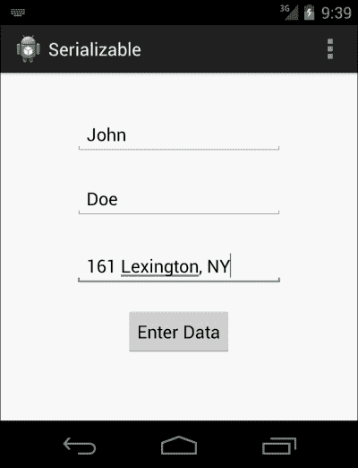

源活动要求输入数据，以便通过序列化发送它

当您按下 **Enter Data** 按钮时，将打开 `Activity2.java`，并显示以下屏幕：

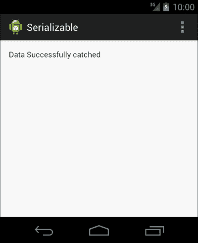

Activity2 显示数据已成功输入

同时，当您查看项目的 LogCat 时，它将显示我们在 `Activity2.java` 文件中记录的数据。请看以下截图：


LogCat 显示在 Activity2 中成功捕捉到数据

#### 漫步于 Serializable 代码中

为了理解 Android 中 Serializable 的工作原理，你需要回顾一下之前描述的 Java 中`Serializable`的细节。如果你还没有看过这部分内容，我们建议你查看一下。在本节中，我们将重点解释前面的示例以及如何在 Android 项目中实现它。

为了简化，我们将其分为六个部分。每个部分都有详细的解释。

##### `Activity1.java`类

`Activity1.java`类将作为启动意图的源活动。它还将作为源活动，因为它负责创建并发送自定义数据对象。让我们从代码的第一部分开始，即实现`Activity1.java`类。

如前所述，这个类负责从用户那里接收数据输入，并创建一个数据对象。在`onCreate()`方法中，我们首先会通过`setContentView()`方法设置一个特定的布局，该布局包含视图。布局设置完成后，我们的下一个任务是将这些视图作为对象带入到我们的 Java 代码中，如下面的代码所示。这将帮助我们执行这些对象上绑定在布局中的视图的各种任务。

```kt
final EditText edittext1 = (EditText) findViewById(R.id.editText1);
final EditText edittext2 = (EditText) findViewById(R.id.editText2);
final EditText edittext3 = (EditText) findViewById(R.id.editText3);
```

调用`findViewById()`函数会带来与 ID 相关联的特定视图。我们将它强制转换为`EditText`类，并分别将其放入`edittext1`、`edittext2`和`edittext3`对象中。

这三个字段将用于从用户那里获取输入，但我们需要一个事件触发器，用于从一个活动导航到另一个活动，并负责数据传输。为此，我们在布局中实现了一个按钮，并通过调用`findViewById()`方法在 Java 代码中获取它：

```kt
Button button = (Button) findViewById(R.id.button1);
```

现在，我们的 Java 代码中有了所有必要的视图。下一步是实现按钮的功能，即它被点击时将执行什么操作。为此，我们需要在这个按钮上实现`OnClickListener`接口：

```kt
Button.setOnClickListener(new OnClickListener())
```

上述代码行负责为按钮设置点击监听器。它接收一个`OnClickListener`参数，在其中我们实现了`onClick()`方法。这个`onClick()`方法将负责给按钮分配一个任务：

```kt
button.setOnClickListener(new OnClickListener() {
  @Override
  public void onClick(View v) {
    // TODO Auto-generated method stub
  }

  });
```

完成这些后，我们将创建一个`Person`类对象（`Serializable`对象），并将其值设置为从`EditText`字段获取的输入值。现在，它有两个部分；第一部分是创建`Person`类的新对象。我们将通过调用其构造函数来实现这一点：

```kt
Person person = new Person();
```

在第二部分，我们将通过调用`getText()`方法获取`EditText`对象的值。`getText()`方法返回一个`Editable`对象；因此，为了将其转换为字符串，我们在其上调用`toString()`方法。当你观察代码时，我们会一起执行所有这些任务：

```kt
person.setName(edittext1.getText().toString())
```

首先，从`edittext1`对象获取值并将其转换为`String`。其次，我们通过其值设置人员的姓名。我们将使用类似的过程进一步设置`person`对象的`sirName`和`address`：

```kt
person.setSirname(edittext2.getText().toString());
person.setAddress(edittext3.getText().toString());
```

现在，我们已经有一个准备传输的对象。我们将创建一个`Intent`对象，并为其分配源活动和目的地活动的上下文。这将表示意图从哪个活动启动，以及它将迁移到哪个活动。我们将通过调用构造函数来实现这一点：

```kt
Intent intent = new Intent(Activity1.this, Activity2.class);
```

一旦创建了意图对象，我们将在其中添加数据对象并调用`startActivity()`方法。为了将序列化对象放入意图对象中，我们将调用`intent.putExtra()`方法。这部分最后的步骤是调用`startActivity()`方法，该方法将启动导航过程。

##### `Activity2.java`类

目的地活动的主要目的是捕捉意图，从中提取数据对象，并在视图中显示。我们从实现`onCreate()`方法开始。首先，通过调用`Activity`类的`setContentView()`方法来设置布局。现在，是时候捕捉从`Activity1.java`类启动的`intent`对象了。

与本章前面的示例一样，我们通过调用`getIntent()`函数来获取意图。这个函数返回一个用于启动此活动的`intent`对象。一旦有了`intent`对象，我们就调用`getExtras()`函数。这将返回一个包含发送活动添加到这个`intent`对象的所有额外内容的 Bundle。

在这个 Bundle 上，我们现在将调用`getSerializable()`方法，它将借助发送活动赋予的`key`值带来一个`Serializable`对象。那个`key`值应与发送活动的值相同；否则，它将返回一个可能导致应用因`NullPointException`而崩溃的空值。

现在`Person`对象已经包含了所有的值。我们接下来的任务是把这些值在 LogCat 中记录下来，以便我们可以验证它。实现了一个空指针检查，以查看对象是否为空。如果不为空，我们从`person.getName`、`person.getSirName`和`person.getAddress`获取并记录其值。如果对象为空，它会显示`Data Object is null`，因此不会崩溃。

```kt
Log.d(TAG, person.getName);
```

##### `Person.java`类

当我们谈论从`Serializable`传输数据时，`Person.java`类是我们需要实现的最重要的类。我们创建了一个 Java 类，其中包含三个私有字符串变量。每个变量都有自己获取和设置外部值的 getter 和 setter 函数。与前面的方法一样，我们使用`Parcelable`接口实现了我们的数据豆类；在这里，我们将使用`Serializable`实现我们的类。

一旦实现，Android 就可以将这个类的对象视为`Serializable`。现在，每当它被添加到意图对象中时，Android 将以字节数组的形式传输它。与`Parcelable`相比，这是一个较慢的过程，但当我们只处理几个对象时，这种缓慢是不明显的。如果我们想在有数千个数据对象的地方应用这种方法，可能会花费一些时间。

##### `layout_activity1.xml`文件

布局文件属于`Activity1.java`类。当你第一次运行代码时，将显示这个布局文件中描述的布局。在`Activity1.java`类的`onCreate()`方法中，我们使用了`setContentView()`方法来粘贴用户界面。

在这个 XML 文件中，有四个视图；其中三个是`EditText`字段，用于在 Activity1 中接收用户输入。除此之外，还有一个按钮，用于在字段中完全填充数据后触发事件。给它们分配的 ID 是`Activity1.java`类默认使用的，用于在`.java`类中获取这些视图，`edittext1`、`edittext2`和`edittext3`分别是它们各自字段的 ID。

##### `layout_activity2.xml`文件

这个布局文件包含了`Activity2.java`类所需的视图。它由一个`TextView`视图组成，该视图将告诉我们从`Activity1.java`类传来的值是否正确获取。这个文本视图将根据数据对象显示**数据成功捕获**或**数据对象为空**的消息。

##### `AndroidManifest.xml`文件

`AndroidManifest.xml`文件包含所有的活动、权限、SDK 信息、版本代码等许多其他内容。简而言之，它用于保存有关应用程序的所有信息。在这里，我们有我们的活动，`Activity1.java`和`Activity2.java`类以及它们的意图值。如果你忘记在这个文件中提及任何活动，它将在 LogCat 中产生异常，显示`ClassNotFoundException`。

### 提示

`Parcelable`和`Serializable`是两种用于从一个活动传输数据对象到另一个活动的方法。`Serializable`是最简单实现的，而`Parcelable`是所有方法中最快的。如果你需要基于较少的对象执行任务，并且想要一个简单的解决方案，你应该选择`Serializable`。但是，如果你想要一个无论实现复杂性如何都完美的方法，你应该选择`Parcelable`。

# 数据和隐式意图

在前面的示例中，描述了应用程序内部数据传输的需求。现在非常清楚，没有数据的传输和处理，任何应用程序都是不完整的。在本章的这一部分，我们将看到需要将数据传输到隐式意图的场景。

回顾隐式意图的定义，它们通常不会指向一个专门的目标，而是将应用程序的流程交给外部应用程序，或者换句话说，它们启动另一个活动以执行特定任务。

外部应用程序需要从你的应用程序中获取一些数据以执行任务。现在，我们将看到在哪种情况下，以 URI 形式的数据传递会传递给隐式意图。

## 查看地图

你可以从自己的应用程序启动谷歌地图，并定位到一个特定的地点。这意味着你可以通过隐式意图发送需要打开的任何位置到谷歌地图。基于纬度和经度，你可以打开谷歌地图上的一个特定点。这个纬度和经度通过 URI 传递给谷歌地图，这是向隐式意图发送数据的一种方式。

为了执行这项任务，我们需要编写以下代码行：


根据特定的语法，我们需要编写 URI 字符串。为了打开特定位置的地图，URI 字符串包含`geo`关键字，后面跟着纬度和经度（如代码所示，以逗号分隔）。这个 URI 值通过`android.content.Intent.ACTION_VIEW`动作传递给隐式意图。这个视图动作将获取 URI 并打开最佳的应用程序来执行任务。然后，我们将通过调用`startActivity(intent)`方法启动意图。

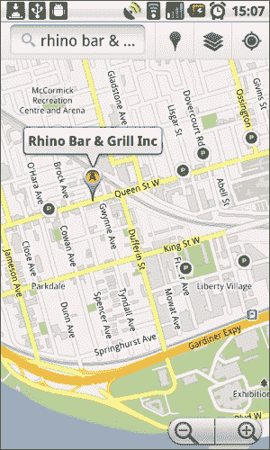

安卓操作系统中的谷歌地图视图。

## 打开网页

如果你想打开网页，数据传递的隐式需求也可以按类别划分，你需要用特定的加载页面打开默认的网页浏览器。在这个过程中，我们需要传递应用程序想要在浏览器中打开的 URL。这个 URL 也是通过`Uri.parse()`方法传递的。

### 提示

请记住，在此场景中我们使用的是默认的网络浏览器，并不是作为安卓应用程序一部分的网页视图。

为了在默认的网络浏览器中发送并打开 URL，请按顺序实现以下代码行：

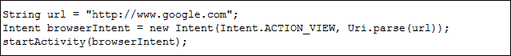

如代码所示，有一个字符串包含要在网络浏览器中打开的值（URL）。这个值然后通过`Uri.parse()`函数的意图构造器中，使用`Intent.ACTION_VIEW`动作输入。这将选择最佳选项来打开 URL。


浏览器打开我们应用程序调用的 Google.com 网页的视图。

## 发送电子邮件

您可能需要一种功能，在您的应用程序中调用默认的 Google 邮件应用程序，并指定一个特定的收件人和电子邮件内容。在这种情况下，我们同样需要将数据添加到意图对象中，即发件人姓名、电子邮件正文和电子邮件主题，然后启动该活动。

为了执行此任务，我们需要编写以下代码行：

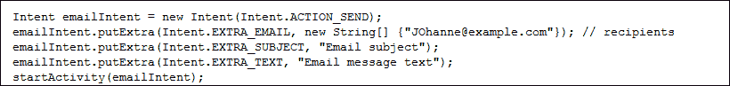

创建一个带有`Intent.ACTION_SEND`动作的`Intent`对象。其作用是打开发送选项的意图。现在，是时候向这个对象中添加数据了。Android API 考虑到了所有可能发生的场景；因此，在`Intent`类中有一些定义的常量，可用于由 Android 唯一标识数据。`Intent.EXTRA_EMAIL`是在使用`putExtra()`方法向意图提供电子邮件地址时使用的关键字常量。同样，在额外信息中提及主题也有一个关键字常量；`Intent.EXTRA_SUBJECT`和`Intent.EXTRA_TEXT`将用于添加电子邮件的正文。

一旦我们使用这些参数调用应用程序，它将以这些参数填充字段的方式打开 Gmail。它看起来会类似于以下截图：

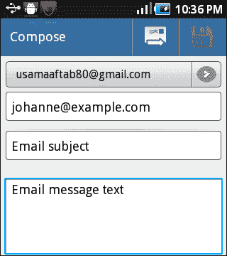

由我们的应用程序调用的 Gmail 应用程序视图

## 拨打电话

如果您想在应用程序中启动一个特定号码的呼叫，您需要调用拨号器意图。使用`Intent.ACTION_DIAL`，您可以启动带有给定 URI 的特定号码的拨号器意图。按照以下代码，在您的应用程序中实现拨号器功能：

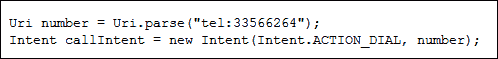

URI 字符串包含了拨号器应该启动的电话号码。一旦打开拨号器，它会显示号码原文，用户现在可以拨打这个号码。

## 其他杂项场景

本章还可以包含其他各种场景（例如日历和时间小部件），但由于篇幅和限制，我们只考虑了四个场景。在隐式意图间实现数据传输至关重要，且可以非常轻松地完成。

# 总结

在本章中，我们详细学习了如何在 Android 应用程序内操作数据。我们了解到如何使用不同的方法将数据从一个活动传输到另一个活动，以及如何使用意图的`putExtra()`函数简单传递默认数据结构。自定义数据对象或自定义数据对象数组可以通过`Parcelable`和`Serializable`发送到另一个活动。我们还学习了如何在我们的 Android 应用程序中实现所有这些数据传输方法。在章节的最后，我们简要介绍了四种场景，在这些场景中，当通过意图从我们的应用程序调用其他应用程序时，数据会通过隐式意图发送到其他应用程序。

本章节对于实际应用开发至关重要，因为活动间甚至应用外部的数据传递是任何 Android 应用程序的基本组成部分，而使用 Android 意图可以轻松实现这一功能。

在接下来的章节中，我们将学习如何使用意图来访问 Android 的特性。我们还将了解意图过滤器是如何工作的，广播意图的基础知识是什么，最后，我们将学习意图服务及待定意图的实现。
