# 第六章：使用意图访问 Android 功能

在上一章中，我们讨论了使用组件进行数据传输。我们了解了如何从一个活动向另一个活动传输数据，以及为什么应该在不同的组件之间传输数据。我们还讨论了使用意图进行数据传输的各种方法。Android 系统中有很多组件，意图提供了一种简单的接口，使这些组件能够相互通信。第四章中，我们讨论了使用系统硬件如 Wi-Fi、蓝牙、摄像头、麦克风等的不同的 Android 组件。我们还讨论了如何使用意图利用这些组件，以及如何使用不超过几行代码的 Android 硬件开发许多不同的应用程序。

到目前为止，我们只讨论了硬件组件及意图与这些组件的作用。这一章全是关于 Android 软件功能以及如何使用意图作为主要接口在我们的应用程序中使用这些功能。Android 包含大量的库和 API，开发者可以非常容易地使用不同的 Android 功能。本章将引导我们了解常见的 Android 功能，并且我们还将开发一些示例应用程序，展示如何与这些功能结合使用意图。

本章包括以下主题：

+   Android 操作系统的功能

+   Android 功能与组件对比

+   常见的 Android 操作系统功能

+   Android 功能和意图

+   `<uses-feature>`和`<uses-permission>`标签

+   使用 SEND 动作分享

+   使用意图发送短信/MMS

+   使用意图发送数据消息

+   确认消息送达

+   接收短信

+   使用意图进行电话通信和拨打电话

+   使用意图发送通知

+   其他一些 Android 功能

    ### 小贴士

    本章以及后续章节需要理解意图的概念和结构，这是基本前提。如果你对这些东西的基本概念不了解，我们建议你阅读第三章，*意图及其分类*和第四章，*移动组件的意图*以便继续深入学习。

# Android 操作系统的功能

Android 是一个开源的操作系统和智能设备（如手机和平板电脑）的中间件框架。这些设备包含了许多提供用户便捷生活方式的功能和功能。这些功能包括硬件功能，如音频、蓝牙、摄像头、网络、麦克风、GSM、NFC 以及诸如加速度计、气压计、指南针、陀螺仪和 Wi-Fi 等传感器。

它不仅包括硬件组件，还包括软件特性，如应用小部件、主屏幕、输入法、动态壁纸、布局、存储、消息传递、多语言支持、浏览器、Java 支持、媒体支持、多点触控、通话、消息传递、多任务处理、可访问性、外部存储等。我们之前已经将硬件特性称为移动组件，并在前面的章节中进行了讨论。我们将在本章中通过实际示例讨论软件特性。

### 注意事项

在这里我们使用两个关键词：组件和特性。摄像头、蓝牙等组件是安卓手机的硬件部分。特性是安卓手机的软件部分，如短信特性、电子邮件特性等。本章将介绍软件特性、它们的访问方式以及通过意图使用它们的方式。

# 安卓特性与组件

通常，“安卓特性”和“组件”这两个词可以互换使用。但为了明确起见，我们将关键词*组件*定义为使用硬件的特性，而将关键词*特性*定义为在后台使用软件的安卓特性。正如我们在上一节中讨论的，安卓包含许多组件和特性，当这些组件和特性被移植到任何手机上时，就使其成为智能手机。并非所有的组件和特性都可以通过意图使用。因此，我们将详细讨论那些可以通过意图使用的特性。

需要注意的是，直接或间接使用硬件的特性需要用户提供访问权限。这些权限在应用程序安装过程中提供。如果用户没有向应用程序提供权限，应用程序将无法访问硬件；因此，它无法使用该特性。

在本章中，我们将了解那些在后台使用软件但还需要一些权限的特性。我们将在以下部分提供有关权限的更多详细信息。

# 常见安卓特性

到目前为止，我们只是以一般方式讨论了安卓特性。在本节中，我们将讨论在安卓手机和平板电脑中常见的一些最常用的安卓特性。每个安卓设备在某些方面都是独一无二的，并且拥有许多与其他品牌和手机不同的独特特性和组件。但是在所有安卓手机中都能找到一些共同的特性。这些特性中的许多可以用于我们的应用程序，无论具体的型号或手机如何，意图无疑是最异步且简单的方式来在应用程序中使用这些特性。现在，让我们看看在许多设备中常见的安卓特性及其在手机中的功能。

## 布局和显示

现在，智能手机的尺寸越来越大，还有一些新的 Android 设备类型，即平板电脑。更大的屏幕和更高分辨率的显示已经将手机转变为多媒体设备。这些设备拥有从 240 x 320 到 1268 x 800 像素的布局尺寸和从 3 英寸到 11 英寸的屏幕尺寸。这些设备屏幕密度有所不同，如低、中、高、大、超大等。以下图片展示了三种不同分辨率设备的比较：

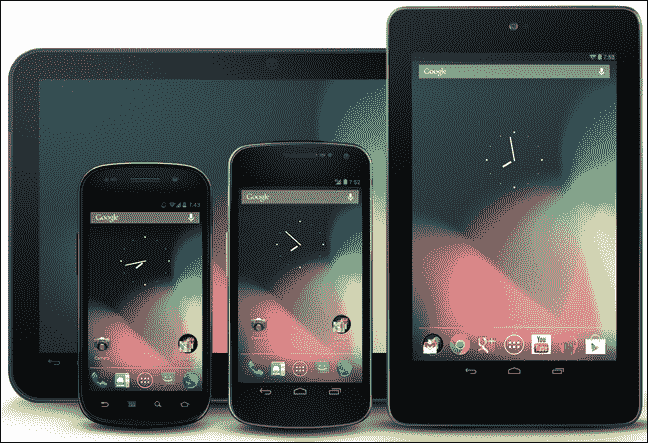

不同屏幕尺寸的 Android 设备

为了显示高质量的图形，Android 提供了用于 2D 画布绘图和 3D 图形的图形库，使用 OpenGL-ES 的 OpenGL。在 Android 3.0 版本之后，引入了一个新的渲染图形库 RenderScript。RenderScript 是一种针对 Android OS 的脚本语言，允许开发者编写高性能图形渲染和原始计算代码。它主要定位于并行数据处理计算，比如在多核处理器（如 CPU、GPU 或 DSP）之间分配处理。

### 注意

在 Android 3.0 之前，专为 Android 平板电脑开发的版本，Android 使用 2D 画布来渲染其布局、主屏幕和移动 UI。在 Android 3.0 引入 RenderScript 之后，Android 使用 RenderScript 以更美观和优化的图形来渲染其布局、主屏幕和移动 UI。

## 数据存储与检索

没有哪种 Android 设备在运行时不需要某种形式的存储。为了更好的性能，设备不仅需要像 RAM 这样的易失性内存以便处理和快速访问，还需要像外部 SD 卡这样的永久性存储。Android 设备支持多种数据存储和检索方式，这些方式根据开发者和将使用的应用程序而有所不同。

如果我们的应用程序使用大量数据，开发者可以使用 SQLite 轻量级关系数据库功能为每个应用程序提供支持。开发者可以使用 SQLite 数据库来管理具有保密和高效存储能力的数据。

不仅数据库，Android 设备还提供了文件存储功能。由于保存和加载数据对于几乎每个应用程序来说都是至关重要的，Android 提供了多种不同的方法来存储和检索数据，以确保我们应用程序的持久性。文件存储并非最佳选择，但有时，开发者除了读写文件来处理应用程序的持久数据外，别无他法。幸运的是，Android 提供了功能，让开发者可以在设备的内部或外部媒体上创建、保存和加载文件，比如 SD 卡。这些 microSD 卡采用 FAT32、Ext3 或 Ext4 文件系统格式。不仅有这些文件系统，而且一些 Android 设备，尤其是平板电脑，支持高容量存储媒体，如 USB 闪存盘。

除了在数据库或磁盘文件中存储大量或重型数据外，安卓还提供了一个用于存储简单应用程序数据的功能，如 UI 状态、游戏得分等。这是通过使用`SharedPreferences`方法实现的。`SharedPreferences`方法使用名称/值对（NVP）机制来存储应用程序的轻量级数据。

## 连接和通信

在具备连接功能之前，我们不能将一个安卓设备称为智能手机。支持连接、通信和数据传输的技术包括 GSM/Edge、IDEN、CDMA、EV-DO、蓝牙、Wi-Fi、LTE、近场通信（NFC）、WiMAX 等。安卓提供了一套完整的通信和连接库。这使得开发者可以轻松地在他们的应用程序中使用这些功能。例如，通过蓝牙支持，用户可以发送文件，访问电话簿和语音拨号，以及在不同手机间交换联系人。

### 注意

在安卓 3.1 及其之后的版本中，安卓包含了通过蓝牙通信将键盘、鼠标和游戏手柄设备与安卓手机连接的原生功能。在安卓 3.1 之前，一些第三方应用程序为此提供了定制的方法。

安卓手机不仅支持数据传输，还支持电话和短信通信。安卓包含了用于短信通信的 SMS 和 MMS，以及线程化文本消息和**安卓云到设备消息传递**（**C2DM**），新的**谷歌云消息传递**（**GCM**）也是安卓推送消息服务的一部分。

对于电话功能，安卓支持通话，但在撰写本书时并不支持原生视频通话；然而，一些安卓设备定制的操作系统版本允许开发者和用户通过 UMTS 网络（如三星 Galaxy S）或 IP 进行视频通话。此外，谷歌环聊（Google Hangout），取代了谷歌 Talk，在安卓 2.3.4 及更高版本中可用。这允许用户使用互联网连接进行视频通话。要使用谷歌环聊视频通话，用户需要一个谷歌+账户。微软公司的第三方工具 Skype 也用于在安卓 2.3 及以后版本中进行视频通话。

## 可访问性和多点触控

安卓设备运行在完全基于触摸的界面上，包含一些硬或软触摸按钮，这些按钮根据设备的不同而有所差异。Android 设备原生支持多点触控。多点触控技术允许开发者和用户使用单点触控、轻敲、双击、长按、捏合缩放手势、旋转手势、各个方向的滑动手势等等。Android 的最新版本（在撰写本书时是 Android 4.4 KitKat）包含一些新的触摸手势，如轻敲和长按手势、滚动手势等。同时，三星推出了无触摸手势，利用他们特定的 API，即 Look API。通过 Look API，用户无需触摸屏幕，只需在空中移动手或头部，Android 就会执行所需的功能。例如，头部向上移动将向上滚动页面，头部向下移动将向下滚动页面。此外，许多 Android 设备制造商，如三星，推出了笔功能，以便用户更轻松、更准确地用笔在手机上书写和使用。

### 注意

多点触控功能最早是在 HTC Hero Android 手机中推出的。在那之前，由于当时苹果对触摸屏技术的专利，该功能在 Linux 内核层面原本是被禁用的。

除了触摸操作，用户还可以通过原生引入的语音或语音识别引擎来访问他们的手机。同时，Android 包含一个名为 Talkback 的功能，该功能允许视力不佳的人听到他们的 Android 手机在特定时间正在进行的操作。这些人可以使用语音操作如拨打电话、发送短信、导航等来访问他们的手机。这些语音操作是从 Android 2.2 版本开始引入的。在撰写本书时，通过语音操作控制硬件的能力在 Android 中尚未实现。

### 注意

Android 4.1 及其后续版本在语音操作上进行了增强，当使用特定命令查询时，可以读取来自谷歌知识图谱的答案。

## 广泛的内容和多媒体支持

安卓设备在高清媒体支持方面不亚于任何电脑。Android 提供了全面的 API 来管理图片、视频和音频。Android 设备支持的格式包括 WebM、H.263、H.264、3GP、MP4、MPEG-4、AMR、MP3、MIDI、OGG、WAV、JPEG、PNG、GIF、BMP 和 WebP。不仅如此，Android 还提供了使用 RTP/RTSP 协议、HTML 渐进式下载（如 HTML5 `<video>`标签）、HTTP 动态流媒体协议以及 Flash 插件提供的 Adobe Flash 流媒体（RTMP）协议在线流媒体的功能。

### 注意

新的 Android 设备支持 3D 图像捕捉和 3D 视频支持作为其原生功能。

除了广泛的多媒体支持外，Android 还提供了播放功能、控制选项、播放器、像其他手机一样的声音硬件按钮、全屏播放等。

安卓不仅支持多媒体，还支持内容格式，如文本文件、Word 文档、HTML 等。安卓中可用的网页浏览器基于开源的 WebKit 布局引擎，该引擎最初由苹果公司开发。这与 Chrome 的 V8 JavaScript 引擎相结合，在安卓系统中使用。

虽然大多数安卓应用程序原生是用 Java 编写的，但由于安卓系统中没有 Java 虚拟机，因此不支持 Java 字节码。这个 Java 代码反而被编译成 Dalvik 可执行文件，在专为安卓系统设计的 Dalvik 虚拟机上运行。Dalvik 最重要的特点是，它与 Java 虚拟机相比，针对低电量、有限内存和 CPU 进行了优化。

### 注意

安卓浏览器在安卓 4.0 版本中 Acid3 测试得到了 100/100 的分数。 Acid3 测试是由 Web Standards Project 提供的网页测试页，用于检查网页浏览器对各种网页标准元素（如文档对象模型（DOM）、JavaScript 等）的符合性。

## 硬件支持

安卓设备不仅提供了电话功能，如拨打电话、发送短信等，而且还具有许多新硬件组件的多种功能。安卓具有视频摄像头、触摸屏、全球定位系统（GPS）用于基于位置的应用程序、加速度计、陀螺仪、气压计、磁力计、接近传感器、压力传感器、温度计、Wi-Fi、蓝牙和专用的游戏控制功能。

### 注意

一些新的安卓手机，例如三星 Galaxy S4，提供了新的传感器，如光和颜色传感器，用于捕捉无需触摸的手势。

安卓手机包含了 GPS 和基于位置的技术，因此安卓系统本地支持谷歌地图，以及谷歌基于 GSM 小区的位置技术，用于确定设备的当前位置。为了使地图对开发者和用户更有用，安卓还提供了本地 API，支持正向和反向地理编码，帮助将坐标转换为地址，反之亦然。

## 后台服务和多任务处理

由于安卓智能手机的屏幕尺寸有限，用户界面屏幕上只能显示一个应用程序。但安卓支持多任务功能，可以让应用程序和服务在后台运行。开发者可以利用后台服务执行不需要用户交互的自动处理。这一特性的应用示例包括生成提醒；监控消息、统计和天气预报；从互联网下载数据；或者在后台播放音频文件。

### 提示

当安卓设备内存不足时，它会停止后台中优先级较低的应用程序。开发者应该在应用程序进入后台之前存储必要的数据和应用程序状态，这样在被停止时，应用程序可以从保存的状态中恢复其状态。

安卓同样支持通知功能，这是一种传统的标准方式，用于在手机中提醒用户。开发者可以使用安卓的通知库来创建可以发出声音、支持震动或者激活 LED 灯的通知提醒。此外，安卓还允许开发者设置通知界面图标、布局等。

这些后台应用程序可以是独立的，也可以依赖于其他应用程序。安卓提供了如意图和内容提供者等特性，用于应用程序间的通信方法和机制。

## 增强的主屏幕

主屏幕就像电脑或笔记本电脑的桌面屏幕。安卓用户可以在主屏幕上获得快速链接、应用快捷方式和信息。安卓为主屏幕提供了可定制功能。小部件、活动文件夹和动态壁纸使主屏幕对用户来说更加互动和美观。这些应用程序允许安卓开发者创建动态的应用程序组件，它们可以直接在主屏幕上提供应用程序的窗口或提供有用及时的信息。开发者还可以为用户提供在主屏幕上添加快捷方式的选项。这些快捷方式为用户提供必要的信息，他们无需打开应用程序。例如，我们有一个显示当前时间和天气的应用程序。现在，每当用户想要查看时间和天气时，都需要打开应用。因此，与其为此目的创建应用程序，不如创建一个主屏幕小部件会是一个更好的主意。这个小部件会在主屏幕上显示天气和时间，用户就不需要打开应用程序了。

## 安卓的其他功能

安卓开发者可以用多种语言开发应用程序，为用户提供应用程序的本地版本。安卓提供了多语言应用程序的特性。

同时，安卓支持网络共享功能，允许用户将设备的网络连接分享给其他手机和电脑。这种共享可以通过 Wi-Fi 热点或 USB 网络共享来实现。

### 注意

网络共享功能在安卓 2.2 版本中引入；因此，早期版本通过第三方应用程序和制造商支持网络共享。

同时按下电源键和音量减键可以让用户捕获设备的屏幕截图。这个功能最早是在安卓 4.0 中引入的。早期版本使用第三方应用程序，但这些应用程序需要设备已获得根权限作为前提条件。开发者也可以通过 PC 连接使用 DDMS 工具来截图。

### 注意

任何安卓设备的 root 操作都是被禁止的，这样做会违反所有的保修和保证协议，有时也可能对手机造成风险操作。

# 安卓功能和意图

迄今为止，我们已经讨论了安卓手机和平板电脑中常见的不同功能，但我们仍然不知道意图（intents）与这些功能之间的联系。有些功能可以通过意图使用，而有些则不能。简单提醒一下，意图是不同应用程序与安卓系统之间的异步消息。

在本章中，我们将讨论一些可以通过意图使用的功能，并了解意图是如何执行各种动作的。我们将功能分为四个部分：消息传递、电话、通知和闹钟。我们将开发一些使用意图并访问这些功能的示例，并讨论如何访问这些功能以及意图在其中的作用。

在开始讨论这些示例应用程序之前，我们将讨论一些在安卓中用于澄清意图和功能之间概念的基本术语。在下一节中，我们将讨论 `AndroidManifest` 文件中的两个不同标签，`uses-feature` 和 `uses-permission`。这些标签用于声明任何安卓应用程序的一些权限和设置。让我们在下一节中看看它们的作用。

# `<uses-feature>` 和 `<uses-permission>` 标签

任何安卓应用程序默认情况下都没有权限执行可能直接影响其他应用程序、系统或用户的行为。这包括读取或写入用户的私人数据，如联系人和短信，读取或写入其他应用程序的文件，或任何其他活动。安卓系统允许应用程序独立运行并被沙盒化，但在共享数据的情况下，应用程序必须明确地相互共享。为了更轻松地实现这一共享目标，安卓允许开发者在他们的应用程序中声明所需执行活动的权限。用户将被通知有关允许他们在设备上安装应用程序的权限。

开发者需要记住关于权限的两件事：设备功能的权限，如访问相机或硬件，以及定义自定义权限。在本主题中，我们将讨论第一种选择，即访问设备功能和硬件，并授予应用程序权限。这可以通过在清单文件中使用两个标签来实现：`uses-feature` 标签和 `uses-permission` 标签。

首先，我们将讨论`<uses-feature>`标签。`<uses-feature>`标签允许开发者声明应用程序将使用的任何单一硬件或软件特性。这将在应用程序的`AndroidManifest`文件的`<manifest>`标签中声明，正如标签名称所暗示的，这会通知应用程序有关要访问的依赖实体。以下代码段展示了`<uses-feature>`标签的一般声明方式：


你可以看到`<uses-feature>`标签中有三个属性：`name`、`required`和`glEsVersion`。`android:name`属性以字符串描述符的形式指定应用程序使用的任何单一硬件或软件特性。`<uses-feature>`标签中的`android:required`属性相当重要。它是一个布尔值，表示应用程序是否需要`android:name`属性中指定的特性。如果开发者对任何特性声明`android:required="true"`，这意味着没有指定特性在设备上可用时，应用程序将无法运行。如果开发者对特性声明`android:required="false"`，这意味着应用程序希望设备上有该特性。如果该特性不可用，应用程序可能无法正常工作，或者在尝试使用不可用的特性时可能会崩溃。此属性的默认值为 true。`<uses-feature>`标签中的最后一个属性是`android:glEsVersion`。这是一个 16 位表示的版本号。此属性指定应用程序将使用的 OpenGL ES 版本。例如，我们的应用程序中使用了摄像头。以下代码段展示了如何在清单文件中为摄像头声明权限：


你可以在代码中看到，我们使用了`android.hardware.camera`字符串作为`android:name`属性。这个字符串声明了 Android 的摄像头特性，其他属性声明应用程序需要摄像头特性，并支持 OpenGL ES 1.0 版本以便它能正常工作。开发者必须在应用程序中为每个使用的特性在单独的`<uses-feature>`标签中指定；因此，如果应用程序需要多个特性，应在清单文件中声明多个标签。声明应用程序中使用的所有特性是一个好习惯。这些声明的`<uses-feature>`标签只提供信息，Android 系统在应用程序安装前不会检查匹配的特性。

### 注意

Google Play 使用在清单文件中声明的`<uses-feature>`标签，来过滤掉不符合其软件和硬件要求的设备上的应用程序。

`<uses-feature>`标签最早在 API 级别 4 中引入。如果包含`<uses-feature>`标签的应用在低版本设备上运行，早期版本会忽略此标签。

下表展示了硬件和软件特性的一些特性类型和名称字符串。它们可以用于`<uses-feature>`标签的`android:name`属性中：

## 硬件特性

| 特性类型 | 特性描述符（Android 名称） | 描述 |
| --- | --- | --- |
| 蓝牙 | `android.hardware.bluetooth` | 此特性允许应用使用设备的蓝牙功能。 |
| 相机 | `android.hardware.camera` | 此特性允许应用使用设备的相机组件。 |
| `android.hardware.camera.flash` | 这是一个子特性，允许应用使用设备的相机闪光灯。 |
| 位置 | `android.hardware.location.gps` | 此子特性允许应用使用从设备的全球定位系统（GPS）接收器获得的精确位置坐标。 |
| 传感器 | `android.hardware.sensor.accelerometer` | 此特性允许应用使用设备加速度传感器的运动读数。 |
| `android.hardware.sensor.compass` | 此特性允许应用使用设备指南针的方向读数。 |
| `android.hardware.sensor.proximity` | 此特性允许应用使用设备的距离传感器。 |
| 屏幕 | `android.hardware.screen.landscape` | 此特性将应用屏幕方向设置为横屏。 |
| `android.hardware.screen.portrait` | 此特性将应用屏幕方向设置为竖屏。 |
| 触摸屏 | `android.hardware.touchscreen.multitouch` | 此子特性允许应用使用两点触控功能，如捏合。 |
| Wi-Fi | `android.hardware.wifi` | 此特性允许应用使用设备的 Wi-Fi 组件。 |

## 软件特性

| 特性类型 | 特性描述符（Android 名称） | 描述 |
| --- | --- | --- |
| 应用小部件 | `android.software.app_widgets` | 此特性允许应用包含应用小部件，并且可以安装在具有主屏幕的设备上。 |
| 主屏幕 | `android.software.home_screen` | 此特性允许应用作为设备主屏幕的替代。 |
| 输入法 | `android.software.input_methods` | 此特性允许应用提供自定义输入法。 |
| 动态壁纸 | `android.software.live_wallpaper` | 此特性允许应用提供动态壁纸。 |

我们在前面表格中并未展示所有特性和描述符。我们只列出了一些最常用的特性。表格展示了每个特性的特性类型，用于`android:name`标签的特性名称描述符，以及特性将如何影响设备中应用的功能的简短描述。

一些特性被归类为硬件特性，一些则为软件特性。硬件特性是使用后端硬件组件的特性。为了访问这些硬件组件，我们的应用程序应具有访问硬件的权限。需要注意的是`<uses-feature>`标签只是提供信息，它只告诉用户应用程序正在使用某些特定功能。它并不允许应用程序使用任何特定功能或组件的访问权限。

为了允许应用程序使用任何特定的组件，安卓提供了另一个标签`<uses-permission>`。如果用户在安装时允许，此标签将提供应用程序访问组件的权限。以下代码片段展示了在清单文件中编写`<uses-permission>`标签的语法：


`<uses-permission>`标签请求应用程序必须获得的任何特定权限，以便它能正常运作。权限仅在应用程序安装时由用户授予。与`<uses-feature>`标签不同，`<uses-permission>`标签只有一个`android:name`属性。该标签的唯一属性指定了权限的名称。权限名称可以使用`<permission>`标签定义（这超出了本书的范围，我们不会讨论），或者使用安卓系统提供的标准权限名称。例如，为了允许应用程序读取电话联系人，我们可以编写如下代码片段：


你可以看到我们是如何从`android.permission`包提供了一个标准的权限名称，以便读取手机的联系人。

### 注意

`<uses-feature>`标签声明的特性被谷歌应用市场用来筛选应用程序，而通过`<uses-permission>`标签声明的权限将在安装时向用户展示，以获取访问权限。

一些 `<uses-feature>` 标签名称描述符是在 `<uses-permission>` 标签描述符之后添加到 API 中的。因此，一些使用 `<uses-permission>` 标签的应用程序能够在不声明清单文件中的 `<uses-feature>` 标签的情况下使用特定硬件。为了防止应用程序因这种不匹配而出现任何意外问题，一些权限与某些功能相关联。Google Play 假定某些与硬件相关的权限默认表示需要底层硬件功能。`<uses-feature>` 标签允许 Google Play 在市场上筛选应用程序，只向用户展示设备能够运行的应用程序。然而，当用户下载并安装应用程序时，`<uses-permission>` 标签执行其职责。在安装之前，会要求用户授予应用程序中指定的所有权限。只有当用户授权时，应用程序才会安装。因此，对于那些既有 `<uses-feature>` 又有 `<uses-permission>` 标签名称描述符的功能，在应用程序的清单中声明两者是一个好习惯，以确保其正常工作。以下表格展示了一些由权限暗示的功能：

| 类别 | `<uses-permission>` 描述符 | `<uses-feature>` 描述符 |
| --- | --- | --- |
| 蓝牙 | `android.permission.BLUETOOTH` | `android.hardware.bluetooth` |
| 摄像头 | `android.permission.CAMERA` | `android.hardware.camera` |
| 位置 | `android.permission.ACCESS_COARSE_LOCATION` | `android.hardware.location``android.hardware.location.network` |
| `android.permission.ACCESS_FINE_LOCATION` | `android.hardware.location.gps``android.hardware.location` |
| 麦克风 | `android.permission.RECORD_AUDIO` | `android.hardware.microphone` |
| 电话 | `android.permission.CALL_PHONE` | `android.hardware.telephony` |
| `android.permission.PROCESS_OUTGOING_CALLS` | `android.hardware.telephony` |
| `android.permission.READ_SMS` | `android.hardware.telephony` |
| `android.permission.RECIEVE_SMS` | `android.hardware.telephony` |
| `android.permission.SEND_SMS` | `android.hardware.telephony` |
| `android.permission.WRITE_SMS` | `android.hardware.telephony` |
| Wi-Fi | `android.permission.ACCESS_WIFI_STATE` | `android.hardware.wifi` |

从表中可以看出，所有由权限暗示的功能都是硬件功能，需要硬件组件才能正常运行应用程序。因此，已经明确指出开发者应该声明 `<uses-feature>` 和 `<uses-permission>` 标签，以便在 Google Play 中筛选并在设备上正确安装，不会给用户和开发者造成任何麻烦。

# 使用 SEND 动词分享

任何手机的主要目的都是提供一种简单的通信方式。像所有手机一样，Android 智能手机提供了一种更简单的通信方式。在这个互联网和社交网络的时代，Android 手机在共享和社交网络方面被证明是非常高效的。Android 提供了诸如共享图片、状态、发送电子邮件、社交网络（如 Facebook、Twitter 等）的功能。幸运的是，对于开发者来说，所有这些共享功能都可以通过几行意图代码非常容易地实现。意图被证明是在 Android 组件和应用程序内部执行异步通信的一个非常好的方式。

在第三章中，我们讨论了使用意图共享状态的示例。在本章中，我们将更详细地解释同样的`SEND`意图，并查看如何通过用户选择的任何媒介共享图像和文本。当涉及到在 Android 手机上共享任何东西时，带有`SEND`动作的意图被广泛使用。在本节中，我们将讨论带有`SEND`动作的意图，以了解它能够实现的功能。

为了使用`SEND`动作定义意图，以下代码段展示了其声明：


你可以看到，我们在意图的构造函数中传递了`Intent.ACTION_SEND`的字符串常量。这个字符串常量告诉 Android 系统，意图是用来在设备上发送任何东西的。我们可以通过调用以下代码段中显示的`startActivity()`方法来执行以下意图：

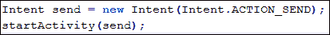

在`startActivity()`方法中传递`SEND`意图将允许用户通过提供所有可能的共享应用程序的对话框，选择他喜欢的发送方式。但是，如果我们没有设置意图类型就在`startActivity()`方法中传递`SEND`意图，它将抛出一个运行时异常。以下日志显示了运行时抛出的一些异常行：

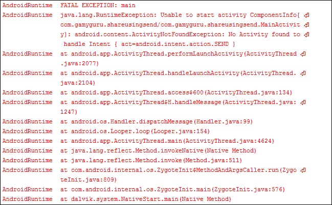

在日志中，你可以看到`"Unable to start activity"`，然后抛出了`android.content.ActivityNotFoundException`。当调用`startActivity(intent)`方法或其变体失败时，因为找不到执行给定意图的活动，就会抛出此异常。不仅异常类型，而且日志还显示了活动失败的原因。它说`"No activity is found to handle the intent"`。你可能想知道为什么 Android 找不到适合接收意图的活动。回想一下前面的章节中的隐式意图，Android 会查找所有可能与意图类型匹配的活动，并在对话框中显示所有这些应用程序。在我们的例子中，除了它的`Intent.ACTION_SEND`动作外，我们没有为意图定义任何类型；这就是为什么我们会得到`ActivityNotFoundException`的运行时异常。让我们设置动作的类型，看看显示所有可能接收意图的应用程序的对话框：

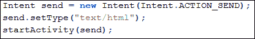

我们可以看到调用了`setType()`方法，并传递了一个`text/html`类型的字符串。这个方法设置了意图的显式 MIME 数据类型。这通常用于创建只指定类型而不指定数据的意图。这是 Android 系统中常用的隐式意图。此方法会清除之前设置的任何意图数据。

### 注意

Android 框架中的 MIME 类型匹配是区分大小写的。因此，你应始终使用小写字母书写你的 MIME 类型。你也可以使用`normalizeMimeType(String)`方法确保它被转换为小写。

我们在方法参数中传递了`text/html`作为 MIME 类型。这个类型告诉 Android 系统，所有支持 HTML 类型数据处理的应用程序都可以接收这个意图。因此，结果就是 Android 会将所有这些应用程序推送到对话框中，让用户选择他/她喜欢的应用程序。以下图片展示了`text/html`类型的对话框：

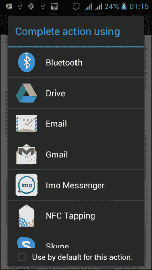

你可以看到所有支持 HTML 类型内容的程序都显示在图片中，比如**电子邮件**、**Imo Messenger**和**Skype**。你可以看到在 Android 手机上使用`SEND`意图分享内容是多么容易，选择应用程序并启动它们的工作留给了 Android。

### 注意

你可能已经注意到对话框中没有显示短信/彩信发送应用程序，因为短信/彩信只是纯文本应用程序，它们只支持那种类型的内容。

从列表中选择任何选项后，应用将会启动。由于我们没有设置任何要分享的内容，应用程序将基本上是空的。要在意图中设置内容，我们必须使用额外的信息（extras）。我们会为一些信息如标题、主题或文本添加额外的信息。以下代码片段展示了如何在`SEND`意图中添加一些额外的信息：

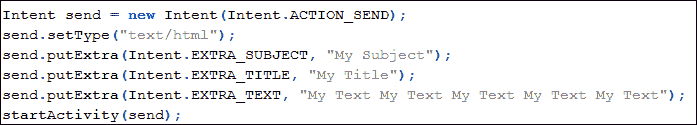

你可以在代码中看到，在设置意图的 MIME 类型之后，我们多次调用了`putExtra()`方法。这个方法向意图中添加扩展数据。该函数有两个参数：`name`和`value`。`name`参数必须包含一个包前缀；例如，应用`com.android.contacts`会使用像`com.android.contacts.ShowAll`这样的名称。我们为意图的主题、标题和文本内容传递了三个字符串。这类数据的名称，如`Intent.EXTRA_SUBJECT`、`Intent.EXTRA_TITLE`和`Intent.EXTRA_TEXT`在`Intent`类中已经声明，我们可以以静态方式访问它们。你可能会想，既然我们已经传递了标题字符串，为什么还要传递主题呢？嗯，`SEND`意图是一个隐式意图，Android 显示了所有支持该意图的应用。用户可以选择任何应用，因为不同的应用对不同的数据感兴趣。例如，任何电子邮件应用都会对主题、收件人和正文字符串感兴趣。而任何短信应用只会对收件人和正文字符串感兴趣。因此，为了有效地使用`SEND`意图，你应该添加所有可能的内容，以便有效地与每个应用共享。以下是一个使用`SEND`意图发送电子邮件的示例。以下代码段展示了我们如何使用`SEND`意图来发送电子邮件：

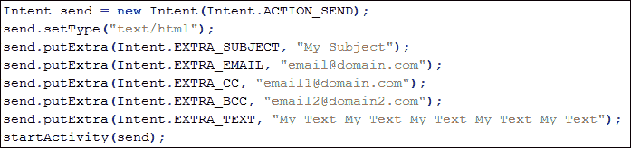

首先，我们通过传递`Intent.ACTION_SEND`参数给构造函数来声明我们的`SEND`意图。然后，我们通过调用`setType()`方法将意图的类型设置为`"text/html"` MIME 类型。接下来，我们为电子邮件应用添加额外的内容，如下列表所示：

+   `Intent.EXTRA_SUBJECT`：此名称常量用于添加主题。

+   `Intent.EXTRA_EMAIL`：此名称常量用于填充收件人字段中的电子邮件地址。

+   `Intent.EXTRA_CC`：此名称常量用于填充 Cc 字段的电子邮件地址。

+   `Intent.EXTRA_BCC`：此常量用于填充 Bcc 字段的电子邮件地址。

在调用`startActivity()`方法之前，我们通过`Intent.EXTRA_TEXT`这个名称常量来设置电子邮件的正文，并在`putExtra()`方法的值参数中传递我们的文本。`startActivity()`方法将显示与之前图像相同的对话框，并在选择电子邮件应用后，显示以下截图：

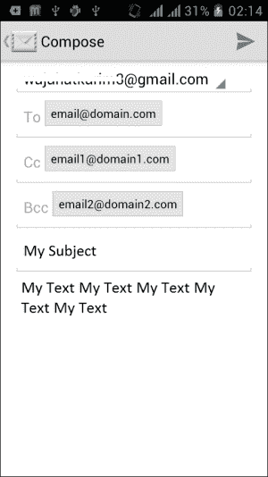

一个已经使用意图中的内容填充的电子邮件应用

从图片中可以看出，我们放入 extras 的所有数据都已自动填充到电子邮件应用中，如主题、电子邮件、文本等。现在，用户只需轻触**发送**按钮，电子邮件就会被发送。在这个示例应用中，我们直接通过 To 字段向一个地址发送了电子邮件，并通过 Cc 和 Bcc 间接向另外两个地址发送。安卓允许我们添加多个电子邮件地址。为此，使用了名称常量`Intent.EXTRA_EMAIL`。我们在代码中传递了一个地址；我们还可以传递包含电子邮件地址的字符串数组，以发送电子邮件。

从本节内容中，我们主要了解到`ACTION_SEND`意图是如何被使用的，以及仅用几行代码就能通过此意图完成多少工作。如果我们从对话框中选择 Facebook、Twitter 或任何其他应用，我们会看到通过该应用分享数据的相同结果。这就是使用隐式意图的强大之处，几乎在每种可能的情况下都能使其通用，而无需进行任何复杂开发工作。

### 注意

`ACTION_SEND`是意图的一个动作。像这个动作一样，还有其他动作，如`ACTION_VIEW`、`ACTION_SEARCH`，可以通过传递意图用于安卓中的其他目的。

# 使用意图进行电话通讯和拨打电话

不仅安卓手机，从发明之日起，所有电话的主要目的都是提供一种远距离交流的方式。与其他所有电话一样，安卓手机也提供了拨打电话和接收电话、检查通话记录（如未接电话和已拨号码）、存储联系人、编辑/修改/删除联系人等功能。由于安卓手机属于智能手机范畴，其通话功能更为丰富。用户可以进行视频通话、录音通话、电话会议、手机与电脑之间的通话等。所有这些功能为用户提供了非常有效的产品，并让开发者能够利用这些功能实现更大的灵活性和生产力。

安卓为开发者提供了许多电话功能的 API。这些电话 API 让你的应用程序和开发者能够访问底层的电话硬件，从而可以创建自定义拨号器，集成呼叫处理或电话状态监控等功能。

### 注意

由于安全原因，开发者无法自定义手机的通话界面。当用户拨打电话或接听来电时，会显示通话界面。

由于本书专注于意图，我们只讨论那些可以使用意图利用的电话功能。在许多功能中，如拨打电话、接收电话、检查通话记录、接听/拒绝电话等，只有少数可以直接且仅通过意图利用。幸运的是，拨打电话就是其中之一。让我们在下一节讨论如何使用意图拨打电话。

## 使用意图拨打电话

在 Android 中拨打电话有两种方法。开发者可以使用 Android 提供的 API 来拨打电话，或者仅通过发送包含必要信息（如电话号码）的意图来启动电话拨打。我们将在本节的后面探讨启动电话拨打的方法。

在前面的章节中，我们了解了如何使用意图中的动作来告诉 Android 系统我们的意图。我们将通过告诉 Android 我们的意图来拨打电话，其余工作留给系统完成。以下代码段允许应用程序启动已预拨指定号码的拨号器，用户可以通过按下其中的拨号按钮明确地拨打电话：

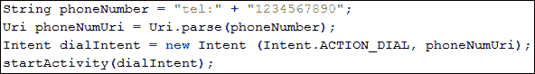

你可以看到我们在代码中做了非常少的改动。我们声明了一个`phoneNumber`字符串，用于存储我们想要拨打的号码。你可能会想知道为什么我们在字符串中拼接了一个`tel:`前缀。这个前缀用于获取号码的**通用资源标识符**（**URI**）。我们通过调用`Uri`类的静态方法`Uri.parse()`来获取这个 URI。这个方法返回 URI，我们反过来将其传递给构造函数的另一个参数。我们通过在意图声明中传递`Intent.ACTION_DIAL`来提供`DIAL`动作，最后，我们像往常一样调用`startActivity(intent)`方法来执行意图，并告诉 Android 系统处理我们的意图。以下屏幕截图显示了之前提到的代码段的拨号器结果：

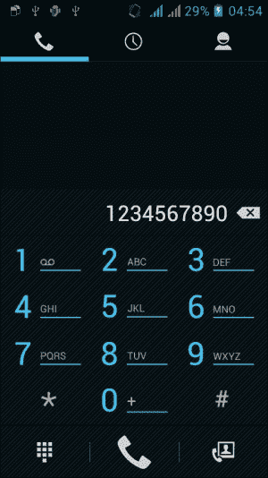

通过启动 DIAL 意图来显示一个已拨号码的拨号屏幕

当我们运行之前的代码时，应用程序将启动 Android 手机的默认拨号器，并在其中拨打代码中提供的号码。它不会打电话；它只会拨号，因为我们使用了`Intent.ACTION_DIAL`。用户可以明确地按下拨号器的拨号按钮并进行通话。

如果用户不想拨号，也可以直接调用号码而不先进入拨号界面。Android 为此提供了`Intent.ACTION_CALL`动作。以下代码段展示了如何直接拨打电话：

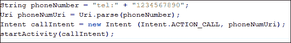

你可以从代码中看出，除了在意图构造函数中传递的动作外，其他都一样。在最后一个示例中，我们传递了`Intent.ACTION_DIAL`，而在这个例子中，我们传递了`Intent.ACTION_CALL`来直接拨打电话。当我们运行这段代码时，应用程序将在 Android 手机上开始拨打电话。以下屏幕截图显示了通话：


通过启动`CALL`意图来显示一个通话中的屏幕

这个`ACTION_CALL`直接拨打电话的操作需要用户向应用程序授予权限。以下代码片段展示了需要放在`AndroidManifest`文件中的权限，以使应用程序能够完美运行：


需要注意的是，`ACTION_CALL`不能使用意图拨打紧急电话；然而，使用`ACTION_DIAL`可以拨号紧急号码。如果用户在手机上安装了多个拨号器，`ACTION_DIAL`操作将显示拨号器列表，用户可以选择一个喜欢的拨号器。以下截图展示了多个拨号器的场景：

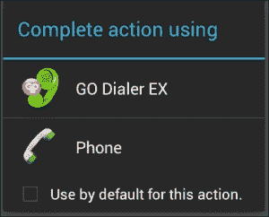

从对话框中选择多个拨号器

`ACTION_DIAL`和`ACTION_CALL`意图之间几乎没有区别。`ACTION_DIAL`意图只是拨号，用户可以通过按下拨号按钮明确地拨打电话，但`ACTION_CALL`会直接拨打电话，而不会向用户显示拨号器。

### 注意

应用程序直接拨打电话可能会受到限制。因此，除非需要`ACTION_CALL`，否则在应用中使用`ACTION_DIAL`是一个好习惯。

这就是我们如何通过意图轻松拨打电话并使用 Android 的通话功能。在下一节中，我们将了解如何使用意图发送短信、彩信和数据消息。除了发送，我们还可以确认消息送达以及接收消息。接下来的一节，我们将详细讨论这些内容。

# 使用意图发送短信/彩信

除了拨打电话的功能外，手机还支持短信服务，如短消息服务（SMS）、多媒体消息服务（MMS）以及最近的数据消息。SMS/MMS 功能在手机中应用最广泛，许多人更喜欢使用它而不是拨打电话。Android 提供了 API 和框架，让开发人员能够从他们的应用程序中发送和接收消息。开发人员甚至可以替换原生的短信应用程序来发送和接收文本消息。

### 注意

在撰写本书时，还没有用于从应用程序内部发送彩信的 API 或库，但您可以使用`ACTION_SEND`或`ACTION_SENDTO`意图来发送。

本节将引导您了解各种操作，如使用意图发送短信、发送彩信、发送数据消息、确认消息送达以及接收短信。然后，我们将简要介绍所有这些操作在不使用意图的情况下是如何执行的，以及 Android 的 API 对我们有何帮助。接下来的一小节，我们将看看使用意图发送短信的任务。

## 使用意图发送短信

使用意图的最大优点是它将我们的需求责任传递给了 Android 系统，而不是我们从核心创建完整的功能。如果我们在我们当前的情况下使用意图，即给某人发送短信，我们只需提供要发送消息的号码和要发送的消息。其余的工作由 Android 自身完成。

关于使用意图发送或分享内容的话题，我们已经进行了很多讨论，幸运的是，这里没有什么是我们需要吸收的新知识。这是我们之前使用的创建`ACTION_SEND`意图并调用`startActivity(intent)`方法执行的老方法。以下代码片段展示了我们之前使用的`ACTION_SEND`意图示例：

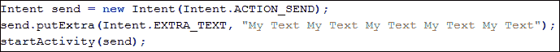

现在，如果我们使用这段代码，它对我们来说并不实用，因为它没有执行我们发送短信的动作。它既没有在选择器对话框中显示支持短信的应用，也没有使用`EXTRA_TEXT`额外参数传递的数据发送任何短信。为了使用`ACTION_SEND`发送短信，我们需要注意一些额外的事项。使用意图发送短信有两种方法：通过`ACTION_SEND`意图和通过`ACTION_SENDTO`意图。让我们看看如何使用`ACTION_SEND`意图发送短信。

我们需要使用`ACTION_SEND`动作创建意图，并在其中嵌入消息的额外参数`"sms_body"`。Android 会自行向用户询问接收者的电话号码。但由于我们还未指定意图的类型，所以在选择器列表对话框中仍然不会显示任何短信支持应用。由于短信是短文本消息，我们应该将意图类型设置为`"text/html"`，但由于大多数短信应用对彩信（MMS）没有原生支持，它们会寻找`"image/jpg"`或`"image/png"`作为意图类型。因此，将意图类型设置为`"image/png"`后，我们将得到以下代码片段：

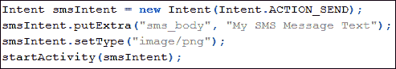

当我们执行这段代码时，我们会看到包括短信支持应用、电子邮件应用等在内的各种应用的选择器对话框。当我们选择任何短信应用时，我们会看到类似于以下图片的内容：

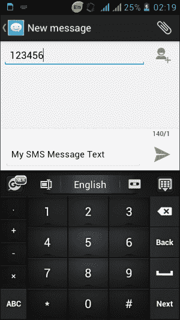

发送短信意图后显示默认短信应用

您可能已经注意到，短信应用中的文本部分已经用我们在`"sms_body"`额外参数中添加的内容填充，用户正在输入消息的接收者数量。

### 注意

前面的图片展示了 QMobile Noir A10 智能手机的默认短信应用。您的设备将显示您设置为手机默认的短信应用，当然，它不会和这个应用相同。

这样我们就可以使用意图发送短信了。现在，让我们考虑另一个情况，我们希望通过编程设置收件人的数量。为此，我们必须使用`ACTION_SENDTO`意图而不是`ACTION_SEND`意图。以下代码段展示了`ACTION_SENDTO`意图的使用：

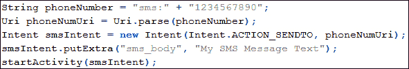

在前面的代码中，你可以看到我们在之前发送 SMS 消息的代码中做了一些更改。我们将动作设置为`ACTION_SENDTO`，而不是`ACTION_SEND`。同时，在意图的构造函数中传递了另一个电话号码 URI 的参数。我们为电话号码创建了一个字符串，并在号码前拼接了`"sms:"`标签。这个标签让`Uri`类明白该字符串代表要发送消息的电话号码，并相应地解析它。你可能还记得，在上一节中，我们使用`"tel"`标签通过意图拨打任何号码。当你执行代码时，它会要求应用程序选择短信应用。选择任何支持 SMS 的应用程序后，它会直接将短信发送到提供的电话号码，而不是像上一个示例中那样询问电话号码。你可能已经注意到，在这段代码中我们没有设置意图的类型。这是因为当我们使用`ACTION_SENDTO`意图时，我们不需要明确设置意图的类型。Android 会从如`"sms"`或`"tel"`的标签以及如`ACTION_SENDTO`或`ACTION_CALL`的动作中理解开发者试图做什么。

### 注意事项

如果你想要使用`ACTION_SEND`并明确使用代码设置收件人号码，Android 提供了`"address"`额外项，无需使用任何如`"tel"`或`"sms"`的标签，就可以在其中放入号码字符串。

到目前为止，我们讨论了使用`ACTION_SEND`和`ACTION_SENDTO`发送 SMS 文本消息。在下一节中，我们将看到如何使用意图发送包含嵌入图片的多媒体消息。

## 使用意图发送 MMS

文本消息与多媒体消息唯一的区别在于嵌入的富媒体内容。MMS 消息包含照片、视频和贺卡等富媒体内容，以及一些作为内容消息的文本。目前，Android 没有提供让开发者原生发送 MMS 的库，与 SMS 不同。但幸运的是，意图为我们提供了一种明确的方式来发送 MMS。正如真正的区别所定义的，我们需要在文本消息意图中添加一些媒体，并将其类型设置为多媒体，如`"image/png"`，然后我们就完成了 MMS 消息的发送。以下代码段展示了如何使用用于 SMS 消息的意图发送任何 MMS 消息：

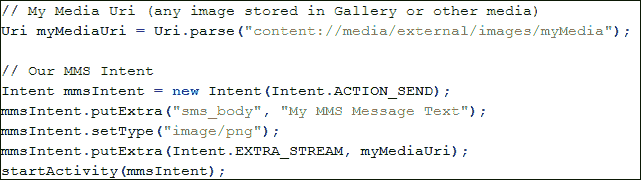

你可以看到代码有两部分。在第一部分，我们获取了存储在外部存储的`images`文件夹中所需图像的 URI。在第二部分，我们使用`ACTION_SEND`创建意图。然后，我们使用`"sms_body"`额外项添加我们的文本，并将类型设置为`"image/png"`，使其对多媒体消息有意义。之后，我们使用`Intent.EXTRA_STREAM`额外项附加我们的媒体，并在其中传递我们的图像 URI 作为值。最后，我们通过调用`startActivity(intent)`方法执行意图。唯一的区别是使用`EXTRA_STREAM`额外项附加媒体 URI，其余与短信中的操作相同。你也应该注意，我们可以使用`ACTION_SENDTO`指定收件人号码，或者我们也可以使用电话号码作为值的`"address"`额外项。

### 注意

在上一个示例中，我们已经设置了`"image/png"`的类型。这只能发送 PNG 图像。对于其他图像格式，我们可以指定`"images/*"`。

到目前为止，我们只讨论了发送短信和彩信。但我们确定这些消息已经成功送达了吗？好吧，下一节是关于确认消息送达和了解意图在其中扮演的角色。让我们在下一节中看看如何使用意图来确认消息的送达。

## 使用意图确认消息送达

当我们使用意图发送短信时，无论是短信还是彩信，我们都无法追踪这些消息以执行操作，例如确认送达。背后的原因是隐式地使用意图，并依赖于安卓系统的默认操作。如果我们使用意图发送消息，这意味着我们将发送消息的责任交给了安卓系统。现在，如果我们想要确认消息的送达状态，这意味着我们正在向安卓系统询问我们的消息。不幸的是，要实现这一点，我们缺少两样东西：一是告诉安卓系统我们确认了某条消息，二是安卓系统可能不记得我们谈论的是哪条消息。

为了能够确认送达，我们必须手动使用原生 API 发送消息。这个 API 的任务是跟踪我们正在谈论的消息的送达状态和消息本身。此外，使用这个 API，我们可以轻松发送查询，询问安卓系统关于送达确认的信息。

现在，如果我们使用原生 API 发送消息，我们必须考虑彩信。如前所述，对彩信的原生支持仍然不存在；因此，我们将无法追踪和确认彩信的送达，但我们可以确认短信的送达状态。在本节中，我们将讨论如何使用原生短信 API 检查短信送达状态，以及如何使用意图来实现我们的目标。

意图在 Android 中是一种异步的通信方式，并且被广泛使用。唯一的变化是，它们被用来实现我们的目标和完成需求。关于确认消息送达状态的简短解释，我们将使用名为`SmsManager`的原生短信 API，通过`SmsManager.sendTextMessage()`方法发送文本消息。为了跟踪消息，我们将使用两个意图：一个用于发送动作，另一个用于送达动作。除了这两个意图，我们还将创建两个挂起的意图：一个用于发送动作，另一个用于送达动作。最后，为了执行所有四个意图，我们将创建两个广播接收器：一个检查发送动作，另一个检查送达动作。这里看起来可能相当复杂，但实际上非常简单。让我们看看声明我们四个意图的代码片段：两个意图和两个挂起意图：

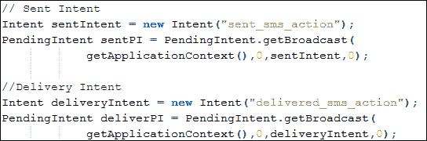

你可以看到，我们在代码中以常规方式声明了我们的意图。这里的唯一区别是，我们使用了代表字符串的自定义动作，如`"sent_sms_action"`或`"delivered_sms_action"`。然后，我们使用`PendingIntent`类的`getBroadcast()`工厂方法创建了两个挂起意图。`getBroadcast()`方法将检索到将执行任何广播的`PendingIntent`，例如调用`Context.sendBroadcast()`方法。

因此，在创建完所有四个意图之后，我们现在需要创建并注册广播接收器，这些接收器将执行挂起的意图。以下代码片段展示了两个接收器的实现：

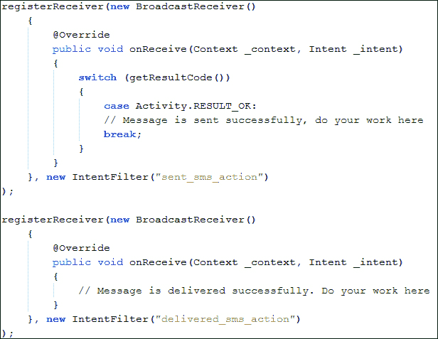

如前一段代码所示，我们使用`Activity.registerReceiver()`方法注册了两个广播接收器，并传递了匿名对象。重写的方法`onReceive()`实现了我们的目的。当一个消息被发送时，会调用一个`onReceive()`方法；当一个消息被送达时，会调用另一个`onReceive()`方法。我们在代码中加入了注释，以展示你可以在哪里使用自定义功能。你可能想知道 Android 如何知道这些是用于发送和送达状态的广播接收器。通过检查意图过滤器，Android 会知道这一点。你可以看到，我们在意图过滤器的构造函数中传递了我们在意图中使用的自定义动作，这些过滤器将过滤广播，接收器只接收它注册的广播。到目前为止，我们已经为确认消息送达做了核心工作。现在剩下的就是去执行它，这时`SmsManager` API 就派上用场了。我们将创建一个`SmsManager`的实例，并调用其`sendTextMessage()`方法来发送消息，并放入所有意图，然后我们就完成了。以下代码片段展示了`SmsManager`的使用代码：

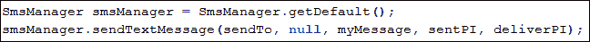

请记住，`SmsManager` API 使用了`android.permission.SEND_SMS`权限；因此，不要忘记在您的清单文件中添加它，如下面的代码片段所示：


这样，我们就能确认消息的送达。我们只能确认文本消息的送达状态，并且需要用户授予`SEND_SMS`权限。但是，如果我们使用意图，我们只能发送消息，并且不需要用户任何权限。

### 注意

安卓模拟器支持发送和接收短信。这可以通过创建多个模拟器实例并向模拟器的端口号发送短信来实现。

总结意图在确认消息送达中的作用，意图在这里并不是执行确认消息送达的核心动作。它们只是提供了一种通信方式，携带必要的信息，比如哪条消息的送达需要被检查等。然后，这些意图被广播接收器使用，它们不断检查消息的送达和发送状态。一旦完成，它们将状态传递到我们的意图中，然后这些意图为我们提供消息是否已发送或送达的更新。

在下一节中，我们将做几乎相同的事情和编码，但这次，我们将这样做是为了接收消息。使用所有这些代码片段后，我们可以开发出能发送和接收消息的短信应用。让我们看看如何接收消息以及意图在背后的作用。

## 使用意图接收短信

迄今为止，我们讨论了发送短信/MMS 消息以及在应用程序中意图的重要性。在本节中，我们将讨论如何监听传入的消息，以便我们能在应用程序中使用它们。利用这个功能，我们可以开发消息传递应用。意图可以使用`ACTION_SEND`或`ACTION_SENDTO`意图直接发送消息，但这些意图并不直接参与监听传入消息和接收消息。意图与`Broadcast Receiver`的使用方式相同，用于获取发送者号码、消息内容、消息时间等信息。在讨论如何监听传入消息之前，我们必须了解一些在以下应用程序中使用的类。

### SmsManager 类

在前面的子节中，我们已经使用了`SmsManager`类来确认消息的送达。这个类用于管理如发送数据、短信和 PDU 消息等 SMS 操作。我们不能通过构造函数实例化这个对象；我们可以通过调用`SmsManager.getDefault()`静态方法来获取它的实例。我们可以使用这个类来发送消息。

### 注意

有两个不同类名为`SmsManager`：`android.telephony.SmsManager`和`android.telephony.gsm.SmsManager`。在 GSM 包中的后者在 API 级别 4 及以后版本中已被弃用。

### SmsMessage 对象

这个类代表了一个简单的短信消息对象。在接收到来电消息时，我们将得到一个`SmsMessage`对象的数组。这个类用于获取诸如消息正文、消息时间、发送者号码等信息。

### 协议数据单元（PDU）

PDU 是短信消息的行业格式。开发者无需担心详细阅读 PDU 或理解其格式，因为 Android 的`SmsManager`类会读取和写入 PDU，并为开发者提供使用 PDU 的方法。

这些类和概念将在接收来电消息的应用中使用。现在，让我们讨论一下在 Android 中是如何接收消息的。当任何设备接收到新的短信消息时，会触发一个新的广播意图。这个意图的动作是`android.provider.telephony.SMS_RECEIVED`。我们必须创建一个自定义的广播接收器，它将寻找这个广播意图。每当我们收到任何消息时，广播接收器的`onReceive()`方法将被调用。以下代码段展示了我们为来电消息实现的自定义广播接收器：

```kt
public class IncomingMsgReceiver extends BroadcastReceiver {
  private static final String SMS_RECEIVED = "android.provider.
    Telephony.SMS_RECEIVED";
  public void onReceive(Context _context, Intent _intent) {
    if (_intent.getAction().equals(SMS_RECEIVED)) {
      // SMS Received. Write your code here.
      Bundle msgBundle = _intent.getExtras();
      getMessageData(msgBundle);
    }
  }
}
```

与往常一样，我们的类从`BroadcastReceiver`扩展而来，并覆盖了`onReceive()`方法。当设备接收到任何来电消息时，会调用这个方法。我们首先检查这个意图是否包含任何收到的消息。如果意图动作与我们的`SMS_RECEIVED`字符串字面量相同，这意味着我们已经收到了消息。

### 注意

在 Android 中，收到的短信动作`android.provider.Telephony.SMS_RECEIVED`是不被支持的，并且在未来的平台版本中可能会发生变化。开发者在使用这些 Android 中不被支持的隐藏方法和属性时应谨慎。

在检查并确认动作后，我们必须从意图中获取消息数据并执行应用程序的自定义操作。我们首先通过调用`getExtras()`方法从意图中获取 extras bundle，然后我们将这个 bundle 传递给我们的`getMessageData()`方法。这是我们自定义的方法，在这个方法中，我们将了解如何从 bundle 中获取消息数据。以下代码实现展示了方法的定义：

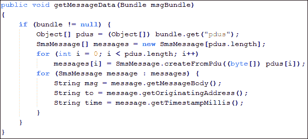

我们首先检查我们的 bundle 不是一个 null 对象。然后我们通过调用`get()`方法并传递`"pdus"`键从 bundle 中提取 PDUs。

### 注意

如果你不清楚在`get()`方法中应该传递哪个键，你可以调用`Set<String> Bundle.keySet()`方法来获取 bundle 中使用的所有键。

回顾 PDU，PDU 是短信的行业格式。一旦我们有了数组中的所有 PDU 对象，我们就可以使用`SmsMessage.createFromPdu()`方法从这些 PDU 创建短信。创建所有消息后，我们遍历数组，并使用`SmsMessage.getMessageBody()`、`SmsMessage.getOriginatingAddress()`和`SmsMessage.getTimestampMillis()`方法从其中获取消息数据，如消息正文文本、消息发送者号码和消息时间。现在，我们可以将这些数据字符串用于我们的应用程序。需要注意的是，任何长消息都会被分解成许多小消息，这就是为什么我们得到对象数组的原因。

除非我们在应用程序中注册此广播，否则它不会工作。要在我们的应用程序中注册它，我们必须在主活动中编写以下代码：

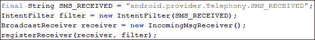

这里没有新的讨论内容。我们正在创建一个带有`SMS_RECEIVED`动作和广播接收器实例的意图过滤器。然后，我们将它们都传递给活动的`registerReceiver()`方法。消息接收器需要`android.permission.RECEIVE_SMS`权限；因此，不要忘记在您的清单文件中添加这一行：

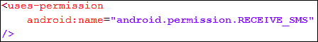

这样，我们就可以在应用程序中接收来电消息，并以多种不同的方式使用它们。您可能想知道意图在这个应用程序中的作用。如前所述，这个应用程序中没有直接使用意图。当设备收到任何消息时，会触发一个广播意图。我们使用该意图从中提取数据和消息，这些消息在我们的应用程序中使用。在 Android 设备接收到消息后，意图的作用就是提供关于消息的数据。

我们可以使用 Android 调试工具中的**Dalvik 调试监控服务器**（**DDMS**）面板，在 Android 模拟器上模拟来电消息。以下是 DDMS 视图中用于模拟消息的**模拟器控制**面板的屏幕截图：

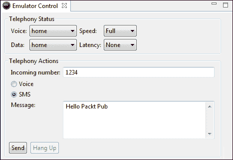

在 DDMS 视图中用于模拟消息的模拟器控制面板

在本节中，我们了解了发送短信、彩信、确认消息送达以及接收来电消息。我们还讨论了在这些应用中使用意图的重要性和方法。在下一节中，我们将学习关于通知的知识，以及如何在制作交互式通知时使用意图。

# 使用意图的通知

从传统手机到智能手机，每款手机都使用某种方式来通知和提醒用户某些事件，如接收短信或电话。与这些手机一样，Android 手机使用通知系统来提醒用户。通知是显示在应用程序正常 UI 之外的消息。当触发任何新的通知时，它会在通知区域显示。用户可以通过向下拉动手势来随时从通知抽屉和通知区域查看通知。以下屏幕截图展示了 Android 中两种不同通知的示例：


Android 手机中的通知

通知就像是在用户忙于其他移动活动（如玩游戏）时，发生重要事件时提醒用户的渠道。

对于任何开发者来说，通知是开发者显示在应用正常用户界面（UI）之外的一个用户界面元素，用以指示并告知用户某个事件已经发生。然后，用户可以在使用其他应用时选择查看通知，并在他们希望的时候进行响应。使用通知是让不可见的应用组件（如广播接收器和服务）告知用户任何事件发生的首选方式。

在本节中，我们将讨论通知、它们的布局、在通知布局中显示附加信息以及启动意图。我们将了解意图的作用，并创建一个具有自定义通知布局的示例应用程序，以及意图在这类应用程序中的重要性。在我们开始开发示例应用程序之前，让我们讨论通知中使用的某些基本概念。

## 通知形式

通知可以采取不同的形式，例如状态栏中的任何持久图标，可以通过启动器访问。当用户选择此通知时，当发生某些活动或服务时，会触发任何指定的意图。通知还可以用来打开设备的闪烁 LED 灯。此外，设备在接收到通知时也可以振动或播放铃声。

## NotificationManager 类

`NotificationManager`类代表了一个用于处理 Android 中通知系统的系统服务。我们不能实例化这个类，但可以通过调用`getSystemService()`方法并传递`Context.NOTIFICATION_SERVICE`来获取它的实例对象。以下代码段展示了如何获取`NotificationManager`类的实例：

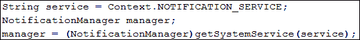

## Notification 类

`Notification`类代表了 Android 中的任何通知。它提供了 API，允许开发者设置通知的图标、标题、时间等。以下代码段展示了如何在 Android 中创建一个通知：

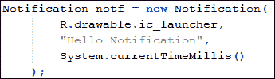

## 通知布局

每个通知都有一个图标和滚动文本，有时称为状态文本。当启动通知且通知抽屉关闭时，会显示图标。当触发通知时，滚动文本会在状态栏中滚动，当打开通知抽屉时，它会被设置为通知信息文本。下面的截图概述了通知区域的不同方面：

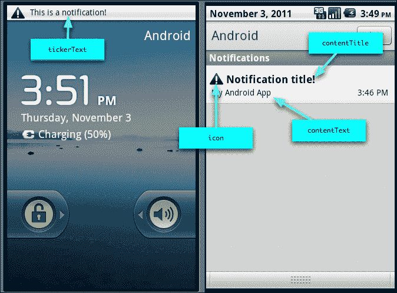

通知和通知区域

你可以从前面的截图中看到，当触发任何通知时，其滚动文本会在状态栏中滚动。滚动完整个文本后，其图标将显示在状态栏上。当用户通过下拉打开通知抽屉时，将显示通知的大图标以及通知标题、内容文本和时间戳。这就是在 Android 中触发任何通知的方式。

现在，我们将讨论通知是如何触发的以及通知应用中意图的使用方法。我们将创建一个通知，如下面的截图所示：


一个简单的通知

因此，在创建通知之前，我们需要通知的布局。以下代码实现展示了我们通知的布局：

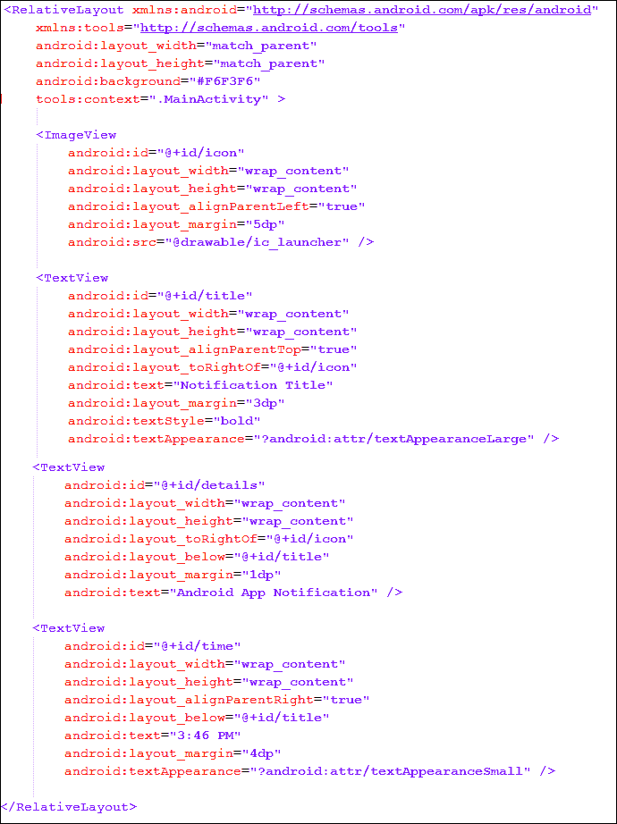

我们在`RelativeLayout`中放置了四个视图：一个用于图标的`ImageView`，一个用于标题的大型`TextView`，以及两个分别用于描述和时间戳的小型`TextViews`。我们使用了`RelativeLayouts`的对其方式，将视图放置在其他视图的下方、上方、右侧和左侧，以便在不同分辨率智能手机上以相同方式显示。我们将此文件保存为资源目录中 layout 文件夹的`notification_layout.xml`。这就是我们的通知布局。现在，让我们学习如何创建使用此布局的任何通知。

要创建具有自定义布局的通知，我们在 Android 中有两种不同的方法。第一种方法是使用`setLatestEventInfo`方法更新标准扩展状态通知显示中显示的详细信息。这是最简单的方法，在更多应用中使用。另一种方法是设置通知的`contentView`和`contentIntent`属性，以使用`RemoteView`类为扩展状态显示分配自定义 UI 布局。

### 注意

`RemoteView`是一种机制，允许开发者在任何独立应用程序中嵌入和控制布局。这通常用于创建主屏幕小部件。

在本节中，我们将使用一个复杂的方法来创建通知，因为此方法在代码中使用了意图。我们首先创建一个`RemoteView`对象，并将其分配给通知对象的`contentView`属性。`contentView`视图表示在展开状态栏中的通知。通知通常表示对操作的请求，当用户点击通知抽屉区域或展开状态栏中的通知时，执行此操作。我们可以指定当用户点击通知项时将被触发的`PendingIntent`。通常，此意图会打开我们的应用程序，并提供有关我们通知的更多信息。除了设置`contentView`之外，我们还需要将`contentIntent`设置为我们创建的`PendingIntent`对象，其中自定义内容视图被分配给我们的通知。`contentIntent`意图是在点击展开状态条目时必须执行的目的地。如果这是活动的意图，我们必须包括`FLAG_ACTIVITY_NEW_TASK`，这将使我们的活动在新任务中启动。

### 注意

当你手动设置`contentView`属性时，还必须设置`contentIntent`属性；否则，在触发通知时将抛出异常，导致应用程序的任何运行时崩溃。

一旦将`contentView`属性设置为我们的自定义远程视图，我们就不能以常规方式设置所需视图。我们必须使用`RemoteView`对象上的 set 方法，这些方法会修改在定义的布局中使用的每个视图。这就是任何具有自定义布局的通知的开发方式。以下代码展示了具有自定义布局通知的实现，这可以添加到任何活动中：

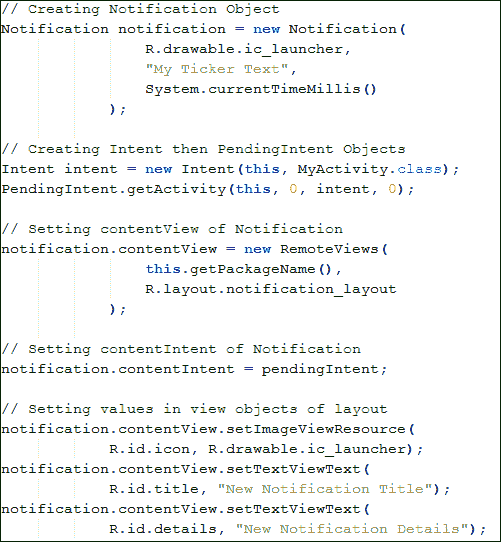

从代码中可以看出，我们首先创建了一个`Notification`对象，带有初始图标、ticker 文本和触发通知的时间。然后，我们创建意图对象，`Intent`和`PendingIntent`，用于指定当通知被点击时的动作。接着，我们设置了通知对象的`contentIntent`和`contentView`。我们为`contentView`创建了一个新的`RemoteView`对象，并在其中传递了我们的`notification_layout.xml`引用。这就是通知布局通过`RemoteView`构造函数设置为我们的自定义布局的方式。然后，我们将我们的待定意图设置为`contentIntent`。最后，我们使用 set 方法更新我们布局的值，如`setImageViewResource()`和`setTextViewText()`。到目前为止，我们已经使用自定义布局开发了自己的通知。现在，我们将了解如何触发通知。以下代码段展示了如何触发通知：

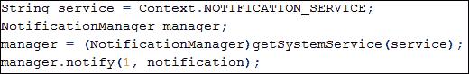

我们通过调用`getSystemService()`方法来获取`NotificationManager`类的实例。为了触发通知，我们调用了`NotificationManager.notify()`方法，该方法接收两个参数：第一个是通知的 ID，第二个是通知对象本身。以下屏幕截图显示了应用程序的输出：

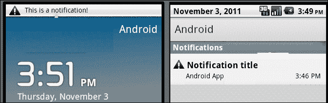

来自我们应用程序的通知触发

到目前为止，我们已经了解了如何创建通知并为它们的视图设置自定义布局。你可能正在思考意图在这个应用中的重要性及其用途。在这个应用中，意图仅用于一个目的，那就是当用户点击通知时，引导用户到我们所需的应用程序或活动。我们创建了一个`Intent`对象，并由此生成了一个`PendingIntent`对象，这个对象在通知中被用作`contentIntent`。

# 概要总结

在本章中，我们讨论了 Android 的特性。我们了解了常见的 Android 特性，如布局、显示、连接性、通信、可访问性、触摸和硬件支持，以及它们与 Android 移动组件的比较。然后，我们看到了`AndroidManifest`文件中两个最重要的标签`<uses-feature>`和`<uses-permission>`的用途及其如何使用。

我们还讨论了硬件和软件特性与 Android 移动组件之间的关系，以及它们与这些清单标签的联系。然后，我们了解了最常见的意图动作`ACTION_SEND`，它用于通过隐式意图的方法与其他应用程序分享或发送任何内容。接着，我们将意图的知识扩展到手机更具体的特性，包括拨打电话、发送短信/MMS、确认消息送达和接收消息。我们使用了意图以及 Android 的原生 API 来执行这些操作。然后，我们讨论了通知和警告，并学习了如何在通知中设置自定义布局。我们了解到了两种不同的方法，并在我们的示例应用程序中使用了一种方法。我们了解了这些类型的应用程序中意图的使用，也了解了它们与这些类的作用。

在下一章中，我们将讨论意图过滤器，并了解 Android 如何识别不同的意图并根据调用和应用程序对它们进行过滤。
