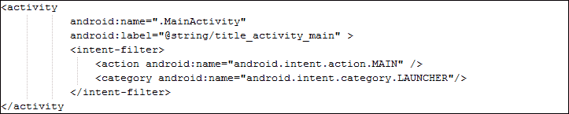
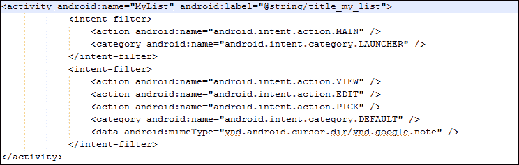
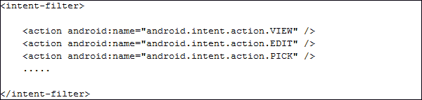
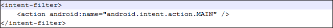
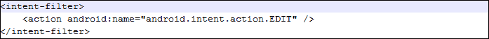
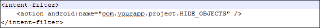
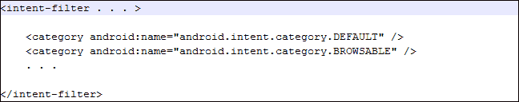
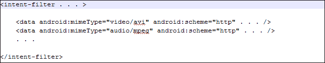
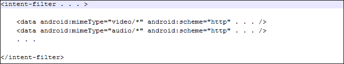
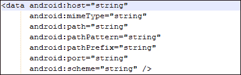

# 第七章：意图过滤器

意图过滤器是理解安卓意图微小但重要细节的高级步骤。在本章中，我们将了解意图过滤器的基础知识以及如何在安卓应用程序中有效使用它们。本章还处理意图在传递到期望组件之前应通过的各类测试。

### 注意

意图过滤器可以在`AndroidManifest.xml`文件中的`activity`标签下找到。

在本章中，我们将涵盖以下主题：

+   意图对象及其分类

+   理解意图过滤器是什么

+   理解意图测试是什么

+   为特定任务实现意图过滤器

# 意图对象及其分类（重复，不翻译）

意图对象附带大量信息。这个信息包将帮助组件从中提取知识。例如，应该对随意图对象传递的数据采取什么类型的操作；同样，还有关于安卓系统的信息。当系统不知道将处理即将到来的意图的组件时，需要关于安卓系统的信息。

为了更好地理解前一段提到的示例，考虑一个意图被传递以启动电影的场景。在这种情况下，操作系统必须知道执行此动作需要哪个软件。

下文将讨论安卓意图对象中包含的分类。

## 组件名称

意图对象包含将处理数据的相关组件名称信息。通常，此组件由完整的类名组成，例如`com.app.demoactivity.MyActivity`或`com.example.demoactivity.MainActivity`。对于意图对象来说，此组件信息是可选的。如果意图对象知道该组件，安卓会将数据处理指向那个特定的组件；如果不知道，安卓会确定哪个组件最适合处理此事件。

### 注意

组件名称中的包部分不一定与`AndroidManifest.xml`文件中的项目名称相同。

组件名称通过安卓 API 提供的`setComponent()`或`setClassName()`方法设置。

### 意图解析

安卓意图分为两部分（如第三章所述，*意图及其分类*），**隐式意图**和**显式意图**。对于显式意图，不为其分配组件名称并不会造成问题，因为必须将组件包含在意图对象中，然后安卓会自动将显式意图指向所描述的组件。

另一方面，在隐式意图中，如果没有向 Android 系统提供组件名称，它将自动将其指向所有可能处理此传入意图的应用程序。只有当意图具有意图过滤器时，此操作才会发生，否则 Android 不会引导它。这个术语称为 **Android 意图解析**；当你不需要为隐式意图定义组件时，它将自动显示所有可能接收此意图的应用程序列表。

## 动作

动作是一个描述在意图上要执行操作的字符串。例如，`ACTION_CALL`、`ACTION_BATTERY_LOW` 和 `ACTION_SCREEN_ON`。你可以在 [`developer.android.com/reference/android/content/Intent.html`](http://developer.android.com/reference/android/content/Intent.html) 找到其他各种动作的常量。你也可以创建自己的意图动作，但请确保在前面加上项目名称，例如 `com.example.myproject.SHOW_CONTACT`。当开发者想要创建一个之前未添加到 Android SDK 的事件时，需要自定义动作。当开发者想要触发/检查与该应用程序紧密相关且不在 Android SDK 中的动作时，也可能出现这个需求。

### 注意

`com.example.XXX` 是在 Java 和 Android 应用程序开发中不推荐使用的包名。这确保了使用这个包大多是因为理解了本例中的用途。

动作通常可以告诉你意图是如何构建的，尤其是数据和额外信息。它就像方法的现象，有参数并且返回值。最佳实践是始终尽可能具体地使用你的动作名称，并与意图紧密耦合。意图动作可以通过使用 Android API 的 `setAction()` 方法来设置，你可以通过 `getAction()` 方法获取它。

下表给出了一些预定义的意图动作常量：

| 常量 | 组件关系 | 动作 |
| --- | --- | --- |
| `ACTION_CALL` | 活动 | 初始化一个电话通话 |
| `ACTION_EDIT` | 活动 | 显示用户数据以进行编辑 |
| `ACTION_MAIN` | 活动 | 作为初始活动启动，无需数据输入，也没有返回输出 |
| `ACTION_SYNC` | 活动 | 在服务器上与移动设备上的数据同步 |
| `ACTION_BATTERY_LOW` | 广播接收器 | 电池电量低的警告 |
| `ACTION_HEADSET_PLUG` | 广播接收器 | 耳机插入设备 |
| `ACTION_SCREEN_ON` | 广播接收器 | 屏幕已开启 |

## 数据

在 Android 意图中，根据提供的数据类型，采取不同类型的动作。数据是 Android 意图的基本部分之一，尤其是在隐式类别中。让我们通过一些例子来更好地了解如何在 Android 意图中使用与其相关动作的数据。

### 在`ACTION_EDIT`中使用数据

考虑一个`ACTION_EDIT`的例子。每当我们在意图中调用这个动作时，很明显，编辑功能需要在某种文档中实现。这个文档路径应以 URI 的形式给出，然后由 Android 意图处理。这个 URI 实际上是我们要放入意图对象中的数据部分。

当开发者希望打开默认的 Android 的**添加新联系人**屏幕并期待用户进行编辑时，可以使用`ACTION_EDIT`。在这种情况下，用于打开**添加新联系人**屏幕的意图应该定义`ACTION_EDIT`动作。

### 在`ACTION_CALL`中使用数据

考虑另一个`ACTION_CALL`的例子。当我们需要通过意图执行呼叫功能时，使用此动作。因此，为了完成这项任务，我们需要通过使用`tel://` URI 引用来提供电话号码。这是需要与意图一起提供的数据集，以便 Android 知道需要执行拨号功能的数据。

### 在`ACTION_VIEW`中使用数据

接下来是我们的第三个例子，即`ACTION_VIEW`。在大多数情况下，当调用此动作时，会通过 URI 链接到一个网站。这帮助 Android 了解要在其上执行查看动作的数据。通常，`ACTION_VIEW`动作会附加一个`http://` URI，以便 Android 可以处理查看任何网页的功能。

## 类别

这是向意图提供的信息，以便了解执行该特定意图所需的最佳组件类型。例如，如果我们想使用`ACTION_VIEW`动作查看一个网页，我们可以将其类别指定为`CATEGORY_BROWSABLE`，以让 Android 知道与意图关联的数据是安全的，并且可以通过 Android 浏览器轻松执行。

在任何 Android 程序中都可以轻松使用的类别常量列表如下：

| 常量 | 说明 |
| --- | --- |
| `CATEGORY_BROWSABLE` | 活动可以在与意图关联的数据的 Android 浏览器上安全执行。 |
| `CATEGORY_GADGET` | 活动与任何 Android 设备托管的另一个活动相关联。 |
| `CATEGORY_HOME` | 活动显示主屏幕，或者当按下**主页**按钮时用户看到的第一个屏幕。 |
| `CATEGORY_LAUNCHER` | 特定活动的类别是启动器，这意味着它将成为堆栈顶部的活动。 |
| `CATEGORY_PREFERENCE` | 目的地活动来自偏好设置面板。 |

## 附加项

在前面的章节中，我们已经详细了解了 extras 功能以及如何与意图一起使用。与数据类似，一些 extras 与将要启动的意图绑定在一起。例如，`ACTION_HEADSET_PLUG`动作具有额外的"State"，用以指示耳机是否已连接到手机。

这些方法与 bundle 对象的方法类似。因此，可以使用`putExtras()`和`getExtras()`方法将 extras 安装和读取为 bundle。

# 意图过滤器

在此时刻，我们对 Android 意图及其实现有了完美的理解。Android 意图负责告诉 Android 已经发生了某个事件，它也用于提供额外数据，以执行某些特定动作。但是 Android 如何知道哪个组件可以促进任何意图的执行呢？为此，引入了意图过滤器的概念。意图过滤器用于识别哪些组件可以响应活动、服务或广播意图的特定调用。

通常，意图过滤器通过`AndroidManifest.xml`文件提供给活动或服务，该文件包含动作、数据和类别测试。对于广播接收器，意图过滤器也可以通过代码动态定义。

对于隐式意图，为了将其传递给特定组件，必须通过所有三个测试。基于这些情况，可能会出现两种条件：一种情况是意图没有通过任何一项测试，那么它将不会被传递给组件。另一种情况是，当它通过了所有测试，它将直接移交给相应的组件。在第一种情况下，有一个例外，如果没有通过测试，它可以被传递给同一活动的下一个意图过滤器。通过这种方式，它有可能按照预期执行。

### 提示

在`AndroidManifest.xml`文件中，我们可以在一个活动中拥有多个意图过滤器。

具有内部意图过滤器的活动的普通 XML 标签如下所示：



如代码所示，它由一个包含所有内容的 activity 标签组成。这个活动仅包含一个意图过滤器，其中包含两个主要组件：**动作**和**类别**。此意图执行时要采取的动作是 `android.intent.action.MAIN`，通过调用此动作，任何对活动的先前引用都会被移除，活动会以全新的启动执行。这样，类别被设置为 `android.intent.category.LAUNCHER`；这表明在 `AndroidManifest` 文件中编写的活动是启动器的 `activity` 标签。这意味着，一旦执行应用程序，它就是第一个要启动的活动。如果在 `AndroidManifest.xml` 文件中有两个或更多描述为启动器的活动，Android 操作系统将询问用户要从哪个活动开始。

### 注意

`<intent-filter>` 是 `AndroidManifest.xml` 文件的一部分，而不是 Java 代码，因为它包含的信息需要在项目应用程序启动之前获取。例如，在项目应用程序启动之前，需要确定它是否为启动器活动。由于 `AndroidManifest.xml` 文件在项目应用程序启动之前执行，以便提取有关项目的信息，意图过滤器是此文件的一部分。唯一的例外是在广播意图的情况下，其信息可以从 Java 代码动态修改，而不是从 `AndroidManifest.xml` 文件。

# 处理多个意图过滤器

并非强制要求任何 Android 活动只能有一个意图过滤器。一个活动可能包含多个意图过滤器，这些过滤器占据了诸如类别、数据和动作等多个子组件。请看下面的截图，展示了带有不同类型参数的两个意图过滤器：



前述截图中提到的代码解释将在本章后续内容中介绍。目前，了解活动内部各种意图过滤器的实现是重要的。

# 意图过滤器的测试组件

过滤器是意图对象中动作、数据和类别字段的代表。每当调用隐式意图时，都会针对这些过滤器进行测试，以便执行。如果该意图不满足任何一个测试组件，它将不会执行，或者更确切地说，它将被引导到同一活动的另一个意图过滤器（如果存在的话）。

现在，为了正确理解意图过滤器的意图，我们需要逐步评估与意图过滤器相关的每个测试组件。存在三个测试组件：

+   动作测试

+   数据测试

+   类别测试

## 动作测试

操作描述了即将由传入意图执行的操作类型。`AndroidManifest.xml`文件确定了传入意图需要满足的要求。如果任何意图无法匹配`AndroidManifest.xml`文件中指定的操作，它将不会被执行。

操作测试基本上是由项目清单文件中提供的信息来执行的一个测试。所有的操作组件都在`<intent-filter>`标签内定义，然后通过匹配来执行意图。在下面的截图中，你可以看到操作测试时`intent-filter`标签的样子：



在前一个截图中给出的代码中，`intent-filter`标签内列出了三个操作。这些操作测试将由 Android 操作系统确定，如果传入的意图能够执行这些操作。在前面的代码中列出了三个测试，你可以在*Action*部分给出的表格中看到它们的描述。需要遵循以下两个条件：

如果`intent-filter`标签内没有写入操作，Android 操作系统将拒绝处理意图，因为没有可匹配的内容。

如果`intent-filter`标签包含多个操作，但传入意图中没有列出任何操作，意图仍将毫无问题地继续执行。

### `<action>`的编写约定

在定义操作时，Android 遵循一些约定。需要记住，对于默认操作，我们必须使用 Android API 中给出的预定义常量。在 Android 库中，每个操作字符串都以`ACTION_`开头，然后是实际的操作名称，例如`ACTION_MAIN`、`ACTION_TIME_ZONE_CHANGED`和`ACTION_WEB_SEARCH`。

同样，在提到需要在`AndroidManifest.xml`文件中包含此字符串的约定时，Android 遵循`android.intent.action.STRING`模式。在这个语句中，单词*STRING*被替换为要匹配的具体操作，但不包含单词*ACTION*。为了理解这个语句，以`ACTION_MAIN`常量为例。如果我们想在`AndroidManifest.xml`文件中提到它，我们不会写`ACTION_`，而是会这样写：



`ACTION_EDIT`也是同样的情况，它使 Android 能够编辑 URI 中给出的任何文档的引用。我们将在下面的截图中编写代码，以便在`AndroidManifest.xml`文件中容易理解：



当涉及到自定义动作时，动作是由用户定义而不是 Android API。有一个最佳实践是在编写之前始终以您的包名开始，以保持其唯一性。例如，如果您想创建一个名为`HIDE_OBJECTS`的动作，您必须在 XML 文件中编写如下截图所示的代码：



## 类别测试

为了通过类别测试，必须确保传入的意图类别与`AndroidManifest.xml`中的`<category>`标签内至少提到的一个类别相匹配。如果在不知道其中类别的情况下创建意图对象，它应该总是通过，无论清单文件中定义了哪些类别。

需要记住，如果我们想使用`startActivity()`方法在活动之间移动，那么愿意接收隐式意图的活动在`AndroidManifest.xml`文件中必须有一个默认类别，即`CATEGORY_DEFAULT`（如 Android API 中所提及）。

### 提示

这与为动作编写约定一样，类别应该写成`android.intent.category.DEFAULT`，在`AndroidManifest.xml`中不提`CATEGORY_`字符串。

然而，对于启动类别来说，这不是情况；它是一个例外。我们在启动活动标签中提到`android.intent.category.LAUNCHER`。类别测试的表示在下图中显示：



在前一个截图给出的代码中，提到了两个类别。第一个类别是`android.intent.category.DEFAULT`，这是因为这个特定的活动已经准备好接收隐式意图。在清单文件中提到的另一个类别是`android.intent.category.BROWSABLE`，它使此活动能够浏览手机中的本地 Android 浏览器或其他用于浏览网站的应用程序。

### 设置启动活动

设置启动活动主要是类别的一部分。在这里，我们需要确保我们完全理解了与意图相比启动活动的异常情况。由于众所周知，启动活动是在应用程序首次启动后立即启动的活动，因此我们现在可以在此基础上深入了解其类别概念。如果已知活动将接收某些隐式意图，则使用`DEFAULT`类别；另一方面，`LAUNCHER`活动是在任何应用程序中首次启动的活动。

在这个意义上，没有一个启动活动可以同时是默认的。结论是，在`AndroidManifest.xml`中，没有任何活动可以同时具有`android.intent.category.DEFAULT`和`android.intent.category.LAUNCHER`。在清单中呈现的启动活动看起来像下面截图中的代码：

```kt
<activity android:name="com.example.android.application.MyList"
  android:label="@string/title_my_list">
  <intent-filter>
    <action android:name="android.intent.action.MAIN" />
    <category android:name="android.intent.category.LAUNCHER"/>
  </intent-filter>
</activity>
```

在前述截图给出的代码中，活动`com.example.android.application.MyList`是启动活动，它将在应用程序开始时生成一个列表。由于这是应用程序的主要入口点，我们在清单中提供了`ACTION_MAIN`作为动作。而你可以看到第二个标签，提供的类别名称为`android.intent.category.LAUNCHER`。

## 数据测试

提到数据标签是为了便于对执行的活动采取行动。这就是为什么在`<activity>`标签内可以有多个数据标签的原因。<data>标签包含有关特定 URI 或 MIME 媒体类型的信息。例如，一个活动可能包含如下截图所示的数据标签：



在前述屏幕截图给出的代码中，意图过滤器包含两个数据标签。在每一个标签中，`android:mimeType`属性下给出的 MIME 媒体类型指定了活动支持特定操作的数据格式。`video/avi`值描述了`.avi`文件的视频格式，这是活动所支持的。同样，如果需要提及音频文件类型，我们可以使用`audio/mpeg`。

我们也可以在视频或音频 MIME 类型后加上星号。例如，请看以下截图：



这段代码与之前的相同，除了`video/*`和`audio/*` MIME 类型。星号表示此活动支持它们所有可能的子类型。

现在，有一些要点我们需要确保：

+   如果一个意图对象不包含有关 URI 的任何特定信息，它只会在`AndroidManifest.xml`文件中没有提供数据信息的情况下通过`intent-filter`标签。

+   如果一个意图对象只包含 URI 但不包含数据 MIME 类型，只有当它与过滤器中指定的 URI 匹配并且没有为数据类型指定过滤器时，它才会被传递。

+   如果一个意图对象只包含 MIME 类型，但不包含 URI，只有当它与过滤器中指定的 MIME 类型匹配并且没有为 URI 指定过滤器时，它才会被传递。

+   当一个意图对象包含 URI 以及 MIME 类型时，只有当它们与`AndroidManifest.xml`中指定的意图过滤器对应值匹配时，它才会被传递。

### <data>标签的典型表示

`<data>`标签包含许多属性以使其信息完整。以下语法包含了可以在`<data>`标签中定义的所有属性，这将在处理意图时增加对活动的了解：



在前一个屏幕截图给出的代码中，有各种属性，它们都是可选的，但它们相互之间更为依赖。以下是可选属性的列表：

+   `scheme`

+   `host`

+   `port`

+   `path`

+   `pathPrefix`

+   `pathPattern`

现在我们来谈谈它们之间的相互依赖关系。如果在数据标签中没有提到方案，那么在此之后将没有有效的 URI。同样，如果没有定义主机元素，所有的路径标签和主机标签值将无效。

# 概述

在本章中，我们详细地查看了意图过滤器和意图对象。我们了解了意图对象的基本构建块，在其中我们在 Java 代码中定义元素，而在另一方面，意图过滤器让 Android OS 了解应用程序内部的活动。我们学习了`intent-filters`标签如何通过匹配传入的意图对象及其属性来工作。然后，它们决定是否应该执行意图。

我们还了解了动作、数据和类别以及它们是如何工作的。不同的数据、类别和动作如何在单个活动的不同意图过滤器中合并，以及如果存在多种过滤器选择，主要机制是什么。我们还研究了某些写作约定，在 Android Manifest 中编写启动活动的典型方式，以及当数据对格式的不同子类型有效时包含多少 MIME 类型。在下一章中，我们将看到意图如何与广播接收器一起使用，它们的实际示例以及可能因为它们而产生的问题类型。
