# 第八章：广播意图

在上一章中，我们了解了意图过滤器以及这些过滤器如何向安卓操作系统提供有关不同活动、服务等的信息。我们还讨论了意图过滤器的工作原理以及它们如何将到来的意图对象与属性相匹配。本章还提供了关于动作、数据和类别测试的信息。

意图是安卓操作系统不同组件之间异步发送消息的方式。到目前为止，我们只学会了如何从一个组件向另一个组件发送和接收这些消息，即意图。但在我们讨论的每个示例中，我们都有关于意图接收者的信息，比如哪个活动或服务将接收意图并使用嵌入在意图中的数据。

在本章中，我们将扩展有关向多个广播接收器发送意图的知识。我们将学习安卓操作系统如何广播意图，以及这些广播意图是如何被接收的。

本章节包括以下主题：

+   在安卓操作系统中的广播

+   安卓操作系统中的广播意图

+   安卓操作系统中的系统广播

+   使用安卓操作系统的不同系统广播

+   检测电池电量低广播

+   检测屏幕`开启`/`关闭`广播

+   检测手机重启完成广播

+   发送/接收自定义广播意图

### 提示

要理解本章及后续章节，需要掌握第二章*安卓意图简介*和第三章*意图及其分类*中讨论的意图概念和意图结构。如果你对这些基础概念不熟悉，我们建议你阅读第三章*意图及其分类*和第四章*移动组件的意图*，以便继续学习。

# 在安卓操作系统中的广播

任何运行 Android 操作系统的智能手机在特定时间都有很多服务和动作在执行。这些服务和动作可能在前景或后台运行。那么这里我们可能会想，这些服务和动作实际在做什么呢？答案非常简单。这些服务和动作在等待某些事件的发生，或在后台执行一些长时间的操作，或与 Android 操作系统的其他组件进行通信等等。你可能会想知道这些组件如何在事件发生时进行监听，或者它们如何在后台与其他组件进行通信，尤其是当用户不能直接与应用程序交互时。在 Android 操作系统中，这类任务是通过广播来完成的。Android 操作系统不断地广播有关不同动作的信息，例如是否连接了电源和是否开启了 Wi-Fi。我们作为开发者，在我们的应用程序中使用这些广播信息，使我们的应用程序更具互动性和智能。在下一节中，我们将了解 Android 操作系统如何广播不同的信息。

## 广播意图

广播意图是通过调用任何`Activity`类的`sendBroadcast()`、`sendStickyBroadcast()`或`sendOrderedBroadcast()`方法来广播的`Intent`对象。这些广播意图为不同的应用程序组件之间提供了一个消息和事件系统。此外，Android 操作系统还使用这些意图来通知感兴趣的应用程序关于系统事件，比如电量低或者是否插入了耳机。要创建广播意图的实例，我们必须在其中包含一个动作字符串。动作字符串用于标识广播意图，它是唯一的。这个动作字符串通常使用 Java 包名格式。

在下面的代码片段中，我们将创建一个广播意图的实例并将其广播出去：

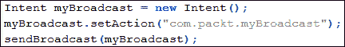

在前面的代码中可以看到，并没有一个名为`BroadcastIntent`的特殊类。它只是一个普通的`Intent`对象。我们曾在`startActivity()`或`startService()`等方法中使用过这些`Intent`对象。这次我们将这些`Intent`对象传递给了`Activity`类的`sendBroadcast()`方法。我们通过调用`setAction()`方法来设置其动作字符串。如前所述，在`setAction()`方法中我们使用了包名格式。为了广播任何意图，我们使用了`sendBroadcast()`方法。这个方法可以广播任何给定的意图。记住，这个方法调用是异步的，会立即返回。你不能从任何接收器中得到任何结果，接收器也不能中止任何广播意图。感兴趣的接收器会将意图的动作字符串与它们自己的动作字符串匹配，如果匹配，这些接收器将被执行。

### 注意

从现在开始，在本章中我们将使用关键词**广播**或**广播们**，而不是**广播意图**。

# Android 系统内置的广播

Android OS 包含不同类型的广播。Android OS 不断广播这些意图，以通知其他应用程序系统中的各种变化。例如，当设备电量低时，Android OS 会广播包含低电量信息的意图；对这一信息感兴趣的应用程序和服务在接收到后会执行相应的操作。这些广播在 Android OS 中是预定义的，我们可以在应用程序中监听这些意图，使我们的应用更具交互性和响应性。

### 提示

你可以在名为`broadcast_actions.txt`的文本文件中找到所有可能的广播列表。该文件存储在`Android`文件夹下的`SDK`文件夹中。

```kt
<ANDROID_SDK_HOME>/platforms/android-<PLATFORM_VERSION>/data/broadcast_actions.txt
```

下表展示了一些 Android OS 广播及其行为描述的列表：

| 广播意图动作 | 描述 |
| --- | --- |
| `android.intent.action.ACTION_POWER_CONNECTED` | 当手机连接到电源时，会广播此意图。 |
| `android.intent.action.ACTION_POWER_DISCONNECTED` | 当手机从任何电源断开时，会广播此意图。 |
| `android.intent.action.BATTERY_LOW` | 当手机电量低时，会广播此意图。 |
| `android.intent.action.BOOT_COMPLETED` | 当手机启动完成时，会广播此意图。 |
| `android.intent.action.DEVICE_STORAGE_LOW` | 当手机设备存储空间不足时，会广播此意图。 |
| `android.intent.action.NEW_OUTGOING_CALL` | 当新的外拨电话开始时，会广播此意图。 |
| `android.intent.action.SCREEN_OFF` | 当手机屏幕关闭时，会广播此意图。 |
| `android.intent.action.SCREEN_ON` | 当手机屏幕打开时，会广播此意图。 |
| `android.net.wifi.WIFI_STATE_CHANGED` | 当手机的 WIFI 状态改变时，会广播此意图。 |
| `android.media.VIBRATE_SETTING_CHANGED` | 当手机的振动设置改变时，会广播此意图。 |
| `android.provider.Telephony.SMS_RECEIVED` | 当手机收到短信时，会广播此意图。 |

正如我们前面的表格中所看到的，Android OS 通过发送广播，不断通知不同的应用程序关于设备状态的多种变化。我们可以监听这些变化或广播，并执行自定义操作，使我们的应用更具响应性。

### 注意

你可能已经注意到，一些前面的意图，如`android.provider.Telephony.SMS_RECEIVED`，并不包含在`SDK`文件夹中的列表中。这些意图在 Android 中不受支持，并可能在任何未来的平台版本中有所变动。开发者在他们的应用中使用这些不受支持的隐藏功能时应谨慎。

到目前为止，我们只讨论了广播，但还没有在实际例子中使用它们。在下一节中，我们将开发一些示例，在这些示例中，我们将监听一些 Android 操作系统的预定义广播，并根据情况进行操作。

# 检测设备的低电量状态

在本节中，我们将实现一个当手机电量低时会显示警报消息的小应用程序。现在，让我们开始第一个示例的开发。但是，为了开始这个示例，你需要构建一个 Android 项目。你可以使用 Android Studio 或 Eclipse IDE（根据你的方便），但如果是 Eclipse，请确保你已经正确安装了 JDK、ADT 和 Android SDK 及其兼容性。如果你不知道这些 IDE 之间的区别，可以参考本书的第一章《理解 Android》。按照这些步骤将帮助你创建一个带有一些预定义文件和文件夹的完整 Android 项目。

创建一个空的 Android 项目后，我们需要修改两个文件：一个主活动文件和一个清单文件。同时我们也添加了一个接收器文件。现在，让我们详细看看这些文件。

## BatteryLowReceiver.java 文件

由于我们正在开发一个低电量警报应用，我们首先要做的是检测低电量。为此，我们需要创建一个`BroadcastLowReceiver`类，它将监听低电量广播。以下代码显示了接收器文件的实现：

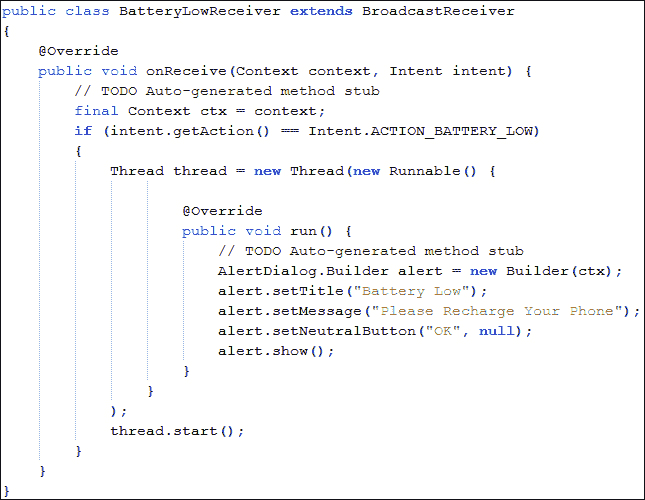

如前述代码所示，我们从`BroadcastReceiver`类扩展了我们的类，并覆盖了`onReceive()`方法。当接收到任何广播时，将调用此方法。我们首先要做的是检查这个意图是否是低电量意图或其他广播。为此，我们检查意图的动作字符串是否与标准的 Android 动作`Intent.ACTION_BATTERY_LOW`相匹配。如果结果为`true`，则意味着设备的电量低，我们需要执行自定义操作。

接下来，我们创建一个线程，在其中传递一个匿名`Runnable`对象。我们覆盖了`run()`方法，在这个方法中，我们使用`AlertDialog.Builder`接口创建一个`AlertDialog`实例。我们设置详细信息，比如警报的标题和消息，然后显示它。

你可能会好奇为什么我们要创建一个线程来显示警报。我们本可以在不使用线程的情况下显示警报。需要注意的是，广播接收器运行的时间非常短，大约只有 4 毫秒。开发者在在接收器中执行操作时应该非常小心。从广播接收器中创建线程来执行创建警报、启动活动和服务的操作是一种良好的实践。

现在，我们的 `BatteryLowReceiver` 类已经准备好了。但是，这个接收器是如何被触发的，这个类如何从 Android 操作系统中接收低电量广播呢？这些问题将在下一节中解释。现在让我们详细看看我们的活动文件。

## BatteryLowActivity.java 类

这个类代表了应用程序的主要活动，这意味着每当应用程序启动时，这个活动将首先被启动。以下代码展示了我们活动文件的实现：

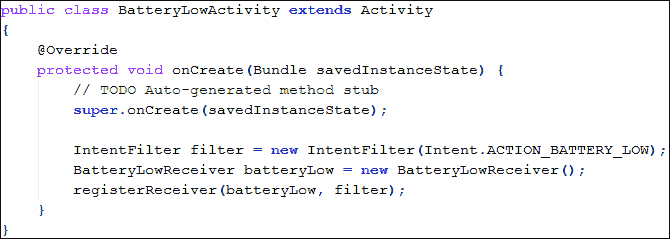

与往常一样，我们从 `Activity` 类扩展了我们的类。然后，我们覆盖了活动的 `onCreate()` 方法。我们创建了一个 `IntentFilter` 实例，并在其构造函数中传递了 `Intent.ACTION_BATTERY_LOW` 动作字符串。你可以在第七章，*意图过滤器*中了解更多关于意图过滤器的信息。之后，我们创建了 `BatteryLowReceiver` 类的一个实例。最后，我们调用 `registerReceiver()` 方法，并在其中传递我们的接收器和过滤器对象。这个方法告诉 Android 操作系统，我们的应用程序对低电量广播感兴趣。这样我们就可以监听低电量广播。这里需要注意的是，当调用 `registerReceiver()` 方法时，开发人员有责任在应用程序不再对低电量广播感兴趣时调用 `unregisterReceiver()` 方法。如果开发人员没有注销它，无论应用程序是打开还是关闭，它都会监听低电量广播并相应地采取行动。

这对内存和应用程序的优化可能是有害的。我们可以在 `Activity` 类的 `onDestroy()`、`onPause()` 或 `onStop()` 回调中调用 `unregisterReceiver()` 方法，如下面的代码片段所示：

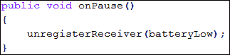

## AndroidManifest.xml 文件

开发人员也可以在 `AndroidManifest.xml` 文件中注册接收器。在清单文件中注册接收器的优点是，开发人员无需通过调用 `unregisterReceiver()` 方法手动注销它们。Android 操作系统会自行处理这些接收器，开发人员无需再为此担心。下面是我们 `AndroidManifest.xml` 文件的代码实现，其中注册了我们的低电量接收器：

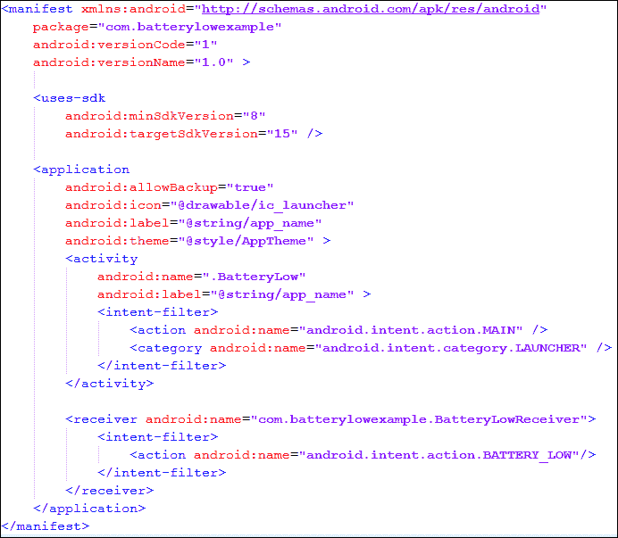

在前面的代码中，您可以看到我们在`<application>`标签内使用了`<receiver>`标签来注册我们的广播接收器。我们在`<receiver>`标签的`android:name`属性中插入了`BatteryLowReceiver`的完整包名，作为接收器的名称。正如我们在活动文件中通过创建`IntentFilter`类实例来设置意图过滤器动作一样，我们在`<intent-filter>`标签内嵌入了动作名为`android.intent.action.BATTERY_LOW`的意图过滤器。这个意图过滤器将告诉 Android 操作系统，接收器对设备的低电量状态信息感兴趣。

### 注意

开发者应注意，注册接收器应该只采用一种方法；要么从活动中调用`registerReceiver()`方法，要么从他们的`AndroidManifest.xml`文件中注册。使用`AndroidManifest.xml`文件来注册应用程序的`BroadcastReceiver`是一个好习惯。

当我们运行应用程序时，我们会看到一个空白屏幕，因为我们没有为活动设置任何布局。但是当手机电量低时，手机上会显示一个警告框。以下截图展示了来自我们`BatteryLowReceiver`类的警告框：

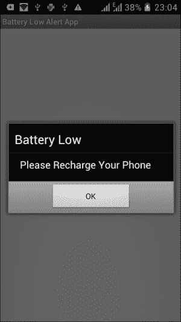

# 检测手机的屏幕开启/关闭状态

几乎在所有的 Android 手机中，我们在接听电话时都注意到了一个非常有趣的功能；我们可以看到屏幕会开启或关闭。此外，您可能已经观察到，当您将手机靠近耳朵时，屏幕会关闭，而当你从耳朵旁移开并手持手机时，屏幕会自动开启。这是智能手机的有趣行为。假设我们想要开发一个应用程序，每当屏幕开启时，我们都想开启扬声器模式，以便与我们在一起的其他人可以听到并参与电话对话。而当我们再次将其放在耳朵上，屏幕关闭时，我们想要关闭扬声器模式。下图展示了这个应用程序的概念：

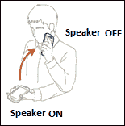

现在，让我们在以下示例中开发这样的应用程序。首先从您喜欢的 IDE 中创建一个 Android 项目。然后，我们首先需要检测屏幕是否已开启或关闭。为了检测这一点，我们将实现我们自定义的`BroadcastReceiver`类。让我们在下一节中实现我们的广播接收器类。

## `ScreenOnOffReceiver.java`文件

`ScreenOnOffReceiver.java`文件表示我们用于检测手机屏幕开启/关闭状态的定制广播接收器。以下代码实现展示了我们的屏幕开启/关闭检测接收器：

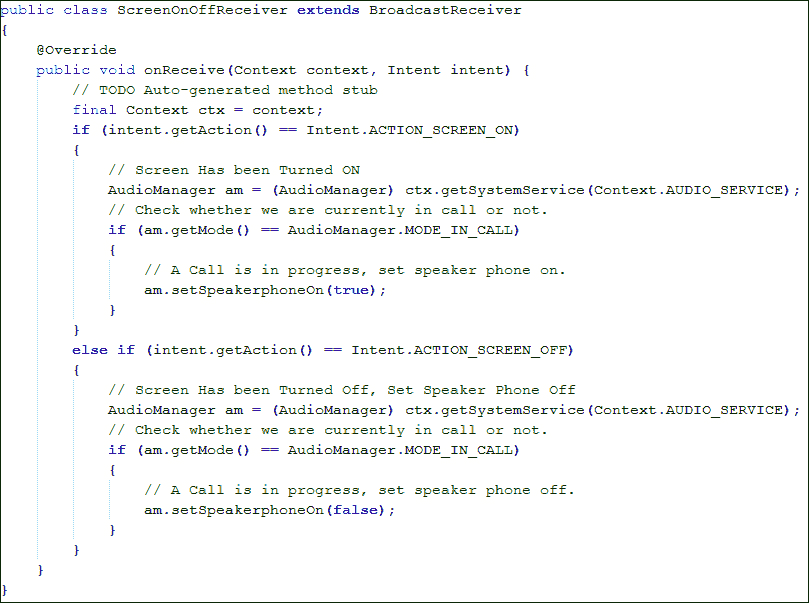

与之前的示例一样，我们的`ScreenOnOffReceiver`类从`BroadcastReceiver`类扩展而来，并覆盖了`onReceive()`方法。当我们的应用程序接收到任何广播意图时，将调用此方法。我们的应用程序首先通过将意图动作与`Intent.ACTION_SCREEN_ON`或`Intent.ACTION_SCREEN_OFF`常量进行比较，来检查它是否是屏幕开启/关闭的意图。记住，在之前的示例中，我们只监听一个广播意图。然而在本例中，我们监听两个广播意图：一个用于屏幕开启，另一个用于屏幕关闭。

在 Android 手机中，屏幕不仅在通话期间会开启/关闭。当手机锁定/解锁时，屏幕也会开启/关闭。因此，在设置我们的扬声器开启/关闭之前，我们必须检查当前是否正在通话。我们可以通过检查`AudioManager`的模式来检测它。如果模式是`AudioManager.MODE_IN_CALL`，那就意味着我们当前正处于来电或去电的通话中。一旦我们确认了通话模式状态，那么我们就可以设置扬声器的开启/关闭。我们使用`AudioManager.setSpeakerphoneOn(boolean)`方法来实现这一目的。

到目前为止，我们已经实现了我们的接收器。但我们还没有注册这些接收器。记得在前一个示例中，我们使用了两种方法来注册我们的自定义广播接收器：一种是从活动类中使用`registerReceiver()`方法，另一种是从`AndroidManifest.xml`文件中。让我们选择后者，即使用`AndroidManifest.xml`文件来注册我们的接收器。

## AndroidManifest.xml 文件

与前面的示例一样，我们将在该清单文件中注册我们的`ScreenOnOffReceiver`广播接收器。需要注意的是，在之前电池电量低的应用示例中，我们只为一个过滤器注册了接收器，即手机的低电量状态。然而，在本例中，我们监听两个状态过滤器：屏幕开启和屏幕关闭。但我们只实现了一个广播接收器。下面让我们看看如何在以下`AndroidManifest.xml`文件的代码实现中，用两个意图过滤器注册一个接收器：

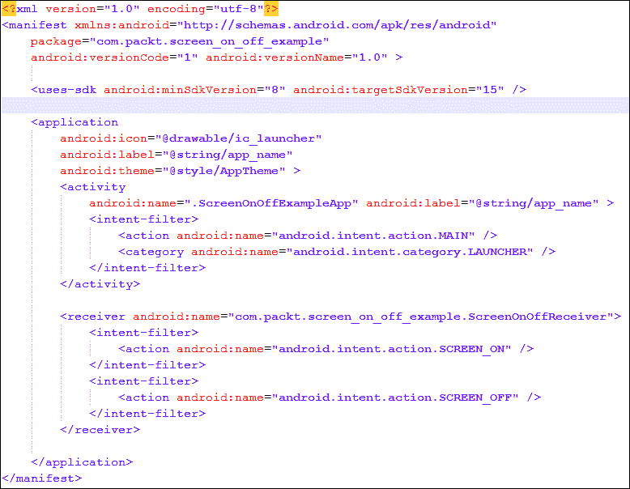

在前面的代码中，我们可以看到，我们在`<application>`标签内放置了`<receiver>`标签，以注册我们的接收器。同时，需要注意的是，这次我们两次使用了`<intent-filter>`标签，其中嵌入了两种不同的动作：一个是`android.intent.action.SCREEN_ON`，另一个是`android.intent.action.SCREEN_OFF`。你可以在第七章《意图过滤器》中了解更多关于多个意图过滤器的内容。这两个意图过滤器连同我们在`AndroidManifest.xml`文件中嵌入的接收器一起，将我们的`ScreenOnOffReceiver`广播接收器注册到 Android 操作系统中，监听手机屏幕开启和关闭状态的变化。

# 检测手机的重启完成状态

许多安卓应用程序在执行多项任务和操作时会在后台运行服务。例如，一个天气应用会通过后台服务在固定时间间隔后持续检查天气情况。但你有没有想过，当你重启手机或电池耗尽导致手机重启后，这些服务是如何在重启后再次开始运行的？在本节中，我们将了解如何实现这一点。

当一部安卓手机成功重启后，安卓操作系统会广播一个意图，通知其他应用程序重启已完成。然后这些应用程序会再次启动它们的后台服务。在本节中，我们将创建一个监听重启完成广播的应用程序，并从中启动我们的测试服务。

让我们在任何 IDE（如 Eclipse 或 Android Studio）中创建一个空的安卓项目。像往常一样，我们首先实现我们的广播接收器类。

## PhoneRebootCompletedReceiver.java 文件

PhoneRebootCompletedReceiver.java 类表示我们的重启完成广播接收器文件。以下代码展示了该文件的实现：

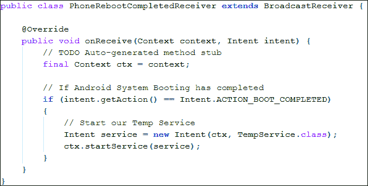

你可以在前面的代码中看到，我们没有做任何新的操作。我们的类是从`BroadcastReceiver`类扩展而来的。然后，我们检查意图的`Intent.ACTION_BOOT_COMPLETED`动作是否为真。如果是，我们通过调用`Context.startService()`方法来启动我们的临时服务。现在，让我们在下一节中看看`TempService`类的作用。

## TempService.java 文件

TempService.java 类表示我们将在安卓系统启动完成后开始运行的服务。

### 注意

在 Android 3.0 中，用户至少需要启动一次应用程序，之后应用程序才能接收到`android.intent.action.BOOT_COMPLETED`的广播。

以下代码展示了我们`TempService`类的实现：

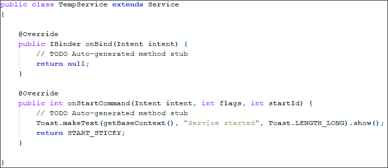

与任何常规服务类一样，我们的类是从`Service`扩展而来的。我们重写了两个方法：`onBind()`和`onStartCommand()`。在`onStartCommand()`方法中，我们将通过调用`Toast.makeText()`方法并传入"**Service started**"文本来显示一个提示框。当我们的手机启动完成后，将显示这个提示框。我们可以在该方法中实现我们自己的自定义操作。

现在，我们还需要通知安卓操作系统，我们的应用程序想要监听 Boot Completed 广播。与之前的程序一样，我们将在`AndroidManifest.xml`文件中注册我们的接收器。下一节我们将看到这一点。

## AndroidManifest.xml 文件

AndroidManifest.xml 文件通知安卓操作系统我们的应用程序想要监听 Boot Completed 广播。以下代码展示了该清单文件的实现：

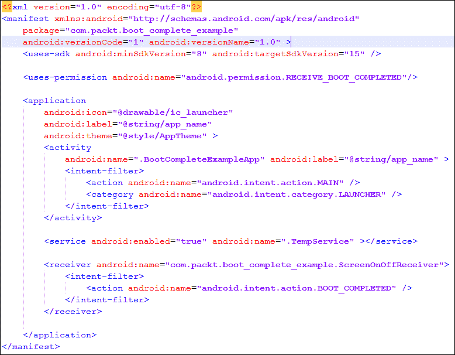

与之前的示例应用几乎相同。我们使用 `<application>` 标签内的 `<receiver>` 标签注册了我们的接收器，并带有 `android.intent.action.BOOT_COMPLETED` 动作的意图过滤器。我们还通过使用 `<application>` 标签内的 `<service>` 标签注册了 `TempService`。必须注意，Boot Completed 广播需要用户授予 `android.permission.RECEIVE_BOOT_COMPLETED` 权限。我们可以通过添加 `android:name` 属性设置为 `android.permission.RECEIVE_BOOT_COMPLETED` 的 `<uses-permission>` 标签，请求用户授予此权限。这样，当手机重启时，我们就可以启动自定义服务了。

# 发送和接收自定义广播

到目前为止，我们只接收广播。我们实验过的所有意图都是 Android 系统广播。在本节中，我们将讨论自定义广播。我们将了解如何向其他应用程序发送我们自己的自定义广播，以及其他应用程序如何监听我们的自定义广播意图。

在下一节中，我们将创建一个示例，该示例将向其他应用程序发送自定义广播。现在让我们为应用程序创建活动和布局文件。

## activity_main.xml 布局文件

activity_main.xml 文件表示我们活动的布局文件。以下代码展示了清单文件的实现：

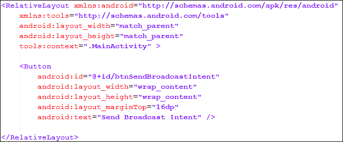

如您在布局文件中所见，我们放置了一个带有 ID `btnSendBroadcastIntent` 的按钮。我们将在活动文件中使用此按钮向其他应用程序发送广播。现在让我们看看活动文件。

## MainActivity.java 文件

`MainActivity.java` 文件是我们应用程序的主要启动点。此活动将使用 `activity_main.xml` 布局文件作为其视觉部分。以下代码展示了文件的实现：

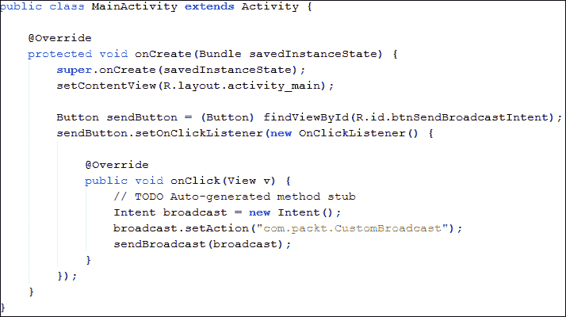

你可以从前面的代码中看到，我们通过调用`findViewById()`方法从我们的布局文件中获取了`Button`对象。然后我们设置了它的`OnClickListener()`方法，并在重写的`onClick()`方法中执行了我们的主要操作，即向其他应用程序发送广播。我们创建了一个`Intent`对象，并通过调用`Intent.setAction()`方法设置其动作字符串。需要注意的是，这次我们定义了自己的自定义动作值，即`com.packt.CustomBroadcast`字符串。创建自己的自定义广播接收器时，我们应该遵循包命名约定。最后，我们使用该意图进行广播，通过调用`Activity`类的`sendBroadcast()`方法。这就是我们的自定义广播意图发送到 Android 操作系统和其他应用程序的方式。现在，所有监听这种类型广播的应用程序和接收器都将接收到它，因此可以执行它们的自定义操作。在下一节中，我们将实现我们的自定义广播接收器类，它将接收这种类型的意图，并通过显示提示来通知用户。

## CustomReceiver.java 文件

CustomReceiver.java 文件代表我们的自定义广播接收器类，它将接收我们的自定义广播。这个类可以在这个应用程序中，也可以在任何其他想要监听这种自定义类型广播的应用程序中。与之前的所有示例一样，这个类将相同，并且从`BroadcastReceiver`类扩展而来。与之前示例的唯一区别在于，我们之前使用的是 Android 操作系统的标准预定义常量动作字符串来检测系统广播，但在这个示例中，我们正在监听具有自定义动作字符串设置的自定义广播。以下是文件实现的代码：

```kt
public class OurCustomReceiver extends BroadcastReceiver {
  @Override
  public void onReceive(Context context, Intent intent) {
    // TODO Auto-generated method stub
    if (intent.getAction() == "com.packt.CustomBroadcast") {
      Toast.makeText(context, "Broadcast Intent Detected.",
        Toast.LENGTH_LONG).show();
    }
  }
}
```

从前面的代码中可以看出，我们并没有做任何你还不熟悉的新操作。我们的类是从`BroadcastReceiver`派生出来的，并重写了`onReceive()`方法。然后我们将意图的 action 字符串与我们的自定义字符串`com.packt.CustomBroadcast`动作进行比较。如果为`true`，我们将显示一个提示“检测到广播意图”。我们可以在该方法中执行自定义操作。最后，我们必须注册这个接收器，以便 Android 操作系统可以通知我们的应用程序关于广播的信息。

## AndroidManifest.xml 文件

与往常一样，AndroidManifest.xml 告诉 Android 操作系统我们的应用程序正在监听自定义广播。以下是文件实现的代码：

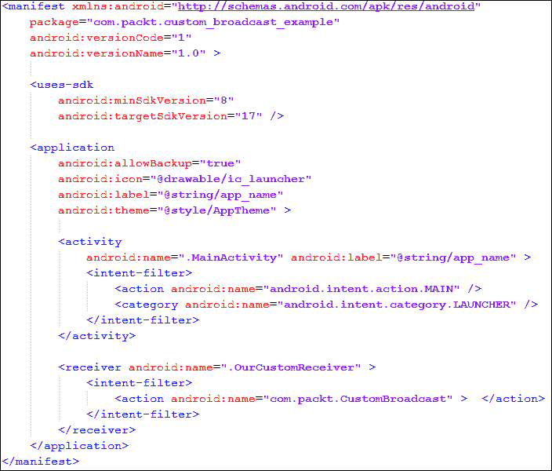

你可以看到，我们以与注册 Android 系统广播接收器相同的方式注册了我们的自定义广播接收器。现在，当我们运行这个应用程序时，我们会看到一个名为**发送广播意图**的按钮。当我们点击这个按钮时，我们的自定义广播将在 Android 操作系统中广播。由于我们也为此自定义意图创建了一个接收器，因此我们也将接收到这个意图。在接收到意图时，我们的自定义接收器将显示一个提示消息。以下屏幕截图展示了这个应用程序的执行情况：

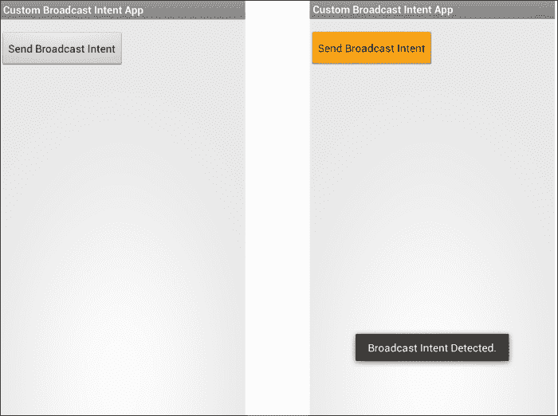

# 总结

在本章中，我们讨论了广播。我们还了解了 Android 操作系统的不同系统广播意图，例如电量低、电源连接和开机完成。我们也学习了如何通过注册自定义接收器来接收这些广播，以及如何在那些接收器中执行我们自己的自定义操作。最后，我们学习了如何发送我们自己的自定义广播以及接收这些自定义意图。

在下一章中，我们将探索两种特殊的意图类型：`IntentService`和`PendingIntent`。我们还将学习如何使用这些意图以及通过这些意图可以实现什么功能。
