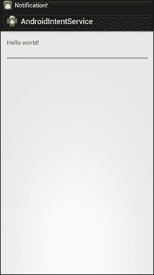
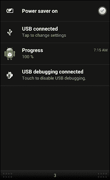

# 第九章：意图服务与待定意图

从本书一开始，我们就一直在研究意图可以执行的不同任务，以促进 Android 及其类型。我们已经看到意图可以帮助在活动之间导航。它们还用于在它们之间传输数据。我们了解到如何设置过滤器以验证传入的意图是否可以通过组件测试，最后我们学习了意图在广播接收器中的作用。在本章中，我们将深入了解如何使用意图服务和待定意图进行便捷操作。

在本章中，我们将探讨以下主题：

+   意图服务是什么？

+   意图服务的使用和实现

+   待定意图是什么？

+   待定意图的使用和实现

+   概括

# 意图服务

意图服务是一个简单的服务类型，用于处理与主线程无关的异步工作。如果客户端通过`startService(Intent intent)`方法发送请求，就可以这样做。这个新任务将由工作线程处理，并在没有工作可做时停止。

### 注意

意图服务继承了 Android API 中的`Service`类

意图服务用于卸载工作线程，使其不会成为瓶颈。它有助于使事情与主应用程序线程分开进行。需要注意的是，尽管它独立于主线程工作，但一次只能处理一个请求。

意图服务是从应用程序的 UI 线程卸载工作到工作队列的最佳方式。无需为每个处理创建异步任务并管理它们。相反，你定义一个意图服务，使其能够处理你想要发送进行处理的数据，然后简单地启动服务。最后，你可以通过在意图对象中广播数据并将其从广播接收器捕获来将数据发送回应用程序，以便在应用程序中使用。

## 四个基础组件的比较

本节展示了 Android 开发中四个最重要的元素（服务、线程、意图服务和异步任务）之间的基本区别，包括意图服务。

### 最佳使用情况

服务、线程、意图服务和异步任务的最佳情况场景如下表所示：

|   | 最佳情况场景 |
| --- | --- |
| 服务 | 当任务不是很长，并且与主线程无关时 |
| 线程 | 当有一个长任务需要执行，并且需要并行完成多个任务时 |
| 意图服务 | 当有不需要主线程干预的长任务，并且需要回调时 |
| 异步任务 | 当有需要与主线程通信的长任务，并且需要并行工作 |

### 注意

如果 Intent Service 需要与主线程通信，我们需要使用 Handler 或广播 Intent。

### 触发条件

下表讨论了 Service、Thread、Intent Service 和 Async Task 之间的触发条件差异：

|   | Service | Thread | Intent Service | Async Task |
| --- | --- | --- | --- | --- |
| 触发方式 | 使用`onStartService()`方法 | 使用`start()`方法 | 使用 Intent | 使用`execute()`方法 |
| 触发原因 | 可以从任何线程调用 | 可以被任何其他线程调用和运行 | 只能从主线程调用 | 只能从主线程调用 |
| 运行环境 | 可以从主线程调用 | 在自己的线程上运行 | 在独立的工作线程上运行 | 在独立的工作线程上运行，尽管主线程的方法可能会在中间运行 |
| 限制条件 | 在某些场景下可能会阻塞主线程 | 需要手动处理，代码可能不易理解 | 不能同时处理多个任务，所有任务都在同一个工作线程上运行 | 只能有一个任务实例，不能在循环中运行 |

# Intent Service 的使用和实现

从本章的前几部分，我们清楚地了解了 Intent Service 的定义以及它与 Thread、Async Task 和 Service 之间的基本区别。现在是开始实现和使用 Intent Services 的时候了。为此，我们将从一个示例开始，这将帮助我们学习如何从 Intent Service 生成假通知。

## 从 Intent Service 生成假通知

在这个示例中，我们将学习 Intent Service 在通知栏上生成通知的使用方法。该示例还将解释`onHandleIntent()`方法的使用，该方法用于实现 Intent Service 的所有功能，包括发送广播和通知到通知栏。

此外，在本节末尾，你将了解它与 Thread 或其他之前提到的 Android 定义方法之间的区别。完成这段代码后，启动活动，你将看到以下屏幕：



启动 Activity 将显示“Hello World”屏幕

### 提示

注意：请记住，在这个示例中，我们将不会介绍项目中使用的完整文件集。由于这是本书的最后一章，我们假设您已经掌握了关于 XML 文件、资源和布局的 Android 开发基础知识。



显示进度通知的通知面板

### 代码概览

该示例指的是在需要向通知栏发送关于特定事件进展或信号的情景下使用 Intent Service。

```kt
package com.app.intentservice;

import android.app.IntentService;
import android.app.Notification;
import android.app.NotificationManager;
import android.content.Context;
import android.content.Intent;
import android.support.v4.app.NotificationCompat;

public class CustomIntentService extends IntentService {

  private static final int NOTIFICATION_ID=1;
  NotificationManager notificationManager;
  Notification notification;

  public static final String ACTION_CUSTOM_INTENT_SERVICE = "com.app.intentservice.RESPONSE";
  public static final String ACTION_MY_UPDATE ="com.app.intentservice.UPDATE";
  public static final String EXTRA_KEY_IN = "EXTRA_IN";
  public static final String EXTRA_KEY_OUT = "EXTRA_OUT";
  public static final String EXTRA_KEY_UPDATE = "EXTRA_UPDATE";
  String activityMessage;

  String extraOut;

  public CustomIntentService() {
    super("com.app.intentservice.CustomIntentService");
  }

  @Override
  protected void onHandleIntent(Intent intent) {

    //get input
    activityMessage = intent.getStringExtra(EXTRA_KEY_IN);
    extraOut = "Hello: " +  activityMessage;

    for(int i = 0; i <=10; i++){
      try {
        Thread.sleep(1000);
      } catch (InterruptedException e) {
    // TODO Auto-generated catch block
        e.printStackTrace();
      }

      //send update 
      Intent intentUpdate = new Intent();
      intentUpdate.setAction(ACTION_MY_UPDATE);
      intentUpdate.addCategory(Intent.CATEGORY_DEFAULT);
      intentUpdate.putExtra(EXTRA_KEY_UPDATE, i);
      sendBroadcast(intentUpdate);

      //generate notification
      String notificationText = String.valueOf((int)(100 * i / 10)) + " %";
      notification = new NotificationCompat.Builder(getApplicationContext())
      .setContentTitle("Progress")
      .setContentText(notificationText)
      .setTicker("Notification!")
      .setWhen(System.currentTimeMillis())
      .setDefaults(Notification.DEFAULT_SOUND)
      .setAutoCancel(true)
      .setSmallIcon(R.drawable.ic_launcher)
      .build();

      notificationManager.notify(NOTIFICATION_ID, notification);
    }

    //return result
    Intent intentResponse = new Intent();
    intentResponse.setAction(ACTION_CUSTOM_INTENT_SERVICE);
    intentResponse.addCategory(Intent.CATEGORY_DEFAULT);
    intentResponse.putExtra(EXTRA_KEY_OUT, extraOut);
    sendBroadcast(intentResponse);
  }

  @Override
  public void onCreate() {
    // TODO Auto-generated method stub
    super.onCreate();
    notificationManager = (NotificationManager)getSystemService(Context.NOTIFICATION_SERVICE);
  }
}
```

### 深入理解

创建一个新项目并打开`src`文件夹。创建一个名为`CustomIntentService.java`的新的类文件，它是`IntentService`的子类。扩展`IntentService`类并覆盖`onHandleIntent(Intent intent)`方法。

在这一点上，你已经准备好实现自己的 Intent Service，负责将消息发送到通知栏，并以进度百分比条的形式更新它。现在，让我们通过以下步骤开始理解代码：

1.  第一步是在`onHandleIntent()`方法中使用变量`notificationManager`和`notification`进行声明。还有一些其他的静态最终变量将在本项目中使用。它们是`NOTIFICATION_ID`、`ACTION_CustomIntentService`、`ACTION_MyUpdate`、`EXTRA_KEY_IN`、`EXTRA_KEY_OUT`和`EXTRA_KEY_UPDATE`。还需要两个新的字符串变量以处理通知字符串，分别表示为`activityMessage`和`extraOut`。

1.  这个`IntentService`的主要实现将在`onHandleIntent()`方法中进行，我们将在这里定义包括消息到通知栏和广播消息的工作。

1.  在`onHandleIntent()`方法开始时，通过`intent.getStringExtra()`方法获取额外的数据，并将其保存在`msgFromActivity`变量中，稍后该变量将发送到广播。

1.  我们的主要目标是发送一个通知，显示从 0 到 100%的进度（一个假的计数器），并在通知栏中更新。为此，我们初始化一个`for`循环，该循环将从 0 进行到 10。在开始时，我们将调用`Thread.sleep(1000)`，这将使线程休眠，在 1000 毫秒内不工作。

1.  一旦线程休眠了一定时间，我们的假进度更新的第一个计数器就完成了。下一步是发送一个广播，其主要目的是提供更新。为了看到这一点，我们使用以下代码行：

    ```kt
    //send update 
    Intent intentUpdate = new Intent();
    intentUpdate.setAction(ACTION_MyUpdate);
    intentUpdate.addCategory(Intent.CATEGORY_DEFAULT);
    intentUpdate.putExtra(EXTRA_KEY_UPDATE, i);
    sendBroadcast(intentUpdate);
    ```

    快速了解我们如何发送广播：创建一个新的意图对象，并为其提供一个名称和`intentUpdate`的动作；由于这是一个自定义动作，所以给它一个`ACTION_MyUpdate`的名称，你可以在代码中看到；定义它的类别，这也是一个自定义类别；放入计数器信息（显示循环当前计数器的变量）并发送此意图的广播。

1.  下一步是将通知发送到通知栏。以下代码可以在上一个示例中看到：

    ```kt
    //generate notification
    String notificationText = String.valueOf((int)(100 * i / 10)) + " %";
    myNotification = new NotificationCompat.Builder(getApplicationContext())
    .setContentTitle("Progress")
    .setContentText(notificationText)
    .setTicker("Notification!")
    .setWhen(System.currentTimeMillis())
    .setDefaults(Notification.DEFAULT_SOUND)
    .setAutoCancel(true)
    .setSmallIcon(R.drawable.ic_launcher)
    .build();

    notificationManager.notify(MY_NOTIFICATION_ID, myNotification);
    ```

    这段代码将`notificationText`的值设置为循环的当前计数器，并将其转换为百分比；通过调用`NotificationCompat.Builder()`（这基本上是 Android SDK 中描述的构建器模式）创建一个新的通知，并为其提供应用程序上下文，设置其标题内容、文本、提醒、出现时间以及其他一些属性。最后，你需要调用`notificationManager.notify()`以在通知栏中显示它。

1.  最后一步是发送另一个广播作为确认，它的流程与之前的广播相同，你可以在以下代码中看到：

    ```kt
    //return result
    Intent intentResponse = new Intent();
    intentResponse.setAction(ACTION_MyIntentService);
    intentResponse.addCategory(Intent.CATEGORY_DEFAULT);
    intentResponse.putExtra(EXTRA_KEY_OUT, extraOut);
    sendBroadcast(intentResponse);
    ```

1.  代码中显示的最后一步是覆盖`onCreate()`方法。你可能已经注意到我们没有创建一个新的通知管理器对象，这肯定会出错。因此，为了创建新对象，我们将通过使用通知管理器`getSystemService (Context.NOTIFICATION_SERVICE)`获取 Android 的系统服务。

### 注意

这个示例还需要一个广播接收器。如果你还没有关于它的想法，可以参考前面的章节。

## 再举一个例子。

上一个示例主要处理了在 Android 通知栏中实现通知的问题。它涵盖了 Intent 服务的实现，但没有涉及广播接收器的制作及其注册。在这个例子中，我们将学习如何使用 Intent 服务并将所有输入数据转换为大写，并将其广播回广播接收器。广播接收器的实现也是这个示例的一部分。

从示例开始，在你的开发环境中使用以下代码来实现它：

```kt
public class IntentServiceExampleTwo extends IntentService {
  private static final String TAG =IntentServiceExampleTwo.class.getSimpleName();

  public static final String INPUT_TEXT_STRING="INPUT_TEXT_STRING";
  public static final String OUTPUT_TEXT="OUTPUT_TEXT";

  /**
   *  initiate service in background thread with service name
   */
  public IntentServiceExampleTwo() {
    super(IntentServiceExampleTwo.class.getSimpleName());
  }

  @Override
  protected void onHandleIntent(Intent intent) {
    Log.i(TAG,"onHandleIntent()");

    String data =intent.getStringExtra(INPUT_TEXT_STRING);
    Log.d(TAG,data);

    data=data.toUpperCase();

    SystemClock.sleep(4*1000);

    Intent stringBroadCastIntent =new Intent();

    stringBroadCastIntent.setAction(TextCapitalizeResultReceiver.ACTION_TEXT_CAPITALIZED);

    stringBroadCastIntent.addCategory(Intent.CATEGORY_DEFAULT);

    stringBroadCastIntent.putExtra(OUTPUT_TEXT, data);

    sendBroadcast(stringBroadCastIntent);
  }

}
```

这几乎与之前的第一个示例中的实现相同。在这个例子中，展示了`onHandleIntent()`方法的工作原理，其中进行以下步骤：

1.  在`onHandleIntent()`方法中，你可以看到的第一步是从传入的意图中获取数据并将其保存到一个变量中。变量`data`包含我们将转换为大写的传入数据。

1.  第二步是将数据记录到 LogCat 中，这是通过使用`Log.d(String, String)`方法获得的。第一个参数是`TAG`，通常是全局声明的类名，以便任何方法都可以使用它。这个类名对于将你的消息与其他消息区分开来很重要（使其易于阅读）。第二个参数是消息字符串，用于显示过程中的任何数据，以便开发者在运行时可以看到其值。

1.  第三步是将这些数据转换成大写。这将有助于在广播的意图中反映更改。将其重新保存回数据变量中。

1.  其余步骤与之前的示例相同，其中创建意图对象，定义类别和动作，将数据作为额外内容放入并发送给接收器进行广播。

下一步是设置将从`sendBroadcast()`方法接收的接收器。为此，请查看以下代码：

```kt
public class UpperCaseReceiver extends BroadcastReceiver {

  @Override
  public void onReceive(Context context, Intent intent) {
    TextView textViewResult = (TextView)findViewById(R.id.receiving_text_view);
    String result =intent.getStringExtra(ExampleIntentService.OUTPUT_TEXT);
    textViewResult.setText(result);
  }

};
```

之前的代码是示例中关于如何创建广播接收器的部分，这将接收广播并设置 `textView`。你可以在代码中看到，覆盖了 `onReceive()` 方法，该类正在扩展广播接收器。在 `onReceive()` 方法内部，通过 `intent.getStringExtra()` 方法获取字符串并将其保存在结果字符串中。这个字符串将被用来设置 `textView` 的文本，以便你可以看到它们在 `textView` 中的反映。

接下来，下一步是使用 Intent Service 注册这个接收器。这将在与 Intent Filter 相关联的活动内完成，以便它可以产生效果。以下代码段展示了这一过程：

```kt
private void registerReceiver() {

  IntentFilter intentFilter =new IntentFilter(UpperCaseResultReceiver.ACTION_TEXT_CAPITALIZED);

  intentFilter.addCategory(Intent.CATEGORY_DEFAULT);

  capitalCaseReceiver=new UpperCaseResultReceiver();

  registerReceiver(capitalCaseReceiver, intentFilter);
}
```

`registerReceiver()` 方法在你的活动中声明，它将从 `onCreate()` 或 `onResume()` 方法中被调用，以便在启动或恢复活动时注册广播接收器。

+   Intent Filter 被声明并使用名为 `intentFilter` 的对象初始化。

+   `intentFilter` 对象被设置为默认。

+   广播接收器的对象被初始化并通过调用 `registerReceiver(Receiver, IntentFilter)` 方法与 Intent Filter 注册。

在使用 Intent Filter 注册接收器之后，下一步是在你的活动中使用它。为此，请查看以下代码。这段代码可以位于任何事件内：

```kt
Intent textUpperCaseIntent = new Intent(MainActivity.this, ExampleIntentService.class);

textUpperCaseIntent.putExtra(ExampleIntentService.INPUT_TEXT, inputText);

startService(textUpperCaseIntent);
```

以传统方式初始化一个意图，给出你刚刚创建的 `IntentService` 类，并放入你想要转换为大写的输入文本。通过 `Intent.putExtra(String, String)` 方法给这个意图提供额外的数据。最后一步是使用这个意图启动服务。我们将使用 `startService()` 方法，而不是典型的 `startActivity()` 方法，因为在 Android 中我们使用 `startActivity` 来通过意图启动活动。

# Pending Intents

Pending Intent 是一种允许其他应用（或称为外部应用）访问你的意图权限以运行预定义代码段的意图。这样，许多其他应用（如闹钟管理和日历）可以利用你的应用来执行它们的任务。

Pending Intents 不会立即运行；而是在其他活动需要它运行时才执行。Pending Intent 是系统维护的一个引用，以便在稍后的阶段使用。这意味着即使包含 Pending Intent 的应用结束了，另一个应用仍然可以使用该上下文，直到对该意图调用 `cancel()`。

### 注意

要通过 Pending Intent 执行广播，请使用 `PendingIntent.getBroadcast()` 获取 Pending Intent。

Pending Intents 可以通过三种方法启动，分别是 `getActivity(Context context, int requestCode, Intent intent, int flags)`、`getBroadcast(Context context, int requestCode, Intent intent, int flags)` 和 `getService(Context context, int requestCode, Intent intent, int flags)`。为了了解 Pending Intents 在 Android 应用中的制作和使用方式，您可以继续阅读下一节，其中将介绍实现过程。

## 如何让 Pending Intents 工作？

本节介绍 Pending Intents 的工作原理及解释。为了更好地理解这一点，我们建议您阅读之前提到的定义，以便您能更好地理解。

在这个例子中，我们将向您展示如何制作一个应用程序，用户可以在 `editText` 字段（以秒为单位）中输入时间，之后闹钟将会响起，Android 的闹钟管理器将根据相应地播放闹钟。

为了进一步了解，请查看以下代码：

```kt
EditText text = (EditText) findViewById(R.id.editText1);

int i = Integer.parseInt(text.getText().toString());

Intent intent = new Intent(MainActivity.this, MyBroadcastReceiver.class);

PendingIntent pendingIntent = PendingIntent.getBroadcast( MainActivity.this, 234324243, intent, 0);

AlarmManager alarmManager = (AlarmManager) getSystemService(ALARM_SERVICE);

alarmManager.set(AlarmManager.RTC_WAKEUP, System.currentTimeMillis() + (i * 1000), pendingIntent);

Toast.makeText(MainActivity.this, "Alarm set in " + i + " seconds",

Toast.LENGTH_SHORT).show();
```

之前编写的代码片段可以插入到任何事件中，比如一个按钮，用于获取 `EditText` 字段中的输入值，并通过 Pending Intents 处理它。

1.  从布局文件中获取编辑文本，并创建一个名为 `text` 的对象，该对象保存该小部件的当前状态。

1.  整数变量 `i` 将保存编辑文本中的输入值，通过 `text.getText().toString()` 获取。

1.  创建一个显式意图，将 `BroadcastReceiver` 类作为意图的目标类（我们将在完成此部分后创建）。

1.  为了启动 Pending Intent，我们使用 `PendingIntent.getBroadcast(Context context, int requestCode, Intent intent, int flags, int, Intent, int)` 方法。关于这个方法的更多描述可以在 [`developer.android.com/reference/android/app/PendingIntent.html`](http://developer.android.com/reference/android/app/PendingIntent.html) 找到。

1.  通过在 `getSystemService()` 方法中传入 `ALARM_SERVICE` 来获取闹钟的系统服务，并将其指向一个 `AlarmManager` 对象。

1.  使用存储在 `i` 中的值设置闹钟管理器的值，并给它一个 Pending Intent，这将帮助它启动（因为闹钟管理器是 Android 的一个服务）。

1.  `alarmManager.set()` 方法包含参数 `int` 类型的类型、`long triggerMilliSec`（在其中您取当前系统时间并将变量 `i` 转换为毫秒后相加）以及 Pending Intent。

1.  制作一个吐司通知，以显示闹钟管理的成功完成。

下一步是创建您选择的广播接收器并实现该接收器。为此，创建一个广播接收器并重写 `onReceive()` 方法。查看以下代码：

```kt
@Override
public void onReceive(Context context, Intent intent) {
  Toast.makeText(context, "Alarm is ringing...",
  Toast.LENGTH_LONG).show();

  Vibrator vibrator = (Vibrator)context.getSystemService(Context.VIBRATOR_SERVICE);
  vibrator.vibrate(2000);
}
```

这个接收器有一个吐司提示，它会指示其报警状态。下一步是声明一个振动器对象，可以通过调用 `context.getSystemService(Context.VIBRATOR_SERVICE)` 方法来初始化。这个方法负责返回直接影响手机物理振动器的对象。最后一步是调用 `vibrator.vibrate(int)` 方法来启动振动。

### 注意

要使用振动器，你需要在清单文件中添加权限。你可以使用以下代码片段来完成这个操作：

```kt
<uses-permission android:name="android.permission.VIBRATE" />
```

最后，我们必须在 `AndroidManifest.xml` 文件中声明这个接收器，可以通过使用以下代码简单地完成：

```kt
<receiver android:name="MyBroadcastReceiver" >
</receiver>
```

上一个示例描述了待定意图（pending Intent）和广播接收器（Broadcast Receivers）一起使用的情况。

# 概括

本书的最后一章的概要可以作为本书的结论。在本章中，我们学习了如何实现 `intentService` 和 `PendingIntents` 以及它们最佳的应用场景。`IntentService` 的特性及其与 Android 中最常使用的三种功能——线程（Thread）、服务（Services）和异步任务（Async Tasks）的比较。此外，在本章中，实现了待定意图的示例，并解释了每一步。可以将本章视为意图在 Android 中高级版本或高级用法的介绍。需要记住的是，这些功能的使用可能并不常见，但在某些情况下，你必须让它们工作，因为没有其他解决方案。
