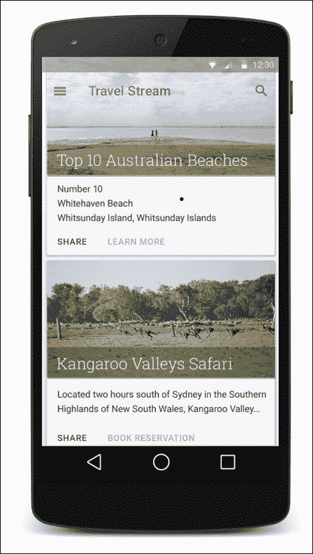

# 六、卡片视图和材质设计

在本章的第一部分，我们将从 UI 的角度对我们的应用进行显著改进，并通过从一个新的小部件开始使其看起来更专业: **CardView** 。我们将学习如何使用设计时属性，这将提高我们的设计和开发速度，我们将使用第三方库在我们的整个应用中以简单的方式包含自定义字体。

第二部分将专注于设计支持库，将材质设计概念添加到我们的应用中，改进选项卡，并在工作机会视图中添加视差效果。在此期间，我们将阐明什么是工具栏、动作栏和应用栏，以及如何从应用栏实现向上导航。

*   卡片视图和用户界面提示:
    *   卡特维
    *   设计时布局属性
    *   自定义字体
*   设计支持库:
    *   tab layout-表格配置
    *   工具栏、动作栏和应用栏
    *   协调世界布局
    *   向上导航

# CardView 和 UI 设计提示

目前，我们的应用用两个文本视图连续显示工作邀请；它显示了所需要的信息，我们可以说这个应用就这样很好，它服务于它的目的。但是，我们仍然可以做一个有用的 app，同时拥有一个专业、好看的界面，让我们与众不同，与众不同。例如，为了展示工作机会，我们可以模拟一个上面钉有广告的工作板。为此，我们可以使用 CardView 小部件，它将赋予它纸卡的深度和外观。我们将更改应用的字体。像这种简单的改变就有很大的不同；当我们将默认字体更改为自定义字体时，用户眼中的应用是一个定制的应用，开发者已经处理了最小的细节。

## 介绍 CardView

CardView 发布搭载安卓 5.0。这是一个有圆角的视图，一个有阴影的立面，因此提供了深度感并模拟了一张卡片。结合回收视图，我们得到了一个外观精美的项目列表，其行为和外观与许多应用一致。下图是带有卡片视图和自定义字体的列表示例:



在使用 CardView 时，请记住圆角的实现因安卓版本而异。添加填充是为了避免在安卓 5.0 之前的版本中剪切子视图，也是为了实现阴影效果。在安卓 5.0 以后的版本中，阴影是根据 CardView 中的属性高程显示的，任何与圆角相交的子对象都会被修剪。

要开始使用 CardView，我们需要从项目结构窗口将其添加为依赖项，或者在`build.gradle`内部的依赖项中添加以下行:

```java
dependencies {
  ...
  compile 'com.android.support:cardview-v7:21.0.+'
}
```

我们可以修改我们的`row_job_offer.xml`文件，将一个基本视图作为内部内容的卡片视图。这张卡片视图将有一些立面和圆角。为了设置这些属性，我们需要通过向 XML 添加以下模式来导入 CardView 自己的属性:

```java
xmlns:card_view="http://schemas.android.com/apk/res-auto"
```

以下代码将创建新布局:

```java
<?xml version="1.0" encoding="utf-8"?>
<android.support.v7.widget.CardView
    xmlns:android="http://schemas.android.com/apk/res/android"
    xmlns:card_view="http://schemas.android.com/apk/res-auto"
    android:orientation="vertical" android:layout_width="match_parent"
    android:layout_height="170dp"
    android:layout_margin="10dp"
    card_view:cardElevation="4dp"
    card_view:cardCornerRadius="4dp"
    >
    <LinearLayout
        android:orientation="vertical"
        android:layout_width="wrap_content"
        android:padding="15dp"
        android:layout_height="wrap_content">
        <TextView
            android:id="@+id/rowJobOfferTitle"
            android:layout_width="fill_parent"
            android:layout_height="wrap_content"
            android:text="Title"
            android:textColor="#555"
            android:textSize="18sp"
            android:layout_marginBottom="20dp"
            />
        <TextView
            android:id="@+id/rowJobOfferDesc"
            android:layout_marginTop="5dp"
            android:layout_width="fill_parent"
            android:layout_height="wrap_content"
            android:text="Description"
            android:textColor="#999"
            android:textSize="16sp"
            />
    </LinearLayout>
</android.support.v7.widget.CardView>
```

我们找到了一个软木塞板的纹理，并将其设置为背景，在每张卡片上，我们添加了一个顶部带有 ImageView 对象的大头针。以下是取得的成果:


这个应用看起来比以前好多了；现在，它真的是一个工作板。通过显示相同的信息——相同的两个带有标题和工作描述的`TextView`——并简单地改变外观，它从一个演示应用演变成了一个可以在 Play Store 中完美启动的应用。

我们可以通过改变字体来继续改进这一点，但是在此之前，我们将引入设计时布局属性，这将使视图的设计更加容易和快速。

## 设计时布局属性

当使用设计时属性时，我总是记得发生在我第一份工作中的一个有趣的故事。我必须显示联系人列表，因此当我创建联系人视图时，我使用了虚拟数据，该数据用于在您创建视图时分配一些文本，以便您可以在设计视图中看到大小、颜色和一般外观。

我创建的联系人被命名为“帕科·埃尔·丘雷罗”或“丘雷罗制造者弗兰克”。Paco 是 Francisco 的同义词，而 churro——如果你不知道的话——是一种油酥面团。无论如何，这个虚拟数据被更改为一个正确的联系人名称，当联系人列表显示时，这些联系人是从服务器检索的。我记不清是急着发布应用，还是忘了做，还是干脆错过了，但应用就是这样上线的。我开始在另一个组件上工作，一切都很好，直到有一天，服务器端出现了问题，服务器正在发送空联系人。该应用无法用联系人名称覆盖虚拟数据，Paco el churrero 显示为联系人！希望服务器在任何用户注意到之前就被修复了。

之后，我用虚拟数据创建了视图，一旦我对视图满意，我就移除了虚拟数据。然而，使用这种方法，当我被要求改变用户界面时，我不得不再次添加虚拟数据。

随着 Android Studio 0.2.11 的发布，设计时布局属性诞生了。这些允许我们在设计视图中显示文本或任何属性，而这些在您运行应用时不会出现；该数据仅在设计视图中可见。

为了使用这些，我们需要将命名空间工具添加到布局中。命名空间总是在视图的根元素中定义；您可以找到该行，`xmlns:android="http://schemas.android.com/apk/res/android`，并在其后添加工具。使用以下代码:

```java
<FrameLayout
xmlns:android="http://schemas.android.com/apk/res/android
xmlns:tools="http://schemas.android.com/tools"
```

为了测试这一点，我们将在工作邀请和工作描述中添加虚拟文本`TextView`:

```java
<TextView
    android:id="@+id/rowJobOfferTitle"
    android:layout_width="fill_parent"
    android:layout_height="wrap_content"
    tools:text="Title of the job"
    android:textColor="#555"
    android:textSize="18sp"
    android:layout_marginBottom="20dp"
    />
<TextView
    android:id="@+id/rowJobOfferDesc"
    android:layout_marginTop="5dp"
    android:layout_width="fill_parent"
    android:layout_height="wrap_content"
    tools:text="Description of the job"
    android:textColor="#999"
    android:textSize="16sp"
    android:ellipsize="marquee"
    />
```

如果在渲染设计视图时遇到问题，请更改安卓版本或主题，如下图所示。如果问题仍然存在，请确保您下载了最新版本的安卓 Studio 和最新的安卓应用编程接口:


呈现视图后，我们可以看到带有设计时属性的标题和描述的工作机会。


您可以使用任何属性、文本颜色、背景颜色，甚至图像源，这在您创建包含图像的视图时非常有用，该图像将在应用运行时从互联网下载，但是您需要预览图像来查看创建视图时的外观。

## 在安卓系统中使用自定义字体

在安卓系统上处理海关字体时，有一个惊人的开源库——克里斯·詹金斯的*书法*，它允许我们为整个应用设置默认字体。这意味着默认情况下，每个包含文本、按钮、文本视图和编辑文本的小部件都会显示这种字体，我们不必为应用中的每个项目单独设置字体。让我们更详细地了解一下这一点，并考虑几个支持书法的论点。

如果我们想应用自定义字体，我们需要做的第一件事是将该字体放在我们应用的`assets`文件夹中。如果我们没有这个文件夹，我们需要在`main`方法中创建它，与`java`和`src`处于同一级别。在`assets`内创建第二个文件夹`fonts`，并将字体放在那里。在我们的示例中，我们将使用 *Roboto* 字体；可以从[https://www.google.com/fonts#UsePlace:use/Collection:Roboto](https://www.google.com/fonts#UsePlace:use/Collection:Roboto)的谷歌字体获取。下载字体时，应用结构应该类似于下面的截图:


一旦字体在它的位置，我们需要从这个字体创建一个`Typeface`对象，并将其设置为`myTextView`:

```java
Typeface type = Typeface.createFromAsset(getAssets(),"fonts/Roboto-Regular.ttf"); myTextView.setTypeface(type);
```

如果我们现在想对应用中的所有组件应用相同的字体，如标签、标题和工作邀请卡，我们必须在应用的不同位置重复相同的代码。除此之外，我们还会遇到性能问题。从资产创建字体需要访问文件；这是一项昂贵的手术。如果我们改变适配器内的职务标题和职务描述的字体，我们的应用在滚动时的视图将不再流畅。这带来了额外的考虑；例如，我们必须在静态类中加载一次字体，并将其与应用一起使用。书法为我们处理这一切。

使用书法的另一个很好的原因是它允许我们在 XML 中设置字体，这样我们就可以在同一个视图中有不同的字体，而不需要通过编程来设置字体。我们只需要将`fontPath`属性添加到小部件中，并可选地添加`ignore`属性，以避免安卓工作室检测不到`fontPath`的警告:

```java
<TextView     android:text="@string/hello_world"     android:layout_width="wrap_content"     android:layout_height="wrap_content"     
fontPath="fonts/Roboto-Bold.ttf"
tools:ignore="MissingPrefix"/>
```

现在我们已经解释了书法的优点，我们可以在我们的应用中使用它。在`build.gradle`中的依赖项中添加以下一行:

```java
compile 'uk.co.chrisjenx:calligraphy:2.1.0'
```

要应用默认字体，请在`MAApplication`内的`Oncreate()`中添加以下代码:

```java
CalligraphyConfig.initDefault(new CalligraphyConfig.Builder().setDefaultFontPath("fonts/Roboto-Regular.ttf").setFontAttrId(R.attr.fontPath).build());
```

以及以下我们想要显示默认字体的任何活动:

```java
@Override protected void attachBaseContext(Context newBase) {super.attachBaseContext(CalligraphyContextWrapper.wrap(newBase)); }
```

最后，我们可以找到一个我们喜欢的手写字体，并将其设置为卡片的标题和描述，类似于以下输出:


# 设计支持库

设计支持库以官方方式引入素材设计组件，兼容安卓 2.1 开始的所有安卓版本。材质设计是安卓棒棒糖引入的新设计语言。在这个库发布之前，我们看了视频，考虑了使用这些组件的应用的例子，但是没有官方的方法来使用它。这为应用建立了一个基线；因此，要掌握安卓，就需要掌握材质设计。您可以使用下面的行来编译它:

```java
compile 'com.android.support:design:22.2.0'
```

这个库包括一个可视组件作为输入文本，它有浮动文本、浮动动作按钮、**Tablayout……**等等。然而，材质设计不仅仅是关于视觉组件；这是关于的运动和元素之间的过渡，为此，引入了**坐标布局**。

## 引入表格布局

`TabLayout`设计库允许我们有固定的或可滚动的标签，带有文本、图标或自定义视图。从这本书的第一个例子中，您会记得，定制选项卡并不容易，要从滚动改为固定选项卡，我们需要不同的实现。

现在，我们想改变要固定的标签页的颜色和设计；我们首先要做的是转到`activity_main.xml`并添加`TabLayout`，去掉之前的`PagerTabStrip`标签。我们的观点如下:

```java
<?xml version="1.0" encoding="utf-8"?>
<LinearLayout
    android:layout_height="fill_parent"
    android:layout_width="fill_parent"
    android:orientation="vertical"
    xmlns:android="http://schemas.android.com/apk/res/android">
    <android.support.design.widget.TabLayout
        android:id="@+id/tab_layout"
        android:layout_width="match_parent"
        android:layout_height="50dp"/>
    <android.support.v4.view.ViewPager
        android:id="@+id/pager"
        android:layout_width="match_parent"
        android:layout_height="wrap_content">
    </android.support.v4.view.ViewPager>
</LinearLayout>
```

当我们有了这个，我们需要给`Layout`标签添加标签。有两种方法可以做到这一点；一种是创建选项卡，然后手动添加，如下所示:

```java
tabLayout.addTab(tabLayout.newTab().setText("Tab 1"));
```

第二种方法，也就是我们将如何实现选项卡，是将视图分页器设置为`TabLayout`。我们的`MainActivity.java`课应该如下图所示:

```java
public class MainActivity extends ActionBarActivity {

  @Override
  protected void onCreate(Bundle savedInstanceState) {
    super.onCreate(savedInstanceState);
    setContentView(R.layout.activity_main);

    MyPagerAdapter adapter = new MyPagerAdapter(getSupportFragmentManager());
    ViewPager viewPager = (ViewPager) findViewById(R.id.pager);
    viewPager.setAdapter(adapter);

    TabLayout tabLayout = (TabLayout) findViewById(R.id.tab_layout);

    tabLayout.setupWithViewPager(viewPager);
  }

  @Override
  protected void attachBaseContext(Context newBase) {
    super.attachBaseContext(CalligraphyContextWrapper.wrap(newBase));
  }

}
```

如果我们没有指定任何颜色，`TabLayout`使用来自主题的默认颜色，标签的位置是固定的。我们的新标签栏如下所示:


## 工具栏、动作栏和应用栏

在进入添加动作和动画到我们的应用之前，我们需要澄清工具栏、动作栏、应用栏和`AppBarLayout`的概念，因为这些可能会引起一些混乱。

动作和 app 栏是同一个组件；“app bar”只是动作栏在材质设计中获得的一个新名称。这是固定在我们活动顶部的不透明条，通常显示应用的标题、导航选项，并显示不同的动作。图标是否显示取决于主题:


从安卓 3.0 开始，默认情况下使用赫萝主题或它的任何后代，这些显示动作栏。

让我们进入下一个概念——工具栏。在 API 21，Android 棒棒糖中引入，是动作栏的概括，不需要固定在活动顶部。我们可以用`setActionBar()`方法指定工具栏是否作为活动动作栏。这意味着工具栏将会或不会作为一个动作栏，这取决于我们想要什么。

如果我们创建一个工具栏并将其设置为动作栏，我们必须使用带有`.NoActionBar`选项的主题，以避免出现重复的动作栏，默认情况下，该动作栏出现在我们刚刚转换为动作栏的主题和工具栏中。

设计支持库中引入了名为`AppBarLayout`的新元素。它是`LinearLayout`，旨在包含基于滚动事件显示动画的工具栏。我们可以使用`app:layout_scrollFlag. AppBarLayout`属性指定滚动子对象时的行为。它打算包含在`CoordinatorLayout`中，并且该组件也在设计支持库中引入，我们将在下一节中描述。

## 添加带有坐标或布局的运动

`CoordinatorLayout`允许我们将运动添加到我们的应用中，将触摸事件和手势与视图联系起来。例如，我们可以协调滚动运动和视图的折叠动画。这些手势或触摸事件由`Coordinator.Behaviour`类处理，`AppBarLayout`已经有了这个私有类。如果我们想在自定义视图中使用这个动作，我们必须自己创建这个行为。

`CoordinatorLayout`可以在我们的应用的顶层实现，所以我们可以将它与应用栏或我们的活动或片段中的任何元素相结合。它也可以实现为一个容器，用于与其子视图进行交互。

继续使用我们的应用，当我们点击一张卡片时，我们将显示一份工作邀请的完整视图。这将在新活动中显示。该活动将包含一个工具栏，显示工作邀请的标题和公司标志。如果描述很长，我们需要向下滚动才能阅读；此时此刻，我们想折叠顶部的徽标，因为它不再相关。同样，在向上滚动的同时，我们希望它再次展开。要控制工具栏的折叠，我们需要`CollapsingToolbarLayout`。

描述将包含在`NestedScrollView`中，这是来自安卓 v4 支持库的滚动视图。使用`NestedScrollView`的原因是这个类可以将滚动事件传播到工具栏，而`ScrollView`则不能。确保`compile 'com.android.support:support-v4:22.2.0'`是最新的。

我们将在下一章看到如何下载图像，所以现在，我们可以从`drawable`文件夹中放置一个图像来实现`CoordinatorLayout`功能。在下一章中，我们将为每个提供工作的公司加载相应的图像。

我们的报价详细视图`activity_offer_detail.xml`如下所示:

```java
<android.support.design.widget.CoordinatorLayout xmlns:android="http://schemas.android.com/apk/res/android"
    xmlns:app="http://schemas.android.com/apk/res-auto"
    android:id="@+id/main_content"
    android:layout_width="match_parent"
    android:layout_height="match_parent">
    <android.support.design.widget.AppBarLayout
        android:id="@+id/appbar"
        android:layout_height="256dp"
        android:layout_width="match_parent">
        <android.support.design.widget.CollapsingToolbarLayout
            android:id="@+id/collapsingtoolbar"
            android:layout_width="match_parent"
            android:layout_height="match_parent"
            app:layout_scrollFlags="scroll|exitUntilCollapsed">
            <ImageView
                android:id="@+id/logo"
                android:layout_width="match_parent"
                android:layout_height="match_parent"
                android:scaleType="centerInside"
                android:src="@drawable/googlelogo"
                app:layout_collapseMode="parallax" />
            <android.support.v7.widget.Toolbar
                android:id="@+id/toolbar"
                android:layout_height="?attr/actionBarSize"
                android:layout_width="match_parent"
                app:layout_collapseMode="pin"/>
        </android.support.design.widget.CollapsingToolbarLayout>
    </android.support.design.widget.AppBarLayout>
    <android.support.v4.widget.NestedScrollView
        android:layout_width="fill_parent"
        android:layout_height="fill_parent"
        android:paddingLeft="20dp"
        android:paddingRight="20dp"
        app:layout_behavior="@string/appbar_scrolling_view_behavior">
            <TextView
                android:id="@+id/rowJobOfferDesc"
                android:layout_width="fill_parent"
                android:layout_height="fill_parent"
                android:text="Long scrollabe text"   
                android:textColor="#999"
                android:textSize="18sp"
                />
    </android.support.v4.widget.NestedScrollView>
</android.support.design.widget.CoordinatorLayout>
```

正如你所看到的，`CollapsingToolbar`布局对滚动标志做出反应，并告诉它的孩子如何反应。工具栏将被固定在顶部，始终保持可见，`app:layout_collapseMode="pin"`。然而，这个标志消失了，有一个视差效果，`app:layout_collapseMode="parallax"`。别忘了添加`NestedScrollview`属性，`app:layout_behavior="@string/appbar_scrolling_view_behavior"`，并清理项目以在内部生成该字符串资源。如果有问题，可以直接设置字符串，`"android.support.design.widget.AppBarLayout$ScrollingViewBehavior"`，这样有助于识别问题。

当我们点击一个工作邀请时，我们需要导航到`OfferDetailActivity`，我们需要发送邀请的信息。您可能从初级水平就知道，为了在活动之间发送信息，我们使用意图。在这些意图中，我们可以放入数据或序列化对象。为了能够发送`JobOffer`类型的对象，我们必须创建一个实现`Serializable`的`JobOffer`类。一旦我们这样做了，我们就可以检测到点击`JobOffersAdapter`中的元素，如下所示:

```java
public class MyViewHolder extends RecyclerView.ViewHolder implements View.OnClickListener, View.OnLongClickListener{

  public TextView textViewName;
  public TextView textViewDescription;

  public  MyViewHolder(View v){
    super(v);
    textViewName = (TextView)v.findViewById(R.id.rowJobOfferTitle);
    textViewDescription = (TextView)v.findViewById(R.id.rowJobOfferDesc);
    v.setOnClickListener(this);
    v.setOnLongClickListener(this);
  }

  @Override
  public void onClick(View view) {
    Intent intent = new Intent(view.getContext(), OfferDetailActivity.class);
    JobOffer selectedJobOffer = mOfferList.get(getPosition());
    intent.putExtra("job_title", selectedJobOffer.getTitle());
    intent.putExtra("job_description",selectedJobOffer.getDescription());
    view.getContext().startActivity(intent);
  }
```

一旦我们开始活动，我们需要检索标题并将其设置到工具栏。在`NestedScrollView`内部的`TextView`描述中添加一个长文本，首先用虚拟数据进行测试。我们希望能够滚动测试动画:

```java
public class OfferDetailActivity extends AppCompatActivity {

  @Override
  protected void onCreate(Bundle savedInstanceState) {
    super.onCreate(savedInstanceState);
    setContentView(R.layout.activity_offer_detail);

    String job_title = getIntent().getStringExtra("job_title");

    CollapsingToolbarLayout collapsingToolbar =
    (CollapsingToolbarLayout) findViewById(R.id.collapsingtoolbar);
    collapsingToolbar.setTitle(job_title);

  }

}
```

最后，确保文件夹值中的`styles.xml`文件默认使用没有动作栏的主题:

```java
<resources>

  <!-- Base application theme. -->
  <style name="AppTheme" parent="Theme.AppCompat.Light.NoActionBar">
    <!-- Customize your theme here. -->
</style>

</resources>
```

我们现在准备测试行为。启动应用并向下滚动。看看图像是如何折叠的，工具栏是如何固定在顶部的。它看起来类似于下面的截图:


我们缺少一个属性来在动画中获得良好的效果。仅仅折叠图像还不够；我们需要让图像以平滑的方式消失，代之以工具栏的背景色。

将`contentScrim`属性添加到`CollapsingToolbarLayout`中，这将在图像使用主题的原色折叠时淡化，这与工具栏当前使用的颜色相同:

```java
<android.support.design.widget.CollapsingToolbarLayout
    android:id="@+id/collapsingtoolbar"
    android:layout_width="match_parent"
    android:layout_height="match_parent"
    app:layout_scrollFlags="scroll|exitUntilCollapsed"
    app:contentScrim="?attr/colorPrimary">
```

有了这个属性，应用在折叠和展开时看起来会更好:


我们只需要通过改变的颜色和在图片上添加填充来让应用更有风格；我们可以在`styles.xml`中改变主题的颜色:

```java
<resources>
  <!-- Base application theme. -->
  <style name="AppTheme" parent="Theme.AppCompat.Light.NoActionBar">
    <item name="colorPrimary">#8bc34a</item>
    <item name="colorPrimaryDark">#33691e</item>
    <item name="colorAccent">#FF4081</item>
  </style>
</resources>
```

将`AppBarLayout`调整为`190dp`，将`50dp paddingLeft`和`paddingRight`添加到的 ImageView 中，达到以下效果:


## 向后导航和向上导航

有两种方法可以导航到上一个屏幕。称为后退导航的导航是使用后退按钮执行的导航，根据设备的不同，后退按钮可以是硬件或软件按钮。

**向上导航** 是安卓 3.0 中动作栏引入的导航方式；在这里，我们可以使用指向左侧的箭头返回到上一个屏幕，该箭头显示在操作栏中，如下面屏幕截图中右侧的图像所示:


在某些情况下，我们需要覆盖后退导航的功能。例如，如果我们有一个自定义的`WebView`并且我们在浏览器中导航，当我们点击返回时，返回按钮将导致我们默认离开活动；然而，我们想要的是追溯浏览器的使用历史:

```java
@Override
public void onBackPressed() {
  if (mWebView.canGoBack()) {
    mWebView.goBack();
    return;
  }

  // Otherwise defer to system default behavior.
  super.onBackPressed();
}
```

除此之外，与向上导航不同，向后导航是默认实现的。为了实现向上导航，我们需要一个动作栏(或者作为动作栏的工具栏)，并且我们需要用`setDisplayHomeAsUpEnabled(true)`方法激活这个导航。在我们的活动`onCreate`中，我们将添加以下行，将我们的工具栏设置为动作栏并激活向上导航:

```java
final Toolbar toolbar = (Toolbar) findViewById(R.id.toolbar);
setSupportActionBar(toolbar);
getSupportActionBar().setDisplayHomeAsUpEnabled(true);
```

这将在我们的活动顶部显示后退箭头，如下图所示。但目前，我们没有任何功能:


一旦这个被激活，我们需要捕捉动作栏后箭头的点击。这将在带有`android.R.id.home`标识的菜单中被检测为动作选择；我们只需要在活动中添加以下代码:

```java
@Override
public boolean onOptionsItemSelected(MenuItem item) {
  switch (item.getItemId()) {
    case android.R.id.home:
    finish();
    return true;
  }
  return super.onOptionsItemSelected(item);
}
```

# 总结

我们的应用在这一章发生了巨大的变化；我们完全改变了招聘清单，现在它看起来就像钉在软木塞上的手写纸卡清单。同时，您还学习了材质设计的概念以及如何使用应用栏和工具栏。设计支持库中有更多的小部件，比如`InputText`或者`FloatingButton`，非常容易实现。这就像在视图中添加一个小部件一样简单，这就是为什么我们关注更难的组件，如`CoordinatorLayout`或`CollapsingToolbarLayout`。

在下一章中，我们将看到如何下载公司的徽标，如何直接从网址上发布招聘广告，如何谈论内存管理，以及如何确保我们的应用中没有内存泄漏。