# 第一章：开始

我们将以 Material Design 和 Android 6 Marshmallow 的概述开始本书。谷歌的新 Material Design 概念在应用的外观和感觉上带来了一场革命。

在本书的进行过程中，我们将构建一个名为 `MasteringAndroidApp` 的应用。在本章中，我们将解释这个应用的内容。在这个应用中，我们将实践每一章中讲解的所有概念和理论。在本书结束时，我们应该能拥有一个功能丰富的应用，可以轻松修改以创建你自己的版本，并上传到 Google Play 商店。

我们将确保拥有所有必要的工具，下载最新版本的 Android，并介绍**Genymotion**，这是本书强烈推荐的最快的 Android 模拟器。

+   Material Design

+   Android 6 Marshmallow 的关键点

+   应用概述

+   准备工具

    +   Android Studio

    +   SDK 管理器

+   Genymotion

# 介绍 Material Design

如前所述，Material Design 在应用的外观和体验上带来了一场革命。你可能之前已经听说过这个概念，但确切来说它是什么呢？

Material Design 是由谷歌创建的一种新的视觉语言，它适用于所有基于材质、有意义的过渡、动画和响应式交互的平台、网站和移动设备。

材质是可以在表面看到的一个元素的隐喻，它由可以具有不同高度和宽度的层组成，但它们的厚度始终是一个单位，就像纸张一样。我们可以将材质叠放在彼此之上，这为视图引入了深度元素，一个 *Z* 坐标。同样，我们可以在另一张纸上放置一张纸，投下阴影，定义视觉优先级。

内容呈现在材质上，但不会增加其厚度。内容可以以任何形状和颜色显示；可以是纯背景色、文本、视频，以及其他许多事物。内容被限制在材质的边界内。

材质可以扩展，内容也可以随之扩展，但内容永远不能超过材质的扩展。我们不能让两个材质处于同一 *Z* 位置。其中一个总是要在另一个下面或上面。如果我们与材质互动，我们总是在最顶层互动。例如，触摸事件将在顶层执行，不会穿透到底层。你可以改变材质的大小和形状，两个材质可以合并为一个，但它们不能弯曲或折叠。

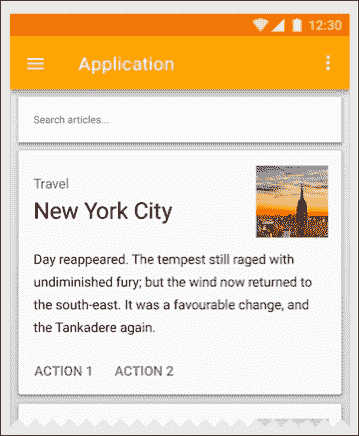

这是一个使用 Material Design 风格的应用示例；我们可以看到带有阴影的卡片、不同的内容以及带有导航抽屉的应用栏。所有这些组件都将在本书中进行讲解，我们将致力于构建一个使用相同风格的应用。

材料设计同时也带来了重要的 UI 元素，比如`RecyclerView`。这是一个视图，将替代早期 Android 中的`ListView`，用来创建任意类型的可滚动元素列表。我们将在第五章，*列表和网格*中处理这些组件，从`ListView`的基本版本开始，演进了解`RecyclerView`是如何诞生的，并以一个示例结束。

`CardView`是另一个引入的主要 UI 元素。我们可以在前面的图片中看到一个；这是一个带有背景和阴影的组件，可以自定义以适应我们想要的所有内容。我们将在第六章，*CardView 和材料设计*中处理它，同时也会介绍下一个组件——设计支持库。

设计支持库是一个包含动画、**FAB**（**浮动动作按钮**）和导航抽屉的*必备*库。你可能已经在其他应用中见过从左侧滑出的滑动菜单。设计支持库为旧版 Android 提供了这些组件的支持，使我们能够在旧版本中使用材料设计特性。

所有以上内容都是从 UI 和编程的角度来看的特性，但材料设计同时也为我们的手机引入了不同的功能，比如具有不同优先级级别的新通知管理系统。例如，我们可以指定哪些通知是重要的，并设定一个时间段，在这个时间段内我们不想被打扰。

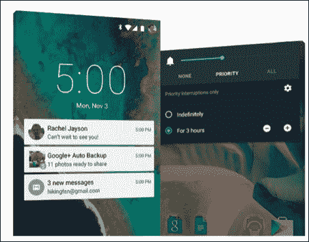

另一个我们不能忽视的是这个版本在电池消耗上的改进，与之前的 Android 版本相比，它最多可以节省 90 分钟的电池寿命，这得益于一个新的 Android 运行时 ART。用非技术性的方式来解释，它是在应用安装时将应用翻译成一种可以更快被 Android 理解的语言。之前的运行时**Dalvik**是在执行我们应用时进行这种翻译，而不是只在安装时一次翻译。这帮助应用消耗更少的电池并运行得更快。

# 介绍 Android 6 Marshmallow

这个版本的主要变化之一与应用的权限有关。在 Android M 之前，我们习惯在下载应用前接受应用的权限；应用商店会向我们展示一个应用拥有的权限列表，我们需要接受它们才能下载和安装应用。

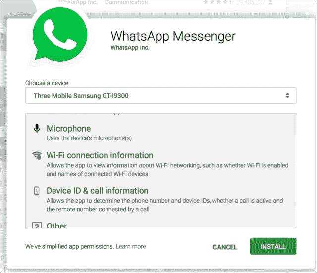

## 运行时权限

这在引入运行时权限后发生了变化。这里的理念是在你需要时才接受权限。例如，WhatsApp 在你进行通话或留下语音消息之前可能不需要访问你的麦克风。

在开发应用程序时，我们需要考虑到这一点；这对开发者来说是一种改变，现在他们需要控制如果用户不接受权限，应该做什么。以前，在安装时，我们只需做全有或全无的选择；而现在，在运行时，我们必须考虑用户的决策。

### 提示

**下载示例代码**

您可以从您在[`www.packtpub.com`](http://www.packtpub.com)的账户下载您购买的所有 Packt Publishing 书籍的示例代码文件。如果您在别处购买了这本书，可以访问[`www.packtpub.com/support`](http://www.packtpub.com/support)注册，我们会直接将文件通过电子邮件发送给您。

## 省电优化

自从 Lollipop 版本以来，我们的手机电池寿命有了另外一项改进；这次，谷歌引入了两种新的状态：**省电模式**和**应用待机**。

省电模式提高了空闲设备的睡眠效率。如果我们关闭屏幕并且没有使用手机，就会进入空闲状态。以前，应用程序可以在后台进行网络操作并继续工作；现在，引入了省电模式后，系统会定期允许我们的应用程序在后台工作，并执行其他挂起操作的一段时间。在开发时，这也需要考虑；例如，在这种模式下，我们的应用程序无法访问网络。

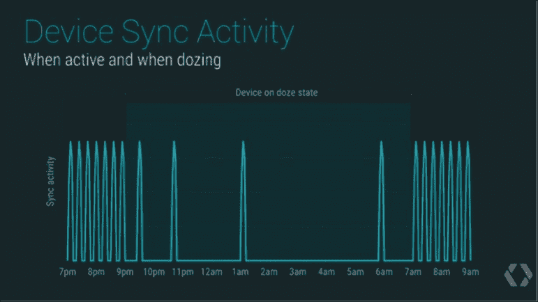

应用待机是一种针对长时间未使用且后台没有运行任何进程的应用程序引入的空闲模式。如果一个应用程序没有显示任何通知，并且用户没有明确要求它免除优化，那么它将进入待机模式。这种空闲模式防止应用程序访问网络和执行挂起的任务。当连接电源线时，所有处于待机状态的应用程序都会被释放，空闲限制也会被移除。

## 文本选择

在之前的版本中，当用户选择文本时，操作栏上会出现一组操作，如复制、剪切和粘贴。在这个版本中，我们可以在浮动的工具栏中显示这些操作以及更多内容，该工具栏将显示在选定内容的上方：

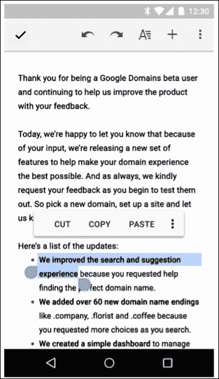

## 指纹认证

在这个版本的 Android 中，我们可以验证指纹的使用。身份验证可以在设备级别进行，以解锁手机，不仅仅是为了解锁一个特定的应用程序；因此，我们可以基于用户最近解锁设备的情况，在应用程序中验证用户。

我们有一个新的可用对象，`FingerprintManager`，它将负责身份验证，并允许我们显示一个请求指纹的对话框。我们需要一个带有指纹传感器的设备才能使用这个功能。

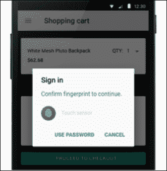

## 直接分享

直接分享是一个新增加的功能，用于简化内容分享过程。以前，如果我们处在图库中，想要将图片分享给 WhatsApp 中的一个联系人，我们必须点击**分享**，在应用列表中找到 WhatsApp，然后在 WhatsApp 中找到联系人来分享内容。这个过程将被简化，直接显示一个你可以直接分享信息给的联系人群列表：

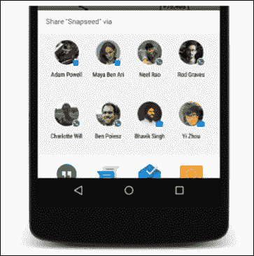

这些是与 Android 6 Marshmallow 一起发布的主要新特性；完整列表可以在[`developer.android.com/preview/index.html`](http://developer.android.com/preview/index.html)查看。

# 创建 MasteringAndroidApp

既然我们已经了解了最新 Android 版本的主要特性，接下来可以介绍我们在本书中将要开发的应用程序。这个应用程序将包括这些特性中的大部分，但我们也会花时间研究在之前 Android 版本中广泛使用的组件。

要掌握 Android，我们应该准备好理解遗留代码；例如，我们可能需要在一个仍然使用`ListView`而不是新出的`RecyclerView`的应用上工作。我们不会总是用最新的组件从零开始创建应用，特别是如果我们是专业的 Android 开发者。同时，查看之前的组件将帮助我们理解这些组件的自然演变，从而更好地了解它们现在的样子。

我们将从零开始创建这个应用，从最初的设计开始，看看在 Android 中最常用的设计和导航模式，比如顶部标签，左侧的滑动菜单等。

我们将要开发的这个应用，`MasteringAndroidApp`，是一个与服务器端交互的应用。这个应用将展示存储在云中的信息，我们将创建云组件，使我们的应用能够与其通信。我们为这个应用选择的主题是职位公告板，我们将在服务器端创建职位信息，应用用户可以阅读这些信息并接收通知。

你可以轻松地自定义主题；这将是一个你可以更改信息并使用相同结构创建自己应用的例子。实际上，如果你有自己的想法会更好，因为我们将讨论如何在 Play 商店发布应用以及如何实现盈利；我们将添加广告，当用户点击广告时会产生收入。所以，如果你使用自己的想法应用所学内容，等到你完成这本书时，你将拥有一个准备发布的应用。

我们将开发这个应用，并解释在 Android 中最常用的编程模式，以及并发技术和连接到 REST API 或服务器的方法。

我们不仅关注后端，也关注 UI；通过高效地展示信息，使用列表和网格，从互联网上下载图片，以及使用最新的材料设计特性来自定义字体和视图。

我们将学习如何调试我们的应用程序，管理日志，并在学习如何识别和防止内存泄漏时考虑内存使用。

我们的应用程序将基于一个数据库的离线模式，我们将把云中的内容存储在这里。因此，如果手机失去连接，我们仍然可以显示上次在线时可用信息。

为了完成我们的应用程序，我们将添加额外的功能，如推送通知、崩溃报告和数据分析。

最后，我们将了解 Android 构建系统的工作原理，以不同版本导出我们的应用程序，并对代码进行混淆以保护它，防止被反编译。

我们压缩了大量的信息，这将帮助您在本书结束时掌握 Android；但是，在开始我们的应用程序之前，让我们先准备好工具。

# 准备工具

在本书中我们需要用到的工具是最新版本的 Android Studio 和更新到 Android M 或更高版本的 Android SDK。还建议您使用**Genymotion**，这是一个用于测试应用程序的模拟器。

### 注意

首先，我们需要下载并安装 Android Studio，这是在 Android 上进行开发的官方工具。可以从[`developer.android.com/sdk/index.html`](http://developer.android.com/sdk/index.html)下载。

在网站的顶部，您可以根据您的操作系统版本找到一个下载链接。

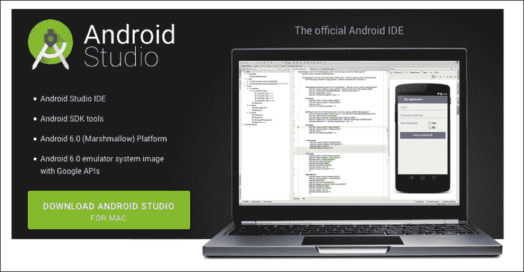

安装完成后，我们需要下载一个 Android M SDK，它将为特定 Android 版本的应用程序开发提供所有必要的类和资源。这是通过 SDK 管理器完成的，它是 Android Studio 内包含的一个工具。

我们可以点击**工具** | **Android** | **SDK 管理器**，或者在 Android Studio 最上方的栏中找到快捷方式。

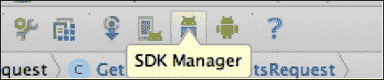

打开 SDK 管理器后，我们将看到一个可用 SDK 平台和 SDK 工具的列表。我们需要确保已安装最新可用的版本。

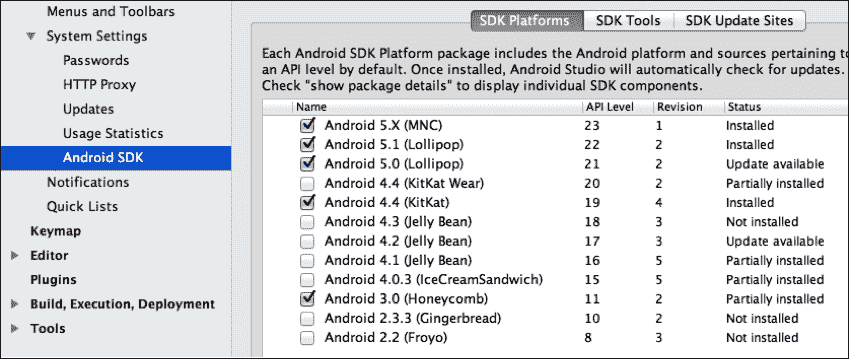

这样，我们就有了我们开发应用程序所需的一切。为了测试它，理想情况下应该有 Genymotion，这是一个 Android 模拟器，它将帮助我们测试在不同设备上的应用程序。

我们使用这个模拟器而不是 Android 默认模拟器的主要原因是速度。在 Genymotion 上部署应用程序甚至比使用物理设备还要快。除此之外，我们还受益于其他功能，例如可调整大小的窗口、从我们的计算机复制和粘贴，以及使用默认模拟器时耗时的一些小细节。可以从[`www.genymotion.com`](https://www.genymotion.com)下载。

我们需要做的就是安装它，一旦打开，我们就可以添加具有现有设备包含相同功能的模拟器。

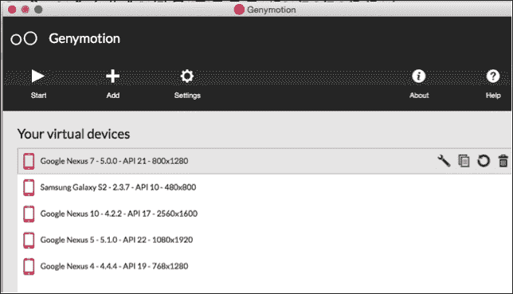

# 总结

在本章中，我们回顾了最新版本的 Android 中的重要变化，重点介绍了 Android Marshmallow 和 Material Design。

我们说明了将在本书的学习过程中开发的应用程序中将执行的操作以及创建它所需的工具。

在下一章中，我们将研究 Android 中现有的设计模式并开始设计我们的应用程序。
