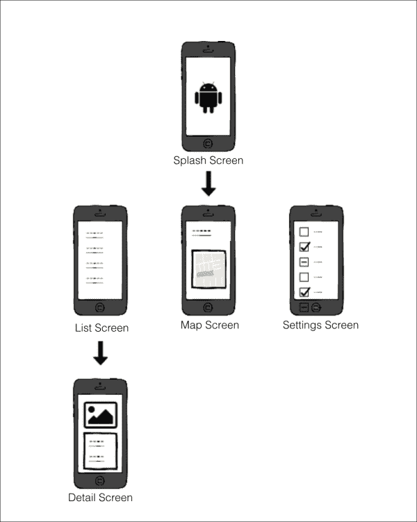
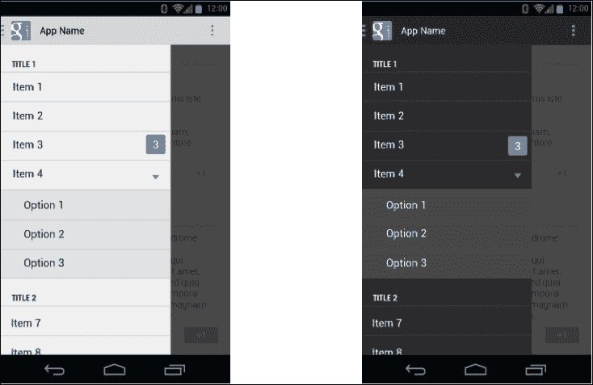
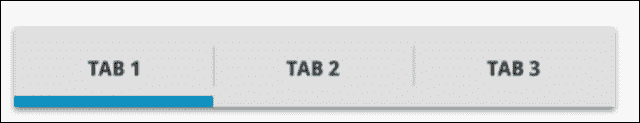
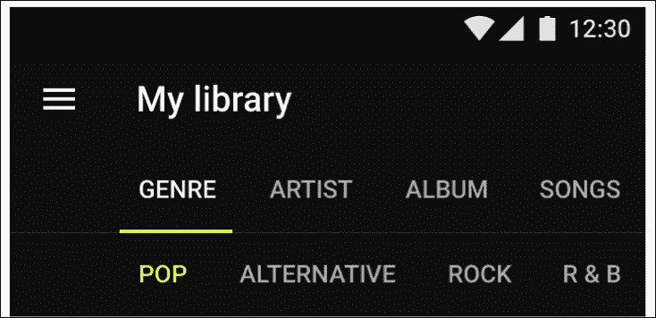
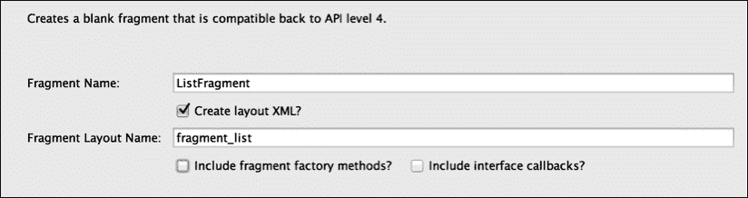
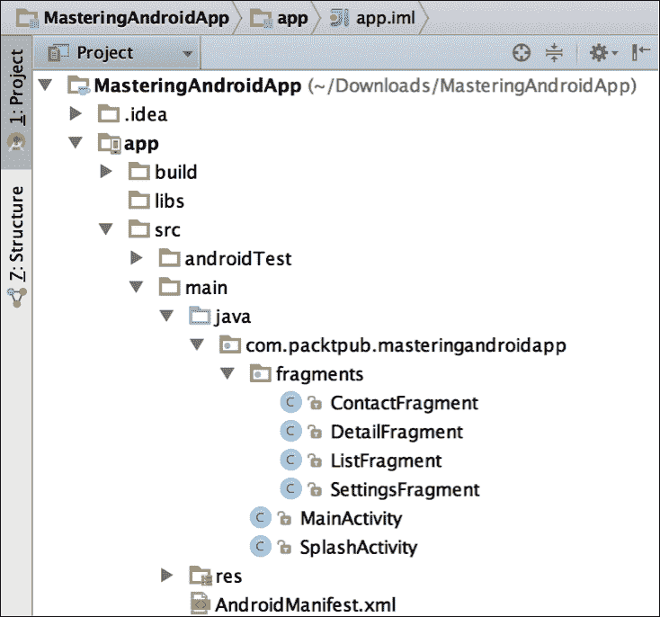
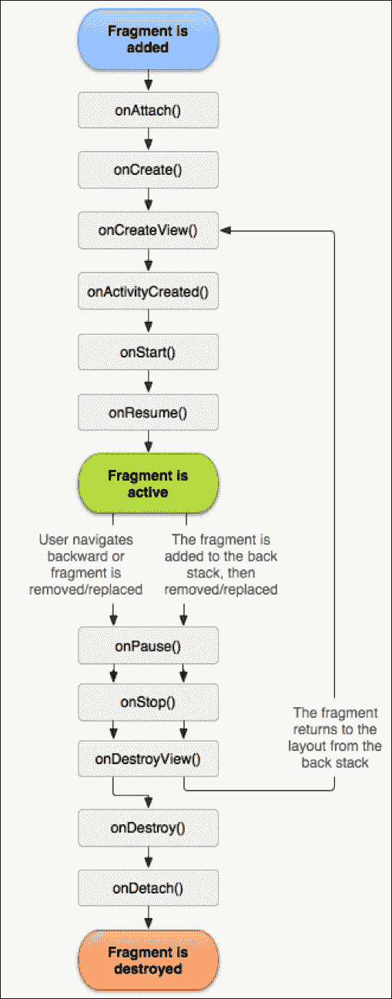
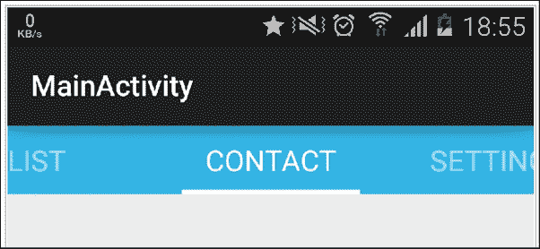

# 第二章：设计我们的应用

在本章中，我们将为应用想出一个点子，并将这个点子转化为真实的应用，创建要在屏幕上显示的基本结构，并选择一个合适的导航模式在它们之间移动。

在查看最常用的导航模式之后，我们将继续实现由片段和`ViewPager`组成的标签模式。

在此期间，我们将回顾关于片段的知识，以便能够解释高级概念。我们还将讨论`FragmentManager`和片段后退栈的重要性。

最后，我们将在屏幕过渡中添加一些美观的动画。因此，本章我们将涵盖以下主题：

+   选择应用导航模式

+   精通片段

+   实现标签和 ViewPager

+   屏幕之间的动画过渡

# 选择应用导航模式

假设有一天你醒来时感到很有灵感；你有一个应用点子，你认为它可能比 WhatsApp 还要受欢迎。不要浪费时间，你会想要将这个应用点子变为现实！这就是为什么你需要学习如何设计应用并选择最合适的导航模式。不是要让你失去信心，但你会发现你的 99%的点子已经在 Google Play 商店里了。事实上，有数十万个应用可供选择，而且这个数字还在不断增加！所以，你可以选择改进已有的应用，或者继续头脑风暴，直到你有一个原创的点子。

为了将应用变为现实，第一步是在脑海中可视化应用；为此，我们需要确定基本组件。我们需要在屏幕上简化想法，并且需要在屏幕之间移动。

请记住，你正在为 Android 用户创建这个应用。这些用户习惯于使用如 Gmail、Facebook 和 Spotify 等应用中的滑动面板这样的导航模式。

我们将看看三种不同的常用导航模式，这些模式保证用户在我们的应用中不会迷失方向，并能立即理解应用结构。

## 基本结构

为了绘制我们的屏幕（请注意，我这里不是指活动或片段；所谓屏幕是指用户在我们的应用执行期间任何时候实际可以看到的内容），我们需要确定我们想法的关键点。我们需要用软件开发术语来建立用例。

让我们从确定本书学习过程中要构建的应用的形状开始：**MasteringAndroidApp**。一开始很难在脑海中想象出所有细节，所以我们将从确定我们肯定需要的组件开始，稍后再填补可能存在的空白。

我们从上一章知道，我们有一个演示屏幕，它会在需要时从互联网下载数据的同时显示应用的徽标几秒钟。

在这个应用程序中，我们还将有一个包含来自互联网的信息列表的屏幕，用户可以点击单个项目获取更详细的信息。

作为主要选项，我们将展示一个带有`MapView`显示我的位置和联系数据的联系人屏幕。

最后，我们需要一个**偏好设置**或**设置**屏幕，在这里我们可以打开或关闭通知，以及禁用广告或购买额外内容。

现在，我们已经准备好创建一个草图。请看以下图片：



首先，我们有应用程序的入口点，即启动屏幕。这里的导航很直接；我们可以直接导航到下一个屏幕，并且没有按钮或任何其他可能的流程。

在下一级，我们有一个项目列表的屏幕（即带有联系信息的屏幕）、一个地图视图和一个设置屏幕。这三个屏幕在我们的应用程序中处于同一级别，因此它们具有同等的重要性。

最后，我们有一个第三层导航，即列表项的详细视图。

我们打开这个屏幕的唯一方式是点击列表中的一个元素；因此，这个屏幕的入口点是列表屏幕。

既然我们已经建立了一个基本的结构和流程，接下来我们将研究各种广泛使用的导航模式，以决定哪一种最适合我们的应用程序。

### 注意

有关应用程序结构和有关材料设计类似信息的更多信息，请参考以下链接：

[`developer.android.com/design/patterns/app-structure.html`](https://developer.android.com/design/patterns/app-structure.html)

[`www.google.com/design/spec/patterns/app-structure.html#`](http://www.google.com/design/spec/patterns/app-structure.html#)

## 仪表板模式

仪表板模式是 Android 中最早使用的模式之一。它由一组在主屏幕上以图标矩阵形式显示的元素组成。在以下图片中，我们可以看到左侧是 Facebook 应用程序的早期版本，右侧是 Motor Trend 对该模式的定制：


这种视图非常适合那些旨在清晰显示非常有限的选项的应用程序；每行不超过两个元素，行数适合屏幕显示。

这些图标清晰地展示了主要功能的符号，所有选项都在同一级别。这对于拥有大量目标受众的应用程序来说是一个理想的模式；它简单明了，一目了然，任何人都可以进行导航。

尽管这个设计看起来很古老，考虑到它曾在 Android 的第一个版本中被广泛使用，现在使用得较少，但它的使用取决于您的需求，因此不要因此而放弃。前面图片中显示的 Motor Trends 应用程序对这个模式有一个非常原始的实现。

如果元素不适合屏幕显示，我们需要滚动才能发现它们，那么我们需要重新考虑这个模式。当我们元素太少时也同样适用；这些情况下有更好的选择。在我们的具体示例中，我们有三个主要元素，因此我们将不使用此模式。

## 滑动面板

这种模式因如 Gmail 和 Facebook 等应用而广为人知。它在用户界面的顶层展示一个布局；当我们执行滑动手势或点击左上或右上按钮时，屏幕会从左或右滑出，这个按钮通常是一个显示三条水平线的图标，也被称为汉堡图标。

如果我们的应用在同一层级有大量选项，这个模式是完美的，并且它可以与其他模式结合使用，比如**选项卡模式**。

此面板的实现可以通过`DrawerLayout`类完成，它由两个子视图组成：包含内容和导航抽屉的`FrameLayout`，导航抽屉可以是`ListView`或包含选项的任何其他自定义布局。

为此，执行以下代码：

```kt
<android.support.v4.widget.DrawerLayout    
   android:id="@+id/drawer_layout"   
   android:layout_width="match_parent"   
   android:layout_height="match_parent" >   

   <FrameLayout   
    android:id="@+id/frame_container"   
    android:layout_width="match_parent"   
    android:layout_height="match_parent" />   

   <ListView   
    android:id="@+id/drawer_list"   
    android:layout_width="240dp" 
    android:background="#fff"  
    android:layout_height="match_parent"   
    android:layout_gravity="start" />   

  </android.support.v4.widget.DrawerLayout>
```

一旦我们在侧面板中选择了一个元素，屏幕中间就会出现一个子元素；这个子元素可以帮助你导航到子子元素，但绝不能导航到主菜单的元素。子元素和子子元素的导航可以通过后退按钮或操作栏中的向上导航来管理。

我们可以通过点击一个条目来关闭面板，并通过设置一个抽屉监听器`ActionBarDrawerToggle`来知道面板是关闭还是打开，它包含`onDrawerClosed(View drawerView)`和`onDrawerOpened(View drawerView)`方法。

确保你使用的是`android.support.v7.app`中的`ActionBarDrawerToggle`，v4 中的已弃用。

这种模式的另一个大优点是它允许通过菜单上的主项目进行分组导航，可以展开成子项目。正如以下示例所示，项目 4 在下拉菜单中有三个选项：



抽屉布局的一个示例

这对我们的应用程序来说并不合适，因为我们没有足够的选项来充分利用这个模式。此外，由于这个模式可以与选项卡模式结合，从教育角度来看，用这个模式开发我们的示例更有意义。

## 选项卡

选项卡模式是一种你可能之前见过并使用过的模式。

它显示了一个具有同一层级组件的固定菜单。注意，当我们有选项卡时，菜单总是可见的，这在滑动和仪表板模式中不会发生。这看起来与网页界面非常相似，并且考虑到用户可能已经熟悉这个模式，它非常用户友好。

以下模式有两个变体：固定和滑动选项卡。如果我们只有少量可以适应屏幕的菜单项，第一个变体将是最合适的，因为它一次向用户展示所有项目。



当所有项目不适合屏幕或适合但知道将来会添加更多项目而无法容纳时，通常会使用滑动标签页。

这两个变体的实现略有不同，因此我们需要在决定变体时考虑未来的变化。在这里，我们可以看到一个滑动变体的实现：


### 提示

记住，为了平台一致性，我们必须将标签放在屏幕顶部；否则，人们会认为你是 iOS 开发者！

以下是一些供你遵循的材料设计指南中的功能和格式规范：

+   将标签作为单行呈现。如果需要，将标签文字换行到第二行，然后截断。

+   不要在标签页内包含一组标签化内容。

+   高亮显示与可见内容对应的标签页。

+   按层次结构将标签页分组。将一组标签与其内容连接起来。

+   保持标签与其内容相邻。这有助于减少两者之间的歧义，保持关系。

在以下图片中，我们可以看到一个带有子菜单的滚动/滑动标签页的例子：



### 注意

设计标签时图形规格以及有关标签规范更多信息可以在[`www.google.com/design/spec/components/tabs.html#`](http://www.google.com/design/spec/components/tabs.html#)找到。

既然我们已经了解了应用导航的基础知识，我们可以探索实现这些模式所需的组件。正如你所知，主要组件是活动和片段。我们将实现一个带有三个片段的滑动标签页的例子。

# 片段

在本节中，我们将简要回顾片段的关键概念，以解释高级功能和组件，如片段管理器和片段回退栈。

在我们的例子中，我们将创建一个名为`MainActivity`的活动和四个片段：`ListFragment`、`ContactFragment`、`SettingsFragment`和`DetailsFragment`。为此，你可以创建一个`fragments`包，双击该包装进入**新建** | **片段** | **空白片段**。看看以下对话框：



现在，你可以不使用片段工厂方法和接口回调来创建它们。我们将在本章后面介绍这些内容。

目前我们的项目在**项目**视图中应该看起来像这样：



## 理解片段的重要性

片段代表活动中的行为或用户界面的一部分。你可以在单个活动中组合多个片段来构建多窗格 UI，并在多个活动中重用片段。你可以将片段视为活动的模块化部分，它有自己的生命周期并接收自己的输入事件，你可以在活动运行时添加或移除（有点像可以在不同活动中重用的*子活动*）。



片段的生命周期与活动的生命周期略有不同。我们注意到的第一个区别是使用了`OnAttach()`和`OnDetach()`方法，它们将片段与活动连接起来。

在`onCreate()`中使用，我们可以在`OnCreateView()`中创建视图；在这之后，我们可以在片段中调用`getView()`，它不会是 null。

`onActivityCreated()`方法告诉片段其活动在其自身的`Activity.onCreate()`中已完成。

有两种方法可以显示一个片段：

第一种方式是在我们的布局 XML 中拥有片段。这将创建我们的片段，当包含它的视图被填充时。执行以下代码：

```kt
<LinearLayout 
    android:orientation="horizontal"
    android:layout_width="fill_parent"
    android:layout_height="fill_parent">

    <fragment android:name="com.example.android.MyFragment"
              android:id="@+id/headlines_fragment"
android:layout_width="match_parent"
              android:layout_height="match_parent" />
</LinearLayout>
```

第二种方式是程序化创建我们的片段，并告诉片段管理器在容器中显示它。为此，你可以使用以下代码：

```kt
<LinearLayout 
    android:orientation="horizontal"
    android:layout_width="fill_parent"
    android:layout_height="fill_parent">

    <Framelayout android:id="@+id/fragment_container"
android:layout_width="match_parent"
             android:layout_height="match_parent" />

</LinearLayout>
```

之后，使用以下代码行填充一个`FrameLayout`容器，片段将被插入到其中：

```kt
Myfragment fragment = MyFragment.newInstance();
getSupportFragmentManager().beginTransaction()
                    .add(R.id.fragment_container, fragment).commit();
```

为了结束关键概念，解释为什么 Android 示例使用`MyFragment.newInstance(params)`工厂方法创建片段而不是使用默认的`new MyFragment(params)`构造函数是很重要的。请看以下代码：

```kt
public class MyFragment extends Fragment {

 // Static factory method that returns a new fragment
 // receiving a   parameter and initializing the fragment's arguments

    public static MyFragment newInstance(int param) {
        MyFragment fragment = new MyFragment();
        Bundle args = new Bundle();
        args.putInt("param", param);
        fragment.setArguments(args);
        return fragment;
    }
}
```

这种模式背后的原因是，Android 只使用默认构造函数重新创建片段；因此，如果我们有一个带参数的构造函数，它将被忽略，参数将丢失。

### 提示

请注意，我们将参数作为 bundle 中的参数传递，这样如果片段需要被重新创建（由于设备方向改变，我们使用后退导航），片段就可以检索参数。

## 片段管理器

片段管理器是一个接口，用于与活动内的片段交互。这意味着任何操作，如添加、替换、移除或查找片段，都必须通过它来完成。

要获取片段管理器，我们的`Activity`需要继承自`FragmentActivity`，这将允许我们调用`getFragmentManager()`或`getSupportFragmentManager()`，优先选择后者因为它使用了`Android.support.v4`中包含的向后兼容的片段管理器。

如果我们想使用嵌套片段，可以用`getChildFragmentManager()`来管理它们。当布局包括`<fragment>`时，你不能将布局填充到片段中。只有当动态地将嵌套片段添加到片段中时，才支持嵌套片段。

现在，我们将讨论在使用片段时迟早会遇到的一些场景。设想我们有一个带有两个片段 A 和 B 的活动。

一个典型的情况是，我们处于一个片段中，并希望执行活动中的方法。在这种情况下，我们有两个选择；一个是 在`MyActivity`中实现一个`public`方法，例如`doSomething()`，这样我们可以将`getActivity`强转为我们的活动，并调用`((MyActivity)getActivity).doSomething();`方法。

第二种方法是让我们的活动实现碎片中定义的接口，并在`onAttach(Activity)`方法中将活动的实例设置为该接口的监听器。我们将在第四章 *并发与软件设计模式*中解释这种软件模式。反过来，如果要让活动与碎片通信（如果我们没有在活动的变量中实例化碎片 A），我们可以找到管理器中的碎片。我们将在下一节中查看如何使用容器 ID 或标签查找碎片：

```kt
FragmentManager fm = getSupportFragmentManger();
FragmentA fragmentA = fm.findFragmentById(R.id.fragment_container);
fragmentA.doSomething(params);
```

最后一种情况是在碎片 A 中与 B 对话；为此，我们只需从活动中获取管理器并查找碎片。运行以下代码：

```kt
FragmentManager fm = getActivity().getSupportFragmentManger();
FragmentA fragmentA = fm.findFragmentById(R.id.fragment_container);
fragmentA.doSomething(params);
```

## 碎片堆栈

我们一直在谈论在碎片管理器中查找碎片，这要归功于碎片管理器的碎片堆栈，我们可以在事务期间添加或移除碎片。

当我们想要动态显示一个碎片时，我们可以决定是否要将碎片添加到堆栈中。将碎片放在堆栈上允许我们导航回上一个碎片。

这对于我们的示例非常重要；如果用户在第一个标签页上，点击列表中的项目，我们希望他能看到详情屏幕，`DetailsFragment`。现在，如果用户在`DetailsFragment`上，点击返回按钮，我们不希望他离开应用；我们希望应用能导航回碎片堆栈。这就是为什么我们在添加`DetailsFragment`时，必须包含`addToBackStack(String tag)`选项。标签可以为 null，也可以是一个`String`类型，这将允许我们通过标签找到这个新碎片。它将类似于以下内容：

```kt
FragmentTransaction ft = getFragmentManager().beginTransaction();
ft.replace(R.id.simple_fragment, newFragment);
ft.addToBackStack(null);
ft.commit();
```

进一步说明，如果我们想在三个碎片之间导航，*从 A 到 B 再到 C*，然后返回，拥有一个堆栈将允许我们从*C 到 B 再到 A*。然而，如果我们不将碎片添加到返回堆栈，或者如果我们在同一个容器中添加或替换它们，*从 A 到 B 再到 C*，这将只留下 C 碎片，并且无法进行返回导航。

现在，要在`DetailsFragment`中实现返回导航，我们必须让活动知道，当我点击返回时，我想首先在碎片中导航回退，然后才退出应用，这是默认的行为。如果堆栈中有一个以上的碎片，可以通过覆盖`onKeyDown`并处理碎片导航来实现。运行以下命令：

```kt
@Override
public boolean onKeyDown(int keyCode, KeyEvent event) {
if (keyCode == KeyEvent.KEYCODE_BACK && getSupportFragmentManager.getBackStackEntryCount > 1) {
getSupportFragment.popBackStack();
return true;
}
return super.onKeyDown(keyCode, event);
}
```

# 视图翻页器

继续我们的示例，在`MainActivity`上有两种在碎片之间导航的方法：通过点击标签或通过在碎片间滑动。为了实现这一点，我们将使用`ViewPager`，包括其中的滑动标签，这是一个非常优雅的解决方案，代码量最少，并包括滑动与标签之间的同步。

`ViewPager`可用于滑动任何类型的视图。我们可以用`ViewPager`创建一个图片画廊；在一些应用首次运行时，常见到使用滑动屏幕来展示如何使用应用的教程，这是通过`ViewPager`实现的。要将`ViewPager`添加到`MainActivity`，我们可以简单复制并粘贴以下代码：

```kt
<?xml version="1.0" encoding="utf-8"?>
<android.support.v4.view.ViewPager

android:id="@+id/pager"
android:layout_width="match_parent"
android:layout_height="match_parent" />
```

在*ViewPager*部分最后，我们将了解如何使用不同的第三方库来改善标签页的体验，以及如果我们想要自定义解决方案，如何手动创建这些标签页。

## 适配器

`ViewPager`与适配器一起工作；适配器是负责创建我们滑动的每个*页面*的元素。在滑动片段的特殊情况下，我们可以使用`Adapter`类的扩展，称为`FragmentPagerAdapter`和`FragmentStatePagerAdapter`：

+   `FragmentStatePagerAdapter`保存页面的状态，在屏幕上不显示时销毁它，并在需要时重新创建，类似于`ListView`对其行所做的处理。

+   `FragmentPagerAdapter`将所有页面保存在内存中；因此，在滑动时没有与保存和恢复状态相关的计算成本。我们可以拥有的页面数量取决于内存。

根据元素的数量，我们可以选择其中一种。如果我们正在创建一个阅读新闻的应用，用户可以在带有图片和不同内容的新闻文章之间滑动，我们不会尝试将所有内容都保存在内存中。

我们有三个固定标签，因此我们将选择`FragmentPagerAdapter`。我们将创建一个包适配器，并创建一个扩展`FragmentPagerAdapter`的`MyPagerAdapter`类。在扩展它时，我们需要覆盖`getCount()`和`getItem(int i)`方法，这些方法返回项目的数量和给定位置的项目。

创建构造函数并完成方法后，我们的类将类似于以下代码：

```kt
public class MyPagerAdapter extends FragmentPagerAdapter {

    public MyPagerAdapter(FragmentManager fm) {
        super(fm);
    }

    @Override
    public Fragment getItem(int i) {
        switch (i) {
            case 0 :
                return new ListFragment();
            case 1 :
                return new ContactFragment();
            case 2 :
                return new SettingsFragment();
            default:
                return null;
        }
    }

    @Override
    public int getCount() {
        return 3;
    }
}
```

最后，我们需要在`MainActivity`中将适配器设置到页面。执行以下代码：

```kt
public class MainActivity extends FragmentActivity {

    @Override
    protected void onCreate(Bundle savedInstanceState) {
        super.onCreate(savedInstanceState);
        setContentView(R.layout.activity_main);

        MyPagerAdapter adapter = new MyPagerAdapter(getSupportFragmentManager());
        ViewPager viewPager = (ViewPager) findViewById(R.id.pager);
        viewPager.setAdapter(adapter);

    }

}
```

## 滑动标签

在我们的示例中，此时我们已经能够在片段之间滑动。现在，我们将使用`PagerTabStrip`或`PagerTitleStrip`添加标签。

有一种非常优雅的实现方式，即在`ViewPager`的 XML 标签中包含`PageTabStrip`。执行以下代码：

```kt
<?xml version="1.0" encoding="utf-8"?>
<android.support.v4.view.ViewPager

android:id="@+id/pager"
android:layout_width="match_parent"
android:layout_height="wrap_content">

    <android.support.v4.view.PagerTabStrip
        android:id="@+id/pager_title_strip"
        android:layout_width="match_parent"
        android:layout_height="wrap_content"
        android:layout_gravity="top"
        android:background="#33b5e5"
        android:textColor="#fff"
        android:textSize="20dp"
        android:paddingTop="10dp"
        android:paddingBottom="10dp" />

</android.support.v4.view.ViewPager>
```

在这里，`PagerTabStrip`会找到页面的标题，并为每个页面显示一个标签。我们需要在`MyPagerAdapter`中添加`getPageTitle`方法，这将返回每个页面的字符串。在我们的案例中，这将是部分名称：列表、联系人及设置。为此，你可以使用以下代码：

```kt
@Override
public CharSequence getPageTitle(int position) {
  switch (position) {
    case 0 :
    return "LIST";
    case 1 :
    return "CONTACT";
    case 2 :
    return "SETTINGS";
    default:
    return null;
  }
}
```

运行应用，瞧！我们轻松实现了一个流畅的标签页和滑动导航支持，支持 Android 1.6（API 4）：



## 自定义标签

Android 中的标签有一段很长的历史；最初，标签是通过`TabActivity`实现的，但在 API 13 中被废弃，并演变成了`FragmentTabHost`。

因此，我按照 Android 文档，开心地使用`TabHost`开发了一个应用，并意识到这必须改变。起初，我抱着侥幸心理，希望废弃不会影响我的应用，直到一些用户抱怨崩溃问题。然后，不可避免地，我必须移除废弃的`TabHost`并寻找新方法。

起初，`FragmentTabHost`似乎是拥有固定标签的好方法，但它不允许标签上带有图标。在遇到这个问题，并在 Stack Overflow 上发现其他人也有同样的问题时（一个我们可以提问和找到关于 Android 和其他主题答案的网站），我决定寻找其他方法。

在 API 11 中，出现了`ActionBar.Tab`的概念，这是一个允许我们向操作栏添加标签的类。最终，我找到了一种在应用中添加标签的方法，这让用户很开心！但这种喜悦并未持续太久；`ActionBar.Tab`又被废弃了！

这件事会让任何开发者的耐心耗尽；这让我创建了在`LinearLayout`中以按钮形式呈现的标签。在按钮上设置点击监听器，点击标签时，我会将`ViewPager`滑动到正确的页面，反之亦然，当检测到`ViewPager`页面滑动时，我会选择正确的标签。努力是值得的，因为它让我在设计标签时有完全的自由度，更重要的是，它给了我满足感，除非有一天`LinearLayout`或`Button`被废弃，否则它总是能工作！

你总可以将自己的实现作为最后的选择。如今，如果你不喜欢滑动标签的设计，还有第三方库的其他选择，比如`ViewPagerIndicator`和`PagerSlidingTabStrip`。

### 注意

若要了解更多信息，你可以查看以下链接：

[ViewPagerIndicator 的 GitHub 仓库](https://github.com/JakeWharton/ViewPagerIndicator)

[PagerSlidingTabStrip 的 GitHub 仓库](https://github.com/astuetz/PagerSlidingTabStrip)

# 过渡效果

比如创建我们自己的屏幕过渡动画等小细节，这些都能让我们的应用更加精致，看起来更加专业。

我们的示例非常适合讨论过渡，因为我们有两种类型的屏幕过渡：

+   第一个转换是活动之间的转换，从`SplashActivity`到`MainActivity`

+   第二个转换（尚未实现）是片段之间的转换，其中`ListFragment`被`DetailsFragment`替换。

对于活动之间的过渡，我们需要在启动新活动之前调用`overridePendingTransition`。该方法接收两个动画作为参数，这些动画可以是我们创建的 XML 文件中的，也可以是 Android 中已经创建的动画。运行以下命令：

```kt
overridePendingTransition(android.R.anim.fade_in, android.R.anim.fade_out);
```

在我们的示例中，我们不允许可返回导航到`SplashActivity`；然而，如果我们处于活动之间的过渡，并希望在点击返回时拥有相同的过渡效果，我们就必须重写返回键并在此处设置我们的过渡效果。为此，你可以运行以下命令：

```kt
@Override public void onBackPressed() {
   super.onBackPressed();        overridePendingTransition(android.R.anim.fade_in,  android.R.anim.fade_out); 
}
```

在片段的情况下，我们需要在`FragmentTransaction`对象中指定过渡。使用对象动画师，我们可以在两个文件中定义这一点：`enter.xml`和`exit.xml`。执行以下代码：

```kt
FragmentTransaction transaction = getFragmentManager().beginTransaction();
transaction.setCustomAnimations(R.animator.enter, R.animator.exit);
transaction.replace(R.id.container, new DetailsFragment());
transaction.commit();

enter.xml

<?xml version="1.0" encoding="utf-8"?>
<set>
     <objectAnimator

         android:duration="1000"
         android:propertyName="y"
         android:valueFrom="2000"
         android:valueTo="0"
         android:valueType="floatType" />
</set>

exit.xml 
<?xml version="1.0" encoding="utf-8"?>
<set>
    <objectAnimator

        android:duration="1000"
        android:propertyName="y"
        android:valueFrom="0"
        android:valueTo="-2000"
        android:valueType="floatType" />
</set>
```

对于 Android Lollipop 及其之后的版本，你可以直接为 Fragment 设置过渡。使用以下代码片段：

```kt
Fragment f = new MyFragment();
f.setEnterTransition(new Slide(Gravity.RIGHT));
f.setExitTransition(new Slide(Gravity.LEFT));
```

# 总结

在本章结束时，你应该了解基本的导航模式，并能将你心中应用程序的想法转化为 Android 应用程序的实际结构。Fragments 是 Android 开发中的关键概念，我们在本章中已经花费足够的时间通过复习 Fragment Manager 和片段回退栈来掌握它们，并学习如何面对诸如它们之间的通信等常见问题。我们考虑了一个带有`PagerTabStrip`的`ViewPager`的工作示例，它将页面标题作为标签显示，你现在知道如果需要如何自定义它。我们有一个应用程序的框架；这个项目可以在这一阶段保存，并用作你未来开发的模板。我们已经准备好继续发展我们的应用程序。

在下一章中，我们将学习如何创建和访问将填充我们片段和`ViewPager`的内容，以使我们的应用程序生动起来。
