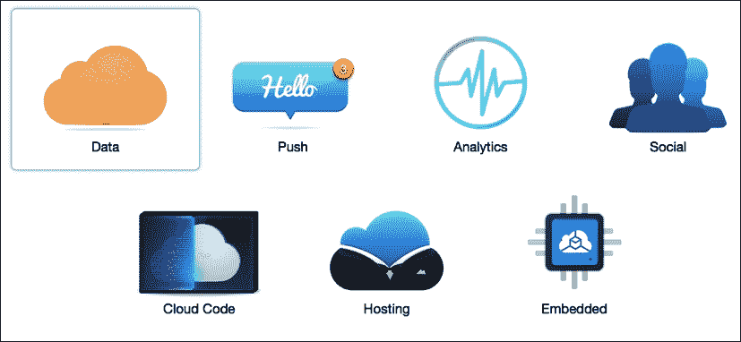
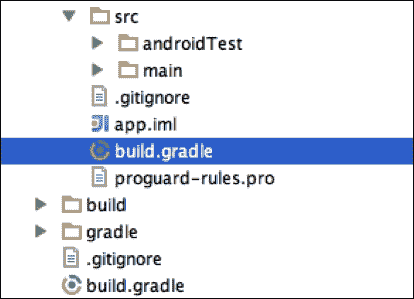
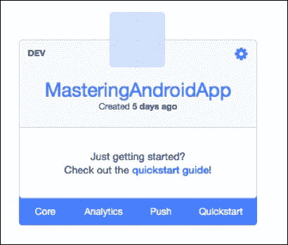
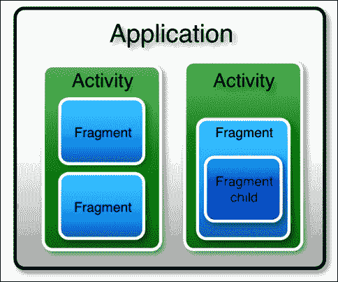
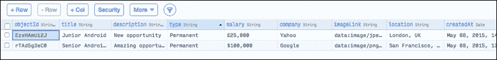
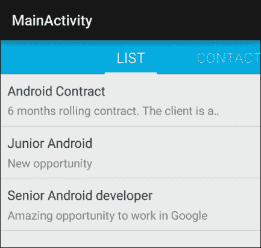

# 第三章：从云端创建和访问内容

在本章中，我们将学习如何使用我们的应用程序从网络上获取内容；这些内容可能是一个 XML 或 JSON 文件中的项目列表（我们希望展示的内容），从互联网上获取。例如，如果我们正在构建一个显示当前天气状况的应用程序，我们需要联系外部 API 以获取所需的所有信息。

我们将在 Parse 中创建自己的云数据库，这项服务允许我们非常快速地完成这一操作，而无需创建和维护自己的服务器。除此之外，我们还将用要在`MasteringAndroidApp`中展示的信息填充数据库。

我们还将介绍与 Google Volley 网络请求相关的最佳实践，使用超快的 HTTP 库 OkHttp，以及使用 Gson 高效地解析请求的对象。我们将在本章中介绍以下主题：

+   创建你自己的云数据库

+   从 Parse 中消费内容

+   Google Volley 和 OkHttp

+   使用 Gson 解析对象

# 创建你自己的云数据库

在项目的这个阶段，我们必须开始构建我们自己的版本的`MasteringAndroidApp`。你可以自由地开发自己的思路，并使用数据库存储自己的数据。以本例为指南，你不必严格按照我写的代码逐行复制。实际上，如果你在本书的最后开发出自己的示例，你将得到一个你可以使用的东西。例如，你可以创建一个供个人使用的应用程序，如任务提醒、旅行日记、个人照片画廊，或任何适合在云端存储的东西。

你也可以尝试将这个应用货币化；在这种情况下，你应该尝试为用户开发一些有趣的东西。例如，它可以是新闻源阅读器或食谱阅读器；它可以是任何可以提交内容到云端并通知用户新内容可用的应用。

在此过程中，我们将解释`Application`类的重要性，该类用于在我们的项目中设置 Parse。

## Parse

如果你每秒的请求少于 30 次，Parse 是免费的。我猜想，如果你的应用有足够的用户每秒请求信息 30 次，即每分钟 1,800 次，你肯定能负担得起升级到付费账户，甚至构建自己的服务器！这项服务是一种非常简单且可靠的方法，可以为你的应用提供服务器端支持。此外，它还提供推送通知服务和分析，这也是它的一个优点。

我们将开始创建一个新账户；之后，我们需要在 Parse 中为我们的应用程序命名。在这里，我将使用`MasteringAndroid`。命名应用程序后，你将进入账户的主页。我们需要导航至**数据服务** | **移动端** | **Android** | **原生 Java**。

下图展示了作为云的数据服务：



## 将 Parse SDK 添加到我们的项目中

要从我们的应用程序访问数据服务，我们需要安装 **Parse SDK**（**系统开发工具包**）。为此，Parse 指引我们查看一个快速入门指南，其中包含所有代码，包括我们应用程序的 API 密钥，这些代码已准备好复制并粘贴到我们的项目中。

基本上，我们需要完成两个步骤：

1.  第一步是下载一个 `.jar` 库文件，我们需要将其复制到项目中的 `libs` 文件夹内。复制后，我们需要告诉我们的构建系统在应用程序中包含这个库。为此，我们需要在 Application 文件夹内找到 `build.gradle` 文件（注意，我们的项目中有两个 `build.gradle` 文件），并添加以下几行：

    ```kt
    dependencies {
      compile 'com.parse.bolts:bolts-android:1.+'
      compile fileTree(dir: 'libs', include: 'Parse-*.jar')
    }
    ```

1.  在下图中，你可以看到两个名为 `build.gradle` 的文件；被选中的是正确的文件：

1.  第二步是在我们的项目中初始化 Parse SDK；为此，我们可以直接导航到[`www.parse.com/apps/quickstart?app_id=masteringandroidapp`](https://www.parse.com/apps/quickstart?app_id=masteringandroidapp)。在链接中替换你自己的应用 ID，或者通过点击主页找到链接，如下面的截图所示：

1.  点击 **快速入门指南** 后，转到 **数据** | **移动** | **Android** | **原生** | **现有项目**。

1.  如果尚未添加，系统会提示你在 `AndroidManifest.xml` 文件中添加 `INTERNET` 和 `ACCESS_NETWORK_STATE` 权限。

## Android 的 Application 类

接下来我们要注意的一点是，我们需要将初始化 Parse 的代码添加到我们的 `Application` 类中；然而，我们的 `Application` 类在项目中默认并未创建。我们需要创建并了解 `Application` 类是什么以及它是如何工作的。

要创建一个 Application 类，我们将在包上右键点击并创建一个新的 Java 类，名为 `MAApplication`，继承 `Application`。一旦继承了 `Application`，我们就可以重写 `onCreate` 方法。然后，我们将在类内部右键点击 | **生成**。 | **重写方法** | **onCreate**。

这将重写 `onCreate` 方法，我们将准备好在那里实现我们自己的功能。`onCreate` 方法每次创建我们的 `Application` 时都会被调用；因此，它是初始化我们的库和第三方 SDK 的正确位置。现在，你可以按照快速入门指南中看到的 Parse 初始化行进行复制和粘贴。

### 提示

请注意，这是唯一的，对于你自己的账户，你应该有自己的密钥。

```kt
Parse.initialize(this, "yourKeyHere", "yourKeyHere");
```

最后，我们需要告诉我们的应用程序有一个新的 `Application` 类，并且我们想要使用这个类；如果我们不这样做，我们的 `Application` 类将不会被识别，`onCreate` 也不会被调用。

在我们的清单文件中，我们需要在 `<application>` 标签内设置属性名称以匹配我们自己的应用程序。执行以下代码：

```kt
<application
    android:name="MApplication "
    android:icon="@drawable/ic_launcher"
    android:label="@string/app_newname"
>
```

应用程序类封装了我们应用中的所有内容；活动包含在应用程序中，随后，片段包含在**活动**中。如果我们需要在应用中访问所有活动/片段的全局变量，这将是一个合适的地方。在下一章中，我们将了解如何创建这个全局变量。以下图表是应用程序的图形结构：



## 创建数据库

如我们所知，在本书中我们将创建一个示例应用，该应用将提供与 Android 相关的职位信息；因此，我们需要创建一个数据库来存储这些职位信息。

在开发过程中可以更改数据库（当应用发布并拥有用户时，这将变得更加困难）。但是，现在我们将从大局出发，创建整个系统，而不是拥有一个包含所有字段完成的最终版数据库。

要创建一个表，请点击如下截图所示的**Core**部分：


首先，通过点击**+ 添加类**按钮创建一个表，并将其命名为**JobOffer**，包含以下属性，可以通过点击**Col+**按钮添加：

+   `objectId`: 这是默认创建的：`String`

+   `title`: 这是职位名称：`String`

+   `description`: 这是工作描述：`String`

+   `salary`: 这表示薪水或日薪：`String`

+   `company`: 这表示提供工作的公司：`String`

+   `type`: 这表示员工的类型，可以是永久、合同或自由职业者：`String`

+   `imageLink`: 这是公司的图片：`String`。

+   `Location`: 这表示工作的地点：`String`

+   `createdAt`，`updatedAt`: 这是工作的日期；这些列是使用默认日期创建的

要向表中添加数据，请在左侧选择表并点击**+ 行**。我们只需要完成我们创建的列；默认创建的列，如 ID 或日期，将自动完成。到目前为止，我们的表应如下所示：



随意添加更多详细信息，例如联系人、电子邮件和手机号码。你也可以添加更多表；例如，一个新的`JobType`表，包含工作类型和字段类型，而不是`String`，应为`Relation<JobType>`。

我们已经拥有我们示例所需的内容；接下来要做的是使用我们的应用程序消费这些数据。

# 在 Parse 中存储和消费内容

Parse 是一个非常强大的工具，它不仅允许我们轻松地消费内容，还可以从我们的设备将内容存储在云数据库中，使用传统方法进行这项任务是相当繁琐的。

例如，如果我们想从设备上传图片到自定义服务器，我们就需要创建一个`POST`请求，并发送一个带有正确编码的表单，同时将图片作为`FileBody`对象附加在`MultiPartEntity`中，并导入 Apache HTTP 库：

```kt
HttpClient httpclient = new DefaultHttpClient();
HttpPost httppost = new HttpPost("URL TO SERVER");

MultipartEntity mpEntity = new MultipartEntity(HttpMultipartMode.BROWSER_COMPATIBLE);
File file = new File(filePath);
mpEntity.addPart("imgField", new FileBody(file, "application/octet"));

httppost.setEntity(mpEntity);
HttpResponse response = httpclient.execute(httppost);
```

现在，让我们看看 Parse 的替代方案：

```kt
ParseFile imgFile = new ParseFile ("img.png", ImgByteArray);

ParseObject myParseObject = new ParseObject ("ParseClass");    
 myParseObject.put("imageField", imgFile);
 myParseObject.saveInBackground();
```

让我们不要忘记在 Parse 上处理错误。你可以简单地这样写，非常优雅：

```kt
imageObj.saveInBackground(new SaveCallback() {
  @Override
  public void done(ParseException e) {
    if (e == null) {
      //Successful
    } else {
      //Error
    }
  }
});
```

## 存储内容

为了说明 Parse 的简便性，我们将从我们的应用程序将职位信息上传到我们的 Parse 云。

为了实现这一点，我们可以在联系人片段中创建一个按钮，在应用程序的最终版本中将其设置为不可见，因为我们不希望用户自己上传职位信息。

通过这个按钮，我们将创建一个类似于地图的`ParseObject`。我们将添加我们想要完成的字段，之后我们将调用`saveInBackground()`方法，这是上传对象的方法。执行以下代码：

```kt
view.findViewById(R.id.addJobOffer).setOnClickListener(new View.OnClickListener() {
  @Override
  public void onClick(View view) {

    ParseObject jobOffer = new ParseObject("JobOffer");

    jobOffer.put("title", "Android Contract");
    jobOffer.put("description", "6 months rolling    contract. /n The client" +
    "is a worldwide known digital agency");
    jobOffer.put("type", "Contract");
    jobOffer.put("salary", "450 GBP/day");
    jobOffer.put("company", "Recruiters LTD");
    jobOffer.put("imageLink", "http://.....recruitersLTD_logo.png");
    jobOffer.put("location","Reading, UK");

    jobOffer.saveInBackground();
  }
});
```

如果在您自己的`MasteringAndroidApp`版本中，您希望用户上传内容，您可以显示一个带有`EditText`的对话框，让用户编写职位信息，按下上传按钮，然后您将发送带有用户编写字段的`jobOffer`对象。

运行应用程序，导航到**联系人**，并点击按钮。如果数据正确上传，在浏览器中打开 Parse 云数据库时，你应该能看到刚刚上传的职位信息额外的一行。

### 提示

记得在`AndroidManifest.xml`中添加权限，`android.permission.ACCESS_NETWORK_STATE`和`android.permission.INTERNET`。

## 消费内容

Parse 云中的对象默认有一个对象标识符，即`objectId`字段。让我们通过 ID 开始检索对象，之后，我们可以检索带有和没有过滤器的所有对象列表。运行以下代码：

```kt
ParseQuery<ParseObject> query = ParseQuery.getQuery("JobOffer");
query.getInBackground("yourObjectID", new GetCallback<ParseObject>() {
  public void done(ParseObject object, ParseException e) {
    if (e == null) {
      // object will be our job offer
    } else {
      // something went wrong
    }
  }
});
```

当网络请求完成时，`ParseQuery`对象会在网络上异步执行查询。回调中包含的方法`done (the ParseObject object, ParseException e)`将被执行。

检验结果的一个好方法是打印日志；在异常为`null`的情况下，意味着一切正常。

```kt
if (e == null) {
  Log.d("PARSE_TEST",object.getString("Title"));
} else {
  // something went wrong
}
```

我们可以从`ParseObject`中提取每个字段，并在我们的应用程序中创建一个`JobOffer`类，其构造函数的参数与对象的字段相匹配。使用以下代码片段：

```kt
JobOffer myJobOffer = new JobOffer(object.getString("title), object.getString("description"), … );
```

然而，有一种更好的方法可以实现这一点。我们可以创建一个扩展了`ParseObject`的`JobOffer`类，这样所有的字段都会自动转换成我们类中的变量。这样，我们就可以非常方便地使用自己的类，而不是`ParseObject`：

```kt
public void done(JobOffer jobOffer, ParseException e) 
```

不要忘记在类顶部添加`@ParseClassName("Name")`注解，以让 Parse 知道我们要实例化云中的哪个对象，并在`MAApplication`中初始化解析之前注册子类：

```kt
public class MAApplication extends Application {

    @Override
    public void onCreate() {
        super.onCreate();

        // Enable Local Datastore.
        Parse.enableLocalDatastore(this);

        ParseObject.registerSubclass(JobOffer.class);

        Parse.initialize(this, "KEY", "KEY");
    }

}

@ParseClassName("JobOffer")
public class JobOffer extends ParseObject {

    public JobOffer() {
        // A default constructor is required.
    }

    public String getTitle() {
        return getString("title");
    }

    public void setTitle(String title) {
        put("title", title);
    }

    public String getDescription() {
        return getString("description");
    }

    public void setDescription(String description) {
        put("description", description);
    }

    public String getType() {
        return getString("type");
    }

    public void setType(String type) {
        put("type", type);
    }
    //Continue with all the fields..

}
```

现在我们已经创建了自己的自定义类，获取所有职位列表就更加容易了。如果我们愿意，可以用一个参数来过滤它。例如，我可以用以下查询检索所有永久职位：

```kt
ParseQuery< JobOffer > query = ParseQuery.getQuery("JobOffer");
query.whereEqualTo("type", "Permanent");
query.findInBackground(new FindCallback<JobOffer>() {
    public void done(List<JobOffer> jobsList, ParseException e) {
        if (e == null) {
            Log.d("score", "Retrieved " + jobsList.size() + " jobs");
        } else {
            Log.d("score", "Error: " + e.getMessage());
        }
    }
});
```

## 显示内容

一旦检索到对象列表，就可以创建`ListView`和一个接收对象作为参数的`Adapter`。为了结束对 Parse 的使用，我们将使用另一个功能，它允许我们直接从查询结果创建适配器；这样，我们就不必自己创建一个`Adapter`类了。

在这两种情况下，我们需要创建`ListView`和列表行的视图。现在，只需显示标题和描述的第一行即可。我们将在第七章《图像处理和内存管理》中自定义此视图并添加一个图片。按照以下方式创建一个`row_job_offer.xml`布局：

```kt
<?xml version="1.0" encoding="utf-8"?>
<LinearLayout 
    android:orientation="vertical" android:layout_width="match_parent"
    android:layout_height="wrap_content"
    android:padding="10dp">

    <TextView
        android:id="@+id/rowJobOfferTitle"
        android:layout_width="fill_parent"
        android:layout_height="wrap_content"
        android:text="Title"
        android:textColor="#555"
        android:textSize="18sp"
        />

    <TextView
        android:id="@+id/rowJobOfferDesc"
        android:layout_marginTop="5dp"
        android:layout_width="fill_parent"
        android:layout_height="wrap_content"
        android:text="Description"
        android:textColor="#999"
        android:textSize="16sp"
        android:maxLines="1"
        android:ellipsize="marquee"
        />

</LinearLayout>
```

现在我们准备创建`ParseQueryAdapter`并自定义`getItemView()`方法。这个适配器的一个巨大优势是我们不需要通过查询下载数据，因为它是自动完成的；基本上，我们可以从云中创建一个适配器来显示项目列表。从未如此简单！

要覆盖类中的方法——在这种情况下，我们想要覆盖`getItemView`——我们可以创建一个子类，一个扩展`ParseQueryAdapter`的`MyQueryAdapter`类，并在该子类中覆盖方法。这是一个很好的解决方案，特别是如果我们想在应用程序中多次实例化对象。

然而，有一种方法可以在不扩展类的情况下覆盖方法；我们可以在对象实例化后添加`{ }`。例如，参考以下代码：

```kt
Object object = new Object() {

 //Override methods here

 }
```

使用这种方法，我可以创建一个新的`ParseQueryAdapter`并自定义`getItemView`，如下面的代码所示：

```kt
ParseQueryAdapter<JobOffer> parseQueryAdapter = new ParseQueryAdapter<JobOffer>(getActivity(),"JobOffer") {

  @Override
  public View getItemView(JobOffer jobOffer, View v, ViewGroup parent) {

    if (v == null) {
      v = View.inflate(getContext(), R.layout.row_job_offer, null);
    }

    super.getItemView(jobOffer, v, parent);

    TextView titleTextView = (TextView) v.findViewById(R.id.rowJobOfferTitle);
    titleTextView.setText(jobOffer.getTitle());
    TextView descTextView = (TextView) v.findViewById(R.id.rowJobOfferDesc);
    descTextView.setText(jobOffer.getDescription());

    return v;
  }

};
```

我们现在将在`ListFragment`的布局中创建`ListView`，在`OnCreateView`中找到这个视图，将适配器设置到列表中，这样就完成了。不再需要代码来检索项目并显示它们。如果您的列表为空，请确保在`MyPagerAdapter`中导入`com.packtpub.masteringandroidapp.fragments.ListFragment;`而不是`android.support.v4.app.ListFragment`；它们是不同的对象，使用后者将导致显示一个空的内置`ListFragment`。



# 谷歌 Volley 和 OkHttp

要掌握 Android，我们不能依赖像 Parse 这样的解决方案。作为开发者，我们必须准备面对不同的服务器端解决方案。我们不能总是使用`ParseObjects`，因为我们需要能够进行 HTTP `Post`请求并消费 JSON 或 XML 格式的数据。然而，这并不意味着我们必须手动完成所有这些工作；我们可以使用谷歌的官方库来帮助我们解析数据和网络请求。

为此，我们将研究**Google Volley**，这是一个强大的库，用于管理我们的网络请求。我们还将讨论**OkHttp**，这是一个超快的 HTTP 客户端，并将两者结合以获得网络请求的惊人解决方案。

## Google Volley

根据官方定义和功能列表来自[`developer.android.com/training/volley/index.html`](https://developer.android.com/training/volley/index.html)的说明，"*Volley 是一个 HTTP 库，它使得 Android 应用的网络通信变得更加简单，最重要的是，更快*”。

Volley 提供以下好处：

+   网络请求的自动调度

+   多个并发网络连接

+   透明的磁盘和内存响应缓存，具有标准的 HTTP 缓存一致性

+   支持请求优先级

+   请求 API 的取消；这意味着您可以取消单个请求，或设置要取消的请求块或作用域

+   易于定制；例如，用于重试和退避

+   强大的排序功能，这使得可以轻松地用从网络异步获取的数据正确填充 UI

+   调试和跟踪工具

在 Volley 诞生之前，在 Android 中管理网络请求是一项艰巨的任务。几乎每个应用程序都会执行网络请求。诸如定制重试（如果连接失败，我们需要再次尝试）以及管理并发网络连接等功能通常需要开发者手动实现。如今，我们习惯于这类库，但如果我们回想几年前的情景，Volley 是解决这一问题的绝佳方案。

在了解如何创建请求之前，我们需要理解 Volley 请求队列对象`RequestQueue`的概念。Volley 执行的每个请求都必须添加到此队列中，以便执行。这个想法是让我们的应用程序中有一个单一的请求队列，所有的网络请求都可以添加到其中，并且可以从应用程序的任何部分访问。我们将在第四章，*并发与软件设计模式*中看到如何拥有一个可以全局访问的对象实例。请看以下请求：

```kt
// Instantiate the RequestQueue.
RequestQueue queue = Volley.newRequestQueue(this);
```

如果设备的 Android 版本晚于 Gingerbread，此请求队列将只使用以下`HttpURLConnection`或`AndroidHttpClient`方法；在 Gingerbread 之前的版本中，`HttpURLConnection`是不可靠的。

```kt
// If the device is running a version >= Gingerbread...
if (Build.VERSION.SDK_INT >= Build.VERSION_CODES.GINGERBREAD) {
    // ...use HttpURLConnection for stack.
} else {
    // ...use AndroidHttpClient for stack.
}
```

当实例化请求队列时，我们只需向其中添加一个请求。例如，一个网络请求[`www.google.com`](https://www.google.com)，它会记录响应：

```kt
String url ="https://www.google.com";

// Request a string response from the provided URL.
StringRequest stringRequest = new StringRequest(Request.Method.GET, url,
            new Response.Listener<String>() {
    @Override
    public void onResponse(String response) {
        // Display the first 500 characters of the response string.
        Log.d("Volley","Response is: "+ response.substring(0,500));
    }
}, new Response.ErrorListener() {
    @Override
    public void onErrorResponse(VolleyError error) {
        Log.d("Volley","That didn't work!");
    }
});

// Add the request to the RequestQueue.
queue.add(stringRequest);
```

请求将被执行，并且在应用程序主线程（也称为 UI 线程）中调用`onResponse(…)`或`onErrorResponse(…)`方法。我们将在第四章，*并发与软件设计模式*中更详细地解释 Android 中的线程。

## OkHttp

OkHttp 是来自 Square 公司的 Android 和 Java 的 HTTP 和 SPDY 客户端。它不是 Volley 的替代品，因为它不包括请求队列。实际上，我们可以像下一节将看到的那样，使用 OkHttp 作为 Volley 的底层。

根据官方定义，"HTTP 是现代应用程序联网的方式。它是我们交换数据和媒体的方法。高效地使用 HTTP 可以使你的东西加载更快，节省带宽"。

如果我们不需要处理队列中的请求，优先处理请求或计划请求，我们可以直接在应用程序中使用 OkHttp；我们不一定需要 Volley。

例如，以下方法打印给定 URL 响应的内容：

```kt
OkHttpClient client = new OkHttpClient();

String run(String url) throws IOException {

  Request request = new Request.Builder()
      .url(url)
      .build();

  Response response = client.newCall(request).execute();
  return response.body().string();

}
```

除了比使用`AsyncTask`或`HttpUrlConnection`进行请求更简单之外，让我们决定使用 OkHttp 的是 SPDY（**快速**）协议，它处理、标记化、简化和压缩 HTTP 请求。

## 极速网络

如果我们想保持 Volley 的特性，以便拥有灵活可管理的请求队列，并使用 SPDY 协议实现更快连接，我们可以将 Volley 和 OkHttp 结合起来使用。

这真的很简单；在实例化请求队列时，我们可以指定我们想要的`HttpStack`方法：

```kt
RequestQueue queue = Volley.newRequestQueue(this, new OkHttpStack());
```

在这里，`OkHttpStack`是一个我们自己通过扩展`HurlStack`创建的类，它将使用`OkUrlFactory`。这个`OkUrlFactory`将打开一个 URL 连接；这将在内部完成，无需重写`createConnection`方法：

```kt
/**
 * An HttpStack subclass
 * using OkHttp as transport layer.
 */
public class OkHttpStack extends HurlStack {

    private final OkUrlFactory mFactory;

    public OkHttpStack() {
        this(new OkHttpClient());
    }

    public OkHttpStack(OkHttpClient client) {
        if (client == null) {
            throw new NullPointerException("Null client.");
        }
        mFactory = new OkUrlFactory(client);
    }
}
```

# JSON 和 Gson

作为一名 Android 开发者，迟早你将不得不处理 JSON 格式的网络请求。在某些情况下，你也可能会遇到 XML，这使得将其转换为对象更加繁琐。了解如何通过发送 JSON 格式的参数执行网络请求以及如何消费 JSON 格式的数据是非常重要的。

JSON 和 GSON 是两个不同的概念；我们需要了解它们之间的区别。JSON，即 JavaScript 对象表示法，是一种开放标准格式，它使用人类可读的文本来传输由属性-值对组成的数据对象。它主要用于在服务器和 Web 应用程序之间传输数据，作为 XML 的替代方案。下面是一个 JSON 文件的例子；如你所见，我们可以有不同的属性类型，我们还可以有嵌套的 JSON 结构：

```kt
{
  "firstName": "Antonio",
  "lastName": "Smith",
  "isDeveloper": true,
  "age": 25,
  "phoneNumbers": [
    {
      "type": "home",
      "number": "212 555-1234"
    },
    {
      "type": "office",
      "number": "646 555-4567"
    }
  ],
  "children": [],
  "spouse": null
}
```

下面是两个使用 JSON 格式发送带参数的网络请求的例子。这些例子涵盖了本章前面讨论过的 Volley 和 OkHttp：

```kt
//With Volley

public void post(String param1, String param2, String url) {

  Map<String, String> params = new HashMap<String, String>();
  params.put("param1",param1);
  params.put("param2",param2);

  JsonObjectRequest stringRequest = new  JsonObjectRequest(Request.Method.POST, url, new JSONObject(params),  new Response.Listener<JSONObject>() {

    @Override
    public void onResponse(JSONObject responseJSON) {

    }, new Response.ErrorListener() {

      @Override
      public void onErrorResponse(VolleyError error) {
      }
    });

    // Add the request to the RequestQueue.
    requestQueue.add(stringRequest);
  }

  //With OkHttp

  public static final MediaType JSON
  = MediaType.parse("application/json; charset=utf-8");

  String post(String url, String json) throws IOException {
    RequestBody body = RequestBody.create(JSON, json);
    Request request = new Request.Builder()
    .url(url)
    .post(body)
    .build();
    Response response = client.newCall(request).execute();
    return response.body().string();

  }

  //To create a JSONObject from a string

  JSONObject responseJSON = new JSONObject(String json);
```

**Gson**（**Google Gson**）是一个开源的 Java 库，用于将 Java 对象序列化和反序列化为（或从）JSON。

如果我们从自定义服务器以 JSON 格式为我们的应用程序下载工作邀请，格式将如下所示：

```kt
{
  "title": "Senior Android developer",
  "description": "A developer is needed for…",
  "salary": "25.000 € per year",
  .
  .
  .
}
```

同样，我们不想手动创建一个新对象并从 JSON 中获取所有参数来设置；我们想要做的是从 JSON 创建一个`JobOffer`对象。这称为**反序列化**。

要使用这个功能，我们需要在`build.gradle`中导入 GSON 库作为依赖：

```kt
dependencies {
compile 'com.google.code.gson:gson:2.2.4'
}
```

Gson 提供了`fromJSON`和`toJSON`方法来进行序列化和反序列化操作。`fromJson`方法接收要转换的 JSON 代码以及我们希望转换成的对象类作为输入。使用以下代码：

```kt
Gson gson = new Gson();
JobOffer offer = gson.fromJson(JSONString, JobOffer.class);
```

如果我们有一个列表而不是单个对象，这在请求数据时是典型场景，我们需要额外的步骤来获取类型：

```kt
Gson gson = new Gson();
Type listType = new TypeToken<List<JobOffer>>(){}.getType();
List<JobOffer> listOffers = gson.fromJson(JSONString, listType);
```

最后，如果我们希望类中的字段在反序列化时与 JSON 代码中的字段名称不同，可以使用如下注解：

```kt
import com.google.gson.annotations.SerializedName;

public class JobOffer extends ParseObject {

    @SerializedName("title")
    private String title;

    @SerializedName("description")
    private String desc;

    @SerializedName("salary")
    private String salary;
```

# 总结

在本章结束时，你应该能够自己在 Parse 中创建数据库并从应用程序中消费内容。你也应该拥有使用 Volley 和 OkHttp 进行网络请求的所有必要知识，特别是在执行网络请求和以 JSON 格式交换数据时。

在下一章中，我们将更详细地解释本章中使用的 HTTP 库的一些模式。例如，我们将了解回调是什么以及它遵循的模式，以及在 Android 中其他常用的软件模式。
