# 第五章：列表和网格

在本章中，我们将处理列表和网格。几乎在市场上的每个应用中都可以找到列表或元素矩阵。了解如何在 Android 上显示元素列表是你在基础层面要学习的东西；然而，还有很多可以扩展和了解的内容。

了解我们可以在这里使用哪些模式很重要，如何回收视图，以及如何在同一个列表中用不同的视图显示不同类型的元素。

有了这个想法，我们将能够理解为什么`RecyclerView`是`ListView`的继任者，并且我们将学习如何使用这个组件实现列表。因此，在本章中我们将介绍以下内容：

+   从列表开始

    +   ListView

    +   自定义适配器

    +   视图回收

    +   使用 ViewHolder 模式

+   介绍 RecyclerView

    +   列表、网格或堆叠

    +   实现

+   OnItemClick

# 从列表开始

如果你听说过`RecyclerView`，你可能会想知道为什么我们要学习`ListView`。`RecyclerView`小部件是新的，它随着 Android Lollipop 一起出现，在显示项目列表时是一场革命；它可以垂直和水平显示，作为列表或网格，以及具有其他改进的精美动画。

尽管在某些场景下`RecyclerView`可能更高效、更灵活，但它需要额外的编码来实现相同的结果，因此仍然有使用`ListView`的理由。例如，`RecyclerView`中没有用于条目选择的`onItemClickListener()`，而且我们在点击条目时也没有视觉反馈。如果我们不需要定制和动画，例如对于一个简单的数据选择弹窗，这可能是一个只需选择一个国家的对话框。在这种情况下，使用`ListView`而不是`RecyclerView`是完全没问题的。

另一个从`ListView`开始的原因是`RecyclerView`解决了大多数在使用`ListViews`时遇到的问题。因此，通过从`ListView`开始并解决这些问题，我们将完全理解`RecyclerView`是如何工作的以及为什么这样实现。因此，我们将分别解释用于全局理解组件的模式。

下面是一个基本的`AlertDialog`示例，其目的是为了选择一个条目；在这种情况下，使用`ListView`是很有意义的：

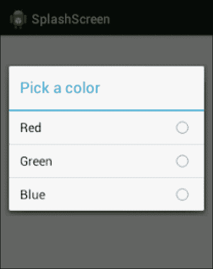

## 使用内置视图的 ListViews

当你第一次实现`ListView`时，可能会觉得微不足道且简单；然而，当你花更多时间在 Android 上时，你会意识到它可能变得多么复杂。如果你有一个带有每行图片的大型元素列表，你很容易就能找到性能和内存问题。如果你尝试实现复杂的 UI，例如让同一个列表显示不同的条目，创建具有不同视图的不同行，或者甚至尝试在显示部分标题时组合某些条目，可能会很头疼。

让我们从实现列表的最简方式开始，使用前面讨论过的简单列表中使用的 Android 内置项目布局。为了显示列表，我们将它包含在`AlertDialog`中，当我们点击设置片段中的按钮时，会显示这个对话框。我会将按钮的文本设置为`Lists Example`。

第一步是在`settings_fragment.xml`中创建按钮；创建后，我们可以为按钮设置点击监听器。现在，我们对软件模式有了更深入的了解，而不仅仅是以下这种方式设置点击监听器：

```kt
view.findViewById(R.id.settingsButtonListExample).setOnClickListener(new View.OnClickListener() {
  @Override
  public void onClick(View view) {
    //Show the dialog here
  }
});
```

我们将以更有条理的方式来做这件事，特别是因为我们知道在设置屏幕上，将会有很多按钮，我们希望在同一地方处理所有点击事件。我们不会在方法调用内部创建`onClickListener`，而是通过将`onClickListener`设置为`this`，使`Fragment`实现`OnClikListener`。这里的`this`关键字指的是整个片段，因此片段将在`onClick`方法中监听点击，一旦`Fragment`实现了`View.OnClickListener`，这个方法是必须实现的。

`OnClick()`方法接收一个视图，即被点击的视图。如果我们将该视图的 ID 与按钮的 ID 进行比较，我们就会知道是按钮还是设置了`clickListener`的其他视图被点击了。

在定义类时只需键入`implements View.OnClickListener`，你就会被要求实现必填的方法：

```kt
/**
* Settings Fragment
*/
public class SettingsFragment extends Fragment implements View.OnClickListener {

  @Override
  public View onCreateView(LayoutInflater inflater, ViewGroup container,
  Bundle savedInstanceState) {
    // Inflate the layout for this fragment
    View view = inflater.inflate(R.layout.fragment_settings, container, false);

    view.findViewById(R.id.settingsButtonListExample).setOnClickListener(this);

    view.findViewById(R.id.ViewX).setOnClickListener(this);

    view.findViewById(R.id.imageY).setOnClickListener(this);

    return view;
  }

  @Override
  public void onClick(View view) {
    switch (view.getId()){
      case (R.id.settingsButtonListExample) :
      showDialog();
      break;
      case (R.id.viewX) :
      //Example
      break;
      case (R.id.imageY) :
      //Example
      break;

      //...
    }
  }

  public void showListDialog(){
    //Show Dialog here
  }
}
```

你会注意到，我们还把显示列表对话框的逻辑移到了外部方法中，这样在`onClick();`中的结构易于阅读。

继续使用对话框，我们可以显示一个带有`setAdapter()`属性的`AlertDialog`，它会自动将内部项与`ListView`绑定。或者，我们可以为对话框创建一个带有`ListView`的视图，然后将适配器设置给该`ListView`：

```kt
/**
*  Show a dialog with different options to choose from
*/
public void showListDialog(){

  AlertDialog.Builder builder = new AlertDialog.Builder(getActivity());

  final ArrayAdapter<String> arrayAdapter = new ArrayAdapter<String>(
  getActivity(),
  android.R.layout.select_dialog_singlechoice);
  arrayAdapter.add("Option 0");
  arrayAdapter.add("Option 1");
  arrayAdapter.add("Option 2");

  builder.setTitle("Choose an option");

  builder.setAdapter(arrayAdapter,
  new DialogInterface.OnClickListener() {
    @Override
    public void onClick(DialogInterface dialogInterface, int i) {
      Toast.makeText(getActivity(),"Option choosen "+i, Toast.LENGTH_SHORT).show();
      dialogInterface.dismiss();
    }
  });

  builder.show();
}
```

这个对话框将显示一条消息，指示点击的选项。我们使用了`android.R.layout.select_dialog_singlechoice`作为我们行的视图。

这些是列表内置布局的几个不同示例，它们将取决于我们应用程序的主题。例如，在 4.4 KitKat 和 5.0 Lollipop 中，对话框看起来是不同的，在`android.R.layout.simple_list_item_1`中，它看起来会是这样：

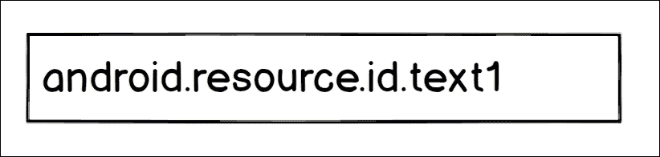

`android.R.layout.simple_list_item_2`布局有两行，看起来会类似这样：

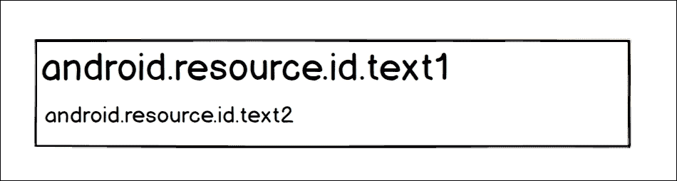

这是一个`android.R.layout.simpleListItemChecked`的例子，我们可以将选择模式更改为多选或单选：

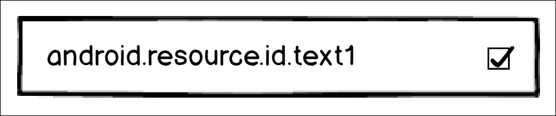

这是`android.R.layout.activityListItem`，我们有一个图标和文本：

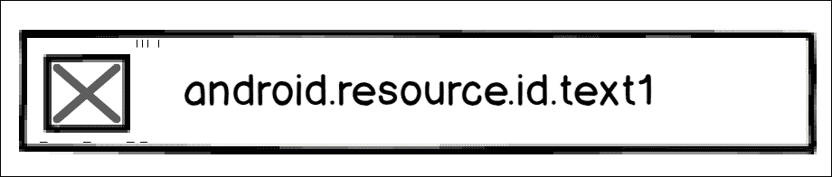

在创建布局时，我们可以访问这些内置的布局组件，以便进一步调整视图。这些组件的名称为`android.resource.id.Text1`、`android.resource.id.Text2`、`android.resource.id.Icon`等。

现在，我们知道了如何创建带有功能和视图的列表。是时候创建我们自己的适配器并手动实现功能和视图了。

## 创建自定义适配器

当你寻找工作时，除了查看职位信息，你还会向不同的软件公司或 IT 招聘公司提交你的简历，他们会为你找到一家公司。

在我们的联系人片段中，我们将创建一个按国家排序的列表，显示这些公司的联系人详细信息。将有两行不同的内容：一行用于国家头部，另一行用于公司详细信息。

我们可以在 Parse 数据库中创建另一个表，名为`JobContact`，包含以下字段：

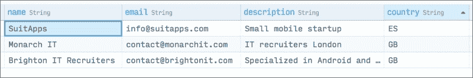

我们将从服务器请求工作联系人，并构建一个项目列表，该列表将发送到适配器以构建列表。在列表中，我们将发送两个不同的元素：公司和国家。我们可以生成一个项目列表并将这两个作为对象添加。我们的两个类将类似于以下内容：

```kt
@ParseClassName("JobContact")
public class JobContact extends ParseObject {

  public JobContact() {
    // A default constructor is required.
  }

  public String getName() {
    return getString("name");
  }

  public String getDescription() {
    return getString("description");
  }

  public String getCountry() {
    return getString("country");
  }

  public String getEmail() {
    return getString("email");
  }

}

public class Country {

  String countryCode;

  public Country(String countryCode) {
    this.countryCode = countryCode;
  }

}
```

一旦我们从[`www.parse.com`](http://www.parse.com)按国家排序下载了信息，我们就可以通过遍历解析列表并检测到不同国家时添加一个国家头部来构建我们的项目列表。执行以下代码：

```kt
public void retrieveJobContacts(){
  ParseQuery<JobContact> query = ParseQuery.getQuery("JobContact");
  query.orderByAscending("country");
  query.findInBackground(new FindCallback<JobContact>() {
    @Override
    public void done(List<JobContact> jobContactsList, ParseException e) {
      mListItems = new ArrayList<Object>();
      String currentCountry = "";
      for (JobContact jobContact: jobContactsList) {
        if (!currentCountry.equals(jobContact.getCountry())){
          currentCountry = jobContact.getCountry();
          mListItems.add(new Country(currentCountry));
        }
        mListItems.add(jobContact);
      }
    }
  });
}
```

现在我们有了包含头部的列表，我们可以基于这个列表创建`Adapter`，它将在构造函数中作为参数发送。自定义`Adapter`的最佳方式是创建一个扩展`BaseAdapter`的子类。一旦我们这样做，我们将被要求实现以下方法：

```kt
public class JobContactsAdapter extends BaseAdapter {
  @Override
  public int getCount() {
    return 0;
  }

  @Override
  public Object getItem(int i) {
    return null;
  }

  @Override
  public long getItemId(int i) {
    return 0;
  }

  @Override
  public View getView(int i, View view, ViewGroup viewGroup) {
    return null;
  }
}
```

这些方法需要根据我们想要显示的数据来实现；例如，`getCount()`需要返回列表的大小。我们需要实现一个接收两个参数的构造函数：列表和上下文。上下文将是在`getView()`方法中膨胀列表所必需的。下面是没有实现`getView()`的适配器的外观：

```kt
public class JobContactsAdapter extends BaseAdapter {

  private List<Object> mItemsList;
  private Context mContext;

  public JobContactsAdapter(List<Object> list, Context context){
    mItemsList = list;
    mContext = context;
  }

  @Override
  public int getCount() {
    return mItemsList.size();
  }

  @Override
  public Object getItem(int i) {
    return mItemsList.get(i);
  }

  @Override
  public long getItemId(int i) {
    //Not needed
    return 0;
  }

  @Override
  public View getView(int i, View view, ViewGroup viewGroup) {
    return null;
  }
}
```

在我们的案例中，我们可以创建两个不同的视图；因此，除了必须实现的方法外，我们还需要实现两个额外的方法：

```kt
@Override
public int getItemViewType(int position) {
  return mItemsList.get(position) instanceof Country ? 0 : 1;
}

@Override
public int getViewTypeCount() {
  return 2;
}
```

`getItemViewType`方法将返回`0`如果元素是国家，或者`1`如果元素是公司。借助这个方法，我们可以实现`getView()`。如果是国家，我们膨胀`row_job_country.xml`，其中包含`ImageView`和`TextView`；如果是公司，我们膨胀`row_job_contact.xml`，其中包含三个文本视图：

```kt
@Override
public View getView(int i, View view, ViewGroup viewGroup) {

  View rowView = null;
  switch (getItemViewType(i)){

    case (0) :
    rowView = View.inflate(mContext, R.layout.row_job_country,null);
    Country country = (Country) mItemsList.get(i);
    ((TextView) rowView.findViewById(R.id.rowJobCountryTitle)).setText(country.getName());
    ((ImageView) rowView.findViewById(R.id.rowJobCountryImage)).setImageResource(country.getImageRes(mContext));
    break;

    case (1) :
    rowView = View.inflate(mContext, R.layout.row_job_contact,null);
    JobContact company = (JobContact) mItemsList.get(i);
    ((TextView) rowView.findViewById(R.id.rowJobContactName)).setText(company.getName());
    ((TextView) rowView.findViewById(R.id.rowJobContactEmail)).setText(company.getEmail());
    ((TextView) rowView.findViewById(R.id.rowJobContactDesc)).setText(company.getDescription());
  }

  return rowView;
}
```

最后，我们可以在`contact_fragment.xml`中创建`ListView`，并将适配器设置到这个列表。但是，我们将采取捷径，使用`android.support.v4.ListFragment`；这是一个已经通过`ListView`膨胀了视图并包含`setListAdapter()`方法的片段，该方法将适配器设置到内置的`ListView`中。从这段代码扩展，我们的`ContactFragment`类将类似于以下代码：

```kt
public class ContactFragment extends android.support.v4.app.ListFragment {

  List<Object> mListItems;

  public ContactFragment() {
    // Required empty public constructor
  }

  @Override
  public void onViewCreated(View view, Bundle bundle) {
    super.onViewCreated(view,bundle);
    retrieveJobContacts();
  }

  public void retrieveJobContacts(){
    ParseQuery<JobContact> query = ParseQuery.getQuery("JobContact");
    query.orderByAscending("country");
    query.findInBackground(new FindCallback<JobContact>() {
      @Override
      public void done(List<JobContact> jobContactsList, ParseException e) {
        mListItems = new ArrayList<Object>();
        String currentCountry = "";
        for (JobContact jobContact: jobContactsList) {
          if (!currentCountry.equals(jobContact.getCountry())){
            currentCountry = jobContact.getCountry();
            mListItems.add(new Country(currentCountry));
          }
          mListItems.add(jobContact);
        }
        setListAdapter(new JobContactsAdapter(mListItems,getActivity()));
      }
    });
  }
}
```

在视图创建后调用`retrieveJobContacts()`方法，我们实现了以下结果：

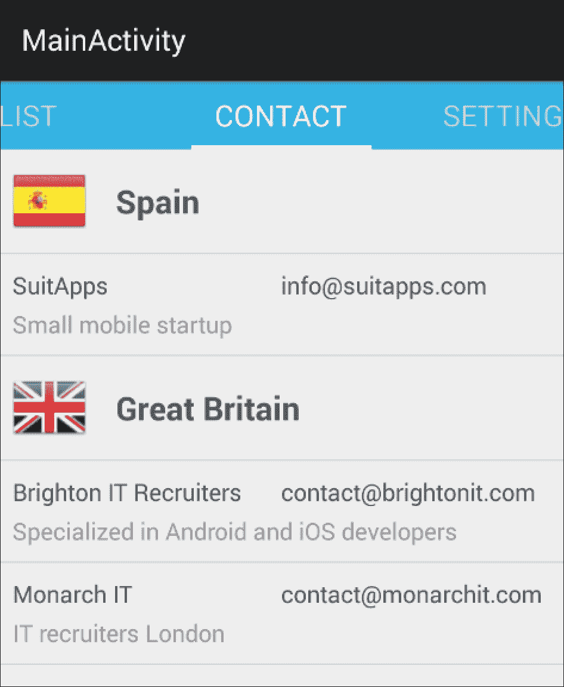

我们显示的旗帜是`drawable`文件夹中的图片，其名称与国家代码相匹配，*drawable/ "country_code" .png*。我们可以通过将资源标识符设置为`ImageView`并在`Country`类内的以下方法中获取它们来显示它们：

```kt
public int getImageRes(Context ctx){
  return ctx.getResources().getIdentifier(countryCode, "drawable", ctx.getPackageName());
}
```

这是一个基本的`ListView`版本，包含两种不同类型的行。这个版本仍然远非完美；它的性能不佳，没有回收视图，并且每次创建行时都会查找小部件的 ID。我们将在下一节解释并解决这个问题。

## 视图回收

在使用`ListView`时，我们需要牢记行数是一个变量，即使我们尽可能快速地滚动，我们也希望列表能够流畅。幸运的是，Android 在这方面为我们提供了很大帮助。

当我们滚动`ListView`时，屏幕一侧不再可见的视图会被复用并在另一侧再次显示。这样，Android 节省了视图的膨胀；当它膨胀时，视图必须遍历 xml 节点，实例化每个组件。这种额外的计算可能是流畅列表和卡顿列表之间的区别。

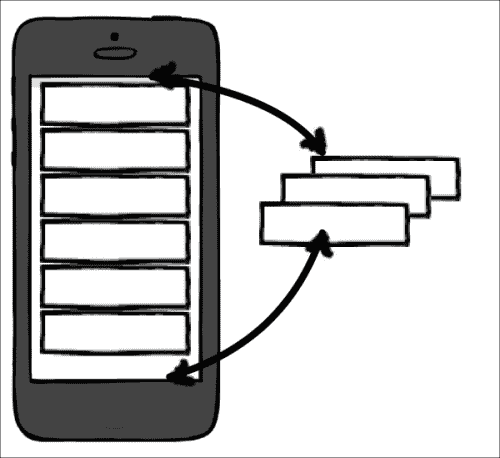

`getView()`方法接收一个待回收的视图作为参数，如果没有视图可以回收，则接收 null。

为了利用这种视图回收机制，我们需要停止每次都创建新视图，而是复用作为参数传入的视图。我们仍然需要在回收的视图中更改行内文本视图和小部件的值，因为它具有与其先前位置的初始值相对应的内容。在我们的示例中，有一个额外的复杂性；我们不能将国家的视图回收用于公司视图，因此我们只能回收相同视图类型的视图。然而，再次强调，Android 通过内部使用我们实现的`getItemViewType`方法为我们进行这个检查：

```kt
@Override
public View getView(int i, View view, ViewGroup viewGroup) {

  switch (getItemViewType(i)){

    case (0) :
    if (view == null){
      view = View.inflate(mContext, R.layout.row_job_country,null);
    }
    Country country = (Country) mItemsList.get(i);
    ((TextView) view.findViewById(R.id.rowJobCountryTitle)).setText(country.getName());
    ((ImageView) view.findViewById(R.id.rowJobCountryImage)).setImageResource(country.getImageRes(mContext));
    break;

    case (1) :
    if (view == null){
      view = View.inflate(mContext, R.layout.row_job_contact,null);
    }
    JobContact company = (JobContact) mItemsList.get(i);
    ((TextView) view.findViewById(R.id.rowJobContactName)).setText(company.getName());
    ((TextView) view.findViewById(R.id.rowJobContactEmail)).setText(company.getEmail());
    ((TextView) view.findViewById(R.id.rowJobContactDesc)).setText(company.getDescription());
  }

  return view;
}
```

## 应用 ViewHolder 模式

请注意，在`getView()`方法中，每次我们想要将文本设置到`TextView`时，都会使用`findViewById()`方法在行视图中搜索这个`TextView`；即使行被回收，我们仍然需要再次找到`TextView`以设置新值。

我们可以创建一个名为`ViewHolder`的类，它通过保存行内小部件搜索的计算来引用小部件。这个`ViewHolder`类将只包含对小部件的引用，我们可以通过`setTag()`方法在行与其`ViewHolder`类之间保持引用。`View`对象允许我们设置一个对象作为标签并在稍后检索它；我们可以通过指定这个标签的键来添加任意数量的标签：`setTag(key)`或`getTag(key)`。如果没有指定键，我们可以保存和检索默认标签。

按照这种模式，在我们第一次创建视图时，我们将创建一个`ViewHolder`类并将其设置为视图的标签。如果视图已经创建并且我们正在回收利用它，我们只需简单地检索持有者。执行以下代码：

```kt
@Override
public View getView(int i, View view, ViewGroup viewGroup) {

  switch (getItemViewType(i)){

    case (0) :
    CountryViewHolder holderC;
    if (view == null){
      view = View.inflate(mContext, R.layout.row_job_country,null);
      holderC = new CountryViewHolder();
      holderC.name = (TextView) view.findViewById(R.id.rowJobCountryTitle);
      holderC.flag = (ImageView) view.findViewById(R.id.rowJobCountryImage);
      view.setTag(view);
    } else {
      holderC = (CountryViewHolder) view.getTag();
    }
    Country country = (Country) mItemsList.get(i);
    holderC.name.setText(country.getName());
    holderC.flag.setImageResource(country.getImageRes(mContext));
    break;
    case (1) :
    CompanyViewHolder holder;
    if (view == null){
      view = View.inflate(mContext, R.layout.row_job_contact,null);
      holder = new CompanyViewHolder();
      holder.name = (TextView) view.findViewById(R.id.rowJobContactName);
      holder.email = (TextView) view.findViewById(R.id.rowJobContactEmail);
      holder.desc = (TextView) view.findViewById(R.id.rowJobOfferDesc);
      view.setTag(holder);
    } else {
      holder = (CompanyViewHolder) view.getTag();
    }
    JobContact company = (JobContact) mItemsList.get(i);
    holder.name.setText(company.getName());
    holder.email.setText(company.getEmail());
    holder.desc.setText(company.getDescription());
  }

  return view;
}

private class CountryViewHolder{

  public TextView name;
  public ImageView flag;

}

private class CompanyViewHolder{

  public TextView name;
  public TextView email;
  public TextView desc;

}
```

为了简化这段代码，我们可以在每个持有者内部创建一个名为`bindView()`的方法；它将获取一个国家或公司对象并填充小部件：

```kt
CountryViewHolder holderC;
if (view == null){
  view = View.inflate(mContext, R.layout.row_job_country,null);
  holderC = new CountryViewHolder(view);
  view.setTag(view);
} else {
  holderC = (CountryViewHolder) view.getTag();
}
holderC.bindView((Country)mItemsList.get(i));
break;

private class CountryViewHolder{

  public TextView name;
  public ImageView flag;

  public CountryViewHolder(View view) {
    this.name = (TextView) view.findViewById(R.id.rowJobCountryTitle);
    this.flag = (ImageView) view.findViewById(R.id.rowJobCountryImage);
  }

  public void bindView(Country country){
    this.name.setText(country.getName());
    this.flag.setImageResource(country.getImageRes(mContext));
  }

}
```

我们现在将完成`ListView`性能改进列表。如果需要加载图像或长时间操作视图，我们需要在`getView()`中创建`AsyncTask`方法，以避免在滚动时进行繁重操作。例如，如果我们想在每一行显示从互联网下载的图像，我们会有一个`LoadImageAsyncTask`方法，我们将使用持有者和要下载图像的 URL 来执行它。当`Asynctask`方法完成后，它将拥有对持有者的引用，因此能够显示图像：

```kt
public View getView(int position, View convertView,
ViewGroup parent) {

  ...

  new LoadImageAsyncTask(list.get(position).getImageUrl, holder)
  .executeOnExecutor(AsyncTask.THREAD_POOL_EXECUTOR, null);

  return convertView;
}
```

现在我们知道了所有不同的提高`ListView`性能的技术，我们准备引入`RecyclerView`。通过在实现中应用这些技术的大部分，我们将能够轻松识别它。

# 介绍 RecyclerView

`RecyclerView`在 Android 5.0 Lollipop 中引入，并被谷歌定义为比`ListView`更灵活和先进的版本。它基于一个类似于`ListView`的`Adapter`类，但强制使用`ViewHolder`类来提高性能和模块化，如我们前一部分所见。当我们把项目表示与组件分离，允许动画、项目装饰和布局管理器来完成工作时，灵活性就体现出来了。

`RecyclerView`通过`RecyclerView.ItemAnimator`处理添加和移除动画，我们可以通过子类化来自定义动画。如果你从数据源显示数据，或者数据发生变化，例如添加或移除项目，可以调用`notifyItemInserted()`或`notifyItemRemoved()`来触发动画。

为了添加分隔线、分组项目或突出显示某个项目，我们可以使用`RecyclerView.ItemDecoration`。

使用 `ListView` 的主要区别之一是使用布局管理器来定位项目。使用 `ListView` 时，我们知道我们的项目将始终垂直显示，如果我们想要网格，可以使用 `GridView`。布局管理器使我们的列表更加灵活，因为我们可以按需显示元素，甚至可以创建自己的布局管理器。

## 使用列表、网格或堆叠

默认情况下，我们有三个内置布局管理器：`LinearLayoutManager`、`GridLayoutManager` 和 `StaggeredLayoutManager`。

`LinearLayoutManager` 以列表形式对齐显示项目，我们可以指定方向——垂直或水平。

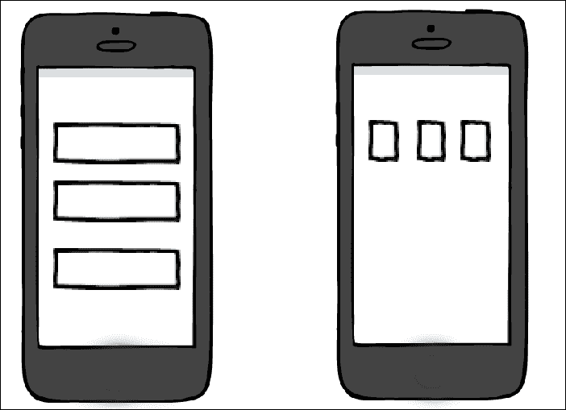

`GridLayoutManager` 以矩阵形式显示项目，我们可以指定列和行：

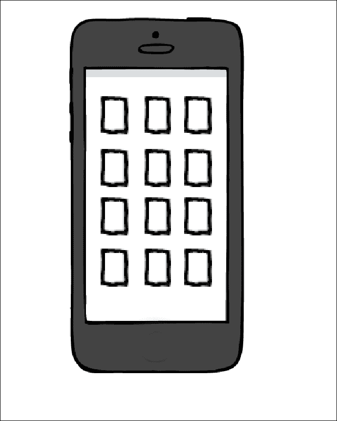

`StaggereGriddLayoutManager` 以交错方式显示项目；这些项目可以有不同的宽度和高度，我们可以使用 `setGapStrategy()` 控制它们的显示方式。

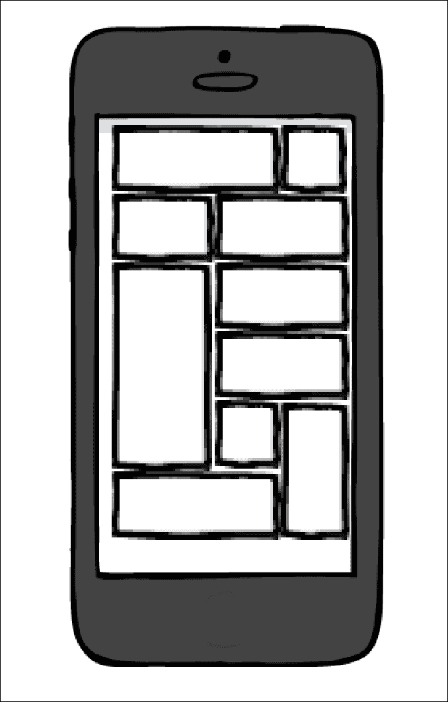

## 实现 RecyclerView

继续使用 `MasteringAndroidApp`，我们将再次实现工作机会列表，移除 `ParseQueryAdapter` 并使用 `RecyclerView` 替代。我们仍然会从 Parse 查询数据，但这次，我们将做的是将项目列表保存在一个变量中，并使用它来构建 `RecyclerView.Adapter`，这将由 `RecyclerView` 使用。

`RecyclerView` 包含在 v7 支持库中；将依赖项添加到项目中的最佳方式是打开项目结构，点击依赖项标签，并搜索 `RecyclerView`。将展示如下截图所示的结果列表：

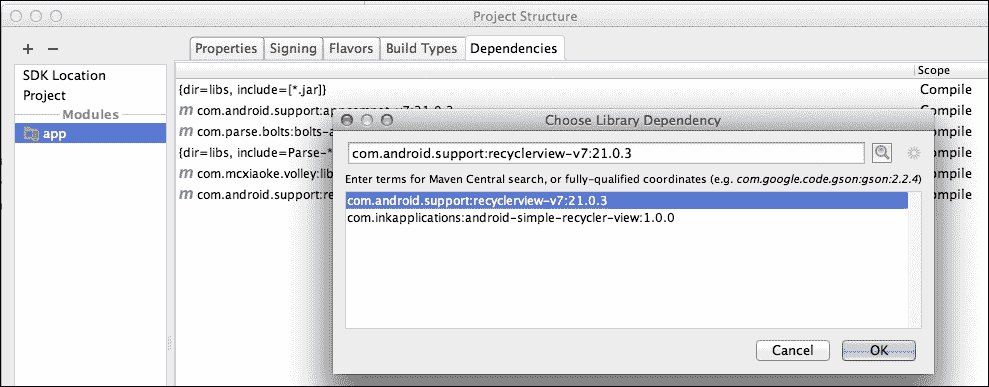

这相当于在 `build.gradle` 依赖项中添加以下行：

```kt
dependencies {
  compile fileTree(dir: 'libs', include: ['*.jar'])
  compile 'com.android.support:appcompat-v7:21.0.3'
  compile 'com.parse.bolts:bolts-android:1.+'
  compile fileTree(dir: 'libs', include: 'Parse-*.jar')
  compile 'com.mcxiaoke.volley:library-aar:1.0.1'
  compile 'com.android.support:recyclerview-v7:21.0.3'
}
```

添加完代码行后，我们将点击**同步 Gradle 与项目文件**来更新依赖项，并准备在 XML 中使用 `RecyclerView`。

打开 `fragment_list.xml` 文件，将现有的 `ListView` 替换为 `RecyclerView`，如下所示：

```kt
<android.support.v7.widget.RecyclerView
  android:id="@+id/my_recycler_view"
  android:scrollbars="vertical"
  android:layout_width="match_parent"
  android:layout_height="match_parent"/>
```

添加后如果没有错误，说明依赖项已正确添加。

下一步是创建适配器。这个适配器与我们为工作联系人创建的适配器略有不同；我们不会扩展 `BaseAdapter`，而是将扩展 `RecyclerView.Adapter <RecyclerView.MyViewHolder>`，在创建 `JobOfferAdapter` 适配器类后实现 `ViewHolder` 模式。但在扩展之前，我们必须创建一个内部类 `MyViewHolder` 继承 `RecylcerView.ViewHolder`。至此，我们有以下代码：

```kt
public class JobOffersAdapter  {

  public class MyViewHolder extends RecyclerView.ViewHolder{

    public TextView textViewName;
    public TextView textViewDescription;

    public  MyViewHolder(View v){
      super(v);
      textViewName = (TextView)v.findViewById(R.id.rowJobOfferTitle);
      textViewDescription = (TextView)v.findViewById(R.id.rowJobOfferDesc);
    }
  }
}
```

现在是扩展 `JobOffersAdapter` 类从 `RecyclerView.Adapter<JobsOfferAdapter.MyViewHolder>` 的时候了。系统将要求我们实现以下方法：

```kt
@Override
public MyViewHolder onCreateViewHolder(ViewGroup parent, int viewType) {
  return null;
}

@Override
public void onBindViewHolder(MyViewHolder holder, int position) {

}

@Override
public int getItemCount() {
  return 0;
}
```

与 `JobsContactsAdapter` 中的方法相同，我们通过接收工作机会列表创建构造函数，并根据该列表实现适配器方法。

`OnBindViewHolder` 接收带有位置的持有者；我们需要做的就是获取列表中该位置的 job offer 并使用这些值更新持有者的文本视图。`OnCreateViewHolder` 将会填充视图；在这种情况下，我们只有一种类型，所以我们忽略 `ViewType` 参数。这里我们将展示一种替代的视图填充方法：使用作为参数传递的父级上下文。

最后，`getItemCount` 将返回工作机会的数量。完成上述所有任务后，我们新的适配器将使用以下代码创建：

```kt
public class JobOffersAdapter extends RecyclerView.Adapter<JobOffersAdapter.MyViewHolder>  {

  private  List<JobOffer> mOfferList;

  public JobOffersAdapter(List<JobOffer> offersList) {
    this.mOfferList = offersList;
  }

  @Override
  public MyViewHolder onCreateViewHolder(ViewGroup parent, int viewType) {
    View v = LayoutInflater.from(parent.getContext()).inflate(R.layout.row_job_offer, parent, false);
    return new MyViewHolder(v);
  }

  @Override
  public void onBindViewHolder(MyViewHolder holder, int position) {
    holder.textViewName.setText(mOfferList.get(position).getTitle());
    holder.textViewDescription.setText(mOfferList.get(position).getDescription());
  }

  @Override
  public int getItemCount() {
    return mOfferList.size();
  }

  public class MyViewHolder extends RecyclerView.ViewHolder{

    public TextView textViewName;
    public TextView textViewDescription;

    public  MyViewHolder(View v){
      super(v);
      textViewName = (TextView)v.findViewById(R.id.rowJobOfferTitle);
      textViewDescription = (TextView)v.findViewById(R.id.rowJobOfferDesc);
    }
  }
}
```

这就是我们需要适配器完成的所有工作；现在，我们需要初始化 `RecyclerView` 并设置布局管理器以及适配器。适配器必须使用从 Parse 获取的对象列表实例化，就像我们在之前的适配器中获取工作联系人一样。首先，在 `OnCreateView` 中，我们将初始化 `RecyclerView`：

```kt
public class ListFragment extends android.support.v4.app.Fragment {

  public List<JobOffer> mListItems;
  public RecyclerView mRecyclerView;

  public ListFragment() {
    // Required empty public constructor
  }

  @Override
  public View onCreateView(LayoutInflater inflater, ViewGroup container,
  Bundle savedInstanceState) {
    // Inflate the layout for this fragment
    View view = inflater.inflate(R.layout.fragment_list, container, false);

    mRecyclerView = (RecyclerView) view.findViewById(R.id.my_recycler_view);

    // use this setting to improve performance if you know that changes
    // in content do not change the layout size of the RecyclerView
    mRecyclerView.setHasFixedSize(true);

    // use a linear layout manager
    mRecyclerView.setLayoutManager(new LinearLayoutManager(getActivity()));

    //Retrieve the list of offers
    retrieveJobOffers();

    return view;
  }
```

最后，我们将调用 `retrieveOffers()`，这是一个 `async` 操作。只有当从 Parse 获取结果后，我们才能创建适配器并将其设置到列表中：

```kt
public void retrieveJobOffers(){

  ParseQuery<JobOffer> query = ParseQuery.getQuery("JobOffer");
  query.findInBackground(new FindCallback<JobOffer>() {

    @Override
    public void done(List<JobOffer> jobOffersList, ParseException e) {
      mListItems = jobOffersList;
      JobOffersAdapter adapter = new JobOffersAdapter(mListItems);
      mRecyclerView.setAdapter(adapter);
    }

  });
}
```

检验我们工作成果的最佳方式是查看控制台是否有错误。如果一切运行正常，你应该能够看到如下截图所示的优惠列表：

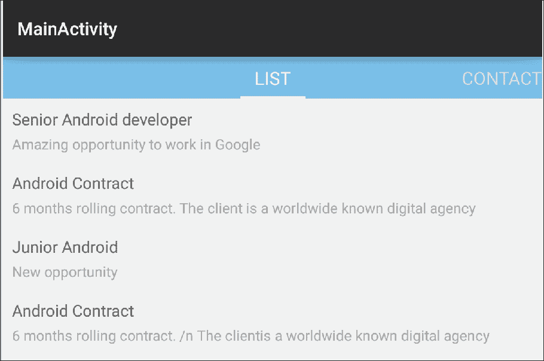

我们故意添加了一个重复的工作机会，以便删除它以查看 `RecyclerView` 中默认包含的移除动画。我们将在 **长按监听器** 中实现这个功能。点击监听器仅用于在详情视图中打开优惠。我们将在下一节中看到如何操作。

## 点击 `RecyclerView` 项

在 `ListView` 中，检测项目点击相当简单；我们可以直接执行 `ListView.setOnItemClickLister` 和 `setOnItemLongClickListener` 以处理长按点击。然而，这种实现方式在 `RecyclerView` 中并不那么快速，这种灵活性是有代价的。

这里有两种实现项目点击的方法：一种是通过创建一个实现 `RecyclerView.OnItemTouchListener` 的类，并调用 `RecyclerView` 的方法 `addOnItemTouchListener`，如下所示：

```kt
mrecyclerView.addOnItemTouchListener(new MyRecyclerItemClickListener(getActivity(), recyclerView, new MyRecyclerItemClickListener.OnItemClickListener() {

  @Override
  public void onItemClick(View view, int position){
    // ...
  }

  @Override
  public void onItemLongClick(View view, int position){
    // ...
  }
}));

public class MyRecyclerItemClickListener implements RecyclerView.OnItemTouchListener
{
  public static interface OnItemClickListener
  {
    public void onItemClick(View view, int position);
    public void onItemLongClick(View view, int position);
  }

  private OnItemClickListener mListener;
  private GestureDetector mGestureDetector;

  public MyRecyclerItemClickListener(Context context, final RecyclerView recyclerView, OnItemClickListener listener)
  {
    mListener = listener;

    mGestureDetector = new GestureDetector(context, new GestureDetector.SimpleOnGestureListener()
    {
      @Override
      public boolean onSingleTapUp(MotionEvent e)
      {
        return true;
      }

      @Override
      public void onLongPress(MotionEvent e)
      {
        View child = recyclerView.findChildViewUnder(e.getX(), e.getY());

        if(child != null && mListener != null)
        {
          mListener.onItemLongClick(child, recyclerView.getChildPosition(child));
        }
      }
    });
  }

  @Override
  public boolean onInterceptTouchEvent(RecyclerView view, MotionEvent e)
  {
    View child = view.findChildViewUnder(e.getX(), e.getY());

    if(child != null && mListener != null && mGestureDetector.onTouchEvent(e))
    {
      mListener.onItemClick(child, view.getChildPosition(child));
    }

    return false;
  }

  @Override
  public void onTouchEvent(RecyclerView view, MotionEvent motionEvent){
    //Empty
  }
}
@Override
public void onRequestDisallowInterceptTouchEvent(RecyclerView view){
  //Empty
}
```

这种方法的好处在于，我们可以在每个活动或片段中定义 `onClick` 内应该执行的操作。点击逻辑不在视图上，一旦我们构建了这个组件，就可以在不同的应用中重复使用它。

第二种方法是设置和管理`ViewHolder`内部的点击事件。如果我们想要在应用程序的不同部分或在另一个应用程序中复用这个`ViewHolder`，这里就会出现问题，因为点击逻辑位于视图内部，我们可能希望在不同的片段或活动中有不同的逻辑。然而，这种方法使得在同一行内检测不同组件的点击变得更加容易。例如，如果我们在行内有一个小图标用于删除，另一个用于分享优惠，这种方法更有意义。这样，我们可以在每一行设置对工作名称的点击，并在整行上设置长按监听器：

```kt
public class MyViewHolder extends RecyclerView.ViewHolder implements View.OnClickListener, View.OnLongClickListener{

  public TextView textViewName;
  public TextView textViewDescription;

  public  MyViewHolder(View v){
    super(v);
    textViewName = (TextView)v.findViewById(R.id.rowJobOfferTitle);
    textViewDescription = (TextView)v.findViewById(R.id.rowJobOfferDesc);
    textViewName.setOnClickListener(this);
    v.setOnLongClickListener(this);
  }

  @Override
  public void onClick(View view) {
    switch (view.getId()){
      case R.id.rowJobOfferTitle :
      //Click
      break;
    }
  }

  @Override
  public boolean onLongClick(View view) {
    //Delete the element here
    return false;
  }
}
```

你应该能够判断在每种情况下应该使用哪种实现，并为其辩护。为了能够测试这一点，我们将在长按后删除一个元素（这里应该有一个确认对话框以避免误删，但我们将省略这部分内容）。元素将在本地被删除以显示移除动画。注意，我们没有从 Parse 中的源数据中删除这个元素；我们需要做的是从列表中删除元素并调用`notifyItemRemoved`来触发通知。我们可以通过`getPosition()`方法知道哪个条目被点击了。

```kt
@Override
public boolean onLongClick(View view) {
  mOfferList.remove(getPosition());
  notifyItemRemoved(getPosition());
  return true;
}
```

# 总结

在本章的最后，你将了解到如何实现一个适配器，如何在列表中处理不同类型的条目，以及我们如何以及为什么应用`ViewHolder`模式。你最早是在`ListView`类中学习这些内容，并手动实现了视图回收技术。因此，你将能够完全理解特性以及`RecyclerView`如何工作，以展示不同的条目显示方式和实现条目点击监听器。

在下一章，我们将探索在 Android 5.0 中与`RecyclerView`一起引入的一个新组件—`CardView`。我们将将其与`RecyclerView`结合使用，以获得灵活且专业外观的卡片列表。
