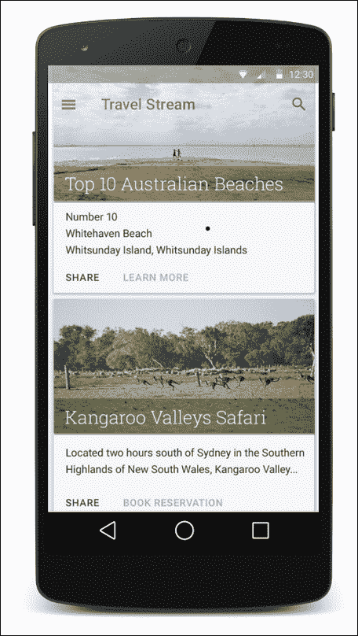
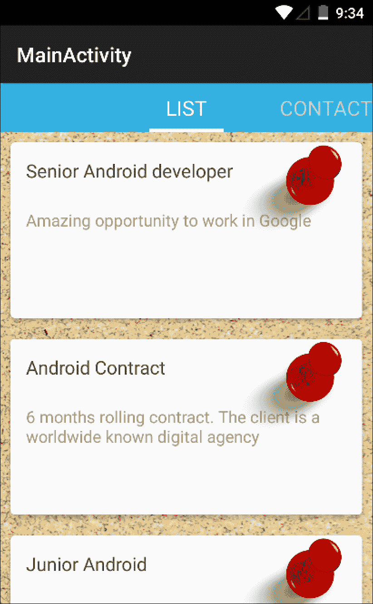
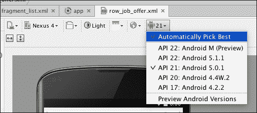
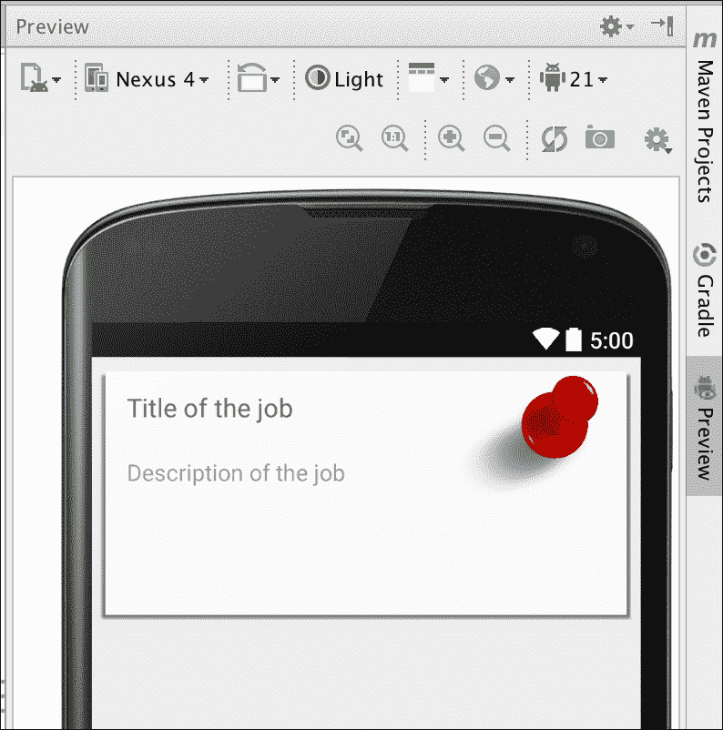
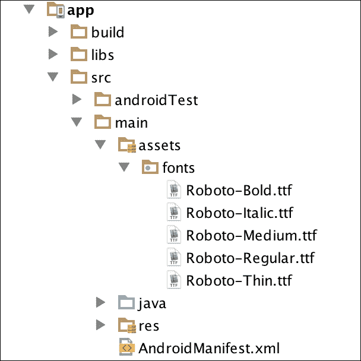
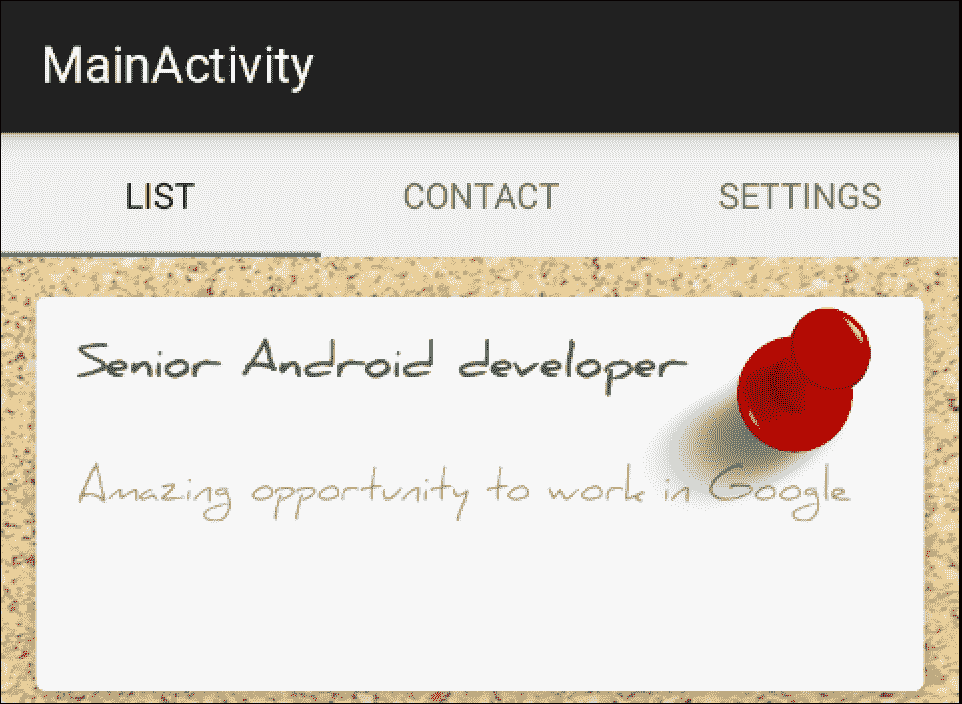
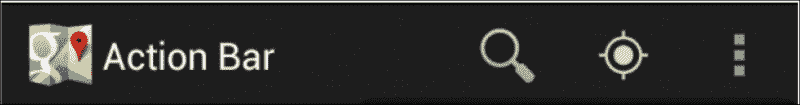
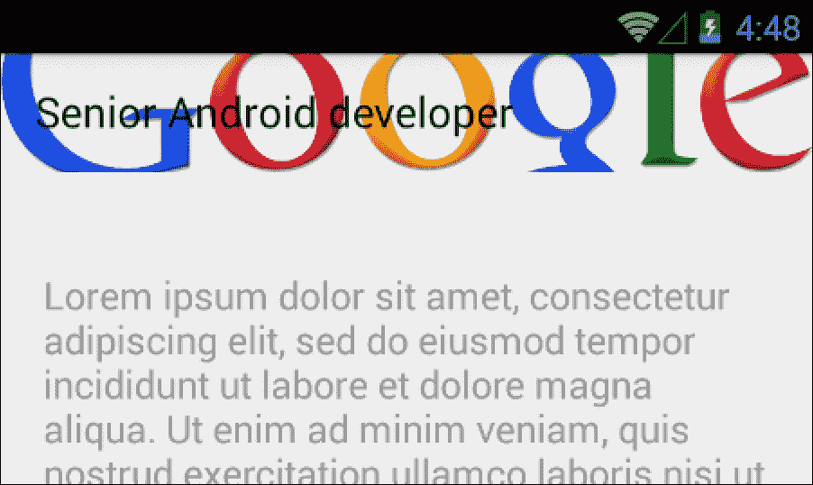
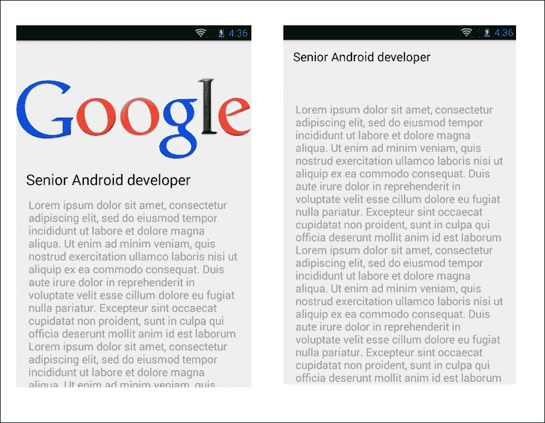

# 第六章：CardView 和材料设计

在本章的第一部分，我们将从用户界面的角度显著改进我们的应用程序，使其看起来更专业，我们从一个新的小部件：**CardView** 开始。我们将学习如何使用设计时属性，这将提高我们的设计和开发速度，并且我们将使用第三方库轻松地在整个应用程序中包含自定义字体。

第二部分将重点关注设计支持库，将材料设计概念添加到我们的应用程序中，改进标签页，并在职位视图上添加视差效果。在此过程中，我们将阐明工具栏、操作栏和应用程序栏是什么，以及如何从应用程序栏实现向上导航。

+   CardView 和 UI 小贴士：

    +   CardView

    +   设计时布局属性

    +   自定义字体

+   设计支持库：

    +   TabLayout

    +   工具栏、操作栏和应用程序栏

    +   CoordinatorLayout

    +   向上导航

# CardView 和 UI 设计小贴士

目前，我们的应用程序以行形式显示职位信息，包含两个文本视图；它展示了所需的信息，我们可以说应用程序目前是好的，并且达到了它的目的。然而，我们仍然可以让应用程序实用，并且同时拥有专业、美观的界面，使我们能够保持原创并与竞争对手不同。例如，为了展示职位信息，我们可以模拟一个带有广告海报的职位公告板。为此，我们可以使用 CardView 小部件，它将赋予其深度和纸质卡片的外观。我们将改变我们应用程序的字体。这样一个简单的改变可以带来很大的不同；当我们把默认字体改为自定义字体时，从用户的角度来看，这个应用程序就是一个定制的版本，开发者关注到了每一个细节。

## 介绍 CardView

CardView 随 Android 5.0 一起发布。它是一个具有圆角和阴影的视图，从而提供深度感，并模拟卡片。将此与回收视图结合使用，我们可以得到一个外观一致且符合许多应用程序的列表项。以下是一张带有 CardView 和自定义字体的列表示例：



在使用 CardView 时，请记住，圆角根据 Android 版本的不同实现方式也不同。在 Android 5.0 之前的版本中，为了防止裁剪子视图以及实现阴影效果，会增加内边距。在 Android 5.0 及以后的版本中，基于 CardView 的 elevation 属性显示阴影，任何与圆角相交的子视图都会被裁剪。

要开始使用 CardView，我们需要从项目结构窗口将其作为依赖项添加，或者在 `build.gradle` 文件内的依赖项中添加以下行：

```kt
dependencies {
  ...
  compile 'com.android.support:cardview-v7:21.0.+'
}
```

我们可以修改我们的 `row_job_offer.xml` 文件，将基础视图设置为带有内容的 CardView。这个 CardView 将具有一些高度和圆角。为了设置这些属性，我们需要通过在 XML 中添加以下架构来导入 CardView 自有的属性：

以下代码将创建新的布局：

```kt
<?xml version="1.0" encoding="utf-8"?>
<android.support.v7.widget.CardView

    android:orientation="vertical" android:layout_width="match_parent"
    android:layout_height="170dp"
    android:layout_margin="10dp"
    card_view:cardElevation="4dp"
    card_view:cardCornerRadius="4dp"
    >
    <LinearLayout
        android:orientation="vertical"
        android:layout_width="wrap_content"
        android:padding="15dp"
        android:layout_height="wrap_content">
        <TextView
            android:id="@+id/rowJobOfferTitle"
            android:layout_width="fill_parent"
            android:layout_height="wrap_content"
            android:text="Title"
            android:textColor="#555"
            android:textSize="18sp"
            android:layout_marginBottom="20dp"
            />
        <TextView
            android:id="@+id/rowJobOfferDesc"
            android:layout_marginTop="5dp"
            android:layout_width="fill_parent"
            android:layout_height="wrap_content"
            android:text="Description"
            android:textColor="#999"
            android:textSize="16sp"
            />
    </LinearLayout>
</android.support.v7.widget.CardView>
```

我们找到了一块软木塞的纹理，将其设置为背景，并在每张卡片上添加了一个带有 ImageView 对象的图钉。以下是实现的效果：



应用程序看起来比之前好多了；现在它真成了一个职位公告板。仅仅通过改变外观，展示了相同的信息——同样是带有标题和职位描述的两个`TextView`——它就从演示应用演变成了可以在 Play 商店完美发布的应用。

我们可以通过更改字体来继续改进这一点，但在介绍设计时布局属性之前，这将使视图设计更加容易和快捷。

## 设计时的布局属性

在使用设计时属性时，我总是想起我在第一份工作中发生的一个有趣故事。我需要显示联系人列表，因此我在创建联系人视图时使用了虚拟数据，这样在创建视图时可以分配一些文本，以便在设计视图中看到大小、颜色和总体外观。

我创建的联系人名叫*Paco el churrero*，即弗兰克，炸油条的人。Paco 是弗朗西斯科的昵称，而如果你不知道，churro 是一种油炸面食。不管怎样，这些虚拟数据后来被更正为适当的联系人姓名，当显示联系人列表时，这些联系人是从服务器获取的。我记不清是我急于发布应用，忘记了这个操作，还是我简单地遗漏了它，但应用就这样上线了。我开始处理另一个组件，直到有一天服务器端出现问题，服务器开始发送空白联系人。应用无法用联系人姓名覆盖虚拟数据，结果 Paco el churrero 作为联系人显示了出来！幸运的是，在用户注意到之前，服务器得到了修复。

之后，我使用虚拟数据创建了视图，当我满意视图后，我删除了虚拟数据。但是，这种方法在需要更改 UI 时，我不得不再次添加虚拟数据。

随着 Android Studio 0.2.11 版本的发布，设计时的布局属性应运而生。这些属性允许我们在设计视图中显示文本或任何属性，这些属性在运行应用时不会出现；这些数据只在设计视图中可见。

要使用这些属性，我们需要在布局中添加工具的命名空间。命名空间总是在视图的根元素中定义；你可以找到这样的行，`informalexample">`。

```kt
<FrameLayout
xmlns:android="http://schemas.android.com/apk/res/android 
```

为了测试这个，我们将在职位信息和职位描述的`TextView`中添加一些虚拟文本：

```kt
<TextView
    android:id="@+id/rowJobOfferTitle"
    android:layout_width="fill_parent"
    android:layout_height="wrap_content"
    tools:text="Title of the job"
    android:textColor="#555"
    android:textSize="18sp"
    android:layout_marginBottom="20dp"
    />
<TextView
    android:id="@+id/rowJobOfferDesc"
    android:layout_marginTop="5dp"
    android:layout_width="fill_parent"
    android:layout_height="wrap_content"
    tools:text="Description of the job"
    android:textColor="#999"
    android:textSize="16sp"
    android:ellipsize="marquee"
    />
```

如果你遇到渲染设计视图的问题，可以更改 Android 版本或主题，如下面的图片所示。如果问题仍然存在，请确保你安装了最新版本的 Android Studio 和下载了最新的 Android API：



当视图渲染后，我们可以看到设计时属性中的职位提供标题和描述。



你可以使用任何属性，如文本颜色、背景颜色，甚至图片源，这对于创建包含从互联网下载图片的视图非常有用，但在创建视图时需要预览图片来查看视图的外观。

## 在 Android 中使用自定义字体

当在 Android 上使用自定义字体时，有一个令人惊叹的开源库——Chris Jenkins 的*Calligraphy*——它允许我们为整个应用程序设置默认字体。这意味着每个带有文本的组件，如 Button、TextView 和 EditText 默认都会显示这种字体，我们无需为应用程序中的每个单独项目分别设置字体。让我们更详细地了解这一点，并考虑一些支持 Calligraphy 的观点。

如果我们想要应用一个自定义字体，我们首先需要做的是将这个字体放在我们应用程序的`assets`文件夹中。如果我们没有这个文件夹，我们需要在`main`方法中创建它，与`java`和`src`同一级别。在`assets`中创建一个名为`fonts`的第二个文件夹，并将字体放在那里。在我们的示例中，我们将使用*Roboto*字体；可以从 Google 字体获取，地址为[`www.google.com/fonts#UsePlace:use/Collection:Roboto`](https://www.google.com/fonts#UsePlace:use/Collection:Roboto)。下载字体后，应用程序结构应与以下截图类似：



字体放置到位后，我们需要从这个字体创建一个`Typeface`对象，并将其设置为`myTextView`：

```kt
Typeface type = Typeface.createFromAsset(getAssets(),"fonts/Roboto-Regular.ttf"); myTextView.setTypeface(type);
```

如果我们现在想将相同的字体应用到我们应用程序中的所有组件上，比如标签、标题和职位提供卡，我们不得不在应用程序的不同地方重复相同的代码。除此之外，我们还会遇到性能问题。从资源中创建字体需要访问文件；这是一个昂贵的操作。如果我们改变了适配器中职位标题和职位描述的字体，我们应用程序的视图在滚动时将不再流畅。这带来了一些额外的考虑；例如，我们不得不在一个静态类中一次加载字体，并在整个应用程序中使用它。Calligraphy 为我们处理了所有这些事情。

使用书法的另一个好处是它允许我们在 XML 中设置字体，这样我们就可以在同一个视图中拥有不同的字体，而且无需通过编程设置字体。我们只需在组件中添加`fontPath`属性，并可选地添加`ignore`属性以避免 Android Studio 未检测到`fontPath`的警告：

```kt
<TextView     android:text="@string/hello_world"     android:layout_width="wrap_content"     android:layout_height="wrap_content"     
fontPath="fonts/Roboto-Bold.ttf"
tools:ignore="MissingPrefix"/>
```

既然我们已经解释了书法的优点，我们可以在我们的应用程序中使用它。在`build.gradle`中的依赖项中添加以下行：

```kt
compile 'uk.co.chrisjenx:calligraphy:2.1.0'
```

要应用默认字体，请在`MAApplication`内的`Oncreate()`中添加以下代码：

```kt
CalligraphyConfig.initDefault(new CalligraphyConfig.Builder().setDefaultFontPath("fonts/Roboto-Regular.ttf").setFontAttrId(R.attr.fontPath).build());
```

以及我们想要显示默认字体的任何活动中添加以下内容：

```kt
@Override protected void attachBaseContext(Context newBase) {super.attachBaseContext(CalligraphyContextWrapper.wrap(newBase)); }
```

最后，我们可以找到我们喜欢的手写字体，并将其设置为卡片标题和描述，效果可能类似于以下输出：


# 设计支持库

设计支持库以官方方式引入了材料设计组件，并且兼容从 Android 2.1 开始的版本。材料设计是随着 Android Lollipop 推出的一种新的设计语言。在这个库发布之前，我们观看了使用这些组件的应用程序的视频和示例，但没有官方的方法来使用它。这为应用程序设定了一个基线；因此，要掌握 Android，我们需要掌握材料设计。你可以使用以下代码行进行编译：

```kt
compile 'com.android.support:design:22.2.0'
```

这个库包括视觉组件作为输入文本，带有浮动文本、浮动动作按钮、**TabLayout…**等等。然而，材料设计不仅仅是视觉组件；它还涉及到其元素之间的动作和过渡，因此引入了**CoordinatorLayout**。

## 介绍 TabLayout

`TabLayout`设计库允许我们有固定或可滚动的标签，包含文本、图标或自定义视图。正如你在本书的第一个实例中所记得的，自定义标签并不是那么容易做到的，要从滚动标签更改为固定标签，我们需要不同的实现方式。

现在，我们想要改变标签的颜色和设计使其固定；我们首先需要做的是进入`activity_main.xml`并添加`TabLayout`，移除之前的`PagerTabStrip`标签。我们的视图将如下所示：

```kt
<?xml version="1.0" encoding="utf-8"?>
<LinearLayout
    android:layout_height="fill_parent"
    android:layout_width="fill_parent"
    android:orientation="vertical"
    >
    <android.support.design.widget.TabLayout
        android:id="@+id/tab_layout"
        android:layout_width="match_parent"
        android:layout_height="50dp"/>
    <android.support.v4.view.ViewPager
        android:id="@+id/pager"
        android:layout_width="match_parent"
        android:layout_height="wrap_content">
    </android.support.v4.view.ViewPager>
</LinearLayout>
```

当我们有这个时，我们需要向`Layout`标签中添加标签。有两种方法可以做到这一点；一种是通过以下方式手动创建标签并添加它们：

```kt
tabLayout.addTab(tabLayout.newTab().setText("Tab 1"));
```

第二种方式，也就是我们将要实现的标签方式，是将视图页面设置为`TabLayout`。我们的`MainActivity.java`类应该如下所示：

```kt
public class MainActivity extends ActionBarActivity {

  @Override
  protected void onCreate(Bundle savedInstanceState) {
    super.onCreate(savedInstanceState);
    setContentView(R.layout.activity_main);

    MyPagerAdapter adapter = new MyPagerAdapter(getSupportFragmentManager());
    ViewPager viewPager = (ViewPager) findViewById(R.id.pager);
    viewPager.setAdapter(adapter);

    TabLayout tabLayout = (TabLayout) findViewById(R.id.tab_layout);

    tabLayout.setupWithViewPager(viewPager);
  }

  @Override
  protected void attachBaseContext(Context newBase) {
    super.attachBaseContext(CalligraphyContextWrapper.wrap(newBase));
  }

}
```

如果我们不指定任何颜色，`TabLayout`会使用主题中的默认颜色，并且标签的位置是固定的。我们新的标签栏将如下所示：



## 工具栏、操作栏和应用程序栏

在为我们的应用程序添加动作和动画之前，我们需要明确工具栏、操作栏、应用程序栏和`AppBarLayout`的概念，因为这些可能会造成一些混淆。

操作栏和应用程序栏是同一个组件；“应用程序栏”只是操作栏在材料设计中获得的新名字。这是固定在我们活动顶部的不透明栏，通常显示应用程序的标题、导航选项，并显示不同的操作。图标的显示与否取决于主题：



自从 Android 3.0 以来，默认使用 Holo 主题或其任何后代，这些主题显示操作栏。

让我们继续下一个概念——工具栏(toolbar)。在 API 21，即 Android Lollipop 中引入，它是操作栏(action bar)的泛化，不必固定在活动顶部。我们可以使用`setActionBar()`方法指定工具栏是否作为活动的操作栏。这意味着工具栏将根据我们的需求表现为操作栏或非操作栏。

如果我们创建一个工具栏并将其设置为操作栏，我们必须使用带有`.NoActionBar`选项的主题，以避免在主题默认的操作栏和我们刚转换成操作栏的工具栏之间出现重复。

设计支持库中引入了一个名为`AppBarLayout`的新元素。它是一个`LinearLayout`，旨在包含工具栏以基于滚动事件显示动画。我们可以使用`app:layout_scrollFlag`属性在子项中指定滚动时的行为。`AppBarLayout`旨在被包含在`CoordinatorLayout`中，该组件也随设计支持库一起引入，我们将在下一节中进行描述。

## 使用 CoordinatorLayout 添加动态效果

`CoordinatorLayout`允许我们向应用程序添加动态效果，将触摸事件和手势与视图连接起来。例如，我们可以协调滚动动作与视图的折叠动画。这些手势或触摸事件由`Coordinator.Behaviour`类处理，而`AppBarLayout`已经拥有这个私有类。如果我们想要在自定义视图中使用这种动态效果，我们将不得不自己创建这种行为。

`CoordinatorLayout`可以实现在我们应用程序的顶层，因此我们可以将其与应用程序栏或活动或片段内的任何元素结合使用。它也可以作为一个容器，与子视图进行交互。

在我们的应用程序中，当点击卡片时，我们将显示一份工作机会的完整视图。这将在一个新活动中展示。该活动将包含一个显示工作机会标题和公司标志的工具栏。如果描述很长，我们需要向下滚动来阅读；此时，我们希望顶部不再相关的公司标志可以折叠。同样，当我们向上滚动时，希望它再次展开。为了控制工具栏的折叠，我们将需要`CollapsingToolbarLayout`。

描述将被包含在`NestedScrollView`中，这是来自 Android v4 支持库的滚动视图。使用`NestedScrollView`的原因是，这个类可以将滚动事件传递给工具栏，而`ScrollView`则不能。确保`compile 'com.android.support:support-v4:22.2.0'`是最新版本。

我们将在下一章中了解如何下载图片，所以现在我们可以只从`drawable`文件夹放置一个图片来实现`CoordinatorLayout`的功能。在下一章中，我们将为每个提供工作的公司加载相应的图片。

我们的优惠详情视图，`activity_offer_detail.xml`，将如下所示：

```kt
<android.support.design.widget.CoordinatorLayout 

    android:id="@+id/main_content"
    android:layout_width="match_parent"
    android:layout_height="match_parent">
    <android.support.design.widget.AppBarLayout
        android:id="@+id/appbar"
        android:layout_height="256dp"
        android:layout_width="match_parent">
        <android.support.design.widget.CollapsingToolbarLayout
            android:id="@+id/collapsingtoolbar"
            android:layout_width="match_parent"
            android:layout_height="match_parent"
            app:layout_scrollFlags="scroll|exitUntilCollapsed">
            <ImageView
                android:id="@+id/logo"
                android:layout_width="match_parent"
                android:layout_height="match_parent"
                android:scaleType="centerInside"
                android:src="img/googlelogo"
                app:layout_collapseMode="parallax" />
            <android.support.v7.widget.Toolbar
                android:id="@+id/toolbar"
                android:layout_height="?attr/actionBarSize"
                android:layout_width="match_parent"
                app:layout_collapseMode="pin"/>
        </android.support.design.widget.CollapsingToolbarLayout>
    </android.support.design.widget.AppBarLayout>
    <android.support.v4.widget.NestedScrollView
        android:layout_width="fill_parent"
        android:layout_height="fill_parent"
        android:paddingLeft="20dp"
        android:paddingRight="20dp"
        app:layout_behavior="@string/appbar_scrolling_view_behavior">
            <TextView
                android:id="@+id/rowJobOfferDesc"
                android:layout_width="fill_parent"
                android:layout_height="fill_parent"
                android:text="Long scrollabe text"   
                android:textColor="#999"
                android:textSize="18sp"
                />
    </android.support.v4.widget.NestedScrollView>
</android.support.design.widget.CoordinatorLayout>
```

如你所见，`CollapsingToolbar`布局对滚动标志做出反应，并告诉其子元素如何反应。工具栏将固定在顶部，始终保持可见，`app:layout_collapseMode="pin"`。然而，标志随着视差效果消失，`app:layout_collapseMode="parallax"`。不要忘记在`NestedScrollview`属性中添加`app:layout_behavior="@string/appbar_scrolling_view_behavior"`，并清理项目以内部生成这个字符串资源。如果你遇到问题，可以直接设置字符串，`"android.support.design.widget.AppBarLayout$ScrollingViewBehavior"`，这将帮助你定位问题。

当我们点击一个工作机会时，需要导航到`OfferDetailActivity`，并且我们需要发送该工作机会的信息。正如你可能从初级水平就知道，要在活动之间发送信息，我们使用意图。在这些意图中，我们可以放置数据或序列化的对象。为了能够发送`JobOffer`类型的对象，我们必须创建一个实现`Serializable`的`JobOffer`类。一旦我们这样做，就可以在`JobOffersAdapter`中检测元素的点击，如下所示：

```kt
public class MyViewHolder extends RecyclerView.ViewHolder implements View.OnClickListener, View.OnLongClickListener{

  public TextView textViewName;
  public TextView textViewDescription;

  public  MyViewHolder(View v){
    super(v);
    textViewName = (TextView)v.findViewById(R.id.rowJobOfferTitle);
    textViewDescription = (TextView)v.findViewById(R.id.rowJobOfferDesc);
    v.setOnClickListener(this);
    v.setOnLongClickListener(this);
  }

  @Override
  public void onClick(View view) {
    Intent intent = new Intent(view.getContext(), OfferDetailActivity.class);
    JobOffer selectedJobOffer = mOfferList.get(getPosition());
    intent.putExtra("job_title", selectedJobOffer.getTitle());
    intent.putExtra("job_description",selectedJobOffer.getDescription());
    view.getContext().startActivity(intent);
  }
```

一旦我们开始这个活动，就需要获取标题并将其设置到工具栏上。首先使用虚拟数据在`NestedScrollView`内的`TextView`描述中添加一段长文本进行测试。我们希望能够滚动以测试动画效果：

```kt
public class OfferDetailActivity extends AppCompatActivity {

  @Override
  protected void onCreate(Bundle savedInstanceState) {
    super.onCreate(savedInstanceState);
    setContentView(R.layout.activity_offer_detail);

    String job_title = getIntent().getStringExtra("job_title");

    CollapsingToolbarLayout collapsingToolbar =
    (CollapsingToolbarLayout) findViewById(R.id.collapsingtoolbar);
    collapsingToolbar.setTitle(job_title);

  }

}
```

最后，确保在 values 文件夹中的`styles.xml`文件默认使用不带操作栏的主题：

```kt
<resources>

  <!-- Base application theme. -->
  <style name="AppTheme" parent="Theme.AppCompat.Light.NoActionBar">
    <!-- Customize your theme here. -->
</style>

</resources>
```

现在我们准备测试行为。启动应用并滚动到底部。看看图片如何折叠以及工具栏如何固定在顶部。它将与以下截图类似：



我们遗漏了一个属性，以实现动画中的良好效果。仅仅折叠图片还不够；我们需要让图片以平滑的方式消失，由工具栏的背景色替换。

在`CollapsingToolbarLayout`中添加`contentScrim`属性，这将使用主题的主色调渐变显示图片，这与当前工具栏使用的颜色相同：

```kt
<android.support.design.widget.CollapsingToolbarLayout
    android:id="@+id/collapsingtoolbar"
    android:layout_width="match_parent"
    android:layout_height="match_parent"
    app:layout_scrollFlags="scroll|exitUntilCollapsed"
    app:contentScrim="?attr/colorPrimary">
```

使用这个属性，应用在展开和折叠时看起来会更好：



我们只需通过改变颜色和为图片添加边距来稍微调整一下应用的风格；我们可以在`styles.xml`中更改主题的颜色：

```kt
<resources>
  <!-- Base application theme. -->
  <style name="AppTheme" parent="Theme.AppCompat.Light.NoActionBar">
    <item name="colorPrimary">#8bc34a</item>
    <item name="colorPrimaryDark">#33691e</item>
    <item name="colorAccent">#FF4081</item>
  </style>
</resources>
```

将`AppBarLayout`的大小调整为`190dp`，并在 ImageView 中添加`50dp paddingLeft`和`paddingRight`以实现以下效果：


## 后退导航和向上导航

有两种方法可以导航到上一个屏幕。一种称为后退导航，是通过后退按钮执行的导航，这可以是硬件或软件按钮，具体取决于设备。

**向上导航**是随着 Android 3.0 中的操作栏引入的一种导航方法；在这里，我们可以使用指向左边的箭头返回到上一个屏幕，该箭头显示在操作栏中，如下面的截图右侧所示：


有时我们需要覆盖后退导航的功能。例如，如果我们有一个自定义的`WebView`并通过浏览器导航，当我们点击后退时，后退按钮默认会让我们离开活动；然而，我们想要的是在浏览器使用历史中后退：

```kt
@Override
public void onBackPressed() {
  if (mWebView.canGoBack()) {
    mWebView.goBack();
    return;
  }

  // Otherwise defer to system default behavior.
  super.onBackPressed();
}
```

除了这一点，后退导航是默认实现的，而向上导航则不是。要实现向上导航，我们需要一个操作栏（或者作为操作栏的工具栏），并且需要通过`setDisplayHomeAsUpEnabled(true)`方法激活此导航。在我们的活动中的`onCreate`内，我们将添加以下几行代码，以将我们的工具栏设置为操作栏并激活向上导航：

```kt
final Toolbar toolbar = (Toolbar) findViewById(R.id.toolbar);
setSupportActionBar(toolbar);
getSupportActionBar().setDisplayHomeAsUpEnabled(true);
```

这将在我们活动的顶部显示后退箭头，如下面的截图所示。但目前，我们还没有任何功能：


一旦激活，我们需要捕获操作栏中后退箭头的点击。这将检测到菜单中带有`android.R.id.home` ID 的动作选择；我们只需要在我们的活动中添加以下代码：

```kt
@Override
public boolean onOptionsItemSelected(MenuItem item) {
  switch (item.getItemId()) {
    case android.R.id.home:
    finish();
    return true;
  }
  return super.onOptionsItemSelected(item);
}
```

# 总结

在本章中，我们的应用程序发生了巨大变化；我们完全改变了职位列表，现在它看起来类似于一张张精美的手写纸卡，钉在软木板上。同时，你学习了来自材料设计的概念以及如何使用应用栏和工具栏。设计支持库中还有更多小部件，如`InputText`或`FloatingButton`，它们非常容易实现。只需将小部件添加到视图中，这就是为什么我们专注于更复杂的组件，如`CoordinatorLayout`或`CollapsingToolbarLayout`。

在下一章中，我们将了解如何下载公司标志、直接通过 URL 发布职位广告、讨论内存管理，并看看如何确保我们的应用程序中没有内存泄漏。
