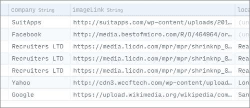
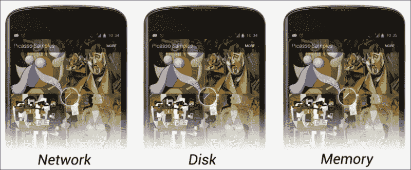
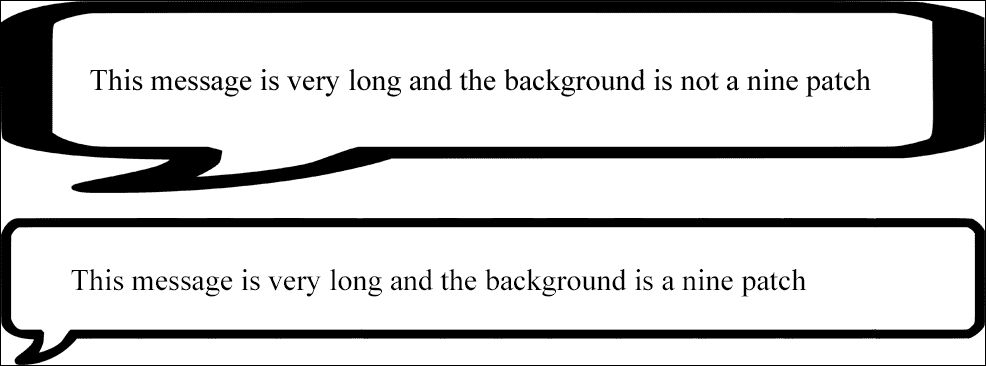
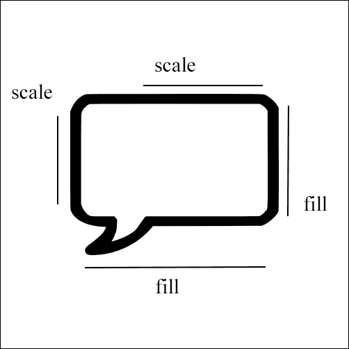
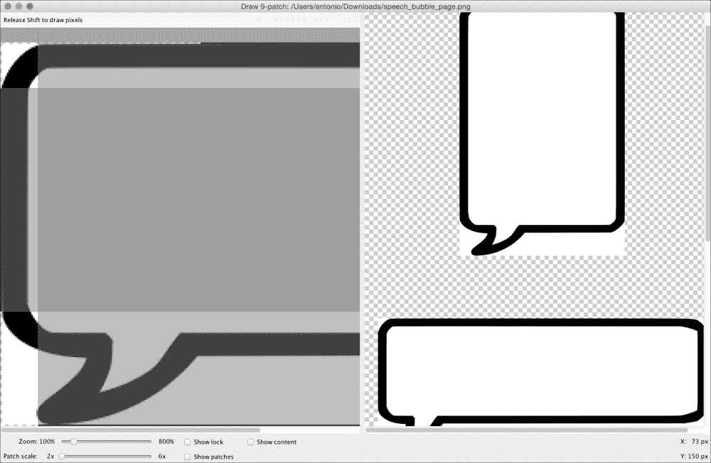
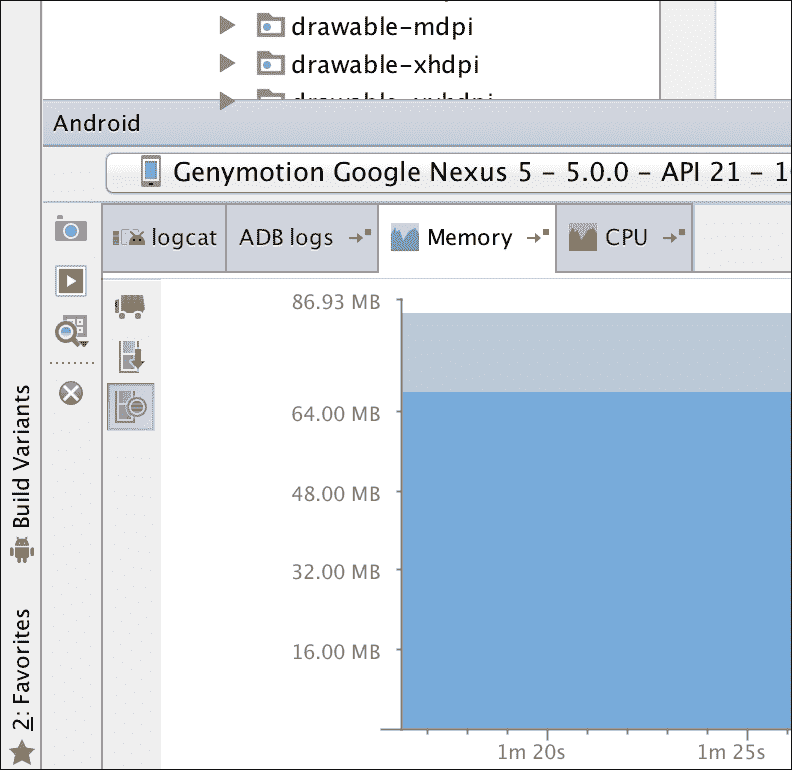
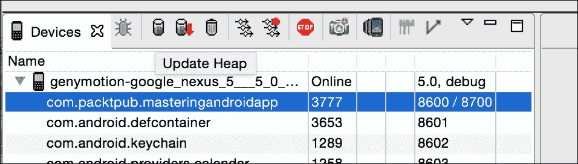
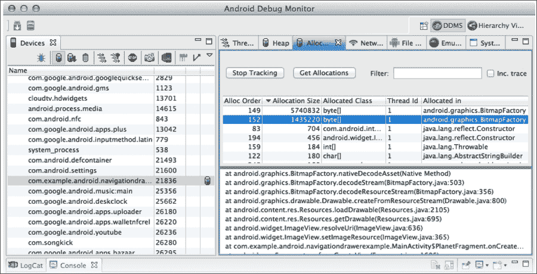
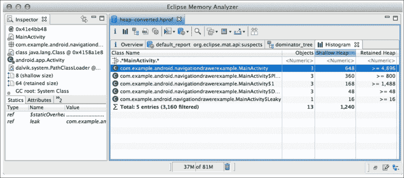

# 第七章：图片处理与内存管理

在本章中，我们将探讨如何展示从 URL 下载的图片。我们将会讨论如何使用 Android 原生 SDK 以及常用的第三方库来实现这一点。我们将考虑诸如下载、压缩、缓存系统以及内存或磁盘存储等关键概念和特性。

我们还将讨论九宫格是什么以及如何创建它，并通过引入矢量图来讲述不同尺寸和密度文件夹中的 drawables。

最后一个部分将专注于内存管理。在我们的应用中识别内存泄漏是一项关键任务，通常在使用图片时会发生。我们将看看可能导致这些泄漏的常见错误以及如何预防的一般性建议。

+   显示网络图片

    +   传统方式

    +   Volley ImageDownloader

    +   毕加索

+   图片

    +   矢量图

    +   动画矢量图

    +   九宫格

+   内存管理

    +   检测和定位泄漏

+   防止泄漏

# 下载图片

使用`ImageView`在单行代码中下载并显示图片是可能的。自从 Android 开发开始，这是每个开发者都做过的事情。Android 是一项超过五年历史的技术，因此我们可以预期这项技术相当先进，并且可以找到简化它的第三方解决方案。话虽如此，如果这本书不解释在没有任何第三方库的情况下下载图片并显示的过程，它就不会被称为《精通 Android》。

在您的应用中使用最新的库是好的，但更好地理解您正在实施的解决方案，甚至能自己构建这个库会更好。

在处理图片时，我们需要从网络连接到数组字节的下载以及它们转换为**位图**的一切。在某些情况下，将图片存储在磁盘上有意义，这样下次我们打开应用时，这些图片就已经在那里了。

即使我们能够显示一张图片，事情并没有就此结束；我们应该能够在列表视图中管理图片的下载。下载、存储和显示系统需要同步，以便应用无故障地运行并拥有流畅的列表，可以无问题地滚动。请记住，当我们浏览列表时，视图是被回收的。这意味着如果我们快速滚动，可能会开始下载一张图片。等到下载完成时，这个视图可能已经不再屏幕上显示，或者它会被回收用于另一个视图。

## 下载图片的传统方式

要在不使用任何第三方库的情况下显示图像（互联网上带有 URL 的图像），我们需要使用 `HttpURLConnection` 建立连接。我们需要打开一个输入流并消费信息，这可以通过工厂方法 `BitmapFactory.decodeStream(InputStream istream)` 转换为 Bitmap 图像。我们可以将其从输入流转为文件，以便将图像存储在磁盘上，以后再访问。目前，让我们尝试先下载它并将其转换为 Bitmap 图像，我们将其保存在内存中并在 `ImageView` 中显示。

我们将在 `OfferDetailActivity` 中为每个优惠展示公司的标志。记得在 Parse 中，我们创建了一个数据库，并且创建了一个名为 `imageLink` 的字段。你只需要将这个字段填充为公司标志的 URL。



我们需要在 `OfferDetailActivity` 中拥有图像链接；为此，我们需要在 `JobOfferAdapter` 中点击卡片时发送一个额外的参数。使用以下代码：

```kt
@Override
public void onClick(View view) {
  Intent intent = new Intent(view.getContext(), OfferDetailActivity.class);
  JobOffer offer = mOfferList.get(getPosition());
  intent.putExtra("job_title", offer.getTitle());
  intent.putExtra("job_description",offer.getDescription());
  intent.putExtra("job_image",offer.getImageLink());
  view.getContext().startActivity(intent);
}
```

负责图像下载的方法将是一个静态方法，可以在应用程序的任何位置调用。这个方法将被放置在名为 `utils` 的包中的 `ImageUtils` 类内。我们首先检查 URL 是否正确，然后从 `HttpURLConnection` 中获取内容，将输入流转为之前解释过的 Bitmap 图像：

```kt
public static Bitmap getImage(String urlString) {

  URL url = null;

  try {
    url = new URL(urlString);
  } catch (MalformedURLException e) {
    return null;
  }

  HttpURLConnection connection = null;
  try {
    connection = (HttpURLConnection) url.openConnection();
    connection.connect();
    int responseCode = connection.getResponseCode();
    if (responseCode == 200) {
      return BitmapFactory.decodeStream(connection.getInputStream());
    } else
      return null;
  } catch (Exception e) {
    return null;
  } finally {
    if (connection != null) {
      connection.disconnect();
    }
  }
}
```

我们将创建一个名为 `displayImageFromUrl()` 的方法，该方法接收 `ImageView` 和带有链接的字符串，以代替在 `onCreate` 中处理所有这些逻辑。在 `onCreate` 中，我们只需要检索参数并调用该方法：

```kt
String imageLink = getIntent().getStringExtra("job_image");
ImageView imageViewLogo = (ImageView) findViewById(R.id.logo);

displayImageFromUrl(imageViewLogo,imageLink);
```

在这个阶段，我们可能想要调用 `ImageUtils.getImage(link)` 方法并将 Bitmap 设置到 `ImageView` 中。但请注意，我们忽略了一件事；我们不能在主活动线程中直接调用打开网络连接的方法。我们需要在后台执行这些操作，否则可能会引发异常。`AsyncTask` 方法正是解决这一问题的好方法：

```kt
String imageLink = getIntent().getStringExtra("job_image");
ImageView imageViewLogo = (ImageView) findViewById(R.id.logo);

displayImageFromUrl(imageViewLogo,imageLink);

public void displayImageFromUrl(ImageView imageView, String link){

  new AsyncTask<Object,Void,Bitmap>(){

    ImageView imageView;
    String link;

    @Override
    protected Bitmap doInBackground(Object... params) {
      imageView = (ImageView) params[0];
      link = (String) params[1];

      return ImageUtils.getImage(link);
    }

    @Override
    protected void onPostExecute(Bitmap bitmap) {
      super.onPostExecute(bitmap);
      imageView.setImageBitmap(bitmap);
    }

  }.execute(imageView, link);
}
```

根据所使用的图像的形状和背景，使用 `ImageView` 属性 `scaleType`，设置为 `centerInside` 或 `centerCrop` 值会看起来更好。`centerInside` 值将缩小图像以确保它适合于接收者同时保持比例。`centerCrop` 值将放大图像直到它填满接收者的最短边。图像的其余部分将超出 `ImageView` 的边界。

在本章开头，我提到过这个功能其实可以用一行代码就完成，但正如你所见，我们自己动手做远不止一行代码，还涉及了后台线程、`HttpURLConnection`等不同的概念。这仅仅是开始；我们实现了最简单的情况。如果我们以同样的方式在列表视图的行中设置图像，会遇到问题。这些问题之一就是在滚动时无限触发`AsyncTask`调用。如果我们有一个带有最大`AsyncTask`数量的队列以及一个取消机制，用以忽略或取消不在屏幕上的视图的请求，这种情况是可以控制的。

当我们启动`AsyncTask`时，我们有一个对`ImageView`的引用，在`PostExecute`中，我们将`Bitmap`设置给它。这个下载操作可能需要一些时间，这样在滚动时`ImageView`可能会被回收。这意味着我们正在下载一个图像，用于在列表的不同位置回收的`ImageView`以显示不同的元素。例如，如果我们有一个带有联系人面孔的列表，我们可能会看到与名字不符的人脸。为了解决这个问题，我们可以做的是将图像链接的字符串设置为`ImageView`的标签，`myImageView.setTag(link)`。如果视图被回收，它将有一个带有新链接的不同项；因此，我们可以在`onPostExecute`中检查，在显示图像之前，当前的链接是否与`ImageView`标签中的链接相同。

这两个是常见问题及其相应的解决方案，但我们还没有就此结束。如果我们继续这条路，最繁琐的事情就是创建一个缓存系统。根据应用和情况的不同，我们可能希望永久存储下载的图像。例如，如果我们正在创建一个带有你最喜欢的专辑列表的音乐应用，将专辑封面存储在磁盘上是有意义的。如果你每次打开应用都会看到最喜欢的列表，并且我们知道封面不会改变，为什么不永久存储图像，以便下次打开应用时加载更快，不消耗任何数据呢？对于用户来说，这意味着每次都能瞬间加载首屏，这对用户体验将是一个巨大的提升。为此，我们需要将图像下载到文件中，并有一个第三种方法稍后从文件中读取图像，包括检查我们是否已经下载了此图像，或者这是我们第一次请求它。

另一个例子可以是新闻源阅读应用。我们知道图像几乎每天都会改变，所以将它们保存在磁盘上没有意义。然而，在我们浏览应用时，可能仍然希望将它们保存在内存中，以避免在同一个会话中返回某个活动时重新下载。在这种情况下，我们需要密切关注内存使用情况。

是时候引入一些第三方库来帮助解决这个问题了。我们可以从 Volley 开始，就是之前用于实现网络请求的那个 Volley。

## 使用 Volley 下载图像

Volley 提供了两种请求图像的机制。第一种机制`ImageRequest`与我们刚才使用 Volley 请求队列和按需调整图像大小完成的`AsyncTask`非常相似。以下是请求的构造函数：

```kt
public ImageRequest(String url, Response.Listener<Bitmap> listener, int maxWidth, int maxHeight, Config decodeConfig, Response.ErrorListener errorListener) { … }
```

`maxWidth`和`maxHeight`参数将用于调整图像大小；如果我们不想调整大小，可以将其值设置为`0`。这是我们示例中用于获取图像的方法：

```kt
public void displayImageWithVolley(final ImageView imageView, String url){

  ImageRequest request = new ImageRequest(url,
  new Response.Listener<Bitmap>() {
    @Override
    public void onResponse(Bitmap bitmap) {
      imageView.setImageBitmap(bitmap);
    }
  }, 0, 0, null,
  new Response.ErrorListener() {
    public void onErrorResponse(VolleyError error) {

    }
  });

  MAApplication.getInstance().getRequestQueue().add(request);
}
```

第二个机制，真正有趣的是`ImageLoader`。它可以同时处理多个请求，并且是我们在上一节中解释的原因下，在列表视图中使用的机制。我们可以创建我们希望它使用的缓存机制——内存或磁盘。

它通过使用一种特殊的`ImageView：NetworkImageView`来工作。当`ImageLoader`对象准备好后，我们可以仅用一行代码通过`NetworkImageView`下载图片：

```kt
myNetworkImageView.setImage(urlString, imageloader);
```

它允许我们执行不同的操作，例如设置默认图像或设置在请求失败时的图像。使用以下代码：

```kt
myNetworkImageView.sesetDefaultImageResId(R.id.default_image);
myNetworkImageView.setErroImageResId(R.id.image_not_found);
```

如果说这里有复杂性，那就是在我们实现`ImageLoader`的时候。首先，我们需要以在`Application`类中创建`RequestQueue`相同的方式来创建它，这样我们的应用中任何地方都可以访问到：

```kt
@Override
public void onCreate() {
  super.onCreate();

  sInstance = this;

  mRequestQueue = Volley.newRequestQueue(this);

  mImageLoader = new ImageLoader(mRequestQueue, new myImageCache());
```

构造函数需要一个缓存实现。Google 是一个基于内存的缓存示例，其大小等于三屏图像的大小：

```kt
public class LruBitmapCache extends LruCache<String, Bitmap>
implements ImageCache {

  public LruBitmapCache(int maxSize) {
    super(maxSize);
  }

  public LruBitmapCache(Context ctx) {
    this(getCacheSize(ctx));
  }

  @Override
  protected int sizeOf(String key, Bitmap value) {
    return value.getRowBytes() * value.getHeight();
  }

  @Override
  public Bitmap getBitmap(String url) {
    return get(url);
  }

  @Override
  public void putBitmap(String url, Bitmap bitmap) {
    put(url, bitmap);
  }

  // Returns a cache size equal to approximately three screens worth of images.
  public static int getCacheSize(Context ctx) {
    final DisplayMetrics displayMetrics = ctx.getResources().
    getDisplayMetrics();
    final int screenWidth = displayMetrics.widthPixels;
    final int screenHeight = displayMetrics.heightPixels;
    // 4 bytes per pixel
    final int screenBytes = screenWidth * screenHeight * 4;

    return screenBytes * 3;
  }
}
```

我们可以看到，在缓存实现之间的选择是一个手动过程；我们必须创建带有所需实现的类，并将其设置在`ImageLoader`的构造函数中。这就是为什么接下来我们要了解的库在推出时是一次革命。

## 介绍 Picasso

创建`OkHttp`的同一批人将 Picasso 带到了 Android 社区。Picasso 允许我们仅用一行代码下载并显示图像，无需创建`ImageLoader`，并且具有自动使用磁盘和内存的缓存实现。它包括图像转换、`ImageView`回收和请求取消等功能。所有这些都是免费的。Square 团队带给社区的东西令人难以置信。

如果这还不够，调试模式会在图像中显示指示器，角落里的小三角形，不同的颜色表示我们第一次下载图像（即从网络获取时）、从内存缓存获取时以及从磁盘缓存获取时：



# 掌握图像处理

在结束关于图像这一章节之前，我们必须介绍本书中的两个概念。你知道，根据屏幕密度，图像可以被放置在多个文件夹中——从低密度的`drawable-ldpi`到高密度的`drawable-hdpi`，以及超超超高密度的`drawable-xxxhdpi`，将来可能还会有更多。当我们这样做时，需要考虑我们是希望在所有屏幕上获得高质量图像，还是一个轻量级的 APK。复制图像将增加我们安装程序的大小。在 Android 5.0 中引入的以下组件将解决这个问题。

## 矢量图形

这些图形基于矢量图形；矢量图形可以放大或缩小而不损失任何质量。有了这个，我们只需要一个图形资源，无论在什么屏幕上使用，它都会有出色的质量，无论是 Android 手表还是 Android 电视。

矢量图形（Vector drawables）是以与定义形状相同的方式定义的——在 XML 文件中。下面是一个简单的`vectordrawable.xml`文件示例：

```kt
<vector  android:height="64dp" android:width="64dp" android:viewportHeight="600" android:viewportWidth="600">
  <group>
    <path android:fillColor="@color/black_primary" android:pathData="M12 36l17-12-17-12v24zm20-24v24h4V12h-4z" />
  </group>
</vector>
```

请注意，矢量标签具有高度和宽度属性；如果我们把这个图形设置在`ImageView`中，且大小小于容器，它看起来会变得像素化。

你可能会问，我们从哪里获取`pathData`属性？你可能有一个`.svg`格式的图像，这是一种可缩放图形的格式。这个图像可以用文本编辑器打开，你应该能看到类似于此处路径数据的内容：

```kt
<svg  width="48" height="48" viewBox="0 0 48 48">
  <path d="M12 36l17-12-17-12v24zm20-24v24h4V12h-4z"/>
</svg>
```

谷歌提供了一套材料设计图标，这些图标带有 SVG 版本；有了这个，你可以开始为你的应用添加无限可缩放的图像。我们展示的路径是这套图标中的媒体播放器图标。


矢量图形将被添加到设计支持库中，因此它可以在之前的 Android 版本中使用，不仅仅是 5.0 版本。

下一个组件可能不会包含在设计支持库中，因此我们需要考虑是否要根据 5.0 版本及以上版本的普及程度来决定是否使用它。无论如何，它值得解释，因为迟早它会因为其惊人的效果而被更广泛地看到。

## 使用 AnimatedVectorDrawable 进行动画处理

顾名思义，`AnimatedVectorDrawable`是一个带有动画的矢量图形，这是一个重要的特性。这些动画不仅仅是旋转、缩放、透明度等我们在之前的 Android 中见过的类型；这些动画还允许我们变换图形的`pathData`属性。这意味着我们可以有一个图形能够改变形状，或者转换成另一个图形。

这带来了无限多的 UI 可能性。例如，我们可以有一个播放按钮转换成一个不断旋转作为进度条的半圆，或者一个播放按钮变成暂停按钮。

我们可以定义传统的动画，比如旋转，如下所示：

```kt
<objectAnimator

  android:duration="6000"
  android:propertyName="rotation"
  android:valueFrom="0"
  android:valueTo="360" />
```

下面是如何定义从三角形到矩形的形状变换的方法：

```kt
<set
  >
  <objectAnimator
    android:duration="3000"
    android:propertyName="pathData"
    android:valueFrom="M300,70 l 0,-70 70,70 0,0   -70,70z"
      android:valueTo="M300,70 l 0,-70 70,0  0,140 -70,0 z"
    android:valueType="pathType"/>
</set>
```

要将它们组合在`AnimatedVectorDrawable`对象中，请执行以下代码：

```kt
<animated-vector

  android:drawable="@drawable/vectordrawable" >
  <target
    android:name="rotationGroup"
    android:animation="@anim/rotation" />
  <target
    android:name="v"
    android:animation="@anim/path_morph" />
</animated-vector>
```

这仅限于具有相同长度和相同命令长度的路径。

## 使用九宫格图像

在解释九宫格是什么之前，我将先展示它何时是必需的。如果我们正在开发一个消息应用程序，并且需要显示用户在聊天气泡中写入的内容，我们可以考虑创建`TextView`并将消息气泡的图像设置为背景。如果消息非常长，这就是在没有九宫格背景和有九宫格背景的情况下分别发生的情况。



我们可以看到第一张图片被拉伸了，看起来很糟糕；然而，我们并不希望拉伸边界。我们想要的是保持边界不变，但根据信息内容使文本区域变高或变宽。

九宫格图像是一种可以根据内容调整大小的图像，但它涉及留出一些无需拉伸的区域。它可以从 PNG 文件中的图像创建。基本上，它和 PNG 文件一样，只是在每个边上多了一个像素，并以`.9.png`扩展名保存。当我们将其放在`drawable`文件夹中时，Android 会知道在额外的像素中，有信息了解哪些区域需要拉伸，哪些不需要。

如果你观察图像，你会看到左侧和顶部额外的像素行用于指定哪些内容是可缩放的，底部和右侧的线条用于指定哪些空间可以被填充。我们希望完全填满盒子，但我们只想将左侧的某部分进行缩放。



Android 提供了一个工具来创建这些九宫格图像，你可以在 SDK 文件夹下的`tools`中找到它。只需打开`draw9patch`并将图像拖入其中。



# 内存管理

每个 Java 开发者都听说过**垃圾回收器**（**GC**）；这是一种自动为我们释放内存资源的机制。在某些情况下，我们可以防止垃圾回收器释放某些资源；如果资源持续增长，我们不可避免地会遇到`OutOfMemoryError`。

如果发生这种情况，我们需要定位泄漏并阻止它。在本节中，我们将了解如何定位问题的来源以及一系列防止这种情况发生的好习惯。

这不是只有在发生错误时才要关注的事情；我们的应用程序可能存在泄漏，这些泄漏不足以通过快速测试检测出来，但在内存堆较小的设备上可能导致错误。因此，在发布应用程序之前，对内存水平进行快速检查是很有好处的。

## 检测和定位泄漏

Android Studio 提供了一种快速检查内存状态的方法。在底部窗口中，你会在`logcat`和**ADB**日志旁边找到一个名为**Memory**的标签。



如果你点击我们称为垃圾回收器的小卡车图标，你会看到空闲内存如何增加。

不要将此作为空闲内存的参考，因为堆内存是动态的。这意味着堆内存最初可能是 64 MB；我们有 60 MB 已分配和 4 MB 空闲，但我们再分配 10 MB。堆内存可能会增长，最终我们会有一个 128 MB 的堆内存，其中 70MB 已分配和 58 MB 空闲。

要检测泄漏，我们需要获取已分配内存的引用。不断点击垃圾回收器，并在应用中导航，打开和关闭活动，加载图片，滚动列表，并多次执行这些操作。如果分配的内存持续增长且从不下降，这意味着我们在泄漏内存，阻止了一些资源的回收。我们可以大致确定泄漏发生在哪个活动或片段，因为我们将始终在相同点看到增长（假设我们不止有一个泄漏）。

要更精确地定位来源，我们需要使用**Android 设备监视器**：


选择你的应用进程，并点击**更新堆内存**：



选择此项后，我们可以看到对象的分配情况；如果出现位图或线程泄漏，这将是一个很好的线索：



如果我们仍然不清楚是什么在泄漏内存，可以点击**转储 HPROF 文件**按钮，并使用 Eclipse 的记忆分析工具**MAT**打开此文件。为此，我们将需要下载 Eclipse。

导入文件后，我们可以双击我们的进程，并点击**列出对象**，这将识别正在发生的情况。例如，我们可以看到活动中有多少对象以及使用了多少堆内存：



## 防止泄漏

比起修复内存泄漏，更好的做法是根本不让它发生。如果在开发过程中，我们牢记导致泄漏最常见的原因，这将为我们将来省去许多问题。

### Activity 和上下文引用

Activity 的引用是这个问题的主要原因之一。将我们活动的引用发送给下载监听器或事件监听器是非常常见的。如果另一个对象持有我们活动的引用，这将阻止垃圾回收器释放我们的活动。例如，如果我们改变方向，我们的活动默认会再次创建，而具有旧方向的旧活动将被销毁。

记得在我们的 Activity 的`onDestroy`方法中取消监听器的订阅，并注意你发送 Context 的对象；这是我们 Activity 的强引用。

### 使用 WeakReference

在 Java 中创建对象时，默认情况下它是以强引用创建的。不同与 null 且具有强引用的对象不会被垃圾回收。

只包含弱引用的对象将在下一个周期被垃圾回收。同一个对象可以有多个引用；因此，如果我们需要临时使用一个对象，可以创建一个指向它的弱引用，当强引用被移除时，它将被垃圾回收。

这是一个包含在 Facebook SDK 源代码中的真实世界示例。他们创建了一个名为**ToolTipPopup**的自定义弹出窗口，它看起来类似于以下图片：


这个弹出窗口需要一个锚视图，这个锚视图是通过弱引用来引用的：

```kt
private final WeakReference<View> mAnchorViewRef;
```

这背后的原因是，在弹出窗口显示的时候，我们不再需要锚视图了。一旦弹出窗口显示，可以将锚视图设置为 null 或使其消失，这不会影响我们。因此，使用弱引用，如果原始锚视图被销毁并失去了其强引用，它也会在`ToolTipPopup`类中释放弱引用对象。

# 总结

在本章中，你学习了如何在不依赖任何第三方库的情况下下载图片，以理解它们的使用方法。对 Volley 和 Picasso 的概览使我们可以准备好实现任何处理完美的应用程序。我们还花了一些时间讨论了添加到我们应用程序中的图片，如矢量可绘制资源和九宫格图片。为了完成本章，我们还了解了如何管理应用程序中的内存问题，更重要的是，如何预防这些问题。

在下一章中，我们将创建一个 SQLite 数据库。我们将通过内容提供者导出这个数据库，并通过`CursorLoader`与内容提供者同步 UI 数据。
