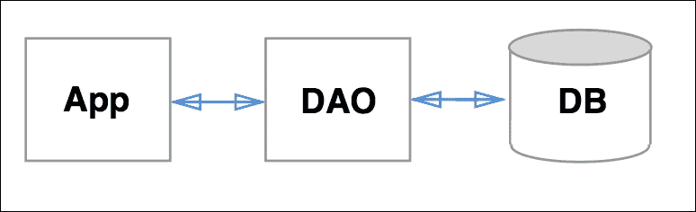
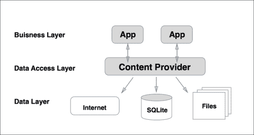
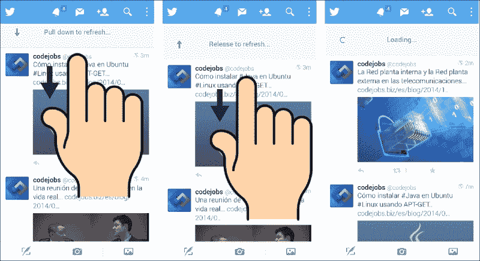

# 第八章：数据库和加载器

在本章中，我们将按照数据库契约创建一个 SQLite 数据库，并使用名为**DAO**（**数据访问对象**）的数据库执行读写操作。我们还将解释查询与原始查询之间的区别。

你将学习什么是内容提供者以及如何创建它，这将允许我们从`CursorLoader`访问这个数据库。我们将通过内容解析器访问内容提供者，同时查询数据库的不同表格，你将学会如何在内容提供者中使用联接查询。

使用`CursorLoader` **，**我们可以通过创建一个机制来将列表视图与数据库同步，如果我们存储或修改数据库中的任何数据，这些更改将自动反映在我们的视图中。

最后，我们将添加流行的下拉刷新功能，以便按需更新内容。因此，在本章中，将涵盖以下主题：

+   创建数据库

    +   数据库契约

    +   数据库开放助手

    +   数据库访问对象

+   创建和访问内容提供者

    +   内容提供者

    +   内容解析器

+   同步数据库与 UI

    +   CursorLoader

    +   RecyclerView 和 CursorAdapter

+   下拉刷新

# 创建数据库

为了理解 Android 中的数据库是如何工作的，我们将继续在我们的示例应用`MasteringAndroidApp`上工作，创建一个数据库来存储工作机会，这些工作机会将用于在离线模式下查看内容。这意味着如果我们打开应用一次，工作机会将被保存在设备上，即使在没有互联网连接的情况下打开，我们也能看到信息。

在 Android 中有四种机制来持久化数据：

+   **共享偏好设置**：这些偏好设置用于以键值结构存储基本信息

+   **内部存储**：这种存储保存的是你应用私有的文件

+   **外部存储**：这种存储保存可以与其他应用共享的文件

+   **SQLite 数据库**：这个基于流行的 SQL 的数据库允许我们以结构化的方式编写和读取信息

我们可以创建简单的结构，比如单表数据库，也可以创建包含多个表格的复杂结构。我们可以合并不同表格的输出以创建复杂的查询。

我们将创建两个表格，以展示如何使用内容提供者创建联接查询。

将有一个公司表格，包含公司 ID，一些关于它们的信息，如名称、网站、额外信息等。第二个表格将包含工作机会；这也需要包含一个带有公司 ID 的列。如果我们想要一个整洁的结构，而不是一个包含众多字段的大型表格，最好是将公司信息放在公司表格中，将工作机会放在工作表格中，只需引用公司即可。

为了清晰起见，也为了专注于 SQLite，我们不会改变 Parse 中的数据结构。因此，我们将下载内容并手动拆分公司和职位信息，将它们分别插入不同的表中。

我们的公司表将具有以下结构：

| RowId | 名称 | 图片链接 |
| --- | --- | --- |
| 0 | Yahoo | …. |
| 1 | Google | … |

`rowId`列是 Android 自动添加的，因此在创建表时我们不需要指定这个列。

下表是职位提供表：

| RowId | 标题 | 描述 | 薪水 | 地点 | 类型 | Company_id |
| --- | --- | --- | --- | --- | --- | --- |
| 24 | 高级安卓开发.. | 2 倍开发者 | 55.000 | 英国伦敦 | 固定职位 | 1 |
| 25 | 初级安卓开发.. | 有经验的开发者 | 20.000 | 英国伦敦 | 固定职位 | 0 |

我们将创建一个视图，作为这两个表连接的结果；在这里，连接将基于`company_id`：

| 标题 | 描述 | 薪水 | 地点 | 类型 | 公司 ID | 名称 | 图片链接 |
| --- | --- | --- | --- | --- | --- | --- | --- |
| 高级安卓开发 | 2 倍开发者.. | 55.000 | 英国伦敦 | 固定职位 | 1 | Google | … |
| 初级安卓开发 | 有经验的开发者 | 20.000 | 英国伦敦 | 固定职位 | 0 | Yahoo | … |

这个视图将允许我们获取所需的所有数据，每一行都包含完整信息。

## 数据库契约

数据库契约是一个类，我们在其中定义了数据库的名称以及所有表和列的名称作为常量。

它有两个目的：首先，它是一种一眼就能了解数据库结构的好方法。

要创建数据库包和`DatabaseContract.java`类，请使用以下代码：

```kt
public class DatabaseContract {

  public static final String DB_NAME = "mastering_android_app.db";

  public abstract class JobOfferTable {

    public static final String TABLE_NAME = "job_offer_table";

    public static final String TITLE = "title";
    public static final String DESC = "description";
    public static final String TYPE = "type";
    public static final String SALARY = "salary";
    public static final String LOCATION = "location";
    public static final String COMPANY_ID = "company_id";
  }

  public abstract class CompanyTable {

    public static final String TABLE_NAME = "company_table";

    public static final String NAME = "name";
    public static final String IMAGE_LINK = "image_link";
  }
}
```

其次，使用对常量的引用可以避免错误，并允许我们只更改常量值一次，并在整个应用程序中传播这个更改。

例如，在数据库中创建此表时，我们需要使用 SQL 语句`CREATE TABLE "name"..`；我们将要做的是使用契约中的表名，即`CREATE TABLE DatabaseContract.CompanyTable.TABLE_NAME..`。

数据库契约只是第一步。它不创建数据库；它只是一个我们用作模式的文件。要创建数据库，我们需要`SQLiteOpenHelper`的帮助。

## 数据库打开助手

打开助手是一个管理数据库创建和更新的类。更新是我们需要牢记的重要方面。考虑到我们将应用上传到 Play 商店，一段时间后，我们想要更改数据库的结构。例如，我们想要向表中添加一列，而不丢失之前版本用户在旧模式中存储的数据。将新版本上传到 Play 商店，当用户更新我们的应用时删除先前信息，这对用户体验来说是非常不好的。

为了知道何时需要更新数据库，我们有一个静态整数，其中包含数据库版本，如果我们更改数据库，需要手动增加这个版本，如下所示：

```kt
/**
* DATABASE VERSION
*/
private static final int DATABASE_VERSION = 1;
```

我们需要创建一个扩展 `SQLiteOpenHelper` 的 `DatabaseOpenHelper` 类。在扩展这个类时，要求我们实现两个方法：

```kt
@Override
public void onCreate(SQLiteDatabase db) {
  //Create database here
}

@Override
public void onUpgrade(SQLiteDatabase db, int oldVersion, int newVersion) {
  //Update database here
}
```

`SQLiteOpenHelper` 类在我们创建此类对象时会自动调用 `onCreate` 方法。但是，它仅在数据库尚未创建过且仅调用一次时这样做。同样，当我们将数据库版本升级时，它会调用 `onUpgrade` 方法。这就是为什么在我们创建此类对象时，需要传递带有数据库名和当前版本的参数：

```kt
public DBOpenHelper(Context context){
  super(context, DatabaseContract.DB_NAME, null, DATABASE_VERSION);
}
```

让我们从创建数据库开始；`onCreate` 方法需要在数据库上执行一条 SQL 语句来创建表：

```kt
db.execSQL(CREATE_JOB_OFFER_TABLE);
db.execSQL(CREATE_COMPANY_TABLE);
```

我们将把这些语句定义在静态变量中，如下所示：

```kt
/**
* SQL CREATE TABLE JOB OFFER sentence
*/
private static final String CREATE_JOB_OFFER_TABLE = "CREATE TABLE "
+ DatabaseContract.JobOfferTable.TABLE_NAME + " ("
+ DatabaseContract.JobOfferTable.TITLE + TEXT_TYPE + COMMA
+ DatabaseContract.JobOfferTable.DESC + TEXT_TYPE + COMMA
+ DatabaseContract.JobOfferTable.TYPE + TEXT_TYPE + COMMA
+ DatabaseContract.JobOfferTable.SALARY + TEXT_TYPE + COMMA
+ DatabaseContract.JobOfferTable.LOCATION + TEXT_TYPE + COMMA
+ DatabaseContract.JobOfferTable.COMPANY_ID + INTEGER_TYPE + " )";
```

默认情况下，Android 在每一行中创建一个 `column_id` 列，该列是唯一的且自动递增的；因此，在 companies 表中我们不需要创建列 ID。

如您所见，我们在变量中也有逗号和类型，以避免错误。直接编写语句时遗漏逗号或出错是很常见的，而且找出错误非常耗时：

```kt
/**
* TABLE STRINGS
*/
private static final String TEXT_TYPE = " TEXT";
private static final String INTEGER_TYPE = " INTEGER";
private static final String COMMA = ", ";
```

我们已经看到了如何创建我们的表，现在我们必须管理更新。在这种情况下，我们将简单地删除以前的信息并重新创建数据库，因为表中没有重要的信息。更新后打开应用时，它将再次下载职位信息并填充新数据库：

```kt
@Override
public void onUpgrade(SQLiteDatabase db, int oldVersion, int newVersion) {
  db.execSQL(DROP_JOB_OFFER_TABLE);
  db.execSQL(DROP_COMPANY_TABLE);
  onCreate(db);
}

/**
* SQL DELETE TABLE SENTENCES
*/
public static final String DROP_JOB_OFFER_TABLE = "DROP TABLE IF EXISTS "+ DatabaseContract.JobOfferTable.TABLE_NAME;
public static final String DROP_COMAPNY_TABLE = "DROP TABLE IF EXISTS "+ DatabaseContract.CompanyTable.TABLE_NAME;
```

我们类的完整版本将如下所示：

```kt
public class DBOpenHelper extends SQLiteOpenHelper {

  private static final int DATABASE_VERSION = 1;

  /**
  * TABLE STRINGS
  */
  private static final String TEXT_TYPE = " TEXT";
  private static final String INTEGER_TYPE = " INTEGER";
  private static final String COMMA = ", ";

  /**
  * SQL CREATE TABLE sentences
  */
  private static final String CREATE_JOB_OFFER_TABLE = "CREATE TABLE "
  + DatabaseContract.JobOfferTable.TABLE_NAME + " ("
  + DatabaseContract.JobOfferTable.TITLE + TEXT_TYPE + COMMA
  + DatabaseContract.JobOfferTable.DESC + TEXT_TYPE + COMMA
  + DatabaseContract.JobOfferTable.TYPE + TEXT_TYPE +

  COMMA       + DatabaseContract.JobOfferTable.SALARY + TEXT_TYPE +

  COMMA       + DatabaseContract.JobOfferTable.LOCATION + TEXT_TYPE +

  COMMA + DatabaseContract.JobOfferTable.COMPANY_ID +

  INTEGER_TYPE + " )";

  private static final String CREATE_COMPANY_TABLE = "CREATE TABLE "
  + DatabaseContract.CompanyTable.TABLE_NAME + " ("
  + DatabaseContract.CompanyTable.NAME + TEXT_TYPE + COMMA
  + DatabaseContract.CompanyTable.IMAGE_LINK + TEXT_TYPE +  " )";

  /**
  * SQL DELETE TABLE SENTENCES
  */
  public static final String DROP_JOB_OFFER_TABLE = "DROP TABLE IF EXISTS "+ DatabaseContract.JobOfferTable.TABLE_NAME;
  public static final String DROP_COMPANY_TABLE = "DROP TABLE IF EXISTS "+ DatabaseContract.CompanyTable.TABLE_NAME;

  public DBOpenHelper(Context context){
    super(context, DatabaseContract.DB_NAME, null, DATABASE_VERSION);
  }

  @Override
  public void onCreate(SQLiteDatabase db) {
    db.execSQL(CREATE_JOB_OFFER_TABLE);
    db.execSQL(CREATE_COMPANY_TABLE);
  }

  @Override
  public void onUpgrade(SQLiteDatabase db, int oldVersion, int newVersion) {
    db.execSQL(DROP_COMPANY_TABLE);
    db.execSQL(DROP_JOB_OFFER_TABLE);
    onCreate(db);
  }
}
```

## 数据库访问对象

**数据库访问对象**，通常称为 **DAO**，是一个管理应用中所有数据库访问的对象。从概念上讲，它是介于数据库和我们的应用之间的一个类：



这是在 **J2EE** （**Java 2 Enterprise Edition**）服务器端通常使用的模式。在这种模式中，数据库实现可以被更改，并增加一层独立性，从而允许在不更改应用中的任何数据的情况下更改数据库实现。即使我们在 Android 中不更改数据库的实现（它始终是通过 `SQLiteOpenHelper` 获取的 SQLite 数据库），使用这种模式仍然是有意义的。从结构的角度来看，我们将在同一个地方拥有所有数据库访问操作。同时，将 DAO 作为单例对象，并使用同步方法，可以防止诸如同时从两个不同的地方尝试打开数据库的问题，如果我们正在写入，可能会被锁定。当然，从应用中的任何地方获取此单例的可能性也使得访问数据库变得非常容易。

在下一节中，我们将了解如何创建一个内容提供者，它可以替换我们的 DAO 对象；然而，如果我们只是想从数据库中存储和读取数据，实现内容提供者是非常繁琐的。让我们继续使用`MasteringAndroidApp`，创建一个名为`MasteringAndroidDAO`的类，它将存储工作机会和公司信息，并从数据库中显示信息，以便拥有一个离线工作的应用。

这个类将是单例模式，有两个公共的同步方法：一个用于存储工作机会（在工作机会表和公司表中），另一个用于读取。即使我们将信息分成两个表，读取时我们还会将其合并，以便我们可以继续使用当前适配器显示工作机会，而无需进行重大更改。通过这种方式，你将学会如何在查询中连接两个表。

如果一个方法是同步的，我们保证它不能同时从两个地方执行。因此，请使用以下代码：

```kt
public class MasteringAndroidDAO {

  /**
  * Singleton pattern
  */
  private static MasteringAndroidDAO sInstane = null;

  /**
  * Get an instance of the Database Access Object
  *
  * @return instance
  */
  public static MasteringAndroidDAO getInstance(){
    if (sInstane == null){
      sInstane = new MasteringAndroidDAO();
    }
    return sInstane;
  }

  public synchronized boolean storeOffers(Context context, List<JobOffer> offers){
    //Store offers
  }

  public synchronized List<JobOffer> getOffersFromDB(Context context){
    //Get offers
  }

}
```

我们将从`storeOffers()`方法开始。首先需要使用`DatabaseOpenHelper`打开数据库，然后我们需要在数据库中开始一个事务。我们将存储一个项目列表，因此为每个项目执行事务是没有意义的。如果我们打开一个事务，执行所有需要的插入操作，然后结束事务，批量提交所有更改，这样效率会更高：

```kt
try {
  SQLiteDatabase db = newDBOpenHelper(context).getWritableDatabase();

  db.beginTransaction();
  //insert single job offer
  db.setTransactionSuccessful();
  db.endTransaction();
  db.close();
} catch ( Exception e){
  Log.d("MasteringAndroidDAO",e.toString());
  return false;
}
```

### 提示

最后不要忘记使用`db.close()`关闭数据库。否则，它将保持打开状态并消耗资源，如果我们尝试再次打开它，将会得到一个异常。

如果我们只需要在单个表中插入数据，我们只需要创建一个`ContentValue`对象——一个基于我们想要存储的列构建的键值对象，并调用`db.insert(contentValue)`。然而，我们的例子稍微复杂一些。为了存储一个工作机会，我们需要知道公司 ID，而要获得这个 ID，我们需要询问数据库是否已经存储了该公司。如果没有，我们需要存储它并知道分配给它的 ID，因为如我们之前提到的，ID 是自动生成并增加的。

要找出公司是否已经在表中，我们需要执行一个查询，搜索所有行，看是否有任何行与我们要查找的公司名称相匹配。有两种执行查询的方法：`query()`和`rawQuery()`。

### 执行查询

查询需要以下参数：

+   `tableColumns`：这是投影。我们可能想要返回整个表中我们希望在游标中返回的列。在这种情况下，它将是 null，等同于`SELECT * FROM`。或者，我们可能只想返回一列，`new String[]{"column_name"}`，甚至是一个原始查询。（这里，`new String[]{SELECT ….}`）。

+   `whereClause`：通常使用`"column_name > 5"`条件；然而，如果参数是动态的，我们使用`"column_name > ?"`。问号用于指定参数的位置，这些参数将在下面的`whereArgs`参数中给出。

+   `whereArgs`：这是`where`子句中的参数，将替换问号。

+   `groupBy`（`having`，`orderby`和`limit`）：这些是其余的参数，如果不用可以设置为 null。

在我们的案例中，这就是我们询问数据库中是否存在某公司的操作方式。它将返回一个只包含一列游标，这正是我们获取 ID 所需：

```kt
Cursor cursorCompany = db.query(DatabaseContract.CompanyTable.TABLE_NAME,
  new String[]{"rowid"},
  DatabaseContract.CompanyTable.NAME +" LIKE ?",
  new String[]{offer.getCompany()},
  null,null,null);
```

使用`QueryBuilder`而不是`rawQuery`的好处是能够防止 SQL 注入。同时，它不容易出错。在性能方面，它并没有任何优势，因为它内部创建了`rawQuery`。

### 使用原始查询

原始查询只是一个带有 SQL 查询的字符串。在我们的示例中，它将是如下形式：

```kt
String queryString = "SELECT rowid FROM company_table WHERE name LIKE '?'"; 
Cursor c = sqLiteDatabase.rawQuery(queryString, whereArgs);
```

在大多数情况下，原始查询的可读性更强，实现所需的代码也较少。在这种情况下，有不良意图的用户可能会在`whereArgs`变量中添加更多的 SQL 代码以获取更多信息，产生错误或删除任何数据。它并不能防止 SQL 注入。

### 介绍游标

当我们调用`query()`或`rawQuery()`时，结果会以游标的形式返回。游标是包含许多用于访问和遍历它的方法的行集合。当不再使用时，它应该被关闭。

遍历游标最简短的方式是在循环中调用`moveToNext()`方法，该方法在没有下一个元素时会返回 false：

```kt
Cursor c = query….
while (c.moveToNext()) {
  String currentName = c.getString(c.getColumnIndex("column_name"));
}
```

要读取这些信息，我们有不同的方法，如`getString()`，它接收所需值列的索引。

要知道公司是否已经在表中，我们可以执行一个查询，这将返回一个只包含一列整数的 ID 的行集合。如果有结果，ID 将在索引为`0`的列中：

```kt
public int findCompanyId(SQLiteDatabase db, JobOffer offer){
  Cursor cursorCompany = db.query(DatabaseContract.CompanyTable.TABLE_NAME,
  new String[]{"rowid"},
  DatabaseContract.CompanyTable.NAME +" LIKE ?",
  new String[]{offer.getCompany()},
  null,null,null);

  int id = -1;

  if (cursorCompany.moveToNext()){
    id = cursorCompany.getInt(0);
  }
  return id;
}
```

另一个选项是将公司名称的列定义为唯一，并使用`insertWithOnConflict`指定忽略冲突。这样，如果公司已经存在于数据库中或刚刚被插入，它将返回 ID：

```kt
db.insertWithOnConflict(DATABASE_TABLE, null, initialValues, SQLiteDatabase.CONFLICT_IGNORE);
```

我们可以为查询创建一个方法，如果查询结果存在，则从游标中获取 ID。如果没有结果，则结果为`-1`。在存储工作机会之前，我们将检查公司是否存在。如果不存在，我们将存储公司，并在插入时返回 ID：

```kt
public boolean storeOffers(Context context, List<JobOffer> offers){

  try {
    SQLiteDatabase db = new DBOpenHelper(context).getWritableDatabase();

    db.beginTransaction();

    for (JobOffer offer : offers){

      ContentValues cv_company = new ContentValues();
      cv_company.put(DatabaseContract.CompanyTable.NAME, offer.getCompany());
      cv_company.put(DatabaseContract.CompanyTable.IMAGE_LINK,offer.getImageLink());

      int id = findCompanyId(db,offer);

      if (id < 0) {
        id = (int) db.insert(DatabaseContract.CompanyTable.TABLE_NAME,null,cv_company);
      }

      ContentValues cv = new ContentValues();
      cv.put(DatabaseContract.JobOfferTable.TITLE,offer.getTitle());
      cv.put(DatabaseContract.JobOfferTable.DESC,offer.getDescription());
      cv.put(DatabaseContract.JobOfferTable.TYPE, offer.getType());
      cv.put(DatabaseContract.JobOfferTable.DESC, offer.getDescription());
      cv.put(DatabaseContract.JobOfferTable.SALARY,offer.getSalary());
      cv.put(DatabaseContract.JobOfferTable.LOCATION,offer.getLocation());
      cv.put(DatabaseContract.JobOfferTable.COMPANY_ID,id);

      db.insert(DatabaseContract.JobOfferTable.TABLE_NAME,null,cv);
    }

    db.setTransactionSuccessful();
    db.endTransaction();

    db.close();

  } catch ( Exception e){
    Log.d("MasteringAndroidDAO", e.toString());
    return false;
  }

  return true;
}
```

在测试这个之前，理想的情况是准备好从数据库读取的方法，这样我们就可以检查是否所有内容都正确存储。我们的想法是同时查询这两个表，通过连接查询以获取包含我们所需所有字段的一个游标。

在 SQL 中，这将是一个如下的查询语句：`SELECT * FROM job_offer_table JOIN company_table ON job_offer_table.company_id = company_table.rowid ...`

我们需要使用数据库合约中表的名字来执行查询。以下是它将呈现的样子：

```kt
public List<JobOffer> getOffersFromDB(Context context){

  SQLiteDatabase db = new DBOpenHelper(context).getWritableDatabase();

  String join = DatabaseContract.JobOfferTable.TABLE_NAME + " JOIN " +
  DatabaseContract.CompanyTable.TABLE_NAME + " ON " +
  DatabaseContract.JobOfferTable.TABLE_NAME+"."+DatabaseContract.JobOfferTable.COMPANY_ID
  +" = " + DatabaseContract.CompanyTable.TABLE_NAME+".rowid";

  Cursor cursor = db.query(join,null,null,null,null,null,null);

  List<JobOffer> jobOfferList = new ArrayList<>();

  while (cursor.moveToNext()) {
    //Create job offer from cursor and add it
    //to the list
  }

  cursor.close();
  db.close();

  return jobOfferList;
}
```

下一步是从游标行创建一个工作机会对象，并将其添加到工作机会列表中：

```kt
while (cursor.moveToNext()) {

  JobOffer offer = new JobOffer();
  offer.setTitle(cursor.getString(cursor.getColumnIndex(DatabaseContract.JobOfferTable.TABLE_NAME)));
  offer.setDescription(cursor.getString(cursor.getColumnIndex(DatabaseContract.JobOfferTable.DESC)));
  offer.setType(cursor.getString(cursor.getColumnIndex(DatabaseContract.JobOfferTable.TYPE)));
  offer.setSalary(cursor.getString(cursor.getColumnIndex(DatabaseContract.JobOfferTable.SALARY)));
  offer.setLocation(cursor.getString(cursor.getColumnIndex(DatabaseContract.JobOfferTable.LOCATION)));
  offer.setCompany(cursor.getString(cursor.getColumnIndex(DatabaseContract.CompanyTable.NAME)));
  offer.setImageLink(cursor.getString(cursor.getColumnIndex(DatabaseContract.CompanyTable.IMAGE_LINK)));

  jobOfferList.add(offer);
}
```

在这个例子中，当我们添加新数据时，我们将清除数据库。为此，我们将在`MasteringAndroidDAO`中创建一个方法：

```kt
/**
* Remove all offers and companies
*/
public void clearDB(Context context)
{
  SQLiteDatabase db = new DBOpenHelper(context).getWritableDatabase();
  // db.delete(String tableName, String whereClause, String[] whereArgs);
  // If whereClause is null, it will delete all rows.
  db.delete(DatabaseContract.JobOfferTable.TABLE_NAME, null, null);
  db.delete(DatabaseContract.CompanyTable.TABLE_NAME, null, null);
}
```

一旦数据库访问对象拥有了我们将需要所有方法，我们必须转向`ListFragment`并实现逻辑。理想的流程是首先显示数据库中的数据，并启动下载以获取新的工作机会。在后台，当更新完成时，将更新工作机会并刷新列表。我们将通过内容提供者和自动将数据库与列表视图连接的游标加载器来实现这一点。在这个例子中，为了测试 DAO，如果网络连接不可用，我们将简单地从数据库中显示数据，或者获取新的工作机会列表。当新列表下载完成后，我们将清除数据库并存储新的工作机会。

如果我们想要构建一个系统，该系统保存工作机会的历史记录，而不是清除数据库，我们需要做的是检查是否有来自服务器的新工作机会尚未存储在数据库中，并只保存新的工作机会。通过创建一个新的列，带有来自 Parse 的 ID，我们可以轻松地做到这一点，这样我们就可以使用唯一标识符比较工作机会。

为了检查是否有网络连接，我们将使用以下代码向连接管理器查询：

```kt
public boolean isOnline() {
  ConnectivityManager cm =
  (ConnectivityManager) getActivity().getSystemService(Context.CONNECTIVITY_SERVICE);
  NetworkInfo netInfo = cm.getActiveNetworkInfo();
  return netInfo != null && netInfo.isConnectedOrConnecting();
}
```

在`onCreateView`方法中，我们需要询问是否有连接。如果有连接，我们可以下载新的工作机会列表，该列表将显示并存储在数据库中，从而清除之前的工作机会：

```kt
@Override
public View onCreateView(LayoutInflater inflater, ViewGroup container,
Bundle savedInstanceState) {
  // Inflate the layout for this fragment
  View view = inflater.inflate(R.layout.fragment_list, container, false);

  mRecyclerView = (RecyclerView) view.findViewById(R.id.my_recycler_view);

  // use this setting to improve performance if you know that changes
  // in content do not change the layout size of the RecyclerView
  mRecyclerView.setHasFixedSize(true);

  // use a linear layout manager
  mRecyclerView.setLayoutManager(new LinearLayoutManager(getActivity()));

  //Retrieve the list of offers

  if (isOnline()){
    retrieveJobOffers();
  } else {
    showOffersFromDB();
  }

  return view;
}

public void retrieveJobOffers(){
  ParseQuery<JobOffer> query = ParseQuery.getQuery("JobOffer");
  query.findInBackground(new FindCallback<JobOffer>() {

    @Override
    public void done(List<JobOffer> jobOffersList, ParseException e) {
      MasteringAndroidDAO.getInstance().clearDB(getActivity());
      MasteringAndroidDAO.getInstance().storeOffers(getActivity(), jobOffersList);
      mListItems = MasteringAndroidDAO.getInstance().getOffersFromDB(getActivity());
      JobOffersAdapter adapter = new JobOffersAdapter(mListItems);
      mRecyclerView.setAdapter(adapter);
    }

  });
}

public void showOffersFromDB(){
  mListItems = MasteringAndroidDAO.getInstance().getOffersFromDB(getActivity());
  JobOffersAdapter adapter = new JobOffersAdapter(mListItems);
  mRecyclerView.setAdapter(adapter);
}
```

目前，我们将创建一个带有新元素列表的适配器。如果我们想要在屏幕上的列表视图中更新新的工作机会，并且我们使用这个方法，它将重新启动适配器，这将使列表在瞬间为空，并将滚动位置移到顶部。我们不应该创建一个适配器来刷新列表；现有的适配器应该更新元素列表。

要实现这一点，我们不得不在适配器中创建一个`updateElements()`方法，该方法将替换当前的工作机会列表，并调用`notifiyDataSetChanged()`，导致适配器刷新所有元素。如果我们确切知道更新了多少元素，我们可以使用`notifyItemInserted()`或`notifyRangeItemInserted()`来仅更新和动画新增的元素，这比`notifyDataSetChanged()`更有效。

没有必要手动将视图与数据同步。Android 为我们提供了`CursorLoader`，这是一种直接将列表视图与数据库连接的机制。因此，我们需要做的就是将新的工作机会存储在数据库中，列表视图将自动反映我们的更改。然而，所有这些自动化都有代价；它需要一个内容提供者才能工作。

# 内容提供者

内容提供者与 DAO 的概念非常相似；它是数据与应用程序之间的接口，允许不同的应用程序交换信息。我们可以决定它是公开的还是私有的，是否允许其他应用程序从中获取数据，以及它是否只在我们自己的应用程序内部使用。数据可以存储在数据库中，例如我们即将创建的数据库。它可以存储在文件中；例如，如果我们想要访问图库中的视频或图片，我们将使用 Android 内置的媒体内容提供者。或者，它也可以从网络获取：



内容提供者必须在清单文件中声明，因为它是我们应用程序的一个组件，并且要指定它是否可以被其他应用程序访问，这是由 exported 属性控制的。让我们从创建我们自己的内容提供者开始。

要创建一个内容提供者，请创建一个`MAAProvider`类并继承`ContentProvider`。系统将要求我们实现以下方法：

```kt
public class MAAProvider extends ContentProvider {

  @Override
  public boolean onCreate() {
    return false;
  }

  @Override
  public Cursor query(Uri uri, String[] projection, String selection, String[] selectionArgs, String sortOrder) {
    return null;
  }

  @Override
  public Uri insert(Uri uri, ContentValues values) {
    return null;
  }

  @Override
  public int delete(Uri uri, String selection, String[] selectionArgs) {
    return 0;
  }

  @Override
  public int update(Uri uri, ContentValues values, String selection, String[] selectionArgs) {
    return 0;
  }

  @Override
  public String getType(Uri uri) {
    return null;
  }
}
```

`OnCreate`方法将在提供者启动时被调用；它将初始化提供者工作所需的所有元素。提供者将在应用程序启动时同时启动。系统知道要启动哪个提供者，因为这在清单文件中定义了。接下来的四个方法是访问和管理数据的方法。最后一个方法返回对象的 MIME 类型。

如我们之前提到的，手机中有不同的内容提供者可供使用；例如，我们可以通过内容提供者访问短信、联系人或媒体库中的项目。因此，必须有方法来识别和访问它们每一个。这是通过**URI**（**统一资源标识符**）实现的，它类似于我们在浏览器中访问网站时使用的 URL。

URI 由前缀`"content://"`、一个称为权限的字符串标识组成。它通常是类名加上包名`"com.packtpub.masteringandoridapp.MAAProvider"`，然后是一个斜杠和表名，例如`"/company_table"`。还可以选择性地在表内行的编号后面加上斜杠`"/2"`。

因此，公司表的完整 URI 将是`"content://com.packtub.masteringandroidapp.MAAProvider/company_table"`。

带有 ID 编号 2 的公司的完整 URI 将是`"content://com.packtub.masteringandroidapp.MAAProvider/company_table/2"`。这个 URI 在一般情况下可以表示为`company_table/#`，其中`#`将被一个整数替换。

鉴于我们有两个不同的表和一个通过连接得到的第三个表（可以访问以获取表中的所有元素或获取单行数据），我们有六个可能的 URI：

+   `content://com.packtub.masteringandroidapp.MAAProvider/company_table`

+   `content://com.packtub.masteringandroidapp.MAAProvider/company_job_offer`

+   `content://com.packtub.masteringandroidapp.MAAProvider/offer_join_company`

+   `content://com.packtub.masteringandroidapp.MAAProvider/company_table/#`

+   `content://com.packtub.masteringandroidapp.MAAProvider/company_job_offer/#`

+   `content://com.packtub.masteringandroidapp.MAAProvider/offer_join_company/#`

我们只有一个内容提供者；理论上，这个提供者可以为所有六个 URI 实现`query`、`insert`、`update`、`delete`和`getType`方法，每个方法都有六种不同的实现。因此，当执行`myMAAProvider.insert(URI …)`时，我们需要有一个`if`语句来查看哪个表需要插入，并选择正确的实现。这会是类似这样的：

```kt
@Override
public Uri insert(Uri uri, ContentValues values) {
  if (uri.equals("content://com.packtub.masteringandroidapp.MAAProvider/company_table")){
    //Do an insert in company_table
} else if (uri.equals("content://com.packtub.masteringandroidapp.MAAProvider/offer_table")){
//Do an insert in offer table
} else if ... {
  .
  .
  .
}
}
```

通过比较字符串，您可以看出这看起来不太对，如果我们添加一个带有整数结尾的 URI，我们需要有一种机制来验证`"company_table/2"`是否与通用 URI`"company_table/#"`相对应。这就是我们有`UriMatcher`的原因。`UriMatcher`将包含与整数相关联的可能 URL 列表。因此，当它接收到一个 URI 时，它会告诉我们使用哪个整数以及使用字符串模式。

创建`UriMatcher`并定义所有可能的情况后，我们只需将可能的情况添加到`UriMatcher`中，并调用`UriMatcher.match(Uri uri)`，这将返回带有情况的整数。我们需要做的就是切换以检查我们处于哪种情况：

```kt
public class MAAProvider extends ContentProvider {

  public final String authority = "com.packtpub.masteringandroidapp.MAAProvider";

  private UriMatcher mUriMatcher;

  private static final int COMPANY_TABLE = 0;
  private static final int COMPANY_TABLE_ROW = 1;
  private static final int OFFER_TABLE = 2;
  private static final int OFFER_TABLE_ROW = 3;
  private static final int JOIN_TABLE = 4;
  private static final int JOIN_TABLE_ROW = 5;

  @Override
  public boolean onCreate() {
    mUriMatcher = new UriMatcher(UriMatcher.NO_MATCH);
    mUriMatcher.addURI(authority,DatabaseContract.CompanyTable.TABLE_NAME,COMPANY_TABLE);
    mUriMatcher.addURI(authority,DatabaseContract.CompanyTable.TABLE_NAME+"/#",COMPANY_TABLE_ROW);
    mUriMatcher.addURI(authority,DatabaseContract.JobOfferTable.TABLE_NAME,OFFER_TABLE);
    mUriMatcher.addURI(authority,DatabaseContract.JobOfferTable.TABLE_NAME+"/#",OFFER_TABLE_ROW);
    mUriMatcher.addURI(authority,DatabaseContract.OFFER_JOIN_COMPANY,JOIN_TABLE);
    mUriMatcher.addURI(authority,DatabaseContract.OFFER_JOIN_COMPANY+"/#",JOIN_TABLE_ROW);

    mDB = new DBOpenHelper(getContext()).getWritableDatabase();

    return true;
  }

  @Override
  public Cursor query(Uri uri, String[] projection, String selection, String[] selectionArgs, String sortOrder) {
    switch (mUriMatcher.match(uri)){
      case COMPANY_TABLE:
      //Query company table
      break;
      case COMPANY_TABLE_ROW:
      //Query company table by id
      break;
      .
      .
```

我们可以开始实现查询方法，以获取与公司合并的优惠列表，并将其设置到适配器中，以检查到目前为止一切是否运行良好。我们需要有以下几个与数据库有关的变量：

```kt
private SQLiteDatabase mDB;
```

这将在`onCreate`中如下分配：

```kt
mDB = new DBOpenHelper(getContext()).getWritableDatabase();
```

同时，在查询方法中，我们需要为六种可能性创建一个查询，如下所示：

```kt
@Override
public Cursor query(Uri uri, String[] projection, String selection, String[] selectionArgs, String sortOrder) {
  switch (mUriMatcher.match(uri)){
    case COMPANY_TABLE:
    return mDB.query(DatabaseContract.CompanyTable.TABLE_NAME, projection,selection,selectionArgs,null,null,sortOrder);
    case COMPANY_TABLE_ROW:
    selection = "rowid LIKE "+uri.getLastPathSegment();
    return mDB.query(DatabaseContract.CompanyTable.TABLE_NAME, projection,selection,selectionArgs,null,null,sortOrder);
    case OFFER_TABLE:
    return mDB.query(DatabaseContract.JobOfferTable.TABLE_NAME, projection,selection,selectionArgs,null,null,sortOrder);
    case OFFER_TABLE_ROW:
    selection = "rowid LIKE "+uri.getLastPathSegment();
    return mDB.query(DatabaseContract.JobOfferTable.TABLE_NAME, projection,selection,selectionArgs,null,null,sortOrder);
    case JOIN_TABLE:
    return mDB.query(DBOpenHelper.OFFER_JOIN_COMPANY, projection,selection,selectionArgs,null,null,sortOrder);
    case JOIN_TABLE_ROW:
    selection = "rowid LIKE "+uri.getLastPathSegment();
    return mDB.query(DBOpenHelper.OFFER_JOIN_COMPANY, projection,selection,selectionArgs,null,null,sortOrder);
  }
  return null;
}
```

我们需要用以下定义的`DBOpenHelper.OFFER_JOIN_COMPANY`变量这样做：

```kt
public static final String OFFER_JOIN_COMPANY = DatabaseContract.JobOfferTable.TABLE_NAME + " JOIN " +
DatabaseContract.CompanyTable.TABLE_NAME + " ON " +
DatabaseContract.JobOfferTable.TABLE_NAME+"."+DatabaseContract.JobOfferTable.COMPANY_ID
+" = " + DatabaseContract.CompanyTable.TABLE_NAME+".rowid";Content Resolver
```

要访问内容提供者，我们将使用`ContentResolver`。这是一个通用实例，它提供了对所有可用的内容提供者的访问权限以及 CRUD 操作（创建、读取、更新和删除）：

```kt
ContentResolver cr = getContentResolver();
```

要使用内容解析器，我们需要一个指向内容提供者的 URI。我们可以在调用之前从字符串变量中创建它：

```kt
Uri uriPath = Uri.parse("content://"+MAAProvider.authority + "/" + DatabaseContract.OFFER_JOIN_COMPANY);
Cursor cursor = cr.query(uriPath, null, null, null, null);
```

另外，我们可以在提供者中将 URI 列表定义为静态变量，以便访问它们。

如果我们现在尝试运行这段代码，我们会得到错误，'*failed to find provider info for com.packtub.masteringandroidapp.MAAProvider*'。这意味着系统找不到提供者，因为我们还没有将其添加到清单中。

要添加提供者，我们需要在`<application>`标签内添加`<provider>`元素；它需要我们提供者的路径和名称以及权限。在我们的情况下，这两者是相同的：

```kt
.
.
.
    <activity
        android:name=".OfferDetailActivity"
        android:label="@string/title_activity_offer_detail" >
    </activity>
    <provider android:name="com.packtpub.masteringandroidapp.MAAProvider"
        android:authorities="com.packtpub.masteringandroidapp.MAAProvider">
    </provider>
</application>
```

即使我们使用`CursorLoader`显示数据，并且没有使用工作机会的内容列表，创建一个临时方法来显示内容提供者中的工作机会列表也不是一个坏主意。这有助于确保在深入`CursorLoader`的道路之前，内容提供者是可访问的并返回预期数据：

```kt
public void showOffersFromContentProvider(){
  ContentResolver cr = getActivity().getContentResolver();
  Uri uriPath = Uri.parse("content://"+MAAProvider.authority + "/" + DatabaseContract.OFFER_JOIN_COMPANY);
  Cursor cursor = cr.query(uriPath, null, null, null, null);

  List<JobOffer> jobOfferList = new ArrayList<>();
  while (cursor.moveToNext()) {

    JobOffer offer = new JobOffer();
    offer.setTitle(cursor.getString(cursor.getColumnIndex(DatabaseContract.JobOfferTable.TITLE)));
    offer.setDescription(cursor.getString(cursor.getColumnIndex(DatabaseContract.JobOfferTable.DESC)));
    offer.setType(cursor.getString(cursor.getColumnIndex(DatabaseContract.JobOfferTable.TYPE)));
    offer.setSalary(cursor.getString(cursor.getColumnIndex(DatabaseContract.JobOfferTable.SALARY)));
    offer.setLocation(cursor.getString(cursor.getColumnIndex(DatabaseContract.JobOfferTable.LOCATION)));
    offer.setCompany(cursor.getString(cursor.getColumnIndex(DatabaseContract.CompanyTable.NAME)));
    offer.setImageLink(cursor.getString(cursor.getColumnIndex(DatabaseContract.CompanyTable.IMAGE_LINK)));

    jobOfferList.add(offer);
  }
  JobOffersAdapter adapter = new JobOffersAdapter(jobOfferList);
  mRecyclerView.setAdapter(adapter);
}
```

通过将`showOffersFromDB()`的调用替换为`showOffersFromContentProvider()`，我们应当能够以相同的顺序看到完全相同的信息：

```kt
if (isOnline()){
  retrieveJobOffers();
} else {
  showOffersFromContentProvider();
}
```

一旦创建了提供者，`CursorLoader`对象就可以很容易地实现。在这个阶段，我们可以认为大部分工作已经完成。

# 将数据库与用户界面同步

当我们使用`CursorLoader`与内容提供者配合时，游标返回的数据与数据库中的数据直接关联，这样数据库中的任何更改都会立即反映在用户界面上。当我们拥有这套系统运行时，我们只需要关心将数据存储在数据库中以及更新数据。当我们准备好这套系统后，我们将讨论如何实现流行的下拉刷新系统，以在用户需要时更新工作机会。目标是在 Parse 中添加新的工作机会，下拉列表刷新，并立即看到新元素的到来，所有这些都在后台通过内容提供者处理。

## 实现`CursorLoader`

为了完成这个目标，下一步是创建`CursorLoader`。我们之前在书中讨论过加载器；正如我们提到的，它们是在后台加载数据的机制。这个特定的加载器将返回游标中的数据，并从内容提供者中加载。它还在检测到源中的任何更改时刷新数据。

要开始使用`CursorLoader`，我们的活动或片段—在我们的案例中是`FragmentList`—需要实现`LoaderManager.LoaderCallback<Callback>`。这个接口将要求我们实现以下方法：

```kt
public class ListFragment extends android.support.v4.app.Fragment implements LoaderManager.LoaderCallbacks<Cursor>

@Override
public Loader<Cursor> onCreateLoader(int id, Bundle args) {
  return null;
}

@Override
public void onLoadFinished(Loader<Cursor> loader, Cursor data) {

}

@Override
public void onLoaderReset(Loader<Cursor> loader) {

}
```

让我们从第一个方法开始—`onCreateLoader`。这个方法接收一个整数 ID 作为参数，这将是我们的加载器的 ID。我们可以在同一个活动中拥有多个加载器，因此我们将为它们分配 ID 以便能够识别它们。我们的加载器将定义为：

```kt
public static final int MAA_LOADER = 1;
```

当我们告诉`LoaderManager`初始化我们的加载器时，将执行`OnCreateLoader`方法。这可以在`onCreateView()`中完成：

```kt
getLoaderManager().initLoader(MAA_LOADER, null, this);
```

这个方法必须创建所有可以初始化的不同加载器（它们可以是不同类型的加载器）；在我们的案例中，我们只有一个，那就是`CursorLoader`。它将查询表并将工作机会的表与公司的表连接起来作为结果。带有内容 URI 的字符串之前已在`MAAProvider`中定义：

```kt
public static final String JOIN_TABLE_URI =  "content://" + MAAProvider.authority + "/" + DatabaseContract.OFFER_JOIN_COMPANY;
@Override
public Loader<Cursor> onCreateLoader(int loaderID, Bundle bundle)
{
  switch (loaderID) {
    case MAA_LOADER:
    return new CursorLoader(
    getActivity(),   // Parent activity context
    Uri.parse(MAAProvider.JOIN_TABLE_URI),
    // Table to query
    null,            // Projection to return
    null,            // No selection clause
    null,            // No selection arguments
    null             // Default sort order
    );
    default:
    //Invalid ID
    return null;
  }
}
```

当我们告诉加载器管理器初始化我们的加载器时，它会自动创建并开始运行到数据库的查询；异步地，它会调用我们实现的第二个方法，即`onLoadFinished`。在这个方法中，例如，我们可以检索游标并显示数据，就像我们之前从内容解析器获取游标时所做的那样。通过将我们从课程中创建职位信息的代码移动到`JobOffer`类的静态方法中，我们的`onLoadFinished`方法将类似于以下内容：

```kt
@Override
public void onLoadFinished(Loader<Cursor> loader, Cursor cursor) {

  List<JobOffer> jobOfferList = new ArrayList<>();

  while (cursor.moveToNext()) {
    jobOfferList.add(JobOffer.createJobOfferfromCursor(cursor));
  }

  JobOffersAdapter adapter = new JobOffersAdapter(jobOfferList);
  mRecyclerView.setAdapter(adapter);
}
```

这个解决方案在后台查询数据库，并异步显示结果，但它还远非完美。我们将遍历游标来创建一个对象列表，在这之后，我们会将这个列表发送给适配器，适配器会再次遍历这个列表来创建元素。如果我们有一个能直接从游标构建列表的适配器会怎样呢？我们问题的解决方案已经存在，它就是`CursorAdapter`。但在转向使用这个之前，我们需要实现第三个方法，这个方法目前还未完成。

第三个方法，`onLoaderReset`，在数据无效时被调用。例如，如果数据源改变了，这种情况就可能发生。它移除了对游标的引用，防止内存泄漏，并且通常与`CursorAdapter`一起使用。这是三个方法中最容易实现的。在我们的示例中，我们可以让它为空；因为我们不会在方法外部使用游标，所以不会有内存泄漏。如果我们使用`CursorAdapter`，那么在`onLoadFinished`方法外部会有一个对它的引用，我们需要将适配器设置为`null`：

```kt
@Override
public void onLoaderReset(Loader<Cursor> loader) {
  //mAdapter.changeCursor(null);
}
```

## `RecyclerView`和`CursorAdapter`

`CursorAdapter`类基于游标创建适配器，用于与`ListsView`配合使用。它继承自`BaseAdapter`。

传递给适配器的游标必须有一个名为`_id`的列。为此，我们不需要更改我们的数据库；我们可以在创建`CursorLoader`时，简单地将`rowid`字段重命名为`_id`。

这是一个基本的`CursorAdapter`的示例：

```kt
SimpleCursorAdapter mAdapter =
new SimpleCursorAdapter(
  this,                // Current context
  R.layout.list_item,  // Layout for a single row
  null,                // No Cursor yet
  mFromColumns,        // Cursor columns to use
  mToFields,           // Layout fields to use
  0                    // No flags
);
```

创建后，我们可以在`onLoadFinished`中传递给它新的游标：

```kt
mAdapter.changeCursor(cursor);
```

如果你正在使用`ListView`，这个解决方案是完美的；不幸的是，`RecyclerView`使用`RecyclerView.Adapter`，并且与`BaseAdapter`不兼容。因此，`CursorLoader`类不能与`RecyclerViews`一起使用。

在这一点上，我们有两个选择：一个是寻找开源解决方案，例如`CursorRecyclerAdapter`（[`gist.github.com/quanturium/46541c81aae2a916e31d#file-cursorrecycleradapter-java`](https://gist.github.com/quanturium/46541c81aae2a916e31d#file-cursorrecycleradapter-java)）并将这个类包含在我们的应用程序中。

第二个选项是创建我们自己的适配器。为此，我们将创建一个名为`JobOfferCursorAdapter`的类，它继承自`RecyclerView.Adapter<JobOffersAdapter.MyViewHolder>`。这个类与`JobOfferAdapter`一样，将具有`onCreateView`和`onBindView`方法。它们的实现方式相同，除了职位信息在光标中而不是列表中。为了从光标行获取`JobOffer`，我们将创建一个名为`getItem(int position)`的额外方法。除此之外，我们还需要`getCount`方法，它将返回光标的大小，以及一个`changeCursor`方法，它将允许我们在适配器中更改光标。请看以下代码：

```kt
public class JobOfferCursorAdapter extends RecyclerView.Adapter<JobOfferCursorsAdapter.MyViewHolder>{

  Cursor mDataCursor;

  @Override
  public int getItemCount() {
    return (mDataCursor == null) ? 0 : mDataCursor.getCount();
  }

  public void changeCursor(Cursor newCursor) {
    //If the cursors are the same do nothing
    if (mDataCursor == newCursor){
      return;
    }

    //Swap the cursors
    Cursor previous = mDataCursor;
    mDataCursor = newCursor;

    //Notify the Adapter to update the new data
    if (mDataCursor != null){
      this.notifyDataSetChanged();
    }

    //Close previous cursor
    if (previous != null) {
      previous.close();
    }
  }

  private JobOffer getItem(int position) {
    //To be implemented
    return null;
  }

  @Override
  public JobOfferCursorAdapter.MyViewHolder onCreateViewHolder(ViewGroup parent, int viewType) {
    //To be implemented
    return null;
  }

  @Override
  public void onBindViewHolder(MyViewHolder holder, int position) {
    //To be implemented
  }

  private class MyViewHolder..

}
```

`getItem`方法需要从光标中的一行获取`Joboffer`。为此，我们首先需要使用`moveToPosition(int position)`方法将光标移动到这个位置，之后，我们可以提取这一行的值：

```kt
private Object getItem(int position) {
  mDataCursor.moveToPosition(position);
  return JobOffer.createJobOfferfromCursor(mDataCursor);
}
```

准备好这个方法后，我们可以根据之前的`JobOffersAdapter`在适配器上实现其他功能：

```kt
@Override
public MyViewHolder onCreateViewHolder(ViewGroup parent, int viewType) {
  View v = LayoutInflater.from(parent.getContext()).inflate(R.layout.row_job_offer, parent, false);
  return new MyViewHolder(v);
}

@Override
public void onBindViewHolder(JobOfferCursorAdapter.MyViewHolder holder, int position) {
  JobOffer jobOffer =  getItem(position);
  holder.textViewName.setText(jobOffer.getTitle());
  holder.textViewDescription.setText(jobOffer.getDescription());
}

public class MyViewHolder extends RecyclerView.ViewHolder implements View.OnClickListener{

  public TextView textViewName;
  public TextView textViewDescription;

  public  MyViewHolder(View v){
    super(v);
    textViewName = (TextView)v.findViewById(R.id.rowJobOfferTitle);
    textViewDescription = (TextView)v.findViewById(R.id.rowJobOfferDesc);
    v.setOnClickListener(this);
  }

  @Override
  public void onClick(View view) {
    Intent intent = new Intent(view.getContext(), OfferDetailActivity.class);
    JobOffer selectedJobOffer = getItem(getAdapterPosition());
    intent.putExtra("job_title", selectedJobOffer.getTitle());
    intent.putExtra("job_description",selectedJobOffer.getDescription());
    intent.putExtra("job_image",selectedJobOffer.getImageLink());
    view.getContext().startActivity(intent);
  }
}
```

当我们自己的适配`RecyclerView`的`CursorAdapter`完成后，我们就可以创建光标并在加载器管理器完成时设置适当的光标了。在`OncreateView`中，我们将从服务器检索新数据，同时用当前数据更新视图：

```kt
mAdapter = new JobOfferCursorAdapter();
mRecyclerView.setAdapter(mAdapter);

getLoaderManager().initLoader(MAA_LOADER, null, this);

retrieveJobOffers();

return view;
```

为了显示数据，我们将在加载器管理器完成后更改光标：

```kt
@Override
public void onLoadFinished(Loader<Cursor> loader, Cursor cursor) {
  Log.d("ListFragment", "OnLoader Finished :" + cursor.getCount());
  mAdapter.changeCursor(cursor);
}

@Override
public void onLoaderReset(Loader<Cursor> loader) {
  mAdapter.changeCursor(null);
  Log.d("ListFragment", "OnLoader Reset :");
}
```

当数据库中已有先前数据时，这个方法工作得很好。但是，如果我们尝试卸载应用然后第一次运行它，我们会发现列表是空的。同时，查看日志，我们可以看到我们在后台正确地存储了新的职位信息：

```kt
07-25 16:45:42.796  32059-32059/com.packtpub.masteringandroidapp D/ListFragment﹕ OnLoader Finished :0
07-25 16:45:43.507  32059-32059/com.packtpub.masteringandroidapp D/ListFragment﹕ Storing offers :7
```

这里发生的情况是，我们数据库中的变化目前没有被检测到，但当我们使用`CursorLoaders`时，这个问题很容易解决。无需手动注册内容观察者或重新启动加载器；我们可以在光标中设置一个`CursorLoader`使用的监听器，并在数据库中进行任何更改时通知它。在我们的提供者中，我们可以将通知 URI 设置为光标：

```kt
case JOIN_TABLE:
Cursor cursor =  mDB.query(DBOpenHelper.OFFER_JOIN_COMPANY, projection,selection,selectionArgs,null,null,sortOrder);
cursor.setNotificationUri(getContext().getContentResolver(), uri);
return cursor;
```

每当数据库发生变化时，我们可以调用：

```kt
Context.getContentResolver().notifyChange(Uri.parse(MAAProvider.JOIN_TABLE_URI), null);
```

因此，`CursorLoader`将自动刷新列表。如果我们是从内容提供者中进行插入、更新或删除操作，我们可以在这些操作之前加上这一行来通知任何内容变化。在我们的示例中，我们只需在从 Parse 接收到的新数据存储到数据库后手动添加即可。你可以使用以下代码实现这个功能：

```kt
public void done(List<JobOffer> jobOffersList, ParseException e) {
  Log.d("ListFragment","Storing offers :"+jobOffersList.size());
  MasteringAndroidDAO.getInstance().clearDB(getActivity());
  MasteringAndroidDAO.getInstance().storeOffers(getActivity(), jobOffersList);
  getActivity().getContentResolver().notifyChange(Uri.parse (MAAProvider.JOIN_TABLE_URI), null);
}
```

现在我们可以卸载应用然后重新安装，我们会发现当职位信息在后台下载时列表会空几秒钟。下载一完成，光标加载器就会刷新列表，所有职位信息都会出现。为了锦上添花，我们将实现*下拉刷新*功能。

## 引入通过 SwipeRefreshLayout 下拉刷新功能

通过这个功能，用户可以在列表视图处于顶部时向上滚动，随时刷新列表。这是在如 Gmail 和 Facebook 等应用中常见的流行功能。



为了实现这个功能，Google 发布了一个名为`SwipeRefreshLayout`的组件，它包含在 v4 支持库中。在此库的*修订版 21*之前，这显示为屏幕顶部的水平线，颜色会变化。后来，它被改为一个随着下拉动作旋转的半圆形的圆形。

要使用这个功能，我们需要在视图中用这个元素包裹我们的列表：

```kt
<android.support.v4.widget.SwipeRefreshLayout  android:id="@+id/swipeRefreshLayout" android:layout_width="match_parent" android:layout_height="match_parent">
  <android.support.v7.widget.RecyclerView android:id="@+id/my_recycler_view" android:scrollbars="vertical" android:layout_width="match_parent" android:layout_height="match_parent" />
</android.support.v4.widget.SwipeRefreshLayout>
```

我们可以创建一个名为`mSwipeRefreshLayout`的类变量，并设置一个`onRefresh`监听器，当用户想要刷新时会被调用：

```kt
mSwipeRefreshLayout = (SwipeRefreshLayout) view.findViewById(R.id.swipeRefreshLayout);
mSwipeRefreshLayout.setOnRefreshListener(new SwipeRefreshLayout.OnRefreshListener() {
  @Override
  public void onRefresh() {
    retrieveJobOffers();
  }
});
```

当数据下载完成后，我们需要调用`setRefresh`，并传递`false`值以停止圆圈无限旋转：

```kt
@Override
public void done(List<JobOffer> jobOffersList, ParseException e) {
  Log.d("ListFragment","Storing offers :"+jobOffersList.size());
  MasteringAndroidDAO.getInstance().clearDB(getActivity());
  MasteringAndroidDAO.getInstance().storeOffers(getActivity(), jobOffersList);
  getActivity().getContentResolver().notifyChange(Uri.parse(MAAProvider.JOIN_TABLE_URI), null);
  mSwipeRefreshLayout.setRefreshing(false);
}
```

在刷新时，它应该类似于以下截图：


我们还可以在使用`SwipeRfreshLayout`和`setColorScheme()`方法旋转时改变箭头的颜色。只需在 XML 中定义三种颜色，并设置三种不同颜色的 ID：

```kt
<resources>
  <color name="orange">#FF9900</color>
  <color name="green">#009900</color>
  <color name="blue">#000099</color> 
</resources>

setColorSchemeResources(R.color.orange, R.color.green, R.color.blue);
```

我们已经实现了我们的目标。有一个简单的方法可以测试整个系统是否工作正常，从`SwipeToRefreshLayout`到后台的 Parse 请求，内容提供者，数据库以及游标加载器。我们可以打开应用，在列表界面时，去 Parse 创建一个新的工作机会，然后返回应用，并下拉刷新。在刷新后，我们应该能看到新的工作机会出现。

# 总结

在本章中，你学习了如何创建数据库，使用数据库契约和数据库打开助手。我们了解了 DAO 的模式，并使用它进行了基本操作。此外，我们还用内容提供者替换了 DAO，解释了 URI 匹配器是如何工作的，并通过内容解析器访问它。

这使得我们可以使用`CursorLoader`与我们自己实现的兼容`RecyclerView`的`CursorAdapter`，以实现与数据库同步的 UI 系统。为了完成本章，我们学习了如何使用流行的下拉刷新功能按需更新内容。

在下一章中，我们将了解如何向我们的应用程序添加推送通知以及分析服务，并概述当前市场上可用的分析服务和推送通知选项之间的差异。
