# 第九章：推送通知和分析

我们将从讨论推送通知开始本章。你将学习如何使用 Google Cloud Messaging 实现带通知的自定义解决方案，包括服务器端和应用程序端。然后，我们将在示例中添加 Parse 的通知。最后，我们将使用`NotificationCompat`显示自定义通知来结束通知部分。

在本章的后半部分，我们将讨论分析。拥有分析工具来追踪用户在我们应用中的行为对于了解用户的行为模式至关重要，这使我们能够识别模式并改善用户体验。我们将使用 Parse 实现一个示例，并概述市场上最受欢迎的解决方案。

+   推送通知

    +   使用 GCM 发送和接收

    +   来自 Parse 的通知

    +   NotificationCompat

+   分析

    +   使用 Parse 的分析

+   错误报告

# 推送通知

推送通知对于吸引用户并提供实时更新非常重要。它们有助于提醒用户有待处理的事项。例如，在万事达卡创建的**Qkr!**应用中，用户可以在一些餐厅点餐点饮料，如果用户在一段时间后仍未付款，系统会发送通知提醒用户在离开餐厅前需要付款。

当我们需要告诉用户我们有新内容或者其他用户给他们发送了消息时，它们也非常有效。任何在服务器端发生的变化并且需要通知用户的情况都是使用通知的完美场景。

通知也可以从我们自己的应用程序本地发送；例如，我们可以设置一个闹钟并显示通知。它们不一定非要从服务器发送。

它们显示在屏幕顶部的状态栏中，这个地方被称为通知区域。

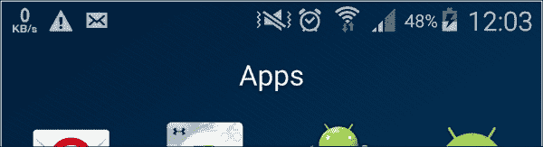

通知所需的最少信息包括一个图标、一个标题和详细文本。随着材料设计的到来，我们可以以不同方式自定义通知；例如，我们可以为它们添加不同的操作：

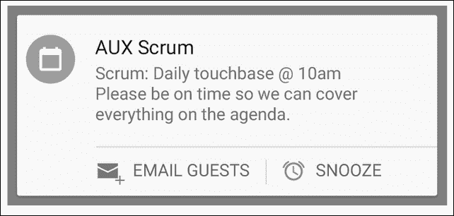

如果我们从屏幕顶部向下滚动，将会显示通知抽屉，我们可以在其中看到所有通知显示的信息：

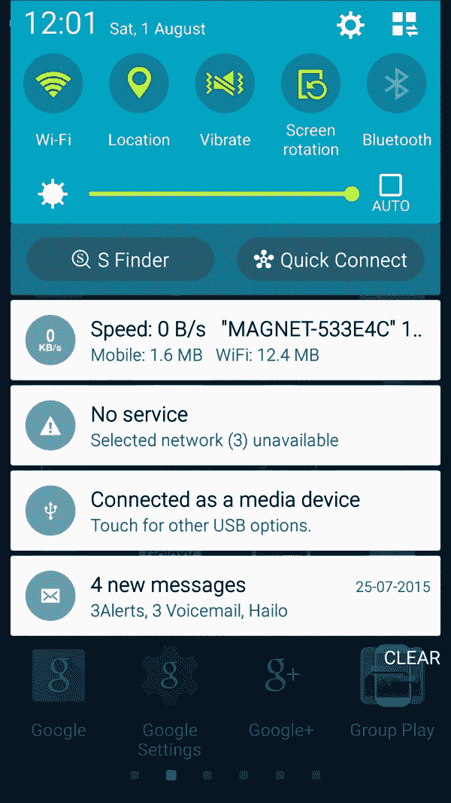

通知不应作为双向通道通信的一部分。如果我们的应用需要与服务器持续通信，如即时通讯应用的情况，我们应该考虑使用套接字、XMPP 或任何其他消息传递协议。理论上，通知是不可靠的，我们无法控制它们何时会被确切接收。

然而，不要滥用通知；这是用户卸载你应用的一个很好的理由。尽量将通知数量降到最低，只在必要时使用。

你可以为通知分配一个优先级，从 Android Lollipop 开始，你可以根据这个优先级过滤你想接收的通知。

这些是处理通知时你应该记住的关键点和概念。在深入了解更多理论知识之前，我们将练习向我们的应用发送通知。

## 使用 GCM 发送和接收通知

市场上有很多不同的解决方案用于发送推送通知；其中一个是 Parse，它有一个友好的控制面板，任何人都可以轻松地发送推送通知。我们将以 Parse 为例，但首先，了解其内部工作原理以及如何构建我们自己的通知发送系统是有好处的。

**GCM**（**Google Cloud Messaging**）使用推送通知，我们将这些通知发送到我们的手机。谷歌有一些称为 GCM 连接服务器的服务器来处理这个过程。如果我们想发送推送通知，首先需要告诉这些服务器，然后它们会在稍后发送到我们的设备。我们需要创建一个服务器或使用第三方服务器，通过 HTTP 或 XMPP 与 GCM 服务器通信，因为可以使用这两种协议进行通信。

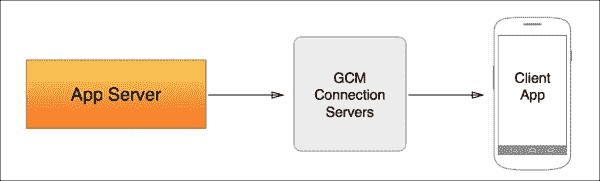

如我们之前所述，由于我们无法控制 GCM 服务器，因此不能精确控制消息的接收时间。GCM 服务器会将消息排队并在设备在线时发送。

要创建我们自己的解决方案，首先需要在 Google 开发者网站上的我们的应用中启用消息传递服务：[`developers.google.com/mobile/add?platform=android`](https://developers.google.com/mobile/add?platform=android)。

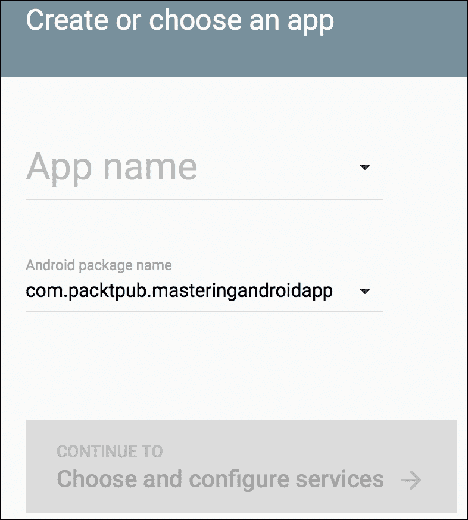

创建应用后，启用 GCM 消息传递，系统会提供发送者 ID 和服务器 API 密钥。发送者 ID 之前被称为项目编号。

如果我们想接收 GCM 消息，我们需要将我们的客户端（即我们的移动应用）注册到这个项目。为此，我们的应用将使用 GCM API 进行注册并获得一个令牌作为确认。完成此操作后，GCM 服务器将知道你的设备已准备好接收来自这个特定项目/发送者的推送通知。

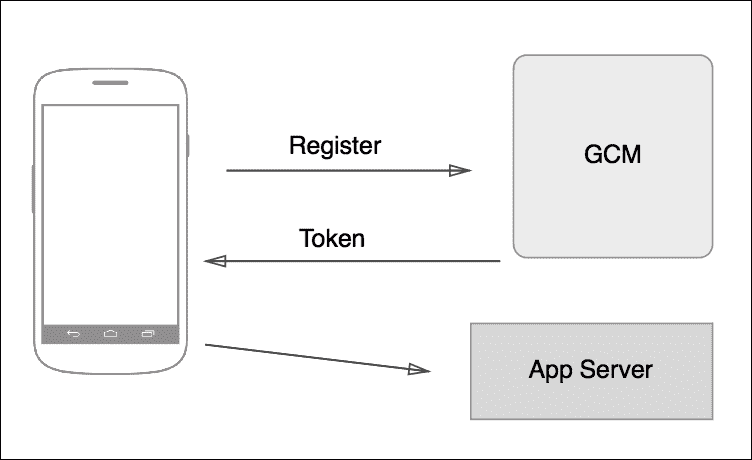

我们需要添加游戏服务以使用此 API：

```kt
 compile "com.google.android.gms:play-services:7.5.+"
```

通过**实例 ID** API 进行注册，调用`instanceID.getToken`方法，并将`SenderID`作为参数：

```kt
InstanceID instanceID = InstanceID.getInstance(this);
String token = instanceID.getToken(getString(R.string.gcm_defaultSenderId),
GoogleCloudMessaging.INSTANCE_ID_SCOPE, null);
```

我们需要异步调用此方法，并在我们的应用中保持一个布尔变量，以记住我们是否已成功注册。我们的令牌可能会随时间变化，当变化发生时，我们会通过`onRefreshToken()`回调得知。令牌需要发送到我们的服务器：

```kt
@Override
public void onTokenRefresh() {
  //Get new token from Instance ID with the code above
  //Send new token to our Server
}
```

完成这些后，我们需要创建一个`GCMListener`并在 Android 清单中添加一些权限：

```kt
<uses-permission android:name="android.permission.GET_ACCOUNTS" />
<uses-permission android:name="android.permission.WAKE_LOCK" />
<uses-permission android:name="com.google.android.c2dm.permission.RECEIVE" />

<permission android:name="com.example.gcm.permission.C2D_MESSAGE"
  android:protectionLevel="signature" />
<uses-permission android:name="com.example.gcm.permission.C2D_MESSAGE" />

<application ...>
  <receiver
    android:name="com.google.android.gms.gcm.GcmReceiver"
    android:exported="true"
    android:permission="com.google.android.c2dm.permission.SEND" >
    <intent-filter>
      <action android:name="com.google.android.c2dm.intent.RECEIVE" />
      <category android:name="com.example.gcm" />
    </intent-filter>
  </receiver>
  <service
    android:name="com.example.MyGcmListenerService"
    android:exported="false" >
    <intent-filter>
      <action android:name="com.google.android.c2dm.intent.RECEIVE" />
    </intent-filter>
  </service>
  <service
    android:name="com.example.MyInstanceIDListenerService"
    android:exported="false">
    <intent-filter>
      <action android:name="com.google.android.gms.iid.InstanceID"/>
    </intent-filter>
  </service>
</application>

</manifest>
```

`GCMListener`将包含`onMessageReceived`方法，当我们接收到任何消息时会被调用。

这就是我们需要的客户端方面的全部内容；至于服务器端，由于它完全取决于选择的技术和语言，本书将不详细介绍。在网络上可以轻松找到用于发送通知的 Python、Grails、Java 等不同的代码片段和脚本。

实际上，我们并不需要一个服务器来发送通知，因为我们可以直接与 GCM 进行通信。我们需要做的就是向 [`gcm-http.googleapis.com/gcm/send`](https://gcm-http.googleapis.com/gcm/send) 发送一个 `POST` 请求。这可以通过任何在线 `POST` 发送服务轻松完成，例如 [`hurl.it`](http://hurl.it) 或 Postman（一个用于发送网络请求的 Google Chrome 扩展程序）。我们的请求需要如下所示：

```kt
Content-Type:application/json
Authorization:key="SERVER_API_LEY"
{
  "to" : "RECEIVER_TOKEN"
  "data" : {
    "text":"Testing GCM"
  },
}
```

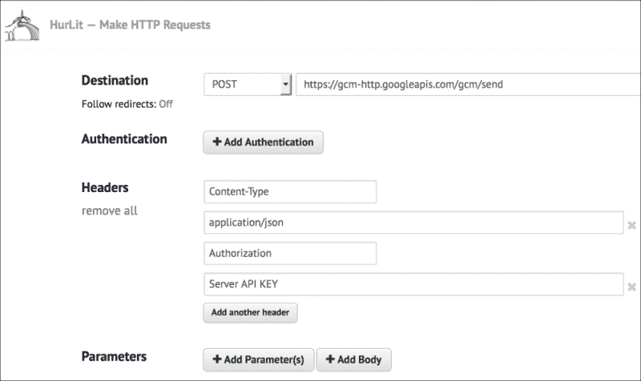

继续使用 `MasteringAndroidApp`，我们将实现 Parse 的推送通知功能。

## 使用 Parse 的推送通知

对于我们的示例，我们将坚持使用 Parse。主要原因是，我们不需要担心服务器端，而且使用这个解决方案不需要在 Google 开发者控制台创建应用程序。另一个原因是它有一个很好的内置控制面板来发送通知，如果我们提前跟踪了具有不同参数的不同用户，我们还可以针对这些用户。

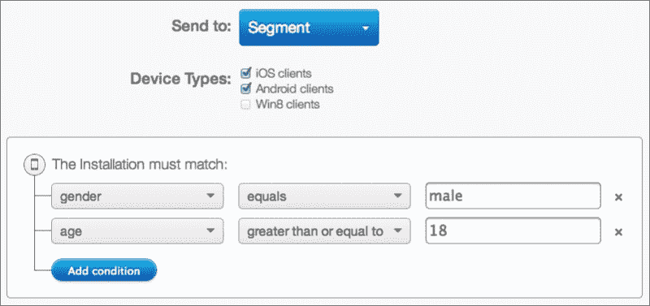

使用 Parse，我们不需要创建一个 GCM 监听器。相反，它使用 Parse 库中已经包含的服务，我们只需为此服务注册一个订阅者。我们需要做的就是向我们的应用程序添加权限和接收器，然后就可以开始了：

```kt
<uses-permission android:name="android.permission.INTERNET" />
<uses-permission android:name="android.permission.ACCESS_NETWORK_STATE" />
<uses-permission android:name="android.permission.WAKE_LOCK" />
<uses-permission android:name="android.permission.VIBRATE" />
<uses-permission android:name="android.permission.RECEIVE_BOOT_COMPLETED" />
<uses-permission android:name="android.permission.GET_ACCOUNTS" />
<uses-permission android:name="com.google.android.c2dm.permission.RECEIVE" />
<permission android:protectionLevel="signature" android:name="com.packtub.masteringandroidapp.permission.C2D_MESSAGE" />
<uses-permission android:name="com.packtpub.masteringandroidapp.permission.C2D_MESSAGE" />
```

确保最后两个权限与您的包名相匹配。接收器需要放在 `application` 标签内：

```kt
<service android:name="com.parse.PushService" />
<receiver android:name="com.parse.ParseBroadcastReceiver">
  <intent-filter>
    <action android:name="android.intent.action.BOOT_COMPLETED" />
    <action android:name="android.intent.action.USER_PRESENT" />
  </intent-filter>
</receiver>

<receiver android:name="com.parse.ParsePushBroadcastReceiver"
  android:exported="false">
  <intent-filter>
    <action android:name="com.parse.push.intent.RECEIVE" />
    <action android:name="com.parse.push.intent.DELETE" />
    <action android:name="com.parse.push.intent.OPEN" />
  </intent-filter>
</receiver>

<receiver android:name="com.parse.GcmBroadcastReceiver"
  android:permission="com.google.android.c2dm.permission.SEND">
  <intent-filter>
    <action android:name="com.google.android.c2dm.intent.RECEIVE" />
    <action android:name="com.google.android.c2dm.intent.REGISTRATION" />
    <category android:name="com.packtpub.masteringandroidapp" />
  </intent-filter>
</receiver>

</application>
```

为了监听通知，我们可以在 `Application` 类的 `OnCreate` 方法中注册一个订阅者：

```kt
ParsePush.subscribeInBackground("", new SaveCallback() {
  @Override
  public void done(com.parse.ParseException e) {
    if (e == null) {
      Log.d("com.parse.push", "successfully subscribed to the broadcast channel.");
    } else {
      Log.e("com.parse.push", "failed to subscribe for push", e);
      }
  }
});
```

现在，一切就绪。只需进入 Parse 网站，选择 **推送** 选项卡，然后点击 **+ 发送推送**。您可以指定受众，选择立即发送还是延迟发送以及其他参数。它会跟踪已发送的推送，并指出发送给了哪些人。

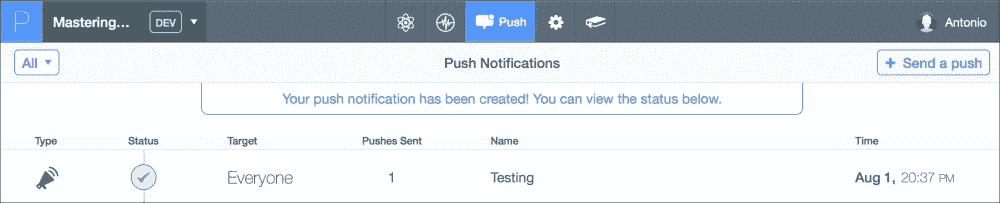

如果您在 **已发送推送** 列中看到 **1**，然后查看设备中的通知，那么一切正常。您设备中的通知应如下所示：


## 使用 NotificationCompat

目前，我们可以看到由 Parse 接收器创建的默认通知。但是，我们可以设置自己的接收器，并使用 `NotificationCompat` 创建更美观的通知。这个组件在支持库 v4 中引入，可以显示 Android L 和 M 以及之前版本直到 API 4 的最新功能的通知。

简而言之，我们需要做的是利用`NotificationCompat.Builder`创建一个通知，并通过`NotificationManager.notify()`将这个通知传递给系统：

```kt
public class MyNotificationReceiver  extends BroadcastReceiver {

  @Override
  public void onReceive(Context context, Intent intent) {
    Notification notification = new NotificationCompat.Builder(context)
    .setContentTitle("Title")
    .setContentText("Text")
    .setSmallIcon(R.drawable.ic_launcher)
    .build();
    NotificationManagerCompat.from(context).notify(1231,notification);
  }

}
```

这将显示我们的通知。标题、文本和图标是必须的；如果我们不添加这三个属性，通知就不会显示。要开始使用我们的自定义接收器，需要在清单文件中指定我们想要使用的注册，而不是 Parse 推送接收器：

```kt
receiver android:name="com.packtpub.masteringandroidapp.MyNotificationReceiver" android:exported="false">
  <intent-filter>
    <action android:name="com.parse.push.intent.RECEIVE" />
    <action android:name="com.parse.push.intent.DELETE" />
    <action android:name="com.parse.push.intent.OPEN" />
  </intent-filter>
</receiver>
```

我们讨论了如何使用`NotificationCompat`显示自定义通知。通知有自己的设计指南，它们是材料设计的重要组成部分。建议查看这些指南，并在在应用中使用此组件时牢记它们。

### 注意

你可以在以下链接找到指导方针：[`developer.android.com/design/patterns/notifications.html`](http://developer.android.com/design/patterns/notifications.html)。

# 数据分析的重要性

了解用户如何使用你的应用非常重要。分析帮助我们理解哪些屏幕访问最多，用户在我们的应用中购买哪些产品，以及为什么某些用户在注册过程中退出，同时获取有关性别、位置、年龄等信息。

我们甚至可以追踪应用中用户遇到的崩溃问题，以及设备型号、Android 版本、崩溃日志等信息。

这些数据帮助我们改善用户体验，例如，如果我们发现用户的行为并不像我们预期的那样。它有助于定义我们的产品；如果我们的应用中有不同的功能，我们可以确定哪个功能使用最多。它帮助我们了解受众，这对市场营销是有益的。通过崩溃报告，更容易保持应用无错误和崩溃。

我们将以 Parse 为例，开始追踪一些事件。

## 使用 Parse 进行数据分析

在不添加任何额外代码的情况下，仅通过我们已经在使用的`Parse.init()`方法，在 Parse 控制台的**分析**标签下就能看到一些统计数据。

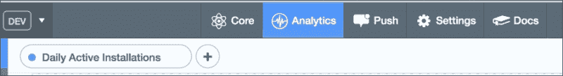

在**受众**部分，我们可以看到每日、每周和每月的活跃安装量和活跃用户数。这有助于我们了解有多少用户以及他们中有多少是活跃的。如果我们想知道有多少用户卸载了应用，可以查看**留存**部分。

我们将追踪一些事件和崩溃，以在这两个部分显示信息，但首先，我们将看看**资源管理器**。如果你点击左侧的**资源管理器**按钮，你应该看到以下选项：

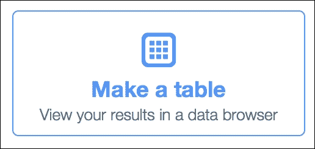

这将显示一个表格，我们可以从中看到过滤我们应用数据的各种选项。一旦开始追踪事件和动作，这里将会有更多的列，我们将能够创建复杂的查询。

默认情况下，如果我们点击运行查询，我们会看到以下表格图像：

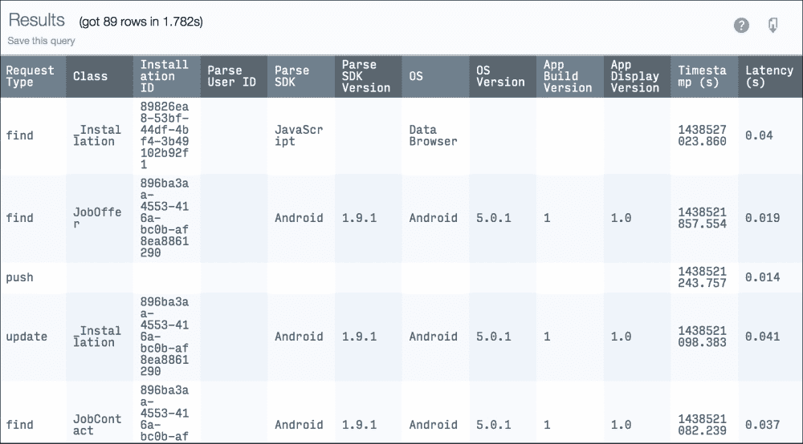

它显示了在默认列下可用的所有信息；目前不需要额外的列。我们可以看到所有不同的请求类型以及操作系统、操作系统版本和我们应用程序的版本。

我们可以使用过滤器来生成不同的输出。一些有趣的输出可能是，例如，按应用程序版本排序和分组，以便了解有多少人在使用每个版本。

如果我们使用相同的 Parse 数据库用于不同的平台，比如安卓和 iOS，我们可以按平台进行过滤。

这是一个按操作系统版本过滤的示例，我们可以看到我们的用户当前正在使用的所有安卓版本：

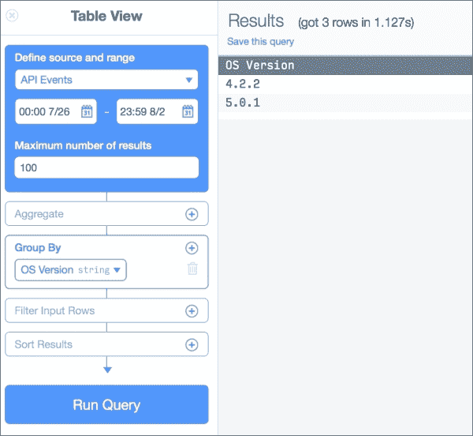

为了收集更多关于应用程序何时以及被打开频率的数据，我们可以在欢迎屏幕或第一个活动的`onCreate`方法中添加以下行。

```kt
ParseAnalytics.trackAppOpenedInBackground(getIntent());
```

这是一个我们可以跟踪的事件示例，但通常说到事件跟踪，我们指的是自定义事件。例如，如果我们想跟踪哪个职位报价访问量最大，我们将在`JobOfferDetailActivity`中跟踪带有访问文章标题的事件。我们还可以在点击行打开报价的`onlick`监听器中跟踪此事件。这方面没有固定的规则；实现可能有所不同。但是，我们需要知道目标是当报价被查看时跟踪事件。

在`OfferDetailActivity`的`OnCreate`方法中选择跟踪事件的选项的代码将与以下代码类似：

```kt
public class OfferDetailActivity extends AppCompatActivity {

  @Override
  protected void onCreate(Bundle savedInstanceState) {
    super.onCreate(savedInstanceState);
    setContentView(R.layout.activity_offer_detail);

    String job_title = getIntent().getStringExtra("job_title");

    Map<String, String> eventParams = new HashMap<>();
    eventParams.put("job_title", job_title);
    ParseAnalytics.trackEventInBackground("job_visited", eventParams);
```

`trackEventInBackground`方法启动一个后台线程来为我们创建网络上传请求。参数作为具有最多八个的`Map`字符串发送。

如果我们在不同时间访问不同的报价，并进入分析浏览器部分，我们可以轻松创建一个查询来查看每个职位报价被打开的次数。

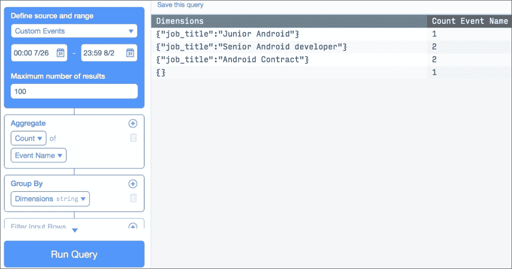

通过按维度分组数据，这些维度包括我们随事件跟踪发送的不同参数，并使用计数的聚合，我们可以得到每个职位报价被访问的次数。

接下来，我们将看看如何利用这种事件跟踪的优势，将 Parse 作为错误报告工具。

## 错误报告

当我们的应用程序分发时报告崩溃对于维护一个无错误和崩溃的应用程序至关重要。市场上有成百上千种安卓设备，即使在发布应用程序时最好的质量保证人员或测试员也可能在不同情况下犯错，最终导致应用程序崩溃。

我们需要假设我们的应用程序将会崩溃。我们必须尽可能编写最好的代码，但如果发生崩溃，我们需要有工具来报告并修复它。

Parse 允许我们使用以下代码跟踪错误：

```kt
Map<String, String> dimensions = new HashMap<String, String>(); dimensions.put('code', Integer.toString(error.getCode())); ParseAnalytics.trackEvent('error', dimensions);
```

然而，这种解决方案仅能让我们追踪到受控代码块的错误。例如，假设我们有一个网络请求，它返回了一个错误。这种情形可以轻松处理；我们只需追踪来自服务器的错误响应事件。

当我们的应用程序中出现`NullPointerException`时，就会出现问题，这是因为我们遇到了一个由于无法在代码中检测到的意外情况而导致的崩溃。例如，如果一个职位的图片链接为 null，而我尝试读取链接而不检查属性是否为 null，我将得到`NullPointerException`，应用程序将崩溃。

如果我们不能控制发生错误的代码部分，我们该如何追踪呢？幸运的是，市场上我们有工具可以帮我们做到这一点。HockeyApp 是一个帮助分发测试版本并收集实时崩溃报告的工具。这是一个在网页面板上显示我们应用程序错误报告的工具。它真的很容易集成；我们只需要在库中添加以下内容：

```kt
compile 'net.hockeyapp.android:HockeySDK:3.5.0-b.4'
```

然后，我们需要调用以下方法来报告错误：

```kt
CrashManager.register(this, APP_ID);
```

`APP_ID`将在你将 APK 上传到 Hockey 或在你手动在 Hockey 网站上创建新应用程序时找到。

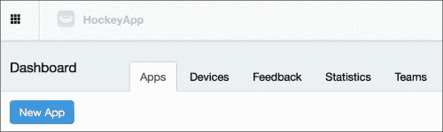

一旦我们知道`App_ID`并注册了崩溃报告，如果我们遇到崩溃，我们将看到一个带有发生次数列表的界面，如下面的截图所示：

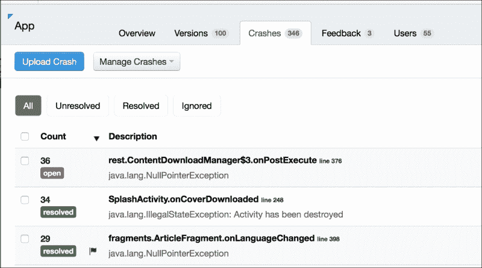

我们将以分析的话题结束，Parse 只是众多选择之一；同样常见的还有使用 Google Analytics，它包含在 Google Play 服务库中。Google Analytics 允许我们创建更复杂的报告，例如漏斗追踪，以查看在漫长的注册过程中我们失去了多少用户，我们还可以在不同的图表和直方图中查看数据。

如果你属于一个大机构，可以看看 Adobe Omniture。它是一个企业工具，能帮助你将不同的事件作为变量进行追踪，并创建公式来展示这些变量。它还允许你将移动分析数据与其他部门（如销售、市场营销和客户服务）的数据结合起来。根据我的个人经验，我见过的使用 Omniture 的公司通常会有专人全职负责分析研究。在这种情况下，开发者需要知道的只是如何实现 SDK 和追踪事件；创建复杂报告不是开发者的任务。

# 总结

在本章中，你学习了如何为我们的应用程序添加通知。我们使用 Parse 实现了推送通知，并讨论了如何使用 Google Cloud Messaging 创建我们自己的自定义通知服务，包括客户端所需的所有代码和测试服务器端的工具。在章节的后半部分，我们介绍了分析，解释了它们的重要性，并用 Parse 跟踪事件。在分析领域，一个重要的方面是错误报告。我们还使用 Parse 和 HockeyApp 跟踪了应用程序中的错误。最后，我们概览了其他分析解决方案，例如 Google Analytics 和 Adobe Omniture。

在下一章中，我们将使用位置服务，并学习如何将`MapView`添加到我们的示例中，显示带有位置标记的谷歌地图。
