# 第十一章：安卓上的调试与测试

在本章中，你将学习如何在 Android 中进行调试，这是一个在开发应用程序时查找和解决问题的基本实践，可以节省时间。

我们将学习如何创建自动化测试，可以测试按钮的点击或单个方法的结果。这是一组你可以在 Android Studio 中运行的测试，以确保每次开发新功能时，不会破坏现有的功能。

你还将学习如何使用**Robolectric**进行单元测试和 Espresso 进行集成测试。

在本章的最后，我们将讨论如何使用 Monkey 进行数百万次随机点击测试 UI，如何通过应用录制点击序列，以及如何使用 MonkeyTalk 配置基于这些记录的测试。

+   日志和调试模式

+   测试

    +   使用 Robolectric 进行单元测试

    +   使用 Espresso 进行集成测试

+   UI 测试

    +   使用 MonkeyRunner 进行随机点击

    +   使用 MonkeyTalk 记录点击

+   持续集成

# 日志和调试模式

如果不提及日志以及如何通过调试解决问题，我们无法完成这本书。如果你知道如何解决自己的问题，那么在 Android 上开发不仅仅是复制粘贴 Stack Overflow 的内容。

调试模式和日志是帮助开发者定位问题的机制。随着时间的推移，每个开发者都会进步并减少使用这些技术的频率，但一开始，应用中充满了日志是很常见的。我们不希望用户在应用发布后能够看到日志，也不希望手动移除日志并在发布新版本时再次添加。我们将看看如何避免这种情况。

## 处理日志

Log 类用于打印实时可在`LogCat`中读取的消息和错误。以下是记录消息的示例：

```kt
Log.i("MyActivity", "Example of an info log");
```

`Log`类有五种方法，它们用于在日志上设置不同的优先级。这允许我们在`LogCat`中按优先级进行过滤。在某些情况下，我们会显示不同的日志，例如，查看每次请求下载的工作机会数量。如果我们的应用崩溃了，此时错误类型的日志是我们的优先事项，我们希望隐藏其他优先级较低的日志，以便尽快找到错误。

五个优先级分别是（从低到高）：详细、调试、信息、警告和错误。(`Log.v` , `Log.d`, `Log.i`, `Log.w`, 和 `Log.e`)

我们可以通过日志窗口顶部的栏按进程进行过滤。我们可以按优先级和关键词进行过滤，并且可以创建自定义过滤器，按标签、进程 ID 等进行过滤。

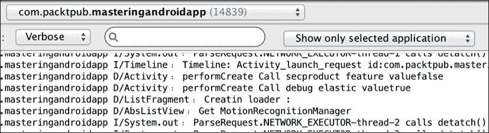

如果日志不显示或者它们是旧的且不刷新，尝试打开右边的下拉菜单，选择**无** **过滤**，然后再次选择**仅显示选定应用程序**。这会强制控制台刷新。

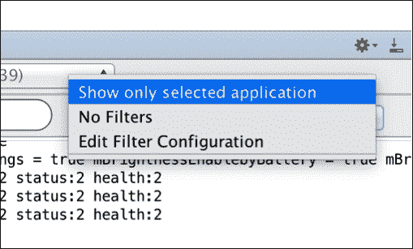

为了完成日志，我们将创建一个包装器，并使用第三方库，以便只需更改布尔值就能在项目中禁用所有日志。为此，我们只需创建一个具有与`Log`类相同方法的类，这些方法依赖于这个布尔值：

```kt
public class MyLogger {

  static final boolean LOG = false;

  public static void i(String tag, String string) {
    if (LOG) android.util.Log.i(tag, string);
  }

  public static void e(String tag, String string) {
    if (LOG) android.util.Log.e(tag, string);
  }
  …
```

我们每次想要编写日志时都需要使用这个包装器——使用`MyLogger.d()`而不是`Log.d()`。这样，如果我们更改`MyLogger`类中的布尔值`LOG`，它将同时停止我们项目中的所有日志。

建议使用`BuildConfing.DEBUG`变量的值：

```kt
static final boolean LOG = BuildConfing.DEBUG; 
```

如果我们的应用处于调试模式，这将成立，发布应用时将变为假。因此，我们不需要记住在发布模式下关闭日志，也没有日志对最终用户显示的风险。

### 使用 Timber，日志包装器

Timber 是由 Jake Wharton 创建的日志包装器，它将日志提升到了一个高级水平，允许我们使用日志树概念来拥有不同的日志行为。看看以下代码：

```kt
compile 'com.jakewharton.timber:timber:3.1.0'
```

使用 Timber 的优点之一是，我们不需要在同一个活动中多次编写日志标签：

```kt
Timber.tag("LifeCycles");
Timber.d("Activity Created");
```

我们的树可以有不同的行为；例如，我可能想在发布模式下禁用日志，但我仍然想处理错误；所以，我会种植一个错误树，将错误报告给 Parse：

```kt
if (BuildConfig.DEBUG) {
  Timber.plant(new Timber.DebugTree());
} else {
  Timber.plant(new CrashReportingTree());
}

/** A tree which logs important information for crash reporting. */
private static class CrashReportingTree extends Timber.Tree {
  @Override protected void log(int priority, String tag, String message, Throwable t) {
    if (priority == Log.VERBOSE || priority == Log.DEBUG) {
      return;
    }
    //Track error to parse.com
  }
}
```

## 调试我们的应用

日志可用于开发过程中查找问题，但如果我们掌握了调试模式，会发现这个做法要快得多。

当我们处于调试模式时，可以在代码中设置断点。通过这些断点，我们指定一个代码行，我们希望执行在此处停止，以显示那一刻的变量值。要设置断点，只需在左侧边栏上双击：

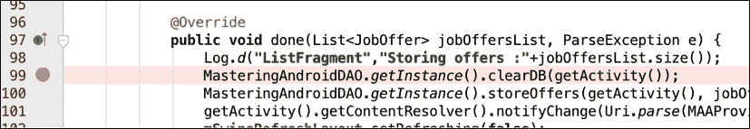

我们在获取工作机会的方法的响应中设置了一个调试点。我们可以从顶部栏启动调试模式：

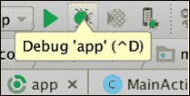

如果我们在**调试**模式下运行应用，当达到这一点时，Android Studio 将暂停执行：

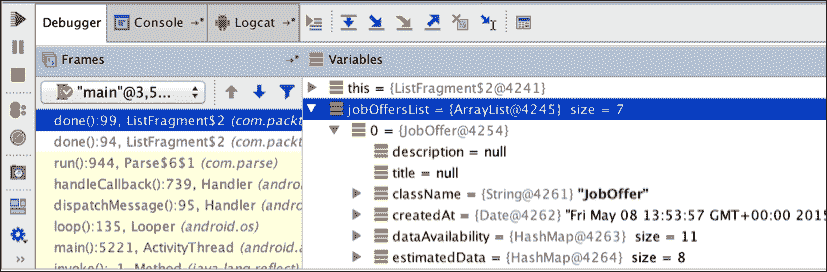

Android Studio 会自动提示**调试器**窗口，我们可以在执行点查看变量。从前面的截图中，我们可以看到工作机会列表，并导航查看每个机会内部的内容。

这里的重要特性是左侧的绿色**播放**按钮，它将继续执行我们的应用到下一个断点，以及红色方块，它退出调试模式并继续执行应用。

我们还有不同的控件可用于转到下一行，进入一个方法，或离开方法。例如，假设我们在以下命令的第一行有一个断点：

```kt
MasteringAndroidDAO.getInstance().clearDB(getActivity());
MasteringAndroidDAO.getInstance().storeOffers(getActivity(), jobOffersList);
```

在这种情况下，**单步跳过**（指向下方的蓝色箭头）将把我们的执行移到下一行。如果我们点击**单步进入**（指向右下角的蓝色箭头），我们将进入`getInstace()`方法。结合这些控件，我们可以实时控制流程。

解释了调试模式之后，我们现在可以继续讨论自动化测试。

# 在 Android 上测试

任何新功能在完成之前都需要先进行测试。我们作为开发者，曾多次掉入在未先编写通过测试的情况下提交代码更改的陷阱，结果发现在未来的迭代中预期行为被破坏了。

我们通过艰难的方式了解到，编写测试可以提高我们的生产力，提高代码质量，并帮助我们更频繁地发布。因此，Android 提供了几种工具，以帮助我们从早期阶段开始测试应用程序。

在接下来的两节中，我们将讨论我最喜欢的设置：用 Robolectric 进行单元测试，用 Espresso 进行集成测试。

## 使用 Robolectric 的单元测试

直到 Robolectric 出现，编写单元测试意味着我们必须在真实设备或模拟器上运行它们。这个过程可能需要几分钟，因为 Android 构建工具必须打包测试代码，将其推送到连接的设备，然后运行它。

Robolectric 通过使我们能够在工作站的 JVM 中运行单元测试，而无需 Android 设备或模拟器，从而缓解了这个问题。

要使用 Gradle 包含 Robolectric，我们可以在`build.gradle`文件中添加以下依赖： 

```kt
testCompile "org.robolectric:robolectric:3.0"
```

我们使用`testCompile`来指定我们希望此依赖包含在测试项目中。对于测试项目，默认源目录是`src/test`。

### Robolectric 配置

在撰写本文时，Robolectric 3.0 版本支持以下 Android SDK：

+   Jelly Bean，SDK 版本 16

+   Jelly Bean MR1，SDK 版本 17

+   Jelly Bean MR2，SDK 版本 18

+   KitKat，SDK 版本 19

+   Lollipop，SDK 版本 21

默认情况下，测试将针对`AndroidManifest`文件中定义的`targetSdkVersion`运行。如果你想针对不同的 SDK 版本运行测试，或者你当前的`targetSdkVersion`不被 Robolectric 支持，你可以手动覆盖它，通过位于`src/test/resources/robolectric.properties`的属性文件，内容如下：

```kt
robolectric.properties
sdk=<SDK_VERSION>
```

### 我们的第一单元测试

我们将从设置一个非常简单且常见的场景开始：一个带有**登录**按钮的欢迎活动，该按钮使用户导航到登录活动。欢迎活动的布局如下：

```kt
<?xml version="1.0" encoding="UTF-8"?>
<LinearLayout  android:layout_width="match_parent" android:layout_height="match_parent">
  <Button android:id="@+id/login" android:text="Login" android:layout_width="wrap_content" android:layout_height="wrap_content" />
</LinearLayout>
```

在`WelcomeActivity`类中，我们只需将登录按钮设置为启动登录活动：

```kt
public class WelcomeActivity extends Activity {

  @Override
  protected void onCreate(Bundle savedInstanceState) {
    super.onCreate(savedInstanceState);
    setContentView(R.layout.welcome_activity);

    View button = findViewById(R.id.login);
    button.setOnClickListener(new View.OnClickListener() {
      @Override
      public void onClick(View view) {
        startActivity(new Intent(WelcomeActivity.this, LoginActivity.class));
      }
    });
  }
}
```

为了测试这一点，我们可以确保通过发送正确的`Intent`来启动`LoginActivity`。因为 Robolectric 是一个单元测试框架，`LoginActivity`实际上不会启动，但我们能够检查框架是否捕获了正确的意图。

首先，我们将在`src/test/java/`路径中正确的包内创建测试文件`WelcomeActivityTest.java`。Robolectric 依赖于 JUnit 4，因此我们将从指定 Robolectric 的 Gradle 测试运行器和一些额外的配置开始，框架将使用这些配置来查找`AndroidManifest`资源和资产。运行以下命令：

```kt
@RunWith(RobolectricGradleTestRunner.class)
@Config(constants = BuildConfig.class)
```

现在，我们可以编写我们的第一个测试。我们将从创建并使欢迎活动进入前台开始：

```kt
WelcomeActivity activity = Robolectric.setupActivity(WelcomeActivity.class);
```

既然我们已经有了`WelcomeActivity`的实例，点击登录按钮就变得简单了：

```kt
activity.findViewById(R.id.login).performClick();
```

最后，我们必须验证框架捕获了将启动`LoginActivity`的意图：

```kt
Intent expectedIntent = new Intent(activity, LoginActivity.class);
assertThat(shadowOf(activity).getNextStartedActivity(), is(equalTo(expectedIntent)));
```

`shadowOf`静态方法返回一个`ShadowActivity`对象，该对象存储了与当前测试活动的大部分交互。我们需要使用`@Test`注解，这告诉 JUnit 该方法可以作为测试用例运行。将所有内容放在一起，我们得到以下测试类（`WelcomeActivityTest.java`）：

```kt
@RunWith(RobolectricGradleTestRunner.class)
@Config(constants = BuildConfig.class)
public class WelcomeActivityTest {

  @Test
  public void loginPress_startsLoginActivity() {
    WelcomeActivity activity = Robolectric.setupActivity(WelcomeActivity.class);

    activity.findViewById(R.id.login).performClick();

    Intent expectedIntent = new Intent(activity, LoginActivity.class);
    assertThat(shadowOf(activity).getNextStartedActivity(), is(equalTo(expectedIntent)));
  }
}
```

### 运行单元测试

在能够运行单元测试之前，我们需要在 Android Studio 中选择正确的**测试工件**。为此，我们将打开**构建变体**工具栏，并选择**单元测试**工件，如下面的截图所示：

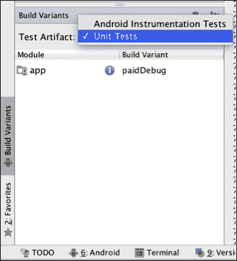

现在，从**项目**窗口中，我们可以通过右键点击测试类并选择**运行**选项来运行测试。确保项目路径中没有空格；否则，Robolectric 在执行单元测试之前会抛出异常。

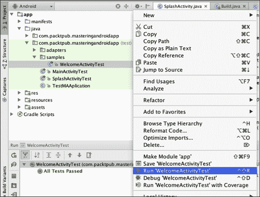

我们还可以从命令行运行单元测试。为此，使用带有`--continue`选项的`test`任务命令调用：

```kt
./gradlew test --continue
```

如果我们已经配置了持续集成系统，例如 Jenkins、Travis 或 wercker，这个选项是理想的。

这就是 Robolectric 部分的结尾。接下来，我们将讨论使用**Espresso**进行集成测试。

## 使用 Espresso 进行集成测试

由于 Android 本身的特点以及市场上的大量设备，我们无法确定发布应用时它可能会如何表现。

我们自然会尽可能在许多不同的设备上手动测试我们的应用，这是一个繁琐的过程，每次发布时都必须重复。在本节中，我们将简要讨论 Espresso 以及如何编写将在真实设备上运行的测试。

### Espresso 配置

在编写我们的第一个集成测试之前，我们需要安装并配置测试环境。执行以下步骤：

1.  从 Android SDK 管理器中，我们需要在**Extras**文件夹中选择并安装**Android 支持仓库**，如下面的截图所示：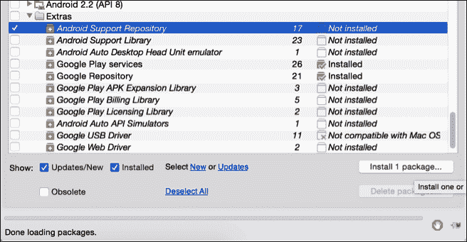

1.  创建用于集成测试代码的文件夹；这应该位于`app/src/androidTest`。

1.  我们还需要在项目的`build.gradle`中指定一些依赖项。使用以下代码：

    ```kt
    dependencies {
      androidTestCompile 'com.android.support.test:runner:0.3'
      androidTestCompile 'com.android.support.test:rules:0.3'
      androidTestCompile 'com.android.support.test.espresso:espresso-core:2.2'
      androidTestCompile 'com.android.support.test.espresso:espresso-intents:2.2'
    }
    ```

最近，Android 添加了对 JUnit 4 风格测试案例的支持。要使用它，我们将在`build.gradle`文件中将`AndroidJUnitRunner`添加为默认的测试仪器运行器：

```kt
android {
  defaultConfig {
    testInstrumentationRunner "android.support.test.runner.AndroidJUnitRunner"
  }
}
```

### 编写集成测试

对于这个例子，我们将从 Robolectric 停下的地方继续；我们将为`LoginActivity`编写一个测试。对于这个活动，我们将设置一个简单的布局，包含两个`EditTexts`和一个登录按钮。运行以下代码（`activity_login.xml`）：

```kt
<?xml version="1.0" encoding="utf-8"?>
<LinearLayout 
  android:orientation="vertical"
  android:layout_width="match_parent"
  android:layout_height="match_parent">

  <EditText
    android:id="@+id/input_username"
    android:layout_width="match_parent"
    android:layout_height="wrap_content"
    android:inputType="textEmailAddress" />

  <EditText
    android:id="@+id/input_password"
    android:layout_width="match_parent"
    android:layout_height="wrap_content"
    android:inputType="textPassword" />

  <Button
    android:id="@+id/button_signin"
    android:layout_width="wrap_content"
    android:layout_height="wrap_content"
    android:text="@string/signin"/>
</LinearLayout>
```

在`LoginActivity`中，当用户点击登录按钮时，我们将使用以下代码（`LoginActivity.java`）将凭据发送到闪屏活动：

```kt
public class LoginActivity extends Activity {

  @Override
  protected void onCreate(Bundle savedInstanceState) {
    super.onCreate(savedInstanceState);

    setContentView(R.layout.activity_login);

    final EditText inputUsername = (EditText) findViewById(R.id.input_username);
    final EditText inputPassword = (EditText) findViewById(R.id.input_password);

    Button buttonLogin = (Button) findViewById(R.id.button_signin);

    buttonLogin.setOnClickListener(new View.OnClickListener() {
      @Override
      public void onClick(View v) {
        startActivity(new Intent(getApplicationContext(), SplashActivity.class)
        .putExtra("username", inputUsername.getText().toString())
        .putExtra("password", inputPassword.getText().toString()));
        finish();
      }
    });
  }
}
```

对于这个测试，我们将在两个输入字段中输入用户凭据，并验证我们是否在意图中正确捆绑它们。

首先，我们将在`src/test/androidTest/`路径中正确的包内创建`LoginActivityTest.java`测试文件。我们将使用 JUnit 4，因此首先会指定`AndroidJUnit4`测试运行器。使用以下命令：

```kt
@RunWith(AndroidJUnit4.class)
```

与 Robolectric 的另一区别是，在 Espresso 中，我们需要指定一个规则来准备被测试的活动。为此，使用以下命令：

```kt
@Rule
public IntentsTestRule<LoginActivity> mActivityRule =
  new IntentsTestRule<>(LoginActivity.class);
```

现在，我们可以开始编写测试。首先，我们需要在两个输入字段中输入登录详情：

```kt
String expectedUsername = "mastering@android.com";
String expectedPassword = "electric_sheep";

onView(withId(R.id.input_username)).perform(typeText(expectedUsername));
onView(withId(R.id.input_password)).perform(typeText(expectedPassword));
```

然后，我们将通过点击登录按钮发送意图：

```kt
onView(withId(R.id.button_signin)).perform(click());
```

最后，我们必须验证捕获的意图是否包含登录凭据：

```kt
intended(hasExtras(allOf(
  hasEntry(equalTo("username"), equalTo(expectedUsername)),
  hasEntry(equalTo("password"), equalTo(expectedPassword)))));
```

把所有内容放在一起，我们将拥有以下测试类（`LoginActivityTest.java`）：

```kt
@RunWith(AndroidJUnit4.class)
public class LoginActivityTest {

  @Rule
  public IntentsTestRule<LoginActivity> mActivityRule =
  new IntentsTestRule<>(LoginActivity.class);

  @Test
  public void loginButtonPressed_sendsLoginCredentials() {
    String expectedUsername = "mastering@android.com";
    String expectedPassword = "electric_sheep";

    onView(withId(R.id.input_username)).perform(typeText(expectedUsername));
    onView(withId(R.id.input_password)).perform(typeText(expectedPassword));

    onView(withId(R.id.button_signin)).perform(click());

    intended(hasExtras(allOf(
    hasEntry(equalTo("username"), equalTo(expectedUsername)),
    hasEntry(equalTo("password"), equalTo(expectedPassword)))));
  }
}
```

### 运行集成测试

与我们使用 Robolectric 所做的类似，要运行集成测试，我们需要在 Android Studio 中切换到正确的**测试工件（Test Artifact）**。为此，我们将打开**构建变种（Build Variants）**工具栏并选择**Android Instrumentation Tests**工件：

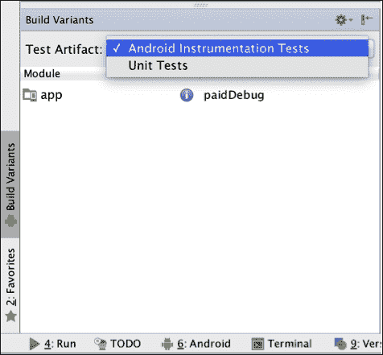

现在，从**项目**窗口中，我们可以通过右键点击测试类并选择**运行**选项来运行测试。

我们还可以从命令行运行集成测试。为此，我们将调用`connectedCheck`（或`cC`）任务：

```kt
./gradlew cC
```

如果我们有连接设备或模拟器的持续集成系统，使用命令行是首选方式。当我们编写足够的集成测试后，可以轻松地在数百台真实设备上部署和运行它们，使用如**Testdroid**之类的服务。

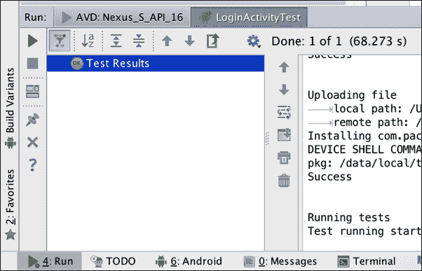

# 从 UI 角度进行测试

我们现在将进行的测试与使用应用程序的人可能会进行的测试类似。实际上，在拥有**质量保证（QA）**的的公司中，人们将这些工具作为手动测试的补充。

UI 测试也可以自动化，但它们与单元测试和集成测试不同；这些是在屏幕上执行的操作，从点击按钮到使用记录的事件完成注册过程。

我们将从使用**The Monkey**进行压力测试开始。

## 启动 The Monkey

The Monkey 是一个可以从命令行通过 ADB 启动的程序。它在我们的设备或模拟器中生成随机事件，并使用一个种子，我们可以重现相同的随机事件。为了说明，让我们考虑一个带数字的例子。假设我执行了 Monkey，它产生了 1 到 10 的随机数字；如果我再次启动它，我会得到不同的数字。当我使用一个种子（这个种子是一个数字）执行 The Monkey 时，我得到了一组不同的 1 到 10 的数字，如果我用相同的种子再次启动它，我会得到相同的数字。这很有用，因为如果我们使用一个种子来生成随机事件并遇到崩溃，我们可以修复这个崩溃，并再次运行相同的种子，以确保我们解决了问题。

这些随机事件可以是从点击和滚动手势到系统级别事件（如音量增大、音量减小、截图等）的变化。我们可以限制事件的数量和类型，以及运行它的程序包。

终端中的基本语法是以下命令：

```kt
$ adb shell monkey [options] <event-count>
```

如果你从未使用过 ADB，你可以在 Android SDK 目录中的`platform-tools`文件夹里找到它，无论它安装在你的系统中的哪个位置：

```kt
../sdk/platform-tools/adb
```

当我们打开终端并导航到这个目录时，我们可以编写以下代码行：

```kt
adb shell monkey -p com.packtpub.masteringandroidapp -v 500
```

当你尝试使用`adb`而输出是`command not found`时，你可以使用`adb kill-server`、`adb start-server`和如果是 Linux 或 Mac 系统，使用`./adb`（点斜杠 adb）来重启`adb`。

我们可以将事件数量增加到`5000`，或者产生无限事件，但通常建议设置一个数字限制；否则，你可能需要重启设备来停止 The Monkey。当你执行命令时，你将能够看到产生的随机事件，并且它会指示所使用的种子，以便如果你想重复相同的事件链，可以知道种子：

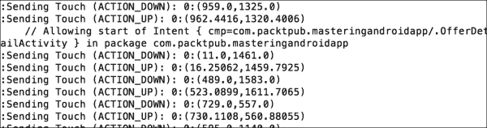

根据应用程序的不同，我们可能需要调整事件之间的时间，使用节流毫秒属性来模拟真实用户。

使用下一个测试工具，我们将进行一种不同类型的 UI 测试，目的是跟随一个流程。例如，如果我们有一个由三个屏幕组成的注册流程，每个屏幕都有不同的表单，我们想要记录一个测试，用户填写表单并通过这三个屏幕逻辑地继续。在这种情况下，The Monkey 实际上并不太有帮助；在大量的事件中，它最终会用随机字符填写所有输入字段，并点击按钮进入下一个屏幕，但这并不是我们真正想要的。

## 使用 MonkeyTalk 记录 UI 测试

记录一系列测试（如注册过程）的目的是为了保存这些测试，以便在我们对代码进行更改时能够再次运行它。我们可能需要修改注册过程的网络请求，而不改变 UI，所以这些测试非常完美。我们可以在完成修改后直接运行它们，而无需手动完成注册或填写表单。这里我们并不是在偷懒；如果我们有数百个测试，这对于一个人来说将是大量的工作。此外，通过自动化测试，我们可以确保事件序列始终如一。

**MonkeyTalk**是一个免费且开源的工具，有两个版本；在我们的示例中，我们将使用社区版。

### 注意

有关社区版和专业版的比较列表，可以在他们的网站[`www.cloudmonkeymobile.com/monkeytalk`](https://www.cloudmonkeymobile.com/monkeytalk)上查看。

MonkeyTalk 可以在真实设备和模拟器上使用。它通过在*录制模式*下记录一系列事件来工作：

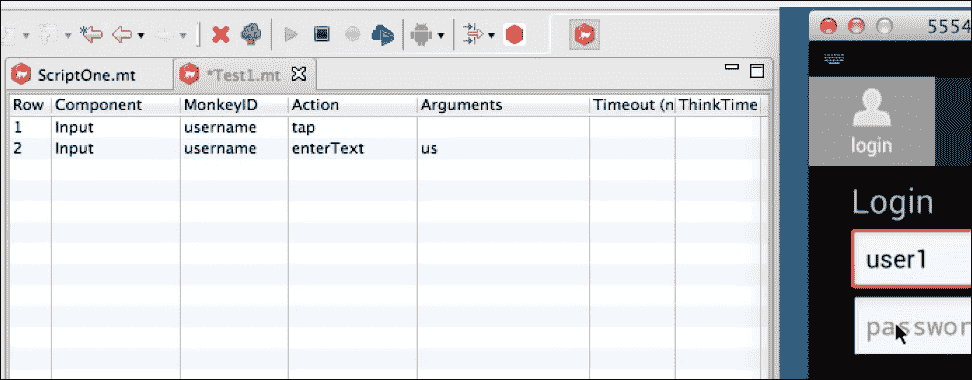

一旦我们通过点击工具中的**录制**进入这个录制模式，所有的事件将以执行的动作用到的参数的顺序被记录下来。在上面的截图中，我们可以看到点击`TextView`并在上面输入一些内容是如何被记录为两个事件的。

我们可以在一个脚本文件中创建这个，MonkeyTalk 将会重现它；因此，我们有了在不录制的情况下创建自己的事件序列的选项。对于前面的事件，我们将编写如下脚本：

```kt
Input username tap
Input username enterText us
```

如果我们点击**立即播放**按钮，我们将在任何设备上看到所有这些步骤的执行。我们可以在 Android 手机上录制脚本，然后在 iOS 设备上播放它们。

除了录制和播放脚本，我们还可以有验证命令。例如，如果我们有一个清除所有输入字段的按钮，我们可以在脚本执行过程中使用`currentValue`添加一个验证命令：

```kt
Input username tap
Input username enterText us
Input clearform click
Input currentvalue ""
```

这将报告执行过程中验证的结果，这样我们就能检查我们的所有验证是否正确通过。例如，点击清除表单的按钮就需要一个点击监听器来清除每个输入文本。如果由于某种原因我们进行了修改，元素的 ID 发生了变化，MonkeyTalk 测试会通过一个失败的命令验证来报告这个问题。

如果每次我们在应用中做出更改时，有一个工具能为我们运行这些 UI 测试，以及单元测试和集成测试，那岂不是很棒？这个解决方案是存在的，它被称为**持续集成**。

# 持续集成

我们的目的不是解释如何构建一个持续集成系统，因为这超出了本书的范围，而且通常不是 Android 开发者的职责来设置这个环境。但是，你应该了解它是什么以及它是如何工作的，因为它与 Android 直接相关。

一套良好的自动化测试套件与 CI 或持续集成解决方案结合使用总是更好的。这个解决方案将允许我们在每次代码更改时构建和测试我们的应用程序。

这就是大多数拥有大型项目的公司的工作方式。如果他们有一个开发团队，代码通常会在一个仓库中共享，并且他们会构建一个与仓库相连的持续集成（CI）系统。每当开发者在仓库中进行更改并提交时，都会执行测试集合，如果结果成功，就会构建一个新的 Android 可执行文件（**APK**）。

这样做是为了尽量减少问题的风险。在一个需要多年开发，不同人员参与的大型应用程序中，新开发人员在不破坏或更改现有功能的情况下开始进行更改是不可能的。这是因为项目中的所有人并不都了解所有代码的用途，或者代码过于复杂，修改一个组件可能会影响其他组件。

### 注意

如果你有兴趣实施这个解决方案，我们可以为你推荐**Jenkins**，其最初名为 Hudson，详情请访问[`wiki.jenkins-ci.org/display/JENKINS/Meet+Jenkins`](https://wiki.jenkins-ci.org/display/JENKINS/Meet+Jenkins)。


除了测试和构建我们的应用程序外，Jenkins 还将生成一个测试覆盖率报告，这将使我们能够了解单元测试和集成测试覆盖了我们代码的百分比。

# 总结

在本章中，我们开始学习如何在我们的应用程序中以高级方式使用日志，并快速概述了调试过程。我们解释了什么是测试，以及如何分别使用 Robolectric 和 Espresso 创建单元测试和集成测试。

我们还创建了 UI 测试，从使用 The Monkey 进行压力测试开始，然后生成随机事件，后来开始使用 MonkeyTalk 进行测试，记录可以再次播放以验证输出的事件流程。最后，我们讨论了持续集成，了解公司如何为 Android 应用程序将测试和构建系统集成在一起。

在下一章，也就是本书的最后一章中，我们将了解如何使我们的应用程序盈利，如何使用不同的构建风味构建应用程序，以及混淆代码，使其准备好上传到应用商店。
