# 第十二章：营收化、构建过程和发布

这是本书的最后一章；我们需要完成的是实现应用的盈利化，生成不同的版本，并将其发布和上传到 Play 商店。

我们将通过创建不同的构建类型来完成构建过程，并生成不带广告的付费版本和带广告的免费版本的应用。所有这些都在同一个项目中，但将作为两个不同的应用导出。

一旦构建过程完成，我们将开始实施广告，并解释关于广告盈利的关键点；这将使我们的应用能够产生收入。

最后，我们将发布应用，并使用发布证书对我们的 APK 进行签名，混淆代码以防止被反编译。我们将上传到 Play 商店，并介绍在应用发布过程中需要注意的关键点。

+   构建变体

+   营收化

    +   广告盈利的关键点

    +   添加广告

+   发布

    +   混淆和签名

    +   使用 Gradle 导出

+   上传到 Play 商店

# 使用构建变体

为了解释在 Android 上通过广告实现盈利的机制，我们将在应用中添加广告，但在这一步之前，我们会设置一个构建过程，允许我们导出两个版本：付费版本和免费版本。这种策略在 Play 商店中很常见（提供一个带有广告的免费版本和一个不带广告的付费版本），这样所有用户都可以免费使用该应用，但不喜欢广告并希望支持应用的用户可以选择购买付费版本。

实现这一策略还有第二种方法，即只创建一个版本，并在应用内提供购买附加组件以移除广告的选项，通过应用内购买产品来实现。这种方式的缺点是，您的应用在 Play 商店中不会列为免费应用；它会被归类为“提供应用内购买”，因此可能有些用户对此感到不适应，或者家长不允许孩子使用付费应用或包含支付的应用。第二个问题是应用内购买不容易实现；这个过程非常复杂，涉及许多步骤，包括设置服务、在 Play 商店中创建产品、从应用中消费这些产品，以及设置一个测试环境，我们可以在不产生费用的前提下测试购买。

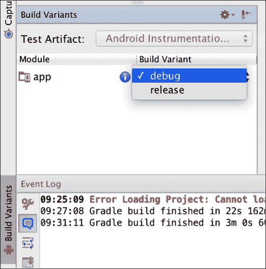

构建变体是构建类型和产品风味的组合。

如果我们有构建类型 `A` 和 `B`，以及产品风味 `1` 和 `2`，那么结果将产生以下构建变体：

```kt
A 1
A 2
B 1
B 2
```

为了更好地理解这一点，我们可以了解构建类型和构建风味是什么，以及如何创建它们。

## 创建构建类型

构建类型允许我们为调试或发布目的配置应用程序的打包。

让我们先看看我们的`build.gradle`文件：

```kt
buildTypes {
  release {
    minifyEnabled false
    proguardFiles getDefaultProguardFile('proguard-android.txt'), 'proguard-rules.pro'
  }
}
```

在`build.gradle`文件中，我们可以看到发布构建类型有两个属性，我们将在本章末尾解释它们。

默认情况下，我们有两种构建类型：**调试（debug）**和**发布（release）**。即使我们没有看到调试构建类型，所有变体也将在发布和调试模式下生成。

我们可以创建更多具有不同参数的构建类型；我们可以使用的参数之一是：

+   签名配置

+   调试签名标志

+   更改版本名称或包名后缀

这意味着我们可以使用不同类型的证书来启用或禁用调试模式，并且可以有不同的包名。

构建类型并不是用来创建我们应用程序的不同版本，比如演示版或完整版，免费或付费等等。为此，我们有产品风味。每个构建类型都应用于每个构建风味，就像我们之前看到的，创建一个构建变体。

## 产品风味

我们将创建两个产品风味，并在`build.gradle`中使用以下代码声明它们：

```kt
productFlavors {
  paid {
    applicationId "com.packtpub.masteringandroidapp"
  }
  free {
    applicationId "com.packtpub.masteringandroidapp.free"
  }
}
```

我们有一个付费风味，这是没有广告的应用程序，还有一个名为*免费（free）*的风味，这是带有广告的免费版本。对于每个产品风味，我们可以在项目的`../src/`级别创建一个文件夹。我们的付费版本默认是主要的，所以不需要为其创建文件夹。

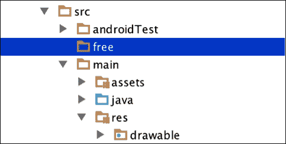

这样，我们就可以为每个构建版本使用不同的类和资源，甚至可以有不同的`AndroidManifest.xml`文件。我们的应用程序将在`main`文件夹中共享付费版本和免费版本的通用代码，在`free`文件夹中包含特定于广告的代码。

要在不同的版本之间切换，我们只需更改构建变体窗口中的下拉菜单，如下面的屏幕截图所示：

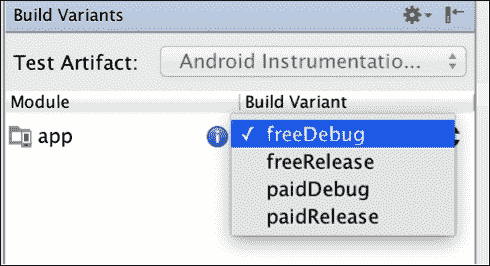

选择一个构建变体后，我们可以运行应用程序或导出它，相应地运行或导出所选的风味。这些可以配置为具有不同的包名和不同的版本名称。

现在，我们将看看如何向免费版本添加特定代码，这些代码不会包含在主付费版本中。

# 安卓应用的货币化

我们将描述通过应用程序赚钱的三种常见方式。

首先，我们可以在 Play Store 中为应用程序定价销售。在某些情况下，为你的应用收费比提供带有广告或应用内产品的免费应用更有意义。如果你为少数用户创造了具有大价值的应用，你绝对应该考虑这个选项。例如，如果我们发布一个为建筑师专业设计房屋的应用，我们会知道我们的应用不会被数百万用户下载；它是针对寻求高质量软件的特定目标受众。我们无法通过广告获得足够的利润，而我们的用户将愿意为使他们的工作更轻松的软件支付一笔不错的费用。要求用户预先支付费用总是存在风险的；即使用户可以选择退还应用，他/她可能也不够吸引人去尝试。这就是为什么我们应该考虑第二种模式。

第二种模式被称为**免费增值**模式。我们发布一个免费的应用程序，但其中包括应用内购买。同样以设计房屋的应用为例，我们可以提供三种免费设计，以便当用户对我们的产品感到满意时，我们可以要求他/她购买一次性许可或订阅以继续使用该应用。这在游戏中非常常见，你可以为你的角色购买物品。正是在游戏中，我们可以看到这个模式也可以与第三种模式结合以获得尽可能最大的收益。

盈利化的第三种模式是**广告模式**；我们在应用中放置广告，当用户点击它们时，我们获得收入。我们可以使用不同类型的广告——从全屏广告到底部的小横幅。我们将关注这个模式。实施它比你想象的要容易。但在实施之前，我们需要解释诸如**CPC**（**每次点击成本**）、**CTR**（**点击通过率**）、填充率等术语，这将帮助我们选择一个好的广告平台和提供商。这对于理解指标并能够阅读图表以了解应用中的广告表现也是必要的。在不同的地方放置广告可能会改变收入；然而，我们需要在不烦扰用户的情况下最大化收入。如果我们为用户提供以小额费用通过应用内产品或无广告的付费版本移除广告的选项，我们可以增加广告的数量。如果用户知道他们有选择，这对他们来说是最好的。如果他们选择与广告共存，这是他们的决定，它不会像我们在没有移除选项的情况下放置大量广告那样让他们感到烦恼。

## 广告盈利化的关键点

我们将解释理解广告盈利化如何运作的基础知识。在这个业务中有一些带有缩写的概念，初学者可能会感到困惑。

一旦我们在广告平台上注册，我们就会看到一个关于我们应用的统计数据报告页面。以下就是来自广告网络`AdToApp`的仪表板示例：

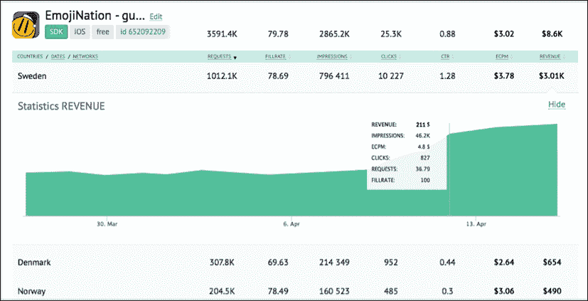

在这里，我们可以看到请求、填充率、展示量、点击量、CTR、eCPM 和收入。让我们逐一考虑它们。

请求是指我们的应用向广告网络请求广告的次数。例如，如果我们决定在应用开始时添加一个全屏广告，那么每次启动应用时，都会向服务器发送一个请求以获取广告。

我们的应用中并没有实际的广告；我们拥有的是一个占位符、一个框架和一个`AdView`，它将由广告网络提供的内容填充。有时，在请求时刻广告网络可能没有广告给我们，这就是下一个概念重要的原因。

填充率是通过已投放广告数量除以请求广告数量得出的百分比。例如，如果我们启动应用十次，只收到五次广告返回，那么我们的填充率就是 50%。在一个好的广告网络中，我们希望填充率是 100%。我们希望展示尽可能多的广告，并且有好的 CPC。

CPC，即每次点击成本，是指用户在我们的应用中每次点击广告时我们能赚到的钱；这个数值越高，我们获得的收入越多。广告商决定广告的 CPC。一些广告商可能愿意为每次点击支付更多的费用。

许多低 CPC 的点击并不一定比少数高 CPC 的点击更好。这就是为什么我们拥有的广告质量很重要。

展示量是指广告向用户展示的次数。在之前的例子中，如果有十次广告请求，其中五次失败，我们就会有五次展示量。如果用户没有点击，展示量不会产生收入。

点击量是指用户点击广告的次数。这是基于 CPC 产生收入的部分。因此，五次点击，每次点击 0.5 美元，将会产生 5x0.5，即 2.5 美元。

CTR，即点击通过率，是通过点击量除以展示量得出的百分比。如果我们有 100 次广告展示并获得一次点击，我们的 CTR 将是 1%。这个数值通常在 5%以下；用户不会点击他们看到的每一个广告，如果你通过强制用户点击广告来作弊，比如**Admob**这样的广告平台可能会取消你的账户和支付。假设我们在应用开始时显示一个对话框，要求用户点击广告以继续使用我们的应用。这将基本上给我们带来 100%的 CTR；每次展示都会有点击，这是不允许的。在任何情况下，我们都不可以推广点击。

广告提供商希望他们的广告能被对其感兴趣的人看到；他们不希望为那些对广告不感兴趣、一秒钟后就会关闭广告的人的点击付费。可能的情况是，你有一个高的点击率（CTR），因为你在应用中有一个好的广告位置，而且每个用户都对广告感兴趣。如果发生这种情况，你将不得不向你的广告网络解释，或者像**Admob**这样的广告网络可能会关闭你的账户。但我们也不应该对他们太不公平；他们这样做是因为他们发现很多人试图破坏规则，这样一个庞大的公司无法专注于个人，所以他们需要有客观的筛选机制。

其他广告网络公司在这方面更加灵活；他们通常会为你分配一个代理人，你可以通过 Skype 或电子邮件频繁联系他，如果遇到任何问题，他们通常会通知你。

eCPM 代表“每千次展示的有效成本”。它是通过将总收入除以总展示次数（以千为单位）来计算的。这基本上是通过一个数字快速了解你表现如何的方法——非常有助于比较广告网络。这个数字通常在$0 到 3$之间。

我们需要考虑的是，这并不包括填充率。它是每千次展示的成本，而不是每千次请求的成本。一个 50%填充率的三美元 eCPM 与 100%填充率的一块半美元 eCPM 是相同的。

使一个广告网络变得优秀的是高填充率和高 eCPM。我们需要这两个指标都高；如果点击费用昂贵但填充率不足，广告将不会产生任何收入，因为它们根本不会被展示。

**AdToApp**的团队制作了一张很好的图来解释这一点：

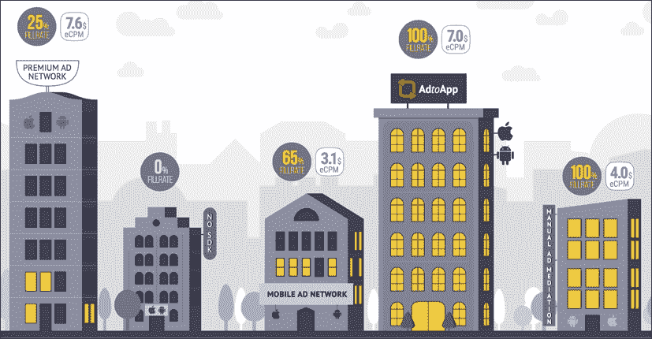

这张图展示了我们一直在讨论的内容；一个高 eCPM 但低填充率的优质广告网络被表现为一座高但空荡荡、灯光熄灭的大楼。

理论部分我们已经讲完了，现在可以开始集成广告解决方案了；在这种情况下，我们将选择 AdToApp。

## 使用 AdToApp 添加广告

没有办法知道哪个广告提供商更适合你；你能做的最好的事情就是尝试不同的广告提供商，并查看统计数据。

根据我们的经验，我们喜欢使用 AddToApp，除了因为它良好的投放效果外，它的集成过程非常简单，即使你的应用中已经有其他网络广告，也可以轻松加入。因此，衡量其性能真的很容易。

在这本书中使用它与`MasteringAndroidApp`非常合适，因为它允许我们使用不同类型的广告，包括全屏广告、横幅、视频等等。

有超过 20 个不同广告网络的调解器，因此包含他们的 SDK，我们将能够访问许多保证高填充率的广告。关于他们的 eCPM，他们会分析哪个网络能为你带来更好的结果；因此，如果他们可以从多个网络投放广告，他们将投放效果更好的广告。

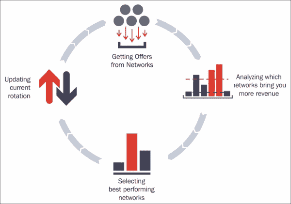

我们可以开始创建一个账户，地址是[`adtoapp.com/?r=OZ-kU-W9Q2qeMmdJsaj3Ow`](https://adtoapp.com/?r=OZ-kU-W9Q2qeMmdJsaj3Ow)。

创建账户后，我们将使用我们应用的包名创建一个应用。

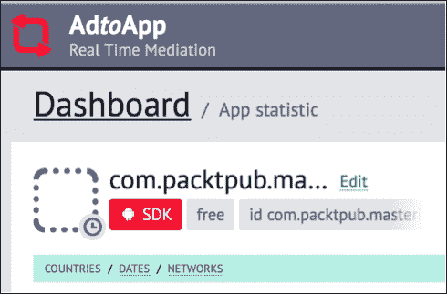

我们将点击 SDK 按钮以下载他们的 SDK 并获得集成配置值。

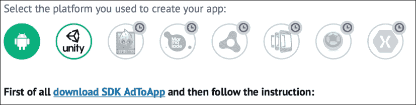

集成非常直接；SDK 将包含一个`AdToAppSDK.jar`文件，我们需要将其复制到`libs`目录中。我们还需要在`build.gradle`中添加 Google Play 服务和支持库*v7*，但我们已经有了这些。

我们需要在清单中添加基本权限，我们已经有这些了，使用以下代码：

```kt
<uses-permission android:name="android.permission.INTERNET" />
<uses-permission android:name="android.permission.ACCESS_NETWORK_STATE" />
<uses-permission android:name="android.permission.WRITE_EXTERNAL_STORAGE" />
<uses-permission android:name="android.permission.READ_PHONE_STATE" />
```

然后，我们需要在清单中添加额外的必要资源，可以从同一网站复制，它包含我们账户的密钥。你可以在以下截图所示的第一部分找到它们：

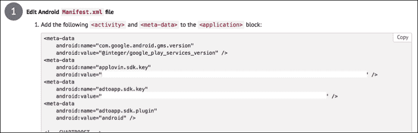

最后，我们可以看看如何实现**插屏广告和横幅广告**或激励广告。激励广告是游戏中弹出的一种广告，提示*观看此视频并获得（金币、宝石等）*。是否观看这些广告完全取决于用户是否想要奖励：

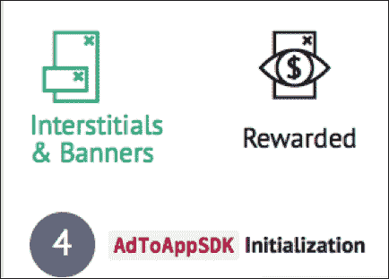

如果我们选择插屏广告和横幅广告，我们需要根据是否只需要视频广告、只需要图片（横幅）广告，或者插屏中同时需要图片和视频广告来初始化它们。

在网站上，根据你想要的广告类型，将显示必要的代码。

SDK 非常灵活；我们可以更进一步，设置回调以了解横幅广告何时加载和点击。这使我们能够跟踪广告中的点击次数，并验证它们与 AdToApp 控制台中的是否相同，从而使过程透明化。

如果我们需要额外的帮助，我们可以在 SDK 中激活日志，它将在出现任何问题时通知我们。

现在，记住我们在本节开始时提到的最佳实践，即最大化广告数量而不过多打扰用户，并在你的应用中实施这些实践，开始获得收益！


# 将我们的应用发布到 Play 商店

最后，我们的应用准备好了！这是开发新应用时最棒的瞬间；是时候将其上传到 Play 商店，获取用户的反馈，并希望获得成千上万的下载量。

我们需要将应用导出为 APK 文件；为了上传到 Play 商店，它必须使用发布证书进行签名。这一点非常重要；一旦应用程序用证书签名，如果我们将其上传到 Play 商店，并在将来想要上传新版本，它必须使用相同的证书进行签名。

我们在发布过程中会创建这个证书。它需要一个别名和密码，请确保你记住这些细节并将证书文件保存在安全的地方。否则，假设你的应用得到了好的评分和大量的下载，当你想要更新版本时，如果没有证书或忘记了密码，那就无法更新。在这种情况下，你不得不以上传一个具有不同包名的全新应用，并且从零下载和零评分开始。

## 代码混淆

在发布应用时，还需要考虑的另一个重要事项是代码混淆。如果我们导出应用而不混淆代码，任何人都可以下载 APK 并反编译它，使他们能够看到你的代码，如果其中有 Parse IDs、服务器访问细节、GCM 项目编号等，这可能会成为安全问题。

我们可以使用 **Proguard** 来混淆代码。Proguard 是 Android 构建系统中包含的一个工具。它混淆、缩小和优化代码，移除未使用的代码，并重命名类、字段和方法，以防止逆向工程。

注意类和方法的重命名，这可能会影响你的崩溃和错误报告，因为堆栈追踪将会被混淆。然而，这不是问题，因为我们可以在发布应用时保存一个映射文件，用它可以重新追踪，这将允许我们将崩溃和报告转换成可读的、未被混淆的代码。

要激活 Proguard，我们需要在 `buildTypes` 中将 `minifyEnabled` 属性设置为 `true`。你可以执行以下代码来实现这一点：

```kt
buildTypes {
  release {
    minifyEnabled true
    proguardFiles getDefaultProguardFile('proguard-android.txt'), 'proguard-rules.pro'
  }
}
```

在我们的项目中，有一个 `proguard-rules.pro` 文件，我们可以在混淆时考虑添加规则。例如，如果我们混淆一些第三方库，它们可能无法正常工作，并且不混淆这些库是没有风险的，因为它们不是我们创建的；我们只是将它们添加到我们的项目中。

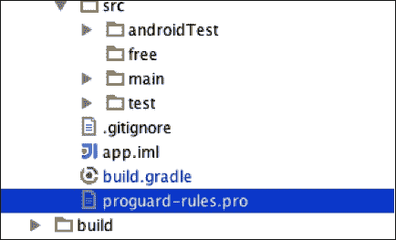

为了防止第三方库被混淆，我们可以添加 `-keep` 规则以及 `-dontwarn` 规则来忽略警告。例如，我们添加了 `calligraphy` 以使用自定义字体；这样我们可以在混淆期间忽略它：

```kt
# DONT OBFUSCATE EXTERNAL LIBRARIES

# CALLIGRAPHY
-dontwarn uk.co.chrisjenx.calligraphy.**
-keep class uk.co.chrisjenx.calligraphy.** {*;}
# TIMBER
-dontwarn timber.log.**
-keep class timber.log.** {*;}
```

使用 `keep` 和包名，我们将保留该包内的所有类。

我们将在调试模式下添加 Proguard，故意创建一个崩溃，看看混淆后的堆栈追踪是什么样子：

```kt
Caused by: java.lang.NullPointerException: Attempt to invoke virtual method 'void android.view.View.setVisibility(int)' on a null object reference
            at com.packtpub.masteringandroidapp.SplashActivity.onCreate(Unknown Source)
```

我们可以将这个`stracktrace`复制到文本文件中，然后前往`app/build/outputs/mapping/product_flavor_name/ release_or_debug/mapping.txt`获取我们的`mapping.txt`文件。

考虑我们在`<sdk_root>/tools/proguard`执行以下代码的 retrace 命令：

```kt
retrace.sh [-verbose] mapping.txt [<stacktrace_file>]
```

在这种情况下，我们将有正确的行号显示崩溃，如下所示：

```kt
Caused by: java.lang.NullPointerException: Attempt to invoke virtual method 'void android.view.View.setVisibility(int)' on a null object reference
at com.packtpub.masteringandroidapp.SplashActivity.onCreate(SplashActivity.java:21)
at android.app.Activity.performCreate(Activity.java:6289)
```

记得在每次发布应用时保存`mapping.txt`的副本；每次发布时这个文件都会被覆盖，因此在每次发布时保存文件非常重要。或者，如果你有一个仓库，并且你为每次发布标记提交，你可以回退并再次生成相同的发布，理论上这将具有相同的映射文件。

既然我们的应用已经针对逆向工程进行了保护，我们可以继续发布流程。

## 导出应用

当我们导出应用程序时，我们要做的是在发布模式下创建一个 APK 文件并用证书签名。这个证书是 Play Store 中应用属于我们的证明，有了它，我们可以像之前解释的那样上传同一个应用。这次我们将导出应用并创建一个证书。

要导出我们的应用程序，有两种方法：一种是在 Android Studio 中使用 Gradle 和终端，第二种是使用 Android Studio 中的向导。我们将介绍两种方法，但首先使用第二种方法创建证书。

导航到**构建** | **生成签名的 Apk**；你会看到一个与以下类似的对话框：

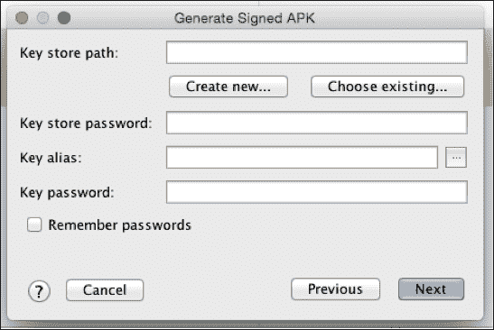

如果我们之前导出过这个应用并创建了证书，那么只需选择路径，输入别名和密码，这将使用现有证书签署导出一个新版本的应用。

对我们来说，这是第一次导出`MasteringAndroidApp`，因此我们将点击**创建新的…**。在下一个屏幕上，我们需要选择保存证书的路径，这是一个`.keystore`文件。

我们还需要为`keystore`和一个证书内的别名设置密码。对于有效日期，100 年应该是可以的；如果你的应用比你活得更久，那就不是你的问题了！最后，在这里至少需要一个字段填写个人信息：


最后，它会询问我们想要导出哪个版本的应用，并且会创建`.apk`文件，同时指出文件的路径。

这种方法很直接，但还有一种自动化的方法可以使用命令行和 Gradle 导出应用；例如，如果我们想用 Jenkins 构建应用，这会非常有用。

为此，我们需要在`build.gradle`中添加一个签名配置，这样当自动生成应用时，它会知道要使用哪个`keystore`以及哪个别名和密码。以下代码将有助于实现这一点：

```kt
signingConfigs {
  release {
    storeFile file("certificate.keystore")
    storePassword "android"
    keyAlias "android"
    keyPassword "android"
  }
}
```

不用说，这可能导致安全问题；密码写在`build.gradle`中，证书文件包含在我们的项目中。如果我们这样做，我们需要确保项目安全。如果这是一个关注点，你可以使用以下代码在运行时读取密码和别名：

```kt
storePassword new String(System.console().readPassword("\n\$ Enter keystore password: "))
keyAlias System.console().readLine("\n\$ Enter key alias: ")
keyPassword new String(System.console().readPassword("\n\$ Enter key password: "))
```

当我们运行生成签名 APK 的命令时，系统会要求我们输入密码别名和别名密码。我们可以使用以下代码行来完成这个操作：

```kt
>./gradlew assembleRelease
```

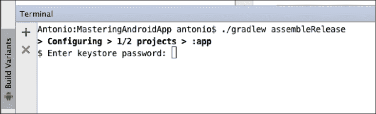

应用导出后，我们可以继续最后一步：上传到 Play 商店。

## 将我们的应用上传到 Play 商店

要发布应用，我们需要一个 Google 开发者账户。如果你没有，可以从[`play.google.com/apps/publish/`](https://play.google.com/apps/publish/)获取一个。

### 创建发布商账户

创建发布商账户的第一步是输入基本信息，并阅读并接受开发者分销协议。第二步是支付 25 美元的开发许可费用以创建账户。这是我们发布应用所需支付的全部费用，只需一次性支付——一次付费，终身许可。考虑到 iOS 上每年要支付 99 美元，我们不应该抱怨。

最后的第三步需要开发者的名字，该名字将显示在我们的应用程序名称下方。以下是 Google Inc 的示例：


我们还需要电子邮件、手机号码以及可选的网站。根据谷歌的说法，这是为了在有人需要就发布的内容联系我们时使用。

### Google Play Developer 控制台

当我们打开发布商账户时，如果我们还没有发布任何应用，我们将看到开发者控制台四个主要功能，如下面的图片所示：

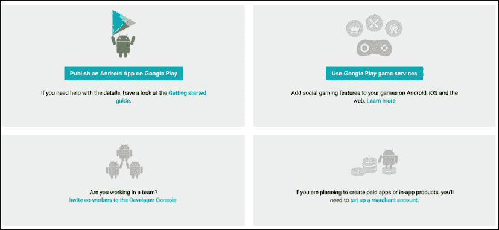

第一个选项是发布一个 Android 应用，这也是我们将在书中遵循的选项。然而，在此之前，我们将快速描述其他需要考虑的选项。

第二个选项是关于 Google Play 游戏服务。如果你开发了一个游戏，希望玩家保存并提交他们的分数，并有一个分数排名，你将需要一个服务器来存储这些分数并检索它们，甚至可能需要玩家用户名和登录。游戏服务为我们完成这些工作。

它提供了一个 API，跨游戏共享，并与用户的 Google 账户关联，我们可以管理排行榜和成就。它甚至提供了实现多人游戏（包括实时多人和回合制）的 API 和基础设施。

左侧底部的第三个选项是关于分享开发者控制台的。我们可能希望允许其他开发者更新应用。例如，在公司中，这将有助于那些负责设置应用名称、描述、图片和总体市场营销的人员，以及其他负责应用上传和开发的人员。我们可以配置对控制台和特定应用的访问权限。

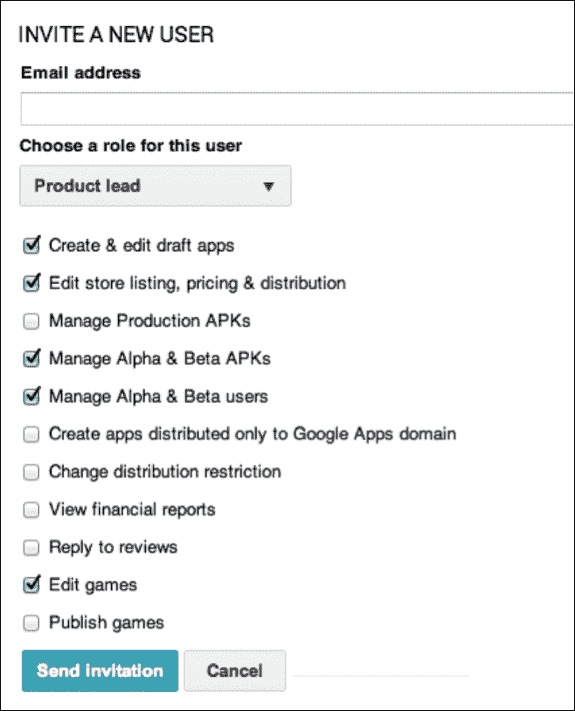

第四个也是最后一个选项是商家账户；如果我们想要销售付费应用或应用内产品，就需要这个。这是来自付费应用的商家账户示例；我们可以看到完成的支付和取消的支付。如果用户购买了我们的应用，他/她在两小时内可以申请退款，如果他/她不喜欢它的话。

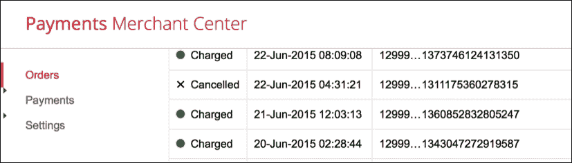

因为我们还没有发布应用，所以我们看到了一个包含四个主要选项的空白开发者控制台；如果我们有已发布的应用，我们会看到这样的界面。在这种情况下，**发布**按钮位于顶部：

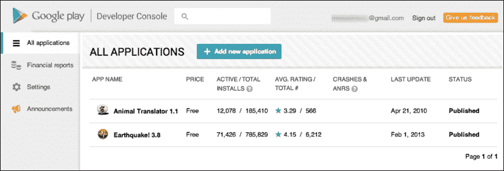

在初始屏幕上，我们可以看到不同的应用，无论它们是免费还是付费，活跃安装数和总安装数。活跃安装意味着目前拥有该应用并且下载后没有卸载的人数。总安装数意味着应用被安装的所有次数的总计。

我们还可以查看评分和崩溃次数。如果我们点击应用并进入详细视图，可以查看更多详细信息，比如用户的评论和错误崩溃报告。

### 发布应用

继续上传过程，当我们点击**+ 添加**新应用时，会被要求输入名称和默认语言。在此之后，我们可以选择通过上传 APK 或准备商店列表来开始流程。

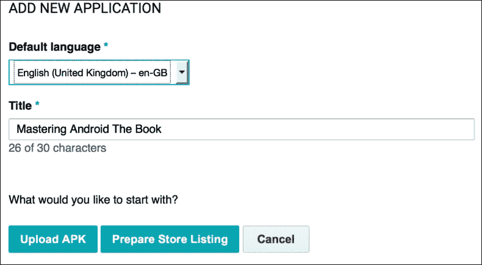

这包括两个不同的过程：一个是上传 APK 文件，另一个是设置应用的标题、描述、图片、是否付费等——所有在 Play 商店中展示的不同选项。

让我们先从上传 APK 文件和不同的测试组开始。

### 上传 APK 文件

请记住，当我们上传 APK 时，我们应用的包名在 Play 商店中必须是唯一的；如果我们想要更新之前由我们发布的 app，并且使用初始下载签名的证书与新的 APK 签名证书相同，那么我们可以上传具有现有包名的 APK。

当我们点击**上传 APK**时，首先注意到的三个不同标签页的名称分别为：**生产环境**、**测试版**和**Alpha 版**。

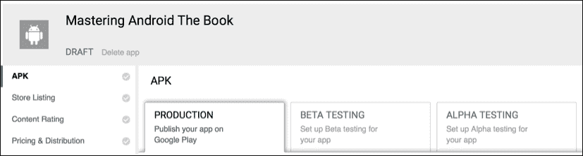

我们可以在两个测试组以及生产环境中发布我们的应用程序。生产意味着它在 Play 商店中发布；它是公开的，对所有人可见。一段时间以来，这曾是开发者控制台中的唯一选项，直到他们增加了分阶段推出的功能。

分阶段推出允许我们将应用程序发布给一组有限的用户。为了选择这些用户，我们有不同的选项；我们可以通过电子邮件邀请这些用户，分享链接，或者创建一个 Google 群组或 G+社区，邀请用户加入该群组，并将应用程序的链接分享给他们。只有这些用户才会在 Play 商店中看到应用程序。这对于在应用程序向全世界发布之前从一些用户那里获得反馈非常有用，当然，也可以防止应用程序在生产环境中出现错误和差评。我们还可以选择在生产环境中发布我们应用程序的用户百分比；例如，如果我们有百万用户，我们可以首先向 10%的用户发布，并在进行大规模发布之前再次确认一切是否正常。

我们的应用程序可以在不同的阶段有不同的版本；例如，我们可以发布版本 1.0.0，1.0.1 进行 beta 测试，1.0.2 进行 alpha 测试。我们可以从 alpha 阶段滚动到 beta 阶段，从 beta 阶段滚动到生产阶段，但我们不能回滚。

我们现在要解释的概念非常重要。一旦我们发布了应用程序的一个版本，我们就无法回到之前的发布版本。可能会出现这样的情况：我们在 Play 商店中有一个应用程序的正常运行的版本，我们开发了一个新版本，在我们的设备上运行良好，我们认为它已经准备好上传了。现在是周五下午，我们不想进行测试，因为我们会想，“哦，我相信它没问题。我只是改了两行代码，不会影响任何东西”。我们上传了版本 1.0.4。几小时后，我们开始收到来自 Play 商店的崩溃报告。这是恐慌的时刻；我们现在能做的唯一事情是撤销当前应用程序的发布，以防止更多损害，并尽快开始修复。然而，如果修复不容易，最明智的做法是再次生成最后一个已知正常工作的版本（1.0.3），将版本号和代码增加到 1.0.5，并将其上传到 Play 商店。

然而，这可能会变得更糟；如果我们有一个数据库，并且其结构从 1.0.3 更改为 1.0.4，如果我们的代码还没有准备好接受从 1.0.4 降级到 1.0.3（更名为 1.0.5）的数据库，我们知道我们整个周末都要工作，只是为了在周一早上被解雇。总之，我们的观点是，预防胜于治疗；因此，使用分阶段推出，在发布之前进行所有必要的测试，并避免在周五下午发布，以防万一。

### 准备商店列表

对于开发者来说，准备商店列表可能是最无聊的部分，但为了发布应用程序，这是必须要完成的；有一些我们不能跳过的必填资产和字段。

首先，我们需要为我们的应用准备一个标题，一个最多 80 个字符的简短描述和一个最多 4000 个字符的长描述。标题将是我们搜索应用时首先看到的内容；简短描述可以在例如浏览应用时的平板电脑上看到。这是我们应用的*elevator pitch*，我们需要在这里描述其主要功能。


长描述将在我们查看此应用的详细视图时显示。为了在更多搜索中出现并获得可见性，在描述中识别并添加与应用相关的关键词是很好的做法。使用不相关关键词吸引下载是被 Google 禁止的，如果你这样做，你将在开发者控制台收到警告，并且你的应用在重新获得批准和发布之前需要做出一些更改。

在这一点上，我们可以选择国际化我们应用的列表，重复这些字段，用我们想要的任何语言，它们将根据用户的语言自动显示在不同的语言中。

下一步是开发图形，我们需要在这里进行截图。截图可以通过设备上的按键组合轻松完成；例如，在三星 Galaxy 3 上，这是通过同时按下*音量减*和*菜单*键完成的。也可以通过在 Android Studio 中选择 Android 视图中的相机图标来获取截图。

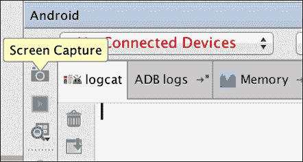

除了截图，我们还需要一个 512 x 512 高分辨率的图标；这必须与上传版本中我们应用所使用的图标相同或非常相似，否则会收到警告。因此，最好始终以 512 x 512 的尺寸创建图标，然后将其缩小以用于我们的应用。反其道而行将导致放大后图像质量变差。以下是图标显示的一个示例：

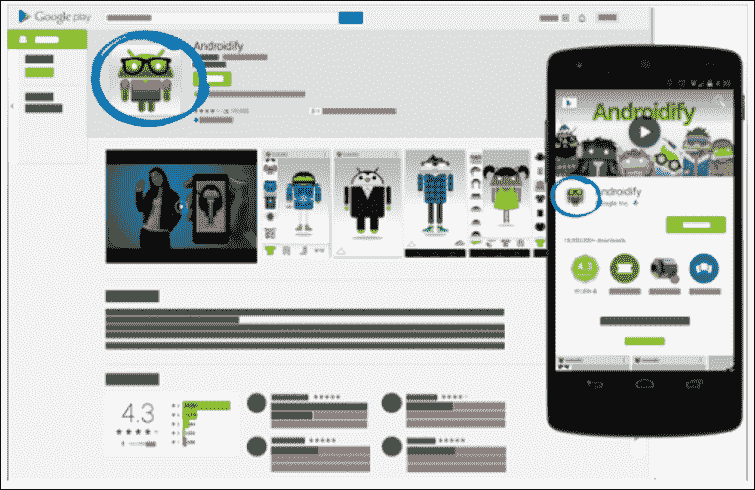

我们需要准备的最后一张图片是功能图。这是一张 1024 x 500 的图片，展示了我们应用的特点。这是在我们应用在 Google Play 上展示时会被用到的图片。它将在 Play 商店应用中展示；如果我们有促销视频，即使视频没有播放，功能图也会显示。

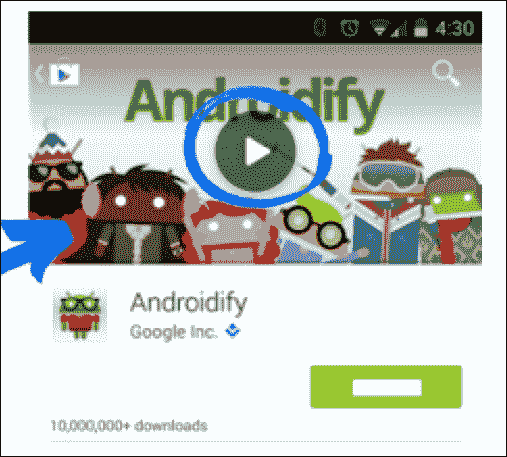

我们需要继续进行分类；根据我们的应用是否为游戏或应用程序，我们需要选择不同的类别。如果你不确定选择哪个类别，可以在 Play 商店查看类似你应用的 app。

此后，我们需要选择内容评级；从 2015 年 5 月开始，每个应用都需要有新的评级系统。根据谷歌的说法，这个新的内容评级为向用户传达熟悉且与本地相关的内容评级提供了一种简单方式，并通过针对你的内容定位合适的目标受众来帮助提高应用参与度，具体内容可参考[`support.google.com/googleplay/android-developer/answer/188189`](https://support.google.com/googleplay/android-developer/answer/188189)。

我们的联系方式会自动填写，所以我们还需要做的就是接受隐私政策，然后点击**定价与分发**。

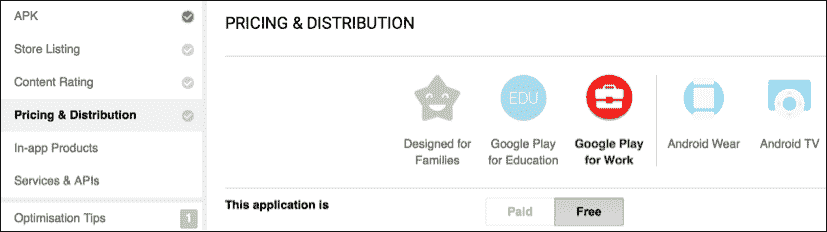

在这里，我们决定应用是免费还是付费；这一步无法撤销。如果应用是付费的，我们可以设定一个价格，谷歌会将它转换成不同国家的不同货币；尽管如此，我们可以为每个国家设定不同的价格。我们可以选择加入不同的开发者群体；例如，如果我们开发了一个儿童应用，我们可以将其包含在**为家庭设计**中。这将增加我们在儿童专区被突出显示的机会，并分发到与儿童应用相关的第三方网络。

在这一部分，我们还可以选择我们希望应用分发的国家。这也可以用作首次发布应用时的分阶段发布策略。

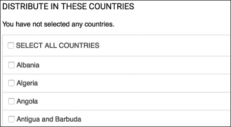

完成以上所有步骤后，我们将能够通过点击右上角的**发布**来发布我们的应用。

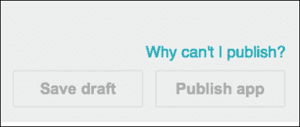

如果按钮不可用，你可以点击**为什么我不能发布？**，它将在左侧列出要求。应用发布后，可能需要几个小时才能在 Play 商店中显示。确定应用是否已发布的最简单方法是使用包名在 URL 中导航到我们的应用。在我们的例子中，URL 将是 [`play.google.com/store/apps/details?id=com.packtpub.masteringandroidapp`](https://play.google.com/store/apps/details?id=com.packtpub.masteringandroidapp)。

就这样！我们从初学者到更高级别完成了这本书，拥有足够的知识来上传一个设计精良、构建完善、向下兼容并实现盈利的应用。

我们祝愿你的应用成功，并希望你能打造出下一个《愤怒的小鸟》或下一个 WhatsApp！

### 注意

感谢购买并完成这本书。对于建议、改进或有任何反馈，请毫不犹豫地联系我 `<Antonio@suitapps.com>` 或在 Twitter 上关注我 `@AntPachon`。

# 总结

在本书的最后一章，我们开始学习如何创建应用的不同版本，通过结合构建类型与产品风味来获得构建变体。

之后，我们学习了如何对我们的应用程序进行货币化，添加了不同类型的广告，并解释了广告货币化的关键要点。

我们还从 Android Studio 和使用 Gradle 命令行导出了应用程序，进行了混淆并使用发布证书进行了签名。

最后，我们在 Play 商店上传并发布了我们的应用程序。
