# 第一章：开始使用 Robotium

自动化测试帮助我们保持高质量的软件，并提供了一种捕获代码更改是否影响实际用例的设施。本章介绍了 Robotium 框架，它的不同特性以及在自动化测试世界中的好处。在本章结束时，我们将在 Eclipse IDE 中完成 Android 环境的完整设置，开始使用 Robotium。

# Robotium 框架

Robotium 是一个开源自动化测试框架，用于编写针对 Android 应用程序的健壮且强大的黑盒测试（主要侧重于黑盒测试用例）。它完全支持原生和混合应用程序的测试。原生应用程序在设备上是实时的，即专为特定平台设计，可以从 Google Play 商店安装；而混合应用程序部分是原生的，部分是 Web 应用。这些也可以从应用商店安装，但需要在浏览器中渲染 HTML。

Robotium 主要用于自动化 UI 测试用例，并在内部使用运行时绑定到**图形用户界面**（**GUI**）组件。

Robotium 遵循 Apache License 2.0 发布。它是免费下载的，个人和企业都可以轻松使用，并建立在 Java 和 JUnit 3 之上。更准确地说，Robotium 是 Android Test Unit Framework 的扩展，可在[`developer.android.com/tools/testing/testing_android.html`](http://developer.android.com/tools/testing/testing_android.html)找到。Robotium 也可以在没有应用程序的情况下工作，在测试源代码之下。

使用 Robotium 编写的测试用例可以在 Android 模拟器（**Android Virtual Device** (**AVD**))上执行——我们将在下一节安装过程中看到如何创建 AVD——或者在实际的 Android 设备上执行。开发者可以跨多个活动编写功能、系统和验收测试场景。

它目前是全球领先的自动化测试框架，许多开源开发者正在贡献，以在后续版本中引入更多激动人心的功能。以下屏幕截图是 Robotium 项目的 git 仓库网站：

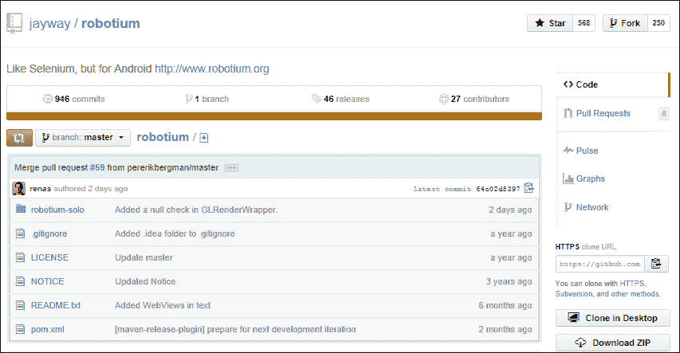

由于 Robotium 是一个开源项目，任何人都可以为了开发目的做出贡献，帮助增强框架，加入更多功能。Robotium 的源代码在 GitHub 上维护，可以通过以下链接访问：

[`github.com/jayway/robotium`](https://github.com/jayway/robotium)

你只需克隆项目。在克隆的项目中做出所有更改，并在你的仓库上点击**Pull Request**，告诉核心团队成员哪些更改需要合并。如果你不熟悉 git 环境，可以参考以下链接的 GitHub 教程：

[`help.github.com/`](https://help.github.com/)

Robotium 类似于 Selenium，但适用于 Android。这个项目是由*Renas Reda*在 2010 年 1 月启动的。他是 Robotium 的创始人兼主要开发者。项目从 v1.0 开始，由于新需求的出现，继续推出新版本。它支持 Android 功能，如活动、Toasts、菜单、上下文菜单、Web 视图和远程控制。

让我们看看 Robotium 为 Android 测试用例开发者提供的功能和好处。

# 功能和好处

使用 Robotium 进行自动化测试具有许多功能和好处。用户、Robotium 和 Android 设备之间的三角工作流程图清楚地解释了它们之间的用例：

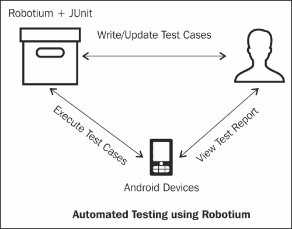

Robotium 的功能和好处如下：

+   Robotium 可以帮助我们快速编写强大的测试用例，而无需对被测应用程序有太多了解。

+   Robotium 提供 API，可以直接与 Android 应用程序内的 UI 控件交互，如 EditText、TextView 和 Button。

+   Robotium 正式支持 Android 1.6 及以上版本。

+   Robotium 不会修改 Android 平台。

+   Robotium 测试也可以使用命令提示符执行。

+   Robotium 可以平滑地与 Maven 或 Ant 集成。这有助于将 Robotium 添加到你的项目构建自动化过程中。

+   在 Robotium 中可以捕获屏幕截图（以下是一个示例截图）：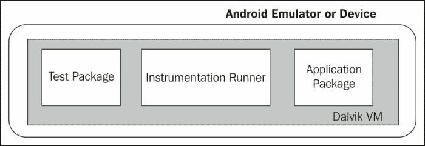

+   测试应用程序项目和应用程序项目在同一个 JVM 上运行，即**Dalvik 虚拟机**（**DVM**）。

+   可以在没有源代码的情况下运行 Robotium。

+   Robotium 可以与其他代码覆盖率测量工具配合使用，例如 Cobertura 和 Emma。

+   Robotium 可以检测屏幕上显示的消息（Toasts）。

+   Robotium 支持 Android 的活动、菜单和上下文菜单功能。

+   Robotium 自动化测试可以快速实现。Robotium 基于 JUnit 构建，因此它继承了 JUnit 的所有功能。Robotium 框架可以自动处理 Android 应用程序中的多个活动。

+   与标准的 instrumentation 测试相比，Robotium 测试用例的可读性更强。

+   滚动活动由 Robotium 框架自动处理。

+   Robotium 的最新版本支持混合应用程序。混合应用程序使用 WebViews 以全屏显示 HTML 和 JavaScript 文件，使用本地浏览器渲染引擎。

# 设置 Android 环境

你可以在 Eclipse 中设置 Android 环境，这是使用 Robotium 创建测试项目的基本步骤，如下所示：

## 需求

在为 Robotium 设置 Android 环境之前，你需要检查以下所有必需的元素：

+   必须安装**Java 开发工具包**（**JDK**）（你可以从[`www.oracle.com/technetwork/java/javase/downloads/index.html`](http://www.oracle.com/technetwork/java/javase/downloads/index.html)安装）

+   必须安装 Eclipse IDE

    +   标准 Eclipse IDE ([`www.eclipse.org/downloads/`](http://www.eclipse.org/downloads/))

    +   内置**Android 开发工具**（**ADT**）的 Eclipse IDE ([`developer.android.com/sdk/index.html`](http://developer.android.com/sdk/index.html))

    +   对于 Robotium for Android Starter，我们将使用标准 Eclipse IDE，这是各行各业的技术爱好者和开发人员广泛使用的。内置 ADT 的 Eclipse IDE 有一个 Android 插件，无需设置 Android SDK。两种 Eclipse IDE 中只需选择一种。

    +   要使用标准 Eclipse IDE 进行 Android 开发并设置新的 SDK，你需要下载 SDK 工具并选择要安装的附加 SDK 包。在现有版本的 Eclipse IDE 中，添加 ADT 插件

## 下载 Android SDK

下载 Android SDK 最简单的方法是从[`developer.android.com/sdk/index.html`](http://developer.android.com/sdk/index.html)获取一个压缩的 ADT 包。

Android SDK 提供了库和开发工具，用于构建、测试和调试 Android 应用程序。

将其解压到系统上的安全位置。在以下步骤中我们将使用这个包。

## 安装 ADT

你可以按照列出的步骤安装 ADT：

1.  在 Eclipse IDE（Kepler 版本）中，点击**帮助**菜单，然后选择**安装新软件**选项。你会看到以下屏幕，它会根据**工作区间：**组合框中提供的网站 URL 显示可用软件。**安装新软件**向导允许你将新软件添加到你的安装中，如下截图所示：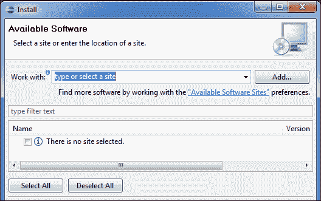

1.  使用**工作区间：**组合框，你可以随时选择任何网站浏览其内容。你也可以浏览这些网站上的所有软件。当你知道软件名称但不知道实际位置时，这很有用。

1.  在**安装新软件**窗口中点击**添加**按钮，这将打开**添加仓库**窗口，如下截图所示。

1.  在此窗口中，在**名称**字段中输入名称，在**位置**字段中输入以下 URL，然后点击**确定**按钮以下载 Android ADT：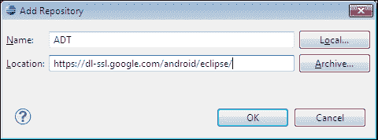

1.  Eclipse 现在将从这个位置搜索所有可用的工具，并将它们列出来，如下所示：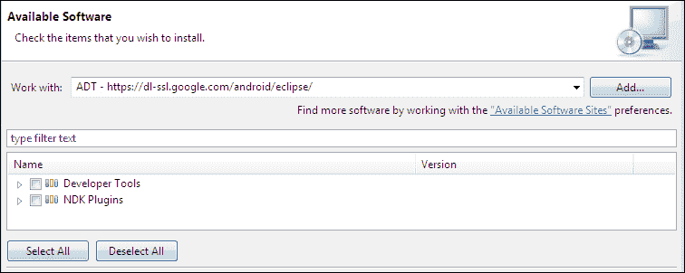

1.  选择所有工具并点击**下一步**。这将打开一个窗口，如下截图所示，列出所有将作为 Eclipse 插件安装的组件：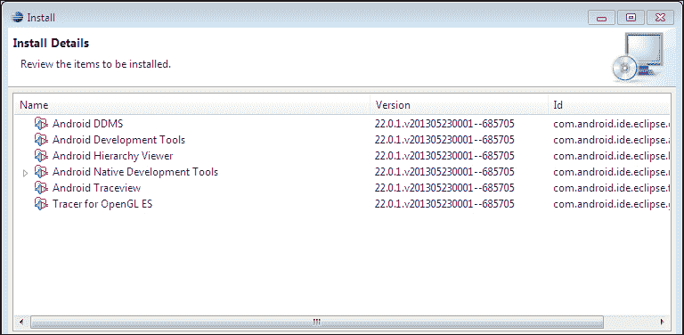

1.  在 **安装详情** 窗口中点击 **下一步** 按钮。在完成许可验证后，它将开始下载所有提到的工具。成功安装后，系统会提示你重启 Eclipse IDE。重启它！

## 添加 Android SDK 位置

要将 Android SDK 添加到 Eclipse，请按照列出的步骤操作：

1.  在 Eclipse 中，从 **窗口** 菜单下，点击 **首选项**（Mac OS X 用户可能在 **Eclipse** 菜单下找到 **首选项**）。检查 **Android** 选项卡（此选项卡的存在清楚地表明 Android ADT 插件已成功安装）并会出现如下截图所示的窗口。SDK 位置告诉 Eclipse Android SDK 在系统中的位置。

1.  如果 SDK 位置不存在，浏览到解压后的 `SDK` 目录并点击 **确定**。只有在提供了正确的 SDK 位置并点击了 **应用** 或 **确定** 按钮后，SDK 目标列表才会重新加载。这些目标来自 SDK 本身。

1.  如果你仍然在目标列表中没有看到任何条目，这意味着你的 Android SDK 没有正确安装。按照步骤 3 所述安装 Android SDK，并在列表中检查 SDK 目标：

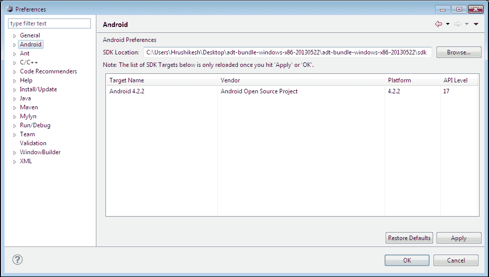

## 安装最新 SDK 版本

在实际创建虚拟设备之前，你需要安装最新版本的 SDK。从 **窗口** 菜单中进入 **Android SDK 管理器**，会出现如下截图所示的窗口。选择已安装的最新 SDK 版本。你可以根据你的选择选择任何版本，并点击 **安装包…**。安装完成后，如果包安装更改没有反映出来，请重启 Eclipse：

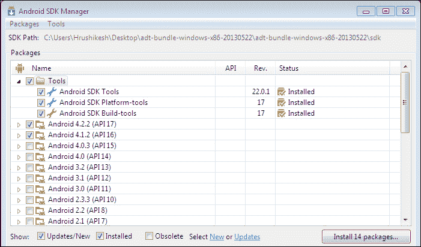

## 设置 AVD

Android 环境的初始配置几乎完成。现在，我们只需要设置 AVD。

AVD 用于运行 Android 应用程序。建议你使用 Android 设备来运行应用程序。但在本书的范围内，我们将只使用 AVD（Android 模拟器）来运行应用。

你可以从 Eclipse 中 **窗口** 菜单下的 **AVD 管理器** 选项中创建一个新的 AVD。在 AVD 屏幕上点击 **新建**，你会看到一个如下截图所示的窗口。填写以下详细信息并点击 **确定**。

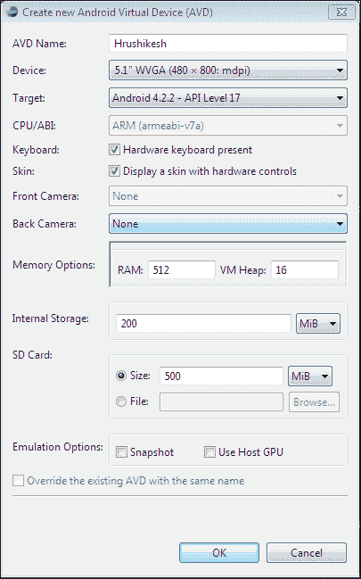

创建后，它将显示在 Android SDK 和 AVD 管理器屏幕下。

要运行创建的 AVD，请右键点击项目并导航到 **运行方式** | **Android 应用程序**。将会弹出一个 **部署目标选择模式** 窗口，要求你选择一个 AVD 或连接的 Android 设备来运行你的应用程序；选择其中任何一个，应用程序就会安装在所选设备/AVD 上。以下截图是 **部署目标选择模式** 窗口：

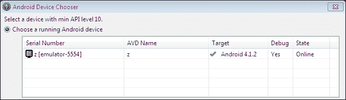

到目前为止，你应该已经拥有了一个可以工作的 Android 环境来开始使用 Robotium 编写和执行测试用例。你可以自由地探索并了解更多相关信息。

# 总结

在本章中，我们学习了 Robotium 框架以及需要执行哪些不同的步骤来让你的 Android 环境准备好使用这个框架。

在下一章中，我们将开始使用 Robotium 实现我们的第一个测试项目。如果你想要学习关于测试用例实现的内容，请继续阅读。
