# 第二章：使用 Robotium 创建测试项目

本章将指导您使用 Robotium Framework 为 Android 创建第一个测试项目。首先，让我们实现一个简单的计算器 Android 应用。然后，使用这个**被测应用（AUT）**，我们将了解创建 Robotium 测试项目的过程。

# 创建 AUT

在本节中，我们将创建一个简单的计算器应用，允许输入两个数字。用户可以对这两个数字执行以下两种操作：

+   加法

+   减法

这些操作可以通过 Spinner 控件选择。Spinner 与其他编程语言（如 HTML 和 C#）中的组合框类似。底对齐的 TextView 中的**获取结果**按钮用于获取操作结果。

以下截图展示了 ZCalculator 应用：

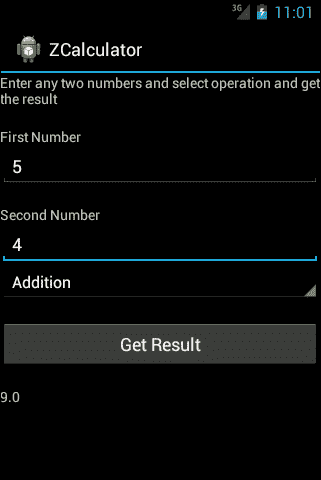

要创建 AUT，请按照列出的步骤操作：

1.  在 Eclipse IDE 中，通过导航至**文件** | **新建** | **Android 应用项目**来创建一个**Android 应用项目**。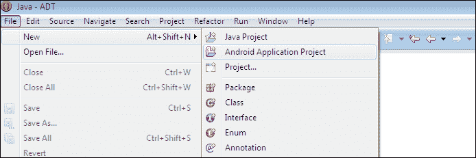

1.  输入应用详情，如以下截图所示，然后点击**下一步**按钮：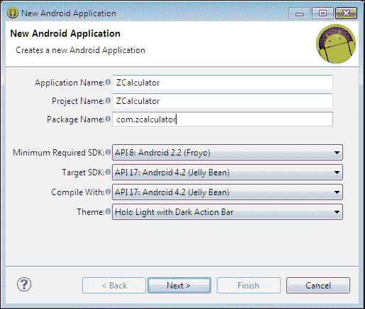

1.  保持默认选项，如以下截图所示，然后点击**下一步**按钮：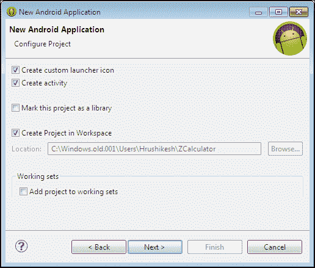

1.  对于这个 Android 应用项目，我们将配置启动图标，设置默认值，如以下截图所示，然后点击**下一步**按钮：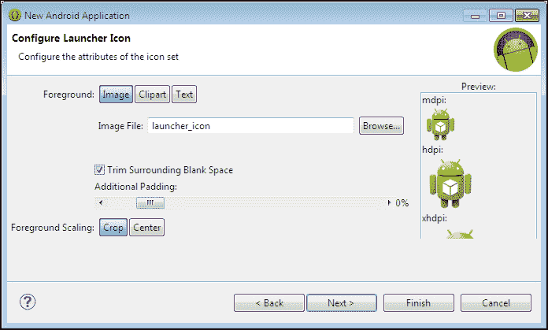

1.  如果**创建活动**复选框未选中，请勾选它，并选择**空白活动**，如以下截图所示，以在项目中创建默认的空白活动类：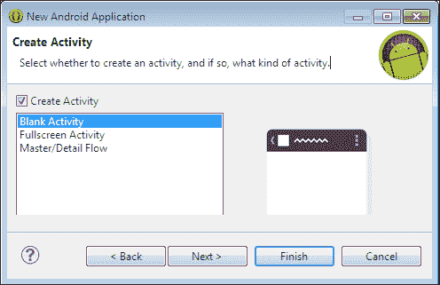

1.  在**活动名称**字段中输入`Main`，如以下截图所示，然后点击**完成**按钮以创建 Android 应用项目：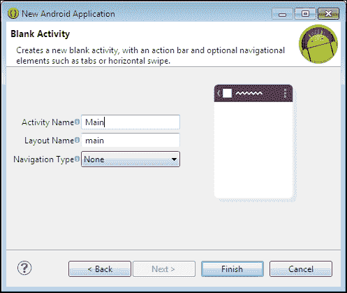

你的 Android 项目现在已经设置好了。你可以参考以下给出的 ZCalculator 项目代码库：

1.  在你的`Main.java`文件中使用以下代码：

    ```kt
    package com.zcalculator;

    import com.calculator.R;

    import android.app.Activity;
    import android.os.Bundle;
    import android.view.View;
    import android.widget.Button;
    import android.widget.EditText;
    import android.widget.Spinner;
    import android.widget.TextView;

    public class Main extends Activity {
      Spinner	operationSpinner;
      TextView  result;
      Button    getResult;

      private enum OperationType
      {
        Addition, Subtraction
      }

      @Override
      public void onCreate(final Bundle savedInstanceState) {
        super.onCreate(savedInstanceState);
        this.setContentView(R.layout.main);

        final EditText txtfirstNumber = (EditText) this.findViewById(R.id.txtFirstNumber);
        final EditText txtsecondNumber = (EditText) this.findViewById(R.id.txtSecondNumber);

        this.result = (TextView) this.findViewById(R.id.resultText);
        this.result.setText("0.00");

        this.getResult = (Button) this.findViewById(R.id.btnGetResult);

        this.operationSpinner = (Spinner) this.findViewById(R.id.operationSpinner);

        // Adding listener to get result button
        this.getResult.setOnClickListener(new View.OnClickListener() {

          public void onClick(final View v) {
            OperationType operationType = OperationType.valueOf(Main.this.operationSpinner.getSelectedItem().toString());

            final float num1 = Float.parseFloat(txtfirstNumber.getText().toString());
            final float num2 = Float.parseFloat(txtsecondNumber.getText().toString());

        // Getting first & second values and passing to show result
            Main.this.showResult(num1,num2 ,operationType);
          }
        });
      }

      // Showing operation results
      protected void showResult(final float firstNumber, final float secondNumber, final OperationType type) {

        float resultVal = 0;
        if (type.equals(OperationType.Addition)) {
          resultVal = firstNumber + secondNumber;
        } else if (type.equals(OperationType.Subtraction)) {
          resultVal = firstNumber - secondNumber;
        }

        String operationResult = String.valueOf(resultVal);
        this.result.setText(operationResult);
      }
    }
    ```

1.  在`main.xml`布局文件中使用以下代码：

    ```kt
    <?xml version="1.0" encoding="utf-8"?>
    <LinearLayout android:orientation="vertical"android:layout_width=" match_parent"android:layout_height=" match_parent">

    <TextViewandroid:layout_width=" match_parent" android:layout_height="wrap_content" android:text="@string/hello"/>

    <TextView android:layout_width="wrap_content" 
      android:layout_height="wrap_content" 
      android:text="@string/txtSpace"/>

    <TextView android:layout_width="wrap_content" 
      android:layout_height="wrap_content" 
      android:text="@string/txtFirstNumber"/>

    <EditTextandroid:inputType="numberDecimal"
      android:id="@+id/txtFirstNumber" 
      android:layout_width=" match_parent" 
      android:layout_height="wrap_content"/>

    <TextViewandroid:layout_width="wrap_content"
      android:layout_height="wrap_content" 
      android:text="@string/txtSpace"/>

    <TextViewandroid:layout_width="wrap_content" 
      android:layout_height="wrap_content" 
      android:text="@string/txtSecondNumber"/>

    <EditTextandroid:inputType="numberDecimal"
      android:id="@+id/txtSecondNumber" 
      android:layout_width=" match_parent" 
      android:layout_height="wrap_content"/>

    <Spinnerandroid:id="@+id/operationSpinner"
      android:layout_width="match_parent"
      android:layout_height="wrap_content" 
      android:entries="@array/spinnerItems"/>

    <TextViewandroid:layout_width="wrap_content" 
      android:layout_height="wrap_content" 
      android:text="@string/txtSpace"/>

    <Buttonandroid:text="@string/btnResultString"
      android:id="@+id/btnGetResult" 
      android:layout_width=" match_parent" 
      android:layout_height="wrap_content"/>

    <TextViewandroid:layout_width="wrap_content" 
      android:layout_height="wrap_content" 
      android:text="@string/txtSpace"/>

    <TextViewandroid:id="@+id/resultText" 
      android:layout_width="wrap_content" 
      android:layout_height="wrap_content"/>

    <TextViewandroid:layout_width="wrap_content"
      android:layout_height="wrap_content" 
      android:text="@string/txtSpace"/>

    </LinearLayout>
    ```

1.  使用以下条目更新`String.xml`文件：

    ```kt
    <string name="hello">Enter any two numbers and select operation and get the result</string>
    <string name="app_name">ZCalculator</string>
    <string name="txtFirstNumber">First Number</string>
    <string name="txtSecondNumber">Second Number</string>
    <string name="btnResultString">Get Result</string>
    ```

1.  使用以下条目更新`array.xml`文件：

    ```kt
      <string-array name="spinnerItems">
        <item>Addition</item>
        <item>Subtraction</item>
      </string-array>
    ```

1.  同时，使用以下活动动作和启动器条目更新`AndroidManifest.xml`文件：

    ```kt
    <uses-sdk android:minSdkVersion="8"/>

    <application android:icon="@drawable/ic_launcher" android:label="@string/app_name">
      <activity android:name="com.zcalculator.Main"android:label="@string/app_name">
        <intent-filter>
          <action android:name="android.intent.action.MAIN" />
          <category android:name="android.intent.category.LAUNCHER" />
        </intent-filter>
      </activity>
    </application>
    ```

# 创建一个测试项目

让我们继续创建一个测试项目，以测试 ZCalculator 应用。

在 Eclipse 中，转到**新建**，从**选择**向导中选择**Android 测试项目**。输入适当的项目名称，然后点击**下一步**按钮。建议测试项目名称遵循如“Test + AUT 名称”的命名约定。这就是为什么这个测试应用被命名为`TestZCalculator`，如下截图所示：

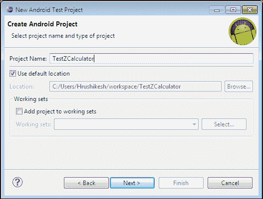

然后，选择 AUT 或目标项目（在我们的例子中是 ZCalculator），如以下截图所示，然后点击**完成**按钮：

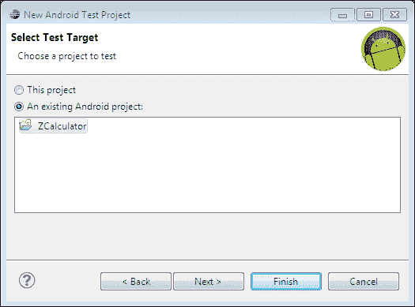

选择一个构建目标，如下截图所示（要定位的 SDK），然后点击**完成**按钮：

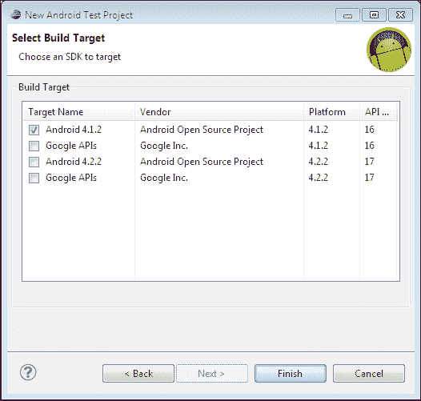

你的测试项目已成功创建。现在我们来创建一个测试用例类以测试 ZCalculator 的主类。

# 创建测试用例

要创建测试用例，请按照列出的步骤操作：

1.  要创建测试用例，请在**包资源管理器**窗口中右键点击`com.calculator.test`包，并导航到**新建** | **JUnit 测试用例**，如下截图所示。如果该包不存在，请在**src**分支下创建它：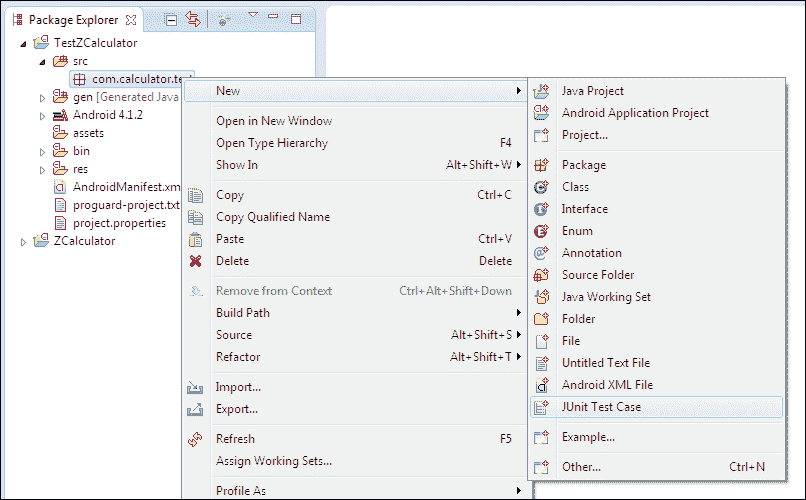

1.  在**新建 JUnit 测试用例**窗口中，大多数字段已自动填充。只需将测试用例的名称指定为`MainTest`，因为我们将要测试 ZCalculator 中的`Main`类。在方法存根部分保持**setUp()**，**tearDown()**和**构造函数**选项复选框被选中，然后点击**完成**按钮。

    ### 注意

    `setUp()`和`tearDown()`方法属于`junit.framework.TestCase`类的一部分。`setUp()`方法用于初始化运行测试所需的数据并重置环境变量。`tearDown()`方法用于调用垃圾回收以强制恢复内存。它在每个`@Test`方法之后调用，如下代码所示：

    ```kt
    Call @Before setUp
    Call @Test method test1
    Call @After tearDown
    Call @Before setUp
    Call @Test method test2
    Call @After tearDown
    ```

    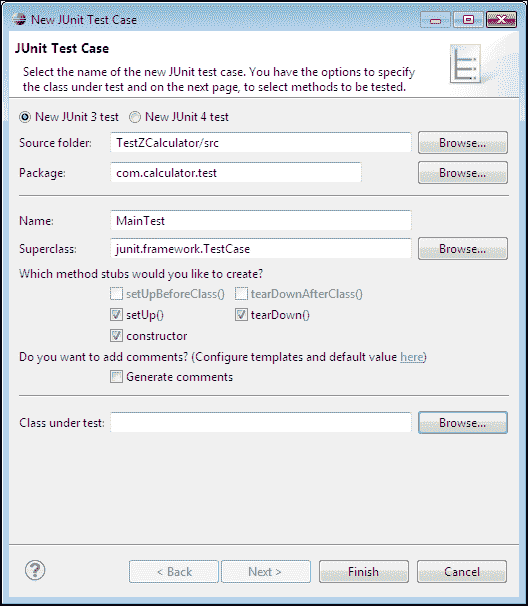

1.  完成后，将在`com.calculator.test`包下创建一个测试用例`MainTest.java`，如下截图所示。同时，在`MainTest`类中会自动生成三个存根方法：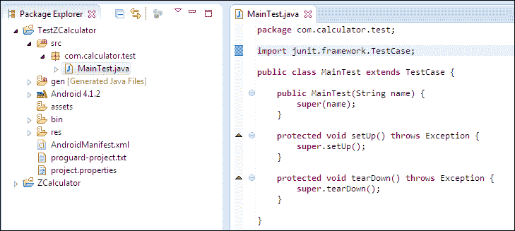

# 添加 Robotium 库

所有版本的 Robotium JAR 文件都可以从[`code.google.com/p/robotium/downloads/list`](https://code.google.com/p/robotium/downloads/list)下载。

可以按照列出的步骤添加 Robotium 库：

1.  你需要将 Robotium JAR 作为引用库添加到测试项目中。要引用它，请右键点击你的项目，并导航到**构建路径** | **配置构建路径**，如下截图所示：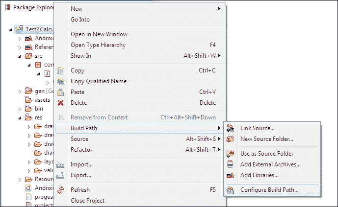

1.  在**Java 构建路径**面板中，转到**库**标签页，并点击如下截图所示的**添加外部 JARs…**按钮。然后，提供一个正确的 Robotium 库（最好是最新版本），并将其添加到列表中。实现这一点的另一种方式是将 JAR 文件复制到测试的`lib`目录中：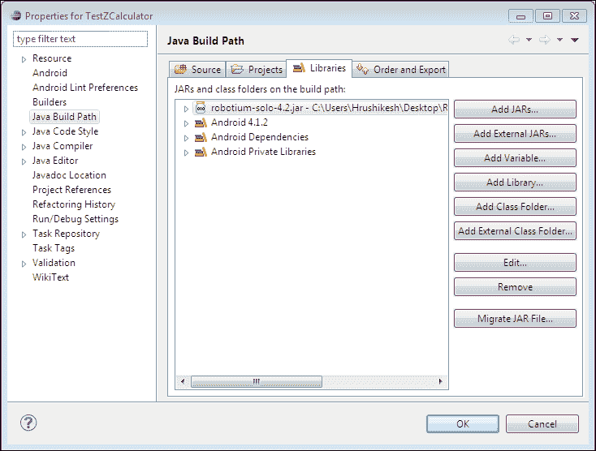

1.  通常在最新的 SDK 版本中（主要是 API 17 及以上版本）会遇到**java.lang.NoClassDefFoundError: com.jayway.android.robotium.solo.Solo**错误，这是因为没有导出 Robotium JAR 文件。因此，要导出它，请转到**Java 构建路径**部分的**顺序和导出**标签，并在列表中选中 Robotium JAR 文件，如下截图所示，然后点击**确定**按钮：

    ### 注意

    确保已选中 Android 私有库，否则测试将无法启动。

    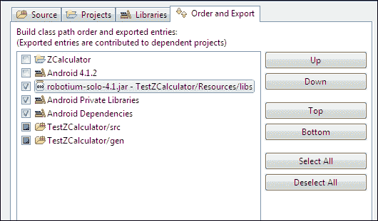

# 在 AndroidManifest.xml 中添加包名

一旦为测试项目提供了 Robotium 库的引用，打开`AndroidManifest.xml`文件，并更改目标包名，如下所示：

```kt
<instrumentation android:targetPackage="com.calculator" android:name="android.test.InstrumentationTestRunner" />
```

下面的截图显示了`AndroidManifest.xml`文件中的上述更改：

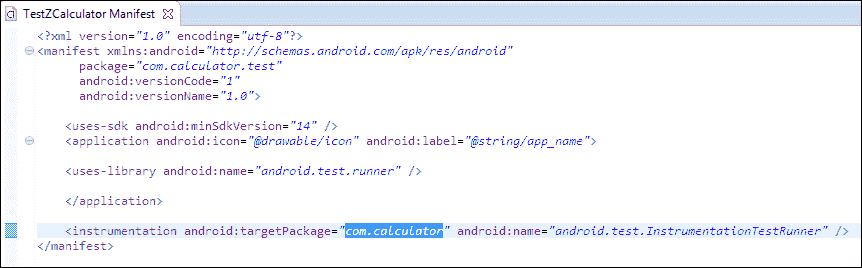

# Robotium 的测试用例代码

在深入实际代码之前，你应该熟悉 Robotium 框架的一些类和方法。

`Solo`是 Robotium 用于测试的类。它使用测试用例的 instrumentation 和第一个要测试的活动进行初始化。这将在`setUp()`方法中执行。`Solo`类提供了易于调用 Android 用户界面组件的 API，例如，`enterText()` API 将文本放入 EditText 视图中。我们将在以下部分看到大多数这些 API。

JUnit 中的测试用例方法名称应以单词"test"开头。由于 Robotium 基于 JUnit 构建，我们为测试用例提供了`testZCalculatorBlackBox()`方法。你可以在一个测试用例类中添加任意数量的测试用例方法。

在以下测试用例中，我们将访问 ZCalculator 的用户界面组件，并按顺序执行以下操作：

1.  访问用于输入（第一个和第二个数字）的**编辑文本**字段。

1.  输入任意值。

1.  访问并点击**Spinner**以选择操作。

1.  访问并点击**获取结果**按钮。

将以下代码放入`MainTest.java`文件并保存：

```kt
package com.zcalculator.test;

import android.test.ActivityInstrumentationTestCase2;
import com.jayway.android.robotium.solo.Solo;
import com.zcalculator.Main;

public class MainTest extends ActivityInstrumentationTestCase2<Main> {
  private Solo	solo;

  public MainTest() {
    super(Main.class);
  }

  @Override
  protected void setUp() throws Exception {
    super.setUp();
    this.solo = new Solo(this.getInstrumentation(), this.getActivity());
  }

  public void testZCalculatorBlackBox() {

    // Enter 5 in first number field
    this.solo.enterText(0, "5");

    // Enter 4 in second number field
    this.solo.enterText(1, "4");

    // Press Addition Spinner Item
    this.solo.pressSpinnerItem(0, 0);

    // Click on get result button
    this.solo.clickOnButton(0);

    // Verify that resultant of 5 + 4
    assertTrue(this.solo.searchText("9"));

    // Press Subtraction Spinner Item
    this.solo.pressSpinnerItem(0, 1);

    // Click on get result button
    this.solo.clickOnButton(0);

    // Verify that resultant of 5 - 4
    assertTrue(this.solo.searchText("1"));
  }
  @Override
  protected void tearDown() throws Exception {
    this.solo.finishOpenedActivities();
  }
}
```

# 运行测试用例

我们现在已经完成了为 ZCalculator 创建带有有效测试用例的测试项目。是时候运行我们的测试用例了。

在测试项目或测试用例文件`MainTest.java`上右键点击，选择**作为 Android JUnit 测试运行**。在选择设备屏幕上选择**Android 模拟器**。

### 注意

如果你想要运行特定的测试用例，请右键点击文件，然后选择**作为 Android JUnit 测试运行**。要运行测试项目中可用的所有测试用例，请右键点击项目本身，然后选择**作为 Android JUnit 测试运行**，它将运行所有测试用例。

Robotium 针对 ZCalculator 的测试用例将按以下方式工作：

1.  ZCalculator 应用程序将被加载。

1.  第一个和第二个数字将自动输入到第一个和第二个**编辑文本**字段中，然后点击下拉菜单选择操作（首先选择加法）。

1.  将点击**获取结果**按钮，并在结果文本视图中显示结果。

1.  断言语句将检查有效的操作结果。这个过程将继续针对减法进行，如果每个断言都为真，则测试用例通过，在 JUnit 标签中用绿色条表示，如下面的屏幕截图所示：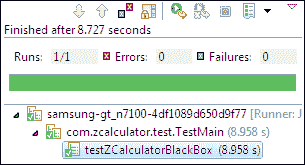

如果你想通过命令行运行测试项目，必须先安装应用程序和仪器。如果它们已经安装好了，那么使用以下命令：

```kt
adb shell am instrument-w com.calculator.test/android.test.InstrumentationTestRunner

```

在运行上述命令之前，请注意，你应该在包含`adb.exe`的目录下运行它，或者将`adb.exe`的路径添加到环境路径变量列表中，以便在系统的任何位置访问它。

你可以在 Android SDK 中的`platform-tools`文件夹里找到`adb`。

# 总结

在本章中，我们学习了如何使用 Robotium 框架创建测试项目。到目前为止，你已经了解了使用 Robotium 创建简单测试应用程序所需的基本流程。现在是深入框架，了解不同的 Robotium API 调用及其使用方法的时候了。在下一章中，你将了解到`Solo`类及其内部 API 的相关信息。
