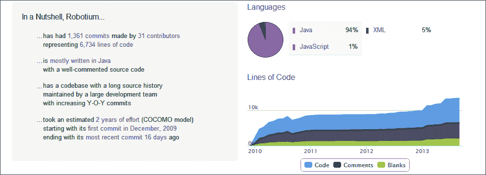
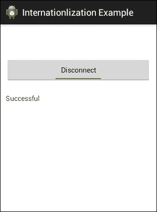
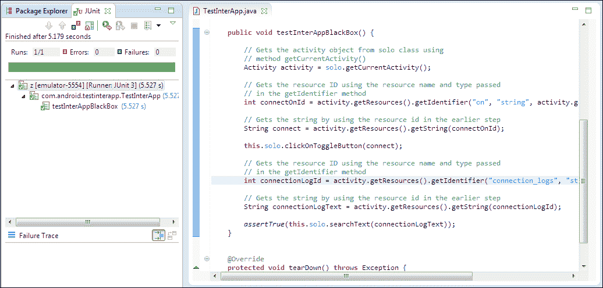

# 第三章：Robotium APIs

本章将向你介绍`Solo`类以及框架中存在的 API 信息。完成这部分后，我们将考虑资源 ID 测试用例，它简要介绍了如何使用 Robotium 实现国际化。

在本章结束时，你将了解到框架中和测试用例评估的大部分 API。

# Solo

`Solo`类是 Robotium 框架提供的一个主要类，它包含了编写项目测试用例的 API。Robotium 可以与 Android 测试类结合使用，例如`ActivityInstrumentationTestCase2`和`SingleLaunchActivityTestCase`。

`Solo`类有两个构造函数：

+   `Solo (android.app.Instrumentation instrumentation)`: 这个构造函数接收 instrumentation 作为参数

+   `Solo(android.app.Instrumentation instrumentation, android.app.Activity activity)`: 这个构造函数接收 instrumentation 和 activity 作为参数

# API 调用

Robotium 框架内部有许多 API，它们涵盖了 Android 中大部分可用的功能。随着用户反馈和建议的增加，方法数量也在增加。如果任何在测试项目中工作的 Robotium 测试用例开发者发现，有些方法（指的是某个特别有用的功能）可以作为 Robotium 框架的一部分添加，那么这将有助于他们在各自的项目中。


Robotium 开发团队会根据优先级分析这些新需求。其中一些会被实施，并作为下一个版本的一部分添加/删除。如果下一个版本中停止支持任何 API，更新你的测试项目 Robotium 库可能会遇到麻烦。

所有这些方法都可以在以下链接中找到：

[`robotium.googlecode.com/svn/doc/com/jayway/android/robotium/solo/Solo.html`](http://robotium.googlecode.com/svn/doc/com/jayway/android/robotium/solo/Solo.html)

[`robotium.googlecode.com/svn/doc/com/jayway/android/robotium/solo/Solo.html`](http://robotium.googlecode.com/svn/doc/com/jayway/android/robotium/solo/Solo.html)

你可以研究 API 集的 Javadoc，也可以浏览在以下链接中可用的源代码

[`github.com/jayway/robotium/tree/master/robotium-solo`](https://github.com/jayway/robotium/tree/master/robotium-solo)

下图展示了 Robotium 的简要信息，包括总的提交数、代码行数、项目模型和技术栈：



来自 ohloh.net 的快照

# Robotium 中的资源 ID

在 Robotium 中，你无需将**被测应用**（**AUT**）的资源导入到测试项目中，就可以使用资源 ID。


你可以不导入资源文件夹就做到这一点。你需要做的是通过向`getIdentifier()`方法传递视图的名称和类型来获取资源 ID，然后将获得的 ID 传递给`getView()`方法以获取相应的视图对象。

```kt
Activity activity = solo.getCurrentActivity();

ImageView imageView = (ImageView) solo.getView(act.getResources().getIdentifier("appicon", "id", act.getPackageName()));
```

它同样适用于字符串参数；例如：

```kt
Solo.getView("com.robotium.R.id.icon");
```

# 理解国际化


你可能想知道国际化是什么。其实，它是将应用程序适应到各种语言或地区的方法。这可能会与本地化的概念混淆，但这两个概念略有不同。本地化意味着将应用程序适应到任何地区或语言，因此使用地区组件并翻译文本。

考虑一个可能有多语言支持的应用程序。如果你想测试这个应用程序，你不能将任何语言的文本硬编码为测试用例的一部分。为了概括这一点，建议你应在`res/values/strings.xml`文件中添加字符串。

让我们通过以下简单示例来看看如何实现国际化测试用例。

应用程序包含一个**Connect**切换按钮，点击后会切换到**Disconnect**按钮。它下面是一个 TextView，显示应用程序生成的所有连接日志。UI 看起来如下截图所示：



一旦点击了连接按钮，**Successful**就会显示在它下方的 TextView 中。

我们可以使用`res/values/string.xml`文件中指定的值来国际化切换按钮中的文本，而不是为切换按钮中的文本添加任何硬编码值，如下所示：

```kt
<ToggleButton
  android:id="@+id/toggleConnection"android:layout_width="fill_parent"android:layout_height="wrap_content"android:layout_marginTop="50dp"android:textOn="@string/on"android:checked="true"android:textOff="@string/off"/>

<TextView
  android:id="@+id/tvConnectionLogs"android:layout_width="fill_parent"android:layout_height="wrap_content"android:maxLines="5"android:test="@string/connection_logs"android:layout_marginTop="120dip"/>
```

`string.xml`文件中指定的值如下：

```kt
  <string name="on">Connect</string>
  <string name="off">Disconnect</string>
  <string name="connection_logs">Successful</string>
```

以下是测试项目`TestInterApp`的代码，该项目有一个名为`testInterAppBlackBox`的测试用例，点击**Connect**按钮并将其切换到**Disconnect**按钮。然后它在切换按钮下方的连接日志 TextView 中搜索**Successful**文本。

```kt
package com.android.testinterapp;

import android.app.Activity;
import android.test.ActivityInstrumentationTestCase2;

import com.android.interapp.MainActivity;
import com.jayway.android.robotium.solo.Solo;

public class TestInterApp extends ActivityInstrumentationTestCase2<MainActivity> {
  private Solo  solo;

  public TestInterApp() {
    super(MainActivity.class);
  }

  @Override
  protected void setUp() throws Exception {
    super.setUp();
    this.solo = new Solo(this.getInstrumentation(), this.getActivity());
  }

  public void testInterAppBlackBox() {

    // Gets the activity object from solo class using
    // method getCurrentActivity()
    Activity activity = solo.getCurrentActivity();

    // Gets the resource ID using the resource name and type passed
    // in the getIdentifier method
    int connectOnId = activity.getResources().getIdentifier("on", "string", activity.getPackageName());

    // Gets the string by using the resource id in the earlier step
    String connect = activity.getResources().getString(connectOnId);

    this.solo.clickOnToggleButton(connect);

    // Similarly for the text view field, get the resource ID using the resource name and type passed in the getIdentifier method
    int connectionLogId = activity.getResources().getIdentifier("connection_logs", "string", activity.getPackageName());

    // Gets the string by using the resource id in the earlier step
    String connectionLogText = activity.getResources().getString(connectionLogId);

    assertTrue(this.solo.searchText(connectionLogText));

  }

  @Override
  protected void tearDown() throws Exception {
    this.solo.finishOpenedActivities();
  }
}
```

以下截图显示了在 Junit 控制台中测试用例的结果：



测试用例及结果

由于国际化的影响，如果任何用户希望按地区更改语言，则无需修改 Robotium 测试用例。只需在`string.xml`文件中的地区语言内部更改变量值，测试用例将为所有地区和语言工作。

# 总结

在本章中，我们已经看到了大多数 Robotium API 调用及其描述，以及如何在 Robotium 中使用国际化。在下一章中，你将学习如何使用 Robotium 访问 Android 应用程序中 web 视图的不同 web 元素。
