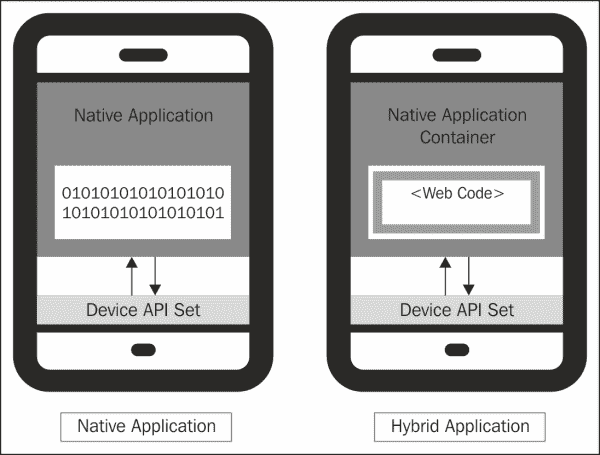
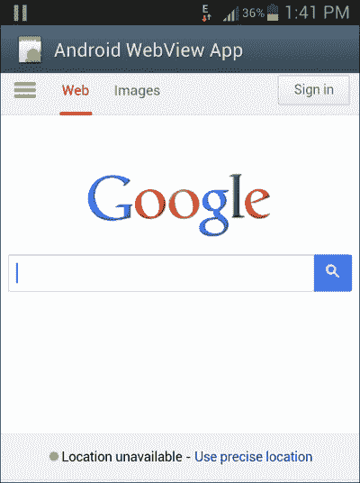
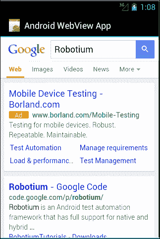
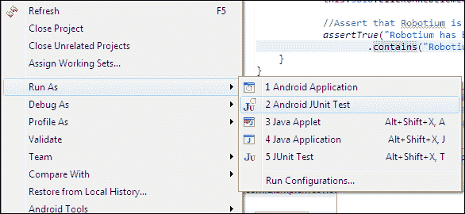
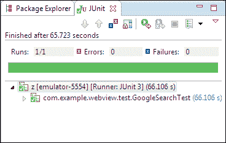

# 第四章：Robotium 中的 Web 支持

本章将简要介绍如何使用 Robotium 的 Web 支持在 Android 中访问 WebElements。我们将在本章的前部分看到这些方法，并继续一个简单的测试混合应用程序的示例。

# API 集

自 Robotium 4.0 发布以来，Robotium 框架已添加 Web 支持。Robotium 完全支持混合应用程序。本地应用程序和混合应用程序之间存在一些关键差异。让我们逐一了解它们：

| 本地应用程序 | 混合应用程序 |
| --- | --- |
| 平台相关 | 跨平台 |
| 在设备的内部软件和硬件上运行 | 使用 HTML5 和 JavaScript 构建，并封装在一个薄本地容器中，提供对本地平台功能的访问 |
| 需要更多开发人员在不同的平台上构建应用程序，学习时间更长 | 节省开发成本和时间 |
| 优秀的性能 | 较低的性能 |

本地和混合应用程序如下所示：



让我们看看 Robotium 中一些支持访问 Web 内容的方法。它们如下：

+   `searchText (String text)`

+   `scrollUp/Down()`

+   `clickOnText (String text)`

+   `takeScreenshot()`

+   `waitForText (String text)`

在专门为 Web 支持添加的方法中，`By`类被用作参数。它是一个抽象类，与 Web 方法结合使用。这些方法用于根据属性（如 ID 和名称）选择不同的 WebElements。

在 web 视图中使用的元素称为 WebElement。它与 Selenium 中实现的 WebDriver 相似。以下表格列出了`By`类中的所有方法：

| 方法 | 描述 |
| --- | --- |
| `className (String className)` | 通过其类名选择 WebElement |
| `cssSelector (String selectors)` | 通过其 CSS 选择器选择 WebElement |
| `getValue()` | 返回值 |
| `id (String id)` | 通过其 id 选择 WebElement |
| `name (String name)` | 通过其名称选择 WebElement |
| `tagName (String tagName)` | 通过其标签名选择 WebElement |
| `textContent (String textContent)` | 通过其文本内容选择 WebElement |
| `xpath (String xpath)` | 通过其 xpath 选择 WebElement |

Robotium 框架中一些重要的方法，旨在与 Android 应用程序中的 Web 内容直接通信，如下所示：

+   `clickOnWebElement(By by)`: 点击匹配指定`By`类对象的 WebElement。

+   `waitForWebElement(By by)`: 等待匹配指定`By`类对象的 WebElement。

+   `getWebElement(By by, int index)`: 返回匹配指定`By`类对象和索引的 WebElement。

+   `enterTextInWebElement(By by, String text)`: 该方法用于在匹配指定`By`类对象的 WebElement 中输入文本。

+   `typeTextInWebElement(By by)`: 它在匹配指定 `By` 类对象的 WebElement 中输入文本。在此方法中，程序实际上通过键盘逐个字母输入文本，而 `enterTextInWebElement` 直接在特定位置输入文本。

+   `clearTextInWebElement(By by)`: 它清除与指定 `By` 类对象匹配的 WebElement 中的文本。

+   `getCurrentWebElements(By by)`: 它返回与指定的 `By` 类对象匹配的、在活动 web 视图中显示的 WebElements 的 `ArrayList`。

在实际查看混合测试示例之前，让我们获取更多关于 `WebViews` 的信息。

您可以使用以下方式通过 `Solo` 类获取 `WebView` 的实例：

```kt
WebView wb = solo.getCurrentViews(WebView.class).get(0);
```

现在您控制了 `WebView`，可以如下注入您的 JavaScript 代码：

```kt
Wb.loadUrl("<JavaScript>");
```

这非常强大，因为我们可以调用当前页面上的每个函数；因此，它有助于自动化。

# 混合测试示例

让我们看看一个混合应用程序，即被测应用程序，并创建一个简单的测试项目来测试这个应用程序。

该应用程序在其布局中提供了一个 `WebView` 控件，并在其中加载了谷歌主页（如下面的截图所示）。在编写测试用例之前，您可以查看应用程序的源代码：



`WebViewActivity.java` 文件的源代码如下：

```kt
public class WebViewActivity extends Activity {

  @Override
  public void onCreate(Bundle savedInstanceState) {
    super.onCreate(savedInstanceState);
    setContentView(R.layout.web_main);

    WebView webView = (WebView) findViewById(R.id.mainWebView);

    WebSettings webSettings = webView.getSettings();
    webSettings.setJavaScriptEnabled(true);

    webView.setWebViewClient(new CustomWebViewClient());
    webView.setScrollBarStyle(View.SCROLLBARS_INSIDE_OVERLAY);

    webView.loadUrl("http://www.google.co.in");
  }

  private class CustomWebViewClient extends WebViewClient {
    @Override
    public boolean shouldOverrideUrlLoading(WebView view, String url)     {
      view.loadUrl(url);
      return true;
    }
  }
}
```

在您的 `web_main.xml` 布局文件中添加以下代码：

```kt
<WebView android:layout_width="match_parent" android:layout_height="match_parent" android:id="@+id/mainWebView">
</WebView>
```

如果您在 `AndroidManifest.xml` 中没有指定任何权限，请提供以下权限：

```kt
<uses-permission android:name="android.permission.INTERNET" />
```

这将使用 `WebView` 设置您的应用程序。现在，让我们编写一个测试用例，访问谷歌主页的一些 WebElements ，`WebView`，并提供结果。

在您的混合测试项目中使用以下代码作为谷歌搜索测试用例：

```kt
  // A test that searches for Robotium and asserts 
  // that Robotium is found.

public void testSearchRobotium()
{

  // Since Google's search form input box statement utilizes
  // a "q" in the name="q" parameter
  final By inputSearch = By.name("q");

  // Google search button utilizes "tsbb" in 
  // the id="tsbb" parameter
  final By buttonSearch = By.id("tsbb");

  // Wait for a WebElement without scrolling.
  this.solo.waitForWebElement(inputSearch);

  // Types Robotium in the search input field.
  this.solo.typeTextInWebElement(inputSearch, "Robotium");

  //Assert that Robotium is entered in the input field.
  assertTrue("Robotium has not been typed", solo.getWebElement(inputSearch, 0).getText().contains("Robotium"));

  // Clicks on the search button 
  this.solo.clickOnWebElement(buttonSearch);

  // Waits for the results page for Robotium
  solo.waitForText("Results");

  // Takes the screenshot of the current active screen
  solo.takeScreenshot();

}
```

上述代码在谷歌搜索框中输入文本 `Robotium` 并点击搜索按钮。它断言输入搜索栏中是否找不到单词 `Robotium`。如果存在，程序将点击搜索按钮并显示结果页面。

然后它等待测试结果，并如下截图：



该截图通过 API 保存在 `/sdcard/Robotium-Screenshots/` 目录中。它需要被测应用程序的 `AndroidManifest.xml` 文件中的写入权限 (`android.permission.WRITE_EXTERNAL_STORAGE`)。

这个结果可以在 JUnit 视图中查看。当测试项目作为 Android JUnit 测试执行时，会自动启动此视图。您可以查看以下截图以了解运行测试项目的流程。

右键点击测试项目，选择 **运行方式** 然后点击 **2 Android JUnit 测试**：



`testSearchRobotium` 测试用例已通过，如下面的截图所示，由绿色条指示。完成测试大约需要 66.1062 秒：



# 概括

在本章中，我们学习了如何测试混合应用程序以及访问 WebElement 的不同 API。借助 Robotium 对 web 视图的支持，我们基本上可以测试移动网页。这种方式，我们模拟了使用原生浏览器打开移动网页的相同条件，因为原生浏览器中的标签包含 WebView。

在下一章中，我们将比较 Robotium 框架与其他测试框架，并了解一些有趣的事实。
