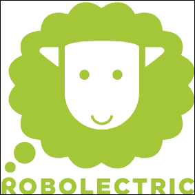

# 第五章：与其他框架的比较

本章节将根据某些参数对 Robotium 与其他测试框架进行比较。这将为你提供一个根据项目需求选择合适框架的方法。在本章中，我们将比较 Robotium 与 MonkeyRunner、Robolectric、UI Automator 和 Calabash 框架。

# MonkeyRunner

**MonkeyRunner** 是一个用于编写可以从 Android 代码外部访问 Android 模拟器/设备的程序的工具。编写 Python 程序来安装 Android 测试应用并向应用发送按键。该程序获取 Android UI 的截图并将其发送到工作站以存储。

MonkeyRunner 是一个 API，不是一个程序。它使用 **Jython**（Python 的一种实现）, 该实现使用 Java 编程语言。

由于 MonkeyRunner 是 Python 的一个模块，你可以执行任何 Python 支持的操作。你需要做的就是创建一个 Python 程序，加入 MonkeyRunner，就完成了！

让我们看看下表中 Robotium 与 MonkeyRunner 的区别：

| 功能 | Robotium | MonkeyRunner |
| --- | --- | --- |
| 对象选择 | 对象选择基于诸如索引、文本/名称、图像和 ID 等属性。 | 对象选择基于其位置（x, y 坐标），当应用程序发展时可能会改变。很可能无法使用触摸事件，因为未提供确切位置。 |
| 动作 | 它只能在测试应用上执行动作。 | 它可以在整个设备上点击，即所有应用都可以。 |
| 断言 | 基于 JUnit。断言（验证）时会显示红/绿条。 | 基于截图的验证。 |
| 语言 | Java。 | Python 脚本。 |
| 安装 | Robotium JAR 可以导入 Eclipse 插件内，并将测试用例作为`.apk`文件执行。 | 要使用 MonkeyRunner，请运行 `<android sdk>/tools/` 中的 `monkeyrunner` 工具，并将要作为测试用例使用的文件名传递。它不会在模拟器/设备内安装任何程序。 |

这两个框架有一些共同点。它们可以在模拟器/设备上运行，并通过从工作站发送特定命令和事件来控制设备/模拟器。

在 Android 测试领域，针对不同的需求有各种不同的框架。由于 Robotium 主要用于 UI 测试，因此它不支持 MonkeyRunner 以下的一些功能：

+   可扩展自动化

+   多应用和设备控制

# Robolectric

**Robolectric** 是一个测试框架，它模拟了 Android 框架的一部分，并允许在 JUnit 4 框架的帮助下直接在**Java 虚拟机**（**JVM**）上运行测试用例。关于 Robolectric 最重要的是，它不需要模拟器/设备。

Robolectric 包含浅层的 Android 对象，这些对象的行为类似于 Android SDK 中存在的对象。

让我们通过下表了解 Robotium 和 Robolectric 之间的区别：

| 功能 | Robotium | Robolectric |
| --- | --- | --- |
| 模拟器/设备 | Robotium 需要模拟器或设备来执行测试。 | Robolectric 不需要任何模拟器/设备来执行测试。这就是它比 Robotium 快得多的原因。 |
| 构建服务器 | 它需要在构建服务器上有一个模拟器或设备来运行测试用例；否则，测试项目无法添加到构建过程中。 | 它可以轻松地在构建服务器上配置。 |
| 测试驱动开发 | 它用于在实际的 Android 设备上测试，以及测试 Robolectric 无法模拟的 API 边缘情况。 | 它比 Robotium 更能加快测试驱动开发周期的速度。 |
| 测试工具 | 它使用 JUnit 3 的仪器化测试。 | 它使用 JUnit 4 的非仪器化测试。 |

# UI Automator

UI Automator 是一个 Java 库，用于创建针对 Android 应用程序的自定义 UI 测试用例，并提供一个执行引擎来自动化和运行测试用例。

让我们通过下表了解 Robotium 和 UI Automator 之间的区别：

| 功能 | Robotium | UI Automator |
| --- | --- | --- |
| 跨应用包 | Robotium 无法跨越应用包边界。 | UI Automator 可以跨越应用包边界。例如，如果你的应用打开图库并点击任何相册，这可以通过使用 UI Automator 实现。图库是另一个应用包，而在图库内部点击相册是跨应用的操作。 |
| API 集合 | Robotium 拥有庞大的 API 集合，包含点击视图、获取视图等方法。因此，Robotium 比 UI Automator 提供了更多的测试控制。 | UI Automator 包含点击和获取视图的方法，但对这些视图的访问实现不同。 |
| API 级别支持 | Robotium 支持 API 级别 4 及以上。 | UI Automator 仅支持 API 级别 16（或更高）的设备，并且不支持更旧的 API 级别，因此不具备向后兼容性。 |
| 集成开发环境 | Robotium 与 Eclipse IDE 平滑集成。 | UI Automator 与 IDE 的集成比较繁琐，因为你需要手动添加 JUnit 库与`Android.jar`和`uiautomator.jar`，并使用 Ant 构建。 |
| 网页支持 | Robotium 完全支持应用程序中的 Web 元素。 | UI Automator 缺少这一功能。 |

# Calabash

Calabash 是一个跨平台工具，可让你为移动应用程序编写自动化功能验收测试，支持 Android 和 iOS 原生应用。

让我们通过下表了解 Robotium 和 Calabash 之间的区别：

| 功能 | Robotium | Calabash |
| --- | --- | --- |
| 编程语言 | Robotium 的测试用例用 Java 编写 | 你不需要用 Java 编写测试，可以使用更灵活的**Ruby**语言，这更适合 |
| 控制方式 | Robotium 测试需要从设备上进行控制 | Calabash 测试可以从计算机而非设备上进行控制 |
| 旋转功能 | Robotium 可以将设备方向设置为横屏或竖屏 | Calabash-Android 不能模拟手机旋转到横屏或竖屏 |

那么，哪个更好？Robotium 还是 Calabash？我认为两者都不错。它们仍在不断改进，并且会有更多版本发布。

当以上两种方法都无法满足你的需求时，你总是可以使用`android.test.ActivityInstrumentationTestCase2`类。

如我们所讨论的，每个框架都有其优缺点，并适用于自动化测试人员的不同需求。从前面的比较中我们可以看出，Robotium 和 Calabash 相当受欢迎，并且在自动化 UI 测试中一路领先。

# 总结

在本章中，我们根据不同的因素将 Robotium 与不同的测试框架进行了比较，并得出结论：所有框架都是根据不同的需求来使用的。没有完美的框架，总会有一些优缺点与之相关联。

在下一章中，我们将探讨 Robotium 中的远程控制功能及其使用方法。
