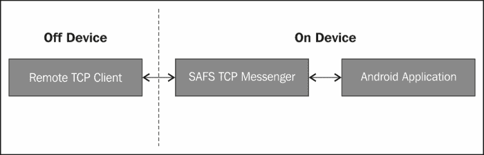

# 第六章：Robotium 中的远程控制

本章将向您介绍软件自动化框架支持以及 Android 中远程控制的工作原理。它有助于测试 Android 设备与远程客户端通过 TCP 信使服务的连接。在本章结束时，您将了解远程控制与没有互联网权限的测试 APK 结合使用的内部机制，以及它如何通过 Android 套接字服务连接到远程客户端。

# 软件自动化框架支持

**软件自动化框架支持（SAFS）**的主要功能是，将 Robotium 完全集成到 Android 测试中，并与大量使用不同技术的用户一起使用 SAFS。

在 Android 中，不支持套接字、UDP 和 RMI。因此，如果 AUT 没有以下权限，测试应用程序不应具有访问 TCP 套接字的权限：

```kt
<uses-permission android:name="android.permission.INTERNET"/>
```

引入远程控制的原因是，在 Android 中有一个使用套接字服务的通用方法，这种方法完全独立于测试应用程序和 AUT。

让我们看看使用 SAFS 的远程控制是如何工作的。

# Android 远程控制的工作原理


Android 远程控制的工作原理可以通过以下步骤来定义：

1.  用户在设备/模拟器上安装套接字服务。这个套接字服务拥有完全的互联网权限。远程进程使用 TCP 消息交换协议发送/接收命令，并与已安装的套接字服务共享结果。

1.  为 AUT 编写的测试应用程序包含用于绑定到此套接字服务的代码。这个测试应用程序不需要任何互联网权限，可以依赖套接字服务提供数据结果。

    TCP 信使服务（套接字服务）充当远程测试控制器（Windows、Linux、Mac 等）与通过 TCP 套接字通信的 Android 测试包之间的中介。它期望进行双向通信，以接收命令和返回测试数据/结果。由于这项服务，没有互联网权限的测试包可以通过 TCP 套接字进行控制。

1.  测试应用程序从套接字服务接收命令，执行测试，并返回测试控制器所需的数据和状态。

被测试的应用不应当在测试应用中硬编码。通过更新 `AndroidManifest.xml` 文件中的 `android:targetPackage` 属性，可以轻松地实现自动化，而无需开发者/测试者的代码。因此，在预测试运行时，可以提取目标 APK 的信息，并使用更新后的 `AndroidManifest.xml` 文件为目标包重新打包其他未修改的测试应用 APK。在运行时，测试 APK 可以通过 `PackageManager`、`PackageInfo` 和 `ApplicationInfo` 调用来识别目标包和要启动的初始活动。

Robotium 远程控制帮助测试用例从 JVM 执行，这使得 Robotium 能够与 JUnit 4 等 JVM 框架一起工作。对于远程控制，另一个 `Solo` 类位于 `com.jayway.android.robotium.remotecontrol.solo`。它为嵌入的传统 Robotium `Solo` 类提供远程控制 API。

由于远程控制 `Solo` 类在设备/模拟器外部运行，即在 JUnit 测试的上下文中，它无法访问 **被测应用**（**AUT**）的对象。它在测试失败时不会中止或停止。你可以通过以下来源查看为其提供的方法和信息：

[`safsdev.sourceforge.net/doc/com/jayway/android/robotium/remotecontrol/solo/Solo.html`](http://safsdev.sourceforge.net/doc/com/jayway/android/robotium/remotecontrol/solo/Solo.html)

它使用 Android 的 TCP Messenger 服务。你可以从以下 URL 下载用于 Robotium 安卓测试的 Robotium 远程控制版本：

[`sourceforge.net/projects/safsdev/files/RobotiumRemoteControl/`](http://sourceforge.net/projects/safsdev/files/RobotiumRemoteControl/)

你可以从以下 URL 获取最新的 SAFS 下载：

[`sourceforge.net/projects/safsdev/files/latest/download`](http://sourceforge.net/projects/safsdev/files/latest/download)

下载 Robotium 远程控制后，你会发现已经安装了 `SoloRemoteControl` 项目。它应该作为你自己的 Java 开发项目的参考。`SoloRemoteControl` 项目中的 `src` 文件夹包含了 `robotium-remotecontrol.jar` 文件中的所有源代码。

# 使用 SAFS 的 Robotium 远程控制

SAFS 测试没有作为 JUnit 测试进行封装，Robotium 的 SAFS 远程控制使用了一种非基于 JUnit 的实现。此外，在远程控制测试端没有技术要求使用 JUnit。

可以使用 SDK 工具实现目标应用的自动化测试设置和部署。这些工具作为测试运行时的一部分，例如 adb 和 aapt。现有的打包工具可以用来使用替代的 `AndroidManifest.xml` 文件重新打包编译后的 Robotium 测试，从而在运行时更改目标应用。

SAFS 是一个通用、数据驱动的框架。用户唯一需要提供的是目标包名称或 APK 路径参数。测试将自动提取和重新部署修改后的包，然后启动实际的测试。

传统的 JUnit/Robotium 用户可能没有，或认为不需要这种通用性质，但这很可能是由于之前的 Android 测试必须是 JUnit 测试。测试需要针对一个特定的应用。远程控制应用是特定于应用程序的。这就是为什么在设备中安装了远程控制的测试应用不再需要是一个应用。

Robotium 中的远程控制意味着对于任何给定的测试，都需要构建两个测试应用。它们如下：

+   传统设备上的 Robotium/JUnit 测试应用

+   远程控制应用

这两个构建项目具有完全不同的依赖项和构建脚本。

设备上的测试应用具有传统的 Robotium/Android/JUnit 依赖项和构建脚本，而远程控制应用只依赖于 TCP 套接字进行通信和 Robotium 远程控制 API。

远程控制的 Robotium 实现可以在以下两个部分完成：

+   **在设备上**：当 Robotium 的`Solo`类对象要用于**RobotiumTestRunner**（**RTR**）时，`ActivityInstrumentationTestCase2.setup()`会被初始化。RTR 有一个远程控制监听器，并将远程控制调用和数据路由到适当的`Solo`类方法，并根据需要将任何结果返回给远程控制器。在设备上的实现如果需要，可以利用测试结果断言。

+   **远程控制器**：`RemoteSolo` API 复制了传统的`Solo` API，但它的实现主要是通过远程控制将数据推送到 RTR，然后从远程控制器接收结果。远程控制的实现可以利用多种选项来断言、处理或以其他方式报告或跟踪每次调用的测试结果。

    如你所见，远程控制端只要求有一个`RemoteSolo` API，不需要任何特定的 JUnit 上下文。如果测试人员希望这样做，它可以被包装在 JUnit 上下文中，但并不需要在 JUnit 上下文中。

以下是 Robotium 远程控制的示例代码和安装方法链接：

[`code.google.com/p/robotium/wiki/RemoteControl`](http://code.google.com/p/robotium/wiki/RemoteControl)

# 概述

在本章中，你了解了 SAFS 框架及其在 Robotium 中的使用，以实现 Robotium 远程控制。在下一章中，你将了解到 Robotium 实用工具。
