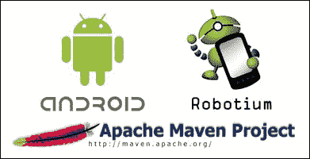

# 第八章：使用 Maven 的 Robotium

本章节介绍如何使用 Maven 工具将 Android 项目加入到构建过程中。同时，本章也解释了使用 Maven 配合 Robotium 所需的不同配置和安装步骤。

# 使用 Maven 自动化构建的 Android 应用



Maven 本质上是一个基于**项目对象模型**（**POM**）概念的项目管理工具，它需要在项目根目录中，并帮助构建项目。

它可以从一个中心信息管理项目的构建、报告和文档。

## Maven 特性

Maven 的主要目标是让开发者能够在最短时间内理解开发工作的完整状态。为了达到这个目标，Maven 尝试处理以下几个关注领域：

| 特性 | 描述 |
| --- | --- |
| 可重复构建 | 你可以在构建服务器上反复构建项目 |
| 关注自动化 | Maven 让你形成在软件开发中自动化流程的正确心态 |
| 依赖管理 | Maven 将解决并管理你的依赖关系 |
| 标准化 | 理解 Maven 的新开发者将立即知道如何构建、发布、测试，从而减少很多学习负担 |
| 插件 | 有很多插件可用于执行不同的任务。这些通过在 `pom.xml` 文件中添加引用来进行配置 |
| 测试 | 这使你能够将运行测试和集成测试作为项目生命周期的一部分 |

为了在 Android 上使用 Maven，你必须为现有的 Eclipse 项目使用**Android Maven 插件**。你可以从前面提到的图中链接下载 Maven。

Android Maven 插件的首页位于以下网站：

[`code.google.com/p/maven-android-plugin/`](https://code.google.com/p/maven-android-plugin/)

## 设置 Android SDK 和 ADT

你可以使用 Android SDK 工具提供的命令行工具来创建/构建一个 Android 项目。ADT 为 Eclipse 提供相同的功能。你也可以通过 Eclipse 导出向导手动导出 Android 应用程序。目前，Apache Ant 主要被 Android SDK 提供的工具用来构建和部署应用程序。


新的基于 Gradle 的 Android 应用构建系统比旧的基于 Eclipse、Ant 和 Maven 的应用程序有了巨大的改进。它有一个简单的声明式语法，使得构建应用的不同版本（例如，测试版与生产版）变得非常简单。Gradle 也是新的 Android Studio IDE 的默认构建系统，因此有很多理由将你的应用迁移到 Gradle。

Android Studio 将基于 Gradle。在 Android Studio 中，将不再有 ADT，因为它将内置 Android 实用工具。Gradle 在内部使用 Maven 仓库来管理依赖关系，这最终使得支持 Maven 变得相当容易。

## 为 Android Tools 设置环境 PATH。

当您想在 Eclipse 外部构建 Android 项目时，大多数情况下需要使用命令行或 shell。为了实现这一点，您需要确保 Android SDK 的`tools`和`platform-tools`文件夹是 PATH 环境变量的一部分。为此，请按照以下步骤操作：

1.  将环境变量`ANDROID_HOME`设置为您的 Android SDK 的路径。

    Windows 用户：

    +   从桌面右键点击**我的电脑**，然后点击**属性**。

    +   点击左侧列中的**高级系统设置**链接。

    +   在**系统属性**窗口中，点击**环境变量**按钮，并添加名为`ANDROID_HOME`的新变量。

    Unix 系统用户：

    +   导出 `ANDROID_HOME=/path/to/android/sdk`

1.  同时，将`$ANDROID_HOME/tools`和`$ANDROID_HOME/platform-tools`添加到`$PATH`中（对于 Windows，将`%ANDROID_HOME%\tools`和`%ANDROID_HOME%\platform-tools`添加到`%PATH%`）。

1.  所有 MacOS 用户请注意，为了使路径在命令行和由`launchd`启动的 IDE 中生效，您需要在`/etc/launchd.conf`中设置它。

# 使用 Maven 构建 Android 测试。

创建一个名为`com.android.build.maven`的 Android 项目。在本节中，让我们集中精力使用 Maven 为您的 Android 测试应用程序创建一个构建。添加正确的`pom.xml`文件，如下所示的项目目录，并提供命令给 Maven 来构建、安装和运行您的应用程序。

以下是`pom.xml`文件的代码：

```kt
<?xml version="1.0" encoding="UTF-8"?>
<project  
xsi:schemaLocation="http://maven.apache.org/POM/4.0.0 http://maven.apache.org/maven-v4_0_0.xsd">
…
…
…
</project>
```

您可以参考`pom.xml`文件在`chapter8_code1`中的完整源代码。

前面的`pom.xml`文件与主项目中的`pom.xml`文件非常相似，但它有几个依赖项。

对于`apk`的依赖是为了让 Android Maven 插件能够找到它将在设备/模拟器上运行的测试的`apk`。对 JAR 文件的依赖是为了让编译器能够从主项目中找到您的 Java 类。为此，您使用了提供的范围，这样类实际上不会包含在您的测试项目中。

在`pom.xml`的构建部分提供的 Android Maven 插件现在将在`mvn install`时使用仪器自动运行测试，就像 Eclipse 一样。它使用了相同的底层工具。

当您只连接了一个模拟器/设备时，自动执行将起作用。如果您有多个设备/模拟器在运行，您需要使用以下命令行选项之一来指定要使用的设备：

+   `-Dandroid.device=usb`

+   `-Dandroid.device=emulator`

+   `-Dandroid.device=specificdeviceid`

您还可以使用此命令行选项禁用仪器测试：

+   `-Dandroid.enableIntegrationTest=false`

可以在`pom.xml`中设置默认属性，如下所示：

```kt
<project>
  …
  <properties>
    <android.device>emulator</android.device>
  </properties>
  …
</project>
```

使用 Maven 构建你的应用程序，并通过以下命令将其部署到设备/模拟器：

```kt
mvn install android:deploy

```

使用 Maven，你还可以自动启动和停止 Android 虚拟设备。应用程序可以通过以下 Maven 命令启动：

```kt
mvn3 android:run

```

### 注意

我们需要处于项目目录中，该目录包含`pom.xml`文件。

# 总结

在本章中，你学习了如何将 Maven 与 Android 和 Robotium 测试结合使用，以及不同的 Maven 命令与 Android 应用程序交互，也就是测试应用程序。

你觉得怎么样？准备好为你的 Android 项目创建和自动化测试用例了吗？我敢打赌你已经准备好了！开始吧，享受使用 Robotium 进行 Android 的自动化测试，并且别忘了和社区分享你的经验！

加入[`groups.google.com/forum/#!forum/robotium-developers`](https://groups.google.com/forum/#!forum/robotium-developers)的论坛，成为令人惊叹的 Robotium 开发者社区的一部分。我们在这里等你！

感谢阅读本书并支持开源技术。期待不久的将来再次见到你！
