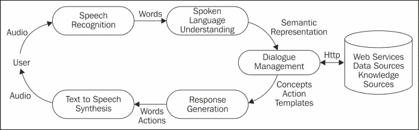

# 第一章：安卓设备上的语音

你是否想过创建可以在你自己的安卓设备上运行的语音应用；可以与你对话并对你回应的应用？本章介绍了如何使用谷歌的开源 API 在安卓设备上进行文本语音合成和语音识别。在简要概述了**语音用户界面**（**VUIs**）的世界之后，本章概述了交互式语音应用（或虚拟个人助手）的组成部分。

到本章结束时，你应该对使用谷歌免费提供的资源创建基于语音的应用所需的条件有一个很好的了解。

# 在安卓设备上使用语音

安卓设备提供了内置的语音识别和文本语音转换功能。以下是一些基于语音的安卓应用实例：

## 语音识别

通过语音识别，安卓设备用户可以在需要文本输入的任何文本框中进行语音输入，例如电子邮件、短信和搜索。键盘控制包含一个带有麦克风符号的按钮和两个表示语言输入设置的字母，用户可以更改这些设置。按下麦克风按钮后，会弹出一个窗口提示用户**现在说话**。用户的口语输入会自动转录成文字。然后用户可以决定如何处理转录的文本。

由于一方面使用了大规模的基于云计算的语音识别资源，另一方面设备通常紧靠用户嘴边以获得更可靠的声学信号，小型设备上的语音听写准确率已显著提高。语音听写的主要挑战之一是输入不可预测——用户可以说字面上的任何内容——因此需要一个大的通用词汇表来覆盖所有可能的输入。其他挑战包括处理背景噪音、含糊的发音和不熟悉的口音。

## 文本语音转换

文本语音转换（TTS）用于将文本转换为语音。各种应用可以利用 TTS。例如，通过辅助功能选项可用的 TalkBack，使用 TTS 帮助盲人和视力受损的用户描述被触摸、选择和激活的项。TalkBack 还可以用于在 Google Play Books 应用中阅读书籍。TTS 功能在 Android Kindle 以及谷歌地图上提供逐步驾驶指令时也可用。还有大量第三方应用使用 TTS，也有可用的替代 TTS 引擎。

## 语音搜索

语音搜索在安卓设备上提供与传统的谷歌搜索相同的功能，不同之处在于用户不是输入查询，而是说出查询。用户可以通过谷歌搜索小部件中的麦克风使用语音搜索。在语音搜索中，识别的文本被传递给搜索引擎，并以与输入查询相同的方式执行。

语音搜索的一个新功能是，除了返回一系列链接外，还会返回一个对查询的语音回应。例如，对于问题“埃菲尔铁塔有多高？”，应用会回答：“埃菲尔铁塔高 324 米。”还可以使用代词提出后续问题，例如，“它是何时建造的？”。这种附加功能是通过将谷歌的知识图谱——一个被谷歌使用的知识库——与其会话搜索技术相结合，提供更具对话式的交互风格来实现的。

## 安卓语音动作

用户也可以通过谷歌搜索小部件中的麦克风访问安卓语音动作。语音动作允许用户使用语音命令控制他们的设备。语音动作需要匹配特定结构的输入，如下面来自谷歌网页的列表所示：[`www.google.co.uk/intl/en_uk/mobile/voice-actions/`](http://www.google.co.uk/intl/en_uk/mobile/voice-actions/)。注意：带有*的项目是可选的。斜体字是需要说出的词语。

| 语音动作 | 结构 | 示例 |
| --- | --- | --- |
| 发送短信 | 给[收件人][信息]*发送短信 | 给艾莉森·米勒发送短信，内容为“我迟到了。我将在大约 9 点回家” |
| 给商家打电话 | 给[商家名称][位置]*打电话 | 给伦敦的 Soho 比萨店打电话 |
| 查看地图 | [地址/城市]的地图 | 伦敦的地图 |
| 谷歌搜索 | [你的查询] | 日落时分的巨石阵图片 |
| 获取方向 | 导航至[地址/城市/商家名称] | 导航至伦敦的英国博物馆或导航至 24 号磨坊街 |
| 给联系人打电话 | 给[联系人姓名][电话类型]*打电话 | 给艾莉森·米勒家里打电话 |
| 访问网站 | 前往[网站] | 前往维基百科 |

语音动作中的结构允许它们映射到设备上可用的动作。例如，关键词**call**表示电话通话，而关键短语**go to**表示要启动的网站。需要额外的处理来提取动作的参数，如**联系人姓名**和**网站**。

## 虚拟个人助手

最激动人心的基于语音的应用之一是虚拟个人助手（VPA），它像一个私人助手一样执行一系列任务，如查找有关当地餐馆的信息；执行涉及设备上应用程序的命令，例如使用语音设置闹钟或更新日历；以及进行一般性对话。至少有 20 个 VPA 可用于 Android 设备（请参阅本书的网页）尽管最著名的 VPA 是 Siri，自 2011 年起它就已经在 iPhone iOS 上可用。你可以在苹果公司的网站上找到与 Siri 的互动示例，这些示例与 Android VPAs 执行的操作类似 [`www.apple.com/uk/ios/siri/`](http://www.apple.com/uk/ios/siri/)。许多 VPA，包括 Siri，都被赋予了个性，并能够以幽默的方式回应恶搞问题和可疑的输入，从而增加了它们的娱乐价值。可以在[`www.sirifunny.com`](http://www.sirifunny.com)查看示例以及 YouTube 上的众多视频剪辑。

值得一提的是，以下解释的许多技术具有与 VPAs（虚拟个人助手）某些相似的特点：

**对话系统**，在学术研究中有着悠久传统，其基于开发能够以自然语言（最初是文本，但最近更多是语音）与人类交流的系统的愿景。最初系统关注于获取信息，例如航班时间或股票报价。第二代系统允许用户进行某种形式的交易，如银行业务或预订旅行，而较新的系统则致力于故障排除，例如指导用户在设置设备时遇到的困难。实现对话系统使用了各种各样的技术，包括基于规则和统计的对话处理。

**语音用户界面**（**VUIs**），与对话系统相似，但更侧重于商业部署。这类系统通常专注于特定用途，如呼叫路由、电话簿查询和交易对话，例如旅行、酒店、航班、汽车租赁或银行余额查询。许多当前的 VUIs 是使用基于 XML 的 VoiceXML 标记语言设计的。VoiceXML 脚本随后在语音浏览器上解释，该浏览器还提供所需的语音和电话功能。

**聊天机器人**，传统上被用来模拟人类对话。最早的聊天机器人可以追溯到 20 世纪 60 年代，约瑟夫·魏森鲍姆（Joseph Weizenbaum）编写的著名 ELIZA 程序模拟了一位罗杰斯心理治疗师——常常以令人信服的方式。近年来，聊天机器人在教育、信息检索、商业、电子商务以及自动化的客服中心等领域得到了应用。聊天机器人使用复杂的模式匹配算法来匹配用户的输入并检索适当的回应。尽管大多数聊天机器人是基于文本的，但基于语音的聊天机器人正在逐渐出现（详见第八章，*与虚拟个人助手的对话*）。

**具身对话代理**（**ECAs**），是计算机生成的动画角色，结合面部表情、身体姿态、手势和语音，提供一种丰富的通信渠道。通过增强面对面互动的视觉维度，具身对话代理可以显得更加值得信赖和可信，同时也更有趣和娱乐性。具身对话代理已被用于诸如互动语言学习、虚拟培训环境、虚拟现实游戏节目以及互动小说和讲故事系统等应用中。它们越来越多地被用于电子商务和电子银行，以提供友好和有帮助的自动化帮助。例如，在宜家网站上的代理 Anna，请访问[`www.ikea.com/gb/en/`](http://www.ikea.com/gb/en/)。

虚拟个人助手与这些技术不同之处在于，它们允许用户使用语音执行移动设备上许多可用的功能，例如发送短信、查看和更新日历、或设置闹钟。它们还提供了访问网络服务的功能，例如寻找餐厅、跟踪快递、预订航班，或使用诸如知识图谱、Wolfram Alpha 或维基百科等信息服务。由于它们可以访问设备上的上下文信息，如用户的位置、时间和日期、联系人以及日历等，VPA 可以提供与用户位置和偏好相关的餐厅推荐等信息。

# 设计和开发语音应用

语音应用设计与软件设计的一般特性有许多共同之处，但也存在一些独特的方面，特别是对于语音界面——例如，处理语音识别始终不可能达到 100%准确，因此与使用图形用户界面（GUI）输入相比，其可靠性较低。另一个问题是，由于语音是短暂的，特别是在没有视觉显示的设备上，与 GUI 应用相比，对用户的记忆提出了更高的要求。

语音应用的可使用性受到许多因素的影响。为了确定系统的需求，重要的是要进行广泛的使用案例分析，考虑以下问题：应用是否替代或补充现有应用；语音是否适合作为输入/输出的媒介；应用将提供的服务类型；将使用该应用的用户类型；以及应用的通用部署环境。

# 为什么选择谷歌语音？

以下是我们使用谷歌语音的原因：

+   **Android 设备的普及**：“截至 2012 年第三季度，Android 在全球智能手机市场的份额为 75%，总共有 75 亿台设备被激活，每天有 150 万台设备被激活。”（来自[`www.idc.com/getdoc.jsp?containerId=prUS23771812 2013 年 9 月 7 日检索`](http://www.idc.com/getdoc.jsp?containerId=prUS23771812%20Retrieved%2009/07/2013)）。

+   **Android SDK 是开源的**：Android SDK 是开源的，这使得它比其他一些操作系统更容易被开发者和爱好者用于创建应用。任何人都可以使用如 Eclipse 这样的免费开发环境开发自己的应用，并将其上传到 Android 设备上，供个人使用和享受。

+   **谷歌语音 API**：谷歌语音 API 在 Android 设备上免费使用。这意味着对于希望在不投资昂贵的商业可用替代品的情况下尝试语音的开发者来说，语音 API 非常有用。由于谷歌雇佣了许多顶尖的语音科学家，他们的语音 API 在性能上可以与商业提供的相媲美。

### 提示

**你也可以尝试…**

Nuance NDEV Mobile 支持多种语言的文本语音合成和语音识别，并提供 PhoneGap 插件，使开发人员能够在不同的平台上实现他们的应用（[`dragonmobile.nuancemobiledeveloper.com`](http://dragonmobile.nuancemobiledeveloper.com)）。

[AT&T 语音混合应用](http://www.research.att.com/projects/SpeechMashup/)支持基于语音的应用开发，并使用 W3C 标准的语音识别语法。

# 构建虚拟个人助理需要什么？

下图展示了构建一个支持语音的虚拟个人助理所需的各个组件。

对于一个虚拟个人助理（VPA）的基本要求是它能够说话和理解语言。文本到语音的合成，提供了说话的能力，在第二章，*文本到语音合成*中进行讨论，而语音识别则在第三章，*语音识别*中介绍。然而，尽管这些功能对于带语音功能的助手来说是根本性的，但它们还不够。参与对话并与网络服务和设备功能连接的能力也是个人助理的基础。要做到这些，VPA 需要以下能力：

+   一种控制对话的方法，确定谁应该采取对话的主动权以及他们应该涵盖哪些话题。在实际中，这可以通过一次性的交互简化，用户只需说出他们的查询，应用程序就会响应。一次性交互在第四章，*简单的语音交互*中介绍。系统引导的对话，即应用程序提出一系列问题——如在基于网络的表单填写（例如，预订酒店或租车）中，这在第五章，*表单填写对话*中进行讨论。

+   识别用户输入后对其进行解释的方法。这是口语语言理解组件的任务，它除了提供其他功能之外，还提供了一个语义解释，表示用户所说内容的含义。由于在许多商业系统中，输入被限制为单个单词或短语，因此解释相对简单。两种不同的方法将在第六章，*对话语法*中进行说明：如何创建一个手工制作的语法，涵盖用户可能说出的单词和短语；以及如何使用统计语法来涵盖更广泛的输入并提供更健壮的解释。如果语音输入和输出不可能或性能不佳，它还提供了不同的模态。如果需要，VPA 还应该具备使用不同语言的能力。这些主题在第七章，*多语言和多模态对话*中进行讨论。

+   确定相关动作并生成适当响应。这些对话管理和响应生成方面的内容在第七章，*多语言和多模态对话*中以及第八章，*与个人虚拟助理的对话*中进行描述。

在第二章和第三章中介绍的基本文本到语音合成和语音识别技术的基础上，第 4-8 章涵盖了一系列技术，使开发者能够进一步使用这些基本技术，并使用谷歌语音 API 创建基于语音的应用程序。

# 概述

本章节为 Android 设备上的语音技术提供了引论。我们研究了目前在 Android 设备上可用的各种语音应用程序。我们还探讨了为什么我们决定将重点放在谷歌语音 API 作为开发者的工具上。最后，我们介绍了创建虚拟个人助理所需的主要技术。这些技术将在本书的剩余章节中进行讲解。

在下一章中，我们将向您介绍文本到语音合成（TTS），并展示如何使用谷歌 TTS API 开发能够发音的应用程序。
