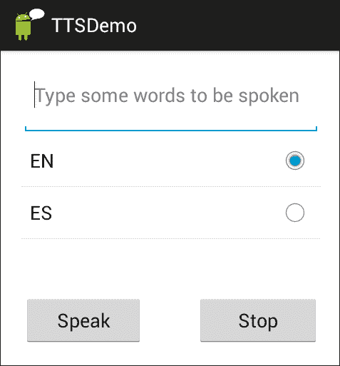
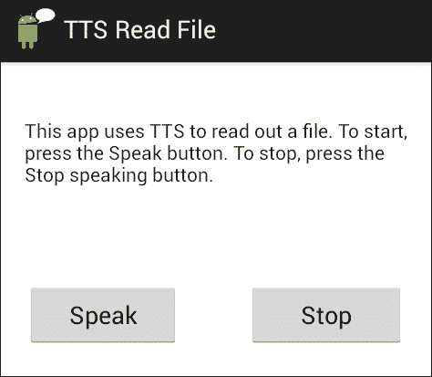

# 第二章：文本到语音合成

你是否曾好奇过，你的移动设备是如何大声朗读你最喜欢的电子书或最后的电子邮件的？在本章中，你将了解文本到语音合成技术（TTS），以及如何使用谷歌 TTS 引擎开发能够发声的应用程序。涵盖的主题包括：

+   文本到语音合成技术

+   谷歌文本到语音合成

+   使用文本到语音合成开发应用程序

到本章结束时，你应该能够在 Android 设备上开发使用文本到语音合成的应用程序。

# 介绍文本到语音合成

文本到语音合成（通常缩写为 TTS）是一种技术，它可以将书面文本转换为语音。TTS 已经被广泛用于为视障人士提供屏幕阅读，同时也用于有严重言语障碍的用户。或许最著名的语音合成技术用户是物理学家斯蒂芬·霍金，他患有运动神经元病，当他的言语变得无法理解时，使用 TTS 作为他的语音。在单词预测技术的帮助下，他能够构建一个句子，然后将其发送到内置的 TTS 系统（更多信息请参见：[`www.hawking.org.uk/the-computer.html`](http://www.hawking.org.uk/the-computer.html)）。

TTS 还广泛应用于用户手或眼忙碌的情况下，例如，在驾驶导航系统时，车辆沿着路线行进时，系统会朗读方向。TTS 的另一个广泛用途是在公共广播系统中，例如在机场或火车站。TTS 还用于基于电话的呼叫中心应用程序，以及一般语音对话系统，用于朗读系统的提示，并与网站上的对话头像结合使用，以提供客户帮助和支持。

TTS 系统的质量对用户的感知有很大影响。用户可能会对听起来机械的系统或错误发音如地名或地址等单词的系统感到烦恼。然而，只要 TTS 的输出可以理解，这至少应该能允许系统充分地执行功能。

# 文本到语音合成技术

文本到语音合成主要有两个阶段：

+   文本分析，即对要合成的文本进行分析和准备，以便进行口语输出。

+   波形生成，即分析后的文本被转换为语音。

文本分析阶段可能会遇到很多问题。例如，单词*staring*的正确发音是什么？是基于单词*star* + *ing*的组合还是*stare* + *ing*的组合？要确定这个问题的答案需要对单词结构进行复杂分析；在这种情况下，需要确定像*stare*这样的单词的词根形式如何通过添加如*ing*这样的后缀而改变。

还有一些单词根据它们在特定句子中的使用具有不同的发音。例如，作为动词的*live*与*give*押韵，但作为形容词时与*five*押韵。词性还会影响单词内的重音分配；例如，名词*record*的发音为*'record*（重音在第一个音节上），作为动词时为*re'cord*（重音在第二个音节上）。

另一个问题涉及到将数字值转换成适合语音输出的形式（这被称为*规范化*）。例如，项目*12.9.13*如果它代表一个日期，就不应该读作*twelve dot nine dot thirteen*，而应该是*December 9th, two thousand thirteen*。需要注意的是，使用 Google TTS API 的应用程序开发者无需担心这些问题，因为这些问题已经内置到 TTS 引擎中了。

转向波形生成，早期系统中使用的主要方法要么是**发音合成**，试图模拟人类产生语音的物理过程，或者是**共振峰合成**，它模拟声学信号的特征。

现在使用的则是**拼接语音合成**，在这种合成中，预先录制的语音单元存储在语音数据库中，在生成语音时选择并连接这些单元。这些单元的大小各不相同；单个声音（或音素），相邻的声音对（双音素），这会产生更自然的输出，因为一个音素的发音会根据周围音素而变化；音节、单词、短语和句子；已经开发出复杂的算法来选择最佳的候选单元链，并将它们平滑地连接起来以产生流畅的语音。一些系统的输出常常与真实的人类语音无法区分，特别是在有效使用语调的情况下。语调包括语调、音高、响度、速度和节奏，用于传达意义上的差异以及态度。

# 使用预先录制的语音而不是 TTS

尽管近年来 TTS 的质量有了显著的提高，但许多商业企业仍然倾向于使用预先录制的语音，以确保输出高质量。通常被称为声音天才的专业艺术家被雇佣来录制系统的提示音。

预录提示的缺点是它们不能用于输出文本不可预测的地方——如在阅读电子邮件、短信或新闻的应用程序中，或者在客户名单不断添加新名字的应用程序中。即使文本可以被预测，但涉及大量组合——如在机场的航班公告中——输出元素的不同部分必须从预录片段拼接起来，但在许多情况下，结果却是生硬和不自然的。另一种情况是可能需要提供其他语言的输出。可以聘请声音人才以各种语言录制输出，但对于更大的灵活性，使用不同语言版本的 TTS 可能成本更低，且足够满足目的。

关于 TTS 与预录语音的问题，已经进行了大量的研究。例如，请参阅*James R. Lewis*所著的《*实用语音用户界面设计*》，*CRC Press*。

# 使用谷歌文本语音合成

TTS 自 Android 1.6（API 级别 4）起在 Android 设备上可用。谷歌 TTS API（包`android.speech.tts`）的组件在[`developer.android.com/reference/android/speech/tts/package-summary.html`](http://developer.android.com/reference/android/speech/tts/package-summary.html)有文档记录。接口和类被列出，点击这些可以获取更多详细信息。

## 启动 TTS 引擎

启动 TTS 引擎涉及创建`TextToSpeech`类的一个实例以及当 TTS 引擎初始化时将执行的方法。通过一个名为`OnInitListener`的接口来检查 TTS 是否已初始化。如果 TTS 初始化完成，将调用`onInit`方法。

下面的代码行创建了一个实现`onInitListener`接口的`onInit`方法的`TextToSpeech`对象。

```kt
TextToSpeech tts = new TextToSpeech(this, new OnInitListener(){ 
    public void onInit(int status){ 
        if (status == TextToSpeech.SUCCESS) 
              speak("Hello world", TextToSpeech.QUEUE_ADD, null); 
    }
}
```

### 提示

**下载示例代码**

你可以从你在[`www.packtpub.com`](http://www.packtpub.com)的账户下载你购买的所有 Packt 图书的示例代码文件。如果你在其他地方购买了这本书，可以访问[`www.packtpub.com/support`](http://www.packtpub.com/support)注册，文件会直接通过电子邮件发送给你。

你也可以访问这本书的网页：[`lsi.ugr.es/zoraida/androidspeechbook`](http://lsi.ugr.es/zoraida/androidspeechbook)

在示例中，当 TTS 正确初始化后，将调用`speak`方法，该方法可能包括以下参数：

+   `QUEUE_ADD`：新条目被放置在播放队列的末尾。

+   `QUEUE_FLUSH`：播放队列中的所有条目被丢弃，并由新条目替换。

由于某些设备的存储空间有限，可能并非所有支持的语言实际上都安装在特定设备上。因此，在创建 `TextToSpeech` 对象之前，检查特定语言是否可用非常重要。这样，如有必要，可以下载并安装所需的特定语言资源文件。这是通过发送带有 `ACTION_CHECK_TTS_DATA` 动作的 `Intent` 来实现的，它是 `TextToSpeech.Engine` 类的一部分，如下面的代码所示：

```kt
  Intent intent = newIntent(TextToSpeech.Engine.ACTION_CHECK_TTS_DATA);
  startActivityForResult(intent,TTS_DATA_CHECK);
```

如果语言数据已经正确安装，`onActivityResult` 处理程序将接收到 `CHECK_VOICE_DATA_PASS`，这时我们应该创建 `TextToSpeech` 实例。如果数据不可用，将执行 `ACTION_INSTALL_TTS_DATA` 动作，如下面的代码所示：

```kt
Intent installData = new Intent (Engine.ACTION_INSTALL_TTS_DATA);
startActivity(installData);
```

你可以在 `TTSWithIntent` 应用程序中查看完整代码，该应用程序在代码捆绑包中提供。

# 使用 Google TTS 开发应用程序

为了避免在多个地方重复代码，并能够随着我们过渡到更复杂的应用程序而专注于新部分，我们将最常使用的 TTS 功能封装到一个名为 `TTSLib` 的库中（请参阅源代码中的 `sandra.libs.tts`），该库在不同的应用程序中使用。

`TTS.java` 类是按照单例设计模式创建的。这意味着此类只能有一个实例，因此使用该库的应用程序将使用一个单一的 TTS 对象来合成所有消息。这具有多种优势，例如优化资源并防止开发者在同一应用程序中无意创建多个 `TextToSpeech` 实例。

## TTSWithLib 应用程序 – 读取用户输入

下图显示了此应用程序的启动屏幕，用户在此屏幕上输入文本，选择语言，然后按下按钮以使设备开始或停止阅读文本。默认情况下，选中选项是设备中的默认语言，如下面的屏幕截图所示：



`TTSWithLib.java`文件中的代码主要初始化视觉用户界面中的元素，并控制所选语言（`setLocaleList`方法），以及当用户按下**说话**（`setSpeakButton`）和**停止**（`setStopButton`）按钮时要执行的操作。从展示的代码中可以看出，主要功能是调用`TTSLib`库中`TTS.java`文件里的相应方法。在`TTS.java`中（参见代码包中的`TTSLib`项目），有三个名为`setLocale`的方法用于设置地区。第一个方法接收两个参数，分别对应语言和国家代码。例如，对于英式英语，语言代码是`EN`，国家代码是`GB`；而对于美式英语，它们分别是`EN`和`US`。第二个方法仅设置语言代码。第三个方法不接收任何参数，仅设置设备的默认语言。可以观察到，如果第一个或第二个方法的任何参数为 null，则会调用第二个和第三个方法。

其他重要方法是负责开始（`speak`方法）和停止（`stop`方法）合成，而`shutdown`方法释放 TTS 引擎使用的本地资源。调用`shutdown`方法是一个好习惯，我们在调用活动的`onDestroy`方法中执行它；例如，在`TTSDemo.java`文件中）。

## TTSReadFile 应用 – 大声朗读文件

文本到语音合成的更现实场景是朗读一些文本，特别是在用户的眼和手忙碌时。与上一个示例类似，应用程序检索一些文本，用户按下**说话**按钮来听它。提供了一个**停止**按钮，以防用户不想听完全部文本。

这种应用程序的一个潜在用例是用户访问网络上的文本，例如新闻条目、电子邮件或体育报道。这需要额外的代码来访问互联网，这超出了当前应用程序的范围（例如，参见第五章中的 MusicBrain 应用程序，*表单填充对话框*）。因此，为了简化问题，文本预先存储在`Assets`文件夹中，并从那里检索。将文本从其他来源检索并传递给 TTS 朗读留给读者作为一个练习。以下截图显示了打开屏幕：



`TTSReadFile.java`文件与`TTSWithLib.java`文件类似。如代码所示，主要区别在于它使用英语作为默认语言（与存储的文件匹配）并从文件中获取文本，而不是从用户界面（参见`speakbutton`的`onClickListener`方法和代码包中的`getText`方法）。

### 提示

在书中详细讨论了一些更高级的问题：《*专业 Android™传感器编程，Greg Milette 和 Adam Stroud，Wrox，第十六章*》。有一些方法可以根据特定设备上可用的内容选择不同的声音。例如，TTS API 提供了额外的帮助您播放不同类型文本的方法。

# 总结

本章节展示了如何使用谷歌 TTS API 在设备上实现文本到语音的合成。首先提供了文本到语音合成背后的技术概览，随后介绍了谷歌 TTS API 的各个元素。通过两个示例演示了文本到语音合成的基础知识。在后续章节中，将开发更为复杂的方法。

下一章节将处理语音硬币的另一面：语音到文本（或语音识别）。
