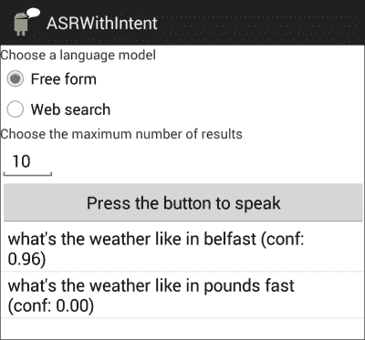

# 第三章：语音识别

你是否曾在设备上点击多个菜单和选项，直到你能够完成你想要的操作？你是否希望只需说几个字就能让它工作？本章探讨的是**自动语音识别**（**ASR**），它将说出的单词转换为书面文字的过程。涵盖的主题包括以下内容：

+   语音识别技术

+   使用谷歌语音识别

+   利用谷歌语音识别 API 开发应用

到本章结束时，你应该能够很好地理解在应用中使用语音识别所涉及的问题，并应该能够使用谷歌语音 API 开发简单的应用程序。

# 语音识别技术

以下是语音识别的两个主要阶段：

+   **信号处理**：这一阶段包括将麦克风录入的单词通过**模拟-数字转换器**（**ADC**）转换成计算机可以处理的数字数据。ADC 处理数字数据以去除噪音，并执行其他如回声消除等过程，以便能够提取对语音识别有关键作用的特点。

+   **语音识别**：信号被分割成微小的片段，与待识别语言的音素进行匹配。音素是语音的最小单位，大致相当于字母表中的字母。例如，单词"cat"中的音素是 */k/*, */æ/*, 和 */t/*。在英语中，例如，大约有 40 个音素，这取决于所讲英语的变体。

在语音识别中最成功的方法是统计建模语音，这样处理的结果是一系列猜测（或假设）用户可能说的话，并根据计算出的概率进行排序。这一统计建模使用复杂的概率函数。其中最常用的模型是*隐马尔可夫模型*，但神经网络也被使用，有时还使用这两种方法的混合过程。这些模型通过使用大量训练数据的训练过程进行调优。通常，需要使用数百到数千小时的音频来处理人类语音的变异性和复杂性。结果是产生了一个表示语言中声音和单词不同发音方式的*声学模型*。

仅仅依靠声学模型对于高性能的语音识别是不够的。语音识别系统的另一个部分是另一个统计模型，即*语言模型*。这个模型包含了关于允许的单词序列和给定序列中哪些单词更可能出现的知识。例如，尽管从声学角度来说，*to*和*two*听起来是一样的，但在短语*I went to the shops*中前者更可能出现，在短语*I bought two shirts*中则是后者。语言模型有助于返回每个短语中正确的单词。

语音识别的输出是根据识别器对识别正确性的置信度（从 0 到 1 的区间）排列的一系列识别结果（称为*N-best 列表*）。接近 1.0 的值表示对识别正确性有很高的置信度，而接近 0.0 的值表示置信度较低。N-best 列表和置信度分数很有用，因为可能的情况是，首选识别的字符串并不是用户实际所说的内容，而其他选项可能提供更合适的结果。置信度分数也很有用，因为它们可以为决定系统应该如何继续提供依据，例如，是否确认已识别的短语。

# 使用谷歌语音识别

自从 Android 2.1（API 级别 7）起，语音识别服务就已经在 Android 设备上可用。其中一个可以使用识别功能的地方就是 Android 键盘上的麦克风图标。点击麦克风按钮激活谷歌语音识别服务，如下面的截图所示。红色的麦克风和文字提示表明系统正在等待接收语音：


如果没有检测到语音，系统会生成一个重新提示对话框，要求用户再次尝试说话。另一种可能是无法为用户的语音输入找到合适的匹配项。在这种情况下，屏幕会显示**未找到匹配项**的消息。最后，当没有可用的网络连接时，会显示**连接问题**的消息。

可以通过**设置** | **语言和输入** | **语音** | **语音搜索**调整内置语音识别服务的参数，或者根据设备的不同，点击屏幕右上角的**工具**图标。会展示出多种可用的语言。检查语言的可用性以及选择语言也可以通过编程实现。这将在第七章，*多语言和多模态对话*中进行介绍。

# 使用谷歌语音识别 API 开发应用

谷歌语音 API（包`android.speech`）的组件在[`developer.android.com/reference/android/speech/package-summary.html`](http://developer.android.com/reference/android/speech/package-summary.html)进行了文档化。这里列出了接口和类，点击它们可以获得更多详细信息。

在 Android 设备上有两种进行语音识别的方法：仅基于`RecognizerIntent`的方法，或者创建`SpeechRecognizer`的实例。前者提供了一个易于编程的机制，通过启动 Intent 类并处理其结果，可以创建使用语音识别的应用程序。按照此方案的应用程序将显示一个对话框，为用户提供关于 ASR 是否准备就绪或在识别过程中出现不同错误的信息反馈。使用`SpeechRecognizer`为开发人员提供了关于识别相关事件的不同通知，从而允许更细致地处理语音识别过程。这种方法不会显示对话框，为开发人员在应用程序 GUI 上提供更多控制。

在以下章节中，我们将介绍两个应用程序（`ASRWithIntent`和`ASRWithLib`），它们识别用户说的话并以 N-best 列表的形式展示识别结果及置信度得分。实际上，它们是相同的应用程序，但是它们是按照前面描述的两种不同方法开发的：`ASRWithIntent`使用`RecognizerIntent`方法，而`ASRWithLib`使用我们在 ASRLib 库中编程的`SpeechRecognizer`方法（代码包中的`sandra.libs.asr.asrlib`）。

## 带有 Intent 的 ASR 应用

这个简单的应用程序说明了以下内容：

1.  用户选择语音识别的参数。

1.  用户按下按钮并说一些话。

1.  识别出的词语及其置信度得分以列表形式显示。

在打开的屏幕上，有一个带有消息**按下按钮说话**的按钮。当用户按下按钮时，将启动语音识别功能，使用用户选择的参数。激活语音识别实例并说出*贝尔法斯特的天气如何*的词组的结果在下图中显示：



用户按下启动语音识别的按钮是通过引用`asrwithintent.xml`中指定的按钮设置的，你可以在代码包中找到它（在`ASRWithIntent`项目的`res/layout`文件夹中）：

```kt
//Gain reference to speak button 
Button speak = (Button) findViewById(R.id.speech_btn); 
//Set up click listener 
speak.setOnClickListener(
       new View.OnClickListener() { 
       @Override 
       public void onClick(View v) { 
             //Speech recognition does not currently work on simulated devices, 
             //it is the user attempting to run the app in a simulated device 
             //they will get a Toast 
             if("generic".equals(Build.BRAND. toLowerCase())){ 
                 Toast toast = Toast.makeText(getApplicationCon text(),"ASR is not supported on virtual devices", Toast.LENGTH_SHORT); 
                toast.show(); 
                Log.d(LOGTAG, "ASR attempt on virtual device"); 
             } 
             else{ 
                setRecognitionParams(); //Read parameters from GUI 
                listen(); //Set up the recognizer and start listening 
             } 
       } 
});
```

当用户按下按钮时，将调用`listen()`方法，在其中设置`RecognizerIntent`的详细信息。在`ASRWithIntent`中，通过发送一个带有`ACTION_RECOGNIZE_SPEECH`动作的 Intent 来支持语音识别，使用`startActivityForResult(Intent,int)`方法，其中`int`值是由开发者定义的请求代码。如果它大于 0，当活动退出时，此代码将在`onActivityResult()`中返回。请求代码作为标识符，用于区分在应用程序中可能调用的不同意图产生的特定结果。

以下代码启动了一个识别语音的活动：

```kt
Intent intent = new Intent(RecognizerIntent.ACTION_RECOGNIZE_SPEECH);
// Specify language model
intent.putExtra(RecognizerIntent.EXTRA_LANGUAGE_MODEL, languageModel);
// Specify how many results to receive. Results listed in order of confidence
intent.putExtra(RecognizerIntent.EXTRA_MAX_RESULTS, numberRecoResults);
// Start listening
startActivityForResult(intent, ASR_CODE);
```

正如代码所示，与`ACTION_RECOGNIZE_SPEECH`关联有几个额外的参数。其中一个是必需的，即`EXTRA_LANGUAGE_MODEL`。其他的是可选的。顾名思义，`EXTRA_LANGUAGE_MODEL`指定了在识别过程中要使用的语言模型。它支持以下两个选项：

+   `LANGUAGE_MODEL_FREE_FORM`：这个语言模型基于自由形式的语音识别，用于识别自由形式的语音，例如，在电子邮件的口述中。

+   `LANGUAGE_MODEL_WEB_SEARCH`：这个语言模型基于网络搜索词汇，用于模拟更为受限的输入形式，如较短的、类似搜索的短语，例如，*飞往伦敦*，*马德里的天气*等等。

可以观察到，这两个选项都意味着相当不受限制的输入。要构建一个只接受特定关键词的应用程序，或者使用识别语法，目前需要处理识别结果，以匹配预期的模式。关于如何执行此操作的一些示例将在第六章，*对话语法*中展示。

其他额外的参数在 Android 文档的`RecognizerIntent`类中有描述。以下是一些更常用的可选额外参数：

+   `EXTRA_PROMPT`：这提供了一个文本提示，当要求用户说话时向用户展示。

+   `EXTRA_MAX_RESULTS`：这个整数值指定了返回结果的最大数量限制。如果省略，识别器将决定返回多少结果。这些结果是用户输入的不同可能的文本，并从最可能到最不可能排序（本章前面讨论的最佳 N 列表）。

+   `EXTRA_LANGUAGE`：这指定了可以代替设备上提供的默认语言的语言。其他语言的使用在第七章，*多语言和多模态对话*中进行介绍。

可以让用户从这些选项中选择，或者可以程序化地设置。`ASRWithIntent`应用会提示用户选择语言模型和最大结果数。如果没有提供这些信息，它会使用在两个常量中指示的默认值（请参阅`asrwithintent.java`文件中的`showDefaultValues`和`setRecognitionParams`方法）。

语音识别的结果会通过`onActivityResults(int, int, Intent)`中的活动结果返回。此时，识别已经完成。然而，通常我们会希望查看结果或以某种方式使用它们。为此需要执行的额外步骤在以下来自`ASRWithIntent`的注释代码中说明：

```kt
protected void onActivityResult(int requestCode, int resultCode, Intent data) { 
    if (requestCode == ASR_CODE) { 
        if (resultCode == RESULT_OK) { 
           //Retrieves the N-best list and the confidences from the ASR result 
           ArrayList<String> nBestList = 
             data.getStringArrayListE xtra(RecognizerIntent.EXTRA_RESULTS); 
           float[] nBestConfidences = 
             data.getFloatArrayExtra(RecognizerIntent.EXTRA_CONFIDENCE_SCORES;

           /** Creates a collection of strings, each one with a recognition result and its confidence, e.g. "Phrase matched (conf: 0.5)" */
           ArrayList<String> nBestView = new ArrayList<String>(); 

           for(int i=0; i<nBestList.size(); i++){ 
               if(nBestConfidences[i]<0) 
                 nBestView.add(nBestList.get(i) + " (no confidence value available)"); 
               else 
                 nBestView.add(nBestList.get(i) + " (conf: " + nBestConfidences[i] + ")"); 
           } 

           //Includes the collection in the listview of the GUI 
           setListView(nBestView); 

           //Adds information to log 
           Log.i(LOGTAG, "There were : "+ nBestView. size()+" recognition results"); 
       } 
       else { 
           //Reports error in log 
           Log.e(LOGTAG, "Recognition was not successful"); 
      } 
   } 
} 
```

如先前所讨论的，识别结果通过意图返回。可以使用`getStringArrayListExtra`方法，并传入`RecognizerIntent.EXTRA_RESULTS`作为参数来访问匹配的句子。同样，可以使用`getFloatArrayExtra`和`RecognizerIntent.EXTRA_CONFIDENCE_SCORES`获取带有置信度分数的数组。

结果保存在一个新的`ArrayList<String>`中，其元素结合了匹配的字符串和浮点数组中的分数（表示为字符串）。请注意，有可能置信度分数是-1；这是置信度不可用时的情况。然后，在`setListView`方法中调用`ArrayAdapter`，将格式化的字符串插入到 GUI 的`ListView`中。

也可能发生识别无法满意进行的情况（在之前的代码中`resultCode!=RESULT_OK`）。在`RecognizerIntent`类中为主要的错误情况定义了不同的常量：`RESULT_AUDIO_ERROR`、`RESULT_CLIENT_ERROR`、`RESULT_NETWORK_ERROR`、`RESULT_SERVER_ERROR`和`RESULT_NOMATCH`。它们都对应于物理设备或网络的错误，最后一个对应于没有短语与音频输入匹配的情况。开发者可以使用结果代码对这些错误进行详细处理。然而，显示的对话框已经实现了一个简单的错误处理，对于较简单的应用来说可能已经足够。在这种情况下，用户会收到关于错误的反馈，并且在适用的情况下，他们会要求用户重复其话语。

最后，由于应用需要访问互联网以执行语音识别，因此需要在`manifest`文件中设置权限：

```kt
<uses-permission android:name="android.permission.INTERNET" />
```

## ASRWithLib 应用

`ASRWithLib`应用与`ASRWithIntent`具有完全相同的功能，但不是只使用`RecognizerIntent`类，而是创建`SpeechRecognizer`类的实例。为了使代码在所有使用 ASR 的应用程序中可用，我们建议使用库，就像上一章中为 TTS 所做的那样。在这种情况下，库位于`sandra.libs.asr.asrlib`中，只包含一个类`ASR`，它实现了`RecognitionListener`接口，因此所有处理不同识别事件的方法，即`onResults`、`onError`、`onBeginningOfSpeech`、`onBufferReceived`、`onEndOfSpeech`、`onEvent`、`onPartialResults`、`onReadyForSpeech`和`onRmsChanged`。

`SpeechRecognizer`实例是在`createRecognizer`方法中创建的，在检查设备中是否可用 ASR 引擎之后：

```kt
List<ResolveInfo> intActivities = packManager.queryIntentActivities(new Intent(RecognizerIntent.ACTION_RECOGNIZE_SPEECH), 0);

if (intActivities.size() != 0) {
    myASR = SpeechRecognizer.createSpeechRecognizer(ctx);
    myASR.setRecognitionListener(this);
}
```

这段代码查询`PackageManager`类以检查是否支持识别。如果`intActivities`.size()的值大于零，则支持语音识别，然后创建`SpeechRecognizer`的实例并将其保存在属性`myASR`中。识别的监听器通过引用`this`来设置，因为 ASR 类实现了`RecognitionListener`接口。

`listen`方法用于通过`RecognizerIntent`类开始监听。尽管额外的内容与`ASRWithIntent`应用中的相同，但启动识别的方式略有不同。`ASRWithIntent`使用了`startActivityForResult`，而在这个案例中，`SpeechRecognizer`对象负责通过接收意图作为参数来启动识别。

```kt
public void listen(String languageModel, int maxResults) throws Exception{ 

      if((languageModel.equals(RecognizerIntent.LANGUAGE_MODEL_FREE_FORM) || languageModel.equals(RecognizerIntent.LANGUAGE_MODEL_WEB_SEARCH)) && (maxResults>=0){ 
          Intent intent = 
                new Intent(RecognizerIntent.ACTION_RECOGNIZE_SPEECH); 
          // Specify the calling package to identify the application 
          intent.putExtra(RecognizerIntent.EXTRA_CALLING_PACKAGE, ctx. getPackageName()); 

          // Specify language model	intent.putExtra(RecognizerIntent.EXTRA_LANGUAGE_MODEL, 
          languageModel); 

          // Specify how many results to receive. 
          // Results listed in order of confidence 
          intent.putExtra(RecognizerIntent.EXTRA_MAX_RESULTS, maxResults); 

          // Start recognition 
          myASR.startListening(intent); 
      }
      else 
          throw new Exception("Invalid parameters for listen method"); 
}
```

在`ASRWithIntent`应用中，所有代码都在同一个类中，识别参数（`languageModel`和`maxResults`）的正确性测试也在那个单独的类中进行。然而，这里我们正在构建一个将在许多应用中使用的库，因此不能想当然地认为在调用`listen`方法之前会检查参数。这就是为什么该方法会检查它们的值，如果它们不正确，则会抛出异常。

有几种方法用来响应 ASR 引擎可能引发的不同事件。在库中实现这些事件的响应并不是一个好的策略，首先，这意味着所有使用该库的应用程序都必须对事件进行相同的处理；其次，因为大多数时候，对事件的响应涉及到向用户显示消息或以其他方式使用图形用户界面，而将应用程序的逻辑与其界面分离是一个基本的设计原则。

这就是为什么`ASR`类使用抽象方法的原因。抽象方法只声明头部，具体子类负责为它们提供代码。这样，负责响应 ASR 事件的每个方法都调用一个抽象方法，而 ASR 的每个子类中这些方法的行为都不同。在`ASRWithLib`示例中，`ASRWithLib`类是 ASR 的一个子类，并以特定方式实现抽象方法。如果我们有另一个应用程序，想要开发不同的行为，可以为这些方法编写单独的代码。

例如，当引擎找到与用户所说内容相匹配的句子时，会调用`ASR.java`类中的`onResults`方法。`ASR.java`中此方法的代码如下所示。请注意，为了获取结果，它使用了`SpeechRecognizer`类的静态方法，而不是像`ASRWithIntent`中那样使用`RecognizerIntent`：

```kt
public void onResults(Bundle results) {
processAsrResults(results.getStringArrayList(SpeechRecognizer.RESULTS_RECOGNITION),results.getFloatArray(SpeechRecognizer.CONFIDENCE_SCORES));
}
```

此方法调用了抽象方法`processAsrResults`。在`ASRWithLib`类中实现了此方法，指出了如何处理结果（在这种情况下，是通过填充列表视图，如同`ASRWithIntent`中那样）。

如您可能已经观察到的，`ASRWithLib`应用程序没有显示识别对话框。这对于执行连续语音识别的应用程序（ASR 始终作为后台服务活动）可能是可取的，因为此类反馈可能会使用户感到烦恼。然而，对于其他应用程序，需要向用户显示一些反馈，以便他们知道应用程序正在听。这是通过`onAsrReadyForSpeech`方法完成的。当 ASR 引擎准备好开始听时，执行此方法，这是来自`ASRLib`的抽象方法，在`ASRWithLib.java`中通过更改语音按钮的颜色和信息来实现（文本和颜色都不是硬编码的，而是从`res/values`文件夹中获取的）：

```kt
Button button = (Button) findViewById(R.id.speech_btn); button.setText(getResources().getString(R.string.speechbtn_listening));
button.setBackgroundColor(getResources().getColor(R.color.speechbtn_listening));
```

最后，需要在`manifest`文件中设置权限，以便使用 ASR 访问互联网和录制音频：

```kt
<uses-permission android:name="android.permission.INTERNET" />
<uses-permission android:name="android.permission.RECORD_AUDIO"/>
```

# 概括

本章展示了如何使用谷歌语音 API 来实现语音识别服务，前提是检查设备上是否提供该服务。系统会提示用户说出一些词语，识别结果，即识别出的字符串及其置信度分数，将显示在屏幕上。用户可以选择识别的语言模型以及要检索的最大结果数。这一功能是通过`ASRWithIntent`和`ASRWithLib`应用程序中的两种不同方法来实现的。

`ASRWithIntent`应用程序是一个简单易开发的基本示例，所有代码都包含在同一个类中。ASR 是通过使用`RecognizerIntent`类来完成的，并且有一个自动生成的对话框，提供反馈信息，指示引擎是否在听或是否出现错误。

`ASRWithLib` 应用程序展示了如何模块化并创建一个语音识别库，该库可以在许多应用程序中使用。它不是仅依赖于 `RecognizerIntent` 类，而是使用 `SpeechRecognizer` 类的实例，并使用抽象方法实现 `RecognitionListener` 接口，提供了一个灵活的实现，能够响应广泛的 ASR 事件。

虽然这两个示例并不是特别有用的应用程序，但这里展示的代码几乎可以原封不动地用在任何使用语音识别的应用程序中。本书后续的示例将基于此代码构建。下一章将展示如何结合 TTS（文本到语音）和 ASR（自动语音识别）来执行简单的语音交互，用户可以请求信息或向设备发出命令。
