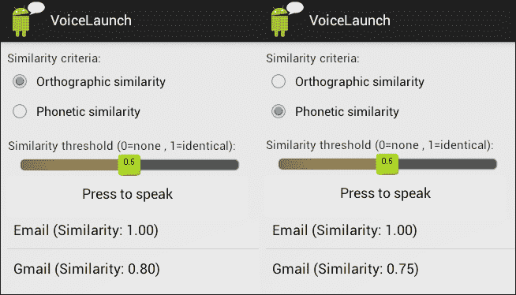

# 第四章：简单的语音交互

如果你可以仅通过向移动设备说话来获取信息或让它做事，那不是很好吗？本章介绍简单的语音交互，让你能够这样做。两个教程示例将向你展示如何实现查询信息以及请求启动设备上的一个应用程序。

语音识别并不完美，因此实施一些机制来选择最佳的识别结果很有意义。在前面的章节中，我们学习了如何获得置信度度量。在本章中，我们将介绍两种新机制：相似度度量，用于将识别的输入与用户所说的内容进行比较，以及确认机制，直接询问用户系统是否正确理解。

到本章结束时，你应该能够开发简单的语音交互，以请求信息并在设备上执行命令。你也应该了解如何使用相似度度量并确认用户所说的话。

# 语音交互

正如在第一章，*安卓设备上的语音*中讨论的，谷歌语音动作是简单的交互，用户说出一个问题或命令，应用程序通过动作或语音回应（或两者的组合）进行响应。

### 注意

以下是具有简单结构和少量交互回合的类似交互示例：

示例 1

用户：BBC 新闻

应用程序：（启动 BBC 新闻）

示例 2

应用程序：你的查询是什么？

用户：法国的首都是什么？

应用程序：（返回关于巴黎和法国的网页）

以下交互方式简单：

+   **有限的对话管理**：交互最多由两到三个回合组成。

+   **有限的语音理解能力**：用户仅限于由单个单词或短语组成的输入，例如网站名称或应用程序名称，或可以由谷歌搜索引擎处理的文本段落。

# VoiceSearch 应用程序

这个应用程序说明了以下内容：

1.  点击**按下按钮说话**选项时，提示用户说一些词语。

1.  用户说出一些词语。

1.  `VoiceSearch`根据用户的语音发起搜索查询。

开屏界面有一个按钮，提示用户按下并说话。按下按钮后，下一界面显示谷歌语音提示**你的查询是什么？**结果会在浏览器窗口中显示。

在此案例中，应用程序使用了之前开发的两个库：`TTSLib`（见第二章，*文本到语音合成*）和`ASRLib`（见第三章，*语音识别*）。它们的`jar`文件包含在`VoiceSearch`项目的`libs`文件夹中。ASR 方法用于识别用户输入并将其用作搜索条件。TTS 用于向用户提供关于应用程序状态的语音反馈。

这个应用程序结合了`TTSWithLib`（第二章，*语音合成*）和`ASRWithLib`（第三章，*语音识别*）应用程序中已经呈现的代码。它使用与`TTSWithLib`中相同的 TTS 实例，以及`ASRWithDemo`中的相同 ASR 方法。它还通过改变按钮的颜色和文字，提供视觉反馈以指示应用程序是否正在监听用户。

一旦 ASR 产生结果，它将被用于执行谷歌搜索，使用一个网页搜索意图，如`processAsrResults`方法所示：

```kt
public void processAsrResults(ArrayList<String> nBestList, float[] nBestConfidences) {
      String bestResult = nBestList.get(0); 
      indicateSearch(bestResult); //Provides feedback to the user that search 
      //is going to be started 
      //Carries out a web search with the words recognized 
      Intent intent = new Intent(Intent.ACTION_WEB_SEARCH); 
      intent.putExtra(SearchManager.QUERY, bestResult); 
      startActivity(intent); 
}
```

可以观察到，应用程序总是使用最佳结果启动网络搜索。然而，系统可能误解了用户说的话，在这种情况下，启动的搜索可能是错误的。为了避免这种情况，可以使用确认。本章末尾将介绍确认的引入以及使用`VoiceSearch`应用程序的一个简单示例。

# VoiceLaunch 应用程序

这个应用程序的功能如下： 

1.  当用户点击**按下说话**按钮时，系统会提示用户说出一个应用程序的名称。

1.  用户说出一个应用程序的名字。

1.  `VoiceLaunch`会将识别的输入与设备上安装的所有应用程序的名称进行比较，并启动名称最相似的应用程序。

像 VoiceLaunch 这样的应用程序不需要任何界面，因为用户只需说出他们想要启动的应用程序名称即可。然而，为了说明起见，我们创建了一个简单的界面，用户可以在其中选择两个参数的值：一个相似度阈值和一个相似度准则，如下面的截图所示。截图显示了用户要求启动**邮件**的场景。`VoiceLaunch`显示了图中的屏幕并启动了**邮件**应用程序（在这种情况下是相似度最高的，为**1.00**）：



我们介绍了相似性准则的技术，以展示如何改善 ASR 的结果。例如，当你有一个需要识别的关键词列表，但你不能限制 ASR 只监听这些词时，识别结果可能并不完全等同于你所期望的关键词。比如，如果你的关键词是冰淇淋口味，你可能考虑*巧克力*、*草莓*和*香草*，但如果你的 ASR 没有限制，对*草莓*的识别结果可能是*蔓越莓*。如果你的应用程序期待一个完全匹配，它会丢弃识别结果。然而，有了相似性度量，你的应用程序会知道用户说了与*草莓*相似的内容。

在`VoiceLaunch`中，相似度标准用于控制应用如何测量识别的名称与设备中安装的应用名称之间的相似度。使用相似度阈值，以便如果应用的名称与用户输入的识别内容不够相似，则不会启动该应用。

我们考虑以下两种计算相似度的选项：

+   **正字法相似度**：`VoiceLaunch`计算单词之间的 Levenshtein 距离。这个度量标准将单词 A 和 B 之间的距离视为在 A 中执行插入、删除或替换以获得 B 所需的最小字符数。`VoiceLaunch`将距离值转换为 0 到 1 之间的相似度值。

+   **语音相似度**：`VoiceLaunch`使用*Soundex*算法来计算名称之间的语音相似度。所使用的实现仅对英语有效，这就是为什么`VoiceLaunch`应用仅提供英语版本。这样，即使拼写不同，发音相同的单词也会被认为是相似的。相似度也使用从 0 到 1 的区间进行测量。

### 备注

考虑的距离度量有很多：欧几里得距离、杰卡德指数、汉明距离、索伦森相似度指数或梅特 afone。

通常同音词的拼写相似，因此正字法和语音相似度的值几乎相同，例如，*to*和*too*，或*flower*和*flour*。可以观察到，当处理 ASR 结果时，语音相似度更为方便，而当处理文本结果时，正字法相似度更好，因为文本中拼写错误更常见。以下表格显示了一些示例：

| 相似度标准 | 示例单词对 |
| --- | --- |
|   | Addition – Edition | Flower - Flour | Plane – Plain | Browser – Mail |
| 正字法相似度 | 0.75 | 0.66 | 0.60 | 0.00 |
| 语音相似度 | 0.75 | 1.00 | 1.00 | 0.00 |

### 备注

一本配套的小型 Java 项目可在书籍网页上找到，你可以使用`ComparisonTest` java 项目来创建自己的测试。为了使用它，你必须包含 Soundex 的 apache 库，并将要比较的单词作为运行参数。在 Eclipse 中包含库，请右键点击**项目** | **属性** | **库** | **添加外部 JARs**。要运行项目，请右键点击**运行方式** | **运行配置**，在**程序参数**标签下，用空格分隔两个单词（例如，`to too`）。

处理 ASR 和 TTS 的代码与 `VoiceSearch` 应用相似。然而，在识别完成后，`VoiceLaunch` 必须找到与用户识别词相似的应 用，并启动最相似的一个。这通过在 `processAsrResults` 方法中完成（在代码包的 `VoiceLaunch.java` 文件中查看），该方法调用 `getSimilarAppsSorted` 和 `launchApp` 方法，这些方法将在以下页面中描述。

### 提示

**你是否注意到…**

所有应用中使用的语音识别（ASR）库使它们具有相似的结构，其中在 `processAsrResults` 方法中处理识别信息。例如，在 `VoiceSearch` 应用中，它使用识别条件开始搜索，而在 `VoiceLaunch` 中，它获取已安装的类似应用列表并启动最相似的一个。

此外，`VoiceLaunch` 必须存储和管理关于设备上可用应用的信息。为了高效地完成这项工作同时保持代码的可读性，我们创建了一个名为 `MyApp` 的辅助类（你可以在代码包中找到，位于 `VoiceLaunch` 项目的 `VoiceLaunch.java` 文件中），对于每个应用，我们保存其用户友好的名称（例如，Adobe Reader），其被 Android 可识别的包名（例如，com.adobe.reader），以及其与用户输入的相似度（从 0 到 1 的值，例如，0.7）。

由于需要排序已安装的应用，我们还为 `MyApp` 类的对象定义了一个比较器。比较器如果第一个元素小于第二个元素返回负数，如果它们相等返回 0，如果第一个元素大于第二个元素返回正数。然后它们可以用来将集合从最小值排序到最大值。在我们的案例中，我们希望从最高相似度到最低相似度排序 `MyApps` 的集合。因此，我们将相似度值的比较器结果乘以-1，以得到反向排序的结果：

```kt
private class AppComparator implements Comparator<MyApp>{ 
    @Override 
    public int compare(MyApp app1, MyApp app2) { 
      return (- Double.compare(app1.getSimilarity(), app2\. getSimilarity())); // Multiply by -1 to get reverse ordering (from most to least similar) 
    } 
}
```

如前所述，`VoiceLaunch` 使用 `getSimilarAppsSorted` 方法来获取设备上按相似度排序的应用列表，但它只考虑那些与识别名称相似度高于指定阈值的应用。

如代码包所示（在 `VoiceLaunch` 项目下的 `VoiceLaunch.java` 文件中），该过程通过以下步骤进行：

1.  从包管理器中检索所有已安装应用的列表。

1.  对于列表中的每个应用，使用用户在 GUI 中选择的算法计算其与识别名称的相似度。如果获得的相似度值高于阈值，通过创建 `MyApp` 类的实例来保存应用的名称、包名和相似度值，该实例被添加到 `similarApps` 集合中。

1.  `similarApps`集合是使用我们的相似度比较器进行排序的：`Collections.sort(similarApps, new AppComparator());`

1.  这些信息被保存在日志中，以便开发者了解在相似度方面考虑了哪些应用。

    ```kt
    public void processAsrResults(ArrayList<String> nBestList, float[] nBestConfidences) {

          //Obtains the best recognition result 
          String bestResult = nBestList.get(0); 

          //Read the values for the similarity parameters from the GUI 
          readGUIParameters(); 
          //Obtains the apps installed in the device sorted from most to least similar name regarding the user input 

          //String[] = [0] = name, [1] = package, [2] = similarity 
          ArrayList<MyApp> sortedApps = getSimilarAppsSorted(bestRes ult); 

          //Shows the matching apps and their similarity values in a list 
          showMatchingNames(sortedApps); 

          //Launches the best matching app (if there is any) 
          if(sortedApps.size()<=0) 
          { 
              Toast toast = Toast.makeText(getApplicationContex t(),"No app found with sufficiently similar name", Toast.LENGTH_ SHORT); 
              toast.show(); 
              Log.e(LOGTAG, "No app has a name with similarity > 
              "+similarityThreshold); 
          }
          else 
              launchApp(sortedApps.get(0));
    }
    ```

### 提示

**你也可以尝试…**

可以使用另一种方法，使系统不仅仅选择一个相似度度量，而是综合考虑两种方法的结果来选择最相似的应用，例如，使用加权投票方法。

根据所使用的相似度算法，`getSimilarAppsSorted`调用以下方法之一：`compareOrthographic`或`comparePhonetic`（见代码捆绑包中`VoiceLaunch`项目下的`VoiceLaunch.java`）。前者使用 Levenshtein 度量计算正字法距离，后者使用 Soundex 算法计算语音距离。

为了计算 Levenshtein 距离，我们使用了`com.voicedemos`包中的`LevenshteinDistance.java`类。它基于维基教科书提供的代码，该代码可以在[`en.wikibooks.org/wiki/Algorithm_Implementation/Strings/Levenshtein_distance#Java`](http://en.wikibooks.org/wiki/Algorithm_Implementation/Strings/Levenshtein_distance#Java)找到，我们在此基础上添加了将距离转换为 0 到 1 之间相似度值的代码。

为了计算语音距离，我们使用了 Apache Commons 提供的 Soundex 实现，可在[`commons.apache.org/proper/commons-codec/index.html`](http://commons.apache.org/proper/commons-codec/index.html)找到。为此，我们将对应的`commons-codec-1.8 lib`的`jar`文件添加到了`VoiceLaunch`项目的`libs`文件夹中。

这两个相似度计算方法的输入参数是两个字符串，分别对应考虑中的应用名称和识别的输入。这些字符串之前通过删除空格并使用小写进行了标准化处理：

```kt
    private String normalize(String text){
        return text.trim().toLowerCase();
    }
```

### 注意事项

可以进行更复杂的标准化处理，以应对用户只说了一个双词名称中的一个词的情况，例如，说*kindle*而不是*kindle reader*。

应用排序后，最相似的应用通过使用`launchApp`方法启动，该方法使用带有应用包名的`launchintent`（你可以在代码捆绑包中的`VoiceLaunch.java`文件中找到它）。

# VoiceSearchConfirmation 应用

确认是事务性对话中非常重要的一个方面，人类在服务交易中也广泛使用以确信一切都已被正确理解。由于当前的语音识别技术不能保证应用确切听到了用户所说的内容，应用应该确认用户的意图，尤其是如果下一个动作可能导致不可恢复的后果时。然而，确认应该谨慎使用，因为它们会延长交互时间，如果过度使用可能会让用户感到烦恼。

`VoiceSearchConfirmation`应用程序与`VoiceSearch`功能相同，但在执行搜索之前会确认搜索条件。与该应用程序的两个示例交互如下：

+   **确认情景**：此情景的特点如下：

    1.  用户按下按钮说话，并说出了*贝尔法斯特的天气*。

    1.  系统理解了*贝尔法斯特的天气*并询问*你是说贝尔法斯特的天气吗？*

    1.  用户按下按钮说话，并说*是的*。

    1.  系统使用*贝尔法斯特的天气*作为条件启动搜索。

+   **否定情景**：其特点如下：

    1.  用户按下按钮说话，并说*格拉纳达的天气*。

    1.  系统理解了*加拿大的天气*并询问*你是说加拿大的天气吗？*

    1.  用户按下按钮说话，并说*不*。

    1.  对话返回到步骤 1，直到用户满意为止。

`processResults`方法在 ASR 识别出用户输入的任何内容时都会被调用。因此，为了给应用程序提供确认功能，需要区分方法是识别搜索条件后调用，还是识别确认请求的“是/否”响应。为此，我们引入了新的属性`searchCriterion`来存储已识别的条件。如果为空，我们会尝试识别新的条件，如果不是，则确认其值。您可以查看`VoiceSearchConfirmation.java`文件中的代码，该文件位于`VoiceSearchConfirmation`项目的代码包中。

### 提示

**其他相似度衡量方法和技术**

其他相似度衡量方法和用于增强谷歌语音识别器返回结果的技巧在 Greg Milette 和 Adam Stroud 所著的《Professional Android™ Sensor Programming》第十七章中有所描述。讨论的技巧包括：

使用词干提取来提高词汇识别，即通过去掉词尾来将单词简化为词根，例如，将 walk、walks、walked 和 walking 都简化为同一个词根。

音韵索引，即匹配在发音上相似的词汇，例如，如果识别器返回发音相似的词*appeal*，能够返回*apple*。

使用 Lucene 进行匹配，这是一个为文本搜索而设计的搜索引擎库。

# 总结

在本章中，我们展示了如何使用谷歌语音识别和 TTS API 开发简单的语音交互。第一个示例说明了如何从用户那里获取一些词语作为输入并启动搜索查询。第二个示例涉及使用语音在设备上启动应用程序。这里我们介绍了使用相似度度量来比较用户输入的识别结果与可能说出内容的技术。文中展示了两种不同的度量方法：正字法相似性和音韵相似性。最后一个示例展示了如何使用确认来检查系统是否正确识别了输入。这些技术，加上前一章引入的置信度分数，对于开发支持语音的应用程序非常有用。

然而，这些交互在两个方面受到限制。首先，它们没有涉及使用对话状态信息来控制交互，以及确定应用程序应该说什么和做什么。应用程序的行为在特定的语音动作中是硬编码的。其次，这些交互限制了用户只能输入一个简单单词或短句。更复杂的对话需要对话状态的表示以及更高级的口语语言理解。第五章展示了如何包含对话状态的表示，以提供更灵活的对话管理，而第六章则展示了如何使用语法来允许更高级的口语语言理解。

就确认而言，我们针对只需确认单个数据的情况提出了一种非常简单的解决方案。在接下来的章节中，我们将研究如何创建更为复杂的行为，以便可以确认多个数据，同时考虑识别置信度的确认策略。我们还将介绍一种无需按下按钮即可进行对话的方法。
