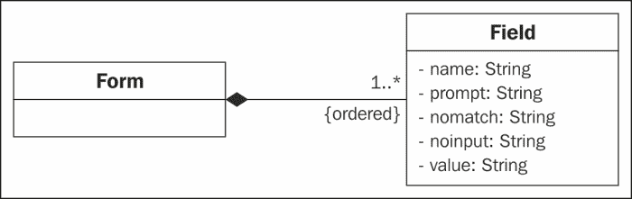
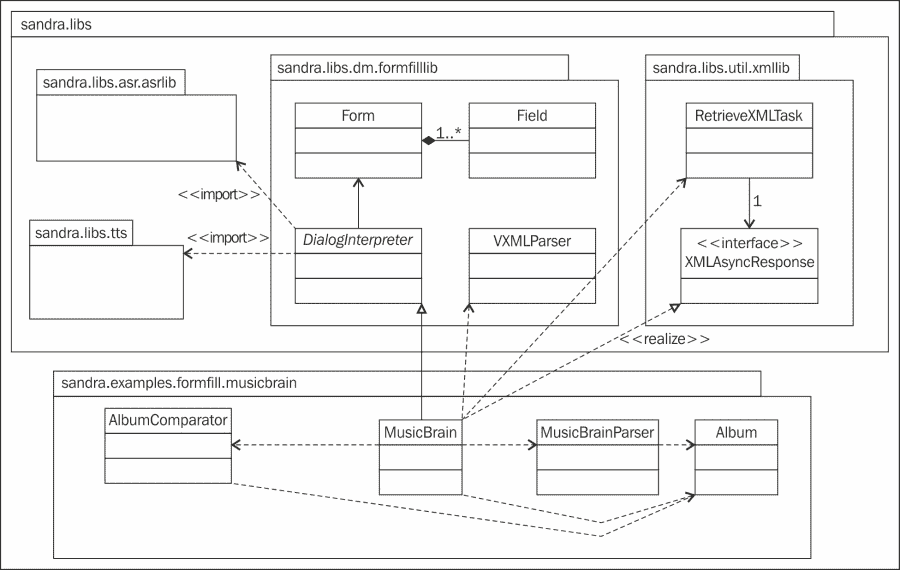
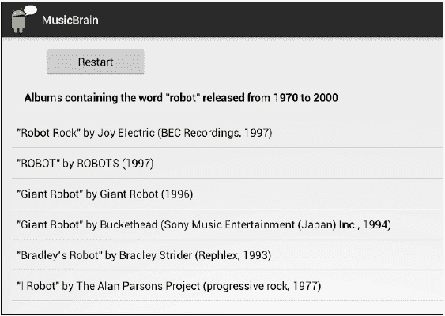

# 第五章：表单填写对话

许多启用语音的应用程序使用前一章描述的一键式对话。你觉得语音界面可以比这走得更远吗？你能想象更复杂的交互，其中需要从用户那里获取多个信息项，用于各种目的，例如启动应用程序、查询数据库、启动网络服务或网络服务混搭，以及更多？

这类对话与传统的网络应用程序中的表单填写相似。在本章结束时，你应该能够实现简单的表单填写对话，以便获取访问网络服务所需的数据。

# 表单填写对话

表单填写对话可以看作是多个待填写的槽位。例如，在航班预订应用程序的情况下，系统可能需要填写五个槽位：目的地、到达日期、到达时间、出发日期和出发时间。在简单的表单填写对话中，每个槽位逐一处理，并提出相关问题，直到所有槽位都被填写。此时，应用程序可以查找所需的航班，并将结果呈现给用户。以下是一个对话可能进行的方式的示例，以及对话进行时槽位状态的变化。

应用程序：欢迎来到航班信息服务。你想要去哪里旅行？

通话者：伦敦。

| 槽位 | 目的地 | 到达日期 | 到达时间 | 出发日期 | 出发时间 |
| --- | --- | --- | --- | --- | --- |
| --- | --- | --- | --- | --- | --- |
| 值 | 伦敦 | 未知 | 未知 | 未知 | 未知 |

应用程序：你想要哪一天飞往伦敦？

通话者：7 月 10 日。

| 槽位 | 目的地 | 到达日期 | 到达时间 | 出发日期 | 出发时间 |
| --- | --- | --- | --- | --- | --- |
| --- | --- | --- | --- | --- | --- |
| 值 | 伦敦 | 07/10/2013 | 未知 | 未知 | 未知 |

框架的槽位也可以附加条件，例如，如果是往返旅程，那么还需要填写返回旅程的槽位值。

在更复杂的对话中，用户可以一次填写多个槽位，如下面的示例所示：

应用程序：欢迎来到航班信息服务。你想要去哪里旅行？

通话者：我想在周五飞往伦敦。

| 槽位 | 目的地 | 到达日期 | 到达时间 | 出发日期 | 出发时间 |
| --- | --- | --- | --- | --- | --- |
| --- | --- | --- | --- | --- | --- |
| 值 | 伦敦 | 21/06/2013 | 未知 | 未知 | 未知 |

由于用户在回答目的地问题时已经提供了到达日期，因此可以填写该槽位，系统可以跳过到达时间的问题。然而，为了处理本例中通话者的输入，需要更复杂的语法，如第六章中讨论的*对话语法*。

# 实现表单填写对话

为了实现表单填写对话，需要：

+   创建一个数据结构来表示系统必须从用户那里获取信息的槽位。

+   开发一个算法来处理槽位，提取每个槽位所需的提示语。

VoiceXML（[`www.w3.org/TR/voicexml20/`](http://www.w3.org/TR/voicexml20/)）为这项任务提供了一个有用的结构，即包含表示完成表单所需不同信息项（槽位）的表单字段。以下代码是一个示例：

```kt
  <form id = "flight">
  <field name="destination">
  <prompt>where would you like to travel to?</prompt>
  <grammar src = "destinations.grxml"/>
  </field>
  <field name="date">
  <prompt>what day would you like to travel?</prompt>
  <grammar src = "days.grxml"/>
  </field>
  </form>
```

前面的示例展示了一个应用，该应用需要获取两项信息：目的地和日期。为了询问目的地，它使用了提示语 `where would you like to travel to?`，而询问日期时，它合成了 `what day would you like to travel?`。每一条数据都是通过重复提示用户直到收集完所有信息的方式来顺序获取的。在 VoiceXML 中，这是通过使用**表单解释算法**（**FIA**）完成的，具体描述见[`www.w3.org/TR/voicexml20/#dml2.1.6`](http://www.w3.org/TR/voicexml20/#dml2.1.6)。

尽管在本书中完全实现 VoiceXML 表单填充的方法超出了范围，但在本章的剩余部分，我们将展示如何创建一个简单的表单填充应用，该应用使用了类似的数据结构和算法。

### 提示

**你也可以尝试…**

你可以使用**Voxeo Evolution**（[`evolution.voxeo.com/`](http://evolution.voxeo.com/)）来创建自己的 VoiceXML 对话。你可以注册一个免费的开发者账户，然后你就可以创建自己的 VoiceXML 应用，并将分配一个 Skype 号码，你可以使用它与应用互动。请注意，这对于 Android 应用来说并不直接有用，但可以让你了解 VoiceXML 以及它作为对话脚本语言是如何工作的。

你可能还想研究使用 JVoiceXML（[`jvoicexml.sourceforge.net/`](http://jvoicexml.sourceforge.net/)）来构建一个完整的 Java VoiceXML 解析器。针对 Android 的初步实现代码可以在这里找到：[`sourceforge.net/p/jvoicexml/code/HEAD/tree/branches/android/`](http://sourceforge.net/p/jvoicexml/code/HEAD/tree/branches/android/)。

# 线程处理

在剩余章节中，我们将出于各种目的使用 XML 文件，并将公共代码封装在`XMLLib`库中。一个重要的问题涉及到线程处理。启动应用时，会创建一个线程来运行代码。这个线程负责涉及更新用户界面的操作，因此有时被称为**UI 线程**。在 UI 线程中执行非常耗时的操作，如下载文件、执行 HTTP 请求、打开套接字连接或访问数据库，可能会使 UI 线程长时间阻塞，导致界面无响应并冻结更新。因此，从 Android 3（HoneyComb）开始，当尝试在 Android 应用的 主线程上执行网络操作时，会引发`android.os.NetworkOnMainThreadException`异常。

Android 提供了多种方法来实现后台线程与 UI 线程之间的通信，具体解释请参见：[`developer.android.com/guide/components/processes-and-threads.html`](http://developer.android.com/guide/components/processes-and-threads.html)

其中一种方法是使用异步任务（`AsyncTask`）。`AsyncTask`始终在后台运行耗时的操作，并在 UI 线程中发布结果。关于`AsyncTask`的文档可以在这里找到：[`developer.android.com/reference/android/os/AsyncTask.html`](http://developer.android.com/reference/android/os/AsyncTask.html)

简而言之，当执行异步任务时，它会经历四个阶段，可以通过以下方法进行控制：`onPreExecute`在任务执行之前，`doInBackground`在`onPreExecute`之后立即执行后台计算，`onProgressUpdate`显示操作进度（例如，在用户界面中的进度条），以及`onPostExecute`，当后台计算完成时调用。

# XMLLib

在我们的库中（代码包中的`sandra.libs.util.xmllib`），`RetrieveXMLTask`（见`RetrieveXMLTask.java`）负责从网上获取 XML 文件并将其内容保存为字符串以供进一步处理。它是以下列方式声明的：

```kt
  class RetrieveXMLTask extends AsyncTask<String, Void, String>
```

它被定义为一个异步任务（`AsyncTask`），接收一个字符串集合作为输入参数。它不产生任何类型的进度值（void），并以字符串形式产生后台计算的结果（<parameters, progress, result>）。在我们的案例中，字符串输入是获取 XML 文件的 URL，字符串结果是文件中的 XML 代码。从指定 URL 读取 XML 文件作为`doInBackground`方法中的后台任务，该方法使用其他私有方法来打开 HTTP 连接和读取字节流（`saveXmlInString`和`readStream`）。查看代码包中的`doInBackground`和`saveXMLInString`方法（`XMLLib`项目，`RetrieveXMLTask.java`）。这里有一个关于如何进行异步 HTTP 请求的好教程：[`mobiledevtuts.com/android/android-http-with-asynctask-example/`](http://mobiledevtuts.com/android/android-http-with-asynctask-example/)

可以观察到，`RetrieveXMLTask`中的异常处理以一种特殊的方式进行，因为有一个名为`exception`的属性，用于保存连接或读取操作（`doInBackground`方法）期间可能引发的异常。一旦异步任务完成（在`onPostExecute`方法中），就会处理此类异常。

一旦后台任务完成，我们需要使用`onPostExecute`方法将结果返回给调用类。为此，我们定义了接口`XML AsyncResponse`（见`XML AsyncResponse.java`），其中包含抽象方法`processXMLContents`。这个想法是调用异步任务的类实现该接口，并提供`processXMLContents`方法的代码，而`onPostExecute`将输出处理委托给此方法（见代码包中的`onPostExecute`方法：`sandra.libs.util.xmllib.RetrieveXMLTask`）。

# 表单填充库

要构建一个表单填充应用程序，我们必须指定一个类似于飞行示例中的数据结构。为此，我们定义了两个类：`Form`和`Field`。如 UML 图所示，`Form`拥有字段集合，而`Field`具有五个属性：一个名称，一个表示应用程序将用于请求该数据片段的提示字符串，以及两个表示当应用程序不理解用户对初始提示的响应（`nomatch`）或听不到（`noinput`）时使用的提示字符串，以及应用程序理解的值。



例如，`Field`飞行设置可能为其属性具有以下值：

**name:** **目的地**

**prompt:** **你的目的地是哪里？**

**nomatch:** **抱歉，我没理解你说的话**

**noinput:** **抱歉，我听不到你的声音**

**value:** **罗马**（当用户对系统提示回答**罗马**时）

这种结构足以构建我们本章讨论类型的程序。只需创建与待填充槽位数量相等的`Field`类对象，以及一个包含所需字段集合的`Form`。这可以通过 Java 编程轻松实现，然而它对读者不太友好，程序员也很难更改一些如系统提示之类的参数。

为解决此问题，我们将实现 VoiceXML 标准的一个子集，以创建易于阅读的 XML 文件，其中包含对话的结构。然后，我们将使用`VXMLParser`类自动解析 XML 文件，并将它们转换为`Field`和`Form`类的对象。最后，`DialogInterpretation`类将使用这些对象来管理交互。

### 注意

这并不意味着 VoiceXML 设计完全独立于应用程序。应用程序需要知道哪些信息需要处理，这些信息在 VoiceXML 文件中作为字段指出。因此，开发者可以更改 VoiceXML 中的任何内容，除了字段的数量和名称。

## VXML 解析器

在 Android 中实现解析器有不同的方法，主要是使用 DOM、SAX 或 Pull 解析器。Android 推荐使用`XMLPullParser`类（[`developer.android.com/reference/org/xmlpull/v1/XmlPullParser.html`](http://developer.android.com/reference/org/xmlpull/v1/XmlPullParser.html)），因为它设计得更为高效和简单。XML 的 Pull 解析允许流式解析，处理过程可以随时中断和恢复。

为了解析 VXML 文件，我们创建了一个`XMLPullParser`来读取 XML 内容，并不断调用`next()`方法来获取下一个事件，直到事件为`END_DOCUMENT`。这样，我们处理`START_TAG`、`TEXT`和`END_TAG`事件，分别对应系统遇到开始标签、处理标签内的文本或遇到结束标签的情况。

当系统遇到<form>标签时，我们会创建一个新的`Form`对象。由于解析器的理念是处理单个表单，如果文件中有多个表单，我们只跟踪最后一个。这是通过将`Form`类的实例作为`VXMLParser`类的一个属性来实现的。

对于字段，它们的名称是通过解析<field>标签的属性提取的。然后，当遇到相应的 VoiceXML 标签时，我们也会保存关于`prompt`、`nomatch`和`noinput`提示的信息。

任何使用 VoiceXML 解析器的类都可以调用`parseVXML`方法（见`sandra.libs.dm.fomfilllib.VXMLParser`），以获取解析数据时创建的表单。解析器使用`FormFillLibException`类，以便对异常进行更细粒度的控制。

## DialogInterpreter

`DialogInterpreter`类似于 VoiceXML 中的 FIA 算法。它按顺序访问所有字段，直到应用程序为每个字段获取语音识别结果。在每个字段中，它合成提示并监听用户输入。如果语音识别成功，则移动到下一个字段；如果失败，系统将重复当前字段的过程。以下伪代码描述了解释器的行为：

```kt
Interpret field i:
        Play prompt of field i
        Listen for ASR result
        Process ASR result:
            If the recognition was successful, then save recognized keyword as value for the field i and move to the next field
            If there was a no match or no input, then interpret field i
            If there is any other error, then stop interpreting

Move to the next field:
        If the next field has already a value assigned, then move to the next one
        If the last field in the form is reached, then endOfDialogue=true
```

伪代码中描述的行为在`DialogInterpreter`类中开发。这个类使用不同的属性来控制解释：必须解释的`Form`、表示字段在表单字段列表中位置的整型`currentPosition`、两个用于`nomatch`和`noinput`事件的提示字符串（如果 VoiceXML 文件中有可用的，则会被解析出来的标签替换），以及包含解释结果的`HashMap`，形式为字符串对<字段名, 字段值>。

当调用 `startInterpreting` 方法时开始解释。要解释的表单被提供，`currentPosition` 初始化为 0，并调用 `interpretCurrentField`。`interpretCurrentField` 方法没有封装 `interpret field i` 伪代码中显示的所有行为，因为需要使用不同的方法来控制各种 ASR 事件。因此，`interpretCurrentField` 只控制第一部分：播放字段提示并启动 ASR。然后，使用 `ASRLib` 中的 `processAsrResults` 和 `processAsrErrors` 方法来处理不同的事件。前者控制 ASR 从用户输入中理解到内容的情况，将其值保存在结果 `Hashmap` 中，并调用 `moveToNextField` 方法。

后者控制 ASR 出错的情况，如果错误代码是 `ERROR_NO_MATCH` 或 `ERROR_SPEECH_TIMEOUT`（`nomatch` 或 `noinput`），将合成相应的提示并重新解释字段。如果错误是由于网络问题，则停止解释。你可以在代码包中的 `sandra.libs.dm.formfilllib.DialogInterpreter` 查看这个方法。

`moveToNextField` 方法与之前显示的伪代码类似：当字段没有值时，它会向前移动当前字段的位置。如果存在没有值的字段，它将被解释；如果没有更多字段需要解释，则解释完成并调用 `processDialogResults` 方法。

`processDialogResults` 方法是抽象的，这样任何 `DialogInterpreter` 的子类都可以提供自己的代码来处理解释的结果。在下一节中，我们将展示一个使用 `FormFillLib` 库并实现此方法的应用程序，以使用对话结果调用网络服务。

### 提示

**你也可以尝试…**

另一个有趣的选择是在 Java 代码中用不同的数据结构编写对话的结构。这是 Deitel, P., Deitel, H., Deitel, A. 和 Morgano, M. 在其著作《Android for Programmers: An App-Driven Approach》（Prentice Hall 2011）第十五章中的“Pizza Ordering App”示例所采用的方法，你可以在这里找到：[`ptgmedia.pearsoncmg.com/imprint_downloads/informit/bookreg/9780132121361/android_15_speech_final_a.pdf`](http://ptgmedia.pearsoncmg.com/imprint_downloads/informit/bookreg/9780132121361/android_15_speech_final_a.pdf)。

我们所采用的方法的优势在于，我们提供了不同的库来解析和管理交互，这些库可以被任何需要与基本表单填充对话框接口的应用重复使用。因此，这是一种通用方法，每个特定应用程序的详细信息都在一个简单的 VoiceXML 文件中提供。下一节将展示一个示例。

# MusicBrain 应用

为了说明如何使用`FormFillLib`，我们将开发一个应用程序，要求用户提供查询网络服务所需的数据片段。本节中描述的应用程序中的类与库之间的关系在以下类图中展示：



应用程序不再是独立的孤立应用；它们通常将自身的资源与从第三方网络服务收集的数据和功能相结合。最近，许多网络应用程序发布了 API（应用程序编程接口），允许感兴趣的开发商在自己的应用中使用它们。这种集成可以尽可能复杂，涉及多个来源。这些被称为 mashups。例如，一个旅行 mashup 可以整合谷歌地图来标示地理位置，同时用 Flickr 显示相关旅游景点的图片，并在 FoodSpotting 中查找好的餐厅。

可以在以下网址找到一系列可用的 API 列表：[`www.programmableweb.com`](http://www.programmableweb.com)。其中一些（例如，亚马逊、谷歌和脸书）要求您注册才能使用它们的 API。其他只能由授权合作伙伴使用，还有一些是公开的，可供公众（通常是非盈利）使用。

对于`MusicBrain`应用（`sandra.examples.formfill.musicbrain`），我们将使用**MusicBrainZ**公共 API。MusicBrainZ（[`musicbrainz.org/`](http://musicbrainz.org/)）是一个开放的音乐百科全书，包含音乐的元数据。它允许用户查询地区（特定地点的音乐）、艺术家或团体、专辑和发行版。

MusicBrain 应用提供了关于在两个日期之间发布的标题包含特定文本的专辑的信息。与应用程序的一个示例交互如下所示：

应用程序> **请说出专辑标题中的一个词**

用户> robot

应用程序> **请说出搜索的起始日期**

用户 > 1970

应用程序> **请说出搜索的最终日期**

用户> 2000

前一交互的结果产生了如下截图所示的结果：



表单填充对话框在`MusicBrain.java`中创建活动时启动。这涉及到获取 VoiceXML 文件，解析它，并解释它以获取三个数据片段（标题中的词、起始年份和最终年份），这些数据将用于查询 MusicBrainZ 网络服务。VoiceXML 代码如下：

```kt
  <form>
  <field name="query">
  <prompt>Please say a word in the album title</prompt>
  <noinput> Sorry, I could not hear you </noinput>
  <nomatch> Sorry, I did not understand what you said </nomatch>
  </field>
  <field name="initialyear">
  <prompt>Please say the starting year for the search</prompt>
  <noinput> Sorry, I could not hear you </noinput>
  <nomatch> Sorry, I did not understand what you said </nomatch>
  </field>
  <field name="finalyear">
  <prompt>Please say the final year for the search</prompt>
  <noinput> Sorry, I could not hear you </noinput>
  <nomatch> Sorry, I did not understand what you said
  </nomatch>
  </field>
  </form>
```

对话结束后，应用程序查询 MusicBrainZ，并获得一个包含用户说出的词的所有专辑的 XML，然后解析并筛选 XML，只保留在选定日期之间发布的专辑。最后，在 GUI 中向用户展示信息。

### 注意

网络服务通常以 XML 或 JSON 格式提供结果。我们使用 MusicBrainZ 的 XML 版本，因为在这个特定的 API 中它更稳定，尽管在使用其他网络服务时，您可能需要考虑其他选项。

语音对话由`startDialog`、`processXMLContents`和`processDialogResults`方法控制。`startDialog`方法初始化 ASR 和 TTS 引擎（使用前几章描述的`ASRLib`和`TTSLib`库）并开始检索 VoiceXML 文件。如前所述，当检索到 VoiceXML 文件时，会调用`processXMLContents`方法。由于应用程序中可能检索到两种 XML 文件（包含对话的 VoiceXML 和来自网络服务的结果的 XML），`processXMLContents`方法会检查当前正在处理的 XML 类型，并启动相应的解析过程。最后，当 VoiceXML 解析完成后，将调用`processDialogResults`方法。此方法使用用户在对话中提到的专辑标题中的单词查询 MusicBrainZ。请查看代码包中的`startDialog`和`processDialogResult`方法（`MusicBrain.java`，`MusicBrain`项目）。

对网络服务的查询结果编码在一个 XML 文件中，其结构在[`musicbrainz.org/doc/Development/XML_Web_Service/Version_2/Search#Release`](http://musicbrainz.org/doc/Development/XML_Web_Service/Version_2/Search#Release)中解释。这个文件在`parseMusicResults`方法中被解析。该方法使用了`MusicBrainParser`类（见`MusicBrainParser.java`），在其中我们实现了一个`XMLPullParser`。解析器遍历 XML 文件，获取一系列专辑。为此，我们定义了`Album`类，其中包含有关每张专辑的标题、表演者、发行日期、国家以及唱片公司的信息。

我们使用警告对话框来显示解析、ASR 或 TTS 错误的原因。这样，用户可以更好地意识到应用程序不工作是因为格式错误的 XML 或互联网连接问题。创建这些对话框的方法是`createAlert`（在`MusicBrain.java`中）。

一旦 XML 文件被解析成一系列的`Album`对象，这些对象将通过`filterAlbums`方法（`MusicBrain.java`）进行过滤。这样，从所有标题包含所需单词的专辑中，我们只考虑那些在用户提供的日期之间发行的专辑。如果识别结果无法解析为日期，那么所有专辑都将被考虑在内。

筛选专辑后，我们使用`showResults`方法在 GUI 上显示它们。不必在事后对专辑进行排序，因为我们将它们保存在一个`TreeSet`中，这是一个允许我们避免重复并按顺序保存元素的集合。为此，我们在`Album.java`中重写`equals`方法，使用代码比较两个专辑是否相等（我们检查它们是否有相同的标题和解释者），并在`AlbumComparator.java`中创建一个自定义比较器，根据专辑的发行日期进行比较，以便可以从最近到最远排序。

# 概述

本章展示了如何实现表单填充对话，应用程序通过与用户的简单对话来获取多块数据，这些数据稍后可以通过网络服务或混搭为用户提供高级功能。

`FormFillLib`包含了用于检索和解析对话结构的 XML 定义到 Java 对象的类。这些对象用于控制与用户的口头交互。这个库使得通过在互联网上访问简化的 VoiceXML 文件来轻松构建 Android 应用程序中的任何表单填充对话成为可能。

`MusicBrain`应用程序展示了如何通过语音对话从用户那里收集信息，以查询一个网络服务。在这个例子中，应用程序询问用户一个单词和两个日期，用于在 MusicBrainZ 开放音乐百科全书查询在这些日期之间发布且标题中包含该单词的专辑。该示例还展示了如何解析和过滤网络服务提供的结果，以便向用户展示。

在此示例中，ASR 输入没有限制，但在许多应用程序中，限制用户可能使用的词汇或短语是可取的。在第六章《对话语法》中，我们将研究如何使用语法来限制输入，同时允许相当复杂的结构，并添加语义以提供输入的解释。
