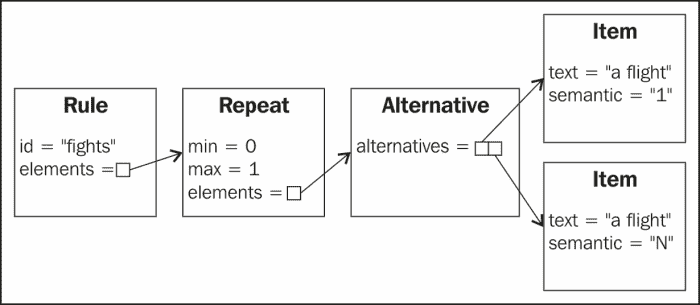
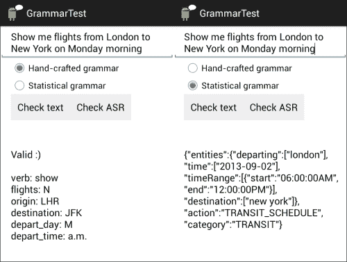

# 第六章：对话语法

你可能已经注意到，在前一章中研究的表单填充对话中的输入被限制为单个单词和短语。本章介绍使用语法来解释更复杂的输入，并提取它们的意义。在商业应用中常用的两种语法是：对于可预测和定义良好的输入，使用手工制作语法；对于典型的对话语音中不太规则的输入，使用统计语法以获得更稳健的性能。

在本章结束时，你应该能够开发支持更广泛用户输入的应用程序，利用手工制作以及统计语法。

# 用于语音识别和自然语言理解的语法

语法在基于语音的应用程序中可以用于两个不同的目的，如下所示：

+   **语音识别**：在这种情况下，语法（也称为语言模型）指定识别器可以预期的单词和短语。例如，如果系统处理的是城市，它就不应该尝试识别数字。根据 W3C 定义的语音识别语法，可参考[`www.w3.org/TR/speech-grammar/`](http://www.w3.org/TR/speech-grammar/)，可以由开发者明确指定（手工制作语法），也可以从语言数据计算得出（统计语法）。语音识别语法有助于提高语音识别的准确性。

+   **自然语言理解**：这个想法是获取识别器的输出，并为单词分配语义解释（或意义）。这可以通过几种方式完成。一种方法是确定句子的结构（句法分析），然后为这个结构分配语义解释（或意义）。或者，也可以不经过句法分析阶段，直接从句子中提取语义解释。

目前，谷歌语音识别 API 不支持开发者指定的语法用于语音识别，唯一可用的语言模型是内置的`LANGUAGE_MODEL_FREE_FORM`和`LANGUAGE_MODEL_WEB_SEARCH`。在本章将要介绍的应用程序中，我们将像前几章一样进行语音识别，然后过滤识别结果，只保留符合语法的那些结果，并使用它们来获取用户输入的语义解释。

### 提示

**你也可以尝试…**

尽管目前在 Android 的`RecognizerIntent`中还不能使用语法，但可以使用第三方选项。访问我们的网页以获取更多详细信息。

# 使用手工制作语法的 NLU

设计语法需要预测用户可能说的不同内容，并创建规则来涵盖这些内容。语法设计是一个迭代过程，包括创建初始语法、收集数据以测试语法对实际用户输入的适应性、添加一些短语和删除其他短语，等等，直到语法的覆盖面尽可能完整。有许多工具可以帮助设计语法。例如，Nuance 提供了 Nuance 语法构建器，可以用来测试语法的覆盖范围，检查测试短语是否得到正确的语义解释，以及测试过度生成，即检测输入中不必要的或意外的短语（[`evolution.voxeo.com/library/grammar/grammar-gsl.pdf`](http://evolution.voxeo.com/library/grammar/grammar-gsl.pdf)）。

有不同的语言用于指定语音语法，最流行的是由 W3C 定义的 XML 和**增强 BNF**（**ABNF**），可在[`www.w3.org/TR/speech-grammar/`](http://www.w3.org/TR/speech-grammar/)获取，**Java Script 语法格式**（**JSGF**），被 Java 语音 API 使用，以及**语法规范语言**（**GSL**），这是 Nuance 专有的格式。

在本章中，我们将使用 XML 格式，并介绍一个能够解析简单 XML 语法以用于类似于前一章研究的表单填充对话的库。开发完整的 XML 语法处理器超出了本书的范围，但关于它应该具有的功能的更多信息可以在 W3C 语音识别语法规范中找到，该规范可在[`www.w3.org/TR/speech-grammar/#S5`](http://www.w3.org/TR/speech-grammar/#S5)获取。

下面的简单语法使用了一些来自 XML 语法格式的标签。这个语法可以识别句子*show flights to London*：

```kt
<grammar root = "flight_query">

<rule id = "flight_query"> 
    <item>show</item> 
    <item>flights</item> 
    <ruleref uri = "destination" />
</rule>

<rule id = "destination"> 
    <item> to London </item> 
</rule>

</grammar>
```

如所见，语法是按规则组织的。`<grammar>`标签指明了语法的起始元素（或根），标记为`flight_query`。`<grammar>`标签后的第一个规则必须与根元素同名。这个规则包含两项：单词`show`和单词`flights`，涵盖了要处理字符串的前两个词。第三部分是对另一个名为`destination`的规则的引用`<ruleref>`。这个规则包含了词组`to London`。因此，通过应用从根开始的规则，我们可以处理字符串*show flights to London*。

规则引用在存在多个选择时很有用；在这种情况下，有多个可选的目的地。`<one-of>`标签允许指定可选项目。因此，例如，我们可以如下扩展目的地规则：

```kt
<rule id = "destination"> 
    <one-of>
          <item> to London </item>
          <item> to Paris </item> 
          <item> to New York </item> 
    </one-of> 
</rule>
```

实际上，由于单词 *to* 在此规则的所有短语中都是通用的，我们可以创建一个进一步的城市词汇规则引用，如下面更广泛的语法所示。通过这种方式，可以创建复杂的规则层次结构，以指定广泛可能的输入。

有时，单词或短语可能是可选的，或者可能重复多次。`repeat` 属性允许使用以下规格进行重复，其中 `n` 和 `m` 是自然数：

```kt
<item repeat="n">        The item repeats n times
<item repeat="n-m">      The item repeats from n to m times
<item repeat="m-">       The item repeats at least m times
```

例如，对于一个五位数的邮政编码，项目应该如下所示：

```kt
<item repeat="5"><one-of><item>0</item><item>1</item> …<item>9</item></one-of></item>
```

`<item repeat="0-1">` 指示某个项目是可选的。在以下语法中，`flight_query`、`flights` 和 `time` 规则指定了可选元素。这意味着有效的输入只需要 `origin`、`destination` 和 `depart_day`，其他信息是可选的。

给定各种标签和属性的组合，我们可以创建一个语法，允许如下输入：

+   我想要周一早上从巴黎飞往纽约的航班

+   让我看看周二从伦敦飞往巴黎的航班

+   周一下午从纽约飞往伦敦

+   周三从巴黎飞往伦敦

以下是可用于处理这些及其他广泛替代输入的语法：

```kt
<grammar root="flight_query">

<rule id="flight_query">
    <ruleref uri="verb"/> 
    <ruleref uri="flights"/> 
    <ruleref uri="origin"/> 
    <ruleref uri="destination"/>
    <ruleref uri="depart_day"/>
    <ruleref uri="depart_time"/>
</rule>

<rule id="verb">
      <item repeat="0-1">
        <one-of>
                <item><tag>show</tag>Show me</item>
                <item><tag>show</tag>I would like</item>
                <item><tag>show</tag>Are there any</item>
        </one-of>
    </item>
</rule>

<rule id="flights">
      <item repeat="0-1">
          <one-of>
                <item><tag>1</tag>a flight</item>
                <item><tag>N</tag>flights</item>
          </one-of>
    </item>
</rule>

<rule id="origin"> <item>from</item> <ruleref uri="city"/> </rule>
<rule id="destination"> <item>to</item> <ruleref uri="city"/> </rule>
<rule id="depart_day"> <item>on</item> <ruleref uri="day"/> </rule>
<rule id="depart_time"> <ruleref uri="time"/> </rule>

<rule id="city">
    <one-of>
          <item><tag>LHR</tag>London</item>
          <item><tag>CDG</tag>Paris</item>
          <item><tag>JFK</tag>New York</item>
    </one-of>
</rule>

<rule id="day">
    <one-of>
          <item><tag>M</tag>Monday</item>
          <item><tag>T</tag>Tuesday</item>
          <item><tag>W</tag>Wednesday</item>
    </one-of>
</rule>

<rule id="time">
    <item repeat="0-1">
          <one-of>
                <item><tag>a.m.</tag>morning</item>
                <item><tag>p.m</tag>afternoon</item>
          </one-of>
    </item>
</rule>

</grammar>
```

`<tag>` 用于返回与输入中识别的单词不同的项目的值。这对于处理同义词很有用，在这种情况下，具有相同意义的单词应该返回一个单一的值，而不是返回识别的文本字面值，或者返回在应用程序其他组件中更有用的值。以下是一个简单的例子：

```kt
<item><tag>M</tag>Monday</item>
```

在这里，如果处理单词 `Monday`，则返回值 `M`。

更一般地，应用程序可能不需要对输入的完整转录就能进行进一步的处理，因为使用 `<tag>` 标签的某些中间（语义）表示可能就足够了，甚至可能更有效。通常，语义解释标签遵循 W3C 在 [www.w3.org/TR/semantic-interpretation/](http://www.w3.org/TR/semantic-interpretation/) 提出的格式，它被解析和处理为 ECMAScript 对象。这意味着可以在语义标签中包含小段代码。

在本章中，我们将通过指定纯文本标签来进行非常简单的语义处理。例如，在上述语法中，我们包含了指定每个城市主要机场代码的标签，以便当句子包含 *to Paris* 时，`destination` 的语义解释是 *CDG*（查尔斯·戴高乐机场的代码），而 `departure_time` 的语义解释是 *p.m* 如果用户说 *in the afternoon*。

# 统计自然语言理解

手工制作的语法耗时长，容易出错。开发具有良好覆盖范围和优化性能的语法需要相当的语言学和工程专业知识。此外，手工制作语法的规则不能轻松应对自然口语中不规则输入的特点。例如，对于识别出的单词*I would like a um flight from Paris to New York on Monday no Tuesday afternoon*，由于*um*和*no*在规则中没有指定，我们的语法将失败。

统计语法是手工制作语法的替代品。统计语法是从数据中学习得到的，涉及收集和注释大量相关的语言数据。统计语法能够处理不规则输入，因为它们不需要与输入完全匹配，而是分配概率，表明结构或语义解释与输入的匹配程度。统计语法有不同类型。出于本章的目的，我们感兴趣的是一种语法，它可以根据文本字符串的输入或语音识别组件的结果返回语义解释。

统计语法的缺点之一是它们需要大量的训练数据。尽管已经为各种现实世界应用收集了语言数据语料库，但这些数据并不公开可用，而且对于个别开发者来说，购买它们的成本是难以承受的。即使数据可用，也需要付出相当大的努力来注释和训练语法。目前，针对统计语义语法的 API 很少，但一种可能性是由**Maluuba**公司提供的网络服务（[www.maluuba.com](http://www.maluuba.com)），该公司为 Android 设备开发了一个同名的个人助手以及用于其统计语义语法的 API。

Maluuba API（称为`nAPI`）从输入中提取三种类型的信息，如下所示：

+   **类别**：它表示句子的主题，例如天气、旅行、娱乐和导航。目前，它涵盖了 22 个类别。

+   **动作**：它解释了在类别中要完成的特定动作或意图，例如，天气有诸如`WEATHER_STATUS`检查天气和`WEATHER_DETAILS`获取风速和湿度等详细天气信息的动作。

+   **实体**：它提供了必须提取的关键信息，例如位置、日期范围和时间。

结果以结构化对象的形式返回。以下是示例：

**用户输入**：明天贝尔法斯特的天气如何

**Maluuba**：`{"entities":{"dateRange":[{"start":"2013-05-09","end":"2013-05-10"}],"location":["belfast"]},"action":"WEATHER_STATUS","category":"WEATHER"}`

请注意，除了识别类别、动作和实体外，语法还解决相对引用，如 *tomorrow*（此示例于 2013 年 5 月 8 日提交）。此外，只要能从输入中识别实体，输入不必完全符合语法规则。因此，像 *Weather Belfast tomorrow* 这样的句子将返回相同的结果。

## NLULib

我们实现了一个自然语言理解库，其中包含处理手工艺和统计语法的类和方法。我们创建了 NLU 类 (`NLU.java`) 来封装这两者，但它们也可以单独处理。

## 处理 XML 语法

`HandCraftedGrammar.java` 包含了用于解析 XML 语音语法的方法，检查一个短语在语法中是否有效，以及获取其语义表示。我们考虑了 XML 格式中标签的一个子集，具体如下：

| 标签 | 描述 | 可可能的子标签 | 可能的属性（带*的属性为必填项） |
| --- | --- | --- | --- |
| `<grammar>` | 指定最高级别的容器 | `<rule>` | root* |
| `<rule>` | 指定单词和短语的有效序列和结构 | `<one-of><item><ruleref>` | id* |
| `<one-of>` | 指定一组替代项 | `<one-of><item><ruleref>` |  |
| `<item>` | 指定有效的序列，包含字面量和语义标签 | `<tag><one-of><item><ruleref>` | repeat |
| `<tag>` | 以字面形式指定语义信息 |  |  |
| `<ruleref>` | 指定对另一条规则的引用 |  | uri* |

构造函数将 XML 解析为 Java 对象（请参阅代码包中 `sandra.libs.nlu.nlulib.HandCraftedGrammar` 的 `parse` 方法），并将语法转换为正则 Java 表达式（请参阅代码包中 `sandra.libs.nlu.nlulib.HandCraftedGrammar` 的 `computeRegularExpression`）。

`parse` 方法使用 `XmlPullParser` 将 XML 代码读取到对象中，类似于前一章开发的 VXML 解析器，但使用数组来跟踪嵌套项，因为在这种情况下，我们可以有相同的标签嵌套（例如，请参阅前面提到的 `flights` 示例，其中几个 `<item>` 标签包含在另一个 `<item>` 标签内）。

在此情况下，我们创建了类 `Alternative`、`Item`、`Rule`、`Repeat` 和 `RuleReference`，分别用于保存解析 `one-of`、`不带重复参数的 item`、`rule`、`带重复参数的 item` 和 `rule-ref` 标签的结果。`GrammarElement` 类被定义为一个超类，以便当某个类拥有其他元素的集合时，可以使用 `GrammarElement` 类作为通配符。例如，`Alternative` 类包含一个表示不同可用选择的 `GrammarElement` 集合。

解析的结果是一组 `Rule` 对象的集合，作为 `HandCraftedGrammar` 类的属性保存。规则保存在一个 `HashMap` 中，其键是它们的 ID。例如，解析示例语法中的 flights 规则得到的结构在下图中表示。注意，为了简化生成便于语义解析的正则表达式，我们在识别过程中不是实时处理语法，而是在识别开始前将其解析为 Java 对象：



在此阶段，`HandCraftedGrammar` 构造函数通过 `parse` 方法将 XML 语法解析为 Java 对象。然后，它使用这些对象通过 `computeRegularExpression` 方法计算代表语法的正则表达式。正则表达式是表示同样信息的另一种方式，但它们的优势在于我们可以直接使用 `java.util.regex` API 中的 `Pattern` 和 `Matcher` 类将用户输入的句子与语法进行匹配（该 API 的教程可以在 [`docs.oracle.com/javase/tutorial/essential/regex/`](http://docs.oracle.com/javase/tutorial/essential/regex/) 找到）。

将 Java 对象作为 XML 与正则表达式之间的中间步骤，使得处理大量的嵌套元素和规则引用变得更加容易，并允许从最简单的项开始，以自底向上的过程生成正则表达式，直至最复杂的规则。

`computeRegularExpression` 方法（见代码包）通过为每个元素调用 `getRegExpr()` 方法获取与根规则及其所有引用规则相对应的正则表达式。这个方法将 `GrammarElement` 中包含的信息转换为正则表达式语法。例如，前一个图结构的转换结果是 `( (a flight) | (flights) ) {0, 1}`。

`RuleReference` 对象的情况比较特殊，因为它们是使用通配符 "`xxREFurixx`" 进行转换的，其中 `uri` 是被引用的规则名称。例如，`depart_day` 规则被转换为 `xxREFtimexx`。

`HandCraftedGrammar` 类中的 `solveReferences` 方法用于解决所有引用。为此，从根开始逐步解析引用，获取整个语法的正则表达式。完整语法的解析结果如下：

```kt
(((Show me)|(I would like)|(Are there any)){0,1})(((a flight)|(flights)){0,1})(from ((London)|(Paris)|(New York)))(to ((London)|(Paris)|(New York)))(on ((Monday)|(Tuesday)|(Wednesday)))((((morning)|(afternoon)){0,1}))
```

此方法还跟踪语义标签。最初，它们被分配到对应的项，例如，语义表示 `JFK` 被分配到其对应的项目。然而，为了能够解释（即分配给 `city` 然后是 `destination`），它们必须分配给对应的规则。为此，我们使用了 `SemanticParsing` 类，它允许将标签与规则关联。

由于正则表达式将是用于检查传入短语有效性的唯一机制，并且会失去规则的结构，`SemanticParsing`类具有一个位置属性，该属性允许我们确定应该与触发标签的文本匹配的正则表达式的组。

Java 正则表达式使得`GrammarElement`的不同子类能够获取由括号分组元素的局部匹配结果，例如，在之前的正则表达式中，整个匹配的句子位于位置 0，`(((Show me)|(I would like)|(Are there any)){0,1})`位于位置 1，`((Show me)|(I would like)|(Are there any))`位于位置 2，`(Show me)`位于位置 3，`(Are there any)`位于位置 5，而`(on ((Monday)|(Tuesday)|(Wednesday)))`位于位置 20。

我们使用`SemanticParsing`对象来匹配每个这些组中的语义标签。这样，`depart_time`规则的`SemanticParsing`对象表示匹配组位于第 20 位，如果表达式是`on Monday`，则语义为`M`；同理，`T`代表`on Tuesday`，`W`代表`on Wednesday`。

因此，对于句子*Show me flights from Paris to New York on Tuesday morning*的语义表示如下：

```kt
Verb: Show
Flights: N
Origin: CDG
Destination: JFK
Depart_day: T
Depart_time: a.m.
```

`obtainSemantics`方法（参见代码包中的`HandCraftedGrammar.java`）用于检查输入是否与语法匹配，如果匹配，它的语义表示是什么。如果语法尚未初始化，即尚未计算语法的正则表达式（例如，在构造函数中语法的格式存在问题），此方法将引发异常。

为了验证传入的短语，我们使用 Java 匹配器自动检查该短语是否与正则表达式兼容。为此，我们忽略空白并使用小写，如下面的代码片段所示：

```kt
Pattern p = Pattern.compile(grammarRegExpression.replaceAll("\\s","").toLowerCase());
Matcher m = p.matcher(utterance.replaceAll("\\s","").toLowerCase());
```

然后，我们使用 Java 类`Matcher`的`groupCount`和`group`属性来获取与正则表达式中每个组匹配的短语，其中每个组是括号之间的模式。此信息随后与`SemanticParsing`对象中保存的语义信息和预期位置进行比较，并将语义表示保存在`obtainSemantics`方法的输出字符串中。

## 处理统计语法

要使用 Maluuba，您需要注册一个开发者账户。访问 Maluuba 的开发者网站（[`dev.maluuba.com/`](http://dev.maluuba.com/)），点击**立即注册并获得 API 访问权限**的标签。注册与 Google、Facebook 或 GitHub 账户关联。填写表格后，您将被引导至一个可以创建应用程序的页面。点击**创建应用程序**，系统会要求您输入**应用程序名称**和**应用程序描述**。出于当前目的，可以输入一些简单的内容，例如，将**应用程序名称**设为`flights`，并输入一些文本作为描述，然后您将获得一个 API 密钥。现在您可以使用这个密钥向 Maluuba 发送自然语言查询，可以通过浏览器或 Android 应用程序发送。按照以下步骤通过浏览器测试 API 的访问：

```kt
http://napi.maluuba.com/v0/interpret?phase=I would like a flight from belfast to london on Monday&apikey= <your apikey>
```

`NLU.java`向 Maluuba 发送一个字符串以获得语义解释。您可以更改`KEY`属性以使用您的开发者密钥。为了访问语法，它使用了前一章描述的`XMLLib`，因此可以通过异步任务安全地访问 URL。

结果作为字符串传递给调用方法。例如，对于短语*I would like to go to London*，它会返回以下值：

```kt
{"entities":"destination":["London"]},"action":"NAVIGATION_DIRECTIONS","category":"NAVIGATION"}
```

# GrammarTest 应用程序

`GrammarTest`应用程序（`sandra.examples.nlu.grammartest`）展示了如何使用`NLULib`。它有一个简单的图形用户界面，用户可以选择要使用的语法类型（手工制作或统计），还可以选择**检查文本**或**检查语音识别**按钮，以获得输入内容的语义表示。

在**检查文本**的情况下，输入是通过键盘在`TextView`框中输入的。在**检查语音识别**的情况下，应用程序识别口语输入并为 10 个最佳列表生成结果。

在手工制作语法的情况下，将从指定位置读取 XML 语法。默认使用的语法是之前展示的那个。如果输入（输入文本或 N 个最佳结果中的每一个）在语法中，它会显示有效消息和语义表示；如果不是，它会显示无效消息（这些消息不是硬编码的，而是从`Strings`文件中获取的）。

在统计语法的情况下，使用 Maluuba 服务。在这种情况下，我们不限制输入，因此所有短语都被视为有效，并为它们中的每一个显示语义解释。

这个应用程序对于希望熟悉语法设计过程的开发者非常有用。下图展示了使用手工制作（左）和统计（右）语法的应用程序的两个屏幕截图：



# 概述

本章展示了如何创建并使用语法来检查用户的输入是否符合应用程序所需的词汇和短语。语法还用于从用户输入中提取对应用程序相关的概念的语义表示。介绍了两种类型的语法：一种是开发者手工设计的语法，以匹配应用程序的需求；另一种是从大量相关数据中学习得到的统计语法。手工设计的语法适用于可预测和定义良好的输入，而统计语法能提供更健壮的性能，并能处理可能不太规范的一广泛输入范围。

迄今为止的章节中，示例都假设使用的语言是英语，界面仅为语音。在第七章，*多语言和多模态对话*中，我们将探讨如何构建除了英语之外使用其他语言，并且在语音之外使用其他模态的应用程序。
