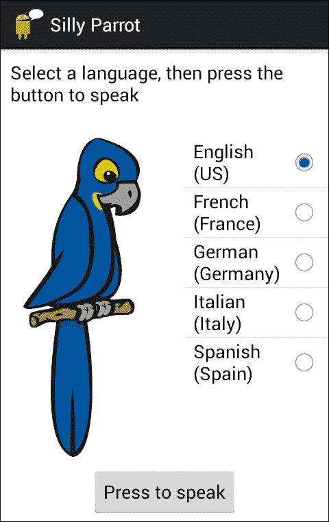
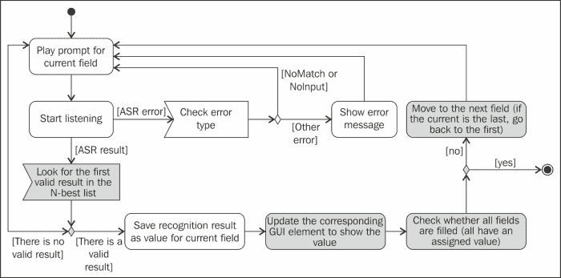
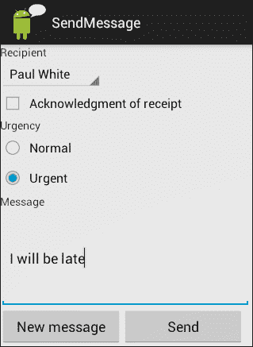
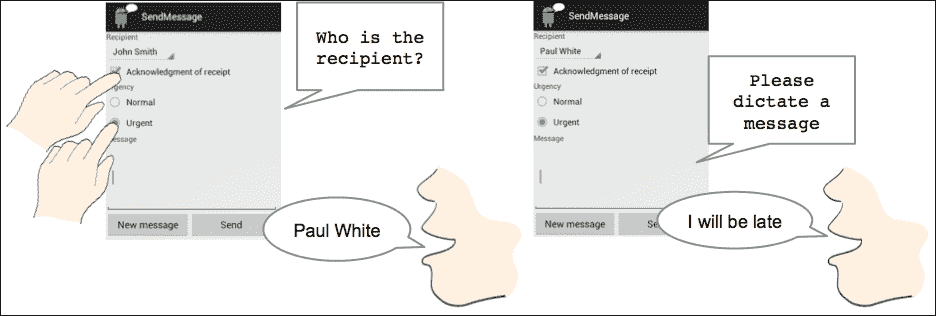

# 第七章：多语言和多模态对话

到目前为止，所有示例中使用的语言都是英语，交互方式主要是语音。本章展示了如何将其他语言整合到应用程序中。该章节还探讨了如何构建利用多种模态的应用程序，例如，将语音与视觉显示结合使用。

# 多语言性

在第二章，*文本到语音合成*和第三章，*语音识别*中，我们已经提供了基础工作，使你能够轻松地开发多语言应用程序。使用`TTSLib`库（第二章，*文本到语音合成*）你可以指定用于语音合成的语言。现在我们只需要对`ASRLib`（第三章，*语音识别*）进行一些小改进，使其接受不同的语言进行语音识别（最初设置为设备的默认语言）。为此，我们在代码包中创建了`ASRMultilingualLib`（在`sandra.libs.asr.asrmultilinguallib`中）。

我们不能期望用户实现的语音识别中所有语言都可用。因此，在设置语言之前，有必要检查它是否是支持的语言之一，如果不是，则设置当前的首选语言。

为此，发送一个`RecognizerIntent.ACTION_GET_LANGUAGE_DETAILS`有序广播，它返回一个 Bundle，从中可以提取有关首选语言（`RecognizerIntent.EXTRA_LANGUAGE_PREFERENCE`）和支持的语言列表（`RecognizerIntent.EXTRA_SUPPORTED_LANGUAGES`）的信息。这需要对`ASR.java`文件进行一些修改，在`ASRMultilingualLib`库中。

现在，在`listen`方法中，会检查以确保所选语言在语音识别器中可用，然后调用新的`startASR`方法。

`startASR`方法基本上包含了与库的前一个版本中的`listen`方法相同的代码，在那里创建了`RecognizerIntent`以开始监听。然而，它引入了一个新的参数，用于指定识别所使用的语言，如下面的代码行所示，该代码行从`startASR`方法中调用：

```kt
  intent.putExtra(RecognizerIntent.EXTRA_LANGUAGE, language);
```

### 提示

要检查设备上可用的语言，你可以点击**谷歌语音搜索/语音搜索设置**，然后点击**语言**查看完整列表。相应的代码是两个字母的小写 ISO 639-1 语言代码，如[`en.wikipedia.org/wiki/List_of_ISO_639-1_codes`](http://en.wikipedia.org/wiki/List_of_ISO_639-1_codes)所示。

`listen`方法已经进行了更改，以检查语言的可用性。为此，它使用了广播的意图`RecognizerIntent.ACTION_GET_LANGUAGE_DETAILS`。为了处理广播，`ASRMultilingualLib`引入了两个新类：`LanguageDetailsChecker`，它是`BroadCastReceiver`，以及`OnLanguageDetailsListener`，这是一个接口，用于指定处理广播结果的方法。这些类来自`gast-lib`项目（[`github.com/gast-lib`](https://github.com/gast-lib)），并在*Greg Milette*和*Adam Stroud*所著的《Professional Android™ Sensor Programming》一书中进行了描述，*Wrox*, *2012*。在`listen`方法中，创建并发送了广播意图，并使用`OnLanguageDetailsListener`接口指定在处理广播后应执行的操作。在我们的例子中，会检查语言是否与任何可用的语言匹配，然后开始识别。

在对`ASRLib`进行了上述描述的更改之后，我们就可以开发用户指定语音识别和合成语言的应用程序了。作为一个示例，我们开发了`SillyParrot`应用，如下所示。它要求选择一种语言，并在识别用户需求后，用所选语言播放最佳匹配的内容。



尝试了`SillyParrot`应用后，你可能已经注意到在选择其他语言后，GUI 仍然显示英文，这有些奇怪。我们将在多模态部分进一步讨论应用程序视觉和口语部分的同步，但现在我们将先确保它们使用同一种语言。为了做到这一点，我们将利用`res`文件夹，其中包含`xml`文件，这些文件包含可以从活动引用的信息。

实现对不同语言响应的应用程序的过程通常被称为应用程序的本地化。本地化中的一个主要问题是提供不同语言的文本信息，但图片、布局和其他资源也可以进行本地化（请查看本网页上的教程，了解一个包含本地化图片的示例：[`www.icanlocalize.com/site/tutorials/android-application-localization-tutorial/`](http://www.icanlocalize.com/site/tutorials/android-application-localization-tutorial/)）。为此，需要将文件包含在指定语言代码的特定目录中。

如果设备的地区设置为`es-ES`，并且代码引用了字符串`R.string.mymessage`，Android 将按照以下顺序在以下目录中查找它：

1.  `res/values-es-rES/strings.xml`

1.  `res/values-es/strings.xml`

1.  `res/values/strings.xml`

因此，如果你在墨西哥，而设备的默认地区设置为`es-MX`，那么它不会匹配来自西班牙的默认西班牙语（选项 1），但会匹配通用西班牙语（选项 2）。如果你在芝加哥，设备的地区设置为`en-US`，那么它会尝试在默认目录（选项 3）中找到字符串。

### 注意

**不要忘记默认资源！**

我们不能期望所有地区设置都能在用户的设备上使用（具体解释请见[`developer.android.com/reference/java/util/Locale.html`](http://developer.android.com/reference/java/util/Locale.html)），因此，不要忘记默认资源非常重要，因为当没有为所需地区设置提供 xml 文件时，Android 将从`res/values/`加载它们。

一个好的设计实践是将所有目标语言的的消息包含在默认文件夹中，这是我们预计大多数用户会使用的语言，然后尽量为其他语言创建尽可能少的资源文件。

例如，如果我们确定应用必须支持以下语言：美国和加拿大使用的英语，美国使用的西班牙语，以及加拿大使用的法语，以美国英语为主要语言。在这种情况下，美国英语的字符串应该放在默认文件夹（`res/values/strings.xml`）中。然后，只有在加拿大英语中不同的特定消息才会被包含在`res/values/en-rCA/strings.xml`文件夹中，因此无需为这两个地区复制所有字符串。西班牙语和法语也是类似处理，可以包含在`res/values-ES/`和`res/values-fr/`文件夹中，如果需要考虑其他变体，则后来可以本地化为`res/values-es-rUS`或`res/values-fr-rCA/`。Android 提供了一个清单，以规划如何本地化你的应用，你可以在这里找到：[`developer.android.com/distribute/googleplay/publish/localizing.html`](http://developer.android.com/distribute/googleplay/publish/localizing.html)。注意在创建目录时，在国别代码前加上`r`，并使用`-`代替`_`。

在`Parrot`应用中，我们通过自动适应设备地区设置（`Locale.getDefault().getDisplayLanguage();`）改进了`SillyParrot`，这一做法符合前文所述的结构。请查看代码包中的项目目录结构。在 Android 开发者指南（[`developer.android.com/guide/topics/resources/localization.htm`](http://developer.android.com/guide/topics/resources/localization.htm)）中有示例说明如何在不同语言中测试本地化应用，不过你需要使用物理设备尝试不同的语言来测试语音识别部分。

# 多模态

如果一个应用使用了多种输入和/或输出方式，它可能被认为是多模态的。从这个意义上说，本书中介绍的所有应用都是多模态的，因为它们既使用了语音，也使用了图形用户界面进行输入或输出。

然而，在之前的例子中，模态并没有同步或用于提供处理相同信息片段的替代方式。例如，在第五章《*表单填充对话*》中的 `MusicBrain` 应用程序，输入是口头的，输出是视觉的，在本章中描述的 `SimpleParrot` 应用程序中，输入和输出都是口头的（需要语音识别和合成）和视觉的（选择语言和输入中的 **按下说话** 按钮以及输出的 **通知** ），但它们对应于界面中的不同元素。

在本节中，我们将介绍如何开发多模态应用程序，在这些应用程序中，模态可以无缝结合以输入或输出数据，因此用户可以在特定时间选择最方便的模态。

为此，我们在第五章《*表单填充对话*》中展示的 `FormFillLib` 库基础上进行构建，通过考虑语音字段与 GUI 中不同元素的同步来增强它。这样，用户可以通过点击或使用语音来填充 GUI 中的所有不同元素。

主要思想是在语音表单中的字段与 GUI 中的不同元素之间建立对应关系。我们已经考虑了以下表格中显示的语音和 GUI 元素的组合，以便当一个元素对中的元素被填充时，另一个元素相应地被赋值。例如，如果用户被提示选择一个选项并且口头这样做，GUI 中的相应单选按钮或列表中的元素将被选中。同样，如果在单选按钮或列表中选择了元素，用户将不会被口头询问。

| 描述 | 语音字段 | GUI 元素 |
| --- | --- | --- |
| 开放输入，用户可以书写长文本或口头提供 | 可以直接使用谷歌语音识别器的结果 | 文本字段 ( `EditText`) |
| 受限输入，用户可以在备选选项之间选择 | 应该使用手工制作的语法来限制选项 | 单选按钮组 ( `RadioGroup`) 或列表 ( `ListView` 或 `Spinner`) |
| 受限的 `yes`/`no` 类型输入 | 应该使用手工制作的语法来限制选项为 `yes`/`no` 及其等价物（例如，`true`/`false`） | 复选框 (`CheckBox`) |

从表中可以观察到，引入语法很重要，因为语音输入必须只接受 GUI 提供的选项。这就是为什么我们在第五章《*表单填充对话*》中展示的 VXML 解析器功能也增加了对语法的考虑。

为了实现这一目标，新的`MultimodalFormFillLib`库（参见代码包中的`sandra.libs.dm.multimodalformfilllib`）相较于`FormFillLib`库进行了几处修改，这些修改在代码包中的注释里也有说明。下一张图展示了如何在新库中解释口头对话的活动图。阴影部分是相较于第五章，*表单填充对话*中介绍的解释器的主要变化。



如前图所示，在`MultimodalFormFillLib`库中，并不是所有识别结果在所有情况下都被认为是有效的。如果我们查看之前引入的表格；如果语音字段对应于 GUI 中的单选按钮、复选框或列表，我们应该将字段的合法值限制为提供的选项。例如，如果我们的应用程序提供了一个包含巧克力、香草和草莓口味的冰淇淋选择列表，那么当询问用户他更喜欢哪种口味时，唯一有效的识别结果应该是这三种之一。这样，用户可以在屏幕上选择口味，或者口头说出口味，应用程序将自动更新另一种模态（填写语音字段或分别在 GUI 中选择选项）。

这个限制是通过语法实现的。现在，每个字段都包含有关其语法的详细信息（如果已指定的话，例如对于没有输入限制的文本字段，则无需指明语法）。当`DialogInterpreter`访问该字段时，如果存在语法，则只有语法中有效的识别短语才会被考虑；如果不是，则被视为不匹配。

### 注意事项

为了简化，我们只根据语法判断值是否有效，而不考虑其语义价值。然而，如果`Field`类中的`isValid`方法不仅仅计算布尔值，而是以某种方式处理语义（例如，遵循第六章，*对话语法*中提出的指导方针），这是可以实现的。

在`VXMLParser.java`文件中，我们包含了`<grammar>`作为可能要解析的标签。此标签有一个必填的`src`属性，指明其位置。当解析器遇到该标签时，它会调用`Field`类中的`setGrammar`方法，将语法`src`作为参数传递。在`Field.java`中，我们包含了获取语法的 XML 内容的方法以及解析和查询它们的方法。`setGrammar`方法调用`retrieveGrammar`，后者访问`url`（`src`属性包含一个 URL）或从`assets`文件夹中读取语法（`src`属性仅包含语法的名称），并以字符串形式获取内容。然后`processXMLContents`方法使用第六章开发的`NLULib`库初始化手工制作的语法。*对话语法*。如果没有为特定字段指定语法，则任何识别结果都无需后续过滤即可接受。

我们在`Field.java`文件中增加了一个名为`isValid`的方法，该方法可以用来检查一个短语在语法中是否有效。当不使用语法时，无论值如何，`isValid`方法都返回`true`。

所述行为在`DialogInterpreter`类的`processAsrResults`方法中编码，我们在这其中包含了检查识别器获得的 N-best 列表中的任何识别结果在语法中是否有效的代码。如果有效，则流程移动到下一个字段；如果无效，则保持在同一字段。

在前面的章节中使用语音界面时，用户无法删除他已经提供信息的字段。在使用多模态界面时，情况并非如此，因为用户可以在 GUI 中更改已提供的项目。我们更改了`DialogInterpreter`类中的`moveToNextField`方法，因此对话结束的条件不是访问了所有字段，而是所有字段都已填写（其值不为`null`）。检查表单中所有字段是否已填写的方法（`allFieldsFilled`）已包含在`Form`类中。同时，它将字段列表视为循环的，以便在遇到最后一个字段时，如果有未填写的字段，它将继续从第一个字段开始。

既然语法已准备好被考虑，我们可以看看多模态。我们创建了`MultimodalDialogInterpreter`类，它是`DialogInterpreter`的一个子类，包含一系列`MultimodalElement`对象。这些对象包含必须同步的口语和 GUI 字段对。

首先，我们确保口头部分的更改对 GUI 产生影响。每次口头填写一个字段时，都会调用`oraltoGui`方法（在`DialogInterpreter`中是抽象的，在`MultimodalDialogInterpreter`中实现），以在 GUI 中显示其值（请参见`DialogInterpreter`中的`processResults`方法）。此方法检查与口头字段对应的视觉元素的类型，并通过调用相应的方法相应地显示信息。在列表视图和下拉菜单中选择一个项目，在单选组中选中一个单选按钮，在文本字段中写入文本，或者选中或取消选中复选框，如前表所示，展示了语音字段和 GUI 元素的组合。

其次，我们确保视觉部分的更改对口头部分产生影响。因此，如果在 GUI 中填写了一个元素，应用就不应该口头询问。在`MultimodalDialogInterpreter`类中调用`guiToOral`方法，将来自 GUI 的值保存到口头字段中。

下面以`MultimodalFormFillLib`的用途为例，我们展示了`SendMessage`应用，如图所示，用户可以通过口头、使用图形用户界面（GUI）或两者结合的方式填写一些信息。这是一个模拟应用，因为它不会从用户的联系人列表中读取联系人，也不会发送任何消息，因为本章的重点在于接口。然而，根据这里提供的说明：[`developer.android.com/training/contacts-provider/retrieve-names.html`](http://developer.android.com/training/contacts-provider/retrieve-names.html)，使用`SMSManager`发送短信，或者使用带有`ACTION_SEND`和`EXTRA_EMAIL`的 Intent 发送电子邮件，只需更改`SendMessage.java`文件中的`populateContactList`和`sendMessage`方法的实现即可完成这些功能。



`SendMessage`应用从`assets`文件夹中读取包含口头对话结构的`VXML`文件，如下代码所示：

```kt
  <form>

  <field name="contact">
  <prompt>Who is the recipient?</prompt>
  <grammar src="img/contact_grammar.xml"/>
  <noinput> Sorry, I could not hear you </noinput>
  <nomatch> Sorry, I did not understand what you said. Please say the name of one of your contacts </nomatch>
  </field>

  <field name="ack">
  <grammar src="img/ack_grammar.xml"/>
  <prompt>Do you need acknowledgment of receipt?</prompt>
  <noinput> Sorry, I could not hear you </noinput>
  <nomatch> Sorry, I did not understand what you said </nomatch>
  </field>

  <field name="urgency">
  <grammar src="img/urgency_grammar.xml"/>
  <prompt>Is the message urgent or normal?</prompt>
  <noinput> Sorry, I could not hear you </noinput>
  <nomatch> Sorry, I did not understand what you said </nomatch>
  </field>

  <field name="message">
  <prompt>Please dictate the message</prompt>
  <noinput> Sorry, I could not hear you </noinput>
  </field>

  </form>
```

从`VXML`文件和 GUI 中可以观察到，需要从用户那里获取四部分信息：收件人、是否需要回执确认、消息的紧急性（正常或紧急）以及要发送的消息。我们使用了所有支持的不同的 GUI 元素。如 VXML 代码所示，除了`message`字段外，所有字段都分配了语法。`contact_grammar`接受联系人名称，`ack_grammar`接受可以翻译为布尔值的短语，如`yes`、`no`、`true`或`false`，`urgency_grammar`包含两个可能的值`normal`和`urgent`，而`message`字段没有指定语法，以便接受最佳识别结果，允许用户自由交谈。

VXML 也可以像在第五章，*表单填充对话*中那样从网络上读取，但由于它与 GUI 紧密耦合，所以它不太可能发生很大变化，因此可以更方便地存储在`assets`文件夹中。例如，我们考虑到口头输入的有效值与 GUI 中显示的视觉选项相同。在上一个截图中，单选按钮显示文本**正常**和**紧急**，因此，相应的口头字段只应接受值`urgent`和`normal`。开发者必须牢记，这对 VXML 和语法文件构成了相当大的限制。

`SendMessage`类是`MultimodalDialogInterpreter`的子类。在`onCreate`方法中，它调用了`initializeGUI`和`startDialog`方法。前者初始化所有的 GUI 元素，这些元素必须在它们的监听器中调用`guiToOral`方法（因为口头部分必须在 GUI 更改后进行更改）。后者解析口头形式，设置口头和视觉元素之间的对应关系（`setMultimodalCorrespondence`），并开始口头互动。口头对话控制互动的结束。当调用`processDialogResults`时，用户会被告知互动是否成功（在实际设置中，此方法会实际发送消息）。

请注意，口头部分将在读取并解析`vxml`文件后才会准备好。这就是为什么 GUI 必须等待这个过程完成后再尝试更新口头部分的原因。在设置 GUI 元素时（在`setContactList`、`setAckCheckBox`、`setUrgencyRadioGroup`和`setMessageEditText`中）考虑到了这一点。

下一个截图显示了一个与`SendMessage`应用互动的示例，其中 GUI 的最终状态如前一个截图所示。在示例中，用户选择接收回执确认并发送紧急消息。这些信息由系统保存在口头字段中。从截图中可以看出，用户并没有被口头询问这些信息。然后，用户说出收件人的名字。由于这是有效的联系人之一，因此它被接受并在 GUI 的相应选择列表中显示。

最后，用户输入信息，结果在 GUI 中显示，而不会像以下截图所示那样先通过语法进行过滤：



# 概述

本章展示了如何将除英语以外的语言集成到应用中，使用与不同地域设置相关的资源。我们还了解了如何同步口头和视觉模态，以便用户在与应用互动时可以结合使用它们。

在下一章中，我们将介绍如何设计虚拟个人助手，使其能在您的设备上进行对话并执行一系列任务。
