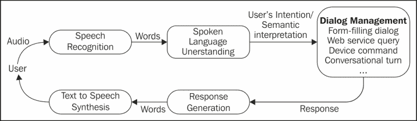
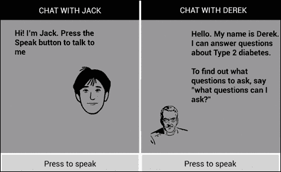

# 第八章：与虚拟个人助理的对话

在本章中，你将学习如何设计和开发三种类型的**虚拟个人助理**（**VPA**）；一种可以就一系列日常话题进行对话的交谈式伴侣，一种提供类型 2 糖尿病领域**常见问题解答**（**FAQs**）的专业 VPA，以及一种增强了执行搜索查询、控制设备应用和调用网络服务能力的交谈式伴侣。

在本章结束时，你应该了解开发每种类型 VPA 所需的内容。

# VPA 的技术要求

VPAs 通常能够执行以下任务：

+   与网络服务互动以获取信息并执行交易；通过搜索查询，链接到如知识图谱之类的知识库，或参与交易性对话以及启动和管理设备上的应用，如联系人、日历、短信或时钟。

+   就随机话题与用户进行对话，例如回答诸如*你住在哪里？*、*你多大了？*、*你说什么语言？*或*你喜欢什么类型的音乐？*等问题。VPA 需要为每个问题提供某种形式的回应，以使对话能够持续进行，即使它没有对问题的正确答案。

第四章中展示的`VoiceLaunch`应用，*简单语音交互*演示了如何在设备上启动一个应用，而第五章中展示的`MusicBrain`应用，*表单填充对话*展示了如何实现使用表单填充的交易性对话。第七章中的多模态应用，*多语言和多模态对话*展示了单模态以及多模态对话。然而，这些应用仅执行单一任务，而 VPA 执行一系列不同的任务。

对于虚拟个人助手（VPA）的挑战是从用户的语音中确定用户请求的任务。观察下面图中的数据流，我们知道如何使用语音识别来确定用户说出的单词（第三章, *语音识别*），以及给定一组要说的单词如何给出回应（第二章, *文本到语音合成*）。现在，我们需要弄清楚用户所说单词背后的意图，并组织 TTS 要说的单词。可以使用来自口语理解的技术来确定用户的意图，如第六章，*对话语法*所示，尽管在本章中我们将探讨一种替代技术。当我们在对话管理组件中查看回应是如何生成的时候，将解释提供 TTS 要说的单词。



## 确定用户意图

想象以下用户输入：

+   *我想预订一张飞往伦敦的机票。*

+   *明天的天气预报是什么？*

+   *明天早上 7.30 叫我起床。*

+   *你是什么类型的电脑？*

假设我们希望将这些输入映射到前一个图中的对话管理框列出的四个功能上。我们该如何操作？

一种方法是使用统计分类系统将开放式的用户输入分类到一组固定的类别中，如第六章中的统计语法所示，*对话语法*。这是大规模商业系统采用的方法。例如，故障排除应用程序可能会接收如下输入：

+   *我无法访问我的电子邮件*

+   *我上不了互联网*

+   *有一个小图标显示没有互联网访问*

尽管这些输入表达方式不同，但它们都可以被归类为与互联网连接相关的问题。创建这样的统计分类系统需要收集大量相关的语音数据，并确定一组固定的类别。识别出可以预测将语音分配给特定类别特征，如特定关键词或短语的出现，将使用机器学习技术来训练分类器。例如，短语如*访问我的电子邮件*或*上网*可以作为指示*互联网连接问题*类别的特征。

这种方法的优点是健壮性和覆盖面。由于匹配是统计的，因此可以对可能不完全匹配类别的输入进行分类。因此，即使是非语法输入或可以用不同方式表达输入，仍然可以分配给一个类别。手工制作语法来分类这种开放式的输入将是一项艰巨的任务，因为在这种情况下，匹配必须是精确的。

统计文本分类的缺点是，需要大量的话语样本来训练系统，因为表达同一件事情的方式有很多种。在一个大系统中，可能需要收集和注释成千上万种典型的话语才能提供足够的覆盖面。这是一个昂贵的流程；尽管一旦系统经过训练，通常会产生准确的结果。

第二种方法，在输入更有约束和可预测的情况下是可行的，即编写语法进行分类，使用第六章中展示的技术，*对话语法*，并将解析的输出设置为相关类的一个赋值以及相关的值。例如，在设置闹钟的命令中，将输出赋给设备的闹钟功能并提取时间和日期。然而，手工制作的语法也面临着覆盖面的问题，并且需要不断添加额外的规则来处理无法用现有规则解析的输入。

第三种方法是使用预定义的模式匹配输入。这种方法已成功应用于许多商业聊天机器人和虚拟个人助理的实现中。缺点是起初需要创建大量模式以匹配所有可能的输入，同样存在潜在覆盖不足的问题。

# 做出适当的响应

应用程序对用户输入的响应根据已识别的用户意图而有所不同，大致可以分为以下几类：

+   对于表单填充对话，需要启动对话，并可能需要几轮系统-用户交互来填充对话框架中必要的槽位，如第五章中所示，*表单填充对话*。

+   在涉及网络服务的情况下，响应将是对相关网络服务的调用，并提取一些文本由 TTS 朗读。

+   对于涉及激活设备特性的任务，如拨打电话或设置闹钟，执行命令并提取一些文本由 TTS 朗读。

+   最后，如果任务是进行对话，VPA 提供的对话响应是由本章介绍的应用程序中的 Pandorabots 聊天机器人系统生成的。

# Pandorabots

Pandorabots 是一个基于开源的免费网络服务，使开发人员能够在网上创建和托管聊天机器人（请见[`www.pandorabots.com/`](http://www.pandorabots.com/)）。目前，已有超过 221,000 个聊天机器人在此托管，涵盖多种语言。同时，还为商业开发提供了一项付费服务。许多移动设备上的 VPAs 都是使用 Pandorabots 创建的。这些包括 Pannous 的 Voice Actions（也称为 Jeannie）、Skyvi、Iris 以及 Pandorabots 自己的 CallMom 应用。CallMom 可以执行其他 VPAs 相同的任务，但还包括学习功能，因此它可以学习个人偏好和联系人，并且可以教会它纠正语音识别错误。

ALICE 2.0 是`CallMom`应用中可用的聊天机器人个性之一。其前身 ALICE，最初由理查德·S·华莱士博士于 1995 年开发，已在聊天机器人竞赛中赢得了众多奖项，包括授予被认为是最像人类的年度竞赛聊天机器人的洛布纳奖。2013 年洛布纳竞赛的四名决赛选手中有三个使用了 Pandorabots 技术。原始 ALICE 中的大部分知识都是硬编码的，现在已经过时。例如，对*英格兰的总理是谁？*的回答仍未从原始的*托尼·布莱尔*更新。ALICE 2.0 通过从外部服务获取事实信息，克服了这些不足，其他 VPAs（如 Siri）也是如此。关于 Pandorabots 及聊天机器人的更多信息可以在 Pandorabots 网站和由华莱士创立的 ALICE A.I.基金会网站（[www.alicebot.org](http://www.alicebot.org)）上找到，该基金会旨在推广**人工智能标记语言**（**AIML**）及聊天机器人技术的发展。

## AIML

AIML 是一种基于 XML 的语言，用于指定聊天机器人的对话行为。AIML 中的基本单位是`category`，它由`pattern`和`template`属性组成。以下是示例：

```kt
<category>
       <pattern> WHAT ARE YOU </pattern>
       <template>
             I am the latest result in artificial intelligence, which       	             can reproduce the capabilities of the human brain with 	   	             greater speed and accuracy.
       </template>
</category>
```

在此示例中，用户的输入与模式`WHAT ARE YOU`匹配，并生成模板中提供的回应。通过使用成千上万的类别和通配符以实现更灵活的模式匹配，可以产生相当复杂对话。

通配符用于匹配输入中的一个或多个单词的字符串。以下是一个简单的通配符`*`示例：

```kt
<category>
       <pattern>ABBA *</pattern>
       <template>They were a great band in the 70's.</template>
</category>
```

在此示例中，任何以`ABBA`开头的输入都将匹配此类别，结果输出为`They were a great band in the 70's`（他们 70 年代是一个很棒的乐队）。

通常会有多种不同的方式表达同一件事情，而不是将每个都列为模式或模板对，可以使用`<srai>`标签（意味着符号简化），如下例所示：

```kt
<category>
       <pattern> HOW DID YOU GET YOUR NAME </pattern>
       <template> <srai>WHAT DOES ALICE STAND FOR </srai> </template>
</category>
```

在这里，输入`HOW DID YOU GET YOUR NAME`被视为与`WHAT DOES ALICE STAND FOR`具有相同含义，并且`<srai>`标签表示它们应具有相同的答案。

如果没有与输入匹配的模式；换句话说，机器人不理解对它说的话；那么将应用最终默认类别。对于这个类别，模式是 `*`，默认响应是 `I have no answer for that`。机器人编程的艺术在于提供一系列的响应，以帮助保持对话的进行。例如，*告诉我更多关于你自己的事情* 应该使用户说出可能有匹配模式的话。最终默认类别还可以用来捕获任何模式都无法预测的输入，并处理它以确定是否可以以其他方式处理。例如，它可以被发送到搜索引擎或在线知识源以获取响应。

模式匹配是通过使用一种匹配算法来完成的，该算法通过类别进行图搜索。首先整理 AIML 模式中的文本，去除不必要的标点符号，转换为大写，并扩展缩略词，例如将 I'll 扩展为 I will。

就模板而言，除了指定响应的文本外，还可以执行简单的计算。例如，可以检索属性值，这些属性值是指向机器人属性的常数，如 `age`、`name` 或 `location`。还有处理谓词的方法，这些谓词是在对话过程中设置的变量，例如对话的主题，或者如何处理代词以指代特定的词。这些计算有助于使对话更加自然。

本书不涵盖对 AIML 的全面介绍。完整的文档可以在 Pandorabots 网站上找到（[www.pandorabots.com](http://www.pandorabots.com)）。

### 使用 oob 标签添加附加功能

`<oob>` 标签是最近添加到 AIML 中的，支持在移动设备上使用。OOB 是 out of band 的缩写，这是工程中的一个术语，指的是在单独的隐藏通道中进行对话。在 AIML 中，`<oob>` 标签可以用来向设备发送命令，例如拨打电话、发送短信、启动应用程序等。标签的内容不是用户收到的响应的一部分，因此可以在这里包含诸如 URL、应用程序名称和其他关键字等内容，以便在 Android 代码中提取并根据需要进行处理。以下是一些使用 `<oob>` 标签的模式示例：

```kt
<category>
       <pattern> * </pattern>
       <template> 
             <oob><url><search><star/></search></url></oob>
             Please wait while I try to find an answer from Google
       </template>
</category>
```

在此示例中，如果机器人没有在其 AIML 文件中找到用户输入的匹配项，则响应被标记为 `<search>`。搜索查询的内容是 `<star/>`，其值是输入中说出的话。此阶段以及以下示例的代码可以在代码包中的 `VPALib` (`sandra.libs.vpa.vpalib`) 中找到。位于 `<oob>` 标签外的文本可以用于其他目的；在这些应用程序中，它被发送到 TTS 并用于语音输出。

下面的示例展示了输入`WIKIPEDIA`如何设置 Wikipedia 的 URL 启动：

```kt
<category>
       <pattern>WIKIPEDIA</pattern>
       <template>
             <oob><url>http://www.wikipedia.org</url></oob> 
             Opening Wikipedia
       </template>
</category>
```

在以下示例中，匹配的输入`GMAIL`设置了 Google 邮箱的启动：

```kt
<category>
       <pattern>GMAIL</pattern>
       <template>
             <oob><launch>com.google.android.gm</launch></oob>
             Launching Gmail.
       </template>
</category>
```

# VPALib 库

我们创建了一个库，其中包含与 Pandorabots 连接的代码。任何想要集成代理的应用只需处理界面方面的问题，比如 GUI 外观以及语音识别和合成的控制。

`VPALib`库使用`ASRLib`、`TTSLib`和`XMLLib`来管理语音识别、语音合成和检索网络内容时的异步任务（你可以在`VPALib`项目中的`libs`文件夹中查看这些库）。这样，它可以专注于管理 VPA 行为的代码。

VPALib 库中的主要类是`Bot`类，它向 Pandorabots 网站发送查询，解析结果，并在设备上执行相应的操作。

创建新的机器人时，我们必须向构造函数指定一个 ID。这是 Pandorabots 网站上的 ID（例如，Jack 的 ID 为`d7b695cf0e344c0a`）。同时，我们可以指定它的专业主题。例如，如果机器人专门提供有关 NFL 的信息，则使用字符串`NFL`进行网络搜索。因此，如果用户询问比赛，机器人将搜索 NFL 比赛，而不是任何类型的比赛。

`initiateQuery`方法将把对应于用户输入的文本发送到 Pandorabots 网站上的机器人。这个过程涉及到在查询中插入`%20`作为空格，因为需要以表单-URL 编码的形式发布值，创建查询并将其作为后台异步任务发送到 Pandorabots，使用第五章，*表单填充对话*中描述的`XMLLib`文件夹。

`AsyncTask`的结果在`processXMLContents()`方法中处理。来自 Pandorabots 的响应输出使用`XMLPullParser`进行解析，其方式与我们解析`VXML`（第五章，*表单填充对话*）或`XML`语法文件（第六章，*对话语法*）类似。

响应内容可能包含或不包含`<oob>`标签。如果不包含，机器人唯一要做的就是解析和合成响应。为此，它必须提取`<that>`标签内的信息。以下是`AsyncTask`结果的示例：

```kt
<result status="0" botid=" d7b695cf0e344c0a"  
custid="c6015de7be06c599">
       <input> what languages do you speak </input>
       <that> C, Java, Lisp, SETL and English </that>
</result>
```

在此情况下，该方法将调用 TTS 引擎来合成`C, Java, Lisp, SETL 和 English`。

### 注意

Google 的 TTS 语音的性别无法通过编程选择。我们使用了英国英语语音，目前是男性，但可能会出现 VPA 选择的性别与用户设备中的声音不匹配的情况。目前，这只能通过使用其他 TTS 引擎来解决。

当存在 `<oob>` 标签时，我们假设它们在 AIML 文件中已经标记为以下标签之一：`<search>`，`<launch>`，`<url>` 和 `<dial>`。当遇到 `<search>` 时，将调用 `googleQuery` 方法，在 Google 搜索引擎中启动查询。当遇到 `<launch>` 时，将调用 `launchApp` 方法，在设备中启动一个应用。类似地，当遇到 `<url>` 标签时，将调用 `launchUrl` 方法以打开指定的网页。最后，当处理 `<dial>` 时，它会调用 `placePhoneCall` 方法，拨打电话。

`launchApp` 和 `launchUrl` 方法与第四章简单语音交互中介绍的方法相似，不同之处在于，那里的代码更为复杂，因为它使用了相似性函数。本章展示的方法更为简单，以便专注于将 `<oob>` 标签作为一种技术，用于识别用户输入中的这些命令。

更一般地说，开发者需要决定是否在 AIML 中标记不同的功能，然后处理它们，或者采用不同的方法来识别输出是文本还是需要执行的命令。

# 创建一个 Pandorabot

下节将要描述的应用使用的是 Pandorabots 网站提供的 AIML 代码。因此，我们必须采取的第一步是在 Pandorabots 网站注册一个账户。

注册后，进入网站并点击**创建一个 Pandorabot**选项。这将打开一个页面，要求你为你的机器人命名（我们称我们的为`Jack`）。从多个选项中选择你的启动 AIML，包括**无初始内容，Pandorabot 从零知识开始**的选项。为了这个示例的目的，选择一个 AIML 集合（例如，**Dr Wallace 的 A.L.I.C.E – 2002 年 3 月**）。这将带你去到你的 Pandorabot 的页面，在那里你可以探索许多选项。

要查看 AIML 文件，请点击**AIML**，然后点击列出的任何文件。这将让你了解可以用来提供对话响应的众多类别。

要尝试使用预存在的 AIML 的机器人，请点击训练，然后提问以查看机器人的回答。这将打开一个训练页面，指示找到与你的输入匹配的 AIML 文件，以及帮助完善机器人的其他各种选项。预存在的 AIML 文件无法修改，但任何新的类别都将存储在名为 `update.aiml` 的文件中。

若要让你的机器人供其他人使用，你必须发布它（或者如果你对 AIML 代码做了任何更改，重新发布）。回到你的机器人主页，点击**发布**。这将加载一个页面，显示你的机器人的位置。

点击此链接将打开一个公开页面，任何拥有链接的人都可以访问并与您的机器人互动。这样，您可以收集与机器人互动的进一步数据，并在日志文件中查看，从而进一步优化机器人的响应。

在此示例中，我们将提供一个在 Android 设备上运行的接口，并使用语音与机器人互动。注意 **botid** 将很重要，因为从您的 Android 程序连接到您的机器人时需要此 ID。

# 示例 VPAs – Jack、Derek 和 Stacy

为了说明 `VPALib` 的使用，我们开发了三个机器人：Jack、Derek 和 Stacy。从它们各自的软件包（见代码包）中可以看出，它们具有相同的结构；一个实现 ASR 和 TTS 的主活动，并创建一个机器人实例，以及一个简单的图形界面。这显示了拥有一个处理与 Pandorabots 连接的库的便利性。主要区别在于它们对应的 AIML 文件。

Pandorabots 中机器人的链接如下：

+   Jack: [`www.pandorabots.com/pandora/talk?botid=d7b695cf0e344c0a`](http://www.pandorabots.com/pandora/talk?botid=d7b695cf0e344c0a)

+   Derek: [`www.pandorabots.com/pandora/talk?botid=a80ce25abe3`](http://www.pandorabots.com/pandora/talk?botid=a80ce25abe3)

+   Stacy: [`www.pandorabots.com/pandora/talk?botid=e257c70bae346e98`](http://www.pandorabots.com/pandora/talk?botid=e257c70bae346e98)

Jack 和 Derek 的界面在以下屏幕截图中显示：



Jack 是一个通用型 VPA，而 Derek 是一个专业型 VPA。专业型 VPA 执行诸如提供客户服务或回答客户查询等任务。VPA 的知识库以 AIML 编码形式存储，作为一组问题-回答对，类似于常见问题解答。我们在 AIML 中开发了一套关于 2 型糖尿病的基本问题。Derek 可以回答有关症状、原因、治疗、对孩子的影响和并发症等话题的问题。

Stacy 具有与 Jack 相同的 AIML 文件，但除此之外，还有一个包含带有 `<oob>` 标签的类别的文件，以执行如下小部分功能：

+   向 DBPedia 发送搜索词，获取响应并朗读。如果无法从 DBPedia 获取文本，则将搜索词发送到 Google 搜索。

+   调用网页（维基百科或 Facebook）。

+   在设备上启动应用（时钟、日历、电话）。

执行这些功能的代码可以在代码包中的 `VPALib` 中找到。

请注意 `Jack.java` (`Jack` 项目) 和 `Derek.java` (`Derek` 项目) 文件中 `Bot` 类实例化的不同方式。在 Jack 的情况下，没有 `specializedTopic`，而在 Derek 的情况下，是 `Type 2 diabetes`，使用了 `Bot` 类 (`VPALib` 项目) 的两种替代构造函数。

运行几次 `Derek` 应用后，很快就会发现对您口语输入的误识别会导致机器人用默认响应“我对那个没有答案”来回应。这可能会在几次后变得令人烦恼，而且还有一个潜在有效查询丢失的问题，因为识别出的词汇与 AIML 代码中的任何模式都不匹配。例如，在与 Derek 的一次互动中，我们说“对我的孩子有什么风险”，应用返回的识别结果是“其他风险孩子”，这并没有匹配我们的任何模式。如果提取这个短语中的有用部分，“风险”和“孩子”，并将它们与`Type 2 diabetes`这个术语结合，发送一个扩展的搜索查询，可能会更有可能找到相关结果。这已经通过在 AIML 代码中使用一个包含 `<oob>` 标签的类别来实现，该标签与 `VPALib` 中的一个函数相链接。

## 替代方法

这些示例展示了使用 Pandorabots 对话引擎和 `<oob>` 标签作为资源可以执行的一些功能。还可以添加其他功能（有关带有示例的 `<oob>` 标签的完整列表，请参见[`code.google.com/p/aiml-en-us-pandorabots-callmom/wiki/CallMomOOBTags`](https://code.google.com/p/aiml-en-us-pandorabots-callmom/wiki/CallMomOOBTags)）。

以下是一些此方法的局限性：

+   对于一般的对话交互，应当有足够的默认响应来处理输入没有匹配的情况。这不是一个严重的问题，因为现有的 AIML 代码中有许多可以使用或适配的示例。

+   对于专业的虚拟个人助手（VPA），即使如前一个示例中那样将查询扩展，例如添加`Type 2 diabetes`这样的词汇，可能也不足以使用相对临时性的方法将未匹配的输入发送到搜索引擎。这种方法很大程度上依赖于搜索引擎返回与用户查询相匹配的 URL 列表，并且搜索文本准确地反映用户的意图。

+   `<oob>` 标签的使用取决于创建正确匹配用户输入的模式。例如，用户应该说出类似于“日历”、“Gmail”或其他关键词来指示预期的设备功能。这些 AIML 代码中的模式必须与使用它们的 Java 代码紧密相连。实现这一点的库将是一个有用的补充。

+   这种方法不便于网站的一般化处理。例如，每个网站（如维基百科）都必须在 AIML 的一个类别中作为一个模式单独编码。

一种更复杂且可扩展的方法来确定用户的意图，可以是使用第六章中展示的*对话语法*类型的语法。可以设计一个手工打造的语法来识别输入中的关键词或短语，或者开发一个适当的统计语法来更健壮地处理输入。未通过这种方式提取的输入，则可以作为对话输入，传递给如 AIML 这样的资源。

Pandorabots 团队正在解决其中一些问题，但目前的解决方案尚未作为开源代码提供。新的发展将在本书的网站上发布。

# 概述

在本章中，我们了解了如何使用 Pandorabots 聊天机器人技术提供的资源来开发不同类型的 VPAs。基于这里描述的应用程序，你现在应该能够为你的目的设计和开发 VPAs。第九章中提出了一些建议，关于如何在这些示例基础上构建，并包含本书中描述的更多技术。
