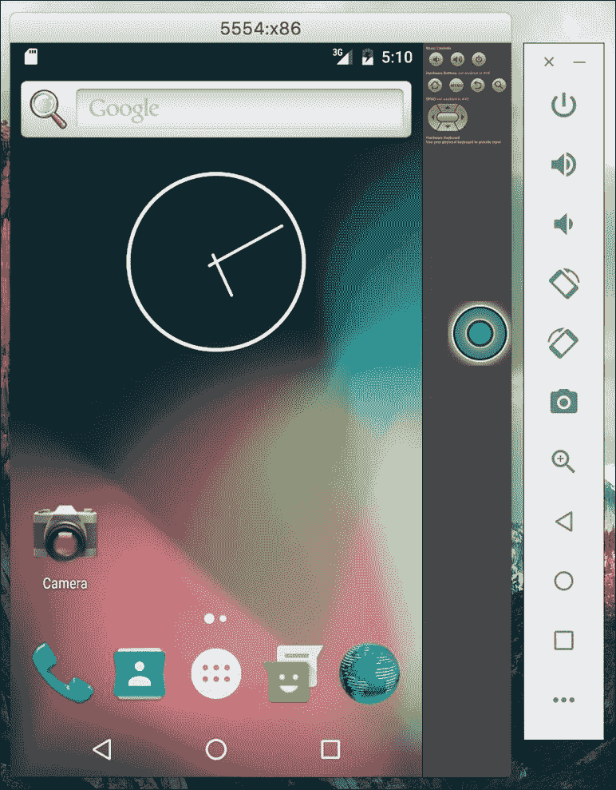
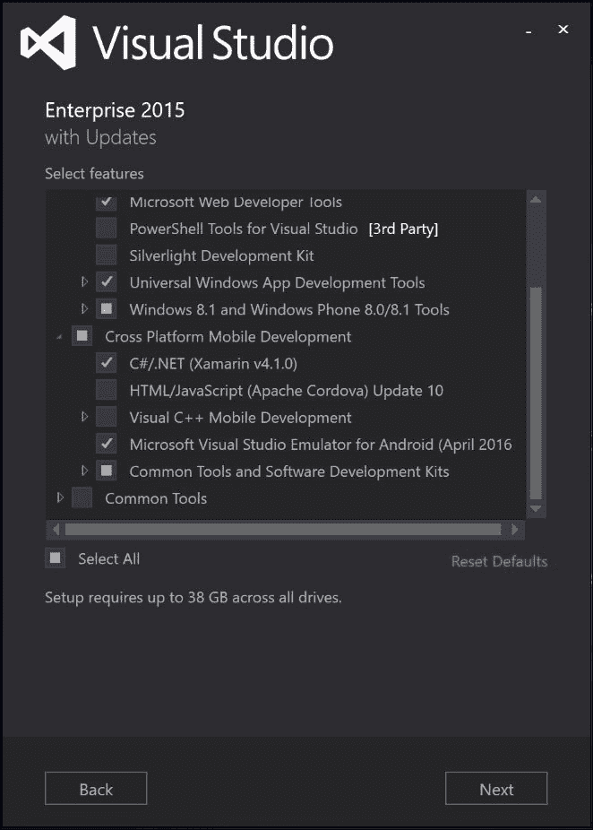
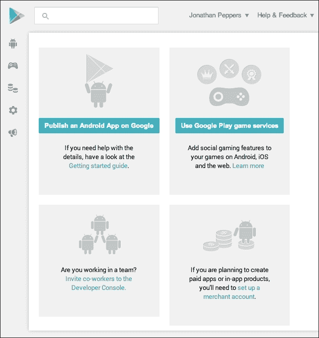

# 第一章。Xamarin 安装程序

如果你正在读这本书，你可能已经对 C#有了深深的热爱。NET，以及像微软 Visual Studio 这样的工具。当你想到学习一个新的平台、一个新的 IDE、新的应用程序模型，或许还有一两种编程语言的工作时，使用原生 SDKs 进行移动开发似乎令人望而生畏。Xamarin 旨在取悦他人。NET 开发人员，他们拥有用 C#开发本机 iOS、Android 和 Mac 应用程序的工具。

选择 Xamarin 开发移动应用，而不是安卓上的 Java 和 iOS 上的 Objective-C/Swift，有很多好处。您可以在这两个平台之间共享代码，并且可以通过利用 C#和的高级语言特性来提高工作效率。NET 基类库。或者，您必须为安卓和 iOS 编写两次整个应用程序。

与使用 JavaScript 和 HTML 开发跨平台应用程序的其他技术相比，Xamarin 有一些明显的优势。C#通常比 JavaScript 性能更好，Xamarin 让开发人员可以直接访问每个平台上的本机 API。这允许 Xamarin 应用程序具有本地外观，并以类似于 Java 或 Objective-C 的方式运行。Xamarin 的工具通过将您的 C#编译成本机 ARM 可执行文件来工作，该文件可以打包成 iOS 或安卓应用程序。它将 Mono 运行时的精简版本与您的应用程序捆绑在一起，该版本仅包含您的应用程序使用的基类库的功能。

在本章中，我们将设置开始使用 Xamarin 开发所需的一切。到本章结束时，我们将安装所有正确的软件开发工具包和工具，以及应用商店提交所需的所有开发人员帐户。

在本章中，我们将介绍:

*   Xamarin 工具和技术简介
*   安装 Xcode，苹果的 IDE
*   设置所有 Xamarin 工具和软件
*   将 Visual Studio 连接到 Mac
*   设置安卓模拟器
*   注册 iOS 开发者计划
*   注册谷歌游戏

# 理解 Xamarin

Xamarin 已经开发了三款用于开发跨平台应用的核心产品: **Xamarin Studio** 、 **Xamarin.iOS** 和 **Xamarin。安卓**。Xamarin Studio 是 C# IDE，而 **Xamarin.iOS** 和 **Xamarin。安卓**是让 C#应用程序分别在 iOS 和安卓上运行的核心工具。这些工具允许开发人员利用 iOS 和 Android 上的本机库，并且是基于 Mono 运行时构建的。

**Mono** ，C#和。NET 框架，最初是由 Novell 开发的，用于 Linux 操作系统。由于 iOS 和 Android 同样基于 Linux，Novell 能够为 Android 开发 MonoTouch 和 Mono 作为针对新移动平台的产品。在它们发布后不久，一家更大的公司收购了 Novell，Mono 团队离开，成立了一家主要致力于移动开发的新公司。Xamarin 的成立是为了专注于这些在 iOS 和安卓上用 C#开发的工具。

让开发机器为跨平台应用程序开发做好准备可能需要一些时间。更糟糕的是，苹果和谷歌在各自的平台上都有自己的开发要求。如果您计划使用 Visual Studio 在 Windows 上开发，您的设置将与在 Mac OS X 上有点不同。请记住，在 Windows 上开发 iOS 需要在您的本地网络上有一台 Mac。让我们看一下需要在你的机器上安装什么。

Mac OS X 上 Xamarin 开发的构建模块如下:

*   **Xcode** :苹果在 Objective-C 中开发 iOS 和 Mac 应用的核心 IDE
*   **Mac 的 Mono 运行时**:这是在 OS X 上编译和运行 C#程序所必需的
*   **Java** :这是在 OS X 上运行 Java 应用的核心运行时
*   **Android SDK** :这包含了谷歌的标准 SDK、设备驱动程序和用于原生 Android 开发的仿真器
*   **Xamarin.iOS** :这是 Xamarin 用于 iOS 开发的核心产品
*   **Xamarin。安卓**:这是 Xamarin 针对安卓开发的核心产品

在 Windows 上开发 Xamarin 所需的软件如下:

*   **Visual Studio 或 Xamarin Studio** :任何一个 IDE 都会为 Windows 上的 Xamarin 开发工作。
*   **。NET Framework 4.5 或更高版本**:这是 Visual Studio 或 Windows 的最新版本附带的。
*   **Java** :这是在 Windows 上运行 Java 应用的核心运行时。
*   **安卓 SDK** :这里包含了谷歌的标准 SDK，设备驱动，以及用于原生安卓开发的仿真器。
*   **你的本地网络上的一台 Mac 为 Xamarin.iOS 开发而设置**:苹果要求 iOS 开发在 OS X 进行，这是他们许可协议的一部分。需要为上面列出的 Xamarin.iOS 开发设置一个 Mac。
*   **Windows Xamarin**:这是 Xamarin 的 Windows 核心产品；它包括 Xamarin 和。Android 和 Xamarin.iOS。

这些都需要一些时间来下载和安装。如果您可以访问快速互联网连接，这将有助于加快安装和设置过程。一切都准备好了，让我们一步一步前进，希望我们能跳过一些你可能会遇到的死胡同。

# 安装 Xcode

为了让事情进展得更顺利，让我们从为 Mac 安装 Xcode 开始。除了苹果的 IDE，它还将在 Mac 上安装最常用的开发工具。确保您至少有 OS X 10.10(约塞米蒂)，并在应用商店中找到 Xcode，如下图所示:

这将需要相当长的时间来下载和安装。我建议花点时间享受一杯美味的咖啡，或者一起做另一个项目。

安装 Xcode 会安装 iOS SDK，这通常是 iOS 开发的要求。作为苹果的限制，iOS 软件开发工具包只能在苹果电脑上运行。Xamarin 已经尽一切可能确保他们遵循苹果的 iOS 指南，比如动态代码生成。Xamarin 的工具还尽可能利用 Xcode 的特性，以避免重新发明轮子。

# 在 Mac OS X 上安装 Xamarin

安装 Xcode 之后，在使用 Xamarin 的工具进行开发之前，还需要安装其他几个依赖项。幸运的是，Xamarin 通过创建一个简单的一体化安装程序改善了体验。

通过执行以下步骤安装 Xamarin:

1.  前往[http://xamarin.com](http://xamarin.com)点击大**下载 Xamarin** 按钮。
2.  填写一些自己的基本信息，点击**下载 Xamarin 工作室**。
3.  下载`XamarinInstaller.dmg`并挂载磁盘镜像。
4.  启动`Xamarin.app`并接受出现的任何 OS X 安全警告。
5.  通过安装程序的进度；默认选项可以正常工作。你可以选择安装`Xamarin.Mac`，但是这本书没有涉及这个话题。

Xamarin 安装程序将下载并安装先决条件，如 Mono 运行时、Java、Android SDK(包括 Android 模拟器和工具)，以及您需要启动和运行的所有其他东西。

您最终会看到类似于下面截图中所示的内容，我们可以继续征服跨平台开发中更大的主题:

# 设置安卓模拟器

与在物理设备上开发相比，安卓模拟器在历史上一直被认为是缓慢的。为了帮助解决这个问题，谷歌已经生产了一个 x86 仿真器，支持桌面计算机上的硬件加速。在**安卓虚拟设备** ( **AVD** )管理器中默认不安装，所以我们来设置一下。

可以通过执行以下步骤来安装 x86 安卓模拟器:

1.  打开 Xamarin 工作室。
2.  启动**工具** | **打开安卓 SDK 管理器...**。
3.  向下滚动至**附加功能**；安装**英特尔 x86 仿真器加速器(HAXM 安装程序)**。
4.  滚动至**Android 6.0(API 23)**；安装**英特尔 x86 凌动系统映像**。
5.  或者，安装您感兴趣的任何其他软件包。至少，确保你拥有安卓软件开发工具包管理器默认为你选择安装的所有东西。
6.  关闭**安卓软件开发工具包管理器**，导航到你的安卓软件开发工具包目录，默认位于`~/Library/Developer/Xamarin/android-sdk-macosx`。
7.  导航至`extras/intel/Hardware_Accelerated_Execution_Manager`并启动`IntelHAXM_6.0.3.dmg`安装 HAXM 驱动程序。
8.  切换回 Xamarin Studio 并启动**工具** | **打开谷歌模拟器管理器...**。
9.  点击**创建...**。
10.  输入您选择的 AVD 名称，如`x86 Emulator`。
11.  选择适合您显示器尺寸的通用设备，例如 **Nexus 5** 。
12.  作为 **CPU/ABI** ，请确保选择支持**英特尔凌动(x86)** 的选项。
13.  创建设备后，点击**开始...**确保仿真器正常运行。

### 类型

这些说明在 Windows 上应该非常相似。默认情况下，安卓软件开发工具包安装在 Windows 上的`C:\Program Files (x86)\Android\android-sdk`处。同样的，HAXM 安装程序在 Windows 上被命名为`intelhaxm-android.exe`。

模拟器将需要一些时间来启动，所以在运行安卓项目时让模拟器保持运行是一个好主意。Xamarin 在这里使用的是标准的安卓工具，所以即使是 Java 开发人员也感受到了仿真器运行缓慢的痛苦。如果一切正常启动，您将看到一个安卓启动屏幕，后面是一个虚拟安卓设备，可以从 Xamarin 工作室部署应用程序，如下图所示:

安卓模拟器有很多选项，比如 Genymotion 或 Visual Studio 安卓模拟器。使用 Xamarin 不会限制你在安卓模拟器中的选择，所以如果默认的安卓模拟器对你不起作用，请随意尝试。

# 在 Windows 上安装 Xamarin

自 2016 年微软收购 Xamarin 以来，任何版本的 Visual Studio 都包含 Xamarin。版本如下:

*   **Visual Studio 社区**:这是一个免费版本，任何人都可以使用。公司使用此版本有限制。
*   **Visual Studio 专业版**:这是公司应该用的通用版。在 Visual Studio 方面，它包括团队基础服务器的功能。
*   **Visual Studio Enterprise** :包含 Visual Studio 和 Xamarin 中的附加功能。Xamarin 功能包括嵌入式程序集、实时 Xamarin 检查器和 Xamarin 探查器。

当第一次为 Xamarin 开发设置 Windows 电脑时，有两个选择需要考虑。如果您已经有了 Visual Studio，那么您只需要使用 Xamarin 安装程序将必要的 Visual Studio 扩展和项目模板添加到您现有的安装中。如果您还没有安装 Visual Studio，那么在 Visual Studio 2015 安装程序中有一个安装 Xamarin 的选项。

如果要从 Visual Studio 安装程序安装:

1.  从[https://www.visualstudio.com/downloads/](https://www.visualstudio.com/downloads/)下载你想要的 Visual Studio 版本。
2.  运行 Visual Studio 安装程序。
3.  在**跨平台移动开发**下，确保选择 **C#/。NET (Xamarin v4.1.0)** (版本号会根据你使用的版本而变化)。这应该会自动选择安卓软件开发工具包和 Xamarin 开发所需的其他组件。
4.  您也可以选择安装其他有用的工具，如**微软网络开发工具**或**通用视窗应用开发**工具，以视窗 10 为目标。

在点击**下一步**之前，你的安装程序应该是这样的:

安装 Xamarin 的第二个选项来自 Xamarin 的网站:

1.  从[https://xamarin.com/download](https://xamarin.com/download)下载 Windows Xamarin 安装程序。
2.  运行`XamarinInstaller.exe`，它将在你的电脑上下载并安装所有需要的组件。

Xamarin 安装程序与您在 Mac OS X 上看到的体验非常相似，应该非常简单。如果需要，它会将 Xamarin 添加到现有的 Visual Studio 安装中，并安装 Xamarin Studio。

# 将 Visual Studio 连接到 Mac 进行 iOS 开发

iOS 开发需要运行在 Mac OS X 上的 Xcode。幸运的是，Xamarin 已经使从 Windows PC 进行远程开发成为可能。

要将电脑连接到苹果电脑:

1.  首先打开或创建一个 Xamarin.iOS 项目。
2.  Visual Studio 会自动提示 **Xamarin Mac 代理说明**。
3.  按照 Visual Studio 中的详细说明和屏幕截图在您的 Mac 上启用远程登录。
4.  将出现一个 **Xamarin Mac 代理**对话框，其中列出了您的 Mac 地址。
5.  点击**连接...**并输入您的 Mac 的用户名和密码。

连接后，您应该会看到如下截图:

连接后，您只需按下播放按钮，即可针对 iOS 模拟器或您选择的 iOS 设备调试您的项目。Visual Studio 中您期望的所有功能也将适用于 iOS 开发:断点、鼠标悬停评估、添加手表等。

# 注册 iOS 开发者计划

要部署到 iOS 设备，苹果需要加入其 iOS 开发者计划。会员费为每年 99 美元，并允许您为开发目的部署 200 台设备。您还可以访问测试服务器，以实现更高级的 iOS 功能，如应用内购买、推送通知和 iOS 游戏中心。在物理设备上测试你的 Xamarin.iOS 应用程序很重要，所以我建议你在开始 iOS 开发之前先注册一个账号。在桌面上运行的模拟器与真正的移动设备相比，性能有很大的不同。还有一些特定于 Xamarin 的优化只有在真正的设备上运行时才会发生。我们将在后面的章节中全面介绍在设备上测试应用程序的原因。

### 类型

自 iOS 9 以来，苹果创造了一种从任何苹果 ID 从 iOS 设备侧加载应用的方法。建议仅在少数设备上用于测试目的，无法测试应用内购买或推送通知等高级功能。然而，如果你只是在玩 iOS 这是一个不用支付 99 美元开发者费用就能开始的好方法。

可以通过以下步骤注册 iOS 开发人员计划:

1.  前往[https://developer.apple.com/programs/ios](https://developer.apple.com/programs/ios)。
2.  点击**报名**。
3.  使用现有的 iTunes 帐户登录或创建一个新帐户。这个以后不能改，选择适合你公司的。
4.  作为个人或公司注册。两者的价格都是 99 美元，但是注册为公司需要在公司会计的帮助下将文件传真给苹果。
5.  查看开发商协议。
6.  填写苹果对开发者的调查。
7.  购买 99 美元的开发者注册。
8.  等待确认电子邮件。

您应该会在两个工作日内收到一封类似以下截图的电子邮件:

从这里，您可以继续设置您的帐户:

1.  点击**现在从你收到的电子邮件登录**或者去[https://itunesconnect.apple.com](https://itunesconnect.apple.com)。
2.  使用您的 iTunes 帐户登录。
3.  同意仪表板主页上显示的任何附加协议。
4.  从 iTunes Connect 仪表盘，转到**协议、税务和银行业务**。
5.  在这一部分，你会看到三列，分别是**联系信息**、**银行信息**和**税务信息**。
6.  在所有这些部分中为您的帐户填写适当的信息。公司账户很可能需要会计师的帮助。

说了这么多，你的**协议、税务和银行**部分应该看起来像下面的截图:

注册成功后，您现在可以部署到 iOS 设备，并将您的应用程序发布到苹果应用商店。

# 注册成为 Google Play 开发者

与 iOS 不同，将应用程序部署到安卓设备是免费的，只需要对设备设置进行一些更改。一个谷歌游戏开发者账户只有 25 美元的一次性费用，并且不需要每年更新。然而，就像 iOS 一样，你需要一个谷歌游戏账户来开发应用内购买、推送通知或谷歌游戏服务。如果你不可避免地计划向谷歌游戏提交应用程序，或者需要实现其中一个功能，我建议你提前设置一个账户。

要注册成为 Google Play 的开发人员，请执行以下步骤:

1.  前往[https://play.google.com/apps/publish](https://play.google.com/apps/publish)。
2.  使用现有的谷歌帐户登录，或者创建一个新帐户。这是以后不能改变的，所以如果需要，选择一个适合你公司的。
3.  接受协议并输入您的信用卡信息。
4.  选择开发人员姓名，并为您的帐户输入其他重要信息。同样，选择适合您公司的名称，以便用户在应用商店中看到。

如果您正确填写了所有内容，您将获得以下谷歌游戏开发者控制台:

如果你打算出售付费应用或应用内购买，此时，我建议你设置你的**谷歌商家账户**。这将使谷歌能够通过在你的国家适用适当的税法来支付你的应用销售收入。如果为你的公司设置这个，我会建议得到你公司的会计或簿记员的帮助。

以下是设置谷歌商家帐户的步骤:

1.  点击**设置商户账户**按钮。
2.  再次使用您的谷歌帐户登录。
3.  填写销售应用程序的适当信息:地址、电话号码、税务信息和显示在客户信用卡账单上的显示名称。

完成后，您会注意到开发人员控制台中现在缺少设置商家帐户的帮助提示，如下图所示:

在这一点上，人们会认为我们的账户已经完全建立，但在能够销售应用程序之前，还有一个更关键的步骤:我们必须输入银行信息。

可以通过以下步骤为您的谷歌商户帐户设置银行业务:

1.  回到位于[https://play.google.com/apps/publish](https://play.google.com/apps/publish)的谷歌游戏开发者控制台。
2.  点击**财务报告**部分。
3.  点击标题为**的小链接，访问您的商户账户了解详情**。
4.  您应该会看到一条警告，表明您没有设置银行帐户。点击**指定银行账户**链接开始。
5.  输入您的银行信息。同样，可能需要一个公司会计。
6.  几天后，在你的谷歌账户里找一笔小额存款。
7.  去[http://checkout.google.com/sell](http://checkout.google.com/sell)确认金额。
8.  点击**设置**选项卡，然后点击**财务**。
9.  接下来，点击**验证账户**。
10.  输入您银行账户中出现的金额，点击**确认存款**。

您的谷歌商户账户也是您可以取消或退款客户订单的地方。谷歌 Play 与 iOS 应用商店的不同之处在于，所有客户问题都是针对开发者的。

# 总结

在本章中，我们讨论了 Xamarin 的核心产品，无论您是使用 Mac OS X 还是 Windows PC，都可以用 C#开发 Android 和 iOS 应用程序。我们安装了 Xcode，然后运行了 Xamarin 多合一安装程序，它安装了 Java、Android SDK、Xamarin Studio、Xamarin.iOS 和 Xamarin.Android。在 Windows 上，我们设置了 Xamarin 在 Visual Studio 内部使用，并在本地网络上连接了一台 Mac 用于 iOS 开发。我们设置了 x86 安卓模拟器，以便在调试应用程序时获得更快、更流畅的体验。最后，我们设置了 iOS 和 Google Play 开发人员帐户来分发我们的应用程序。

在本章中，您应该已经获得了开始使用 Xamarin 构建跨平台应用程序所需的一切。你的开发计算机应该已经准备好了，你应该已经安装了所有的本地软件开发工具包，并准备好创建下一个伟大的应用程序来席卷全球。

本章中的概念将为我们设置更高级的主题，这将需要安装适当的软件以及苹果和谷歌的开发人员帐户。我们将在真实设备上部署应用程序，并实现推送通知等更高级的功能。在下一章中，我们将创建我们的第一个 iOS 和 Android 应用程序，并介绍每个平台的基础知识。