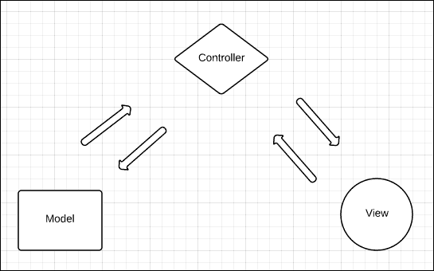
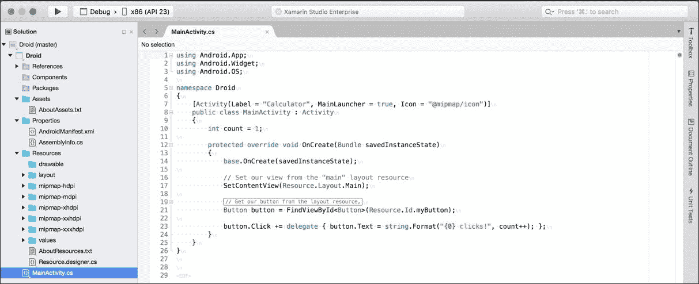
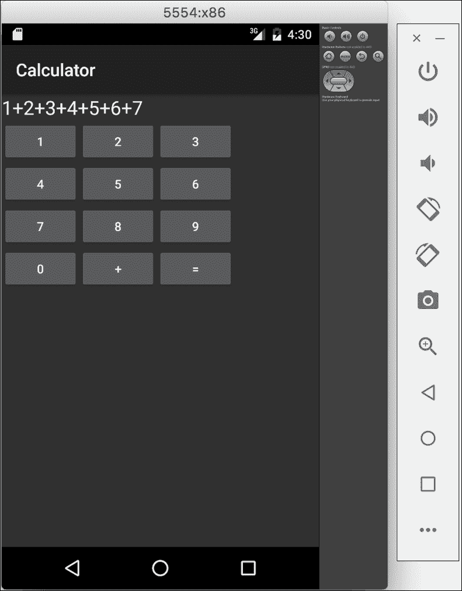

# 第二章。平台们，你们好！

如果您熟悉在 Windows 上使用 Visual Studio 开发应用，那么使用 Xamarin Studio 应该非常简单。Xamarin 使用了包含一个或多个**项目**的**解决方案**的相同概念，并为 iOS 和安卓应用创建了几个新的项目类型。还有几个项目模板可以帮助您快速开发常见的应用。

Xamarin Studio 支持几种现成的项目类型，包括标准。NET 类库和控制台应用。您不能在带有 Xamarin Studio 的 Mac 上开发 Windows 应用，但是您可以在 Xamarin Studio 中开发应用的共享代码部分。我们将在后面的章节中重点介绍代码共享，但是请记住，Xamarin 使您能够在大多数支持 C#的平台之间共享一个通用的 C#后端。

在本章中，我们将介绍:

*   为 iOS 创建一个简单的计算器应用
*   苹果的 MVC 模式
*   Xcode 和故事板
*   为安卓创建一个计算器应用
*   安卓活动
*   Xamarin 的安卓设计师

# 构建你的第一个 iOS 应用

启动 Xamarin Studio 并启动新的解决方案。就像在 Visual Studio 中一样，有很多项目类型可以从**新建解决方案**对话框中创建。Xamarin Studio，前身为**Mono developer**，支持许多不同类型项目的开发，例如针对 Mono 运行时或的 C#应用。NET Core、NUnit 测试项目，甚至 C#之外的其他语言，比如 VB 或者 C++。

Xamarin Studio 支持 iOS 的以下项目类型:

*   **单视图 App** :这是设置 iOS 故事板的基础项目类型，附带单视图和控制器。
*   **主细节应用**:包含项目列表的项目类型，您可以点击查看详细信息。在 iPhone/iPod 上，它将使用多个控制来占据全屏区域，在 iPad 上使用 iOS `UISplitViewController`。
*   **选项卡式应用**:这是一个自动为具有选项卡布局的应用设置`UITabViewController`的项目类型。
*   **基于页面的应用**:该项目类型自动设置一个`UIPageViewController`作为转盘在屏幕之间分页。
*   **WebView App** :这个项目类型是为了创建部分 HTML、部分原生的“混合”应用。该应用被设置为利用 Xamarin Studio 的 Razor 模板特性。
*   **类库**:这是其他 iOS 应用项目内部使用的类库。
*   **绑定库**:这是一个 iOS 项目，可以为 Objective-C 库创建 C#绑定。
*   **UI 测试应用**:一个 NUnit 测试项目，用于在本地或 Xamarin 测试云上运行 UI 测试。
*   **单元测试 App** :这是一个特殊的 iOS 应用项目，可以运行 NUnit 测试。

首先，创建一个新的解决方案并导航到 **iOS** | **应用**，并创建一个**单视图应用**，如下图所示:


### 类型

在 Visual Studio 中，您可以在新解决方案对话框中从 **Visual C# | iOS | Universal |单视图 App** 创建正确类型的项目。

下一步，我们需要:

1.  选择一个**应用名称**。
2.  选择一个**组织标识符**，这是一个“反向”域名来唯一识别你的应用。
3.  选择您想要支持的 iOS 设备；您可以保留默认值。
4.  选择您希望支持的最低 iOS 版本；您可以保留默认值。
5.  最后，在最后一步，选择一个目录放置你的项目，点击**创建**。

### 类型

在 Visual Studio 中，这些设置可以通过打开 iOS 项目的**项目选项**来获得。Xamarin Studio 的新项目对话框中有额外的步骤，但是您可以在事后编辑这些设置。

您会注意到几个文件和文件夹是从项目模板自动创建的。这些文件如下:

*   `References`:这些都是你从. NET 知道的，喜欢的其他库的标准参考。
*   `Components`:该文件夹将包含从 Xamarin 组件存储中添加的任何组件。有关 Xamarin 组件存储的更多信息，请参见[第 9 章](09.html#aid-25JP21 "Chapter 9. Web Services with Push Notifications")、*带有推送通知的网络服务*。
*   `Resources`:该目录将包含您想要直接复制到您的应用捆绑包中的任何图像或普通文件。
*   `AppDelegate.cs`:这是苹果在你的应用中处理应用级事件的主要类。
*   `Entitlements.plist`:这是苹果用来声明某些 iOS 功能权限的设置文件，比如推送通知和 iCloud。您通常只需将其用于高级 iOS 功能。
*   `*ViewController.cs`:这是代表你 app 中第一个屏幕的控制器。它将与您的项目同名。
*   `Info.plist`:这是苹果版本的**清单**文件，可以为你的应用声明各种设置，比如应用标题、图标、闪屏和其他常见设置。
*   `LaunchScreen.storyboard`:这是一个故事板文件，用于为您的应用布局闪屏。默认情况下，Xamarin 的项目模板会将项目的名称放在这里。
*   `Main.cs`:这个文件包含一个 C#程序的标准入口点:`static void Main()`。很可能您不需要修改此文件。
*   `MainStoryboard.storyboard`:这是你的应用的故事板定义文件。它将包含应用中视图的布局、控制器列表以及在整个应用中导航的过渡。故事板就是它听起来的样子:iOS 应用中不同屏幕的图表/流程图。

现在，让我们运行应用，看看我们默认从项目模板中得到什么。点击 Xamarin Studio 左上角的大播放按钮。您将会看到运行第一个 iOS 应用的模拟器，如下图所示:


到目前为止，你的应用只是一个普通的白屏，这并不是很令人兴奋或有用。在继续下一步之前，让我们了解更多关于 iOS 开发的背景知识。

根据应用的最低 iOS 目标，您也可以在不同版本的 iOS 模拟器上运行应用。苹果还为 iPad 和目前市场上所有不同的 iOS 设备提供模拟器。知道这些是模拟器而不是仿真器也很重要。模拟器将运行移动操作系统的封装版本(就像安卓一样)。仿真器通常表现出较慢的性能，但给你一个真实操作系统的更接近的副本。苹果的模拟器作为原生 Mac 应用运行，不是真正的操作系统。好处是，与安卓模拟器相比，它们速度非常快。

# 了解苹果的 MVC 模式

在 iOS 开发走得太远之前，先了解一下苹果在 iOS 上开发的设计模式，这真的很重要。您可能已经将**模型视图控制器(MVC)** 模式与其他技术(如**【ASP.NET】**)一起使用，但是苹果以稍微不同的方式实现了这个范例。苹果为 iOS 应用开发用户界面的核心应用接口集叫做 UIKit。Xamarin 应用可以通过直接使用 C#中的这些 API 来充分利用 UIKit。UIKit 在很大程度上基于 MVC 设计模式。

**MVC** 设计模式包括以下内容:

*   **模型**:这是驱动应用的后端业务逻辑。例如，这可以是向服务器发出 web 请求或将数据保存到本地 **SQLite** 数据库的任何代码。
*   **查看**:这是屏幕上看到的实际用户界面。用 iOS 术语来说，这是从`UIView`派生的任何类。例如工具栏、按钮以及用户在屏幕上看到并与之交互的任何东西。
*   **控制器**:这是 **MVC** 模式的老黄牛。控制器与**模型**层交互，并用结果更新**视图**层。类似于**视图**层，任何控制器类都将从`UIViewController`派生。这是 iOS 应用中很大一部分代码所在的地方。

下图显示了 MVC 设计模式:



为了更好地理解这种模式，让我们看一下以下常见场景的示例:

1.  我们有一个带有搜索框的 iOS 应用，它需要查询一个网站上的工作列表。
2.  用户将在`UITextField`文本框中输入一些文本，点击`UIButton`按钮开始搜索。这是**视图**层。
3.  一些代码将通过与**视图**交互来响应按钮，显示一个`UIActivityIndicatorView`微调器，并调用另一个类中的方法来执行搜索。这是**控制器**层。
4.  一个 web 请求将在被调用的类中发出，一个作业列表将异步返回。这是**模型**层。
5.  然后**控制器**会用作业列表更新**视图**并隐藏微调器。

### 注

有关苹果 MVC 模式的更多信息，请参见[https://developer . Apple . com/library/MAC/documentation/general/conceptive/devpedia-cocacore/MVC . html](https://developer.apple.com/library/mac/documentation/general/conceptual/devpedia-cocoacore/MVC.html)的文档网站。

需要注意的一点是，您可以在应用的模型层自由地做任何您想做的事情。这就是我们可以使用普通 C#类的地方，这些类可以在其他平台上重用，比如安卓。这包括使用 C# **基类库** ( **密件抄送**)的任何功能，例如使用网络服务或数据库。我们将在本书后面更深入地探讨跨平台架构和代码共享概念。

# 使用 iOS 设计器

由于我们的普通白色应用很无聊，让我们用一些控件修改应用的视图层。为此，我们将在 Xamarin Studio 或 Visual Studio 中修改您项目中的`MainStoryboard.storyboard`文件。或者，您可以在 Xcode 中打开故事板文件，这是 Xamarin.iOS 设计器之前编辑故事板文件的方法。如果 iOS 故事板中有 Xcode 设计器中没有的功能，或者如果您需要编辑旧的 iOS 格式(如 XIB 文件)，使用 Xcode 仍然很有用。然而，Xcode 并不是很好的体验，因为 Xcode 中的自定义控件呈现为普通的白色方块。Xamarin 的设计者实际上是在自定义控件中运行您的绘图代码，这样您就可以准确地看到应用在运行时的样子。

让我们通过执行以下步骤向应用添加一些控件:

1.  在 Xamarin Studio 中打开您在本章前面创建的项目。
2.  双击`MainStoryboard.storyboard`文件。
3.  iOS 设计器将打开，您将在应用中看到单个控制器的布局。
4.  在右侧的**文档大纲**选项卡中，您将看到您的控制器在其布局层次结构中包含一个视图。
5.  在左上角，您会注意到一个工具箱，其中包含几种类型的对象，您可以将其拖放到控制器的视图中。
6.  在搜索框中，搜索`UILabel`并拖动屏幕顶部居中的标签。
7.  双击标签，将标签文本编辑为数字零( **0** )。您也可以从右下角的**属性**选项卡中填写该值。
8.  同样，搜索`UIButton`并创建 10 个编号为 **0-9** 的按钮，以创建一个数字键盘。您可以使用**属性**选项卡编辑按钮上的文本。您也可以使用**复制/粘贴**来加速创建它们。双击按钮将会添加一个 click 事件处理程序，这可能是您在为其他平台开发时从 Visual Studio 中熟悉的。
9.  运行应用。

您的应用应该开始看起来更像一个真实的应用(计算器)，如下图所示:


### 类型

在 Windows 上的 Visual Studio 中，这些步骤与 Mac 上的 Xamarin Studio 相同。请记住，要使用 Xamarin.iOS 设计器，您必须保持与本地网络上的 Mac 的连接。连接到苹果电脑的说明在[第 1 章](01.html#aid-E9OE1 "Chapter 1. Xamarin Setup")、 *Xamarin 设置*中。

现在，您可能想知道在这一点上向应用添加用户交互选项。在 Xcode 的 iOS 设计器中，您可以制作一个**插座**，使每个视图都可以从 C#中看到。出口是对故事板或 XIB 文件中的视图的引用，该视图将在运行时用该视图的实例填充。您可以将此概念与其他技术中的控件命名进行比较，如**ASP.NET**、**网络表单**或 **WPF** ( **视窗演示基础**)。幸运的是，Xamarin 的 iOS 设计器比在 Xcode 中设置插座简单一点。您只需在**属性**选项卡中填写**名称**字段，Xamarin Studio 将在**分部类**中生成一个属性，使您可以从控制器访问标签和按钮。此外，您可以从故事板文件中连线一个**动作**，这是一个当事件发生时将被调用的方法。Xamarin Studio 将 iOS 操作公开为要在类中实现的部分方法。

让我们给应用添加一些交互，如下所示:

1.  切换回 Xamarin 工作室。
2.  再次双击`MainStoryboard.storyboard`文件。
3.  选择您之前创建的标签，导航到**属性**窗格，并确保您选择了**小部件**选项卡。
4.  在**名称**字段中输入名称`label`。
5.  创建一个文本为 **+** 的新按钮进行添加。
6.  切换到**事件**标签。
7.  将名称`OnAdd`输入到其上方的**字段中。您可以将此记为按钮的“点击”事件。**
8.  Xamarin Studio 将指导您在您的`UIViewController`中放置`OnAdd`方法的位置。
9.  对每个数字按钮重复此过程，但将事件命名为**。**
10.  为计算器创建一个文本为 **=** 的新按钮。
11.  切换到**事件**标签。
12.  将名称`OnEquals`输入到其上方的**字段中。**

Xamarin 从以前在 Xcode 中的体验中大大改善了这种体验。对于那些更熟悉像 Visual Studio 这样的工具的人来说，Xcode 有一个奇怪的界面。创建出口的方法包括单击控件并将其拖动到 Objective-C 头文件上。对于有 C#背景的开发人员来说，仅仅填写一个**名称**字段要简单得多，也更直观。

现在我们已经定义了两个插座，您的控制器将提供两个新属性。展开解决方案中的`*ViewController.cs`文件，打开`*ViewController.designer.cs`文件。您将看到您的属性定义如下:

```cs
[Outlet] 
[GeneratedCode ("iOS Designer", "1.0")] 
MonoTouch.UIKit.UILabel label { get; set; } 

```

修改此文件不是一个好主意，因为如果您在设计器或 Xcode 中做进一步的更改，IDE 将重新生成它。尽管如此，了解事情在幕后是如何运作的是一个很好的实践。

打开你的`*ViewController.cs`文件，让我们用你的控制器的方法输入下面的代码:

```cs
partial void OnAdd(UIButton sender) 
{ 
    if (!string.IsNullOrEmpty(label.Text)) 
    { 
        label.Text += "+"; 
    } 
} 

partial void OnNumber(UIButton sender) 
{ 
    if (string.IsNullOrEmpty(label.Text) || label.Text == "0") 
    { 
        label.Text = sender.CurrentTitle; 
    } 
    else 
    { 
        label.Text += sender.CurrentTitle; 
    } 
} 

partial void OnEquals(UIButton sender) 
{ 
    //Simple logic for adding up the numbers 
    string[] split = label.Text.Split('+'); 
    int sum = 0; 
    foreach (string text in split) 
    { 
        int x; 
        if (int.TryParse(text, out x)) 
            sum += x; 
    } 
    label.Text = sum.ToString(); 
} 

```

这些代码大部分只是让计算器运行的通用 C#逻辑。在`OnAdd`方法中，如果标签的文本不是空的，我们会附加一个`+`符号。在`OnNumber`方法中，我们适当地替换或添加标签文本。最后，在`OnEquals`方法中，我们通过字符串拆分操作和整数转换来计算标签中的表达式。然后，我们将结果放在标签的文本中。

运行您的应用，您将能够与您的计算器进行交互，如下图所示:


现在是你自己完成这个练习并完成计算器的好时机。添加减法、乘法、除法的按钮和一个“清除”按钮就可以完成这个简单的计算器。这应该能让你掌握使用苹果的应用编程接口`UIButton`、`UILabel`和 UIKit 框架的基础知识。

既然我们已经学习了在 Xamarin 的 iOS 设计器中布局控件以及在 C#中与插座交互的基础知识，那么让我们来学习一下 iOS 应用的标准生命周期。处理应用级事件的主要位置在`AppDelegate`类中。

如果打开`AppDelegate.cs`文件，可以覆盖以下方法:

*   `FinishedLaunching`:这是申请的第一个入口点，应该会返回`true`。
*   `DidEnterBackground`:这表示用户点击了自己设备上的 home 键或者是另一个应用，比如打电话，来到了前台。您应该执行保存用户进度或用户界面状态所需的任何操作，因为一旦被推到后台，iOS 可能会杀死您的应用。当您的应用在后台时，用户可能正在主屏幕中导航或打开其他应用。您的应用在内存中被有效地暂停，直到被用户恢复。
*   `WillEnterForeground`:这表示用户已经从后台重新打开了你的应用。您可能需要在这里执行其他操作，例如刷新屏幕上的数据等等。
*   `OnResignActivation`:如果操作系统在应用顶部显示系统弹出窗口，就会出现这种情况。例如日历提醒或用户可以从屏幕顶部向下滑动的菜单。
*   `OnActivated`:当用户返回你的应用时，这种情况会在`OnResignActivation`方法执行后立即发生。
*   `ReceiveMemoryWarning`:这是操作系统发出的警告，要求释放应用中的内存。由于 C#的垃圾收集器，Xamarin 通常不需要它，但是如果你的应用中有任何重物，比如图像，这是一个处理它们的好地方。如果无法释放足够的内存，操作系统可能会终止您的应用。
*   `HandleOpenUrl`:如果你实现了一个 **URL 方案**，这就叫做`HandleOpenUrl`，它相当于桌面平台上的文件扩展名关联。如果你注册你的应用打开不同类型的文件或网址，这个方法将被调用。

同样，在您的`*ViewController.cs`文件中，您可以在您的控制器上覆盖以下方法:

*   `ViewDidLoad`:当加载了与您的控制器相关联的视图时，会出现这种情况。它只会在运行 iOS 6 或更高版本的设备上出现一次。
*   `ViewWillAppear`:这发生在你的视图出现在屏幕上之前。如果在应用中导航时有任何视图需要刷新，这通常是最好的地方。
*   `ViewDidAppear`:这发生在任何过渡动画完成之后，并且您的视图显示在屏幕上。在一些不常见的情况下，您可能需要在这里而不是在`ViewWillAppear`中执行操作。
*   `ViewWillDisappear`:这个方法是在你的视图隐藏之前调用的。您可能需要在这里执行一些清理操作。
*   `ViewDidDisappear`:这发生在任何过渡动画完成后，用于在屏幕上显示不同的控制器。就像出现的方法一样，这发生在`ViewWillDisappear`之后。

还有其他几种方法可以覆盖，但许多方法在较新版本的 iOS 中已被否决。在[http://developer.apple.com/library/ios](http://developer.apple.com/library/ios)熟悉苹果的文档网站。当试图理解苹果的应用编程接口如何工作时，阅读每个类和方法的文档是非常有帮助的。学习如何阅读(不一定是代码)Objective-C 也是一个有用的学习技巧，这样你就能够在开发 iOS 应用时将 Objective-C 示例转换为 C#了。

# 构建你的第一个安卓应用

在 Xamarin Studio 中设置一个 Android 应用就像在 iOS 中一样简单，与在 Visual Studio 中的体验非常相似。Xamarin Studio 包括几个特定于安卓的项目模板，可以帮助您快速开始开发。

Xamarin Studio 包括以下项目模板:

*   **安卓应用**:一款标准的安卓应用，目标是你机器上安装的最新安卓 SDK。
*   **穿戴应用**:一个针对安卓穿戴的项目，针对智能手表设备。
*   **WebView App** :针对特定部分使用 HTML 的混合应用的项目模板。提供对 Razor 模板的支持。
*   **类库**:只能被安卓应用项目引用的类库。
*   **绑定库**:建立一个从 C#调用的 Java 库的项目。
*   **UI 测试应用**:一个 NUnit 测试项目，用于在本地或 Xamarin 测试云上运行 UI 测试。
*   **单元测试 App** :这是一个特殊的安卓应用项目，可以运行 NUnit 测试。

启动 Xamarin Studio 并启动新的解决方案。在**新解决方案**对话框中，在**安卓**部分下创建一个新的**安卓应用**。挑选

您最终会得到一个类似于下面截图的解决方案:



### 类型

在 Visual Studio 中，安卓项目模板位于**安卓|空白 App** 下。

您会注意到，已经为您创建了以下特定于安卓的文件和文件夹:

*   `Components`文件夹。这与 iOS 项目相同，是从 Xamarin 组件存储中添加组件的地方。
*   `Assets`文件夹:该目录将包含具有`AndroidAsset`的`build`动作的文件。该文件夹将包含与安卓应用捆绑的原始文件。
*   `Properties/AndroidManifest.xml`:这个文件包含关于你的安卓应用的标准声明，比如应用名称、id 和权限。
*   `Resources`文件夹:资源是可以通过安卓的资源系统加载的图片、布局、字符串等。每个文件都有一个在`Resources.designer.cs`中生成的标识，您可以用它来加载资源。
*   `Resources/drawable`文件夹:你的应用使用的任何图片一般都会放在这里。

*   `Resources/layout`文件夹:这包含安卓用于声明用户界面的任何`*.axml`(安卓 XML)文件。布局可以是整个**活动**、**片段**、**对话框**或**子控件**显示在屏幕上。
*   `Resources/mipmap-*`文件夹:包含应用的图标，显示在不同安卓设备的主屏幕上。应用图标，因为它们的分辨率不同于设备的电流密度。
*   `Resources/values`文件夹:包含 XML 文件，用于声明整个应用中字符串(和其他类型)的键值对。这就是安卓系统上多种语言本地化的设置方式。
*   `MainActivity.cs`:这是`MainLauncher`动作，也是你安卓应用的第一个活动。安卓应用没有`static void Main`功能；将`MainLauncher`设置为`true`的活动开始执行。

现在，让我们执行以下步骤来运行应用:

1.  点击播放按钮编译并运行应用。
2.  可能会出现**选择设备**对话框。
3.  选择您选择的仿真器，点击**启动仿真器**。如果您已经在[第 1 章](01.html#aid-E9OE1 "Chapter 1. Xamarin Setup")、 *Xamarin Setup* 中设置了 x86 仿真器，我会推荐您使用它。
4.  等待几秒钟，让模拟器启动。一旦它启动，只要你在安卓项目上工作，让它运行是个好主意。这将为你节省大量的等待时间。
5.  您应该会在设备列表中看到模拟器现已启用；选中它，点击**确定**。
6.  第一次部署到仿真器或设备时，Xamarin Studio 必须安装一些东西，例如 Mono 共享运行时和 Android 平台工具。
7.  切换到安卓模拟器。
8.  您的应用将会出现。

### 类型

在 Windows 的 Visual Studio 中，您也可以尝试使用【Android 的 Visual Studio 仿真器。这是一个很好的模拟器，预装在 Visual Studio 2015 中。

当所有工作完成后，您已经部署了第一个安卓应用，只需一个按钮即可完成。您的应用将如下图所示:


# 了解安卓活动

安卓操作系统非常注重活动的概念。活动是用户可以在屏幕上执行的任务或工作单元。例如，用户将执行用于拨打号码的**电话活动**，并执行用于与他们的地址簿交互以定位号码的第二活动。每个安卓应用都是一个或多个活动的集合，用户可以启动这些活动，并按下设备上的硬件后退键退出或取消。用户的历史记录保存在安卓**后台堆栈**中，在特殊情况下你可以通过代码进行操作。当一个新的活动开始时，前一个活动将暂停并保留在内存中以备后用，除非操作系统内存不足。

活动之间是松散耦合的；在某些方面，你可以认为它们在内存中有完全不同的状态。静态类、属性和字段将持续应用的生命周期，但通常的做法是在安卓**包**中传递一个状态。这对于传递列表中显示的项目的标识符以在新活动中编辑该项目非常有用。

活动有以下可以覆盖的生命周期回调方法:

*   `OnCreate`:这是创建活动时调用的第一个方法。在这里设置您的视图并执行其他加载逻辑。最重要的是，您可以在这里调用`SetContentView`来设置您的活动视图。
*   `OnResume`:当你的活动视图在屏幕上可见时，这就被称为。如果您的活动是第一次显示，并且当用户从另一个活动返回时，就会调用它。
*   `OnPause`:这是用来通知用户已经离开你的活动。这可能发生在导航到应用中的新活动、锁定屏幕或点击主页按钮之前。假设用户可能不会返回，因此您需要保存用户在此所做的任何更改。
*   `OnStart`:这发生在`OnResume`即将在屏幕上显示活动视图之前。它发生在一个活动开始时，以及用户从另一个活动返回到它时。
*   `OnStop`:当活动的视图不再显示在屏幕上时，这种情况会在`OnPause`之后立即发生。
*   `OnRestart`:当用户从上一个活动返回到你的活动时，这个方法出现。
*   `OnActivityResult`:此方法用于与安卓上其他应用中的其他活动进行通信。与`StartActvityForResult`连用；例如，您可以使用它与脸书应用交互，以登录用户。
*   `OnDestroy`:当你的活动即将从内存中释放出来的时候，会调用这个。执行任何可以帮助操作系统的额外清理，例如处置活动正在使用的任何其他重量级对象。

安卓生命周期的流程图如下:


与 iOS 不同的是，安卓不对开发者强制实施任何设计模式。然而，如果不在某种程度上了解安卓的活动生命周期，就不可能做到这一点。许多有活动的概念与 iOS 上的控制器有相似之处；比如`OnStart`相当于`ViwWillAppear`，`OnResume`相当于`ViewDidAppear`。

处理活动的其他注意方法如下:

*   `StartActivity(Type type)`:这个方法在你的应用中启动一个新的活动，并且不向活动传递额外的信息。
*   `StartActivity(Intent intent)`:这是用`Intent`开始一个新活动的重载方法。这使您能够向新活动传递附加信息，并且您还可以在其他应用中启动活动。
*   `StartActivityForResult`:该方法在活动操作完成时，以接收`OnActivityResult`为预期开始新的活动。
*   `Finish`:这将关闭当前活动，并在完全关闭且不再显示在屏幕上时调用`OnDestroy`。根据当前堆栈上的内容，用户将返回到之前的活动或主屏幕。
*   `SetContentView`:此方法设置活动要显示的主视图。在活动显示在屏幕上之前，应该在`OnCreate`方法中调用它。
*   `FindViewById`:这是一种定位活动中显示的视图的方法。它有一个通用版本，用于返回适当类型的视图。

你可以把`intent`想象成一个描述从一个活动过渡到另一个活动的对象。您可以通过意图传递附加数据，以及修改活动的显示方式和用户的导航历史。

除了活动，安卓还有一个片段的概念。您可以将片段视为显示在父活动中的微型活动。片段有助于在整个应用中重用不同的用户界面，还可以帮助您在平板电脑上实现分屏导航。

# Xamarin 的安卓设计师

安卓项目的默认模板比 iOS 的内置功能多一点，所以我们稍后会移除一些控件。安卓用户界面布局是在人类可读且可编辑的 XML 文件中定义的。然而，Xamarin Studio 提供了一个优秀的设计工具，允许您拖放控件来定义您的安卓布局。让我们为您的应用添加更多功能，并开始使用安卓设计器。

返回 Xamarin Studio，执行以下步骤为您的应用添加功能:

1.  在 Xamarin Studio 中打开本章前面创建的 Android 项目。
2.  在**资源** | **布局**下，打开`Main.axml`。
3.  您将看到安卓设计器在 Xamarin 工作室中打开。
4.  从 Android 项目模板中删除现有标签和按钮。
5.  将**文本视图**从右侧的**工具箱**部分拖动到空布局中。
6.  在标签中键入一些默认文本，如`0`。
7.  在右侧的**属性**窗格中，您将看到 **id** 值被设置为`@+id/textView1`。让我们将其更改为`@+id/text`，以便稍后可以在 C#中与标签进行交互。
8.  现在从**工具箱**部分拖动**网格布局**，在**属性**面板下，将**行数**设置为 4，将**列**设置为 3。
9.  从**工具箱**部分拖动 10 **按钮**部件，并对其文本 **0-9** 进行编号。
10.  将他们的 **id** 设置为从 **0-9 开始编号的`@+id/button0`。**
11.  用 id`@+id/plus`和`@+id/equals`再创建两个按钮，它们的文本分别设置为 **+** 和 **=** 。

### 类型

在 Visual Studio 中，Xamarin。安卓设计者与 Xamarin 工作室的设计者基本相同。主要区别是在编辑控件的属性时，使用了标准的 Visual Studio 属性编辑器。您可能会发现通过**属性**面板中的工具栏按钮在 **A 到 Z** 和分组排序之间切换很有用。

现在，如果您尝试编译和运行您的应用，您会注意到一些编译器错误。现在，打开`MainActivity.cs`并移除`OnCreate`方法中的代码，调用`SetContentView`的线路除外。

你的`MainActivity`应该是这样的:

```cs
[Activity(Label = "Calculator", MainLauncher = true, Icon = "@mipmap/icon")] 
public class MainActivity : Activity 
{
  protected override void OnCreate(Bundle savedInstanceState) 
  {
    base.OnCreate(savedInstanceState);
    SetContentView(Resource.Layout.Main); 
  }
}

```

现在启动您的 Android 应用，它应该看起来与您在设计器中所做的更改相同，如下所示:


切换回 Xamarin Studio，打开`MainActivity.cs`。让我们修改活动，以便与我们在 Xamarin 中设置的布局进行交互。安卓设计师。我们使用`FindViewById`方法通过我们在布局文件中设置的标识来检索视图。Xamarin Studio 还自动生成了一个名为`Resource`的静态类，用于引用您的标识符。

首先在`MainActivity.cs`中声明一个类级私有字段:

```cs
TextView text; 

```

因此，让我们通过将该代码放入`OnCreate`来检索**文本视图**字段的实例，如下所示:

```cs
text = FindViewById<TextView>(Resource.Id.text); 

```

`Resource`类是 Xamarin 设计者将为您填充的静态类。为了将来参考，您可能需要为新的标识和其他资源构建您的安卓项目，以显示在 Xamarin 工作室的 C#文件中。

创建一个我们将用于点击事件的方法，在`MainActivity.cs`的某个地方，它将看起来非常类似于我们在 iOS 上所做的:

```cs
private void OnNumber(object sender, EventArgs e) 
{ 
    var button = (Button)sender; 
    if (string.IsNullOrEmpty(text.Text) || text.Text == "0") 
    { 
        text.Text = button.Text; 
    } 
    else 
    { 
        text.Text += button.Text; 
    } 
}

```

接下来，让我们在您的活动的`OnCreate`方法中为`number1`连接`Click`事件:

```cs
var button = FindViewById<Button>(Resource.Id.number1); 
button.Click += OnNumber; 

```

对所有数字按钮 **0-9** 重复该代码。

接下来，让我们像在 iOS 应用中一样，为“添加”和“等于”按钮设置事件处理程序:

```cs
private void OnAdd(object sender, EventArgs e) 
{ 
    if (!string.IsNullOrEmpty(text.Text)) 
    { 
        text.Text += "+"; 
    } 
} 

private void OnEquals(object sender, EventArgs e) 
{ 
    //This is the same simple calculator logic as on iOS 
    string[] split = text.Text.Split('+'); 
    int sum = 0;  
    foreach (string text in split) 
    { 
        int x; 
        if (int.TryParse(text, out x)) 
            sum += x; 
    } 
    text.Text = sum.ToString(); 
} 

```

接下来，让我们为您的活动的`OnCreate`方法中的这些按钮连接`Click`事件:

```cs
var add = FindViewById<Button>(Resource.Id.add); 
add.Click += OnAdd; 
var equals = FindViewById<Button>(Resource.Id.equals); 
equals.Click += OnEquals;; 

```

现在，如果我们运行该应用，我们将获得一个安卓应用，其功能与本章前面显示的 iOS 计算器相同:



# 总结

在本章中，我们在 Xamarin Studio 中创建了第一个 iOS 应用。我们介绍了苹果的 MVC 设计模式，以更好地理解`UIViewController`和`UIView`之间的关系，还介绍了如何使用 Xamarin Studio 中的 iOS 设计器来编辑故事板文件。接下来，我们在 Xamarin Studio 中创建了第一个 Android 应用，并学习了 Android 中的活动生命周期。我们还使用了 Xamarin 的安卓设计器对安卓 XML 布局进行了更改。

从本章涵盖的主题来看，您应该对使用 Xamarin 的工具为 iOS 和 Android 开发简单的应用相当有信心。您应该对本机 SDK 和设计模式有基本的了解，以便在 iOS 和安卓上完成任务。

在下一章中，我们将介绍使用 Xamarin Studio 跨平台共享代码的各种技术。我们将讨论构建跨平台应用的不同方法，以及如何设置在 Visual Studio 或 Xamarin Studio 中使用的项目和解决方案。