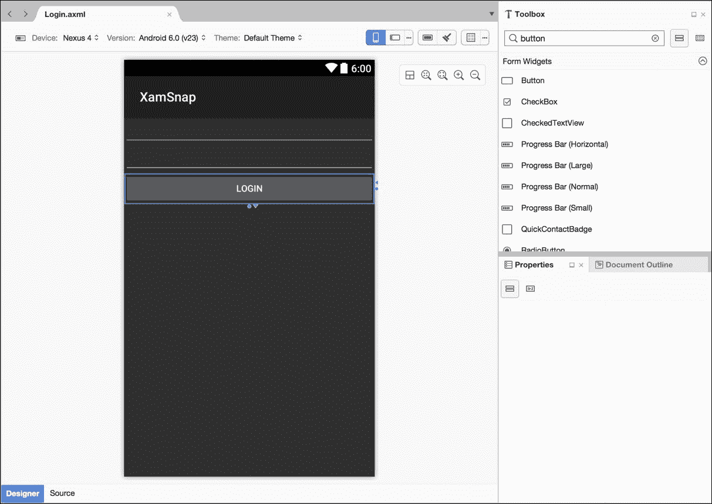
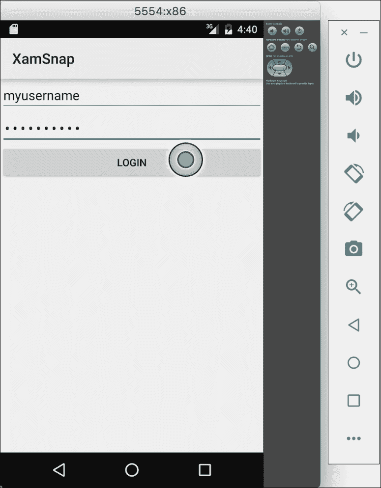
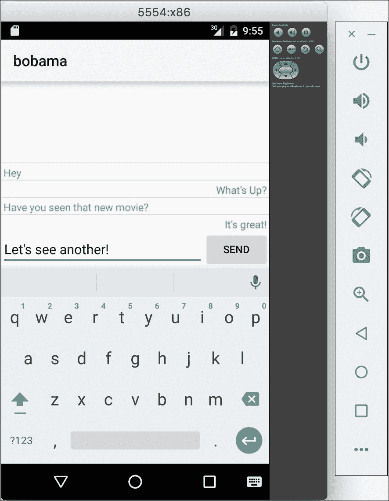

# 第六章。安卓的 XamSnap

要开始编写安卓版本的 XamSnap，请打开前两章中的解决方案。我们将在`XamSnap.Droid`项目中工作，该项目应该已经从 Xamarin 项目模板中设置好了。

在本章中，我们将介绍:

*   安卓清单
*   安卓材料设计
*   为 XamSnap 编写登录屏幕
*   安卓的 ListView 和 BaseAdapter
*   添加朋友列表
*   添加邮件列表

# 介绍安卓清单

所有安卓应用程序都有一个名为安卓清单的 XML 文件，它声明了应用程序的基本信息，并被命名为`AndroidManifest.xml`。这与 iOS 上的`Info.plist`文件非常相似，只是 Xamarin 还提供了 C#类属性，用于在 Android 清单中放置常用设置。在**项目选项|安卓应用**下还有一个不错的编辑清单的界面。

最重要的设置如下图所示:

*   **应用名称**:这是你的应用的标题，显示在图标下方。和谷歌 Play 上选的名字不一样。
*   **包名**:这就跟 iOS 上一样，你的应用的捆绑标识符。这是识别您的应用程序的唯一名称。惯例是在开头使用与你公司名称相反的域名样式；例如`com.jonathanpeppers.xamsnap`。它必须以小写字母开头，并且至少包含一个字符。
*   **应用图标**:这是安卓主屏幕上为你的应用显示的图标。
*   **版本号**:这是一个一位数的数字，代表你的应用程序的版本。提高这个数字表明谷歌游戏有了更新的版本。
*   **版本名**:这是你的 app 的一个用户友好的版本字符串；例如 **1.0.0** 。
*   **安卓最低版本**:这是你的应用支持的安卓最低版本。
*   **目标安卓版本**:这是你的应用程序编译所针对的安卓 SDK 的版本。使用更高的数字使您能够访问新的 APIs 但是，您可能需要进行一些运行时检查，以避免在旧设备上调用这些 API。
*   **安装位置**:这里定义了你的安卓应用可以安装到的不同位置:自动(用户设置)、外置(SD 卡)或者内置(设备内存)。


除了这些设置，还有一组标注为**所需权限**的复选框。在安装应用程序之前，这些内容会在谷歌 Play 上显示给用户。这是安卓加强安全级别的方式，让用户可以看到应用程序需要对他们的设备进行何种访问。

以下是一些常用的清单权限:

*   **摄像头**:这提供了对设备摄像头的访问
*   **互联网**:这提供了通过互联网进行网络请求的途径
*   **读取联系人**:这提供了读取设备联系人库的访问
*   **ReadExternalStorage** :提供读取 SD 卡的权限
*   **写联系人**:这提供了修改设备联系人库的权限
*   **writeexternalstograge**:这提供了对 SD 卡的写操作

除了这些设置之外，还需要多次手动更改安卓清单。在这种情况下，您可以像在 Xamarin 工作室中编辑标准的 XML 文件一样编辑清单文件。有关有效 XML 元素和属性的完整列表，请访问[http://developer . Android . com/guide/topics/manifest/manifest-intro . html](http://developer.android.com/guide/topics/manifest/manifest-intro.html)。

现在让我们为我们的应用程序填写以下设置:

*   **申请名称** : `XamSnap`
*   **包名**:`com.yourcompanyname.xamsnap`；确保以`com.yourcompanyname`开头命名未来的应用
*   **版本号**:先从号`1`开始
*   **版本**:可以是任意字符串，但建议使用类似版本号的东西
*   **最低安卓版本**:选择**安卓 4.0.3 (API 等级 15)**
*   **所需权限**:选择**互联网**；我们稍后将使用它

此时，请注意我们的安卓项目已经在引用我们的可移植类库中的共享代码。展开项目的**引用**文件夹，注意对`XamSnap.Core`项目的引用。我们将能够访问所有写在[第 4 章](04.html#aid-1565U1 "Chapter 4. XamSnap - A Cross-Platform App")、*xamsap-一个跨平台应用程序*中的共享代码。

转到`Resources`目录，在`values`文件夹中打开`Strings.xml`；这是整个安卓应用程序中所有文本应该存储的地方。这是一个安卓的惯例，它将使向你的应用程序添加多种语言变得非常容易。让我们将字符串更改为以下内容:

```cs
<?xml version="1.0" encoding="utf-8"?> 
<resources> 
    <string name="ApplicationName">XamSnap</string> 
    <string name="ErrorTitle">Oops!</string> 
    <string name="Loading">Loading</string> 
    <string name="Login">Login</string> 
</resources> 

```

我们将在本章后面使用这些值；在向用户显示文本的情况下，可以随意添加新的文本。

# 设置材料设计

从安卓 5.0 棒棒糖开始，谷歌为安卓应用发布了新的主题和调色板，名为**材质设计**。新应用采用材质设计是一个好主意，因为它给你一个现代安卓的外观，几乎不需要设置。有关材料设计的更多信息，请查看谷歌文档，网址为:[https://developer.android.com/design/material/index.html](https://developer.android.com/design/material/index.html)。

为了使材料设计(和其他新的安卓功能)更容易采用，谷歌还发布了一个适用于安卓的 **AppCompat** 库，这样你就可以在旧的安卓操作系统版本上支持这些新功能。Xamarin 支持 NuGet 上的 AppCompat 库的一个版本，因此很容易为 Xamarin 进行设置。安卓应用。

要设置安卓支持库，请执行以下步骤:

1.  右键点击**套餐**，选择**添加套餐**。
2.  搜索`Xamarin.Android.Support.v7.AppCompat`。
3.  点击**添加包**。
4.  NuGet 将下载库及其依赖项，在你的 Android 项目中引用它们。

现在让我们实现我们的主应用程序类；从**新建文件**对话框中添加新的**活动**。我们不会在这个文件中子类化`Activity`，但是这个模板在文件的顶部添加了几个安卓`using`语句，这些语句导入了要在您的代码中使用的安卓应用编程接口。创建一个新的`Application`类，我们可以在`ServiceContainer`中注册所有内容，如下所示:

```cs
[Application(Theme = "@style/Theme.AppCompat.Light")] 
public class Application : Android.App.Application 
{ 
  public Application(
     IntPtr javaReference, JniHandleOwnership transfer)
     : base(javaReference, transfer) 
  {  
  } 

  public override void OnCreate() 
  { 
    base.OnCreate(); 

```

```cs
    //ViewModels 
    ServiceContainer.Register<LoginViewModel>(
       () => new LoginViewModel()); 
    ServiceContainer.Register<FriendViewModel>(
       () => new FriendViewModel()); 
    ServiceContainer.Register<MessageViewModel>(
       () => new MessageViewModel()); 
    ServiceContainer.Register<RegisterViewModel>(
       () => new RegisterViewModel()); 

    //Models 
    ServiceContainer.Register<ISettings>(
       () => new FakeSettings()); 
    ServiceContainer.Register<IWebService>(
       () => new FakeWebService()); 
  } 
} 

```

我们使用了内置的安卓主题，`Theme.AppCompat.Light`，它是材质设计的默认灯光主题。注意我们必须遵循的奇怪的构造函数，这是 Xamarin 中一个自定义`Application`类的当前需求。您可以将它识别为样板代码，在这种情况下需要添加它。

现在让我们为整个应用程序中的所有活动实现一个简单的基类。在`XamSnap.Droid`项目中创建一个`Activities`文件夹和一个名为`BaseActivity.cs`的新文件，其内容如下:

```cs
[Activity] 
public class BaseActivity<TViewModel> : AppCompatActivity
   where TViewModel : BaseViewModel 
{ 
  protected readonly TViewModel viewModel; 
  protected ProgressDialog progress; 

  public BaseActivity() 
  { 
    viewModel = ServiceContainer.Resolve(typeof(TViewModel)) as
       TViewModel; 
  } 
  protected override void OnCreate(Bundle savedInstanceState) 
  { 
    base.OnCreate(savedInstanceState); 

    progress = new ProgressDialog(this); 
    progress.SetCancelable(false);
    progress.SetTitle(Resource.String.Loading);
  } 

  protected override void OnResume() 
  { 
    base.OnResume(); 
    viewModel.IsBusyChanged += OnIsBusyChanged; 
  }

  protected override void OnPause() 
  { 
    base.OnPause(); 
    viewModel.IsBusyChanged -= OnIsBusyChanged; 
  } 

  void OnIsBusyChanged (object sender, EventArgs e) 
  { 
    if (viewModel.IsBusy) 
      progress.Show(); 
    else 
      progress.Hide(); 
  } 
} 

```

我们在这里做了几件事来简化我们其他活动的开发。首先，我们将这个类做成泛型，并制作了一个名为`viewModel`的受保护变量来存储特定类型的视图模型。请注意，由于平台限制，我们没有在 iOS 中的控制器上使用泛型(更多信息请参见 Xamarin 文档网站上的[http://developer . Xamarin . com/guides/iOS/advanced _ topics/limits/](http://developer.xamarin.com/guides/ios/advanced_topics/limitations/))。我们还实现了`IsBusyChanged`，并用`Strings.xml`文件中的`Loading`字符串显示了一个简单的`ProgressDialog`来指示网络活动。

让我们再添加一种向用户显示错误的方法，如下所示:

```cs
protected void DisplayError(Exception exc) 
{ 
  string error = exc.Message; 
  new AlertDialog.Builder(this)
     .SetTitle(Resource.String.ErrorTitle)
     .SetMessage(error)
     .SetPositiveButton(Android.Resource.String.Ok,
       (IDialogInterfaceOnClickListener)null)
     .Show(); 
} 

```

此方法将显示一个弹出对话框，指示出现了问题。请注意，我们还使用了`ErrorTitle`和内置的安卓资源作为`Ok`字符串。

这将完成我们的安卓应用的核心设置。从这里开始，我们可以在整个应用程序中实现屏幕的用户界面。

# 添加登录屏幕

在创建安卓视图之前，了解安卓中可用的不同布局或视图组类型非常重要。对于其中一些功能，iOS 没有与之相当的功能，因为 iOS 在其设备上的屏幕尺寸变化较小。由于安卓几乎有无限的屏幕尺寸和密度，安卓软件开发工具包有很多内置的视图自动调整和布局支持。

以下是常见的布局类型:

*   `ViewGroup`:这是包含子视图集合的视图的基类。你通常不会直接使用这个类。
*   `LinearLayout`:这是一个布局，它将其子视图定位在行或列中(但不能同时定位行和列)。您还可以为每个孩子设置权重，让他们跨越不同百分比的可用空间。
*   `RelativeLayout`:这是一个布局，给了孩子更多的位置灵活性。您可以相对于彼此定位子视图，使它们位于彼此的上方、下方、左侧或右侧。
*   `FrameLayout`:该布局将其子视图直接放置在屏幕上的 **z 顺序**中的一个之上。这种布局最适用于您有一个大的子视图，需要在它上面有其他视图，并且可能停靠在一侧的情况。
*   `ListView`:这将在决定子视图数量的适配器类的帮助下，在列表中垂直显示视图。它也支持自己的孩子被选中。
*   `GridView`:这将在网格内的行和列中显示视图。它还需要使用适配器类来提供子级的数量。

在我们开始编写登录屏幕之前，删除从安卓项目模板创建的`Main.axml`和`MainActivity.cs`文件。接下来，在项目中`Resources`目录的`layout`文件夹中创建一个名为`Login.axml`的安卓布局文件。

现在，我们可以开始为我们的安卓布局添加如下功能:

1.  双击新布局文件打开安卓设计器。
2.  将两个**纯文本**视图拖到**文本字段**部分的布局上。
3.  在**标识**字段中，分别输入`@+id/username`和`@+id/password`。
4.  对于密码字段，将其**输入类型**属性设置为`textPassword`。
5.  将**按钮**拖到布局上，并将其**文本**属性设置为`@string/Login`。
6.  将按钮的**标识**属性设置为`@+id/login`。

完成后，您的布局将类似于下面的截图:



现在在我们之前创建的`Activites`文件夹中创建一个名为`LoginActivity.cs`的新安卓活动文件。让我们如下实现登录功能:

```cs
[Activity(Label = "@string/ApplicationName", MainLauncher = true)] 
public class LoginActivity : BaseActivity<LoginViewModel> 
{ 
  EditText username, password; 
  Button login; 

  protected override void OnCreate(Bundle savedInstanceState) 
  { 
    base.OnCreate(savedInstanceState);

    SetContentView(Resource.Layout.Login); 
    username = FindViewById<EditText>(Resource.Id.username); 
    password = FindViewById<EditText>(Resource.Id.password); 
    login = FindViewById<Button>(Resource.Id.login); 
    login.Click += OnLogin; 
  } 

  protected override void OnResume() 
  { 
    base.OnResume(); 
    username.Text =
       password.Text = string.Empty; 
  } 

  async void OnLogin (object sender, EventArgs e) 
  { 
    viewModel.UserName = username.Text; 
    viewModel.Password = password.Text; 
    try 
    { 
      await viewModel.Login(); 
      //TODO: navigate to a new activity 
    } 
    catch (Exception exc) 
    { 
      DisplayError(exc); 
    } 
  } 
} 

```

请注意，我们将`MainLauncher`设置为`true`，以使该活动成为应用程序的第一个活动。我们还利用了我们在本章前面设置的`ApplicationName`值和`BaseActivity`类。我们还覆盖了`OnResume`来清除两个`EditText`控制，这样如果你返回屏幕，这些值就会被清除。

现在，如果您启动应用程序，您将看到我们刚刚实现的登录屏幕，如下图所示:



### 类型

只是给 Visual Studio 用户的一个提示，Xamarin 在使他们的 Visual Studio 扩展工作与 Xamarin Studio 相同方面做得很好。本章中的所有示例都应该像 OS X 的 Xamarin Studio 或 Windows 的 Visual Studio 中描述的那样工作。

# 使用列表视图和基本适配器

现在让我们在安卓上实现一个对话列表。`UITableView`和`UITableViewSource`的安卓等价物是`ListView`和`BaseAdapter`。这些 Android 类有并行的概念，比如实现抽象方法，滚动时回收单元格。安卓系统中有几种不同类型的适配器，如`ArrayAdapter`或`CursorAdaptor`，尽管`BaseAdapter`通常最适合简单列表。

让我们实现我们的对话屏幕。首先在名为`ConversationsActivity.cs`的`Activities`文件夹中创建一个新的安卓活动。让我们从类定义的几个变化开始，如下所示:

```cs
[Activity(Label = "Conversations")] 
public class ConversationsActivity :
   BaseActivity<MessageViewModel> 
{ 
  //Other code here later 
} 

```

执行以下步骤来实现几个安卓布局:

1.  在名为`Conversations.axml`的`Resources`目录的`layout`文件夹中创建一个新的安卓布局。
2.  将**列表视图**控件从**工具箱**拖到布局上，并将其 **Id** 设置为`@+id/conversationsList`。
3.  创建第二个安卓布局；名为`ConversationListItem.axml`的`Resources`目录中的`layout`文件夹。
4.  从**工具箱**中将**文本(中)**控件拖到布局上。
5.  将其标识设置为`@+id/conversationUsername`。
6.  最后，让我们在**属性**框的**布局**选项卡中将其**边距**设置为`3dp`。

这将设置我们在整个对话屏幕中需要使用的所有布局文件。您的`ConversationListItem.axml`布局将看起来像下面截图中显示的那样:


现在我们可以将`BaseAdapter`实现为`ConversationsActivity`内部的嵌套类，如下所示:

```cs
class Adapter : BaseAdapter<Conversation> 
{ 
  readonly MessageViewModel messageViewModel =
     ServiceContainer.Resolve<MessageViewModel>(); 
  readonly LayoutInflater inflater; 

  public Adapter(Context context) 
  { 
    inflater = (LayoutInflater)context.GetSystemService(
       Context.LayoutInflaterService); 
  } 

  public override long GetItemId(int position) 
  { 
    //This is an abstract method, just a simple implementation 
    return position; 
  } 

  public override View GetView(
     int position, View convertView, ViewGroup parent) 
  { 
    if (convertView == null) 
    { 
      convertView = inflater.Inflate(
         Resource.Layout.ConversationListItem, null); 
    } 
    var conversation = this [position]; 
    var username = convertView.FindViewById<TextView>(
       Resource.Id.conversationUsername); 
    username.Text = conversation.Username; 
    return convertView; 
  }

  public override int Count 
  { 
    get { return messageViewModel.Conversations == null ? 0
       : messageViewModel.Conversations.Length; } 
  }

  public override Conversation this[int position] 
  { 
    get { return messageViewModel.Conversations [position]; } 
  } 
} 

```

以下是对适配器内部情况的回顾:

*   我们细分了`BaseAdapter<Conversation>`。
*   我们通过了`Context`(我们的活动)，这样我们就可以拉出`LayoutInflater`。这个类使我们能够加载 XML 布局资源，并将它们膨胀成一个视图对象。
*   我们实现了`GetItemId`。这是一种用于识别行的通用方法，但是我们现在只返回位置。
*   我们设置`GetView`，如果变量为空，只创建一个新的视图来回收`convertView`变量。我们还提取了布局中的文本视图来设置它们的文本。
*   我们覆盖`Count`以返回对话的数量。
*   我们实现了一个索引器来返回一个位置的`Conversation`对象。

总的来说，这应该与我们在 iOS 上所做的相当相似。

现在让我们通过在`ConversationsActivity`的主体中添加以下内容来设置活动中的适配器:

```cs
ListView listView; 
Adapter adapter; 

protected override void OnCreate(Bundle bundle) 
{ 
  base.OnCreate(bundle); 

  SetContentView(Resource.Layout.Conversations); 
  listView = FindViewById<ListView>(
     Resource.Id.conversationsList); 
  listView.Adapter = 
     adapter = new Adapter(this); 
} 

protected async override void OnResume() 
{ 
  base.OnResume(); 
  try 
  { 
    await viewModel.GetConversations(); 
    adapter.NotifyDataSetInvalidated(); 
  } 
  catch (Exception exc) 
  { 
    DisplayError(exc); 
  } 
} 

```

这段代码将设置适配器，并在活动出现在屏幕上时重新加载我们的对话列表。请注意，我们在这里调用了`NotifyDataSetInvalidated`，以便`ListView`在会话数量更新后重新加载其行。

最后但并非最不重要的一点，我们需要修改我们之前在`LoginActivity`中设置的`OnLogin`方法来开始我们的新活动，如下所示:

```cs
StartActivity(typeof(ConversationsActivity)); 

```

现在，如果我们编译并运行我们的应用程序，我们可以在登录后导航到对话列表，如下图所示:


# 实现好友列表

在我们开始实现好友列表屏幕之前，我们必须首先在我们的应用程序中向`ActionBar`添加一个菜单项。首先在我们项目的`Resources`文件夹中创建一个新的`menu`文件夹。接下来，创建一个名为`ConversationsMenu.axml`的新安卓布局文件。删除创建的默认布局 XML，并替换为以下内容:

```cs
<?xml version="1.0" encoding="utf-8"?> 
<menu xmlns:android="http://schemas.android.com/apk/res/android"> 
  <item android:id="@+id/addFriendMenu"
     android:text="Add Friend"
     android:showAsAction="ifRoom"/> 
</menu> 

```

我们设置了一个根菜单，里面有一个菜单项。

以下是我们用 XML 为该项目设置的详细信息:

*   `android:id`:我们稍后会在 C#中用这个来引用带有`Resource.Id.addFriendMenu`的菜单项。
*   `android:icon`:这是要为菜单项显示的图像资源。我们使用了内置的安卓系统作为通用的*加*图标。
*   `android:showAsAction`:如果有空间，这将使菜单项可见。如果由于某种原因设备的屏幕太窄，将为菜单项显示溢出菜单。

现在我们可以在`ConversationsActivity.cs`中做一些改变来显示菜单项如下:

```cs
public override bool OnCreateOptionsMenu(IMenu menu) 
{ 
  MenuInflater.Inflate(Resource.Menu.ConversationsMenu, menu); 
  return base.OnCreateOptionsMenu(menu); 
} 

```

这段代码将采用我们的布局，并将其应用于活动操作栏顶部的菜单。接下来，我们可以添加一些在菜单项被选中时运行的代码，如下所示:

```cs
public override bool OnOptionsItemSelected(IMenuItem item) 
{ 
  if (item.ItemId == Resource.Id.addFriendMenu) 
  { 
    //TODO: launch the next activity 
  } 
  return base.OnOptionsItemSelected(item); 
} 

```

现在让我们实现下一个活动。首先复制`Resources`目录下`layout`文件夹中的`Conversations.axml`，并将其重命名为`Friends.axml`。我们在这个文件中唯一要做的改变是将列表视图的标识重命名为`@+id/friendsList`。

接下来，执行以下步骤创建可用于`ListView`中列表项的布局:

1.  做一个新的安卓布局，叫做`FriendListItem.axml`。
2.  打开布局，切换到屏幕底部的**源**选项卡。
3.  将根`LinearLayout` xml lemon 更改为`RelativeLayout`元素。
4.  切换回屏幕底部的**设计器**选项卡。
5.  将**文本(大)**控件从**工具箱**拖到布局上，并将其 **Id** 设置为`@+id/friendName`。
6.  将**工具箱**中的**图像视图**控件拖到布局上；您可以将它的 **Id** 设为默认值，也可以将其留空。
7.  将图像视图的图像更改为`@android:drawable/ic_menu_add`。这与我们在本章前面使用的加号图标相同。您可以从**框架资源**选项卡下的**资源**对话框中选择它。
8.  将两个控件的**宽度**和**高度**设置为`wrap_content`。这可以在**布局**选项卡下的**视图组**部分找到。
9.  接下来，检查图像视图中**向右对齐父项**的值。
10.  最后，在**属性**框的**布局**选项卡中，将两个控件的**边距**设置为`3dp`。

使用 Xamarin 设计器可以非常高效，但是一些开发人员更喜欢更高级别的控制。您可以考虑自己编写 XML 作为替代，这非常简单，如下面的代码所示:

```cs
<?xml version="1.0" encoding="utf-8"?> 
<RelativeLayout 
    xmlns:android="http://schemas.android.com/apk/res/android" 
    android:layout_width="fill_parent" 
    android:layout_height="fill_parent"> 
    <TextView 
        android:text="Large Text" 
        android:textAppearance="?android:attr/textAppearanceLarge" 
        android:layout_width="wrap_content" 
        android:layout_height="wrap_content" 
        android:id="@+id/friendName" 
        android:layout_margin="3dp" /> 
    <ImageView 
        android:layout_width="wrap_content" 
        android:layout_height="wrap_content" 
        android:src="@android:drawable/ic_menu_add" 
        android:layout_margin="3dp" 
        android:layout_alignParentRight="true" /> 
</RelativeLayout> 

```

既然我们现在有了新屏幕所需的所有布局，让我们在名为`FriendsActivity.cs`的`Activities`文件夹中创建一个安卓活动。让我们如下创建活动的基本定义，就像我们之前做的那样:

```cs
[Activity(Label = "Friends")] 
public class FriendsActivity : BaseActivity<FriendViewModel> 
{ 
  protected override void OnCreate(Bundle savedInstanceState) 
  { 
    base.OnCreate(savedInstanceState); 
  } 
} 

```

现在，让我们实现一个嵌套的`Adapter`类来设置列表视图项，如下所示:

```cs
class Adapter : BaseAdapter<User> 
{ 
  readonly FriendViewModel friendViewModel =
     ServiceContainer.Resolve<FriendViewModel>(); 
  readonly LayoutInflater inflater; 

  public Adapter(Context context) 
  { 
    inflater = (LayoutInflater)context.GetSystemService (
       Context.LayoutInflaterService); 
  } 

  public override long GetItemId(int position) 
  { 
    return position; 
  } 

  public override View GetView(
     int position, View convertView, ViewGroup parent) 
  { 
    if (convertView == null) 
    { 
      convertView = inflater.Inflate(
         Resource.Layout.FriendListItem, null); 
    } 
    var friend = this [position]; 
    var friendname = convertView.FindViewById<TextView>(
       Resource.Id.friendName); 
    friendname.Text = friend.Name; 
    return convertView; 
  }

  public override int Count 
  { 
    get { return friendViewModel.Friends == null ? 0
       : friendViewModel.Friends.Length; } 
  } 

  public override User this[int position] 
  { 
    get { return friendViewModel.Friends[position]; } 
  } 
} 

```

这个适配器和我们为对话屏幕实现的上一个适配器没有什么区别。我们只需要设置朋友的名字，用`User`对象代替`Conversation`对象。

为了完成适配器的设置，我们可以更新`FriendsActivity`类的主体，如下所示:

```cs
ListView listView; 
Adapter adapter; 

protected override void OnCreate(Bundle savedInstanceState) 
{ 
  base.OnCreate(savedInstanceState); 

  SetContentView(Resource.Layout.Friends); 
  listView = FindViewById<ListView>(Resource.Id.friendsList); 
  listView.Adapter =
     adapter = new Adapter(this); 
} 

protected async override void OnResume() 
{ 
  base.OnResume(); 
  try 
  { 
    await viewModel.GetFriends(); 
    adapter.NotifyDataSetInvalidated(); 
  } 
  catch (Exception exc) 
  { 
    DisplayError(exc); 
  } 
} 

```

最后但同样重要的是，我们可以在`ConversationsActivity`类中更新`OnOptionsItemSelected`，如下所示:

```cs
public override bool OnOptionsItemSelected(IMenuItem item) 
{ 
  if (item.ItemId == Resource.Id.addFriendMenu) 
  { 
    StartActivity(typeof(FriendsActivity)); 
  } 
  return base.OnOptionsItemSelected(item); 
} 

```

因此，如果我们编译并运行该应用程序，我们可以导航到一个完全实现的朋友列表屏幕，如下图所示:


# 撰写消息

下一个屏幕稍微复杂一点；我们将需要创建一个`ListView`，根据行的类型，为每行使用多个布局文件。我们还需要执行一些布局技巧，在`ListView`下方放置一个视图，并将`ListView`设置为自动滚动。

对于下一个屏幕，让我们从在`Resources`目录的`layout`文件夹中创建名为`Messages.axml`的新布局开始，然后执行以下步骤:

1.  将新的**列表视图**拖到布局上。将其 **Id** 设置为`@+id/messageList`。
2.  勾选**从底部堆叠**框，将**抄本模式**设置为`alwaysScroll`。这将设置它自下而上显示项目。
3.  在**线性布局**部分下的**布局**选项卡中，将**列表视图**的**重量**值设置为`1`。
4.  将新的**相对布局**拖到布局上。将其**标识**设为默认值，或者将其删除。
5.  在**中拖动一个新的**按钮**相对于**。将其 **Id** 设置为`@+id/sendButton`。
6.  勾选**布局**选项卡中**右对齐父级**的复选框。
7.  将在**相对布局**中的**文本字段**部分找到的新**纯文本**拖到按钮左侧。将其 **Id** 设置为`@+id/messageText`。
8.  在**布局**选项卡中，将左侧的**设置为`@+id/sendButton`，将其**宽度**设置为`match_parent`。**
9.  勾选【父级】中**居中框，固定垂直居中。**

完成后，XML 文件将如下所示:

```cs
<?xml version="1.0" encoding="utf-8"?> 
<LinearLayout  
    xmlns:android="http://schemas.android.com/apk/res/android" 
    android:orientation="vertical" 
    android:layout_width="match_parent" 
    android:layout_height="match_parent"> 
    <ListView 
        android:minWidth="25px" 
        android:minHeight="25px" 
        android:layout_width="match_parent" 
        android:layout_height="match_parent" 
        android:id="@+id/messageList" 
        android:stackFromBottom="true" 
        android:transcriptMode="alwaysScroll" 
        android:layout_weight="1" /> 
    <RelativeLayout 
        android:minWidth="25px" 
        android:minHeight="25px" 
        android:layout_width="match_parent" 
        android:layout_height="wrap_content"> 
        <EditText 
            android:layout_width="match_parent" 
            android:layout_height="wrap_content" 
            android:id="@+id/messageText" 
            android:layout_toLeftOf="@+id/sendButton" 
            android:layout_centerInParent="true" /> 
        <Button 
            android:text="Send" 
            android:layout_width="wrap_content" 
            android:layout_height="wrap_content" 
            android:id="@+id/sendButton" 
            android:layout_alignParentRight="true" /> 
    </RelativeLayout> 
</LinearLayout> 

```

接下来，执行以下步骤来制作另外两个安卓布局:

1.  在`Resources`目录的`layout`文件夹中创建一个名为`MyMessageListItem.axml`的新布局。
2.  打开布局，切换到**源**选项卡。将根 XML 元素更改为`RelativeLayout`。
3.  切换回**内容**选项卡，并将两个**文本视图**控件拖到布局上。
4.  在**标识**字段中，分别输入`@+id/myMessageText`和`@+id/myMessageDate`。
5.  对于两个视图，将**边距**设置为`3dp`，将**宽度**和**高度**设置为`wrap_content`。
6.  对于第一个文本视图，将其在**样式**选项卡下的**颜色**设置为`@android:color/holo_blue_bright`。
7.  对于第二个文本视图，选中**布局**选项卡下的**向右对齐父级**复选框。
8.  创建一个名为`TheirMessageListItem.axml`的新布局，并重复该过程。为新布局中的第一个文本视图选择不同的颜色。

最后，我们需要为屏幕创建一个新的活动。在`Activities`目录中创建新的名为`MessagesActivity.cs`的安卓活动。从设置活动的标准代码开始，如下所示:

```cs
[Activity(Label = "Messages")] 
public class MessagesActivity : BaseActivity<MessageViewModel> 
{ 
  protected override void OnCreate(Bundle savedInstanceState) 
  { 
    base.OnCreate(savedInstanceState); 
  } 
} 

```

接下来，让我们实现一个比之前实现的更复杂的适配器，如下所示:

```cs
class Adapter : BaseAdapter<Message> 
{ 
  readonly MessageViewModel messageViewModel =
     ServiceContainer.Resolve<MessageViewModel>(); 
  readonly ISettings settings =
     ServiceContainer.Resolve<ISettings>(); 
  readonly LayoutInflater inflater; 
  const int MyMessageType = 0, TheirMessageType = 1; 

  public Adapter (Context context) 
  { 
    inflater = (LayoutInflater)context.GetSystemService (
       Context.LayoutInflaterService); 
  } 

  public override long GetItemId(int position) 
  { 
    return position; 
  } 

  public override int Count 
  { 
    get { return messageViewModel.Messages == null ? 0
      : messageViewModel.Messages.Length; } 
  } 

  public override Message this[int position] 
  { 
    get { return messageViewModel.Messages[position]; } 
  } 

  public override int ViewTypeCount 
  { 
    get { return 2; } 
  } 

  public override int GetItemViewType(int position) 
  { 
    var message = this [position]; 
    return message.UserName == settings.User.Name ?
       MyMessageType : TheirMessageType; 
  } 
} 

```

这包括除了我们的`GetView`实现之外的所有内容，我们很快就会讲到。这里的第一个变化是`MyMessageType`和`TheirMessageType`的一些常量。然后我们实施了`ViewTypeCount`和`GetItemViewType`。这是安卓在列表视图中对列表项使用两种不同布局的机制。在对话中，我们对用户的消息使用一种类型的布局，对另一个用户使用不同的布局。

接下来，让我们如下实现`GetView`:

```cs
public override View GetView(
   int position, View convertView, ViewGroup parent) 
{ 
  var message = this [position]; 
  int type = GetItemViewType(position); 
  if (convertView == null) 
  { 
    if (type == MyMessageType) 
    { 
      convertView = inflater.Inflate(
         Resource.Layout.MyMessageListItem, null); 
    } 
    else 
    { 
      convertView = inflater.Inflate(
         Resource.Layout.TheirMessageListItem, null); 
    } 
  } 
  TextView messageText; 
  if (type == MyMessageType) 
  { 
    messageText = convertView.FindViewById<TextView>(
       Resource.Id.myMessageText); 
  } 
  else 
  { 
    messageText = convertView.FindViewById<TextView>(
       Resource.Id.theirMessageText); 
  } 
  messageText.Text = message.Text; 
  return convertView; 
} 

```

### 类型

只是一个注意事项，在安卓系统中最好的做法是为每个视图使用唯一的 id。即使在代码变得有点难看的情况下也是最好的，但是当多个布局存在包含相同标识的视图时`FindViewById`不能按预期工作。

让我们通过以下步骤来分解我们的实现:

1.  我们首先拉出`message`对象来获取行的位置。
2.  接下来，我们获取视图类型，确定它是当前用户的消息还是对话中的其他用户。
3.  如果`convertView`是`null`，我们根据类型膨胀合适的布局。
4.  接下来，我们将两个文本视图`messageText`和`dateText`拉出`convertView`。我们必须使用类型值来确保使用正确的资源标识。
5.  我们使用`message`对象在两个文本视图上设置适当的文本。
6.  我们返回`convertView`。

现在让我们通过设置适配器的其余部分来完成`MessagesActivity`。首先，让我们实现一些成员变量和`OnCreate`方法，如下所示:

```cs
ListView listView; 
EditText messageText; 
Button sendButton; 
Adapter adapter; 

protected override void OnCreate(Bundle savedInstanceState) 
{ 
  base.OnCreate(savedInstanceState); 

  Title = viewModel.Conversation.UserName; 
  SetContentView(Resource.Layout.Messages); 
  listView = FindViewById<ListView>(Resource.Id.messageList); 
  messageText = FindViewById<EditText>(Resource.Id.messageText); 
  sendButton = FindViewById<Button>(Resource.Id.sendButton); 

  listView.Adapter =
     adapter = new Adapter(this); 

  sendButton.Click += async (sender, e) => 
  { 
    viewModel.Text = messageText.Text; 
    try 
    { 
      await viewModel.SendMessage(); 
      messageText.Text = string.Empty; 
      adapter.NotifyDataSetInvalidated(); 
    } 
    catch (Exception exc) 
    { 
      DisplayError(exc); 
    } 
  }; 
} 

```

到目前为止，与本章前面的活动相比，这个活动是相当标准的。我们还必须在`OnCreate`连线`sendButton`的`Click`事件，以便它发送消息并刷新列表。我们还使用了一个技巧，通过将其选择设置为最后一项来滚动列表视图到最后。

接下来，我们需要实现`OnResume`来加载消息，使适配器无效，然后将列表视图滚动到最后，如下所示:

```cs
protected async override void OnResume() 
{ 
  base.OnResume(); 
  try 
  { 
    await viewModel.GetMessages(); 
    adapter.NotifyDataSetInvalidated(); 
    listView.SetSelection(adapter.Count); 
  } 
  catch (Exception exc) 
  { 
    DisplayError(exc); 
  } 
} 

```

最后但同样重要的是，我们需要修改`ConversationsActivity.cs`，这样当您点击列表视图中的一行时，它会向前导航:

```cs
protected override void OnCreate(Bundle savedInstanceState) 
{ 
  base.OnCreate(savedInstanceState); 

  //Leave code here unmodified 

  listView.ItemClick += (sender, e) => 
  { 
    viewModel.Conversation = viewModel.Conversations[e.Position]; 
    StartActivity(typeof(MessagesActivity)); 
  }; 
} 

```

最后，如果您编译并运行该应用程序，您将能够导航到消息屏幕，并向列表中添加新消息，如下图所示:



# 总结

在这一章中，我们首先回顾了安卓清单文件中的基本设置。接下来，我们实现了一个定制的`Application`类来设置我们的`ServiceContainer`。然后，我们检查了不同类型的安卓布局，并使用原生安卓视图实现了一个登录屏幕。接下来，我们通过使用安卓布局并覆盖一些内置方法，在安卓操作栏中设置一个菜单。我们实现了好友列表屏幕，学习了`ListView`和适配器的基础知识。最后，我们实现了消息屏幕，并使用了列表视图适配器和布局中更高级的功能。

完成本章后，您将拥有部分功能的安卓版本的 XamSnap。您将对安卓软件开发工具包和工具有更深入的了解。您应该有信心使用 Xamarin 开发自己的安卓应用程序。请自行实现本章中未涉及的其余屏幕。如果您迷路了，请随意查看本书附带的完整示例应用程序。在下一章中，我们将介绍如何部署到移动设备，以及为什么在真实设备上测试应用程序非常重要。