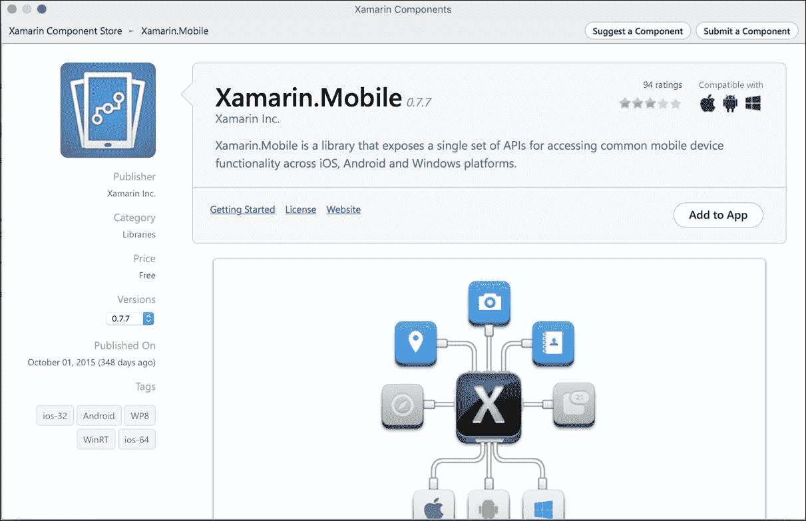
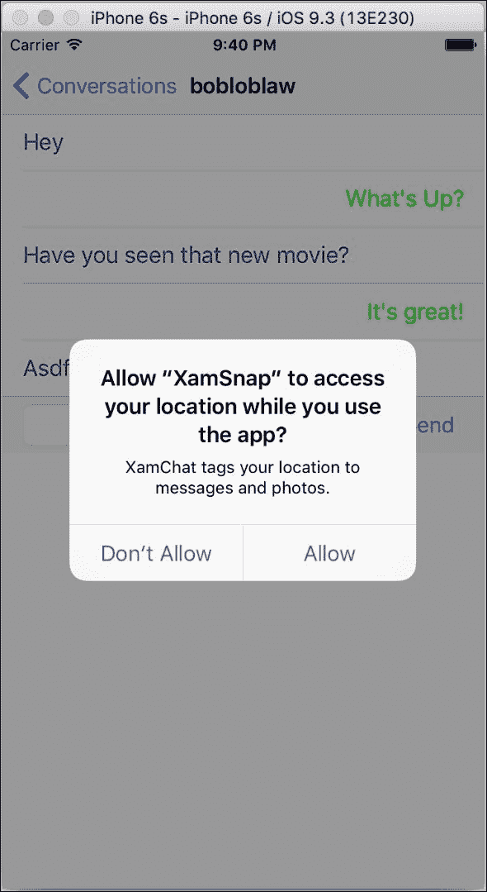
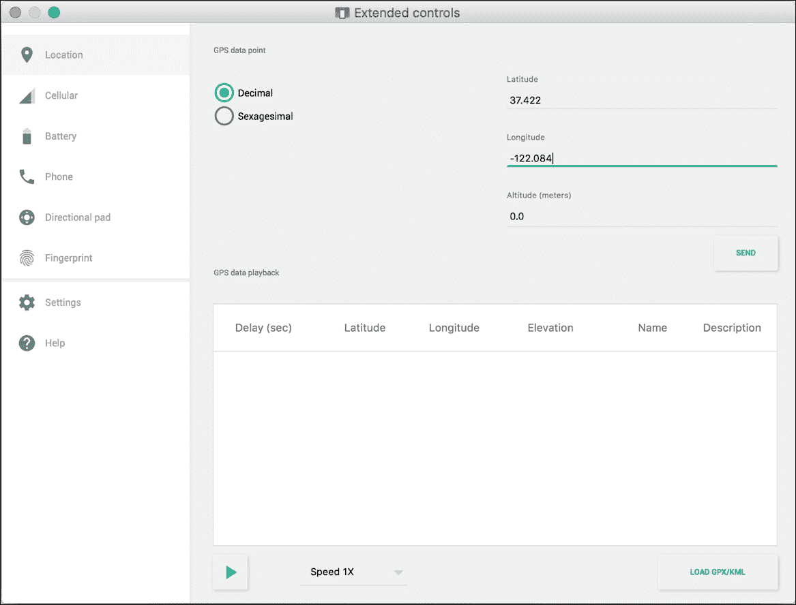
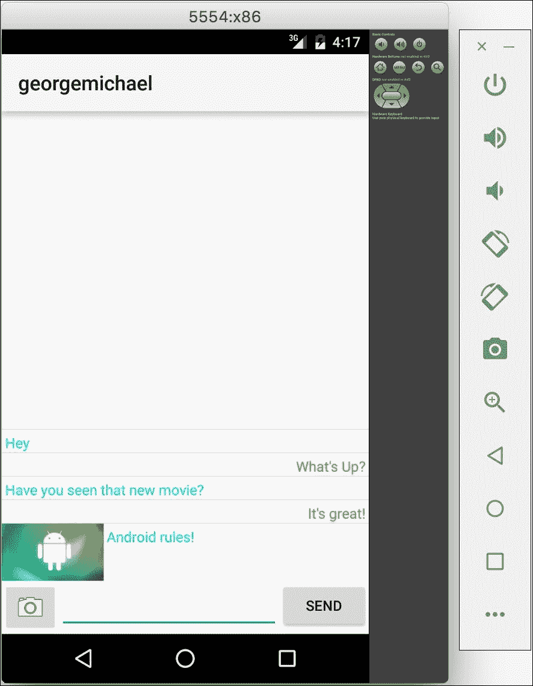

# 第八章。联系人、相机和位置

当今移动应用程序使用的一些最重要的功能是基于我们的设备可以收集的新型数据。设备的全球定位系统位置和摄像头等功能是 Instagram 或推特等现代应用程序的主要功能。开发一个应用程序并且不使用其中的一些功能是很困难的。因此，让我们探索利用 Xamarin 的这一功能的选项。

在本章中，我们将执行以下操作:

*   介绍 Xamarin。流动图书馆
*   阅读安卓和 iOS 上的通讯录
*   检索我们设备的全球定位系统位置
*   从相机和照片库中提取照片

# 引入 Xamarin。移动的

为了简化这些功能在多个平台上的开发，Xamarin 开发了一个名为 **Xamarin 的库。移动**。它提供了一个单一的应用编程接口，用于访问 iOS、安卓甚至视窗平台的联系人、全球定位系统位置、屏幕标题、相机和照片库。它还利用了**任务并行库** ( **第三方物流**)来提供现代的 C#应用编程接口，这将使开发人员比他们的本地替代品更有效率。这使您能够使用 C#中的`async`和`await`关键字编写漂亮、干净的异步代码。除了安卓平台需要的一些不同之处，你还可以在 iOS 和安卓中重用相同的代码。

安装 Xamarin。手机，打开 **Xamarin 工作室**中的 **Xamarin 组件商店**，添加 **Xamarin。移动**组件到一个项目，如下图截图所示:



在我们深入研究使用 Xamarin 之前。Mobile，让我们回顾一下库提供的名称空间和功能:

*   `Xamarin.Contacts`:这里包含了一些类，可以让你和完整的通讯录进行交互。它包括联系人的照片、电话号码、地址、电子邮件、网站等所有信息。
*   `Xamarin.Geolocation`:这与加速度计相结合，使您可以访问设备的全球定位系统位置，包括高度、航向、经度、纬度和速度。您可以明确跟踪设备的位置，或者监听全球定位系统位置随时间的变化。
*   `Xamarin.Media`:这允许访问设备的相机(如果有多个)和内置照片库。这是向任何应用程序添加照片选择功能的简单方法。

Xamarin。Mobile 是一个开源项目，拥有标准的 Apache 2.0 许可证。您可以在[https://github.com/xamarin/Xamarin.Mobile](https://github.com/xamarin/Xamarin.Mobile)向 GitHub 页面投稿或提交问题。随意使用 Xamarin。移动在你的应用程序中，或者为了你自己的目的分叉和修改它。

在本章中，我们将向前面几章中构建的 XamSnap 示例应用程序添加许多特性。如果需要，您可以访问[第 6 章](06.html#aid-1KEEU2 "Chapter 6. XamSnap for Android")、*安卓 XamSnap】，或者参考本书附带的示例源代码。*

# 访问联系人

开始探索什么是 Xamarin。手机优惠，让我们访问 Xamarin 应用程序中的地址簿。让我们通过从用户的联系人列表中加载朋友来改进 XamSnap 的添加朋友功能。确保添加 Xamarin。从组件商店移动到 iOS 和安卓项目。

导航至`XamSnap`便携类库。首先，我们需要通过将一种方法移动到新的`IFriendService`界面来分离`IWebService`界面:

```cs
public interface IFriendService 
{ 
    Task<User[]> GetFriends(string userName); 
} 

```

接下来，在`FriendViewModel`中，我们将需要使用新的`IFriendService`界面来代替旧的界面:

```cs
private IFriendService friendService =  
  ServiceContainer.Resolve<IFriendService>(); 

public async Task GetFriends() 
{ 
  //previous code here, use 'friendService' instead of 'service' 
  Friends = await friendService.GetFriends(settings.User.Name);  
} 

```

现在，我们需要在 iOS 项目中实现`IFriendService`，以允许它从设备的联系人列表中加载。导航到`XamSnap.iOS`项目，添加一个实现`IFriendService`的新类:

```cs
public class ContactsService : IFriendService 
{ 
  public async Task<User[]> GetFriends(string userName) 
  { 
    var book = new Xamarin.Contacts.AddressBook(); 
    await book.RequestPermission(); 

```

```cs
    var users = new List<User>(); 
    foreach (var contact in book) 
    { 
      users.Add(new User 
      { 
        Name = contact.DisplayName, 
      }); 
    } 
    return users.ToArray();     
  } 
} 

```

为了使用 Xamarin。手机要加载联系人，必须先创建一个`AddressBook`对象。接下来，我们必须调用`RequestPermissions`来请求用户访问地址簿的权限。这是一个重要的步骤，因为在应用程序可以访问用户的联系人之前，iOS 设备需要它。这可以防止潜在的恶意应用程序在用户不知情的情况下检索联系人。

接下来，我们在`AddressBook`对象上使用`foreach`，并创建我们现有的应用程序已经理解的`User`对象的实例。这是一个很好的例子，说明了 MVVM 设计模式在分离层方面有多么出色。当我们在模型层交换逻辑时，用户界面继续正常工作，没有任何变化。

接下来，我们需要修改我们的`AppDelegate.cs`文件以使用我们的`ContactsService`作为`IFriendService`界面:

```cs
ServiceContainer.Register<IFriendService>( 
  () => new ContactsService()); 

```

如果此时编译并运行该应用程序，您将会看到标准的 iOS 弹出窗口，请求访问联系人，如下图所示:


如果您不小心点击了**不允许**，您可以通过导航到设备上的**设置** | **隐私** | **联系人**来更改该设置。在 iOS 模拟器中，您也可以通过关闭应用程序并转到**设置** | **常规** | **重置** | **重置位置&隐私**来重置模拟器中的所有隐私提示。

如果我们的应用程序被授予了正确的访问权限，我们应该能够看到联系人列表，而无需修改我们应用程序的用户界面层中的任何代码。以下截图显示了 iOS 模拟器中的默认联系人列表:


## 在安卓上检索联系人

以非常相似的方式，我们可以在安卓系统中用 Xamarin.Mobile 检索联系人列表。除了少数地方要求通过`Android.Content.Context`之外，手机在安卓都是一样的。这是因为许多原生安卓应用编程接口需要引用当前活动(或另一个上下文，如`Application`)才能正常运行。首先，通过导航到 Xamarin Studio 中的 **Android** | **Android 应用程序**，创建一个标准的 Android 应用程序项目。确保添加 Xamarin。从组件存储移动到项目。

添加一个与`IFriendService`相同的安卓系统，如下所示:

```cs
public class ContactsService : IFriendService 
{ 
  public async Task<User[]> GetFriends(string userName) 
  { 
    var book = new  
        Xamarin.Contacts.AddressBook(Application.Context); 
    await book.RequestPermission(); 

    var users = new List<User>(); 
    foreach (var contact in book) 
    { 
      users.Add(new User 
      { 
        Name = contact.DisplayName, 
      }); 
    } 
    return users.ToArray();     
  } 
} 

```

这段代码，调用 Xamarin。移动，和我们在 iOS 代码上做的一样，除了在这里，`AddressBook`的构造函数中`Application.Context`必须传递给安卓`Context`。我们的代码更改已经完成；但是，如果您现在运行应用程序，将会引发异常。安卓需要清单文件的许可，当从谷歌 Play 下载时，清单文件会通知用户它可以访问通讯录。

我们必须修改`AndroidManifest.xml`文件并声明一个权限，如下所示:

1.  打开安卓项目的项目选项。
2.  选择**构建**下的**安卓应用**标签。
3.  在**所需权限**部分，勾选**读取联系人**。
4.  点击**确定**保存更改。

现在，如果您运行该应用程序，您将获得设备上所有联系人的列表，如下图所示:


# 查找全球定位系统位置

使用 Xamarin。移动跟踪用户的全球定位系统位置就像访问他们的联系人一样简单。在 iOS 和 Android 上设置访问也有类似的过程，但是在位置的情况下，你不需要向代码请求权限。iOS 将自动显示请求许可的标准警报。另一方面，安卓只需要一个清单设置。

例如，让我们向 XamSnap 应用程序添加功能，该应用程序将全球定位系统位置标记到聊天对话中的消息。你可以像在其他应用程序中一样，将此视为给照片标记位置。确保添加 Xamarin。从组件存储移动到项目。

首先，让我们实现一个`Location`类来存储经纬度:

```cs
public class Location
{
    public double Latitude { get; set; }
    public double Longitude { get; set; }
}
```

接下来，让我们给`Message`类添加一个`Location`属性:

```cs
public Location Location { get; set; }
```

现在，让我们创建一个新的`ILocationService`界面来查询全球定位系统位置:

```cs
public interface ILocationService
{
    Task<Location> GetCurrentLocation();
}
```

我们现在需要更新`MessageViewModel`类来使用定位服务，并在新消息上标记全球定位系统位置:

```cs
//As a member variable
private ILocationService locationService = 
  ServiceContainer.Resolve<ILocationService>();
//Then in SendMessage()
var location = await locationService.GetCurrentLocation();
var message = await service.SendMessage(new Message
{
    UserName = settings.User.Name,
    Conversation = Conversation.Id,
    Text = Text,
    Location = location,
});
```

接下来，让我们为 iOS 实现`ILocationService`接口。在 iOS 项目中创建新类:

```cs
public class LocationService : ILocationService 
{ 
  private const int Timeout = 3000; 
  private Geolocator _geolocator; 

  public async Task<Location> GetCurrentLocation() 
  { 
    try 
    { 
      //NOTE: wait until here to create Geolocator 
      //  so that the iOS prompt appears on GetCurrentLocation() 
      if (_geolocator == null) 
        _geolocator = new Geolocator(); 

      var location = await _geolocator.GetPositionAsync(Timeout); 

      Console.WriteLine("GPS location: {0},{1}", 
        location.Latitude, location.Longitude); 

      return new Location 
      { 
        Latitude = location.Latitude, 
        Longitude = location.Longitude, 
      }; 
    } 
    catch (Exception exc) 
    { 
      Console.WriteLine("Error finding GPS location: " + exc); 

      //If anything goes wrong, just return null 
      return null; 
    } 
  } 
} 

```

我们在这里做的是首先创建一个`Geolocator`对象，如果需要的话。这将延迟 iOS 权限弹出窗口，直到您实际发送消息。然后，我们使用`async` / `await`查询全球定位系统位置，超时为 3 秒。我们记录了找到的位置，并创建了一个新的`Location`对象，用于我们应用程序的其余部分。如果出现任何错误，我们确保记录它们并返回`null`作为我们的`Location`实例。

接下来，在`AppDelegate.cs`注册我们的新服务:

```cs
ServiceContainer.Register<ILocationService>( 
  () => new LocationService()); 

```

最后，在我们的`Info.plist`文件中有一个设置，是 iOS 访问用户位置所必需的，它也给了开发者在权限弹出窗口中显示消息的选项。

打开`Info.plist`文件，进行如下更改:

1.  点击**来源**标签。
2.  点击**行的加号按钮添加新条目**。
3.  在下拉列表中，选择**使用时的位置使用说明**。
4.  在**值**字段中为用户输入文本。

如果您编译并运行该应用程序，当添加新消息时，您应该会看到 iOS 权限提示，如下图所示:



如果在 Xamarin Studio 中观看控制台日志，您将能够看到 GPS 坐标被添加到`Message`对象中。为了让它真正工作，你必须部署到一个物理的 iOS 设备上才能看到返回的全球定位系统位置。

## 在安卓上实现 GPS 定位

就像上一节一样，使用 Xamarin。移动全球定位系统定位几乎与我们在 iOS 中使用的 API 相同。首先，我们将需要像以前一样创建一个`ILocationService`，只需要从我们为 iOS 创建的代码中更改一行代码:

```cs
if (_geolocator == null) 
  _geolocator = new Geolocator(Application.Context); 

```

然后，也在 `Application.cs`注册我们的新服务:

```cs
ServiceContainer.Register<ILocationService>( 
  () => new LocationService()); 

```

同样，除了`Geolocator`的构造函数之外，这看起来与 iOS 的代码相同。如果此时运行应用程序，它将从没有错误开始。但是，`Geolocator`对象不会触发任何事件。我们首先需要从安卓清单文件中添加访问该位置的权限。在`OnResume`启动定位器，在`OnPause`停止定位器也是个好主意。当此活动不再出现在屏幕上时，这将通过停止全球定位系统定位来节省电池。

让我们创建一个`AndroidManifest.xml`文件并声明两个权限，如下所示:

1.  打开安卓项目的项目选项。
2.  选择**构建**下的**安卓应用**标签。
3.  点击**添加安卓清单**。
4.  在**所需权限**部分，勾选**访问粗略位置**和**访问精细位置**。
5.  点击**确定**保存更改。

现在，如果您编译并运行该应用程序，您将获得标记为发送新消息的全球定位系统位置。大多数安卓模拟器都有一个模拟全球定位系统位置的选项。x86 HAXM 仿真器位于底部的圆点菜单下，然后是**扩展控件|位置**，如下图截图所示:



# 访问照片库和相机

Xamarin 的最后一个主要特性。移动是访问照片的能力，以便让用户能够将自己的内容添加到您的应用程序中。使用名为`MediaPicker`的类，您可以从设备的相机或照片库中提取照片，并可选地显示您自己的操作用户界面。

让我们修改`MessageViewModel`来支持照片。首先，添加以下属性:

```cs
public string Image { get; set; } 

```

接下来，我们需要修改`SendMessage`方法中的以下几行:

```cs
if (string.IsNullOrEmpty(Text) && string.IsNullOrEmpty(Image))
   throw new Exception("Message is blank.");

//Then further down 
var message = await service.SendMessage(new Message
{
     UserName = settings.User.Name,
     Conversation = Conversation.Id,
     Text = Text,
     Image = Image,
     Location = location,
});
//Clear our variables 
Text =
      Image = null;  

```

接下来，我们需要修改 UI 层来提示照片。打开`MessagesController.cs`并在类的顶部添加以下变量:

```cs
UIBarButtonItem photo; 
MediaPicker picker; 

```

在`ViewDidLoad`方法中，我们需要设置`MediaPicker`和新的`UIBarButtonItem`来选择照片:

```cs
picker = new MediaPicker(); 
photo = new UIBarButtonItem(UIBarButtonSystemItem.Camera,  
  (sender, e) => 
  { 
    //In case the keyboard is up 
    message.ResignFirstResponder(); 

    var actionSheet = new UIActionSheet("Choose photo?"); 
    actionSheet.AddButton("Take Photo"); 
    actionSheet.AddButton("Photo Library"); 
    actionSheet.AddButton("Cancel"); 
    actionSheet.Clicked += OnActionSheetClicked; 
    actionSheet.CancelButtonIndex = 2; 
    actionSheet.ShowFrom(photo, true); 
  }); 

```

我们在这里使用`UIActionSheet`类来提示用户决定是要拍摄新照片还是打开现有照片。现在我们来实施`OnActionSheetClicked`方法:

```cs
async void OnActionSheetClicked( 
  object sender, UIButtonEventArgs e) 
{ 
  MediaPickerController controller = null; 
  try 
  { 
    if (e.ButtonIndex == 0) 
    { 
      if (!picker.IsCameraAvailable) 
      { 
        new UIAlertView("Oops!",  
          "Sorry, camera not available on this device!", null,  
          "Ok").Show(); 
        return; 
      } 

      controller = picker.GetTakePhotoUI( 
        new StoreCameraMediaOptions()); 
      PresentViewController(controller, true, null); 

      var file = await controller.GetResultAsync(); 
      messageViewModel.Image = file.Path; 
      Send(); 
    } 
    else if (e.ButtonIndex == 1) 
    { 
      controller = picker.GetPickPhotoUI(); 
      PresentViewController(controller, true, null); 

      var file = await controller.GetResultAsync(); 
      messageViewModel.Image = file.Path; 
      Send(); 
    } 
  } 
  catch (TaskCanceledException) 
  { 
    //Means the user just cancelled 
  } 
  finally 
  { 
    controller?.DismissViewController(true, null); 
  } 
} 

```

使用`MediaPicker`非常简单；您只需要调用`GetTakePhotoUI`或`GetPickPhotoUI`来检索`MediaPickerController`实例。然后，您可以调用`PresentViewController`在当前控制器的顶部模态显示控制器。调用`GetResultAsync`后，我们使用生成的`MediaFile`对象将照片的路径传递给我们的视图模型层。还需要使用`try-catch`块，以防用户取消并调用`DismissViewController`隐藏模态。

接下来，我们需要修改`UITableViewSource`来显示照片:

```cs
public override UITableViewCell GetCell( 
  UITableView tableView, NSIndexPath indexPath)
  {
     var message = messageViewModel.Messages[indexPath.Row];
     bool isMyMessage = message.UserName == settings.User.Name;
     var cell = tableView.DequeueReusableCell( 
       isMyMessage ? MyCellName : TheirCellName);
     cell.TextLabel.Text = message.Text ?? string.Empty;
     cell.ImageView.Image = string.IsNullOrEmpty(message.Image) ?
       null : UIImage.FromFile(message.Image);
     return cell; 
  }  

```

我们需要处理的最后一种情况是在`ViewWillAppear`方法中:

```cs
//Just after subscribing to IsBusyChanged 
if (PresentedViewController != null) 
  return; 

```

如果我们不进行此更改，选择照片后，照片列表将会刷新，这可能会导致一些奇怪的行为。

您现在应该能够运行该应用程序，并选择要在屏幕上查看的照片。下面的截图显示了我从照片库中选择的 iOS 模拟器中的一张不错的默认照片:


## 在安卓上访问照片

与 iOS 相比，我们必须在安卓上使用稍微不同的模式来从相机或照片库中检索照片。安卓中一个常见的模式是，它调用`StartActivityForResult`从另一个应用程序启动一个活动。当此活动完成时，将调用`OnActivityResult`来通知您的活动操作已完成。正因为如此，Xamarin。移动设备无法在安卓系统上使用与 iOS 系统相同的应用编程接口。

首先，让我们修改我们的安卓布局来处理照片。在`EditText`前的`Messages.axml`中增加一个新的`ImageButton`，如下:

```cs
<ImageButton 
  android:layout_width="wrap_content" 
  android:layout_height="wrap_content" 
  android:id="@+id/photoButton" 
  android:layout_alignParentLeft="true" 
  android:src="@android:drawable/ic_menu_camera" /> 

```

然后将`android:layout_toRightOf="@+id/photoButton"` 属性添加到`EditText`中。

接下来，我们需要修改`MyMessageListItem`和`TheirMessageListItem`如下:

```cs
<!-MyMessageListItem--> 
<ImageView
   android:layout_width="wrap_content"
   android:layout_height="wrap_content"
   android:id="@+id/myMessageImage" />
<TextView   android:text="Message"
   android:layout_width="wrap_content"
   android:layout_height="wrap_content"
   android:id="@+id/myMessageText"
   android:layout_margin="3dp"
   android:textColor="@android:color/holo_blue_bright"
   android:layout_toRightOf="@id/myMessageImage" /> 
<!-TheirMessageListItem--> 
<ImageView
   android:layout_width="wrap_content"
   android:layout_height="wrap_content"
   android:id="@+id/theirMessageImage" />
<TextView
   android:text="Message"
   android:layout_width="wrap_content"
   android:layout_height="wrap_content"
   android:id="@+id/theirMessageText"
   android:layout_margin="3dp"
   android:textColor="@android:color/holo_green_light"
   android:layout_alignParentRight="true" />  

```

在这两种情况下，只修改安卓 XML 要容易得多，因为当在现有视图的左侧或右侧添加新视图时，设计者有时会有点挑剔。

现在让我们在`MessagesActivity.cs`的顶部添加几个成员变量，如下所示:

```cs
MediaPicker picker; 
ImageButton photoButton; 
bool choosingPhoto; 

```

接下来，我们重新排列`OnCreate`方法如下:

```cs
protected override void OnCreate(Bundle savedInstanceState) 
{ 
  base.OnCreate(savedInstanceState); 

  Title = viewModel.Conversation.UserName; 
  SetContentView(Resource.Layout.Messages); 
  listView = FindViewById<ListView>(Resource.Id.messageList); 
  messageText = FindViewById<EditText>(Resource.Id.messageText); 
  sendButton = FindViewById<Button>(Resource.Id.sendButton); 
  photoButton = FindViewById<ImageButton>( 
    Resource.Id.photoButton); 

  picker = new MediaPicker(this); 

  listView.Adapter = 
    adapter = new Adapter(this); 
  sendButton.Click += (sender, e) => Send();

  photoButton.Click += (sender, e) => 
  { 
    var dialog = new AlertDialog.Builder(this) 
      .SetTitle("Choose photo?") 
      .SetPositiveButton("Take Photo", OnTakePhoto) 
      .SetNegativeButton("Photo Library", OnChoosePhoto) 
      .SetNeutralButton("Cancel", delegate { }) 
      .Create(); 
    dialog.Show(); 
  }; 
} 

async void Send() 
{ 
  viewModel.Text = messageText.Text; 
  try 
  { 
    await viewModel.SendMessage(); 
    messageText.Text = string.Empty; 
    adapter.NotifyDataSetInvalidated(); 
  } 
  catch (Exception exc) 
  { 
    DisplayError(exc); 
  } 
} 

```

我们在这里做的是当点击`photoButton`时创建一个`AlertDialog`。这和我们在 iOS 上做的一样，用户可以选择拍照或者从他们现有的照片库中选择一张。我们还将`sendButton`的点击处理程序转移到了`Send`方法，这样我们就可以重用它了。

现在，让我们实现所需的 `OnTakePhoto`和`OnChoosePhoto`方法:

```cs
 void OnTakePhoto(object sender, EventArgs e)
 {
     var intent = picker.GetTakePhotoUI(
       new StoreCameraMediaOptions());
     choosingPhoto = true;
     StartActivityForResult(intent, 1);
 }
 void OnChoosePhoto(object sender, EventArgs e)
 {
     var intent = picker.GetPickPhotoUI();
     choosingPhoto = true;
     StartActivityForResult(intent, 1);
 } 

```

在每种情况下，我们都会调用`GetPickPhotoUI`或`GetTakePhotoUI`来获取一个安卓`Intent`对象的实例。此对象用于启动应用程序中的新活动。`StartActivityForResult`也将启动`Intent`对象，期待新活动返回结果。

接下来，我们需要实现`OnActivityResult`来处理当新活动完成时会发生什么:

```cs
protected async override void OnActivityResult(
  int requestCode, Result resultCode, Intent data)
{
   if (resultCode == Result.Ok)
   {
       var file = await data.GetMediaFileExtraAsync(this);
       viewModel.Image = file.Path;
       Send();
   }
} 

```

如果成功，我们检索一个`MediaFile`并将其路径传递给我们的视图模型层。我们调用之前设置的`Send`方法，发送消息。

我们需要的另一个细节是将以下代码添加到我们的`OnResume`方法中:

```cs
if (choosingPhoto) 
{
   choosingPhoto = false;
   return;
} 

```

这防止了当用户导航到新活动以选择照片然后返回时的一些奇怪行为。这与我们在 iOS 上不得不做的事情非常相似。

为了使这些更改生效，我们需要修改我们的`AndroidManifest.xml`文件，并声明如下两个权限:

1.  打开安卓项目的项目选项。
2.  选择**构建**下的**安卓应用**标签。
3.  点击**添加安卓清单**。
4.  在**所需权限**部分，勾选**摄像头**和 **WriteExternalStorage** 。
5.  点击**确定**保存更改。

现在，您应该能够运行应用程序并将照片作为消息发送，如下图所示:



# 总结

在这一章中，我们发现了 Xamarin。移动库及其如何以跨平台的方式加速常见任务。我们从地址簿中检索联系人，并设置全球定位系统位置随时间的更新。最后，我们从相机和照片库中加载照片。

完成本章后，您应该完全掌握了 Xamarin。移动库及其为跨平台开发提供的通用功能。它提供干净、现代的应用编程接口，提供跨 iOS、安卓和 Windows Phone 访问的`async` / `await`功能。使用 Xamarin.Mobile，跨平台访问联系人、全球定位系统和照片非常简单

在下一章中，我们将使用 Windows Azure 创建一个真正的 web 服务来驱动我们的 XamSnap 应用程序。我们将使用名为 Azure Functions 的功能，并在 iOS 和 Android 上实现推送通知。