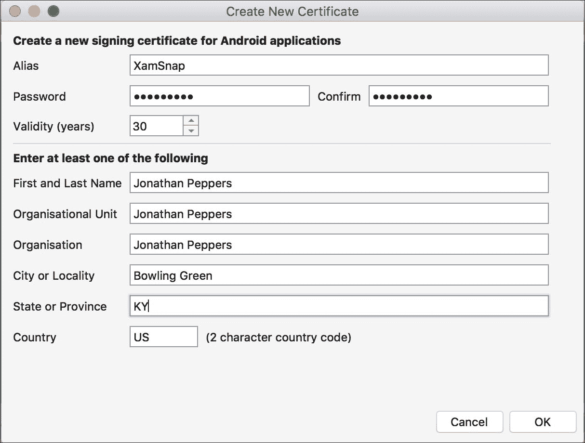

# 第十二章。应用商店提交

现在您已经完成了跨平台应用的开发，下一个显而易见的步骤是在谷歌 Play 和 iOS 应用商店上分发您的应用。Xamarin 应用的分发方式与 Java 或 Objective-C 应用完全相同；然而，让你的应用通过这个过程可能有点痛苦。iOS 有一个官方的审批系统，这使得应用商店的提交过程比安卓更长。开发人员可能需要等待一周或更长时间，这取决于该应用被拒绝的次数。与调试应用相比，安卓需要一些额外的步骤才能在谷歌 Play 上提交应用，但你仍然可以在几个小时内提交应用。

在本章中，我们将介绍:

*   应用商店审查指南
*   向应用商店提交 iOS 应用
*   设置安卓签名密钥
*   向谷歌游戏提交安卓应用
*   在应用商店取得成功的秘诀

# 遵循 iOS 应用商店审查指南

您的应用的名称、应用图标、截图和其他方面都在苹果名为 iTunes Connect 的网站上声明。销售报告、应用商店拒绝、合同和银行信息以及应用更新都通过位于[http://itunesconnect.apple.com](http://itunesconnect.apple.com)的网站进行管理。

苹果指导方针的主要目的是保持 iOS 应用商店的安全和无恶意软件。iOS 应用商店中几乎没有发现恶意软件。一般来说，iOS 应用能对你做的最糟糕的事情就是用广告轰炸你。在一定程度上，这些指导方针还加强了苹果在您的应用内支付的收入份额。可悲的是，苹果的一些指导方针在 iOS 的一个关键领域有争议地淘汰了一个竞争对手:

这里的关键点是让您的申请通过商店审批流程，而不会面临应用商店的拒绝。只要你不是故意打破规则，大多数申请都不会面临获得批准的困难。最常见的拒绝与开发人员的错误有关，这是一件好事，因为你不想向公众发布一个有关键问题的应用。

应用商店审查指南相当长，所以让我们把它分成你可能遇到的最常见的情况。指南的完整列表可在[https://developer.apple.com/app-store/review/guidelines/](https://developer.apple.com/app-store/review/guidelines/)找到。

需要注意的一些一般规则是:

*   崩溃、有错误或严重失败的应用将被拒绝
*   不按广告执行或包含隐藏功能的应用将被拒绝
*   使用非公开的苹果应用接口，或者从文件系统上禁止的位置读/写文件的应用将被拒绝
*   价值很低或过度开发的应用(如手电筒、打嗝或放屁应用)将被拒绝
*   未经商标持有人许可，应用不能使用商标词作为应用名称或关键词
*   应用不能非法分发受版权保护的材质
*   可以简单地通过移动友好网站实现的应用，例如包含大量不提供本机功能的 HTML 内容的应用，可能会被拒绝

这些规则有助于保持 iOS 应用商店的整体质量和安全性高于其他情况。由于这些规则中的一些，很难让一个功能非常少的简单应用进入商店，所以请确保您的应用足够有用和引人注目，以便应用商店审查团队允许它在商店中可用。

与开发人员所犯错误或 iTunes Connect 中的错误标签相关的一些规则如下:

*   例如，提到其他移动平台(如安卓)的应用或元数据将被拒绝
*   标有不正确或不适当的类别/流派、截图或图标的应用将被拒绝
*   开发人员必须为应用给出适当的年龄评级和关键词
*   审查应用时，支持、隐私政策和营销网址必须正常运行
*   开发人员不应声明不使用的 iOS 功能；例如，如果您的应用实际上没有使用这些功能，请不要声明游戏中心或 iCloud 的使用
*   未经用户同意而使用定位或推送通知等功能的应用将被拒绝

这些有时可能只是开发人员的一个错误。只需确保在最终提交到 iOS 应用商店之前仔细检查应用的所有信息。

此外，苹果对应用中包含的内容有以下规定:

*   包含不良内容或可能被认为粗鲁的内容的申请将被拒绝
*   旨在让用户不安或厌恶的应用将被拒绝
*   包含过多暴力图像的申请将被拒绝
*   以特定政府、种族、文化或公司为敌人的申请将被拒绝
*   带有不符合 4 岁以上评级的图标或截图的申请可能会被拒绝

应用商店向儿童和成人提供应用。苹果还支持对申请年龄超过 17 岁的限制；然而，这将严重限制潜在用户的数量。最好尽可能保持应用的干净和适合的年龄。

下面列出的下一类规则与苹果在 App Store 的 70/30 收入份额有关:

*   链接到网站上销售的产品或软件的应用可能会被拒绝。
*   使用 iOS **以外的支付机制的应用内购买** ( **IAPs** )将被拒绝。
*   使用 IAPs 购买实物商品的申请将被拒绝。
*   应用可以显示在应用外购买的数字内容，只要您不能链接到应用或从应用内购买。应用内购买的所有数字内容都必须使用 IAPs。

这些规则很容易遵守，只要你没有试图规避苹果在应用商店的收入份额。始终使用 IAPs 解锁应用中的数字内容。

最后但同样重要的是，这里有一些与应用商店拒绝相关的一般提示:

*   如果您的应用需要用户名和密码，请确保在**演示帐户信息**部分包含凭据，供应用审查团队使用。
*   如果您的应用包含应用审查团队必须明确测试的 IAPs 或其他功能，请确保在**审查注释**中包含说明，以到达您的应用中的适当屏幕。
*   提前安排！不要让你的产品的应用拒绝毁了最后期限；在你的时间表中至少计划几周，以获得应用商店的批准。另一个选择是提前提交测试版供批准，发布日期将在未来确定。您可以上传更接近发布日期的最终版本。
*   有疑问时，尽可能在 iTunes Connect 的**复习笔记**部分进行描述。

如果你的申请被拒绝了，大多数时候会有一个简单的解决办法。如果有规则被违反，苹果的审查团队将明确参考指导方针，并将包括相关的崩溃日志和截图。如果您可以在不提交新版本的情况下更正问题，您可以使用 iTunes Connect 网站中的**解决中心**选项回复应用审查团队。如果您上传一个新的构建，这将把您的应用放在队列的末尾进行检查。

对于 iOS 中的功能，肯定有更深入和具体的规则，因此，如果您正在考虑使用 iOS 功能做一些创造性的或开箱即用的事情，请确保查看完整的指导方针。一如既往，如果你不确定具体的指导方针，最好就此事寻求专业的法律建议。打电话给苹果公司的支持电话不会对这个问题有任何帮助，因为苹果公司的支持人员不允许提供与应用商店审查指南相关的建议。

# 向 iOS 应用商店提交应用

在您开始向商店提交我们的申请之前，我们需要查看一份简短的清单，以确保您做好准备。在这个过程中到达一个点，意识到你缺少了什么或者没有做对什么，这是一件痛苦的事情。此外，还有一些需求需要设计师或营销团队来满足，不一定要留给开发人员。

在开始提交之前，请确保您已经完成了以下工作:

*   您的申请`Info.plist`文件已完全填写完毕。这包括闪屏图像、应用图标、应用名称和其他需要填写的高级功能设置。请注意，此处的应用名称显示在应用图标下。它可以不同于应用商店名称，与应用商店名称不同，它不必与商店中的所有其他应用唯一。
*   您在应用商店中为您的应用选择了至少三个名称。一个名称可能不可用，即使它当前没有在应用商店中使用，因为它可能是开发人员以前为某个由于某种原因从商店中删除的应用使用的。如果需要，您也可以提前预约姓名。

*   您有一个大的 1024x1024 应用图标图像。不需要将此文件包含在应用中，除非您通过 iTunes(桌面应用)分发企业或临时版本。
*   您的应用针对的每个设备至少有一个屏幕截图。这包括 iPhone 6 Plus、iPhone 6、iPhone 5、iPhone 4、iPad mini、iPad retina 和 iPad Pro 大小的通用 iOS 应用截图。我强烈建议填写所有可能的截图槽。
*   您对应用商店有一个精心编写和编辑的描述。
*   您已经选择了一组关键字来改进应用的搜索。

## 创建分发配置文件

一旦您仔细检查了前面的清单，我们就可以开始提交了。我们的第一步是为应用商店分发创建一个供应配置文件。

让我们通过执行以下步骤开始创建新的资源调配配置文件:

1.  导航至[https://developer.apple.com/account/](https://developer.apple.com/account/)。
2.  点击右侧导航栏中的**证书、身份证&档案**。
3.  点击**设置配置文件** | **全部**。
4.  点击窗口右上角的加号按钮。
5.  选择**配送**下的**应用商店**，点击**继续**。
6.  选择您的应用标识。您应该已经在[第 7 章](07.html#aid-1R42S2 "Chapter 7. Deploying and Testing on Devices")、*中创建了一个，在设备*上部署和测试；点击**继续**。
7.  为设置配置文件选择证书。通常，这里只有一个选择。点击**继续**。
8.  给配置文件取一个合适的名称，如`MyAppAppStore`。点击**生成**。
9.  完成后，您可以手动下载并安装配置文件，或者在 Xcode 中的**首选项** | **帐户**下同步您的配置文件，就像我们在本书前面所做的那样。

成功后，您将出现以下屏幕:

## 将您的应用添加到 iTunes Connect

对于下一组步骤，我们将开始填写您的应用的详细信息，以显示在苹果应用商店上。

我们可以从执行以下步骤开始，在 iTunes Connect 中设置您的应用:

1.  导航至[http://itunesconnect.apple.com](http://itunesconnect.apple.com)并登录。
2.  点击**我的应用**。
3.  点击窗口左上角的加号按钮，然后是**新 App** 。
4.  检查平台的 **iOS** 。
5.  输入要在应用商店上显示的应用**名称**。
6.  为你的应用选择一种**主要语言**。
7.  选择您的**捆绑 ID** 。您应该已经在[第 7 章](07.html#aid-1R42S2 "Chapter 7. Deploying and Testing on Devices")、*中创建了一个，在设备*上部署和测试。
8.  在 **SKU** 字段中输入一个值。这用于在报告中识别您的应用。
9.  点击**继续**。
10.  从这里，有很多需要填写的信息。如果您错过了任何一个，iTunes Connect 在显示警告方面非常有帮助。它应该相当用户友好，因为该网站是为营销专业人士以及开发人员使用的。
11.  进行更改后，点击**保存**。

还有很多可选字段。确保您填写了**审核说明**或**演示账户信息**如果应用审核团队需要任何其他信息来审核您的申请。完成后，您将看到状态为**准备提交**的申请，如下图所示:

现在我们需要将我们的应用上传到 iTunes Connect。您必须从 Xcode 或应用加载器上传构建。这两种方法都会产生相同的结果，但是如果非开发人员提交应用，有些人更喜欢使用应用加载器。

## 为应用商店制作 iOS 二进制文件

我们提交应用商店的最后一步是向商店提供包含我们的应用的二进制文件。我们需要创建我们的应用的 Release 构建，用我们在本章前面创建的分发配置文件进行签名。

Xamarin Studio 使这变得非常简单。我们可以如下配置构建:

1.  点击 Xamarin Studio 左上角的解决方案配置下拉菜单，选择 **AppStore** 。
2.  默认情况下，Xamarin Studio 将设置提交此构建配置所需的所有配置选项。
3.  接下来，选择你的 iOS 应用项目，点击**建立** | **档案发布**。

片刻之后，Xamarin Studio 将打开存档的构建菜单，如下所示:

该过程创建一个存储在`~/Library/Developer/Xcode/Archives`中的`xarchive`文件。**验证...**按钮将检查您的档案中是否存在上传过程中可能出现的任何潜在错误，而**则负责签名和分发...**将实际向门店提交申请。

要向商店提交申请，请执行以下步骤:

1.  点击**签名并分发...**。别担心，它会在上传前验证档案。
2.  选择**应用商店**，点击**下一步**。
3.  确保列出的配置文件适用于应用商店，然后单击**下一步**。
4.  查看您的更改并点击**发布**。
5.  选择存储`*.ipa` 文件的位置，点击**保存**。
6.  点击**打开应用加载器**进入上传过程。

您应该会在 Xamarin Studio 中看到一个类似于下面截图的屏幕:

从这里开始，使用**应用加载器**相当简单:

1.  使用您的 iTunes Connect 凭据登录。
2.  选择**交付你的应用**，点击**选择**。
3.  选择你在 Xamarin Studio 中创建的`*.ipa`文件，点击**打开**。
4.  查看为构建选择的应用，然后点击**下一步**。
5.  如果一切正常，您应该会看到一个上传进度条，后面跟着一个成功对话框。

如果您返回 iTunes Connect，并导航到**测试飞行** | **测试飞行版本**选项卡，您将看到您刚刚上传的版本，状态为**正在处理**:

几分钟后，构建将被处理，并可以添加到应用商店版本。下一步是在**构建**部分选择**应用商店** | **iOS 应用**选项卡下的构建。

点击**保存**后，应该可以点击**提交审核**了，没有任何剩余警告。接下来，回答关于出口法律、广告标识符等三个问题，点击**提交**作为提交应用的最后一步。

此时，当您的应用在排队等待苹果员工审查时，您无法控制其状态。这可能需要一周或更长时间，具体取决于要审查的应用的当前工作量和一年中的时间。更新也将经历同样的过程，但等待时间通常比新应用提交的时间短一点。

幸运的是，在一些情况下，您可以快速跟踪这个过程。如果你导航到 https://developer.apple.com/contact/app-store/?topic =加速，可以申请加速 app 审核。您的问题必须是关键的错误修复，或者是与您的应用相关的时间敏感事件。苹果不保证接受加速请求，但在需要的时候，它可以成为救命稻草。

此外，如果您提交的构建出现问题，您可以通过转到应用详细信息页面顶部并选择**从审查中删除此版本**来取消提交。在提交后发现 bug 的情况下，这允许您上传一个新的构建来代替它。

# 签署你的安卓应用

所有安卓软件包(`apk`文件)都由证书或密钥库文件签名，以便在设备上安装。当您调试/开发应用时，您的包会由安卓软件开发工具包生成的开发密钥自动签名。使用这个调试键进行开发甚至测试都是可以的；但是，它不能在分发到 Google Play 的应用上使用。

完成以下设置以创建签名的 APK:

1.  点击 Xamarin Studio 左上角的解决方案配置下拉菜单，选择**发布**。
2.  接下来，选择你的安卓应用项目，点击**建立** | **档案发布**。
3.  接下来，选择创建的安卓档案，点击**签名并分发**。
4.  选择**临时**并点击**下一步**。谷歌游戏也是一个选项，你可以稍后再看，但它需要更多的时间来设置(它也不能为一个应用上传第一个 APK)。
5.  选择**创建新键**。
6.  填写安卓密钥库文件所需的信息，点击**确定**。
7.  选择您创建的密钥库文件，然后单击**下一步**。
8.  点击**发布**，选择保存 APK 的位置。

您的密钥库文件设置应该类似于下面的截图:

完成后，您应该将密钥库文件和密码存储在非常安全的地方。默认情况下，Xamarin Studio 会将您的按键放在`~/Library/Developer/Xamarin/KeyStore`中。一旦您使用此`keystore` 文件签署应用并将其提交给谷歌 Play，您将无法在没有使用相同密钥签署的情况下提交应用的更新。没有检索丢失的密钥库文件的机制。如果您碰巧丢失了它，您唯一的选择是从商店中删除现有的应用，并提交一个包含您的更新更改的新应用。这可能会导致您失去大量用户。

# 将应用提交给谷歌游戏

一旦你有了一个签名的安卓包，向谷歌 Play 提交你的应用相对于 iOS 来说是相对无痛的。一切都可以通过浏览器中的**开发人员控制台**选项卡完成，而无需上传带有 OS X 应用的包。

在开始提交之前，请确保您已经完成了以下清单上的任务:

*   您已经声明了一个`AndroidManifest.xml` 文件，其中声明了您的应用名、包名和图标
*   您有一个用生产密钥签名的`apk`文件
*   您已经为谷歌游戏选择了一个应用名称。这在整个商店中并不独特
*   你有一个 512x512 高分辨率的谷歌游戏图标图像
*   你对这家商店有一个精心编写和编辑的描述
*   你至少有两张截图。但是，我建议使用所有可用的插槽，包括 7 英寸和 10 英寸平板电脑

看完核对表后，你应该做好充分准备，向谷歌 Play 提交申请。添加新应用的选项卡如下所示:

首先，导航至[https://play.google.com/apps/publish](https://play.google.com/apps/publish)登录您的账户，并执行以下步骤:

1.  选择**所有应用**选项卡，点击**添加新应用**。
2.  输入要在谷歌游戏上显示的应用名称，然后点击**上传 APK** 。
3.  点击**将您的第一个 APK 上传到生产**或**测试版**或**阿尔法**频道。
4.  浏览至您已签名的`.apk`文件，点击**确定**。您将看到 **APK** 标签的勾号变为绿色。
5.  选择**商店列表**标签。
6.  填写所有必填字段，包括**描述**、**高分辨率图标**、**分类**、**隐私政策**(或选择表示您未提交政策的复选框)，并提供至少两张截图。
7.  点击**保存**。您将看到**商店列表**标签上的勾号变为绿色。
8.  选择**内容评分**选项卡，填写问卷，为您的应用选择年龄评分。
9.  选择**定价&配送**标签。
10.  选择价格和您希望分销到的国家。
11.  接受**内容指南**和**美国出口法**的协议。
12.  点击**保存**。你会看到**定价&配送**标签上的勾号变成绿色。
13.  Select the **Ready to publish** dropdown in the top-right corner, as shown in the following screenshot, and select **Publish this app**:

    

几个小时后，您的应用将在谷歌 Play 上可用。不需要审批过程，对应用的更新也同样轻松。

## 谷歌 Play 开发者计划政策

为了提供一个安全的商店环境，谷歌追溯性地删除违反其政策的应用，并且通常会禁止整个开发人员帐户，而不仅仅是应用。谷歌的政策旨在提高谷歌 Play 上可用应用的质量，不像 iOS 上的一套规则那样冗长。话虽如此，以下是谷歌政策的基本概述:

*   应用不能包含露骨的性内容、无端的暴力或仇恨言论。
*   应用不能侵犯版权材质。
*   应用本质上不能是恶意的，或者在用户不知情的情况下获取用户的私人信息。
*   未经用户同意，应用不能修改用户设备的基本功能(如修改主屏幕)。如果应用包含这样的功能，用户必须很容易关闭。
*   您的应用中的所有数字内容都必须使用谷歌 Play 的应用内计费(或 IAPs)。实物商品不能用 IAPs 购买。
*   应用不得滥用蜂窝网络，这可能导致用户产生高额账单:

与 iOS 一样，如果您对其中一项政策有所顾虑，最好获得有关该政策的专业法律建议。有关政策的完整列表，请访问[https://play.google.com/about/developer-content-policy/](https://play.google.com/about/developer-content-policy/)。

# 打造成功手机应用的小技巧

从我的个人经验来看，我已经向 iOS 应用商店和谷歌 Play 提交用 Xamarin 构建的应用有一段时间了。在交付了近 50 款总计数百万次下载的移动应用后，我们学到了很多关于移动应用成功或失败的经验。对于最终用户来说，Xamarin 应用与 Java 或 Objective-C 应用没有区别，因此您可以通过遵循与标准 iOS 或 Android 应用相同的模式来使您的应用成功。

你可以做很多事情来让你的应用更成功。以下是一些建议:

*   **定价正确**:如果你的应用对任何地方的任何人都有吸引力，考虑一下通过广告投放或 IAPs 获得收入的*免费增值模式*。然而，如果你的应用相当小众，你最好把你的应用定价在 4.99 美元或更高。高级应用必须拥有更高的质量标准，但可以从更少的用户中获得可观的收入。
*   **了解你的竞争对手**:如果和你在同一个空间有其他应用，确保你的应用比竞争对手更好或者提供更广泛的功能集。如果已经有几个应用与你的竞争，完全避开这个空间可能也是个好主意。
*   **提示忠实用户评论**:在用户多次打开你的应用后提示用户评论是个好主意。这给积极使用你的应用的用户一个写一篇好评论的机会。
*   **支持您的用户**:提供有效的支持电子邮件地址或脸书页面，方便您与用户互动。回应错误报告和负面评论。谷歌 Play 甚至可以选择给在你的应用上写评论的用户发邮件。
*   **保持你的应用小**:在 iOS 上保持 100MB 的限制，或者在 Google Play 上保持 50MB 的限制，将允许用户在他们的手机数据计划上下载你的应用。这样做可以减少安装应用的摩擦，因为用户会将冗长的下载与运行缓慢的应用联系起来。
*   **提交你的 app 到评论网站**:尽量在网上获得尽可能多的评论。苹果提供了发送优惠券代码的功能，但是使用安卓版本的应用，你可以发送实际的安卓包。将你的应用发送到评论网站或流行的 YouTube 频道可能是获得免费广告的好方法。
*   **使用应用分析或跟踪服务**:报告你的应用的使用情况和崩溃报告可以非常有助于了解你的用户。修复野外崩溃和修改用户界面以改善消费行为非常重要。

拥有一个成功的移动应用没有灵丹妙药。如果您的应用引人注目，满足了需求，并且运行迅速且正常，那么您就有可能获得下一个成功。能够使用 Xamarin 提供一致的跨平台体验也将让您领先于竞争对手。

# 总结

在这一章中，我们介绍了向 iOS 应用商店和 Google Play 提交应用所需了解的一切。我们介绍了应用商店审查指南，并针对您在审批过程中可能遇到的最常见情况进行了简化。我们检查了设置应用元数据和将二进制文件上传到 iTunes Connect 的过程。对于安卓，我们讨论了如何创建一个产品签名密钥，并签署您的安卓包(APK)文件。我们向谷歌 Play 提交了一个应用，并在这一章结束时给出了向应用商店交付成功且有望盈利的应用的技巧。

我希望通过这本书，您已经体验了使用 Xamarin 开发真实世界、跨平台应用的端到端、实用演练。与移动开发的其他选项相比，C#应该能够让您非常高效。此外，您将通过共享代码节省时间，而不会以任何方式限制用户的本地体验。