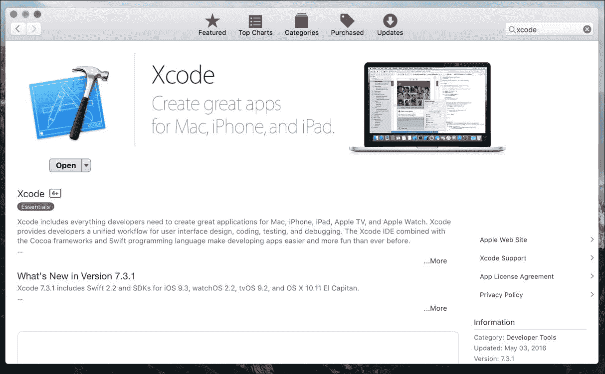
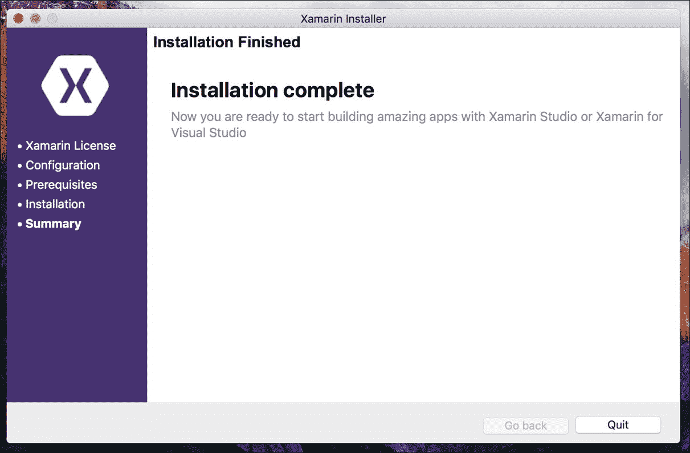
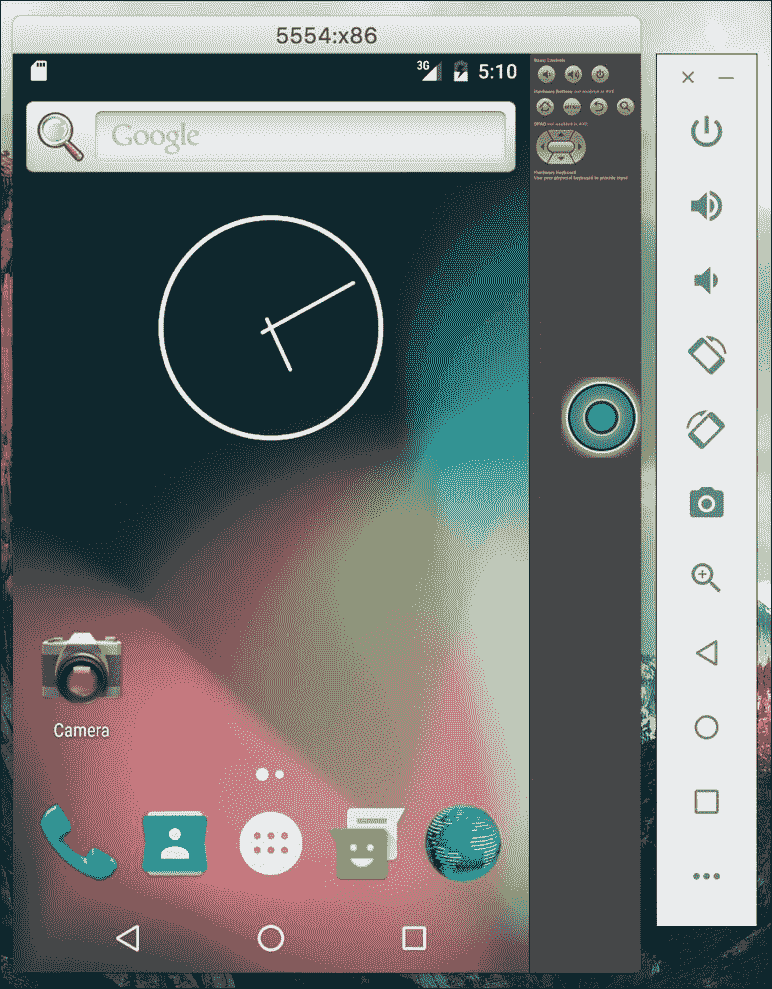
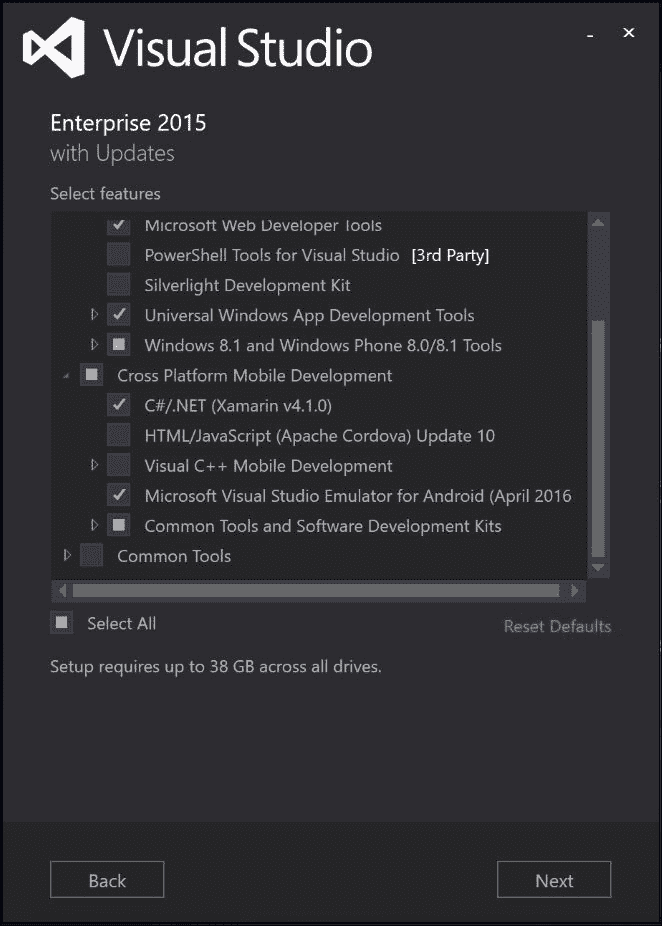
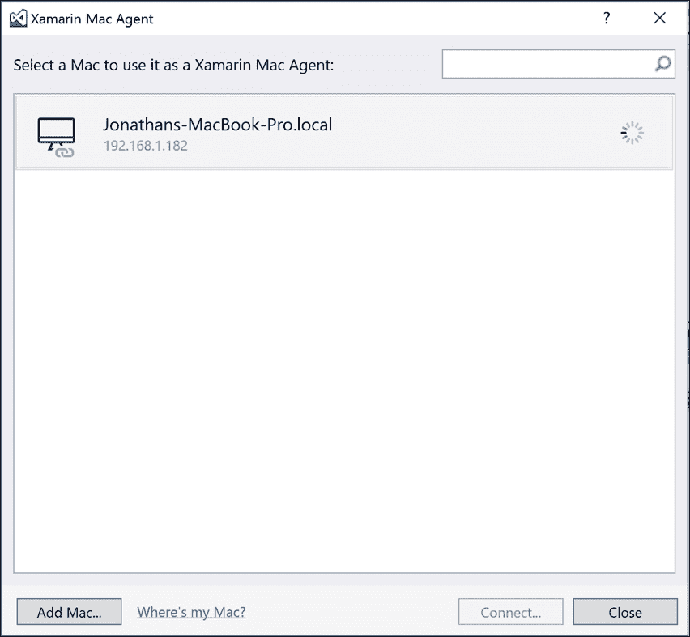
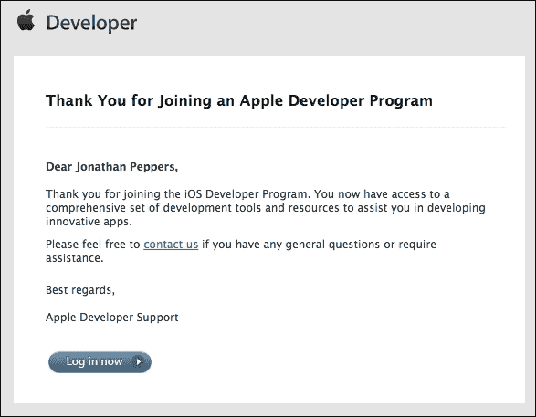
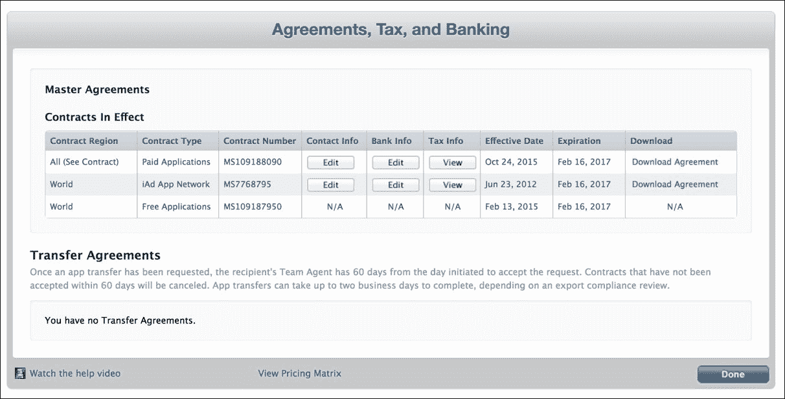
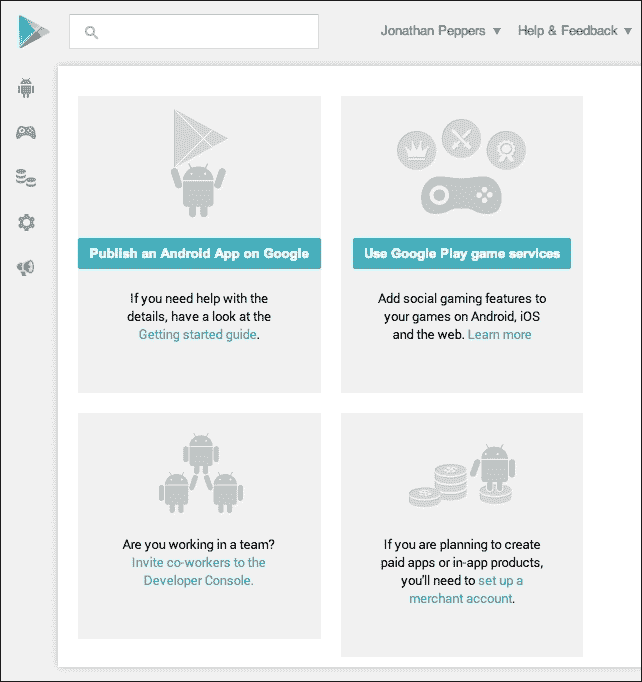
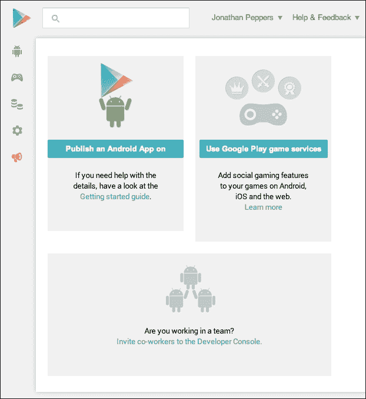

# 第一章：Xamarin 设置

如果你正在阅读这本书，你可能已经深深爱上了 C#、.NET 和像 Microsoft Visual Studio 这样的工具。当你考虑到学习新平台、新 IDE、新的应用程序模型，或许还有一两种编程语言的困难时，使用本地 SDK 的移动开发似乎令人畏惧。Xamarin 旨在用 C#为.NET 开发者提供开发本地 iOS、Android 和 Mac 应用程序的工具。

选择 Xamarin 而不是在 Android 上使用 Java，在 iOS 上使用 Objective-C/Swift 开发移动应用程序有很多优势。你可以在这两个平台之间共享代码，并且可以利用 C#和.NET 基类库的高级语言功能来提高生产效率。否则，你将不得不为 Android 和 iOS 分别编写整个应用程序。

与其他使用 JavaScript 和 HTML 开发跨平台应用程序的技术相比，Xamarin 具有一些独特的优势。C#通常比 JavaScript 性能更好，Xamarin 让开发者可以直接访问每个平台的本地 API。这使得 Xamarin 应用程序能够拥有类似于 Java 或 Objective-C 对应程序的本地外观和性能。Xamarin 的工具通过将 C#编译成本地 ARM 可执行文件，该文件可以作为 iOS 或 Android 应用程序进行打包。它将一个精简版的 Mono 运行时与你的应用程序捆绑在一起，只包括你的应用程序使用的基类库功能。

在本章中，我们将介绍使用 Xamarin 进行开发所需的一切。到本章结束时，我们将安装所有适当的 SDK 和工具，以及应用程序商店提交所需的所有开发者账户。

在本章中，我们将涵盖：

+   Xamarin 工具和技术介绍

+   安装 Xcode，苹果的 IDE

+   安装所有 Xamarin 工具和软件

+   将 Visual Studio 连接到 Mac

+   设置 Android 模拟器

+   加入 iOS 开发者计划

+   注册 Google Play

# 了解 Xamarin

Xamarin 开发了三个用于开发跨平台应用程序的核心产品：**Xamarin Studio**，**Xamarin.iOS**和**Xamarin.Android**。Xamarin Studio 是一个 C# IDE，而**Xamarin.iOS**和**Xamarin.Android**是使 C#应用程序能够在 iOS 和 Android 上运行的核心工具。这些工具允许开发者利用 iOS 和 Android 上的本地库，并建立在 Mono 运行时之上。

**Mono**，一个开源的 C#和.NET 框架实现，最初由 Novell 开发，用于 Linux 操作系统。由于 iOS 和 Android 同样基于 Linux，Novell 能够开发 MonoTouch 和 Mono for Android 作为针对新移动平台的产品。发布后不久，一家更大的公司收购了 Novell，Mono 团队离开成立了一家主要针对移动开发的新公司。Xamarin 因此成立，专注于使用 C#在 iOS 和 Android 上进行开发的这些工具。

为跨平台应用开发准备开发机器可能需要一些时间。更糟糕的是，苹果和谷歌各自对其平台上的开发都有不同的要求。如果你计划在 Windows 上使用 Visual Studio 进行开发，那么你的设置将与在 Mac OS X 上有所不同。请记住，在 Windows 上进行 iOS 开发需要在你的本地网络上有一台 Mac。让我们看看你的机器上需要安装哪些内容。

在 Mac OS X 上进行 Xamarin 开发的构建块如下：

+   **Xcode**：这是苹果用于用 Objective-C 开发 iOS 和 Mac 应用程序的核心 IDE。

+   **Mac 上的 Mono 运行时**：在 OS X 上编译和运行 C#程序需要这个

+   **Java**：这是在 OS X 上运行 Java 应用程序的核心运行时

+   **Android SDK**：这包含了谷歌的标准 SDK、设备驱动程序和用于原生 Android 开发的模拟器

+   **Xamarin.iOS**：这是 Xamarin 用于 iOS 开发的核心产品

+   **Xamarin.Android**：这是 Xamarin 用于 Android 开发的核心产品

在 Windows 上进行 Xamarin 开发所需的软件如下：

+   **Visual Studio 或 Xamarin Studio**：这两个 IDE 都可以用于 Windows 上的 Xamarin 开发。

+   **.NET Framework 4.5 或更高版本**：这随 Visual Studio 或 Windows 的最新版本一起提供。

+   **Java**：这是在 Windows 上运行 Java 应用程序的核心运行时。

+   **Android SDK**：这包含了谷歌的标准 SDK、设备驱动程序和用于原生 Android 开发的模拟器。

+   **本地网络上设置为 Xamarin.iOS 开发的 Mac**：作为苹果许可协议的一部分，苹果要求在 OS X 上进行 iOS 开发。需要按照上述列表设置一台 Mac 用于 Xamarin.iOS 开发。

+   **Xamarin for Windows**：这是 Xamarin 用于 Windows 的核心产品，包括 Xamarin.Android 和 Xamarin.iOS。

每个安装都需要一些时间来下载和安装。如果你能访问快速的网络连接，这将有助于加快安装和设置过程。准备好一切后，让我们一步一步地继续前进，希望我们可以避开你可能遇到的几个死胡同。

# 安装 Xcode

为了让事情进行得更顺利，让我们首先为 Mac 安装 Xcode。除了 Apple 的 IDE，它还将安装 Mac 上最常用的开发工具。确保你至少有 OS X 10.10（Yosemite）版本，并在 App Store 中找到 Xcode，如下面的截图所示：

这将需要一些时间来下载和安装。我建议你可以利用这段时间享受一杯美味的咖啡，或者同时进行另一个项目。

安装 Xcode 会安装 iOS SDK，这是进行 iOS 开发的一般要求。由于 Apple 的限制，iOS SDK 只能在 Mac 上运行。Xamarin 已经尽一切可能确保他们遵循 Apple 的 iOS 指南，例如动态代码生成。Xamarin 的工具还尽可能利用 Xcode 的特性，以避免重新发明轮子。

# 在 Mac OS X 上安装 Xamarin

安装 Xcode 之后，需要安装其他几个依赖项，然后才能使用 Xamarin 的工具进行开发。幸运的是，Xamarin 通过创建一个简单的一体化安装程序改善了这一体验。

通过执行以下步骤来安装 Xamarin：

1.  访问[`xamarin.com`](http://xamarin.com)，点击大型的**下载 Xamarin**按钮。

1.  填写一些关于你自己的基本信息，然后点击**下载适用于 OS X 的 Xamarin Studio**。

1.  下载`XamarinInstaller.dmg`并挂载磁盘映像。

1.  启动`Xamarin.app`，并接受出现的任何 OS X 安全警告。

1.  按照安装程序进行操作；默认选项将正常工作。你可以选择安装`Xamarin.Mac`，但本书不涉及该主题。

Xamarin 安装程序将下载并安装所需的前提条件，如 Mono 运行时、Java、Android SDK（包括 Android 模拟器和工具）以及你开始运行所需的一切。

最后你会得到类似于以下截图所示的内容，然后我们可以继续学习跨平台开发中的更多高级主题：

# 设置 Android 模拟器

历史上，Android 模拟器在性能上一直比物理设备开发要慢。为了解决这个问题，Google 生产了一个支持在桌面电脑上进行硬件加速的 x86 模拟器。它默认没有在**Android Virtual Device**（**AVD**）管理器中安装，所以让我们来设置它。

通过执行以下步骤可以安装 x86 Android 模拟器：

1.  打开 Xamarin Studio。

1.  启动**工具** | **打开 Android SDK 管理器...**。

1.  滚动到**Extras**；安装**Intel x86 Emulator Accelerator (HAXM 安装程序)**。

1.  滚动到**Android 6.0 (API 23)**；安装**Intel x86 Atom System Image**。

1.  可选步骤，安装你感兴趣的其他软件包。至少确保你已经安装了 Android SDK 管理器默认为你选择安装的所有内容。

1.  关闭**Android SDK Manager**并导航到你的 Android SDK 目录，默认位于`~/Library/Developer/Xamarin/android-sdk-macosx`。

1.  导航到`extras/intel/Hardware_Accelerated_Execution_Manager`并启动`IntelHAXM_6.0.3.dmg`来安装 HAXM 驱动。

1.  切换回 Xamarin Studio 并启动**工具** | **打开 Google Emulator Manager...**。

1.  点击**创建...**。

1.  输入你选择的 AVD 名称，例如`x86 Emulator`。

1.  选择一个适合你显示器的通用设备，例如**Nexus 5**。

1.  在**CPU/ABI**中，确保你选择支持**Intel Atom (x86)**的选项。

1.  创建设备后，继续点击**启动...**以确保模拟器正常运行。

### 提示

这些说明在 Windows 上应该非常相似。默认情况下，Android SDK 在 Windows 上的安装路径为`C:\Program Files (x86)\Android\android-sdk`。同样，HAXM 安装程序在 Windows 上名为`intelhaxm-android.exe`。

模拟器启动需要一些时间，因此在处理 Android 项目时，让模拟器保持运行是一个好主意。Xamarin 在这里使用标准的 Android 工具，因此即使是 Java 开发者也会感受到缓慢模拟器的痛苦。如果一切正常启动，你会看到一个 Android 启动屏幕，然后是一个虚拟的 Android 设备，可以从 Xamarin Studio 部署应用程序，如下面的截图所示：

市面上有许多 Android 模拟器选项，例如 Genymotion 或 Visual Studio Android Emulator。使用 Xamarin 不会限制你在 Android 模拟器中的选择，所以如果默认的 Android 模拟器不适用于你，可以自由尝试。

# 在 Windows 上安装 Xamarin

自从 2016 年微软收购 Xamarin 以来，任何版本的 Visual Studio 都包含了 Xamarin。版本如下：

+   **Visual Studio Community**：这是一个任何人都可以免费使用的版本。对于公司使用这个版本有一些限制。

+   **Visual Studio Professional**：这是公司应该使用的通用版本。在 Visual Studio 方面，它包括了 Team Foundation Server 的功能。

+   **Visual Studio Enterprise**：包含了 Visual Studio 和 Xamarin 的额外功能。Xamarin 的特性包括嵌入式程序集、实时 Xamarin 检查器和 Xamarin 分析器。

当首次在 Windows PC 上为 Xamarin 开发设置环境时，有两个选择需要考虑。如果你已经安装了 Visual Studio，那么你可以仅使用 Xamarin 安装程序，将必要的 Visual Studio 扩展和项目模板添加到现有安装中。如果你还没有安装 Visual Studio，那么在 Visual Studio 2015 安装程序中有一个简单的选项可以安装 Xamarin。

如果你想要通过 Visual Studio 安装程序进行安装：

1.  从[`www.visualstudio.com/downloads/`](https://www.visualstudio.com/downloads/)下载你所需的 Visual Studio 版本。

1.  运行 Visual Studio 安装程序。

1.  在**跨平台移动开发**下，确保选择**C#/.NET (Xamarin v4.1.0)**（版本号将根据你使用的版本而变化）。这将自动选择你需要用于 Xamarin 开发的 Android SDK 和其他组件。

1.  你还可以选择安装其他有用的工具，比如针对 Windows 10 的**Microsoft Web 开发工具**或**通用 Windows 应用开发**工具。

在你点击**下一步**之前，你的安装程序应该看起来像这样：

安装 Xamarin 的第二种选择是从 Xamarin 官网进行：

1.  从 [`xamarin.com/download`](https://xamarin.com/download) 下载适用于 Windows 的 Xamarin 安装程序。

1.  运行 `XamarinInstaller.exe`，它将在你的电脑上下载并安装所有必需的组件。

Xamarin 安装程序与你在 Mac OS X 上看到的过程非常相似，应该非常简单直接。如果需要，它会将 Xamarin 添加到现有的 Visual Studio 安装中，并安装 Xamarin Studio。

# 为 iOS 开发将 Visual Studio 连接到 Mac

iOS 开发需要运行在 Mac OS X 上的 Xcode。幸运的是，Xamarin 已经使从 Windows 电脑进行远程开发成为可能。

要将你的电脑连接到 Mac：

1.  首先打开或创建一个 Xamarin.iOS 项目。

1.  Visual Studio 会自动提示**Xamarin Mac 代理说明**。

1.  按照 Visual Studio 中的详细说明和截图，在 Mac 上启用远程登录。

1.  应该会出现一个列出你 Mac 地址的**Xamarin Mac 代理**对话框。

1.  点击**连接...**，并输入你在 Mac 上的用户名和密码。

连接后，你应该会看到如下截图所示的内容：

连接后，你可以直接按下播放按钮，针对 iOS 模拟器或你选择的 iOS 设备调试你的项目。在 Visual Studio 中你期望的所有功能也可以用于 iOS 开发：断点、鼠标悬停评估、添加监视等。

# 加入 iOS 开发者计划

要部署到 iOS 设备，Apple 要求加入其 iOS 开发者计划。会员费用为每年 99 美元，你可以使用它来部署 200 个用于开发目的的设备。你还可以访问测试服务器，以实施更高级的 iOS 功能，如应用内购买、推送通知和 iOS 游戏中心。在物理设备上测试你的 Xamarin.iOS 应用是很重要的，因此我建议你在开始 iOS 开发之前先获得一个账户。在桌面运行的模拟器与实际移动设备上的性能差异很大。还有一些仅在实际设备上运行时才会发生的特定于 Xamarin 的优化。我们将在后面的章节中详细介绍在设备上测试应用的原因。

### 提示

自从 iOS 9 以来，苹果创建了一种可以从任何 Apple ID 在 iOS 设备上侧载应用程序的方法。建议仅用于在少量设备上进行测试，并且无法测试高级功能，如应用内购买或推送通知。然而，如果你只是想试试 iOS，这是一种无需支付 99 美元开发者费用的入门好方法。

通过以下步骤可以注册 iOS 开发者计划：

1.  前往[`developer.apple.com/programs/ios`](https://developer.apple.com/programs/ios)。

1.  点击**注册**。

1.  使用现有的 iTunes 账户登录或创建一个新的账户。以后无法更改，所以请选择适合你公司的账户。

1.  可以选择以个人或公司身份注册。两者的价格都是 99 美元，但作为公司注册需要将文件传真给苹果公司，并需要你公司会计师的协助。

1.  审阅开发者协议。

1.  填写苹果的开发者调查问卷。

1.  购买 99 美元的开发者注册。

1.  等待确认电子邮件。

你应该在两个工作日内收到一封看起来类似于以下截图的电子邮件：

从这里，你可以继续设置你的账户：

1.  从你收到的电子邮件中点击**立即登录**，或者前往[`itunesconnect.apple.com`](https://itunesconnect.apple.com)。

1.  使用你的 iTunes 账户登录。

1.  同意在仪表盘主页上出现的任何附加协议。

1.  从 iTunes Connect 仪表盘前往**协议、税务和银行信息**。

1.  在这一部分，你将看到三列，分别是**联系方式**、**银行信息**和**税务信息**。

1.  在这些部分中为你的账户填写适当的信息。对于公司账户，很可能会需要会计师的协助。

当一切完成后，你的**协议、税务和银行信息**部分应该看起来类似于以下截图：

成功注册 iOS 开发者账户后，你现在可以部署到 iOS 设备并将你的应用发布到苹果 App Store。

# 注册成为 Google Play 开发者。

与 iOS 不同，将你的应用程序部署到 Android 设备是免费的，只需要在设备设置中进行一些更改。Google Play 开发者账户只需一次性支付 25 美元，并且不需要每年续费。但是，与 iOS 一样，如果你打算将应用提交到 Google Play 或需要实现这些功能之一，你需要一个 Google Play 账户。

要注册成为 Google Play 的开发者，请执行以下步骤：

1.  前往[`play.google.com/apps/publish`](https://play.google.com/apps/publish)。

1.  使用现有 Google 账户登录，或者创建一个新的账户。这之后无法更改，所以如果需要，请选择适合你公司的账户。

1.  同意协议并输入你的信用卡信息。

1.  选择一个开发者名称并输入账户的其他重要信息。同样，选择适合你公司的名称，以便用户在应用商店中看到。

如果一切填写正确，你将得到如下 Google Play 开发者控制台：

如果你打算销售付费应用或应用内购买，在这一点上，我建议你设置你的**Google 商家账户**。这将使 Google 能够根据你所在国家的适当税法支付你的应用销售收益。如果这是为你的公司设置的，我建议寻求公司会计师或簿记员的帮助。

以下是设置 Google 商家账户的步骤：

1.  点击**设置商家账户**按钮。

1.  第二次使用你的 Google 账户登录。

1.  填写销售应用所需的信息：地址、电话号码、税务信息以及显示在客户信用卡账单上的名称。

完成后，你会注意到开发者控制台中关于设置商家账户的帮助提示现在不见了，如下截图所示：

在这一点上，你可能会认为我们的账户已经完全设置好了，但在能够销售应用之前，还有一个关键步骤：我们必须输入银行信息。

使用以下步骤可以为你的 Google 商家账户设置银行：

1.  返回到[`play.google.com/apps/publish`](https://play.google.com/apps/publish)的 Google Play **开发者控制台**。

1.  点击**财务报告**部分。

1.  点击标题为**访问你的商家账户以获取详细信息**的小链接。

1.  你应该会看到一个警告，提示你没有设置银行账户。点击**指定银行账户**链接开始操作。

1.  输入你的银行信息。同样，可能需要公司的会计师。

1.  几天后，在你的账户中寻找来自 Google 的小额存款。

1.  通过访问[`checkout.google.com/sell`](http://checkout.google.com/sell)确认金额。

1.  点击**设置**标签，然后是**财务**。

1.  接下来，点击**验证账户**。

1.  输入你银行账户中出现的金额，并点击**验证存款**。

你的 Google 商家账户也是你可以取消或退款客户订单的地方。Google Play 与 iOS App Store 的不同之处在于，所有客户问题都直接指向开发者。

# 摘要

在本章中，我们讨论了 Xamarin 的核心产品，无论你是在使用 Mac OS X 还是 Windows PC，都可以用 C#开发 Android 和 iOS 应用程序。我们安装了 Xcode，然后运行了 Xamarin 一站式安装程序，它安装了 Java、Android SDK、Xamarin Studio、Xamarin.iOS 和 Xamarin.Android。在 Windows 上，我们在 Visual Studio 内设置了 Xamarin，并在本地网络上连接了一台 Mac 用于 iOS 开发。我们为调试应用程序时获得更快、更流畅的体验而设置了 x86 Android 模拟器。最后，我们设置了 iOS 和 Google Play 开发者账户，以便分发我们的应用程序。

在本章中，你应该已经获得了使用 Xamarin 构建跨平台应用程序所需的一切。你的开发计算机应该已经准备就绪，你应该已经安装了所有本地 SDK，准备开发下一个风靡全球的应用程序。

本章中的概念将为我们奠定更高级主题的基础，这需要安装适当的软件以及拥有苹果和谷歌的开发者账户。我们将把应用程序部署到真实设备上，并实现更高级的功能，如推送通知。在下一章中，我们将创建我们的第一个 iOS 和 Android 应用程序，并介绍每个平台的基础知识。
