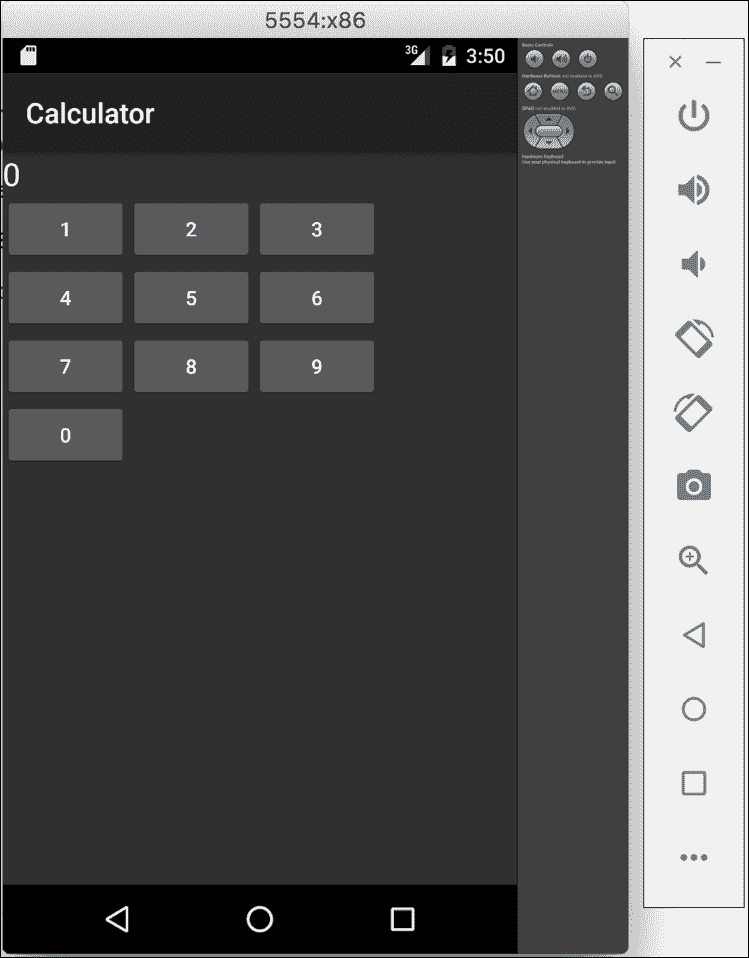

# 第二章：你好，平台！

如果你熟悉在 Windows 上使用 Visual Studio 开发应用程序，那么使用 Xamarin Studio 应该非常直接。Xamarin 使用相同的概念，即一个**解决方案**包含一个或多个**项目**，并且它为 iOS 和 Android 应用程序创建了几种新的项目类型。还有几个项目模板可以让你快速启动常见应用程序的开发。

Xamarin Studio 支持多种开箱即用的项目类型，包括标准的.NET 类库和控制台应用程序。你无法在 Mac 上的 Xamarin Studio 中本地开发 Windows 应用程序，但你可以肯定的是，可以在 Xamarin Studio 中开发应用程序的共享代码部分。我们将在后面的章节中关注共享代码，但请记住，Xamarin 使你能够在支持 C#的大部分平台之间共享一个通用的 C#后端。

在本章中，我们将涵盖：

+   为 iOS 创建一个简单的计算器应用程序

+   苹果的 MVC 模式

+   Xcode 和故事板

+   为安卓创建计算器应用程序

+   安卓活动

+   Xamarin 的安卓设计师

# 建立你的第一个 iOS 应用程序

启动 Xamarin Studio 并开始一个新的解决方案。与 Visual Studio 一样，**新建解决方案**对话框中有许多可以创建的项目类型。Xamarin Studio（前称**MonoDevelop**）支持开发许多不同类型的项目，如针对 Mono 运行时或.NET Core 的 C#应用程序、NUnit 测试项目，甚至除了 C#之外的其他语言，如 VB 或 C++。

Xamarin Studio 支持以下 iOS 项目类型：

+   **单视图应用**: 这是一个基本的项目类型，它设置了一个 iOS 故事板以及一个单一视图和控制器。

+   **主从应用**: 一种项目类型，其中包含你可以点击查看详细信息的项目列表。在 iPhone/iPod 上，它将使用多个控件占据整个屏幕区域，而在 iPad 上使用 iOS 的`UISplitViewController`。

+   **标签应用**: 这种项目类型会自动为具有标签布局的应用程序设置`UITabViewController`。

+   **基于页面的应用**: 这种项目类型会自动设置`UIPageViewController`，以便在屏幕间以轮播的方式分页。

+   **WebView 应用**: 这种项目类型用于创建“混合”应用程序，部分是 HTML，部分是原生应用。该应用程序设置为利用 Xamarin Studio 的 Razor 模板功能。

+   **类库**: 这是一个在其他 iOS 应用程序项目中使用的类库。

+   **绑定库**: 这是一个 iOS 项目，可以为 Objective-C 库创建 C#绑定。

+   **UI 测试应用**: 用于运行 UI 测试的 NUnit 测试项目，可以在本地或 Xamarin Test Cloud 上运行。

+   **单元测试应用**: 这是一个特殊的 iOS 应用程序项目，可以运行 NUnit 测试。

要开始，请创建一个新解决方案，并导航到**iOS** | **App**，然后创建一个如以下截图所示的**单视图应用**：


### 提示

在 Visual Studio 中，你可以在新解决方案对话框中从**Visual C# | iOS | Universal | 单视图应用**创建正确类型的项目。

在下一步中，我们将需要：

1.  选择一个**应用名称**。

1.  选择一个**组织标识符**，这是一个“反向”域名，用来唯一标识你的应用。

1.  选择你想要支持的 iOS 设备；你可以保留默认设置。

1.  选择你想要支持的最低 iOS 版本；你可以保留默认设置。

1.  最后一步，选择一个目录来放置你的项目，然后点击**创建**。

### 提示

在 Visual Studio 中，你可以通过打开 iOS 项目的**项目选项**来访问这些设置。Xamarin Studio 在其新项目对话框中有额外的步骤，但事后你总是可以编辑这些设置。

你会注意到，项目模板会自动创建几个文件和文件夹。这些文件如下：

+   `References`：这是你熟知的.NET 其他库的标准引用。

+   `Components`：这个文件夹将包含从 Xamarin 组件商店添加的任何组件。有关 Xamarin 组件商店的更多信息，请参见第九章，*带推送通知的 Web 服务*。

+   `Resources`：这个目录将包含任何你想要直接复制到应用程序包中的图片或普通文件。

+   `AppDelegate.cs`：这是苹果用于处理应用中应用程序级别事件的主类。

+   `Entitlements.plist`：这是一个设置文件，苹果用它来声明某些 iOS 功能（如推送通知和 iCloud）的权限。通常你只有在使用高级 iOS 功能时才需要使用它。

+   `*ViewController.cs`：这是表示应用中第一个屏幕的控制器。它将与你的项目同名。

+   `Info.plist`：这是苹果版本的一个**清单**文件，可以声明应用程序的各种设置，如应用标题、图标、启动画面和其他常见设置。

+   `LaunchScreen.storyboard`：这是一个用于布局应用程序启动画面的 Storyboard 文件。默认情况下，Xamarin 的项目模板在这里放置你的项目名称。

+   `Main.cs`：这个文件包含了 C#程序的标准入口点：`static void Main()`。你很可能不需要修改这个文件。

+   `MainStoryboard.storyboard`：这是你的应用程序的 Storyboard 定义文件。它将包含你的应用中的视图布局、控制器列表以及应用内导航的过渡效果。Storyboard 正如其名：是你 iOS 应用程序中不同屏幕的图解/流程图。

现在，让我们运行应用程序，看看从项目模板中默认得到什么。点击 Xamarin Studio 左上角的大播放按钮。你将看到模拟器正在运行你的第一个 iOS 应用程序，如下截图所示：


到目前为止，你的应用只是一个纯白色的屏幕，这并不令人兴奋或有用。在继续前进之前，让我们对 iOS 开发有更多的了解。

根据你的应用程序支持的最低 iOS 版本，你也可以在不同的 iOS 模拟器版本上运行应用程序。苹果还提供了针对 iPad 以及市场上所有不同 iOS 设备的模拟器。重要的是要知道这些是模拟器而非仿真器。仿真器将运行封装版的移动操作系统（就像 Android 那样）。仿真器通常性能较慢，但能更接近真实操作系统的复制。苹果的模拟器作为本地 Mac 应用程序运行，并不是真正的操作系统。其好处是相较于 Android 仿真器，它们运行得非常快。

# 理解苹果的 MVC 模式

在深入 iOS 开发之前，了解苹果公司在 iOS 开发中的设计模式是非常重要的。你可能在其他技术（如**ASP.NET**）中使用过**模型视图控制器（MVC）**模式，但苹果公司对此范式的实现略有不同。苹果为开发 iOS 应用程序的用户界面提供了一套核心 API，称为 UIKit。Xamarin 应用程序可以通过直接使用 C#中的这些 API 来充分利用 UIKit。UIKit 主要基于 MVC 设计模式。

**MVC**设计模式包括以下内容：

+   **模型**：这是驱动应用程序的后端业务逻辑。这可以是任何代码，例如，向服务器发起网络请求或保存数据到本地**SQLite**数据库。

+   **视图**：这是屏幕上实际的用户界面。在 iOS 的术语中，这是从`UIView`派生的任何类。例如工具栏、按钮，以及用户在屏幕上看到和与之交互的任何其他内容。

+   **控制器**：这是**MVC**模式中的工作马。控制器与**模型**层交互，并将结果更新到**视图**层。与**视图**层类似，任何控制器类都将从`UIViewController`派生。这是 iOS 应用程序中大部分代码所在的地方。

下图展示了 MVC 设计模式：


为了更好地理解这个模式，让我们通过以下常见场景的示例来一步步了解：

1.  我们有一个 iOS 应用程序，其中包含一个搜索框，需要查询网站上的职位列表。

1.  用户将在`UITextField`文本框中输入一些文本，并点击`UIButton`按钮开始搜索。这是**视图**层。

1.  某些代码将响应按钮与**视图**交互，显示一个`UIActivityIndicatorView`加载指示器，并调用另一个类中的方法来执行搜索。这是**控制器**层。

1.  被调用的类中将发起一个网络请求，并异步返回一个职位列表。这是**模型**层。

1.  **控制器**随后将使用职位列表更新**视图**，并隐藏加载指示器。

### 注意

有关 Apple 的 MVC 模式的更多信息，请访问[`developer.apple.com/library/mac/documentation/general/conceptual/devpedia-cocoacore/MVC.html`](https://developer.apple.com/library/mac/documentation/general/conceptual/devpedia-cocoacore/MVC.html)的文档网站。

需要注意的是，你可以自由地应用中模型层做任何想做的事情。这里我们可以使用普通的 C#类，这些类可以在其他平台如 Android 上复用。这包括使用 C#的**基类库**（**BCL**）的任何功能，比如与网络服务或数据库交互。我们将在书中深入探讨跨平台架构和代码共享概念。

# 使用 iOS 设计师

由于我们纯白色的应用程序相当乏味，让我们通过一些控件来修改应用程序的视图层。为此，我们将在 Xamarin Studio 或 Visual Studio 中修改项目中的`MainStoryboard.storyboard`文件。可选地，你也可以在 Xcode 中打开故事板文件，这在 Xamarin.iOS 设计师之前是编辑故事板文件的方法。如果 Xamarin 设计师中不存在 iOS 故事板的功能，或者你需要编辑较旧的 iOS 格式如 XIB 文件，使用 Xcode 仍然有用。但是，Xcode 的体验并不好，因为 Xcode 中的自定义控件呈现为普通的白色方块。Xamarin 的设计师实际上运行你的自定义控件中的绘图代码，因此你可以准确地看到应用程序在运行时的样子。

让我们通过执行以下步骤向我们的应用程序添加一些控件：

1.  在 Xamarin Studio 中打开本章早前创建的项目。

1.  双击`MainStoryboard.storyboard`文件。

1.  iOS 设计师界面将会打开，你可以看到应用程序中单一控制器的布局。

1.  在右侧的**文档大纲**标签页中，你会看到你的控制器在其布局层次结构中包含了一个单一视图。

1.  在左上角，你会注意到一个工具箱，其中包含多种类型的对象，你可以将它们拖放到控制器的视图中。

1.  在搜索框中搜索`UILabel`，并将标签拖动到屏幕顶部居中位置。

1.  双击标签以将标签文本编辑为零（**0**）。你也可以从右下角的**属性**标签页中填写这个值。

1.  同样，搜索 `UIButton` 并创建 10 个编号为**0-9**的按钮，以形成一个数字键盘。你可以通过使用**属性**标签来编辑按钮上的文本。你也可以使用**复制/粘贴**来加速创建过程。双击按钮会添加一个点击事件处理程序，这对于在其他平台上使用 Visual Studio 进行开发的人来说可能很熟悉。

1.  运行应用程序。

你的应用程序应该看起来更像一个真正的应用程序（计算器），如下面的截图所示：


### 提示

在 Windows 上的 Visual Studio 中，这些步骤与 Mac 上的 Xamarin Studio 相同。请记住，要使用 Xamarin.iOS 设计器，你必须保持与本地网络上的 Mac 连接。有关连接到 Mac 的说明，请参见第一章，*Xamarin 设置*。

此时你可能会想知道如何为应用添加用户交互选项。在 Xcode 的 iOS 设计器中，你会创建一个**出口**，使每个视图在 C#中可见。出口是引用故事板或 XIB 文件中的视图的引用，在运行时将用视图的实例填充。你可以将这个概念与其他技术中为控件命名的概念进行比较，例如**ASP.NET**、**WebForms**或**WPF**（**Windows Presentation Foundation**）。幸运的是，Xamarin 的 iOS 设计器比在 Xcode 中设置出口要简单一些。你只需在**属性**标签的**名称**字段中填写，Xamarin Studio 就会在**部分类**中生成一个属性，使你能够从控制器访问标签和按钮。此外，你还可以从故事板文件中连接一个**动作**，这是一个在事件发生时将被调用的方法。Xamarin Studio 将 iOS 动作作为部分方法公开，以便在你的类中实现。

让我们按照以下方式为应用添加一些交互：

1.  切换回 Xamarin Studio。

1.  再次双击 `MainStoryboard.storyboard` 文件。

1.  选择你之前创建的标签，并导航到**属性**窗格，确保你已选择**小部件**标签页。

1.  在**名称**字段中输入 `label`。

1.  创建一个带有文本**+**的按钮用于加法。

1.  切换到**事件**标签页。

1.  在**Up Inside**字段中输入名称 `OnAdd`。你可以将此视为按钮的“点击”事件。

1.  Xamarin Studio 将指导你将 `OnAdd` 方法放置在 `UIViewController` 中的位置。

1.  对每个数字按钮重复此过程，但将**Up Inside**事件命名为 `OnNumber`。

1.  为计算器创建一个带有文本**=**的新按钮。

1.  切换到**事件**标签页。

1.  在**Up Inside**字段中输入名称 `OnEquals`。

Xamarin 在这方面已经大大改善了从 Xcode 中的体验。对于更熟悉 Visual Studio 等工具的人来说，Xcode 有一个奇怪的界面。创建出口的方法涉及到点击并从控件拖动到 Objective-C 头文件。仅仅填写一个**名称**字段对于有 C#背景的开发者来说要简单得多，也更直观。

既然我们已经定义了两个出口，你的控制器将可以使用两个新的属性。在你的解决方案中展开`*ViewController.cs`文件并打开`*ViewController.designer.cs`文件。你会看到你的属性定义如下：

```kt
[Outlet] 
[GeneratedCode ("iOS Designer", "1.0")] 
MonoTouch.UIKit.UILabel label { get; set; } 

```

修改这个文件不是一个好主意，因为如果你在设计师或 Xcode 中做出进一步更改，IDE 会重新构建它。尽管如此，了解幕后实际工作原理是一个好习惯。

打开你的`*ViewController.cs`文件，让我们在你的控制器方法中输入以下代码：

```kt
partial void OnAdd(UIButton sender) 
{ 
    if (!string.IsNullOrEmpty(label.Text)) 
    { 
        label.Text += "+"; 
    } 
} 

partial void OnNumber(UIButton sender) 
{ 
    if (string.IsNullOrEmpty(label.Text) || label.Text == "0") 
    { 
        label.Text = sender.CurrentTitle; 
    } 
    else 
    { 
        label.Text += sender.CurrentTitle; 
    } 
} 

partial void OnEquals(UIButton sender) 
{ 
    //Simple logic for adding up the numbers 
    string[] split = label.Text.Split('+'); 
    int sum = 0; 
    foreach (string text in split) 
    { 
        int x; 
        if (int.TryParse(text, out x)) 
            sum += x; 
    } 
    label.Text = sum.ToString(); 
} 

```

这段代码的大部分只是用于实现计算器操作的通用 C#逻辑。在`OnAdd`方法中，如果标签文本非空，我们会添加一个`+`符号。在`OnNumber`方法中，我们适当地替换或追加标签文本。最后，在`OnEquals`方法中，我们使用字符串分割操作和整数转换计算标签中的表达式。然后，我们将结果放入标签文本中。

运行你的应用，你将能够与计算器进行交互，如下面的截图所示：


现在是一个自己完成这个练习并完成计算器的好时机。添加减法、乘法、除法按钮以及一个"清除"按钮，这将完成简单计算器。这应该能让你掌握使用 Apple 的`UIButton`、`UILabel` API 以及 UIKit 框架的基础知识。

既然我们已经介绍了在 Xamarin 的 iOS 设计师中布局控件以及在 C#中与出口交互的基础知识，那么让我们来了解一下 iOS 应用程序的标准生命周期。处理应用程序级事件的主要位置是在`AppDelegate`类中。

如果你打开你的`AppDelegate.cs`文件，你可以重写以下方法：

+   `FinishedLaunching`：这是应用程序的第一个入口点，应该返回`true`。

+   `DidEnterBackground`：这意味着用户点击了设备上的主页按钮，或者有其他应用，如电话，切换到前台。你应该执行任何需要保存用户进度或 UI 状态的操作，因为 iOS 可能会在应用退到后台时杀死你的应用。当你的应用在后台时，用户可能正在浏览主屏幕或打开其他应用。你的应用实际上是在内存中被暂停，直到被用户恢复。

+   `WillEnterForeground`：这意味着用户已经从后台重新打开了你的应用程序。你可能需要在这里执行其他操作，比如刷新屏幕上的数据等。

+   `OnResignActivation`：当操作系统在应用程序顶部显示系统弹窗时会发生这种情况。例如日历提醒或用户从屏幕顶部向下滑动的菜单。

+   `OnActivated`：这发生在`OnResignActivation`方法执行后，用户返回到你的应用时立即发生。

+   `ReceiveMemoryWarning`：这是操作系统发出的警告，要求释放应用程序中的内存。由于 C#的垃圾收集器，这在 Xamarin 中通常不需要，但如果应用程序中有任何重对象，如图片等，这是一个处理它们的好地方。如果无法释放足够的内存，操作系统可能会终止你的应用程序。

+   `HandleOpenUrl`：如果你实现了**URL 方案**，这是会调用的，它是 iOS 平台上相当于桌面平台的文件扩展名关联。如果你注册了你的应用程序以打开不同类型的文件或 URL，这个方法将被调用。

同样，在你的`*ViewController.cs`文件中，你可以在控制器上覆盖以下方法：

+   `ViewDidLoad`：当与你的控制器关联的视图加载时，会发生这种情况。在运行 iOS 6 或更高版本的设备上，它只发生一次。

+   `ViewWillAppear`：这发生在你的视图在屏幕上出现之前。如果应用程序导航过程中有任何视图需要刷新，这通常是最好的地方。

+   `ViewDidAppear`：这发生在任何过渡动画完成后，你的视图在屏幕上显示之后。在某些不常见的情况下，你可能需要在这里而不是在`ViewWillAppear`中执行操作。

+   `ViewWillDisappear`：在您的视图被隐藏之前会调用此方法。你可能需要在这里执行一些清理操作。

+   `ViewDidDisappear`：这发生在完成显示屏幕上不同控制器的过渡动画之后。与出现的 方法一样，这发生在`ViewWillDisappear`之后。

还有更多可以覆盖的方法，但许多方法在新版本的 iOS 中已被弃用。熟悉苹果的文档网站 [`developer.apple.com/library/ios`](http://developer.apple.com/library/ios)。在尝试理解苹果 API 的工作原理时，阅读每个类和方法的文档非常有帮助。学习如何阅读（不一定是编写）Objective-C 也是一个有用的技能，这样你在开发 iOS 应用程序时能够将 Objective-C 示例转换为 C#。

# 构建你的第一个 Android 应用程序

在 Xamarin Studio 中设置 Android 应用程序与在 iOS 上一样简单，并且与 Visual Studio 中的体验非常相似。Xamarin Studio 包含了几个特定的 Android 项目模板，以便快速开始开发。

Xamarin Studio 包含以下项目模板：

+   **Android 应用**：一个标准的 Android 应用程序，目标是安装在机器上的最新 Android SDK。

+   **Wear 应用**：一个针对 Android Wear，适用于智能手表设备的项目。

+   **WebView 应用**：一个使用 HTML 实现部分功能的混合应用的工程模板。支持 Razor 模板。

+   **类库**：只能被 Android 应用程序项目引用的类库。

+   **绑定库**：一个用于设置可以从 C# 调用的 Java 库的项目。

+   **UI 测试应用**：一个 NUnit 测试项目，用于在本地或 Xamarin Test Cloud 上运行 UI 测试。

+   **单元测试应用**：这是一个特殊的 Android 应用程序项目，可以运行 NUnit 测试。

启动 Xamarin Studio 并开始一个新的解决方案。在**新建解决方案**对话框中，在**Android**部分创建一个新的**Android 应用**。选择

最终你将得到一个类似于以下截图的解决方案：


### 提示

在 Visual Studio 中，Android 项目模板位于**Android | 空白应用**下。

你会注意到，以下特定于 Android 的文件和文件夹已经为你创建：

+   `Components` 文件夹。这与 iOS 项目相同，是添加来自 Xamarin 组件商店的组件的地方。

+   `Assets` 文件夹：这个目录将包含具有 `AndroidAsset` 构建动作的文件。这个文件夹将包含要随 Android 应用程序捆绑的原始文件。

+   `Properties/AndroidManifest.xml`：这个文件包含了关于你的 Android 应用程序的标准声明，如应用程序名称、ID 和权限。

+   `Resources` 文件夹：资源包括可以经由 Android 资源系统加载的图片、布局、字符串等。每个文件将在 `Resources.designer.cs` 中生成一个 ID，你可以使用它来加载资源。

+   `Resources/drawable` 文件夹：通常将应用程序使用的任何图片放在这里。

+   `Resources/layout` 文件夹：这包含了 Android 用来声明 UI 的 `*.axml`（Android XML）文件。布局可以是整个**活动**、**片段**、**对话框**或要在屏幕上显示的**子控件**。

+   `Resources/mipmap-*` 文件夹：包含在不同 Android 设备主屏幕上显示的应用程序图标。这些文件夹中的应用图标因为它们用于与设备当前密度不同的分辨率。

+   `Resources/values` 文件夹：这包含了声明应用程序中字符串（和其他类型）的键值对的 XML 文件。这是在 Android 上通常设置多语言本地化的方式。

+   `MainActivity.cs`：这是`MainLauncher`操作和你的安卓应用程序的第一个活动。在 Android 应用中没有`static void Main`函数；执行从设置了`MainLauncher`为`true`的活动开始。

现在让我们执行以下步骤来运行应用程序：

1.  点击播放按钮编译并运行应用程序。

1.  可能会出现一个**选择设备**对话框。

1.  选择你喜欢的模拟器，并点击**启动模拟器**。如果你在第一章，*Xamarin 设置*中设置了 x86 模拟器，我建议使用它。

1.  等待几秒钟让模拟器启动。一旦启动，建议在你从事 Android 项目工作时让它保持运行。这将为你节省大量等待时间。

1.  你现在应该在设备列表中看到已启用的模拟器；选择它，然后点击**确定**。

1.  第一次将应用部署到模拟器或设备时，Xamarin Studio 需要安装一些东西，比如 Mono 共享运行时和 Android 平台工具。

1.  切换到安卓模拟器。

1.  你的应用程序将会出现。

### 提示

在 Windows 上的 Visual Studio 中，你也可以尝试使用**Visual Studio Emulator for Android**。这是一个不错的模拟器，预装在 Visual Studio 2015 中。

当所有工作完成后，你已经部署了你的第一个安卓应用程序，其中包括一个单一按钮。你的应用看起来将如下截图所示：


# 了解安卓活动

安卓操作系统非常注重活动（Activity）这一概念。活动是用户在屏幕上可以执行的任务或工作单元。例如，用户会进行**拨号活动**来拨打一个号码，并进行第二个活动与通讯录互动以找到该号码。每个安卓应用程序都是由一个或多个活动组成，用户可以启动这些活动，并通过按下设备上的硬件返回键来退出或取消。用户的历史记录保存在安卓的**后退堆栈**中，在特殊情况下，你可以通过代码操作它。当一个新的活动开始时，前一个活动会被暂停并保存在内存中供以后使用，除非操作系统内存不足。

活动之间是松耦合的；在某种程度上，你可以认为它们在内存中拥有完全独立的状态。静态类、属性和字段将保持应用程序的生命周期，但常见做法是将状态通过安卓**捆绑包**传递。这对于传递列表中显示的项目的标识符，以便在新活动中编辑该项目非常有用。

活动有以下生命周期回调方法，你可以重写：

+   `OnCreate`: 当你的活动被创建时，这是第一个被调用的方法。在这里设置你的视图并执行其他加载逻辑。最重要的是，你将在这里调用`SetContentView`来设置你的活动视图。

+   `OnResume`: 当你的活动视图在屏幕上可见时会被调用。如果活动是第一次显示，或者用户从另一个活动返回到它时，都会调用此方法。

+   `OnPause`: 当用户离开你的活动时会被调用。它可能发生在导航到应用内的新活动之前、锁屏或按下主页按钮时。假设用户可能不会返回，因此你需要在这里保存用户所做的任何更改。

+   `OnStart`: 当活动的视图即将在屏幕上显示时，紧随`OnResume`之前发生。当活动开始或用户从另一个活动返回到它时，会发生此方法。

+   `OnStop`: 当活动的视图不再在屏幕上显示时，紧随`OnPause`之后发生。

+   `OnRestart`: 当用户从上一个活动返回到你的活动时，会发生此方法。

+   `OnActivityResult`: 此方法用于在 Android 上与其他应用程序中的活动进行通信。它与`StartActvityForResult`结合使用；例如，你可以用这个方法与 Facebook 应用程序交互以登录用户。

+   `OnDestroy`: 当你的活动即将从内存中释放时会被调用。在这里执行任何可能帮助操作系统的额外清理工作，例如处理活动使用的任何其他重量级对象。

Android 生命周期的流程图如下：


与 iOS 不同，Android 并未对其开发者实施任何设计模式。然而，在一定程度上理解 Android 活动生命周期是不可或缺的。活动中许多概念与 iOS 上的控制器有相似之处；例如，`OnStart`相当于`ViwWillAppear`，而`OnResume`则相当于`ViewDidAppear`。

在处理活动时需要注意的其他方法如下：

+   `StartActivity(Type type)`: 此方法在应用程序内启动一个新活动，并不向活动传递任何额外信息。

+   `StartActivity(Intent intent)`: 这是一个用于通过`Intent`启动新活动的重载方法。它使你能够向新活动传递额外信息，并且你也可以启动其他应用程序中的活动。

+   `StartActivityForResult`: 此方法启动一个新活动，并预期在活动操作完成后收到`OnActivityResult`。

+   `Finish`: 这将关闭当前活动，并在完全关闭且不再在屏幕上显示时调用`OnDestroy`。根据后退栈上当前的内容，用户将返回到上一个活动或主屏幕。

+   `SetContentView`：此方法设置要为活动显示的主要视图。它应该在活动在屏幕上显示之前在`OnCreate`方法内调用。

+   `FindViewById`：这是一个用于定位在活动中显示的视图的方法。它有一个泛型版本，用于返回适当类型的视图。

你可以将`intent`视为描述从一个活动过渡到另一个活动的对象。你还可以通过意图传递附加数据，以及修改活动的显示方式和用户的导航历史。

除了活动之外，Android 还有片段（fragment）的概念。你可以将片段视为在父活动中显示的微型活动。片段对于在应用中复用不同的 UI 部分非常有用，还可以帮助你实现在平板电脑上的分屏导航。

# Xamarin 的 Android 设计师

Android 项目的默认模板比 iOS 具有更多内置功能，因此我们稍后会有一些控件需要删除。Android 用户界面布局在 XML 文件中定义，这些文件对人类可读和可编辑。然而，Xamarin Studio 提供了一个优秀的设计工具，允许你拖放控件来定义你的 Android 布局。让我们为你的应用程序添加更多功能，并开始使用 Android 设计师。

返回 Xamarin Studio，执行以下步骤为你的应用添加功能：

1.  在 Xamarin Studio 中打开本章前面创建的 Android 项目。

1.  在项目中的**资源** | **布局**下，打开`Main.axml`。

1.  你会看到 Android 设计师在 Xamarin Studio 中打开。

1.  删除 Android 项目模板中现有的标签和按钮。

1.  从右侧的**工具箱**部分拖动一个**TextView**到空白布局中。

1.  在标签中输入一些默认文本，如`0`。

1.  在右侧的**属性**窗格中，你会看到**id**值设置为`@+id/textView1`。我们将它改为`@+id/text`，以便稍后可以用 C#与标签交互。

1.  现在，从**工具箱**部分拖动一个**GridLayout**，并在**属性**面板下设置**行数**为 4 和**列数**为 3。

1.  从**工具箱**部分拖动 10 个**Button**控件，并将它们的文本编号为**0-9**。

1.  将它们的**id**设置为从**0-9**编号的`@+id/button0`。

1.  创建两个更多带有 id `@+id/plus` 和 `@+id/equals` 的按钮，将它们的文本分别设置为**+** 和 **=**。

### 提示

在 Visual Studio 中，Xamarin.Android 设计器与其 Xamarin Studio 对应部分基本相同。主要区别在于编辑控件属性时，使用的是标准的 Visual Studio 属性编辑器。你可能会发现通过**属性**窗格的工具栏按钮在**A 到 Z**和分组排序之间切换很有用。

现在，如果你尝试编译并运行你的应用程序，你可能会注意到一些编译错误。现在，打开 `MainActivity.cs` 并删除 `OnCreate` 方法中的代码，除了调用 `SetContentView` 的那一行。

你的 `MainActivity` 应该看起来像这样：

```kt
[Activity(Label = "Calculator", MainLauncher = true, Icon = "@mipmap/icon")] 
public class MainActivity : Activity 
{
  protected override void OnCreate(Bundle savedInstanceState) 
  {
    base.OnCreate(savedInstanceState);
    SetContentView(Resource.Layout.Main); 
  }
}

```

现在，启动你的 Android 应用程序，它应该与你设计师所做的更改完全相同，如下所示：



切换回 Xamarin Studio 并打开 `MainActivity.cs` 文件。我们将修改活动以与在 Xamarin.Android 设计器中设置好的布局进行交互。我们使用 `FindViewById` 方法通过我们在布局文件中设置的 ID 来获取视图。Xamarin Studio 还自动生成了一个名为 `Resource` 的静态类，以便引用你的标识符。

首先，在 `MainActivity.cs` 中声明一个类级别的私有字段：

```kt
TextView text; 

```

让我们在 `OnCreate` 中通过以下代码获取 **TextView** 字段的实例：

```kt
text = FindViewById<TextView>(Resource.Id.text); 

```

`Resource` 类是一个静态类，Xamarin 设计器会为你填充它。为了将来的参考，你可能需要构建你的 Android 项目，以便新的 IDs 和其他资源在 Xamarin Studio 的 C# 文件中显示。

在 `MainActivity.cs` 中创建一个我们将用于点击事件的方法，它将与我们在 iOS 上所做的非常相似：

```kt
private void OnNumber(object sender, EventArgs e) 
{ 
    var button = (Button)sender; 
    if (string.IsNullOrEmpty(text.Text) || text.Text == "0") 
    { 
        text.Text = button.Text; 
    } 
    else 
    { 
        text.Text += button.Text; 
    } 
}

```

接下来，让我们在活动中的 `OnCreate` 方法里为 `number1` 绑定 `Click` 事件：

```kt
var button = FindViewById<Button>(Resource.Id.number1); 
button.Click += OnNumber; 

```

为所有的数字按钮 **0-9** 重复这段代码。

接下来，让我们为 "add" 和 "equals" 按钮设置事件处理程序，就像我们在 iOS 应用中所做的那样：

```kt
private void OnAdd(object sender, EventArgs e) 
{ 
    if (!string.IsNullOrEmpty(text.Text)) 
    { 
        text.Text += "+"; 
    } 
} 

private void OnEquals(object sender, EventArgs e) 
{ 
    //This is the same simple calculator logic as on iOS 
    string[] split = text.Text.Split('+'); 
    int sum = 0;  
    foreach (string text in split) 
    { 
        int x; 
        if (int.TryParse(text, out x)) 
            sum += x; 
    } 
    text.Text = sum.ToString(); 
} 

```

接下来，让我们在活动中的 `OnCreate` 方法里为这些按钮绑定 `Click` 事件：

```kt
var add = FindViewById<Button>(Resource.Id.add); 
add.Click += OnAdd; 
var equals = FindViewById<Button>(Resource.Id.equals); 
equals.Click += OnEquals;; 

```

现在，如果我们运行应用程序，我们将得到一个与本章前面展示的 iOS 计算器功能完全相同的 Android 应用：


# 总结：

在本章中，我们在 Xamarin Studio 中创建了第一个 iOS 应用程序。我们介绍了苹果的 MVC 设计模式，以更好地理解 `UIViewController` 和 `UIView` 之间的关系，同时也介绍了如何在 Xamarin Studio 中使用 iOS 设计器编辑 storyboard 文件。接下来，我们在 Xamarin Studio 中创建了第一个 Android 应用程序，并学习了 Android 中的活动生命周期。我们还使用了 Xamarin 的 Android 设计器来修改 Android XML 布局。

从本章涵盖的主题来看，你应该能够使用 Xamarin 的工具为 iOS 和 Android 开发简单的应用程序，并且信心满满。你应该对原生 SDK 和设计模式有一个基本的了解，以完成在 iOS 和 Android 上的任务。

在下一章中，我们将介绍使用 Xamarin Studio 在平台之间共享代码的各种技术。我们将讨论架构跨平台应用程序的不同方法，以及如何在 Visual Studio 或 Xamarin Studio 中设置项目和解决方案。
