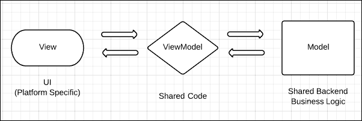
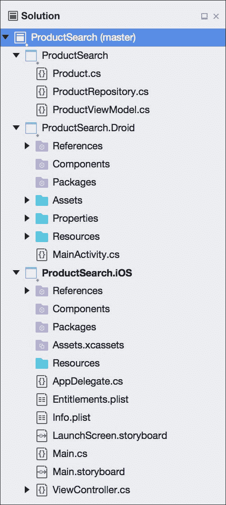

# 第三章：iOS 与 Android 之间的代码共享

Xamarin 的工具承诺在可能的情况下利用每个平台的本地 API，在 iOS 和 Android 之间共享大部分代码。这样做更多的是软件工程的实践，而不是编程技能或对每个平台的知识。为了构建一个支持代码共享的 Xamarin 应用程序，必须将应用程序分离为不同的层次。我们将介绍基础知识以及针对特定情况考虑的具体选项。

在本章中，我们将涵盖以下内容：

+   用于代码共享的 MVVM 设计模式

+   项目和解决方案的组织策略

+   可移植类库（PCLs）

+   针对特定平台代码的预处理器语句

+   依赖注入（DI）简化

+   控制反转（IoC）

# 学习 MVVM 设计模式

**模型-视图-视图模型**（**MVVM**）设计模式最初是为了使用**XAML**的**WPF**（**Windows Presentation Foundation**）应用程序而发明的，用于将 UI 与业务逻辑分离，并充分利用**数据绑定**。以这种方式构建的应用程序有一个独特的视图模型层，它与用户界面没有依赖关系。这种架构本身针对单元测试以及跨平台开发进行了优化。由于应用程序的视图模型类对 UI 层没有依赖，你可以轻松地将 iOS 用户界面替换为 Android 界面，并针对视图模型层编写测试。MVVM 设计模式与前面章节讨论的 MVC 设计模式也非常相似。

MVVM 设计模式包括以下内容：

+   **模型**：模型层是驱动应用程序的后端业务逻辑以及任何伴随的业务对象。这可以是任何从向服务器发起网络请求到使用后端数据库的内容。

+   **视图**：这一层是屏幕上实际看到用户界面。在跨平台开发中，它包括任何特定于平台的代码，用于驱动应用程序的用户界面。在 iOS 上，这包括整个应用程序中使用的控制器，在 Android 上，则包括应用程序的活动。

+   **视图模型**：这一层在 MVVM 应用程序中充当粘合剂。视图模型层协调视图和模型层之间的操作。视图模型层将包含视图获取或设置的属性，以及每个视图上用户可以进行的每个操作的函数。如果需要，视图模型还将在模型层上调用操作。

下图展示了 MVVM 设计模式：



需要注意的是，视图(View)和视图模型(ViewModel)层之间的交互传统上是通过 WPF 的数据绑定来创建的。然而，iOS 和 Android 没有内置的数据绑定机制，因此本书将采用的方法是从视图手动调用视图模型层。有几个框架提供了数据绑定功能，例如**MVVMCross**和**Xamarin.Forms**。

为了更好地理解这一模式，让我们实现一个常见场景。假设我们在屏幕上有一个搜索框和一个搜索按钮。当用户输入一些文本并点击按钮时，将向用户显示产品和价格列表。在我们的示例中，我们将使用 C# 5 中可用的**async**和**await**关键字来简化异步编程。

要实现此功能，我们将从一个简单的`model`类（也称为`business`对象）开始，如下所示：

```kt
public class Product 
{ 
    public int Id { get; set; } //Just a numeric identifier 
    public string Name { get; set; } //Name of the product 
    public float Price { get; set; } //Price of the product 
} 

```

接下来，我们将根据搜索词实现我们的模型层以检索产品。这里执行业务逻辑，表达实际需要如何执行搜索。以下代码行中可以看到这一点：

```kt
// An example class, in the real world would talk to a web 
// server or database. 
public class ProductRepository 
{ 
  // a sample list of products to simulate a database 
  private Product[] products = new[] 
  { 
    new Product { Id = 1, Name = "Shoes", Price = 19.99f }, 
    new Product { Id = 2, Name = "Shirt", Price = 15.99f }, 
    new Product { Id = 3, Name = "Hat", Price = 9.99f }, 
  }; 

  public async Task<Product[]> SearchProducts(string searchTerm) 
  { 
    // Wait 2 seconds to simulate web request 
    await Task.Delay(2000); 

    // Use Linq-to-objects to search, ignoring case 
    searchTerm = searchTerm.ToLower(); 

    return products.Where(p =>
      p.Name.ToLower().Contains(searchTerm)) 
      .ToArray(); 
  } 
} 

```

需要注意的是，`Product`和`ProductRepository`类都被认为是跨平台应用程序模型层的一部分。有些人可能认为`ProductRepository`是一个**服务**，通常是一个自包含的用于获取数据的类。将此功能分为两个类是一个好主意。`Product`类的任务是保存有关产品的信息，而`ProductRepository`负责检索产品。这是**单一职责原则**的基础，该原则指出每个类应该只有一个工作或关注点。

接下来，我们将按以下方式实现一个`ViewModel`类：

```kt
public class ProductViewModel 
{ 
  private readonly ProductRepository repository =
      new ProductRepository(); 

  public string SearchTerm 
  { 
    get; 
    set; 
  } 

  public Product[] Products 
  { 
    get; 
    private set; 
  } 

  public async Task Search() 
  { 
    if (string.IsNullOrEmpty(SearchTerm)) 
      Products = null; 
    else 
      Products = await repository.SearchProducts(SearchTerm); 
  } 
} 

```

从这里开始，你的特定平台代码就开始了。每个平台将处理管理`ViewModel`类的实例，设置`SearchTerm`属性，并在点击按钮时调用`Search`。当任务完成后，用户界面层将更新屏幕上显示的列表。

如果你熟悉与 WPF 一起使用的 MVVM 设计模式，你可能会注意到我们没有为数据绑定实现`INotifyPropertyChanged`。由于 iOS 和 Android 没有数据绑定的概念，我们省略了此功能。如果你计划为移动应用程序提供一个 WPF 或 Windows UWP 版本，或者使用提供数据绑定的框架，你应在需要的地方实现支持。

### 提示

要了解更多关于`INotifyPropertyChanged`的信息，请查看 MSDN 上的这篇文章：[`msdn.microsoft.com/en-us/library/system.componentmodel.inotifypropertychanged`](https://msdn.microsoft.com/en-us/library/system.componentmodel.inotifypropertychanged)

# 比较项目组织策略

在这一点上，你可能会问自己，如何在 Xamarin Studio 中设置解决方案以处理共享代码，同时也有特定平台的项目？Xamarin.iOS 应用程序只能引用 Xamarin.iOS 类库；因此，设置解决方案可能会遇到问题。有几种设置跨平台解决方案的策略，每种策略都有其自身的优点和缺点。

跨平台解决方案的选项如下：

+   **文件链接**：对于这个选项，你可以从普通的.NET 4.0 或.NET 4.5 类库开始，该类库包含所有共享代码。然后，你需要为每个希望应用运行的平台创建一个新项目。每个特定平台的项目将包含一个子目录，其中链接了第一个类库中的所有文件。要设置这个，将现有文件添加到项目中，并选择**添加对文件的链接**选项。任何单元测试都可以针对原始类库运行。文件链接的优点和缺点如下：

    +   **优点**：这种方法非常灵活。你可以选择链接或不链接某些文件，并且可以使用如`#if IPHONE`之类的预处理器指令。你还可以在 Android 和 iOS 上引用不同的库。

    +   **缺点**：你必须在三个项目中管理文件的存在：核心库、iOS 和 Android。如果这是一个大型应用程序，或者有很多人在处理它，这可能会很麻烦。自从共享项目出现后，这个选项也有些过时了。

+   **克隆项目文件**：这非常类似于文件链接，主要的区别在于除了主项目之外，每个平台都有一个类库。将 iOS 和 Android 项目放在主项目同一目录下，文件可以添加而无需链接。你可以通过右键单击解决方案并选择**显示选项** | **显示所有文件**轻松地添加文件。单元测试可以针对原始类库或特定平台的版本运行：

    +   **优点**：这种方法与文件链接一样灵活，但你不需要手动链接任何文件。你仍然可以使用预处理器指令，并在每个平台上引用不同的库。

    +   **缺点**：你仍然需要在三个项目中管理文件的存在。此外，还需要一些手动文件整理来设置这个。你最终在每个平台上还要管理一个额外的项目。自从共享项目出现后，这个选项也有些过时了。

+   **共享项目**：从 Visual Studio 2013 开始，微软创建了共享项目的概念，以实现 Windows 8 和 Windows Phone 应用程序之间的代码共享。Xamarin 也在 Xamarin Studio 中实现了共享项目，作为实现代码共享的另一种选项。共享项目实际上与文件链接相同，因为添加对共享项目的引用实际上将其文件添加到你的项目中：

    +   **优点**：这种方法与文件链接相同，但更加整洁，因为你的共享代码位于一个单一的项目中。Xamarin Studio 还提供了一个下拉菜单，可以在引用的每个项目之间切换，这样你就可以看到预处理器语句在代码中的效果。

    +   **缺点**：由于共享项目中的所有文件都会被添加到每个平台的主项目中，因此在共享项目中包含特定平台的代码可能会变得不美观。如果你有一个大型团队，或者团队成员经验不足，预处理语句可能会迅速失控。共享项目也不会编译成 DLL，所以如果没有源代码，就没有办法分发这种类型的项目。

+   **便携式类库**：一旦你对 Xamarin 更加熟悉，这将是最佳选择；你从创建一个所有共享代码的**便携式**类库（**PCL**）项目开始解决方案。这是一种特殊的项目类型，允许多个平台引用同一个项目，使你可以使用每个平台中可用的 C#和.NET 框架的最小子集。每个特定平台的项目将直接引用这个库，以及任何单元测试项目：

    +   **优点**：你所有的共享代码都在一个项目中，所有平台都使用相同的库。由于不可能使用预处理器语句，PCL 库的代码通常更整洁。特定平台的代码通常通过接口或抽象类进行抽象。

    +   **缺点**：根据你面向的平台数量，你将受限于.NET 的一个子集。特定平台的代码需要使用**依赖注入**，这对于不熟悉这一主题的开发者来说可能是一个更高级的话题。

# 设置共享项目

为了完全理解每个选项以及何种情况需要它，让我们为共享项目和便携式类库定义一个解决方案结构。让我们使用本章前面提到的产品搜索示例，并为每种方法设置一个解决方案。

要设置共享项目，请执行以下步骤：

1.  打开 Xamarin Studio 并开始一个新解决方案。

1.  在**多平台 | 应用**部分下选择一个新的**单视图应用**。

1.  将应用命名为`ProductSearch`，并选择**使用共享库**。

1.  完成这个新项目向导，Xamarin Studio 将生成三个项目：`ProductSearch`、`ProductSearch.Droid`和`ProductSearch.iOS`。

1.  将`Product`、`ProductRepository`和`ProductViewModel`类添加到本章前面提到的`ProductSearch`项目中。你需要在需要的地方添加`using System.Threading.Tasks;`和`using System.Linq;`。

1.  点击顶部菜单中的**构建** | **构建全部**来再次检查一切，这样你就成功设置了一个跨平台解决方案。

完成后，你将得到一个解决方案树，其外观类似于以下截图所示：



共享项目是开始跨平台开发的一个很好的起点。使用它们不会出错，并且它们提供了最大的灵活性，可以在共享代码中使用`#if`。共享项目可能不是最佳选择的情况，可能是因为你需要将共享项目分发给其他人，或者拥有非常大的团队或代码库。如果放任不管，预处理器指令确实可能会失控。

### 提示

在 Visual Studio 中，跨平台应用程序的项目模板可以在**跨平台 | 空白应用（原生共享）**下找到。需要注意的是，它还会生成一个 Windows Phone 项目，如果不需要，你可以简单地移除它。

# 使用便携式类库进行工作。

**便携式类库**（**PCL**）是一个 C#库项目，能够在包括 iOS、Android、Windows、Windows Store 应用、Windows Phone、Silverlight 和 Xbox 360 在内的多个平台上得到支持。PCL 是微软为简化不同.NET 框架版本间开发而做出的努力。Xamarin 也为 iOS 和 Android 增加了对 PCL 的支持。许多流行的跨平台框架和开源库开始开发 PCL 版本，如 Json.NET 和 MVVMCross。

要设置一个共享项目，请执行以下步骤：

1.  打开 Xamarin Studio 并开始一个新的解决方案。

1.  在**多平台 | 应用**部分下选择新的**单视图应用**。或者在 Visual Studio 中，选择**跨平台 | 空白应用（原生便携式）**。

1.  将应用命名为`ProductSearch`，并选择**使用便携式库**。

1.  完成这个新项目向导，Xamarin Studio 将生成三个项目：`ProductSearch`、`ProductSearch.Droid`和`ProductSearch.iOS`。

1.  将本章前面提到的`Product`、`ProductRepository`和`ProductViewModel`类添加到`ProductSearch`项目中。你需要在需要的地方添加`using System.Threading.Tasks;`和`using System.Linq;`。

1.  点击顶部菜单中的**构建** | **构建全部**以再次检查一切，这样你就成功设置了一个 PCL 跨平台解决方案。

如果你需要将项目作为 DLL 或 NuGet 包共享，PCL 是最佳选择。它还帮助你将特定平台的关注点分离，因为它迫使你使用接口或基类，并结合**依赖注入（DI）**。如果你需要在 iOS 或 Android 上使用类似本地的库，如 Facebook SDK，也会出现类似的问题。

### 提示

在撰写本文时，微软刚刚发布了.NET Core 和新的.NET Standard。这将影响未来 PCLs 的工作方式，但不会破坏现有的 Xamarin.iOS 和 Xamarin.Android 项目。不过，这将使你能够继续与.NET Core 和 ASP.NET Core 项目共享代码。

# 使用预处理器语句

当使用共享项目时，你最有力的工具之一就是使用预处理器语句。如果你不熟悉它们，C# 有能力定义预处理器变量，如 `#define IPHONE`，然后使用 `#if IPHONE` 或 `#if !IPHONE`。

下面是使用该技术的简单示例：

```kt
#if IPHONE 
  Console.WriteLine("I am running on iOS"); 
#elif ANDROID 
  Console.WriteLine("I am running on Android"); 
#else 
  Console.WriteLine("I am running on ???"); 
#endif 

```

在 Xamarin Studio 中，你可以在项目选项的 **构建** | **编译器** | **定义符号** 下定义预处理器变量，用分号分隔。这些变量将被应用到整个项目。请注意，你必须为解决方案中的每个配置设置（**调试** 和 **发布**）设置这些变量；这是一个容易遗漏的步骤。你还可以在任何 C# 文件的顶部通过声明 `#define IPHONE` 来定义这些变量，但它们只会在 C# 文件内应用。

让我们再看一个例子，假设我们想要在每个平台上实现一个打开 URL 的类：

```kt
public static class Utility 
{ 
  public static void OpenUrl(string url) 
  { 
    //Open the url in the native browser 
  } 
} 

```

前面的例子是使用预处理器语句的完美候选者，因为它非常特定于每个平台，而且是一个相当简单的函数。要在 iOS 和 Android 上实现该方法，我们需要利用一些本地 API。重构类，使其如下所示：

```kt
#if IPHONE 
  //iOS using statements 
  using MonoTouch.Foundation; 
  using MonoTouch.UIKit; 
#elif ANDROID 
  //Android using statements 
  using Android.App; 
  using Android.Content; 
  using Android.Net; 
#else 
  //Standard .Net using statement 
  using System.Diagnostics; 
#endif 

public static class Utility 
{ 
  #if ANDROID 
    public static void OpenUrl(Activity activity, string url) 
  #else 
    public static void OpenUrl(string url) 
  #endif 
  { 
    //Open the url in the native browser 
    #if IPHONE 
      UIApplication.SharedApplication.OpenUrl(
         NSUrl.FromString(url)); 
    #elif ANDROID 
      var intent = new Intent(Intent.ActionView,
         Uri.Parse(url)); 
      activity.StartActivity(intent); 
    #else 
      Process.Start(url); 
    #endif 
  } 
} 

```

前一个类别支持三种不同类型的项目：Android、iOS 和标准的 Mono 或 .NET 框架类库。在 iOS 的情况下，我们可以使用苹果 API 中可用的静态类来执行功能。Android 稍微有些复杂，需要 `Activity` 对象来本地启动浏览器。我们通过修改 Android 上的输入参数来解决这一问题。最后，我们有一个纯 .NET 版本，它使用 `Process.Start()` 来启动一个 URL。需要注意的是，使用第三种选项在 iOS 或 Android 上本地是无法工作的，这就需要我们使用预处理器语句。

使用预处理器语句通常不是跨平台开发中最干净或最好的解决方案。它们通常最好在困境中使用，或用于非常简单的函数。代码很容易失控，如果有很多 `#if` 语句，代码可能会变得非常难以阅读，因此适度使用总是更好的。当类大多数是特定于平台的时候，使用继承或接口通常是更好的解决方案。

# 简化依赖注入

**依赖注入** 一开始看起来可能是一个复杂的话题，但大部分情况下它是一个简单的概念。它是一个设计模式，旨在使你的应用程序中的代码更加灵活，以便在需要时可以替换某些功能。这个想法围绕在应用程序中设置类之间的依赖关系，以便每个类只与接口或基类/抽象类交互。这给了你在需要实现本地功能时在每个平台上覆盖不同方法的自由。

这个概念源自于**SOLID**面向对象设计原则，如果你对软件架构感兴趣，这是一组你可能想要研究的规定。SOLID 中的**D**代表**依赖关系**。具体来说，该原则声明程序应依赖于抽象，而不是具体（具体类型）。

为了建立这个概念，让我们通过以下例子来逐步了解：

1.  假设我们需要在应用程序中存储一个设置，以确定声音是开还是关。

1.  现在我们来声明一个简单的设置接口：`interface ISettings { bool IsSoundOn { get; set; } }`。

1.  在 iOS 上，我们想使用`NSUserDefaults`类来实现这个接口。

1.  同样，在 Android 上，我们会使用`SharedPreferences`来实现这一点。

1.  最后，任何需要与这个设置交互的类只需引用`ISettings`，这样每个平台上的实现都可以被替换。

作为参考，这个例子的完整实现看起来如下片段所示：

```kt
public interface ISettings 
{ 
  bool IsSoundOn 
  { 
    get; 
    set; 
  } 
} 

//On iOS 
using UIKit; 
using Foundation; 

public class AppleSettings : ISettings 
{ 
  public bool IsSoundOn 
  { 
    get 
    { 
      return NSUserDefaults.StandardUserDefaults 
        .BoolForKey("IsSoundOn"); 
    } 
    set 
    { 
      var defaults = NSUserDefaults.StandardUserDefaults; 
      defaults.SetBool(value, "IsSoundOn"); 
      defaults.Synchronize(); 
    } 
  } 
} 

//On Android 
using Android.Content; 

public class DroidSettings : ISettings 
{ 
  private readonly ISharedPreferences preferences; 

  public DroidSettings(Context context) 
  { 
    preferences = context.GetSharedPreferences(
       context.PackageName, FileCreationMode.Private); 
  } 

  public bool IsSoundOn 
  { 
    get 
    { 
      return preferences.GetBoolean("IsSoundOn", true); 
    } 
    set 
    { 
      using (var editor = preferences.Edit()) 
      { 
        editor.PutBoolean("IsSoundOn", value); 
        editor.Commit(); 
      } 
    } 
  } 
} 

```

现在，按照 MVVM 模式，你可能会有一个`ViewModel`类，它只引用`ISettings`，如下面的代码片段所示：

```kt
public class SettingsViewModel 
{ 
  private readonly ISettings settings; 

  public SettingsViewModel(ISettings settings) 
  { 
    this.settings = settings; 
  } 

  public bool IsSoundOn 
  { 
    get; 
    set; 
  } 

  public void Save() 
  { 
    settings.IsSoundOn = IsSoundOn; 
  } 
} 

```

对于这样一个简单的例子来说，使用 ViewModel 层并不一定需要，但如果你需要进行其他任务，如输入验证，你可以看到它将非常有用。一个完整的应用程序可能会有更多的设置，并且可能需要向用户展示加载指示器。抽象出你的设置的实现会给你的应用程序带来其他好处，增加灵活性。比如说，你突然需要将 iOS 上的`NSUserDefaults`替换为 iCloud 版本；你可以通过实现一个新的`ISettings`类轻松做到这一点，其余的代码将保持不变。这还将帮助你针对新的平台，比如 Windows UWP，你可能选择以特定于平台的方式实现`ISettings`。

# 实现控制反转

在这一点上，你可能会问自己，如何切换不同的类，比如`ISettings`的例子？**控制反转**（**IoC**）是一种设计模式，旨在补充依赖注入并解决这个问题。基本原则是，在应用程序中创建的许多对象都由一个单独的类来管理和创建。在应用程序中，不是使用标准的 C#构造函数来创建你的`ViewModel`或`Model`类，而是由服务定位器或工厂类来管理它们。

IoC 有许多不同的实现和风格，所以让我们实现一个简单的服务定位器类，以供本书的其余部分使用，如下所示：

```kt
public static class ServiceContainer 
{ 
  static readonly Dictionary<Type, Lazy<object>> services = 
    new Dictionary<Type, Lazy<object>>(); 

  public static void Register<T>(Func<T> function) 
  { 
    services[typeof(T)] = new Lazy<object>(() => function()); 
  } 

  public static T Resolve<T>() 
  { 
    return (T)Resolve(typeof(T)); 
  } 

  public static object Resolve(Type type) 
  { 
    Lazy<object> service; 
    if (services.TryGetValue(type, out service)) 
    { 
      return service.Value; 
    } 
    throw new Exception("Service not found!"); 
  } 
} 

```

这个类受到 XNA/MonoGame 的`GameServiceContainer`类的简单性的启发，并遵循**服务定位器**模式。主要区别在于使用泛型和它是一个静态类。

要使用我们的`ServiceContainer`类，我们只需通过调用`Register`声明应用中要使用的`ISettings`或其他接口的版本，如下面的代码所示：

```kt
//iOS version of ISettings 
ServiceContainer.Register<ISettings>(() =>
   new AppleSettings()); 

//Android version of ISettings 
ServiceContainer.Register<ISettings>(() => 
   new DroidSettings(this)); 

//You can even register ViewModels 
ServiceContainer.Register<SettingsViewModel>(() => 
   new SettingsViewModel()); 

```

在 iOS 上，您可以将此注册代码放在`static void Main()`方法中，或者放在`AppDelegate`类的`FinishedLaunching`方法中。这些方法总是在应用程序启动之前调用。

在 Android 上，情况稍微复杂一些。您不能将此代码放在作为主启动器的活动的`OnCreate`方法中。在某些情况下，Android OS 可能会关闭您的应用程序，但稍后会在另一个活动中重新启动它。这种情况会导致您的应用程序崩溃，因为它会尝试访问尚未注册的容器中的服务。将此代码放在自定义的 Android `Application`类中是安全的，该类有一个在应用程序中任何活动创建之前调用的`OnCreate`方法。下面的代码展示了`Application`类的使用：

```kt
[Application] 
public class Application : Android.App.Application 
{ 
  //This constructor is required 
  public Application(IntPtr javaReference, JniHandleOwnership
      transfer): base(javaReference, transfer) 
  { 

  } 

  public override void OnCreate() 
  { 
    base.OnCreate(); 

    //IoC Registration here 
  } 
} 

```

要从`ServiceContainer`类中获取服务，我们可以重写`SettingsViewModel`类的构造函数，如下面的代码所示：

```kt
public SettingsViewModel() 
{ 
  this.settings = ServiceContainer.Resolve<ISettings>(); 
} 

```

同样，您可以使用泛型`Resolve`方法从 iOS 上的控制器或 Android 上的活动中调用任何需要的`ViewModel`类。这是管理应用程序内部依赖关系的很好且简单的方法。

当然，有一些优秀的开源库实现了 C#应用程序的 IoC。如果您需要更高级的服务定位功能，或者只是想过渡到一个更复杂的 IoC 容器，您可以考虑切换到其中之一。

这里有一些与 Xamarin 项目一起使用的库：

+   **TinyIoC**：[`github.com/grumpydev/TinyIoC`](https://github.com/grumpydev/TinyIoC)

+   **Ninject**：[`www.ninject.org/`](http://www.ninject.org/)

+   **MvvmCross**：[`github.com/MvvmCross/MvvmCross`](https://github.com/MvvmCross/MvvmCross) 包括完整的 MVVM 框架以及 IoC。

+   **Autofac**：[`autofac.org`](https://autofac.org)

# 概要

在本章中，我们了解了 MVVM 设计模式以及如何使用它来更好地构建跨平台应用程序。我们比较了管理包含 iOS 和 Android 项目的 Xamarin Studio 解决方案的几种项目组织策略。我们讨论了可移植类库作为共享代码的首选选项，以及如何使用预处理器语句作为实现平台特定代码的快速而简单的方法。

完成本章节后，你应该已经掌握了使用 Xamarin Studio 在 iOS 和 Android 应用之间共享代码的几种技术。采用 MVVM 设计模式可以帮助你区分共享代码和特定平台的代码。我们还介绍了设置跨平台 Xamarin 解决方案的几种选项。你也应该牢固掌握使用依赖注入和控制反转技术，使共享代码能够访问每个平台的本地 API。在下一章节中，我们将开始编写跨平台应用程序，并深入探讨这些技术的使用。
