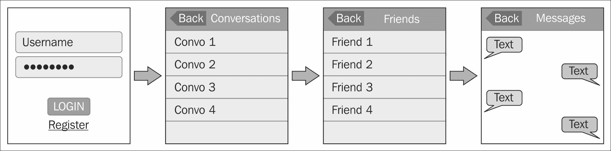
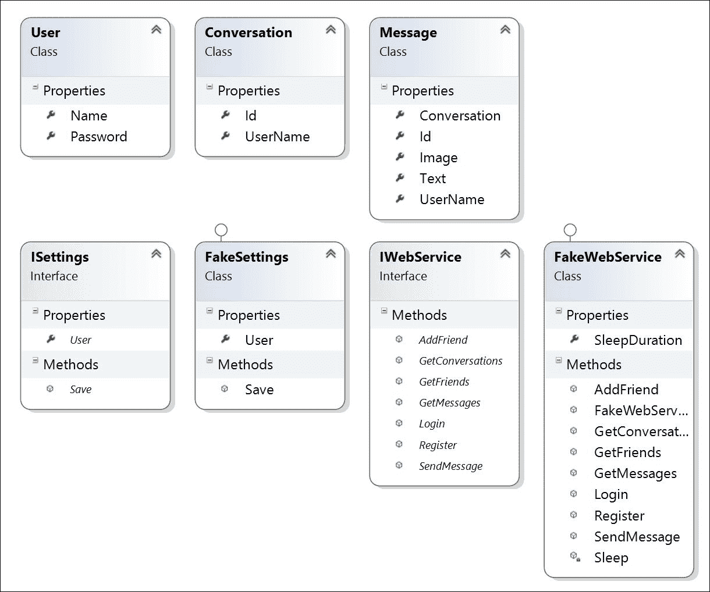
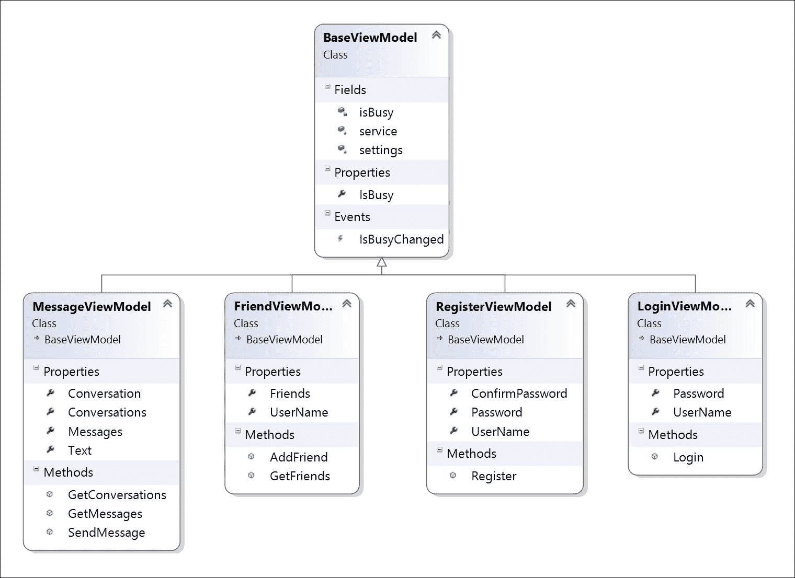
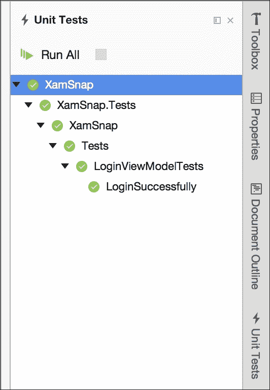
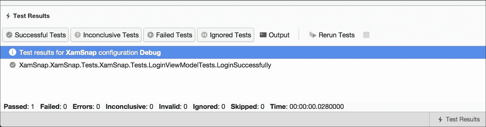
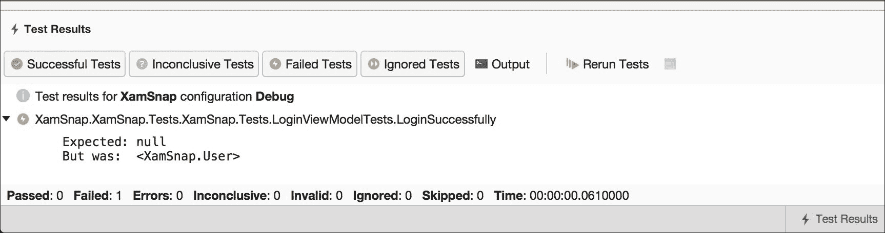

# 第四章：XamSnap - 一个跨平台应用

在我看来，真正学会一项编程技能的最佳方式是接受一个需要运用该技能的简单项目。这给新开发者提供了一个可以专注于他们试图学习的概念的项目，而无需处理修复错误或遵循客户需求的负担。为了加深我们对 Xamarin 和跨平台开发的理解，让我们为 iOS 和 Android 开发一个名为 XamSnap 的简单应用。

在本章中，我们将涵盖以下主题：

+   我们的示例应用概念

+   我们应用的模型层

+   模拟网络服务

+   我们应用的 ViewModel 层

+   编写单元测试

# 启动我们的示例应用概念

这个概念很简单：流行的聊天应用 Snapchat 的一个简单克隆。由于短信成本和诸如 iPod Touch 或 iPad 等设备的支持，Apple App Store 中有几个这样的流行应用。这应该是一个对用户可能有用且涵盖为 iOS 和 Android 开发应用的具体主题的实用现实示例。

在开始开发之前，让我们列出我们需要的一组界面：

+   **登录/注册**：这个界面将包括用户的标准化登录和注册过程。

+   **对话列表**：这个界面将包括一个启动新对话的按钮。

+   **好友列表**：这个界面将提供一种在开始新对话时添加新好友的方法。

+   **对话**：这个界面将展示你与其他用户之间的消息列表，并提供回复选项。

+   **相机**：除了文本消息，Snapchat 还具有发送照片的功能。我们将添加使用设备相机或照片库发送照片的选项。

因此，一个快速的应用程序线框布局可以帮助我们更好地理解应用程序的布局。下图展示了应用中应包含的一组屏幕：



# 开发我们的模型层

既然我们已经对应用有了很好的了解，下一步就是开发这个应用的商业对象或模型层。让我们首先定义几个类，这些类将包含整个应用中使用的数据。为了组织方便，建议将这些类添加到项目中的 `Models` 文件夹中。

让我们从表示用户的类开始。该类可以按以下方式创建：

```kt
public class User 
{ 
  //NOTE: we will treat this as a unique name 
  public string Name { get; set; } 

  //NOTE: we'll try to use this in a secure way 
  public string Password { get; set; } 
} 

```

到目前为止非常直观；接下来，我们按照以下方式创建表示对话和消息的类：

```kt
public class Conversation 
{ 
  public string Id { get; set; } 

  public string UserName { get; set; } 
} 

public class Message 
{ 
  public string Id { get; set; } 

  //NOTE: the Id of a Conversation 
  public string Conversation { get; set; }  

  public string UserName { get; set; } 

  public string Text { get; set; }

//NOTE: some messages will include photos 
  public string Image { get; set; } 
} 

```

请注意，我们将字符串用作各种对象的标识符；这将简化我们与在后续章节中作为 Azure Function 运行的后端的集成。`UserName` 是应用程序设置的值，用于更改与对象关联的用户。

现在让我们继续执行以下步骤来设置我们的解决方案：

1.  从创建一个新的解决方案开始，作为 iOS 和 Android 的**多平台 | 应用 | 单视图应用**项目。

1.  将项目命名为`XamSnap`，并确保已选择**使用可移植类库**。

1.  你也可以选择为这个项目使用**共享项目**，但我更倾向于使用可移植类库。

1.  点击**创建**，在指定目录中创建你的解决方案。

### 提示

与前面的章节一样，Visual Studio 的步骤略有不同。你需要创建一个作为可移植类库的解决方案，并*然后*添加 iOS 和 Android 项目。不要忘记在 iOS 和 Android 项目中都添加对 PCL 的引用。

# 编写模拟网络服务。

在开发移动应用时，你可能需要在真正的后端网络服务可用之前就开始开发你的应用。为了防止开发完全停滞，一个好的方法可能是开发一个服务的模拟版本。这在需要编写单元测试，或者等待另一个团队为你的应用开发后端时也很有帮助。

首先，让我们分解一下我们的应用将对网络服务器执行的操作。操作如下：

1.  使用用户名和密码登录。

1.  注册一个新账户。

1.  获取用户的朋友列表。

1.  通过他们的用户名添加朋友。

1.  获取用户的现有会话列表。

1.  获取会话中的消息列表。

1.  发送消息。

现在让我们定义一个接口，为每个场景提供一个方法。方法如下：

```kt
public interface IWebService 
{ 
  Task<User> Login(string userName, string password); 

  Task<User> Register(User user); 

  Task<User[]> GetFriends(string userName); 

  Task<User> AddFriend(string username, string friendName); 

  Task<Conversation[]> GetConversations(string userName); 

  Task<Message[]> GetMessages(string conversation); 

  Task<Message> SendMessage(Message message); 
} 

```

如你所见，我们通过利用.NET 基类库中的**TPL**（**任务并行库**）简化了与网络服务的任何异步通信。

由于与网络服务通信可能是一个漫长的过程，因此使用`Task<T>`类进行这些操作总是一个好主意。否则，你可能无意中在用户界面线程上运行一个耗时的任务，这将导致在操作期间无法接收用户输入。对于网络请求来说，`Task`绝对是必需的，因为用户可能正在 iOS 和 Android 上使用蜂窝网络连接，这将使我们能够以后使用`async`和`await`关键字。

### 提示

如果你不太熟悉 C#中用于简化异步编程的 async/await，查看 MSDN 上的相关主题会很有帮助：[`msdn.microsoft.com/en-us/library/mt674882.aspx`](https://msdn.microsoft.com/en-us/library/mt674882.aspx)

现在让我们实现一个实现了此接口的**伪**服务。将如`FakeWebService`这样的类放在项目的`Fakes`文件夹中。让我们从类声明和接口的第一个方法开始：

```kt
public class FakeWebService : IWebService
{
  public int SleepDuration { get; set; }

  public FakeWebService()
  {
    SleepDuration = 1000;
  }

  private Task Sleep()
  {
    return Task.Delay(SleepDuration);
  }

  public async Task<User> Login(string userName, string password)
  {
    await Sleep(); 
    return new User { Name = userName }; 
  }
}

```

我们从一个名为`SleepDuration`的属性开始，用于存储毫秒数。这用于模拟与 Web 服务器的交互，这可能需要一些时间。在不同情况下更改`SleepDuration`值也很有用。例如，在编写单元测试时，你可能希望将此值设置得较小，以便测试快速执行。

接下来，我们实现了一个简单的`Sleep`方法，该方法返回一个引入了若干毫秒延迟的任务。这个方法将在伪服务中用于在每个操作上造成延迟。

最后，`Login`方法只是在`Sleep`方法上使用了`await`调用，并返回了一个具有适当`Name`的新`User`对象。目前，任何用户名或密码组合都可以使用；但是，你可能希望在这里编写一些代码来检查特定的凭据。

现在，让我们按照以下方式继续实现`FakeWebService`类的几个更多方法：

```kt
public async Task<User[]> GetFriends(string userId)
{
  await Sleep();
  return new[] 
  { 
    new User { Name = "bobama" }, 
    new User { Name = "bobloblaw" }, 
    new User { Name = "georgemichael" }, 
  };
}

public async Task<User> AddFriend(
  string username, string friendName)
{
  await Sleep(); 
  return new User { Name = friendName };
}

```

对于这些方法中的每一个，我们都遵循了与`Login`方法完全相同的模式。每个方法都将延迟并返回一些示例数据。请随意用你自己的值混合这些数据。

现在，让我们按照以下方式实现接口所需的`GetConversations`方法：

```kt
public async Task<Conversation[]> GetConversations(
  string userName)
{
  await Sleep();
  return new[] 
  { 
    new Conversation { Id = "1", UserName = "bobama" },
    new Conversation { Id = "2", UserName = "bobloblaw" }, 
    new Conversation { Id = "3", UserName = "georgemichael" }, 
  };
}

```

基本上，我们只是创建了一个新的`Conversation`对象数组，这些对象的 ID 是任意的。我们还确保将`UserName`值与我们到目前为止在`User`对象上使用的值相匹配。

接下来，让我们按照以下方式实现`GetMessages`以获取消息列表：

```kt
public async Task<Message[]> GetMessages(string conversation) 
{ 
  await Sleep(); 

  return new[] 
  { 
    new Message 
    { 
      Id = "1", 
      Conversation = conversation, 
      UserName = "bobloblaw", 
      Text = "Hey", 
    }, 
    new Message 
    { 
      Id = "2", 
      Conversation = conversation, 
      UserName = "georgemichael", 
      Text = "What's Up?", 
    }, 
    new Message 
    { 
      Id = "3", 
      Conversation = conversation, 
      UserName = "bobloblaw", 
      Text = "Have you seen that new movie?", 
    }, 
    new Message 
    { 
      Id = "4", 
      Conversation = conversation, 
      UserName = "georgemichael", 
      Text = "It's great!", 
    }, 
  }; 
} 

```

再次，我们在这里添加了一些任意数据，主要确保`UserId`和`ConversationId`与我们到目前为止的现有数据相匹配。

最后，我们将再编写一个如下所示发送消息的方法：

```kt
public async Task<Message> SendMessage(Message message) 
{ 
  await Sleep(); 

  return message; 
} 

```

这些方法中的大多数都非常直接。请注意，服务不必完美无缺；它应该只是在延迟后成功地完成每个操作。每个方法还应返回某种测试数据以在 UI 中显示。这将使我们能够在填充 Web 服务的同时实现我们的 iOS 和 Android 应用程序。

接下来，我们需要为持久化应用程序设置实现一个简单的接口。让我们按照以下方式定义一个名为`ISettings`的接口：

```kt
public interface ISettings 
{ 
  User User { get; set; } 

  void Save(); 
} 

```

我们正在使`ISettings`同步，但如果你计划将设置存储在云端，你可能想要将`Save`方法设置为异步并返回`Task`。由于我们的应用程序只会在本地保存设置，所以实际上我们并不需要这样做。

稍后，我们将在每个平台上使用 Android 和 iOS API 实现此接口。现在，让我们仅实现一个伪版本，稍后在编写单元测试时使用。使用以下代码行实现接口：

```kt
public class FakeSettings : ISettings 
{ 
  public User User { get; set; } 

  public void Save() { } 
} 

```

请注意，伪版本实际上不需要执行任何操作；我们只需要提供一个实现接口的类，并且不抛出任何意外的错误。

这完成了应用程序的模型层。以下是我们到目前为止实现的最终类图：



# 编写 ViewModel 层

既然我们已经实现了模型层，现在可以继续编写 ViewModel 层了。ViewModel 负责将每个操作呈现给 UI，并提供由视图层填充的属性。这一层的其他常见职责包括输入验证和显示忙碌指示器的简单逻辑。

在此阶段，将上一章中的`ServiceContainer`类包含到我们的`XamSnap` PCL 项目中会是一个好主意，因为我们将会通过 ViewModels 与模型层交互时使用它。我们将用它作为一个简单的选项来支持依赖注入和控制反转；然而，你也可以选择你偏好的另一个库来实现这一点。

通常，我们首先为项目中所有 ViewModel 层编写一个基类。这是一个放置所有子类使用的代码部分的好地方，例如：通知变更、方法或常用的接口。

在项目中的新`ViewModels`文件夹中放置以下代码片段：

```kt
public class BaseViewModel 
{ 
  protected readonly IWebService service = 
     ServiceContainer.Resolve<IWebService>(); 
  protected readonly ISettings settings = 
     ServiceContainer.Resolve<ISettings>(); 

  public event EventHandler IsBusyChanged = (sender, e) => { }; 

  private bool isBusy = false; 

  public bool IsBusy 
  { 
    get { return isBusy; } 
    set 
    { 
      isBusy = value; 
      IsBusyChanged(this, EventArgs.Empty); 
    } 
  } 
} 

```

`BaseViewModel`类是放置你打算在应用程序中重复使用的任何公共功能的好地方。对于这个应用，我们只需要实现一种方法来指示 ViewModel 层是否忙碌。我们提供了一个属性和一个事件，UI 将能够订阅并在屏幕上显示等待指示器。我们还添加了一些需要的服务字段。另一个可能添加的常见功能是对用户输入的验证；然而，这个应用程序并不真正需要它。

## 实现我们的 LoginViewModel 类

既然我们已经为所有的 ViewModel 层创建了一个基类，我们可以实现应用程序第一个屏幕的 ViewModel，即**登录**屏幕。

现在我们按照以下方式实现一个`LoginViewModel`类：

```kt
public class LoginViewModel : BaseViewModel 
{ 
  public string UserName { get; set; } 

  public string Password { get; set; } 

  public async Task Login() 
  { 
    if (string.IsNullOrEmpty(UserName)) 
      throw new Exception("Username is blank."); 

    if (string.IsNullOrEmpty(Password)) 
      throw new Exception("Password is blank."); 

    IsBusy = true; 
    try 
    { 
      settings.User = await service.Login(UserName, Password); 
      settings.Save(); 
    } 
    finally 
    { 
      IsBusy = false; 
    } 
  } 
} 

```

在这个类中，我们实现了以下功能：

+   我们继承了`BaseViewModel`，以获取`IsBusy`和包含公共服务的字段

+   我们添加了`UserName`和`Password`属性，由视图层设置

+   我们添加了一个`User`属性，以在登录过程完成后设置

+   我们实现了一个从视图调用的`Login`方法，对`UserName`和`Password`属性进行验证

+   我们在调用`IWebService`上的`Login`方法期间设置`IsBusy`

+   我们通过等待网络服务的`Login`方法的结果来设置`User`属性

基本上，这是我们将在应用程序的其余 ViewModel 中遵循的模式。我们为视图层提供由用户输入设置的属性，以及调用各种操作的方法。如果这是一个可能需要一些时间的方法，比如网络请求，你应当始终返回`Task`，并使用`async`和`await`关键字。

### 提示

请注意，我们使用了`try`和`finally`块来将`IsBusy`设置回`false`。这将确保即使在抛出异常时也能正确重置。我们计划在 View 层处理错误，这样我们就可以向用户显示本地弹窗，并显示一条消息。

## 实现我们的 RegisterViewModel 类

既然我们已经完成了用于登录的`ViewModel`类的编写，我们现在需要创建一个用于用户注册的类。

让我们实现另一个 ViewModel 来注册新用户：

```kt
public class RegisterViewModel : BaseViewModel 
{ 
  public string UserName { get; set; } 

  public string Password { get; set; } 

  public string ConfirmPassword { get; set; } 
} 

```

这些属性将处理用户的输入。接下来，我们需要按照以下方式添加一个`Register`方法：

```kt
public async Task Register() 
{ 
  if (string.IsNullOrEmpty(UserName)) 
    throw new Exception("Username is blank."); 

  if (string.IsNullOrEmpty(Password)) 
    throw new Exception("Password is blank."); 

  if (Password != ConfirmPassword) 
    throw new Exception("Passwords do not match."); 

  IsBusy = true; 
  try 
  { 
    settings.User = await service.Register(new User  
    {  
      Name = UserName, 
      Password = Password,  
    }); 
    settings.Save(); 
  } 
  finally 
  { 
    IsBusy = false; 
  } 
} 

```

`RegisterViewModel`类与`LoginViewModel`类非常相似，但它增加了一个`ConfirmPassword`属性，以便 UI 设置。关于何时拆分 ViewModel 层的功能，一个好的规则是：当 UI 有新屏幕时，始终创建一个新类。这有助于保持代码整洁，并在一定程度上遵循类的**单一职责原则（SRP）**。**SRP**指出，一个类应该只有一个目的或责任。我们将尝试遵循这一概念，使我们的类保持小而有序，这在跨平台共享代码时尤为重要。

## 实现我们的 FriendViewModel 类

接下来是处理用户朋友列表的 ViewModel 层。我们需要一个方法来加载用户的朋友列表并添加新朋友。

现在我们按照以下方式实现`FriendViewModel`：

```kt
public class FriendViewModel : BaseViewModel 
{ 
  public User[] Friends { get; private set; } 

  public string UserName { get; set; } 
} 

```

现在我们需要一种加载朋友列表的方法。该方法如下：

```kt
public async Task GetFriends() 
{ 
  if (settings.User == null) 
    throw new Exception("Not logged in."); 

  IsBusy = true; 
  try 
  { 
    Friends = await service.GetFriends(settings.User.Name); 
  } 
  finally 
  { 
    IsBusy = false; 
  } 
} 

```

最后，我们需要一个添加新朋友并更新本地朋友列表的方法：

```kt
public async Task AddFriend()
{
  if (settings.User == null)
    throw new Exception("Not logged in.");
  if (string.IsNullOrEmpty(UserName))
    throw new Exception("Username is blank.");
  IsBusy = true; 

  try 
  { 
    var friend = await service
      .AddFriend(settings.User.Name, UserName); 
    //Update our local list of friends 
    var friends = new List<User>(); 
    if (Friends != null)
      friends.AddRange(Friends); 
    friends.Add(friend); 
    Friends =  friends.OrderBy(f => f.Name).ToArray(); 
  } 
  finally 
  { 
    IsBusy =  false; 
  }
}

```

同样，这个类相当直接。这里唯一的新东西是，我们添加了一些逻辑，在客户端应用程序中更新朋友列表并对其进行排序，而不是在服务器上。如果你有充足的理由，也可以选择重新加载整个朋友列表。

## 实现我们的 MessageViewModel 类

我们最终需要的 ViewModel 层将处理消息和对话。我们需要创建一种加载对话和消息的方法，并发送新消息。

让我们开始按照以下方式实现我们的`MessageViewModel`类：

```kt
public class MessageViewModel : BaseViewModel 
{ 
  public Conversation[] Conversations { get; private set; } 

  public Conversation Conversation { get; set; } 

  public Message[] Messages { get; private set; } 

  public string Text { get; set; } 
} 

```

接下来，让我们按照以下方式实现获取对话列表的方法：

```kt
public async Task GetConversations() 
{ 
  if (settings.User == null) 
    throw new Exception("Not logged in."); 

  IsBusy = true; 
  try 
  { 
    Conversations = await service
       .GetConversations(settings.User.Name); 
  } 
  finally 
  { 
    IsBusy = false; 
  } 
} 

```

同样，我们需要获取对话中的消息列表。我们需要将对话 ID 传递给服务，如下所示：

```kt
public async Task GetMessages() 
{ 
  if (Conversation == null) 
    throw new Exception("No conversation."); 

  IsBusy = true; 
  try 
  { 
    Messages = await service
       .GetMessages(Conversation.Id); 
  } 
  finally 
  { 
    IsBusy = false; 
  } 
} 

```

最后，我们需要编写一些代码来发送消息并更新本地消息列表，如下所示：

```kt
public async Task SendMessage() 
{ 
  if (settings.User == null) 
    throw new Exception("Not logged in."); 

  if (Conversation == null) 
    throw new Exception("No conversation."); 

  if (string.IsNullOrEmpty (Text)) 
    throw new Exception("Message is blank."); 

  IsBusy = true; 
  try 
  { 
    var message = await service.SendMessage(new Message  
    {  
        UserName = settings.User.Name,
         Conversation = Conversation.Id, 
        Text = Text 
    }); 

    //Update our local list of messages 
    var messages = new List<Message>(); 
    if (Messages != null) 
      messages.AddRange(Messages); 
    messages.Add(message); 

    Messages = messages.ToArray(); 
  } 
  finally 
  {
    IsBusy = false; 
  } 
} 

```

这结束了我们应用程序的 ViewModel 层以及 iOS 和 Android 上使用的所有共享代码。对于`MessageViewModel`类，你也可以选择将`GetConversations`和`Conversations`属性放在它们自己的类中，因为它们可以被认为是一个单独的责任，但这并不是绝对必要的。

这是我们的 ViewModel 层的最终类图：



# 编写单元测试

由于我们迄今为止编写的所有代码都不依赖于用户界面，我们可以轻松地针对我们的类编写单元测试。这一步通常在`ViewModel`类的首次实现之后进行。**测试驱动开发**（**TDD**）的倡导者会建议先编写测试，然后再实现功能，所以选择最适合你的方法。无论如何，在从视图层开始使用它们之前，针对共享代码编写测试是一个好主意，这样你可以在它们阻碍 UI 开发之前捕捉到错误。

Xamarin 项目利用了一个名为**NUnit**的开源测试框架。它最初源自一个名为**JUnit**的 Java 测试框架，是进行 C#应用程序单元测试的事实标准。Xamarin Studio 提供了几个使用**NUnit**编写测试的项目模板。

## 设置一个用于单元测试的新项目

让我们通过执行以下步骤为单元测试设置一个新项目：

1.  在 Xamarin Studio 的**其他 | .Net**部分，向你的解决方案中添加一个新的**NUnit 库**项目。如果使用 Visual Studio，则创建一个.NET 类库并添加 NUnit NuGet 包。

1.  将项目命名为`XamSnap.Tests`以保持一致性。

1.  在项目引用上右键点击，选择**编辑引用**。

1.  在**项目**选项卡下，向**XamSnap**添加一个引用，这是你现有的可移植类库。

1.  现在，打开`Test.cs`文件，注意以下构成使用 NUnit 单元测试的必要属性：

+   `using NUnit.Framework`：这个属性是使用 NUnit 时要使用的主要语句。

+   `[TestFixture]`：这个属性装饰一个类，表示该类有一系列用于运行测试的方法。

+   `[Test]`：这个属性装饰一个方法，表示这是一个测试。

除了必要的 C#属性之外，还有其他几个在编写测试时很有用的属性，如下所示：

+   `[TestFixtureSetUp]`：这个属性装饰一个方法，该方法在测试固件类中包含的所有测试之前运行。

+   `[SetUp]`：这个属性装饰一个方法，该方法在测试固件类中的每个测试前运行。

+   `[TearDown]`：这个属性装饰一个方法，该方法在测试固件类中的每个测试后运行。

+   `[TestFixtureTearDown]`：这个属性装饰一个方法，该方法在测试固件类中的所有测试完成后运行。

+   `[ExpectedException]`：这个属性装饰一个预期会抛出异常的方法。它用于测试那些应该失败的用例。

+   `[Category]`：这个属性装饰一个测试方法，可以用来组织不同的测试；例如，你可能将快速测试和慢速测试进行分类。

## 编写断言

下一个要学习的概念是使用 NUnit 编写测试时如何编写**断言**。断言是一个方法，如果某个值不是真的，它将抛出一个异常。这将导致测试失败，并给出发生情况的描述性解释。NUnit 有几组不同的断言 API；然而，我们将使用更易读、更流畅的 API 版本。

流畅风格 API 的基本语法是使用 `Assert.That` 方法。以下示例展示了这一点：

```kt
Assert.That(myVariable, Is.EqualTo(0)); 

```

同样，你可以断言相反的情况：

```kt
Assert.That(myVariable, Is.Not.EqualTo(0)); 

```

或者以下任意一项：

+   `Assert.That(myVariable, Is.GreaterThan(0));`

+   `Assert.That(myBooleanVariable, Is.True);`

+   `Assert.That(myObject, Is.Not.Null);`

自由探索 APIs。在 Xamarin Studio 中，有了代码补全功能，你应该能够发现 `Is` 类中有用的静态成员或方法，以便在测试中使用。

在为我们应用程序编写特定的测试之前，让我们编写一个静态类和方法，以创建在整个测试中使用的全局设置；你可以将 `Test.cs` 重写如下：

```kt
public class BaseTest 
{ 
  [SetUp] 
  public virtual void SetUp() 
  { 
    ServiceContainer.Register<IWebService>(() =>
       new FakeWebService { SleepDuration = 0 }); 
    ServiceContainer.Register<ISettings>(() =>
       new FakeSettings()); 
  } 
} 

```

我们将在测试中使用此方法来设置模型层中的假服务。此外，这会替换现有的服务，以便我们的测试针对这些类的新实例执行。这是单元测试中的一个好习惯，以确保之前的测试没有留下旧数据。还要注意，我们将 `SleepDuration` 设置为 `0`。这将使我们的测试运行得非常快。

首先，在测试项目中创建一个名为 `ViewModels` 的文件夹，并添加一个名为 `LoginViewModelTests` 的类，如下所示：

```kt
[TestFixture] 
public class LoginViewModelTests : BaseTest 
{ 
  LoginViewModel loginViewModel; 
  ISettings settings; 

  [SetUp] 
  public override void SetUp() 
  { 
    base.SetUp(); 

    settings = ServiceContainer.Resolve<ISettings>(); 
    loginViewModel = new LoginViewModel(); 
  } 

  [Test] 
  public async Task LoginSuccessfully() 
  { 
    loginViewModel.UserName = "testuser"; 
    loginViewModel.Password = "password"; 

    await loginViewModel.Login(); 

    Assert.That(settings.User, Is.Not.Null); 
  } 
} 

```

注意我们使用了 `SetUp` 方法。我们重新创建每个测试中使用的对象，以确保之前的测试运行没有留下旧数据。另一点需要注意的是，当在测试方法中使用 `async`/`await` 时，你必须返回一个 `Task`。否则，NUnit 将无法知道测试何时完成。

要运行测试，请使用默认停靠在 Xamarin Studio 右侧的 NUnit 菜单。使用带有齿轮图标的**运行测试**按钮来运行测试；你应该会得到一个类似以下截图所示的成功结果：



你还可以查看**测试结果**窗格，如果测试失败，它会显示扩展的详细信息；如下面的截图所示：



### 提示

如果使用 Visual Studio，你将需要从 Visual Studio 库安装 **NUnit 测试适配器** 扩展。你可以在 **工具 | 扩展和更新** 菜单下找到此选项。Visual Studio 中的单元测试运行器与 Xamarin Studio 一样直观；然而，它默认只支持 MsTest。

要查看测试失败时会发生什么，请继续修改你的测试，按照以下方式针对错误值进行断言：

```kt
//Change Is.Not.Null to Is.Null 
Assert.That(settings.User, Is.Null); 

```

你会在**测试结果**窗格中得到一个非常详细的错误，如下面的截图所示：



现在我们为`LoginViewModel`类实现另一个测试；确保如果用户名和密码为空，我们能得到适当的结果。测试实现如下：

```kt
[Test] 
public async Task LoginWithNoUsernameOrPassword() 
{ 
  //Throws an exception 
  await loginViewModel.Login(); 
} 

```

如果我们按原样运行测试，将会捕获到一个异常，测试将失败。由于我们预期会发生异常，我们可以通过以下方式装饰该方法，使得只有当异常发生时测试才能通过：

```kt
[Test,  
  ExpectedException(typeof(Exception),  
  ExpectedMessage = "Username is blank.")] 

```

### 提示

请注意，在我们的视图模型中，如果**字段为空**，则会抛出一个通用的`Exception`类型异常。在预期异常类型不同的情况下，你也可以更改预期异常的类型。

随书附带的示例代码中包含了更多测试。建议针对每个`ViewModel`类上的每个公共操作编写测试。此外，针对任何验证或其他重要的业务逻辑编写测试。我还建议针对模型层编写测试；然而，在我们的项目中还不需要，因为我们只有假的实现。

# 总结

在本章中，我们概述了一个示例应用程序的概念，这个应用程序将在整本书中构建，名为 XamSnap。我们还为应用程序在模型层实现了核心业务对象。由于我们还没有服务器来支持这个应用程序，我们实现了一个假的网络服务。这使得我们可以在不构建服务器应用程序的情况下继续开发应用程序。我们还实现了视图模型层。这一层将向视图层以简单的方式暴露操作。最后，我们使用 NUnit 编写了覆盖我们至今为止编写的代码的测试。在跨平台应用程序中对共享代码编写测试可能非常重要，因为它是多个应用程序的支柱。

在完成本章之后，你应该已经完整地完成了我们跨平台应用程序的共享库。你应该对应用程序的架构以及其独特的模型层和视图模型层有一个非常牢固的理解。你还应该了解如何编写应用程序部分可能还未能实现的假的版本。在下一章中，我们将实现 XamSnap 的 iOS 版本。
