# 第五章：iOS 的 XamSnap

要开始编写 XamSnap 的 iOS 版本，请打开我们在上一章创建的解决方案。在本章中，我们主要在`XamSnap.iOS`项目中工作。项目模板将自动创建一个名为`ViewController`的控制器；请继续并删除它。我们将在进行中创建我们自己的控制器。

在本章中，我们将涵盖以下内容：

+   iOS 应用的基础知识

+   使用 UINavigationController

+   实现登录界面

+   Segues 和 UITableView

+   添加好友列表

+   添加消息列表

+   编写消息

# 了解 iOS 应用的基础知识

在我们开始开发我们的应用程序之前，让我们回顾一下应用程序的主要设置。苹果使用一个名为`Info.plist`的文件来存储有关任何 iOS 应用的重要信息。这些设置由操作系统本身使用，以及当 iOS 应用程序通过苹果应用商店在设备上安装时。开始开发任何新的 iOS 应用程序，通过填写此文件中的信息。

Xamarin Studio 提供了一个整洁的菜单，用于修改`Info.plist`文件中的值，如下截图所示：

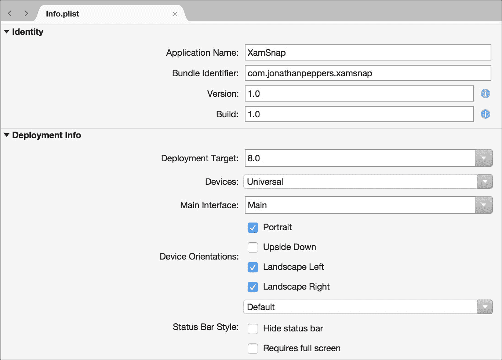

最重要的设置如下：

+   **应用名称**：这是 iOS 中应用图标下方的标题。请注意，这与你在 iOS 应用商店中的应用程序官方名称不同。

+   **包标识符**：这是你的应用程序的包标识符或包 ID。这是一个独特的名称，用于识别你的应用程序。约定是使用以你的公司名称开头的反向域名命名风格，如`com.jonathanpeppers.xamsnap`。

+   **版本**：这是你的应用程序的版本号，用户在应用商店中可见，如`1.0.0`。

+   **构建**：这是为开发者保留的版本号（例如 CI 构建等），如`1.0.0.1234`。

+   **设备**：在这里，你可以为你的应用程序选择**iPhone/iPod**、**iPad**或**通用**（所有设备）。

+   **部署目标**：这是你的应用程序运行的最低 iOS 版本。

+   **主界面**：这是你的应用的主故事板文件。

+   **设备方向**：这是你的应用程序能够旋转并支持的不同位置。

+   **状态栏样式**：这些选项可以隐藏应用程序中的顶部状态栏，并全屏运行。

还有其他关于应用图标、启动屏幕等的设置。你也可以在**高级**或**源**标签之间切换，以配置 Xamarin 没有提供友好菜单的其他设置。

为我们的应用程序配置以下设置：

+   **应用名称**：`XamSnap`

+   **包标识符**：`com.yourcompanyname.xamsnap`；确保你为未来应用命名时，它们以`com.yourcompanyname`开头。

+   **设备**：**iPhone/iPod**

+   **部署目标**：**8.0**

+   **支持的设备方向**：只选择**纵向**。

# Xamarin.iOS 构建选项

如果你右键点击你的项目并选择**选项**，你可以找到一些针对 Xamarin iOS 应用程序的附加设置，如下面的截图所示。了解在 Xamarin Studio 中为 iOS 特定项目提供了什么是一个好主意。这里有很多内容，但在大多数情况下，默认设置就足够了。

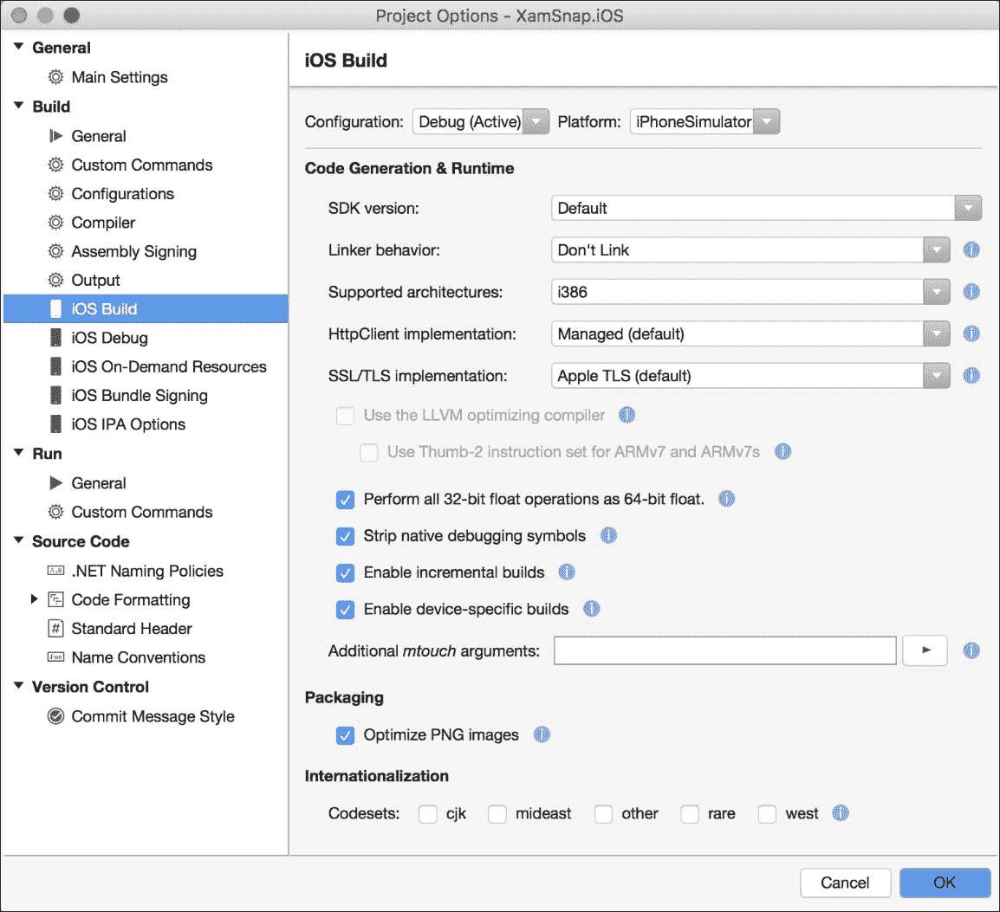

让我们讨论一些最重要的选项，如下：

**iOS 构建**

+   **SDK 版本**：这是用于编译应用程序的 iOS SDK 版本。通常最好使用**默认**版本。

+   **链接器行为**：Xamarin 实现了一个名为**链接**的功能。链接器将移除任何在你的程序集中永远不会调用的代码。这使你的应用程序保持小巧，并允许它们与你的应用程序一起发布核心 Mono 运行的简化版本。除了调试版本外，最好使用**仅链接 SDK 程序集**的选项。我们将在未来的章节中介绍链接。

+   **支持的架构**：这些是处理器的类型。`i386`是模拟器，`ARMv7 + ARM64`是针对现代 iOS 设备编译的选项。你通常应该能够在这里使用默认设置，除非升级较旧的 Xamarin.iOS 应用程序。

+   **HttpClient 实现**：新版本的 Xamarin.iOS 允许你为`System.Net.Http.HttpClient`选择本地 HTTP 栈。Mono 的实现是默认的，但性能不如本地栈。

+   **SSL/TLS 实现**：Xamarin.iOS 也有使用本地 API 进行 SSL 的选项。如果你选择使用 Mono，你的应用程序将只支持 TLS 1.0，因此最好在这里使用本地选项。

+   **使用 LLVM 优化编译器**：勾选此项将编译出体积更小、运行速度更快的代码，但编译时间会更长。**LLVM**代表**低级虚拟机**。

+   **去除本地调试符号**：当这个选项开启时，Xamarin 会从你的应用程序中移除额外的信息，这些信息可以从 Xamarin Studio 中进行调试。

+   **额外的 mtouch 参数**：此字段用于传递给 iOS 的 Xamarin 编译器额外的命令行参数。你可以查看这些参数的完整列表在[`developer.xamarin.com/api`](https://developer.xamarin.com/api)。

+   **针对 iOS 优化 PNG 文件**：苹果使用自定义的 PNG 格式来加速应用程序内 PNG 的加载。你可以关闭此选项来加快构建速度，或者如果你打算自己优化图像。

**iOS 打包签名**

+   **签名标识**：这是用于识别应用程序创建者并将应用程序部署到设备的证书。我们将在后面的章节中详细介绍这一点。

+   **配置文件**：这是一个特定的配置文件，用于将应用程序部署到设备上。它与**签名标识**协同工作，同时声明分发方法和可以安装应用程序的设备。

+   **自定义权利**：这个文件包含了与应用程序权利证明文件一起应用的附加设置，并包含了对应用程序的其他特定声明，比如 iCloud 或推送通知。iOS 应用程序的项目模板为新项目包含了一个默认的`Entitlements.plist`文件。

对于这个应用程序，你可以保留所有这些选项为默认值。在独自开发实际的 iOS 应用程序时，你应该根据应用程序的需求考虑更改这些设置。

# 使用`UINavigationController`。

在 iOS 应用程序中，管理不同控制器间导航的关键类是`UINavigationController`。它是一个父控制器，包含了一个栈中的多个子控制器。用户可以通过在栈顶放置新的控制器来前进，或者使用内置的后退按钮移除控制器并导航回上一个屏幕。

开发者可以使用以下方法操作导航控制器的栈：

+   `SetViewControllers`：这个方法设置一个子控制器数组。它有一个可选值用来动画过渡。

+   `ViewControllers`：这是一个属性，用于获取或设置子控制器数组，但不提供动画选项。

+   `PushViewController`：这个方法将一个新的子控制器放置在栈顶，并可以选择显示动画。

+   `PopViewController`：这个方法会移除栈顶的子控制器，并可以选择是否动画过渡。

+   `PopToViewController`：这个方法移除到指定的子控制器，移除其上的所有控制器。它提供了一个动画过渡的选项。

+   `PopToRootViewController`：这个方法移除除了最底部的控制器之外的所有子控制器。它包括一个显示动画的选项。

+   `TopViewController`：这是一个属性，返回当前位于栈顶的子控制器。

### 提示

需要注意的是，如果在动画过程中尝试修改栈，使用动画选项将会导致崩溃。要解决这个问题，可以选择使用`SetViewControllers`方法并设置整个子控制器列表，或者在组合过渡期间避免使用动画。

让我们通过执行以下步骤，在应用程序中设置导航控制器：

1.  双击`Main.storyboard`文件，在 Xamarin Studio 中打开它。

1.  移除由项目模板创建的控制器。

1.  从右侧的**工具箱**中拖动一个**导航控制器**元素到故事板中。

1.  注意，已经创建了一个默认的**视图控制器**元素以及一个**导航控制器**。

1.  你会看到一个连接两个控制器的**segue**。我们将在本章后面更详细地介绍这个概念。

1.  保存故事板文件。

### 提示

对于 Visual Studio 用户的一个小提示，Xamarin 已经很好地使他们的 Visual Studio 扩展与 Xamarin Studio 完全相同。本章中的所有示例都应如描述的那样在 Xamarin Studio on OS X 或 Windows 上的 Visual Studio 中工作。当然，远程连接的 mac 部署到模拟器或 iOS 设备是一个例外。

如果此时运行应用程序，你将得到一个基本的 iOS 应用，它有一个顶部的状态栏，一个包含默认标题的导航栏的导航控制器，以及一个完全白色的子控制器，如下面的截图所示：

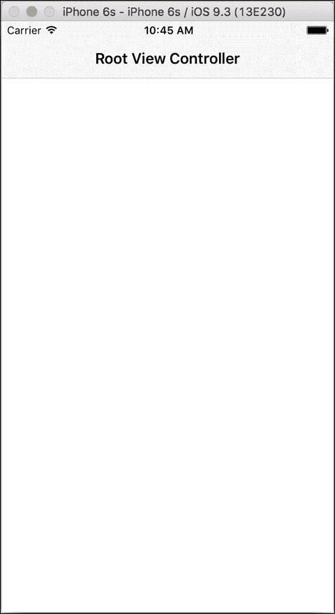

# 实现登录界面

由于我们应用程序的第一个屏幕将是登录屏幕，因此让我们从在故事板文件中设置适当的视图开始。我们将使用 Xamarin Studio 编写 C#代码实现登录屏幕，并使用其 iOS 设计师在故事板文件中创建 iOS 布局。

返回 Xamarin Studio 中的项目，并执行以下步骤：

1.  双击`Main.storyboard`文件，在 iOS 设计师中打开它。

1.  选择你的视图控制器，点击**属性**窗格并选择**小部件**标签页。

1.  在**类**字段中输入`LoginController`。

1.  注意到为你生成了`LoginController`类。如果你愿意，可以创建一个`Controllers`文件夹并将文件移到其中。

以下截图显示了在 Xamarin Studio 中进行更改后控制器设置的样子：

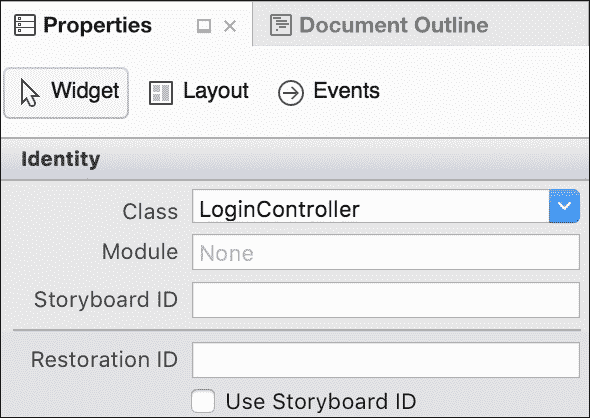

现在让我们通过执行以下步骤来修改控制器的布局：

1.  再次双击`Main.storyboard`文件返回到 iOS 设计师。

1.  点击导航栏并编辑**标题**字段，将其改为`Login`。

1.  将两个文本字段拖到控制器上。适当地为用户名和密码输入定位和调整它们的大小。你可能还想删除默认文本以使字段为空。

1.  对于第二个字段，勾选**安全文本输入**复选框。这将设置控件隐藏密码字段的字符。

1.  你可能还想为`Username`和`Password`填写**占位符**字段。

1.  将一个按钮拖到控制器上。将按钮的**标题**设置为`Login`。

1.  将一个活动指示器拖到控制器上。勾选**动画**和**隐藏**复选框。

1.  接下来，通过填写**名称**字段为每个控件创建出口。分别为这些出口命名为`username`、`password`、`login`和`indicator`。

1.  保存故事板文件，查看`LoginController.designer.cs`。

你会注意到 Xamarin Studio 已经为每个出口生成了属性：

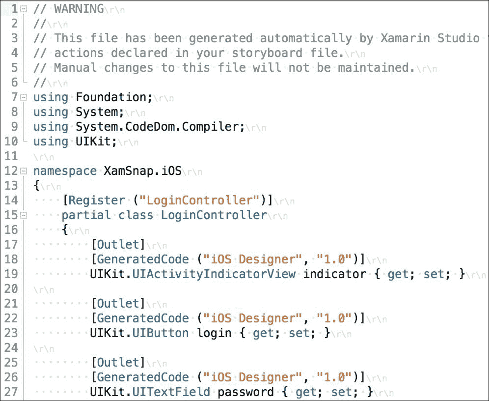

去编译应用程序，确保一切正常。在这一点上，我们还需要添加对前一章创建的`XamSnap.Core`项目的引用。

然后，让我们设置 iOS 应用程序以注册其所有视图模型以及其他将在整个应用程序中使用的服务。我们将使用在第四章，*XamSnap - 一个跨平台应用程序*中创建的`ServiceContainer`类来设置我们应用程序中的依赖关系。打开`AppDelegate.cs`并添加以下方法：

```kt
public override bool FinishedLaunching(
   UIApplication application,
   NSDictionary launchOptions) 
{ 
  //View Models 
  ServiceContainer.Register<LoginViewModel>(() =>
     new LoginViewModel()); 
  ServiceContainer.Register<FriendViewModel>(() =>
     new FriendViewModel()); 
  ServiceContainer.Register<RegisterViewModel>(() =>
     new RegisterViewModel()); 
  ServiceContainer.Register<MessageViewModel>(() =>
     new MessageViewModel()); 

  //Models 
  ServiceContainer.Register<ISettings>(() =>
     new FakeSettings()); 
  ServiceContainer.Register<IWebService>(() =>
     new FakeWebService()); 

  return true; 
} 

```

在后续操作中，我们将用真实的服务替换假服务。现在让我们在`LoginController.cs`中添加登录功能。首先在类顶部将`LoginViewModel`添加到成员变量中，如下所示：

```kt
readonly LoginViewModel loginViewModel =
   ServiceContainer.Resolve<LoginViewModel>(); 

```

这会将`LoginViewModel`的共享实例拉入控制器中的局部变量。这是我们将在整本书中使用的模式，以便将共享视图模型从一个类传递到另一个类。

接下来，重写`ViewDidLoad`以将视图模型的功能与在 outlets 中设置好的视图连接起来，如下所示：

```kt
public override void ViewDidLoad() 
{ 
  base.ViewDidLoad(); 

  login.TouchUpInside += async(sender, e) => 
  { 
    loginViewModel.UserName = username.Text; 
    loginViewModel.Password = password.Text; 

    try 
    { 
      await loginViewModel.Login(); 

      //TODO: navigate to a new screen 
    } 
    catch (Exception exc) 
    { 
      new UIAlertView("Oops!", exc.Message, null, "Ok").Show(); 
    } 
  }; 
} 

```

我们将在本章后面添加代码以导航到一个新屏幕。

接下来，让我们将`IsBusyChanged`事件实际连接起来以执行一个操作，如下所示：

```kt
public override void ViewWillAppear(bool animated) 
{ 
  base.ViewWillAppear(animated); 

  loginViewModel.IsBusyChanged += OnIsBusyChanged; 
} 

public override void ViewWillDisappear(bool animated) 
{ 
  base.ViewWillDisappear(animated); 

  loginViewModel.IsBusyChanged -= OnIsBusyChanged; 
} 

void OnIsBusyChanged(object sender, EventArgs e) 
{ 
  username.Enabled = 
    password.Enabled = 
    login.Enabled =  
    indicator.Hidden = !loginViewModel.IsBusy; 
} 

```

现在，你可能会问为什么我们要以这种方式订阅事件。问题是`LoginViewModel`类将贯穿应用程序的整个生命周期，而`LoginController`类则不会。如果我们只在`ViewDidLoad`中订阅事件，但稍后没有取消订阅，那么我们的应用程序将会有内存泄漏。我们还避免了使用 lambda 表达式作为事件，因为否则将无法取消订阅该事件。

请注意，我们不会遇到按钮上的`TouchUpInside`事件相同的问题，因为它将和控制器一样长时间存在于内存中。这是 C#中事件的一个常见问题，这就是为什么在 iOS 上使用前面的模式是一个好主意。

如果你现在运行应用程序，你应该能够输入用户名和密码，如下面的截图所示。按下**登录**后，你应该看到指示器出现，所有控件被禁用。你的应用程序将正确调用共享代码，并且在我们添加一个真实的网络服务时应该能正确运行。

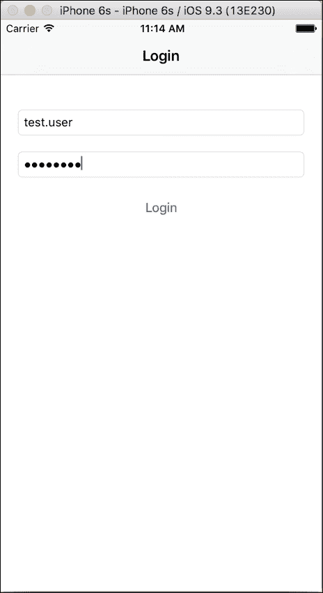

# 使用 segue 进行导航

Segue 是从一个控制器到另一个控制器的过渡。同样，一个故事板文件是连接在一起的控制器和它们的视图的集合，通过 segue 进行连接。这反过来又允许你同时查看每个控制器的布局和应用程序的一般流程。

有几种类型的 segue，如下所示：

+   **推送**：在导航控制器内使用。它将一个新的控制器推送到导航控制器堆栈的顶部。推送使用导航控制器的标准动画技术，通常是最常用的过渡方式。

+   **关系**：用于为另一个控制器设置子控制器。例如，导航控制器的根控制器，容器视图，或者在 iPad 应用程序中的分割视图控制器。

+   **模态**：使用此方式时，以模态方式呈现的控制器将出现在父控制器的顶部。它将覆盖整个屏幕，直到被关闭。有几种不同类型的过渡动画可供选择。

+   **自定义**：这是一种自定义的过渡，包括一个选项，用于自定义类，该类是`UIStoryboardSegue`的子类。这使你可以细致地控制动画以及下一个控制器的呈现方式。

过渡在执行时也遵循以下模式：

+   目的地控制器及其视图被创建。

+   创建一个`UIStoryboardSegue`的子类的过渡对象。这对于自定义过渡通常很重要。

+   在源控制器上调用`PrepareForSegue`方法。在过渡开始之前，这是一个运行任何自定义代码的好地方。

+   过渡的`Perform`方法被调用，过渡动画开始。这是自定义过渡的大部分代码所在的地方。

在 Xamarin.iOS 设计师中，你有从按钮或表格行自动触发过渡的选择，或者只是给过渡一个标识符。在第二种情况下，你可以通过使用其标识符在源控制器上调用`PerformSegue`方法来自己启动过渡。

现在让我们通过执行以下步骤设置一些`Main.storyboard`文件的方面，来设置一个新的过渡：

1.  双击`Main.storyboard`文件，在 iOS 设计师中打开它。

1.  向故事板中添加一个新的**表格视图控制器**。

1.  选择你的视图控制器，并导航到**属性**窗格和**小部件**标签。

1.  在**类**字段中输入`ConversationsController`。

1.  在**视图控制器**部分向下滚动，并输入一个**标题**为`Conversations`。

1.  通过按住**Ctrl**点击并从`LoginController`拖动蓝线到`ConversationsController`，创建一个过渡。

1.  从出现的弹出菜单中选择**显示**过渡。

1.  通过点击选择此过渡，并为其分配一个标识符`OnLogin`。

1.  保存故事板文件。

你的故事板将与下面截图所示的内容类似：

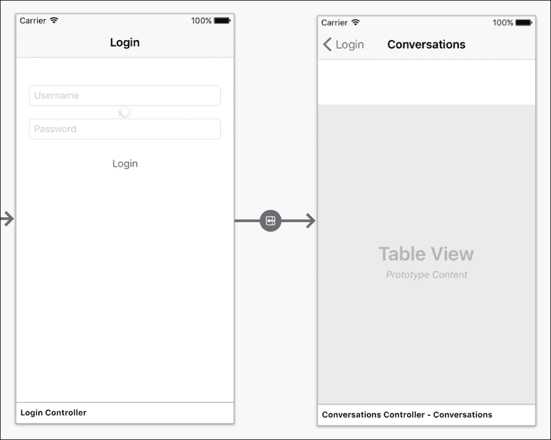

打开`LoginController.cs`文件，并按照本章早些时候标记为`TODO`的代码行进行修改，如下所示：

```kt
PerformSegue("OnLogin", this); 

```

现在如果你构建并运行应用程序，成功登录后你将导航到新的控制器。过渡将被执行，你将看到导航控制器提供的内置动画。

# 设置 UITableView

接下来，让我们在第二个控制器上设置表格视图。我们在 iOS 上使用了一个强大的类，叫做 `UITableView`。它被用在许多场景中，并且与其他平台上列表视图的概念非常相似。`UITableView` 类由另一个叫做 `UITableViewSource` 的类控制。它有你需要重写的方法，以设置应该存在多少行以及这些行应该如何在屏幕上显示。

### 提示

注意 `UITableViewSource` 是 `UITableViewDelegate` 和 `UITableViewDataSource` 的组合。出于简单考虑，我更喜欢使用 `UITableViewSource`，因为通常需要使用另外两个类。

在我们开始编码之前，让我们回顾一下在 `UITableViewSource` 上最常用的方法，如下：

+   `RowsInSection`：这个方法允许你定义一个部分中的行数。所有表格视图都有多个部分和行。默认情况下，只有一个部分；然而，需要返回一个部分中的行数。

+   `NumberOfSections`：这是表格视图中的部分数。

+   `GetCell`：这个方法必须为每一行返回一个单元格。开发者需要决定单元格的外观；你可以设置表格视图来回收单元格。回收单元格可以在滚动时提供更好的性能。

+   `TitleForHeader`：如果重写这个方法，它是最简单的返回标题字符串的方式。表格视图中的每个部分默认都可以有一个标准的头部视图。

+   `RowSelected`：当用户选择一行时，将调用此方法。

还有其他可以重写的方法，但大多数情况下这些方法就足够了。如果需要开发具有自定义样式的表格视图，你还可以设置自定义的头部和底部。

现在，让我们打开 `ConversationsController.cs` 文件，并在 `ConversationsController` 内部创建一个嵌套类，如下：

```kt
class TableSource : UITableViewSource 
{ 
  const string CellName = "ConversationCell"; 
  readonly MessageViewModel messageViewModel =
     ServiceContainer.Resolve<MessageViewModel>(); 

  public override nint RowsInSection(
     UITableView tableview, nint section) 
  { 
    return messageViewModel.Conversations == null ?
       0 : messageViewModel.Conversations.Length; 
  } 

  public override UITableViewCell GetCell(
     UITableView tableView, NSIndexPath indexPath) 
  { 
    var conversation =
       messageViewModel.Conversations[indexPath.Row]; 
    var cell = tableView.DequeueReusableCell(CellName); 
    if (cell == null) 
    { 
      cell = new UITableViewCell(
         UITableViewCellStyle.Default, CellName); 
      cell.Accessory =
         UITableViewCellAccessory.DisclosureIndicator; 
    } 
    cell.TextLabel.Text = conversation.UserName; 
    return cell; 
  } 
} 

```

我们实现了设置表格视图所需的两个方法：`RowsInSection` 和 `GetCell`。我们返回了视图模型中找到的对话数量，并为每一行设置了我们的单元格。我们还使用了 `UITableViewCellAccessory.DisclosureIndicator`，以便用户可以看到他们可以点击行。

注意我们实现的单元格回收。使用单元格标识符调用 `DequeueReusableCell` 会在第一次返回一个 `null` 单元格。如果为 `null`，你应该使用相同的单元格标识符创建一个新的单元格。后续调用 `DequeueReusableCell` 将返回一个现有的单元格，使你能够复用它。你也可以在故事板文件中定义 `TableView` 单元格，这对于自定义单元格很有用。我们的单元格这里非常简单，所以从代码中定义它更容易。在移动平台上回收单元格对于节省内存和为用户提供流畅的滚动表格非常重要。

接下来，我们需要在 `TableView` 上设置 `TableView` 的数据源。对我们的 `ConversationsController` 类进行以下一些更改：

```kt
readonly MessageViewModel messageViewModel = 
  ServiceContainer.Resolve<MessageViewModel>(); 

public override void ViewDidLoad() 
{ 
  base.ViewDidLoad(); 

  TableView.Source = new TableSource(); 
} 

public async override void ViewWillAppear(bool animated) 
{ 
  base.ViewWillAppear(animated); 

  try 
  { 
    await messageViewModel.GetConversations(); 

    TableView.ReloadData(); 
  } 
  catch(Exception exc) 
  { 
    new UIAlertView("Oops!", exc.Message, null, "Ok").Show(); 
  } 
} 

```

因此，当视图出现时，我们将加载我们的对话列表。在完成该任务后，我们将重新加载表格视图，使其显示我们的对话列表。如果你运行应用程序，你会在登录后看到表格视图中出现一些对话，如下面的截图所示。以后当我们从真正的网络服务加载对话时，一切都会以同样的方式运行。

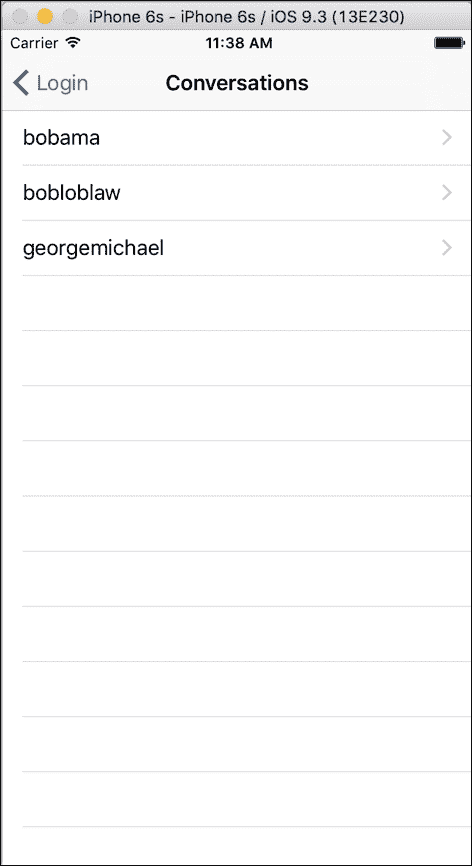

# 添加好友列表屏幕

我们 XamSnap 应用程序下一个需要的屏幕是我们的好友列表。当创建新对话时，应用程序将加载好友列表以开始对话。我们将遵循一个非常相似的模式来加载我们的对话列表。

首先，我们将通过以下步骤创建一个`UIBarButtonItem`，它导航到一个名为`FriendsController`的新控制器：

1.  双击`Main.storyboard`文件，在 iOS 设计师中打开它。

1.  向故事板中添加一个新的**表格视图控制器**。

1.  选择你的视图控制器，点击**属性**窗格，确保你选择了**控件**标签页。

1.  在**类**字段中输入`FriendsController`。

1.  滚动到**视图控制器**部分，在**标题**字段中输入`Friends`。

1.  从**工具箱**中拖动一个**导航项**到`ConversationsController`上。

1.  创建一个新的**工具栏按钮**元素，并将其放置在新导航栏的右上角。

1.  在工具栏按钮的**属性**窗格中，将其**标识符**设置为**添加**。这将使用内置的加号按钮，这在 iOS 应用程序中是常用的。

1.  通过按住**Ctrl**键，并将蓝色线条从工具栏按钮拖动到下一个控制器，创建一个从**工具栏按钮**到`FriendsController`的 segue。

1.  从弹出的菜单中选择**显示**segue。

1.  保存故事板文件。

你对故事板的更改应该与以下截图所示类似：

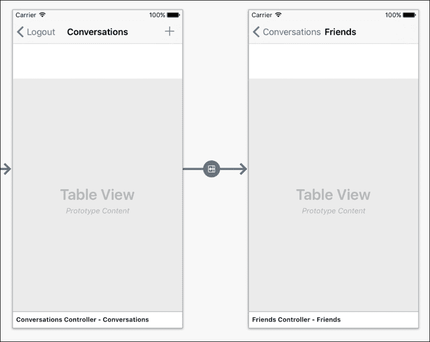

你应该会看到一个名为`FriendsController`的新类，这是 Xamarin Studio 为你生成的。如果你编译并运行应用程序，你会看到我们创建的新工具栏按钮。点击它将导航到新的控制器。

现在，让我们实现`UITableViewSource`来展示我们的好友列表。首先在`FriendsController`内部创建一个新的嵌套类，如下所示：

```kt
class TableSource : UITableViewSource 
{ 
  const string CellName = "FriendCell"; 
  readonly FriendViewModel friendViewModel =
     ServiceContainer.Resolve<FriendViewModel>(); 

  public override nint RowsInSection(
     UITableView tableview, nint section) 
  { 
    return friendViewModel.Friends == null ?
       0 : friendViewModel.Friends.Length; 
  } 

  public override UITableViewCell GetCell(
     UITableView tableView, NSIndexPath indexPath) 
  { 
    var friend =
       friendViewModel.Friends[indexPath.Row]; 
    var cell = tableView.DequeueReusableCell(CellName); 
    if (cell == null) 
    { 
      cell = new UITableViewCell(
         UITableViewCellStyle.Default, CellName); 
      cell.AccessoryView =
         UIButton.FromType(UIButtonType.ContactAdd); 
      cell.AccessoryView.UserInteractionEnabled = false; 
    } 
    cell.TextLabel.Text = friend.Name; 
    return cell; 
  } 
} 

```

正如之前所做，我们实现了表格单元格的回收利用，并为每个好友的标签设置了文本。我们使用`cell.AccessoryView`来提示用户每个单元格都是可点击的，并开始新的对话。我们在按钮上禁用了用户交互，以便当用户点击按钮时，可以选中行。否则，我们就必须为按钮实现一个点击事件。

接下来，我们将按照对话的方式修改`FriendsController`，如下所示：

```kt
readonly FriendViewModel friendViewModel =
   ServiceContainer.Resolve<FriendViewModel>(); 

public override void ViewDidLoad() 
{ 
  base.ViewDidLoad(); 

  TableView.Source = new TableSource(); 
} 

public async override void ViewWillAppear(bool animated) 
{ 
  base.ViewWillAppear(animated); 

  try 
  { 
    await friendViewModel.GetFriends(); 

    TableView.ReloadData(); 
  } 
  catch(Exception exc) 
  { 
    new UIAlertView("Oops!", exc.Message, null, "Ok").Show(); 
  } 
} 

```

这将和对话列表完全一样：控制器将异步加载朋友列表并刷新表格视图。如果你编译并运行应用程序，你将能够导航到屏幕并查看我们在第四章，*XamSnap - 跨平台应用程序*中创建的示例朋友列表，如下截图所示：

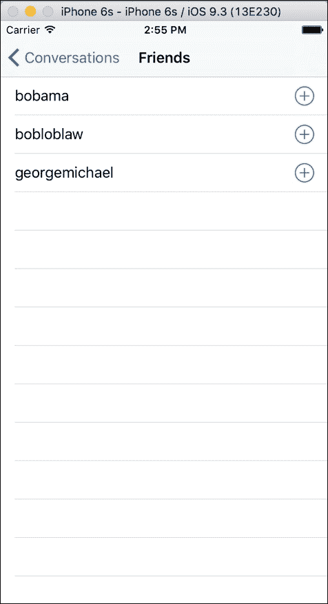

# 添加消息列表

现在我们来实现查看对话或消息列表的屏幕。我们将尝试模仿 iOS 内置的短信应用程序的屏幕。为此，我们还将介绍如何创建自定义表格视图单元格的基础知识。

首先，我们需要一个新的`MessagesController`类；执行以下步骤：

1.  双击`Main.storyboard`文件，在 iOS 设计师中打开它。

1.  向故事板中添加一个新的**表格视图控制器**。

1.  选择你的视图控制器，点击**属性**窗格，确保你选择了**小部件**标签。

1.  在**类**字段中输入`MessagesController`。

1.  滚动到**视图控制器**部分，在**标题**字段中输入`Messages`。

1.  通过按住***Ctrl***并将蓝色线条从`ConversationsController`拖到`MessagesController`，创建一个 segue。

1.  从弹出的菜单中选择**显示**segue。在**属性**窗格中输入**标识符** `OnConversation`。

1.  现在在`MessagesController`中的表格视图中创建两个**表格视图单元格**。你可以重复使用默认创建的现有空白单元格。

1.  将每个单元格的**样式**字段更改为**Basic**。

1.  分别为每个单元格将**标识符**设置为`MyCell`和`TheirCell`。

1.  保存故事板文件。

Xamarin Studio 将生成`MessagesController.cs`。和之前一样，你可以将控制器移动到`Controllers`文件夹中。现在打开`MessagesController.cs`，并在嵌套类中实现`UITableViewSource`，如下所示：

```kt
class TableSource : UITableViewSource
{
  const string MyCellName = "MyCell";
  const string TheirCellName = "TheirCell";
  readonly MessageViewModel messageViewModel =
    ServiceContainer.Resolve();
  readonly ISettings settings = ServiceContainer.Resolve();

  public override nint RowsInSection(
    UITableView tableview, nint section)
  {
    return messageViewModel.Messages == null ? 0 :
      messageViewModel.Messages.Length;
  }

  public override UITableViewCell GetCell(
    UITableView tableView, NSIndexPath indexPath)
  {
    var message = messageViewModel.Messages [indexPath.Row];
    bool isMyMessage = message.UserName == settings.User.Name;
    var cell = (BaseMessageCell)tableView.DequeueReusableCell(
      isMyMessage ? MyCellName : TheirCellName);
    cell.TextLabel.Text = message.Text;
    return cell;
  }
}

```

我们添加了一些逻辑，以检查消息是否来自当前用户，以决定适当的表格单元格标识符。由于我们为两个单元格都使用了**Basic**样式，我们可以使用单元格上的`TextLabel`属性来设置`UILabel`的文本。

现在我们对`MessagesController`进行必要的更改，如下所示：

```kt
readonly MessageViewModel messageViewModel = 
  ServiceContainer.Resolve<MessageViewModel>(); 

public override void ViewDidLoad() 
{ 
  base.ViewDidLoad(); 

  TableView.Source = new TableSource(); 
} 

public async override void ViewWillAppear(bool animated) 
{ 
  base.ViewWillAppear(animated); 

  Title = messageViewModel.Conversation.UserName; 
  try 
  { 
    await messageViewModel.GetMessages(); 
    TableView.ReloadData(); 
  } 
  catch (Exception exc) 
  { 
    new UIAlertView("Oops!", exc.Message, null, "Ok").Show(); 
  } 
} 

```

这里的唯一新事物是我们将`Title`属性设置为对话的用户名。

为了完成我们的自定义单元格，我们还需要在 Xcode 中进行以下步骤进行更多更改：

1.  双击`Main.storyboard`文件，在 iOS 设计师中打开它。

1.  通过点击默认文本**Title**，选择一个**标签**。

1.  创造性地为两个标签设置样式。我选择使`MyCell`中的文本为蓝色，`TheirCell`为绿色。我将`TheirCell`中的标签**对齐**设置为右对齐。

1.  保存故事板文件并返回。

接下来，我们需要更新`ConversationsController`以导航到这个新屏幕。让我们修改`ConversationsController.cs`中的`TableSource`类，如下所示：

```kt
readonly ConversationsController controller; 

public TableSource(ConversationsController controller) 
{ 
  this.controller = controller;
}

public override void RowSelected(
  UITableView tableView, NSIndexPath indexPath)
{ 
  var conversation = messageViewModel.Conversations[indexPath.Row]; 
  messageViewModel.Conversation = conversation; 
  controller.PerformSegue("OnConversation", this); 
}

```

当然，你还需要在控制器中的`ViewDidLoad`修改一行小代码：

```kt
TableView.Source = new TableSource(this); 

```

如果你现在运行应用程序，你将能够看到如下截图所示的消息列表：

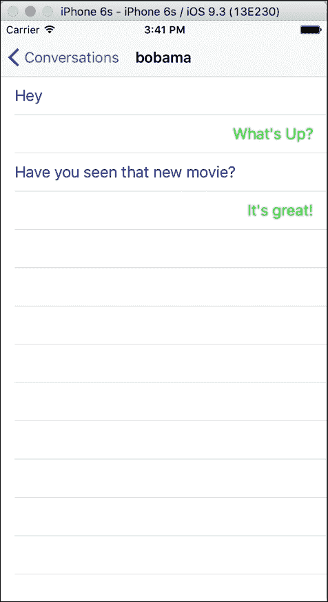

# 编写消息

为了我们应用程序的最后一块，我们需要实现一些苹果公司 API 不提供的自定义功能。我们需要添加一个带有按钮的文本字段，使其看起来附着在表格视图的底部。其中大部分工作需要编写一些简单的 C#代码并连接事件。

首先，我们在`MessagesController`类中添加一些新的成员变量，如下所示：

```kt
UIToolbar toolbar; 
UITextField message; 
UIBarButtonItem send; 

```

我们将在工具栏中放置文本字段和工具栏按钮，如下面的`ViewDidLoad`中的代码所示：

```kt
public override void ViewDidLoad() 
{ 
  base.ViewDidLoad(); 

  //Text Field 
  message = new UITextField( 
    new CGRect(0, 0, TableView.Frame.Width - 88, 32)) 
  { 
    BorderStyle = UITextBorderStyle.RoundedRect, 
    ReturnKeyType = UIReturnKeyType.Send, 
    ShouldReturn = _ => 
    { 
        Send(); 
        return false; 
    }, 
  }; 

  //Bar button item 
  send = new UIBarButtonItem("Send", UIBarButtonItemStyle.Plain, 
    (sender, e) => Send()); 

  //Toolbar 
  toolbar = new UIToolbar( 
    new CGRect(0, TableView.Frame.Height - 44,  
      TableView.Frame.Width, 44)); 
  toolbar.Items = new[] 
  { 
    new UIBarButtonItem(message), 
    send 
  }; 

  TableView.Source = new TableSource(); 
  TableView.TableFooterView = toolbar; 
} 

```

这项工作大部分是基本的 UI 设置。这不是我们在 Xcode 中能做的事情，因为这是一个非常特定的用例。我们从 C#创建文本字段、工具栏按钮项，并将它们作为`UITableView`的页脚添加。这将使工具栏显示在我们之前定义的任何行下面的表格视图底部。

现在，我们需要按照以下方式修改`ViewWillAppear`：

```kt
public async override void ViewWillAppear(bool animated) 
{ 
  base.ViewWillAppear(animated); 

  Title = messageViewModel.Conversation.Username; 

  messageViewModel.IsBusyChanged += OnIsBusyChanged; 

  try 
  { 
    await messageViewModel.GetMessages(); 
    TableView.ReloadData(); 
    message.BecomeFirstResponder(); 
  } 
  catch (Exception exc) 
  { 
    new UIAlertView("Oops!", exc.Message, null, "Ok").Show(); 
  } 
} 

```

我们需要订阅`IsBusyChanged`以显示和隐藏加载指示器。同时我们调用`BecomeFirstResponder`，这样键盘就会出现并将焦点给予我们的文本字段。

接下来，我们为`ViewWillDisapper`添加一个重写方法，以清理事件，如下所示：

```kt
public override void ViewWillDisappear(bool animated) 
{ 
  base.ViewWillDisappear(animated); 

  messageViewModel.IsBusyChanged -= OnIsBusyChanged; 
} 

```

然后，让我们为`IsBusyChanged`设置方法，如下所示：

```kt
void OnIsBusyChanged (object sender, EventArgs e) 
{ 
  message.Enabled = send.Enabled = !messageViewModel.IsBusy; 
} 

```

`OnIsBusyChanged`用于在加载时禁用我们的一些视图。

最后但并非最不重要的是，我们需要实现一个发送新消息的函数，如下所示：

```kt
async void Send() 
{ 
  //Just hide the keyboard if they didn't type anything 
  if (string.IsNullOrEmpty(message.Text)) 
  { 
    message.ResignFirstResponder(); 
    return; 
  } 

  //Set the text, send the message 
  messageViewModel.Text = message.Text; 
  await messageViewModel.SendMessage(); 

  //Clear the text field & view model 
  message.Text = messageViewModel.Text = string.Empty; 

  //Reload the table 
  TableView.InsertRows(new[]  
  {  
    NSIndexPath.FromRowSection( 
      messageViewModel.Messages.Length - 1, 0)  
  }, UITableViewRowAnimation.Automatic); 
} 

```

这段代码同样直接明了。发送消息后，我们只需清空文本字段并告诉表格视图重新加载新添加的行，如下面的截图所示。使用`async`关键字使这变得简单。

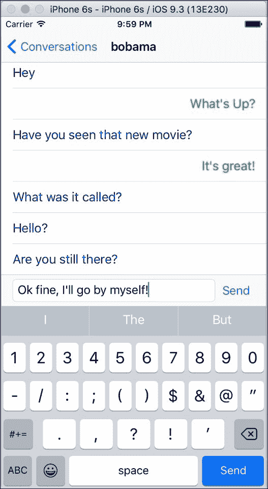

# 概要

在本章中，我们介绍了苹果和 Xamarin 为开发 iOS 应用程序提供的基本设置。这包括`Info.plist`文件和 Xamarin Studio 中的项目选项。我们涵盖了`UINavigationController`，这是 iOS 应用程序导航的基本构建块，并实现了一个带有用户名和密码字段的登录屏幕。接下来，我们介绍了 iOS 的 segue 和`UITableView`类。我们使用`UITableView`实现了好友列表屏幕，以及消息列表屏幕。最后，我们添加了一个自定义 UI 功能：在消息列表底部的自定义工具栏。

完成本章节后，你将拥有一个部分功能性的 XamSnap 的 iOS 版本。你将对 iOS 平台和工具有一个更深入的理解，并且拥有足够的知识去开发你自己的 iOS 应用程序。请自行实现本章未涵盖的其余屏幕。如果你感到困惑，可以随时回顾本书附带的完整示例应用程序。

在下一章中，我们将实现在 Android 上的这些用户界面。
