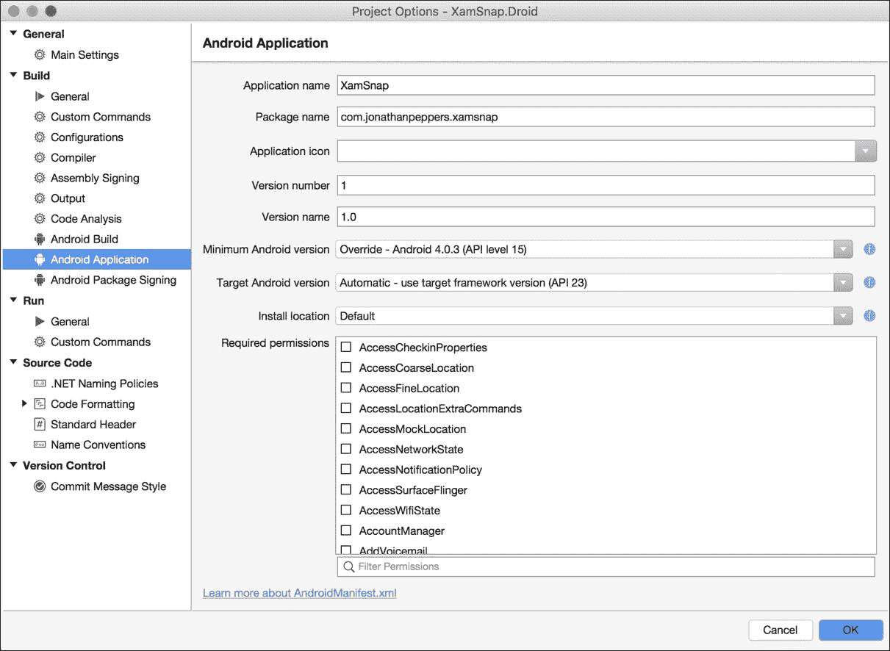
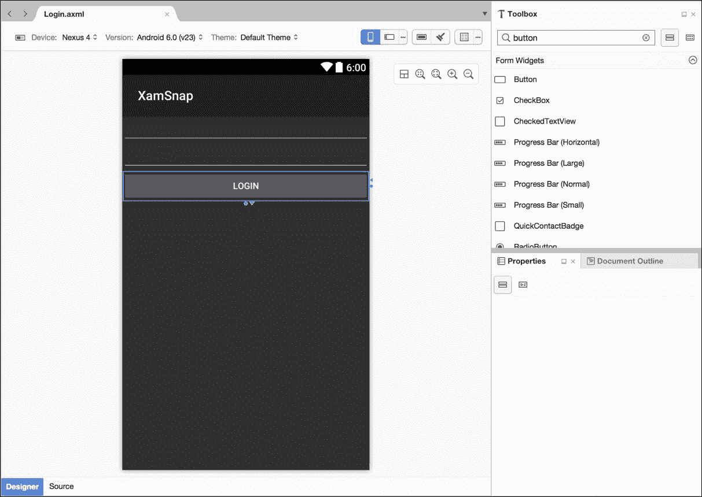
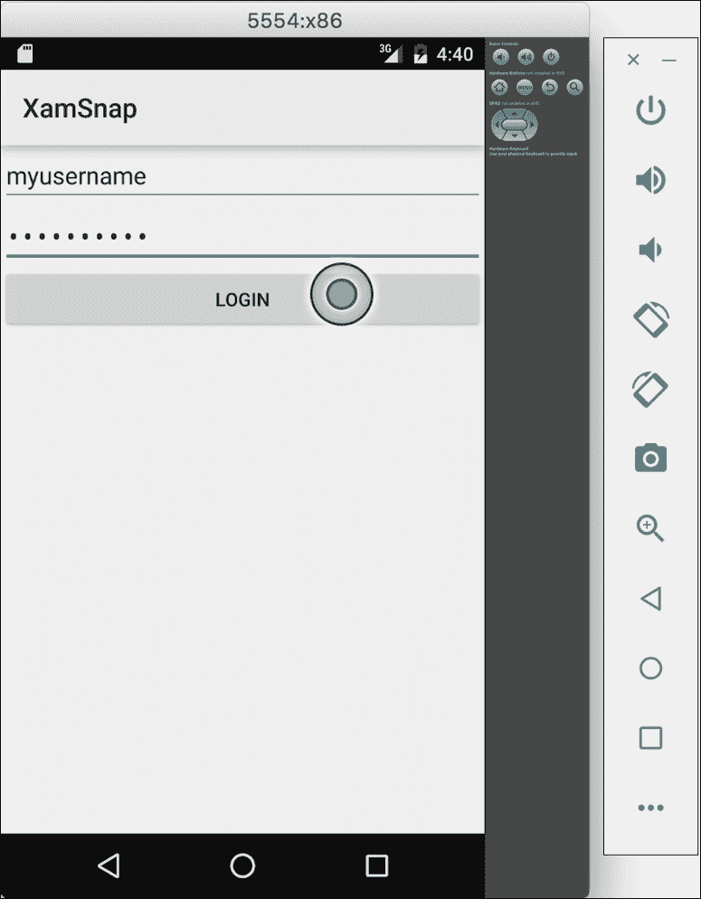
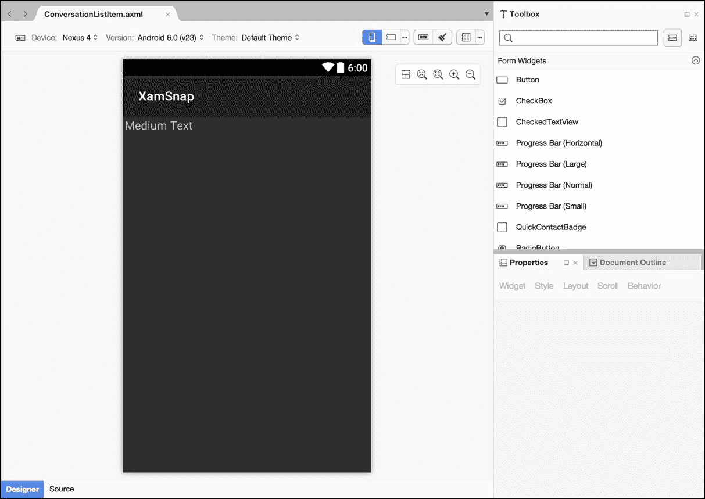
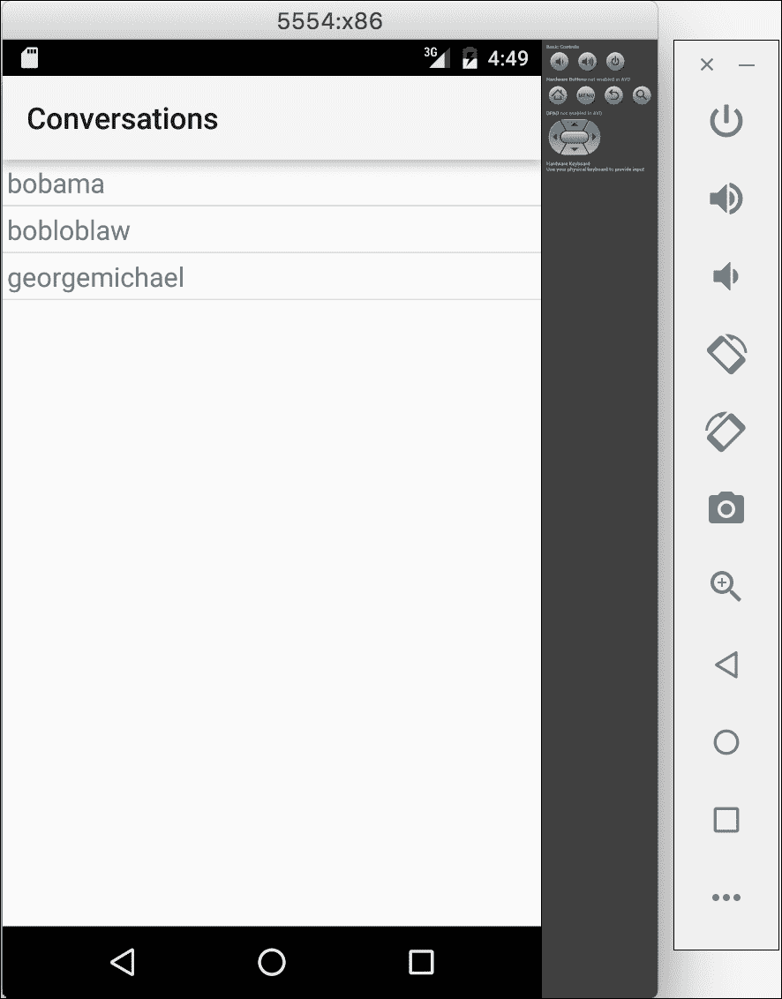
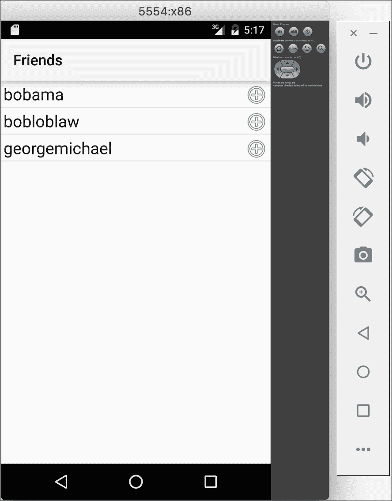
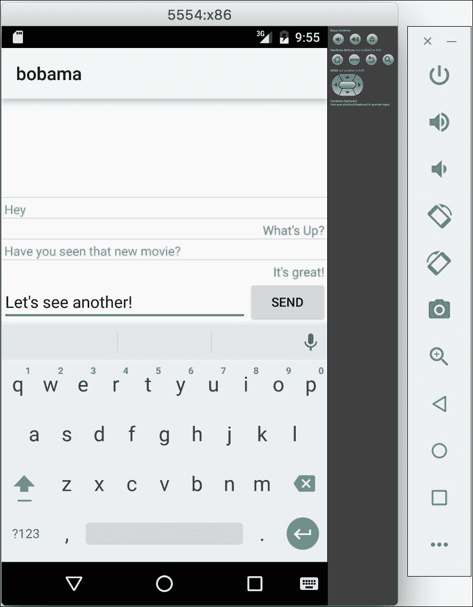

# 第六章：XamSnap for Android

要开始编写 XamSnap 的 Android 版本，请打开前两章的解决方案。我们将要在 `XamSnap.Droid` 项目中工作，该项目应该已经从 Xamarin 项目模板中设置好了。

在本章中，我们将涵盖：

+   Android 清单文件

+   Android 材料设计

+   为 XamSnap 编写登录界面

+   Android 的 ListView 和 BaseAdapter

+   添加好友列表

+   添加消息列表

# 介绍 Android 清单文件

所有 Android 应用程序都有一个名为 Android Manifest 的 XML 文件，它声明了关于应用程序的基本信息，文件名为 `AndroidManifest.xml`。这非常类似于 iOS 上的 `Info.plist` 文件，但 Xamarin 还提供了 C# 类属性，用于在 Android 清单中放置常见设置。在 **项目选项 | Android 应用程序** 下还有一个很好的 UI 用于编辑清单文件。

最重要的设置，如下截图所示，如下：

+   **应用程序名称**：这是你的应用程序的标题，显示在图标下方。它与在 Google Play 上选择的名称不同。

+   **包名**：这就像 iOS 上的应用程序捆绑标识符。这是一个唯一的名字来标识你的应用程序。约定是使用以你的公司名称开头的反向域名风格；例如，`com.jonathanpeppers.xamsnap`。它必须以小写字母开头并至少包含一个字符。

+   **应用程序图标**：这是你的应用程序在 Android 主屏幕上显示的图标。

+   **版本号**：这是一个数字，表示你的应用程序的版本。提高这个数字表示在 Google Play 上有更新的版本。

+   **版本名称**：这是你应用程序的用户友好版本字符串；例如，**1.0.0**。

+   **最低支持的 Android 版本**：这是你的应用程序支持的最低版本的 Android。

+   **目标 Android 版本**：这是你的应用程序编译时使用的 Android SDK 的版本。使用更高的版本号可以让你访问新的 API；然而，你可能需要进行一些运行时检查，以免在旧设备上调用这些 API。

+   **安装位置**：这定义了你的 Android 应用程序可以安装的不同位置：自动（用户设置）、外部（SD 卡）或内部（设备内部存储）。



除了这些设置，还有一组名为**所需权限**的复选框。这些将在用户在 Google Play 安装应用程序之前向用户展示。这是 Android 强制实施安全级别的方式，让用户可以看到应用程序将对设备进行哪些更改的访问权限。

以下是一些常用的清单文件权限：

+   **Camera**：这提供了对设备相机的访问权限

+   **互联网**：这提供了通过互联网进行网络请求的访问权限

+   **ReadContacts**：这提供了读取设备联系人库的访问权限

+   **ReadExternalStorage**：这提供了读取 SD 卡的权限

+   **WriteContacts**：这提供了修改设备联系人库的权限

+   **WriteExternalStorage**：这提供了向 SD 卡写入的权限

除了这些设置之外，很多时候还需要手动更改 Android Manifest。在这种情况下，你可以在 Xamarin Studio 中像编辑标准的 XML 文件一样编辑清单文件。有关有效的 XML 元素和属性完整列表，请访问[`developer.android.com/guide/topics/manifest/manifest-intro.html`](http://developer.android.com/guide/topics/manifest/manifest-intro.html)。

现在，让我们为我们的应用程序填写以下设置：

+   **应用程序名称**：`XamSnap`

+   **包名称**：`com.yourcompanyname.xamsnap`；确保将来命名的应用程序以`com.yourcompanyname`开头

+   **版本号**：从数字`1`开始

+   **版本**：可以是任何字符串，但建议使用类似版本号的字符串

+   **最低 Android 版本**：选择**Android 4.0.3 (API Level 15)**

+   **所需权限**：选择**Internet**；我们稍后会用到它

在这一点上，请注意我们的 Android 项目已经引用了来自便携式类库的共享代码。展开项目的**引用**文件夹，注意对`XamSnap.Core`项目的引用。我们将能够访问在第四章*XamSnap - A Cross-Platform App*中编写的所有共享代码。

前往`Resources`目录，在`values`文件夹中打开`Strings.xml`；这是你整个 Android 应用中应存储所有文本的地方。这是 Android 的一个约定，它将使你非常容易地为应用程序添加多种语言。让我们将我们的字符串更改为以下内容：

```kt
<?xml version="1.0" encoding="utf-8"?> 
<resources> 
    <string name="ApplicationName">XamSnap</string> 
    <string name="ErrorTitle">Oops!</string> 
    <string name="Loading">Loading</string> 
    <string name="Login">Login</string> 
</resources> 

```

我们将在本章后面使用这些值；在需要向用户显示文本的情况下，可以自由添加新的值。

# 设置 Material Design

从 Android 5.0 Lollipop 开始，谷歌发布了一个名为**Material Design**的新主题和颜色调色板，用于 Android 应用程序。对于新应用来说，采用 Material Design 是一个好主意，因为它可以让你轻松设置现代 Android 的外观。有关 Material Design 的更多信息，请查看谷歌的文档：[`developer.android.com/design/material/index.html`](https://developer.android.com/design/material/index.html)。

为了让 Material Design（和其他新的 Android 功能）更容易被采用，谷歌还发布了一个名为**AppCompat**的 Android 库，因此你可以支持在较旧的 Android OS 版本上的这些新功能。Xamarin 在 NuGet 上支持 AppCompat 库的一个版本，以便于 Xamarin.Android 应用程序轻松设置。

要设置 Android 支持库，请按照以下步骤操作：

1.  右键点击**包**并选择**添加包**。

1.  搜索`Xamarin.Android.Support.v7.AppCompat`。

1.  点击**添加包**。

1.  NuGet 将下载库及其依赖项，并在你的 Android 项目中引用它们。

现在让我们实现我们的主应用程序类；从**新建文件**对话框中添加一个新的**Activity**。在这个文件中，我们不会继承`Activity`，但这个模板在文件顶部添加了几个 Android `using`语句，导入可以在代码中使用的 Android API。创建一个新的`Application`类，我们可以在其中注册`ServiceContainer`中的所有内容，如下所示：

```kt
[Application(Theme = "@style/Theme.AppCompat.Light")] 
public class Application : Android.App.Application 
{ 
  public Application(
     IntPtr javaReference, JniHandleOwnership transfer)
     : base(javaReference, transfer) 
  {  
  } 

  public override void OnCreate() 
  { 
    base.OnCreate(); 

```

```kt
    //ViewModels 
    ServiceContainer.Register<LoginViewModel>(
       () => new LoginViewModel()); 
    ServiceContainer.Register<FriendViewModel>(
       () => new FriendViewModel()); 
    ServiceContainer.Register<MessageViewModel>(
       () => new MessageViewModel()); 
    ServiceContainer.Register<RegisterViewModel>(
       () => new RegisterViewModel()); 

    //Models 
    ServiceContainer.Register<ISettings>(
       () => new FakeSettings()); 
    ServiceContainer.Register<IWebService>(
       () => new FakeWebService()); 
  } 
} 

```

我们使用了内置的 Android 主题`Theme.AppCompat.Light`，这是材料设计的默认浅色主题。注意我们必须遵循的奇怪构造函数，这是 Xamarin 中自定义`Application`类的当前要求。你可以将这识别为在这种情况下需要添加的样板代码。

现在让我们为应用程序中的所有活动实现一个简单的基类。在`XamSnap.Droid`项目中创建一个`Activities`文件夹，并添加一个名为`BaseActivity.cs`的新文件，内容如下：

```kt
[Activity] 
public class BaseActivity<TViewModel> : AppCompatActivity
   where TViewModel : BaseViewModel 
{ 
  protected readonly TViewModel viewModel; 
  protected ProgressDialog progress; 

  public BaseActivity() 
  { 
    viewModel = ServiceContainer.Resolve(typeof(TViewModel)) as
       TViewModel; 
  } 
  protected override void OnCreate(Bundle savedInstanceState) 
  { 
    base.OnCreate(savedInstanceState); 

    progress = new ProgressDialog(this); 
    progress.SetCancelable(false);
    progress.SetTitle(Resource.String.Loading);
  } 

  protected override void OnResume() 
  { 
    base.OnResume(); 
    viewModel.IsBusyChanged += OnIsBusyChanged; 
  }

  protected override void OnPause() 
  { 
    base.OnPause(); 
    viewModel.IsBusyChanged -= OnIsBusyChanged; 
  } 

  void OnIsBusyChanged (object sender, EventArgs e) 
  { 
    if (viewModel.IsBusy) 
      progress.Show(); 
    else 
      progress.Hide(); 
  } 
} 

```

我们在这里做了几件事来简化我们其他活动的开发。首先，我们使这个类通用，并定义了一个受保护的变量`viewModel`来存储特定类型的视图模型。请注意，由于平台限制，我们在 iOS 上没有对控制器使用泛型（更多信息请参见 Xamarin 的文档网站：[`developer.xamarin.com/guides/ios/advanced_topics/limitations/`](http://developer.xamarin.com/guides/ios/advanced_topics/limitations/)）。我们还实现了`IsBusyChanged`，并显示了一个简单的`ProgressDialog`，其中包含来自`Strings.xml`文件的`Loading`字符串，以指示网络活动。

让我们为用户显示错误再添加一个方法，如下所示：

```kt
protected void DisplayError(Exception exc) 
{ 
  string error = exc.Message; 
  new AlertDialog.Builder(this)
     .SetTitle(Resource.String.ErrorTitle)
     .SetMessage(error)
     .SetPositiveButton(Android.Resource.String.Ok,
       (IDialogInterfaceOnClickListener)null)
     .Show(); 
} 

```

这个方法将显示一个弹出对话框，指示出现了错误。注意我们也使用了`ErrorTitle`和内置的 Android 资源中的`Ok`字符串。

这将完成我们 Android 应用程序的核心设置。从这里我们可以继续实现我们应用程序中各个屏幕的用户界面。

# 添加登录界面

在创建 Android 视图之前，了解 Android 中可用的不同布局或视图组类型是很重要的。iOS 没有一些这些的等价物，因为 iOS 在其设备上的屏幕尺寸变化较小。由于 Android 具有几乎无限的屏幕尺寸和密度，Android SDK 为视图的自动调整大小和布局提供了大量内置支持。

以下是常见的布局类型：

+   `ViewGroup`：这是包含子视图集合的视图的基础类。通常你不会直接使用这个类。

+   `LinearLayout`：这是一个布局，它将子视图排列成行或列（但不能同时排列）。你还可以为每个子项设置权重，让它们占据可用空间的不同百分比。

+   `RelativeLayout`：这是一个可以更灵活地设置其子项位置的布局。你可以将子视图相对于彼此定位，使它们相互在上方、下方、左侧或右侧。

+   `FrameLayout`：这个布局将它的子视图直接在屏幕上的**z 顺序**一个叠一个。当你有一个需要其他视图覆盖其上并可能停靠在一侧的大子视图时，最好使用这个布局。

+   `ListView`：这会在列表中垂直显示视图，借助确定子视图数量的适配器类。它还支持其子项被选中。

+   `GridView`：这会在网格中以行和列显示视图。它还需要使用适配器类来提供子项的数量。

在我们开始编写登录界面之前，删除从 Android 项目模板创建的`Main.axml`和`MainActivity.cs`文件。接下来，在项目的`Resources`目录下的`layout`文件夹中创建一个名为`Login.axml`的 Android 布局文件。

现在我们可以开始向我们的 Android 布局添加功能，如下所示：

1.  双击新的布局文件以打开 Android 设计器。

1.  将两个**纯文本**视图拖到**文本字段**部分找到的布局中。

1.  在**Id**字段中，分别输入`@+id/username`和`@+id/password`。

1.  对于密码字段，将其**输入类型**属性设置为`textPassword`。

1.  将一个**按钮**拖到布局上，并将其**文本**属性设置为`@string/Login`。

1.  将按钮的**Id**属性设置为`@+id/login`。

当你的布局完成后，它看起来会像下面的截图：



现在在我们之前创建的`Activites`文件夹中创建一个名为`LoginActivity.cs`的新 Android 活动文件。让我们按照以下方式实现登录功能：

```kt
[Activity(Label = "@string/ApplicationName", MainLauncher = true)] 
public class LoginActivity : BaseActivity<LoginViewModel> 
{ 
  EditText username, password; 
  Button login; 

  protected override void OnCreate(Bundle savedInstanceState) 
  { 
    base.OnCreate(savedInstanceState);

    SetContentView(Resource.Layout.Login); 
    username = FindViewById<EditText>(Resource.Id.username); 
    password = FindViewById<EditText>(Resource.Id.password); 
    login = FindViewById<Button>(Resource.Id.login); 
    login.Click += OnLogin; 
  } 

  protected override void OnResume() 
  { 
    base.OnResume(); 
    username.Text =
       password.Text = string.Empty; 
  } 

  async void OnLogin (object sender, EventArgs e) 
  { 
    viewModel.UserName = username.Text; 
    viewModel.Password = password.Text; 
    try 
    { 
      await viewModel.Login(); 
      //TODO: navigate to a new activity 
    } 
    catch (Exception exc) 
    { 
      DisplayError(exc); 
    } 
  } 
} 

```

注意我们设置了`MainLauncher`为`true`，以使此活动成为应用的首个活动。我们还利用了本章早些时候设置的`ApplicationName`值和`BaseActivity`类。我们还重写了`OnResume`以清除两个`EditText`控件，这样如果你返回屏幕，这些值就会被清空。

现在如果你启动应用程序，你将看到我们刚才实现的登录界面，如下面的截图所示：



### 提示

对于 Visual Studio 用户来说，请注意，Xamarin 已经很好地使他们的 Visual Studio 扩展与 Xamarin Studio 完全相同。本章中的所有示例都应在 OS X 上的 Xamarin Studio 或 Windows 上的 Visual Studio 中按所述方式工作。

# 使用 ListView 和 BaseAdapter

现在，让我们在 Android 上实现一个对话列表。`UITableView`和`UITableViewSource`在 Android 上的对应物是`ListView`和`BaseAdapter`。这些 Android 类有并行概念，例如实现抽象方法和滚动时回收单元格。在 Android 中使用了几种不同类型的适配器，如`ArrayAdapter`或`CursorAdaptor`，尽管对于简单列表来说，`BaseAdapter`通常是最合适的选择。

让我们实现我们的对话界面。首先在你的`Activities`文件夹中创建一个新的 Android Activity，命名为`ConversationsActivity.cs`。我们首先只对类定义进行少量修改，如下所示：

```kt
[Activity(Label = "Conversations")] 
public class ConversationsActivity :
   BaseActivity<MessageViewModel> 
{ 
  //Other code here later 
} 

```

执行以下步骤以实现几个 Android 布局：

1.  在`Resources`目录的`layout`文件夹中创建一个新的 Android 布局，命名为`Conversations.axml`。

1.  从**工具箱**中拖动一个**列表视图(ListView)**控件到布局中，并将其**Id**设置为`@+id/conversationsList`。

1.  创建第二个 Android 布局；在`Resources`目录下的`layout`文件夹中命名为`ConversationListItem.axml`。

1.  从**工具箱**中将一个**中等文本(Text Medium)**控件拖到布局中。

1.  将其 ID 设置为`@+id/conversationUsername`。

1.  最后，让我们在**属性(Properties)**框的**布局(Layout)**选项卡中将其**边距(Margin)**设置为`3dp`。

这将设置我们将在对话界面中使用到的所有布局文件。你的`ConversationListItem.axml`布局看起来将类似于以下截图所示：



现在，我们可以在`ConversationsActivity`内部作为一个嵌套类实现`BaseAdapter`，如下所示：

```kt
class Adapter : BaseAdapter<Conversation> 
{ 
  readonly MessageViewModel messageViewModel =
     ServiceContainer.Resolve<MessageViewModel>(); 
  readonly LayoutInflater inflater; 

  public Adapter(Context context) 
  { 
    inflater = (LayoutInflater)context.GetSystemService(
       Context.LayoutInflaterService); 
  } 

  public override long GetItemId(int position) 
  { 
    //This is an abstract method, just a simple implementation 
    return position; 
  } 

  public override View GetView(
     int position, View convertView, ViewGroup parent) 
  { 
    if (convertView == null) 
    { 
      convertView = inflater.Inflate(
         Resource.Layout.ConversationListItem, null); 
    } 
    var conversation = this [position]; 
    var username = convertView.FindViewById<TextView>(
       Resource.Id.conversationUsername); 
    username.Text = conversation.Username; 
    return convertView; 
  }

  public override int Count 
  { 
    get { return messageViewModel.Conversations == null ? 0
       : messageViewModel.Conversations.Length; } 
  }

  public override Conversation this[int position] 
  { 
    get { return messageViewModel.Conversations [position]; } 
  } 
} 

```

以下是适配器内部正在进行的操作的回顾：

+   我们继承了`BaseAdapter<Conversation>`。

+   我们传递了一个`Context`（我们的活动），这样我们就可以取出`LayoutInflater`。这个类使我们能够加载 XML 布局资源，并将其膨胀成视图对象。

+   我们实现了`GetItemId`。这是一个通常用于标识行的一般方法，但现在我们只是返回位置。

+   我们设置了`GetView`方法，通过仅当`convertView`为空时创建新视图来回收`convertView`变量。我们还取出了布局中的文本视图以设置它们的文本。

+   我们重写了`Count`方法，以返回对话的数量。

+   我们实现了一个索引器，用于根据位置返回一个`Conversation`对象。

总的来说，这应该和我们之前在 iOS 上的操作非常相似。

现在，让我们通过在`ConversationsActivity`的正文添加以下内容来在活动中设置适配器：

```kt
ListView listView; 
Adapter adapter; 

protected override void OnCreate(Bundle bundle) 
{ 
  base.OnCreate(bundle); 

  SetContentView(Resource.Layout.Conversations); 
  listView = FindViewById<ListView>(
     Resource.Id.conversationsList); 
  listView.Adapter = 
     adapter = new Adapter(this); 
} 

protected async override void OnResume() 
{ 
  base.OnResume(); 
  try 
  { 
    await viewModel.GetConversations(); 
    adapter.NotifyDataSetInvalidated(); 
  } 
  catch (Exception exc) 
  { 
    DisplayError(exc); 
  } 
} 

```

这段代码将在活动出现在屏幕上时设置适配器并重新加载我们的对话列表。注意，我们在这里调用了`NotifyDataSetInvalidated`，这样当对话数量更新后，`ListView`可以重新加载其行。

最后但同样重要的是，我们需要修改之前在`LoginActivity`中设置的`OnLogin`方法，以启动我们的新活动，如下所示：

```kt
StartActivity(typeof(ConversationsActivity)); 

```

现在如果我们编译并运行我们的应用程序，登录后我们可以导航到一个对话列表，如下截图所示：



# 实现好友列表

在我们开始实现好友列表屏幕之前，我们首先需要在应用程序的`ActionBar`中添加一个菜单项。首先在项目的`Resources`文件夹中创建一个名为`menu`的新文件夹。接下来，创建一个名为`ConversationsMenu.axml`的新 Android 布局文件。删除默认创建的布局 XML，并替换为以下内容：

```kt
<?xml version="1.0" encoding="utf-8"?> 
<menu > 
  <item android:id="@+id/addFriendMenu"
     android:text="Add Friend"
     android:showAsAction="ifRoom"/> 
</menu> 

```

我们设置了一个根菜单，其中包含一个菜单项。

以下是我们为 XML 中的项目设置的内容分解：

+   `android:id`：我们稍后在 C#中会使用它，通过`Resource.Id.addFriendMenu`引用菜单项。

+   `android:icon`：这是为菜单项显示的图像资源。我们使用了一个内置的 Android 通用*加号*图标。

+   `android:showAsAction`：如果空间足够，这将使菜单项可见。如果设备的屏幕太窄，将显示一个溢出菜单来代替菜单项。

现在，我们可以在`ConversationsActivity.cs`中进行一些更改，如下所示显示菜单项：

```kt
public override bool OnCreateOptionsMenu(IMenu menu) 
{ 
  MenuInflater.Inflate(Resource.Menu.ConversationsMenu, menu); 
  return base.OnCreateOptionsMenu(menu); 
} 

```

这段代码将使用我们的布局并将其应用到活动中操作栏顶部的菜单。接下来，我们可以添加一些代码，在选中菜单项时运行，如下所示：

```kt
public override bool OnOptionsItemSelected(IMenuItem item) 
{ 
  if (item.ItemId == Resource.Id.addFriendMenu) 
  { 
    //TODO: launch the next activity 
  } 
  return base.OnOptionsItemSelected(item); 
} 

```

现在我们来实现下一个活动。首先复制`Resources`目录中`layout`文件夹中的`Conversations.axml`文件，并将其重命名为`Friends.axml`。我们在这个文件中唯一要做的更改是将 ListView 的 ID 重命名为`@+id/friendsList`。

接下来，执行以下步骤，创建一个可用于`ListView`中列表项的布局：

1.  创建一个名为`FriendListItem.axml`的新 Android 布局。

1.  打开布局，并切换到屏幕底部的**源代码**标签。

1.  将根`LinearLayout` XML 元素更改为`RelativeLayout`元素。

1.  切换回屏幕底部的**设计器**标签。

1.  从**工具箱**中拖动一个**大文本**控件到布局上，并将其**Id**设置为`@+id/friendName`。

1.  从**工具箱**中拖动一个**图像视图**控件到布局上；你可以让它保留默认的**Id**或者将其清空。

1.  将图像视图的图像更改为`@android:drawable/ic_menu_add`。这是我们本章前面使用的同样的加号图标。你可以在**资源**对话框下的**框架资源**标签中选择它。

1.  将控件的两边**宽度和高度**设置为`wrap_content`。这可以在**布局**标签下的**ViewGroup**部分找到。

1.  然后，仅针对图像视图检查**与父级右对齐**的值。

1.  最后，在**属性**框的**布局**标签下，将控件的两边**边距**设置为`3dp`。

使用 Xamarin 设计器可以非常高效，但有些开发者更喜欢更高水平的控制。你可以考虑自己编写 XML 作为替代方案，这相当直接，如下面的代码所示：

```kt
<?xml version="1.0" encoding="utf-8"?> 
<RelativeLayout 

    android:layout_width="fill_parent" 
    android:layout_height="fill_parent"> 
    <TextView 
        android:text="Large Text" 
        android:textAppearance="?android:attr/textAppearanceLarge" 
        android:layout_width="wrap_content" 
        android:layout_height="wrap_content" 
        android:id="@+id/friendName" 
        android:layout_margin="3dp" /> 
    <ImageView 
        android:layout_width="wrap_content" 
        android:layout_height="wrap_content" 
        android:src="img/ic_menu_add" 
        android:layout_margin="3dp" 
        android:layout_alignParentRight="true" /> 
</RelativeLayout> 

```

既然我们已经拥有了新屏幕所需的所有布局，那么在`Activities`文件夹中创建一个名为`FriendsActivity.cs`的 Android 活动吧。让我们按照之前的做法，创建活动的基本定义如下：

```kt
[Activity(Label = "Friends")] 
public class FriendsActivity : BaseActivity<FriendViewModel> 
{ 
  protected override void OnCreate(Bundle savedInstanceState) 
  { 
    base.OnCreate(savedInstanceState); 
  } 
} 

```

现在，让我们实现一个嵌套的`Adapter`类来设置列表视图项，如下所示：

```kt
class Adapter : BaseAdapter<User> 
{ 
  readonly FriendViewModel friendViewModel =
     ServiceContainer.Resolve<FriendViewModel>(); 
  readonly LayoutInflater inflater; 

  public Adapter(Context context) 
  { 
    inflater = (LayoutInflater)context.GetSystemService (
       Context.LayoutInflaterService); 
  } 

  public override long GetItemId(int position) 
  { 
    return position; 
  } 

  public override View GetView(
     int position, View convertView, ViewGroup parent) 
  { 
    if (convertView == null) 
    { 
      convertView = inflater.Inflate(
         Resource.Layout.FriendListItem, null); 
    } 
    var friend = this [position]; 
    var friendname = convertView.FindViewById<TextView>(
       Resource.Id.friendName); 
    friendname.Text = friend.Name; 
    return convertView; 
  }

  public override int Count 
  { 
    get { return friendViewModel.Friends == null ? 0
       : friendViewModel.Friends.Length; } 
  } 

  public override User this[int position] 
  { 
    get { return friendViewModel.Friends[position]; } 
  } 
} 

```

这个适配器与我们之前为对话屏幕实现的适配器实际上没有区别。我们只需要设置好友的名字，并且使用`User`对象而不是`Conversation`对象。

为了完成适配器的设置，我们可以更新`FriendsActivity`类的主体，如下所示：

```kt
ListView listView; 
Adapter adapter; 

protected override void OnCreate(Bundle savedInstanceState) 
{ 
  base.OnCreate(savedInstanceState); 

  SetContentView(Resource.Layout.Friends); 
  listView = FindViewById<ListView>(Resource.Id.friendsList); 
  listView.Adapter =
     adapter = new Adapter(this); 
} 

protected async override void OnResume() 
{ 
  base.OnResume(); 
  try 
  { 
    await viewModel.GetFriends(); 
    adapter.NotifyDataSetInvalidated(); 
  } 
  catch (Exception exc) 
  { 
    DisplayError(exc); 
  } 
} 

```

最后但同样重要的是，我们可以更新`ConversationsActivity`类中的`OnOptionsItemSelected`，如下所示：

```kt
public override bool OnOptionsItemSelected(IMenuItem item) 
{ 
  if (item.ItemId == Resource.Id.addFriendMenu) 
  { 
    StartActivity(typeof(FriendsActivity)); 
  } 
  return base.OnOptionsItemSelected(item); 
} 

```

因此，如果我们编译并运行应用程序，我们可以导航到一个完全实现的好友列表屏幕，如下面的截图所示：



# 撰写消息

下一个屏幕有点复杂；我们将需要创建一个`ListView`，根据行的类型使用多个布局文件。我们还需要执行一些布局技巧，在`ListView`下方放置一个视图，并设置`ListView`自动滚动。

对于下一个屏幕，我们首先在`Resources`目录的`layout`文件夹中创建一个名为`Messages.axml`的新布局，然后执行以下步骤：

1.  在布局中拖动一个新的**ListView**。将其**Id**设置为`@+id/messageList`。

1.  勾选**从底部堆叠**的复选框，并将**文本模式**设置为`alwaysScroll`。这将设置它从底部向上显示项目。

1.  在**LinearLayout**部分的**布局**选项卡中，将**ListView**的**权重**值设置为`1`。

1.  在布局上拖动一个新的**RelativeLayout**。让其**Id**保持默认值，或者移除它。

1.  在**RelativeLayout**内拖动一个新的**按钮**。将其**Id**设置为`@+id/sendButton`。

1.  在**布局**选项卡中勾选**与父容器右对齐**的复选框。

1.  在**RelativeLayout**内，从**文本字段**部分拖动一个新的**纯文本**到按钮左侧。将其**Id**设置为`@+id/messageText`。

1.  在**布局**选项卡中，将**To Left Of**设置为`@+id/sendButton`，并将其**宽度**设置为`match_parent`。

1.  勾选**居中于父容器**以修复垂直居中问题。

完成后，XML 文件如下所示：

```kt
<?xml version="1.0" encoding="utf-8"?> 
<LinearLayout  

    android:orientation="vertical" 
    android:layout_width="match_parent" 
    android:layout_height="match_parent"> 
    <ListView 
        android:minWidth="25px" 
        android:minHeight="25px" 
        android:layout_width="match_parent" 
        android:layout_height="match_parent" 
        android:id="@+id/messageList" 
        android:stackFromBottom="true" 
        android:transcriptMode="alwaysScroll" 
        android:layout_weight="1" /> 
    <RelativeLayout 
        android:minWidth="25px" 
        android:minHeight="25px" 
        android:layout_width="match_parent" 
        android:layout_height="wrap_content"> 
        <EditText 
            android:layout_width="match_parent" 
            android:layout_height="wrap_content" 
            android:id="@+id/messageText" 
            android:layout_toLeftOf="@+id/sendButton" 
            android:layout_centerInParent="true" /> 
        <Button 
            android:text="Send" 
            android:layout_width="wrap_content" 
            android:layout_height="wrap_content" 
            android:id="@+id/sendButton" 
            android:layout_alignParentRight="true" /> 
    </RelativeLayout> 
</LinearLayout> 

```

接下来，执行以下步骤来制作另外两个 Android 布局：

1.  在`Resources`目录的`layout`文件夹中创建一个名为`MyMessageListItem.axml`的新布局。

1.  打开布局并切换到**源代码**选项卡。将根 XML 元素更改为`RelativeLayout`。

1.  切换回**内容**选项卡，并将两个**TextView**控件拖动到布局上。

1.  在**Id**字段中，分别输入`@+id/myMessageText`和`@+id/myMessageDate`。

1.  对于这两个视图，将**边距**设置为`3dp`，将**宽度和高度**设置为`wrap_content`。

1.  对于第一个 TextView，在**样式**选项卡下将其**颜色**设置为`@android:color/holo_blue_bright`。

1.  对于第二个 TextView，在**布局**选项卡下勾选**对齐父级右侧**复选框。

1.  创建一个名为`TheirMessageListItem.axml`的新布局，并重复该过程。为新的布局中的第一个 TextView 选择不同的颜色。

最后，我们需要为屏幕创建一个新的活动。在`Activities`目录中创建一个名为`MessagesActivity.cs`的新 Android 活动。从以下标准代码开始设置活动：

```kt
[Activity(Label = "Messages")] 
public class MessagesActivity : BaseActivity<MessageViewModel> 
{ 
  protected override void OnCreate(Bundle savedInstanceState) 
  { 
    base.OnCreate(savedInstanceState); 
  } 
} 

```

接下来，让我们实现一个比我们之前实现的更复杂的适配器，如下所示：

```kt
class Adapter : BaseAdapter<Message> 
{ 
  readonly MessageViewModel messageViewModel =
     ServiceContainer.Resolve<MessageViewModel>(); 
  readonly ISettings settings =
     ServiceContainer.Resolve<ISettings>(); 
  readonly LayoutInflater inflater; 
  const int MyMessageType = 0, TheirMessageType = 1; 

  public Adapter (Context context) 
  { 
    inflater = (LayoutInflater)context.GetSystemService (
       Context.LayoutInflaterService); 
  } 

  public override long GetItemId(int position) 
  { 
    return position; 
  } 

  public override int Count 
  { 
    get { return messageViewModel.Messages == null ? 0
      : messageViewModel.Messages.Length; } 
  } 

  public override Message this[int position] 
  { 
    get { return messageViewModel.Messages[position]; } 
  } 

  public override int ViewTypeCount 
  { 
    get { return 2; } 
  } 

  public override int GetItemViewType(int position) 
  { 
    var message = this [position]; 
    return message.UserName == settings.User.Name ?
       MyMessageType : TheirMessageType; 
  } 
} 

```

这包括除我们的`GetView`实现之外的所有内容，我们稍后会讨论这一点。这里的第一个变化是一些`MyMessageType`和`TheirMessageType`的常量。然后我们实现了`ViewTypeCount`和`GetItemViewType`。这是 Android 的机制，用于在列表视图中为列表项使用两种不同的布局。我们为用户的消息使用一种类型的布局，而为对话中的另一个用户使用不同的布局。

接下来，我们按照以下方式实现`GetView`：

```kt
public override View GetView(
   int position, View convertView, ViewGroup parent) 
{ 
  var message = this [position]; 
  int type = GetItemViewType(position); 
  if (convertView == null) 
  { 
    if (type == MyMessageType) 
    { 
      convertView = inflater.Inflate(
         Resource.Layout.MyMessageListItem, null); 
    } 
    else 
    { 
      convertView = inflater.Inflate(
         Resource.Layout.TheirMessageListItem, null); 
    } 
  } 
  TextView messageText; 
  if (type == MyMessageType) 
  { 
    messageText = convertView.FindViewById<TextView>(
       Resource.Id.myMessageText); 
  } 
  else 
  { 
    messageText = convertView.FindViewById<TextView>(
       Resource.Id.theirMessageText); 
  } 
  messageText.Text = message.Text; 
  return convertView; 
} 

```

### 提示

需要注意的是，在 Android 中使用唯一 ID 作为每个视图的最佳实践。即使在这种情况下代码看起来有点丑陋，但最好还是这样做，因为当存在具有相同 ID 的视图的多个布局时，`FindViewById`不能按预期工作。

让我们通过以下步骤分解我们的实现过程：

1.  我们首先获取对应于行位置的`message`对象。

1.  接下来，我们获取决定是当前用户的消息还是对话中另一个用户的视图类型。

1.  如果`convertView`为`null`，我们会根据类型充气适当的布局。

1.  接下来，我们从`convertView`中取出两个文本视图，`messageText`和`dateText`。我们必须使用类型值以确保使用正确的资源 ID。

1.  我们使用`message`对象在两个文本视图中设置适当的文本。

1.  我们返回`convertView`。

现在，让我们通过设置适配器的其余部分来完成`MessagesActivity`。首先，让我们实现一些成员变量和`OnCreate`方法，如下所示：

```kt
ListView listView; 
EditText messageText; 
Button sendButton; 
Adapter adapter; 

protected override void OnCreate(Bundle savedInstanceState) 
{ 
  base.OnCreate(savedInstanceState); 

  Title = viewModel.Conversation.UserName; 
  SetContentView(Resource.Layout.Messages); 
  listView = FindViewById<ListView>(Resource.Id.messageList); 
  messageText = FindViewById<EditText>(Resource.Id.messageText); 
  sendButton = FindViewById<Button>(Resource.Id.sendButton); 

  listView.Adapter =
     adapter = new Adapter(this); 

  sendButton.Click += async (sender, e) => 
  { 
    viewModel.Text = messageText.Text; 
    try 
    { 
      await viewModel.SendMessage(); 
      messageText.Text = string.Empty; 
      adapter.NotifyDataSetInvalidated(); 
    } 
    catch (Exception exc) 
    { 
      DisplayError(exc); 
    } 
  }; 
} 

```

到目前为止，与本章中的先前活动相比，这个活动相当标准。我们还必须在`OnCreate`中连接`sendButton`的点击事件，以便发送消息并刷新列表。我们还使用了一个技巧，通过将列表视图的选择设置为最后一个项目来滚动到列表末尾。

接下来，我们需要实现`OnResume`来加载消息，使适配器无效，然后滚动列表视图到底部，如下所示：

```kt
protected async override void OnResume() 
{ 
  base.OnResume(); 
  try 
  { 
    await viewModel.GetMessages(); 
    adapter.NotifyDataSetInvalidated(); 
    listView.SetSelection(adapter.Count); 
  } 
  catch (Exception exc) 
  { 
    DisplayError(exc); 
  } 
} 

```

最后但同样重要的是，我们需要修改`ConversationsActivity.cs`文件，使得在点击列表视图中的行时能够向前导航：

```kt
protected override void OnCreate(Bundle savedInstanceState) 
{ 
  base.OnCreate(savedInstanceState); 

  //Leave code here unmodified 

  listView.ItemClick += (sender, e) => 
  { 
    viewModel.Conversation = viewModel.Conversations[e.Position]; 
    StartActivity(typeof(MessagesActivity)); 
  }; 
} 

```

因此，最后，如果你编译并运行该应用，你将能够导航到消息界面并向列表中添加新消息，如下面的截图所示：



# 总结

在本章中，我们首先回顾了 Android Manifest 文件中的基本设置。接下来，我们实现了一个自定义的`Application`类来设置我们的`ServiceContainer`。然后，我们介绍了不同类型的 Android 布局，并使用原生的 Android 视图实现了一个登录界面。之后，我们通过使用 Android 布局并覆盖一些内置方法，在 Android 操作栏中设置了一个菜单。我们实现了好友列表界面，并学习了`ListView`和适配器的基础知识。最后，我们实现了消息界面，并使用了列表视图适配器和布局中更高级的功能。

完成本章后，你将拥有一个部分功能性的 XamSnap 的 Android 版本。你将对 Android SDK 和工具有了更深入的理解。你应该有信心使用 Xamarin 开发自己的 Android 应用程序。尝试自己实现本章未涵盖的剩余界面。如果你遇到困难，随时可以查看本书附带的完整示例应用程序。在下一章中，我们将介绍如何部署到移动设备上，以及为什么在真实设备上测试你的应用程序非常重要。
