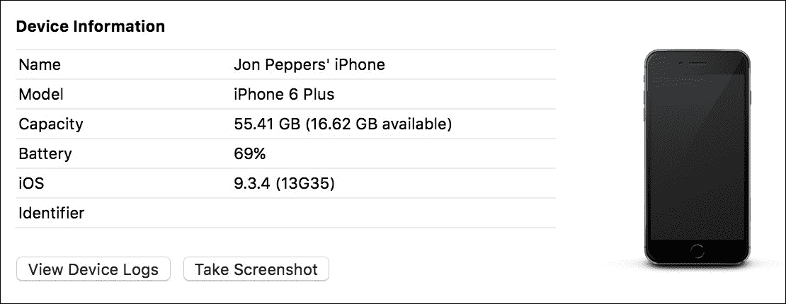
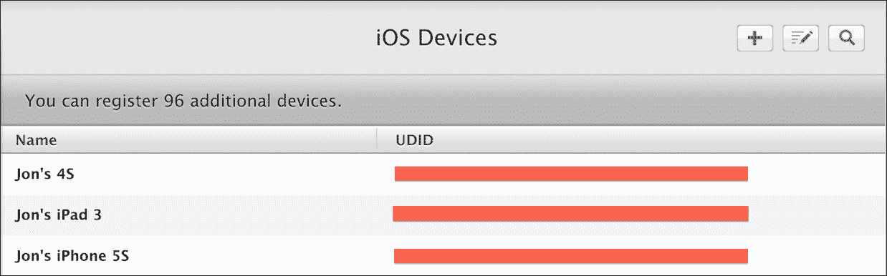
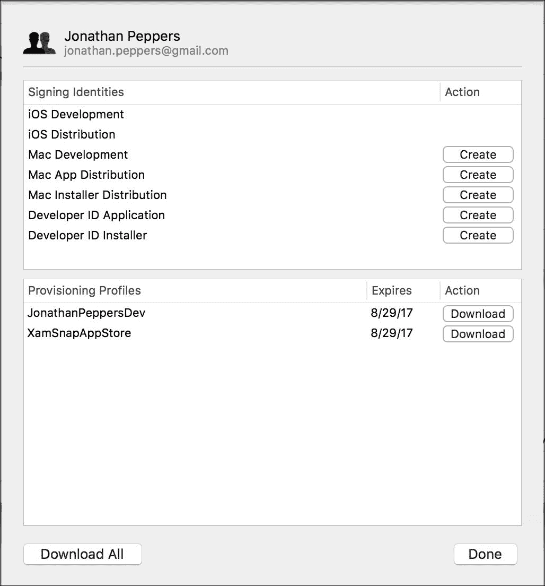
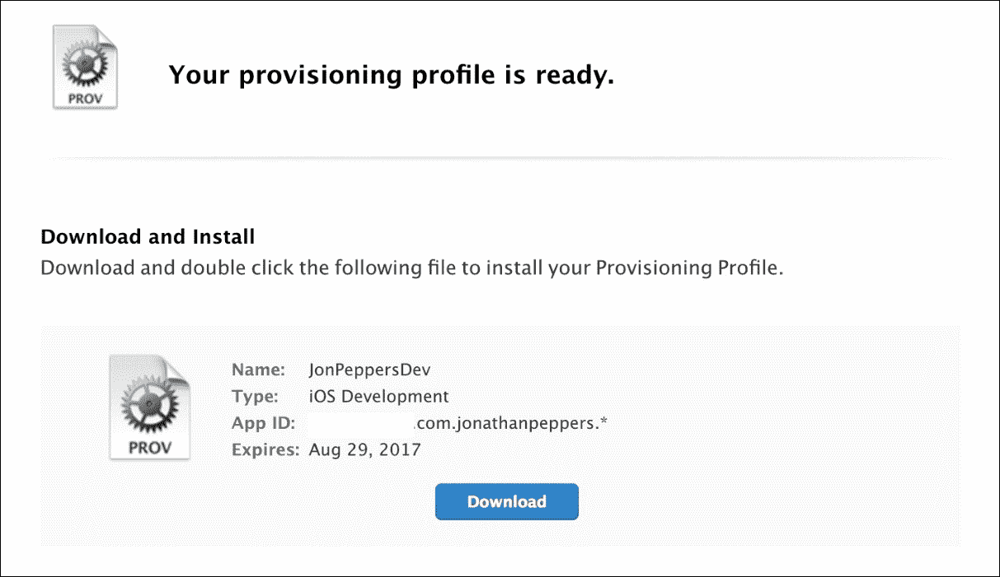
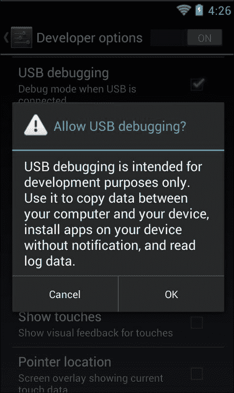
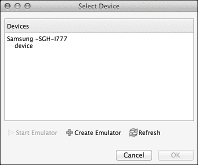

# 第七章：在设备上部署和测试

部署到设备既重要又有些麻烦，尤其是第一次尝试时。某些问题只会在移动设备上发生，无法在 iOS 仿真器或 Android 仿真器中复现。您还可以测试只有在真实设备上才能实现的功能，如 GPS、摄像头、内存限制或蜂窝网络连接。在为 Xamarin 开发时，也存在一些常见的陷阱，只有在物理设备上测试时才会显现。

在本章中，我们将涵盖以下内容：

+   iOS 配置

+   安卓设备调试设置

+   链接器

+   提前编译（AOT）

+   使用 Xamarin 常见的内存陷阱

在开始本章之前，需要注意的是，要部署到 iOS 设备，需要一个有效的 iTunes 账户或 iOS 开发者计划会员资格。可以随时回到第一章，*Xamarin 设置*，了解该过程。

# iOS 配置

苹果对将应用程序部署到 iOS 设备有一个严格的过程。尽管对于开发者来说这个过程可能相当复杂和痛苦，但苹果可以通过阻止普通用户侧载可能恶意应用程序来提供一定级别的安全性。

在我们将应用程序部署到 iOS 设备之前，我们将在**iOS 开发中心**设置一些事情。我们将从为您的账户创建一个应用 ID 或捆绑 ID 开始。这是任何 iOS 应用程序的主要标识符。

开始时请访问 [`developer.apple.com/account`](http://developer.apple.com/account) 并执行以下步骤：

1.  使用您的开发者账户登录。

1.  在右侧导航栏中点击**证书、ID 和配置文件**。

1.  点击**应用 IDs**。

1.  点击加号按钮添加新的 iOS 应用 ID。

1.  在**名称**字段中，输入一些有意义的文字，例如`YourCompanyNameWildcard`。

1.  选择**通配符应用 ID**单选按钮。

1.  在**捆绑 ID**字段中，为您的公司选择一个反向域名格式的名称，例如`com.yourcompanyname.*`。

1.  点击**继续**。

1.  检查最终设置并点击**提交**。

保持此网页打开，因为我们在整个章节中都会使用它。

我们刚刚为您的账户注册了一个通配符捆绑 ID；将此作为您希望用此账户标识的所有未来应用程序的前缀。稍后，当您准备将应用程序部署到苹果应用商店时，您将创建一个**显式应用 ID**，如`com.yourcompanyname.yourapp`。这允许您将特定应用程序部署到商店，而通配符 ID 最好用于将应用程序部署到测试设备。

接下来我们需要找到你计划调试应用程序的每个设备的唯一标识符。苹果要求每个设备都在你的账户下注册，并且每个开发者每种设备类型最多可注册 110 个设备（110 个 iPhone、iPad、iPod、Apple TV 或 Apple Watch）。绕过这一要求的唯一方式是注册 iOS 开发者企业计划，该计划除了标准的 99 美元开发者费用外，还需支付 299 美元的年费。

开始启动 Xcode 并执行以下步骤：

1.  在顶部菜单中点击**窗口** | **设备**。

1.  使用 USB 线连接你的目标设备。

1.  在左侧导航栏中，你应该看到你的设备名称；选择它。

1.  注意你的设备的**标识符**值。将其复制到剪贴板。

以下截图显示了在 Xcode 中选择你的设备后的屏幕样子：



返回到[`developer.apple.com/account`](http://developer.apple.com/account)（希望本章早些时候它还保持打开状态），并执行以下步骤：

1.  点击左侧导航栏中的**设备 | 全部**。

1.  点击页面右上角的加号按钮。

1.  为你的设备输入一个有意义的名称，并将剪贴板中的**标识符**粘贴到**UDID**字段中。

1.  点击**继续**。

1.  检查你输入的信息并点击**注册**。

在以后，当你的账户完全设置好后，你只需在 Xcode 中点击**用于开发**按钮，就可以跳过这第二个步骤。

以下截图显示了你的设备列表在完成时的样子：



接下来，我们需要生成一个证书，以代表你的账户作为开发者。在 Xcode 5 之前，你必须使用 Mac 上的**钥匙串**应用程序创建一个证书签名请求。Xcode 的新版本将这一流程集成到 Xcode 中，使得操作更加简便。

打开 Xcode 并执行以下步骤：

1.  在顶部菜单中导航至**Xcode** | **偏好设置**。

1.  选择**账户**标签页。

1.  点击左下角的加号按钮，然后点击**添加 Apple ID**。

1.  输入你的开发者账户的电子邮件和密码。

1.  创建账户后，点击右下角的**查看详情**。

1.  点击左下角的**下载全部**按钮。

1.  如果这是一个新账户，Xcode 会显示一个警告，提示还没有证书存在。勾选每个框并点击**请求**以生成证书。

Xcode 现在将自动为你的账户创建一个开发者证书，并将其安装到你的 Mac 钥匙串中。

以下截图显示了设置你的账户后屏幕的样子：



接下来，我们需要创建一个**配置文件**。这是允许应用程序安装在 iOS 设备上的最终文件。配置文件包含一个 App ID、一个设备 ID 列表，最后还有开发者的证书。你还需要在 Mac 的钥匙串中拥有开发者证书的私钥才能使用配置文件。

以下是几种配置文件类型：

+   **开发**：这用于调试或发布版本；当你的应用程序处于开发阶段时，你会积极使用这种类型的配置文件。

+   **Ad Hoc**：这主要用于发布版本；这种证书非常适合进行 beta 测试或分发给一组小用户。使用这种方法，你可以通过企业开发者账户向无限数量的用户分发。

+   **App Store**：这用于提交到 App Store 的发布版本。你不能使用此证书将应用程序部署到你的设备；它只能用于商店提交。

让我们回到[`developer.apple.com/apple`](http://developer.apple.com/apple)，通过执行以下步骤创建一个新的配置文件：

1.  点击左侧导航栏中的**配置文件 | 全部**。

1.  点击页面右上角的加号按钮。

1.  选择**iOS 应用开发**并点击**继续**。

1.  选择本章前面创建的通配符 App ID 并点击**继续**。

1.  选择我们在本章前面创建的证书并点击**继续**。

1.  选择你想要部署到的设备并点击**继续**。

1.  输入一个合适的**配置文件名称**，如`YourCompanyDev`。

1.  点击**继续**，你的配置文件将被创建。

下面的截图展示了你创建后最终会得到的新配置文件。不必担心下载文件；我们将使用 Xcode 导入最终的配置文件。



要导入配置文件，请回到 Xcode 并执行以下步骤：

1.  导航到对话框顶部菜单中的**Xcode** | **偏好设置**。

1.  选择**账户**标签。

1.  选择你的账户并点击**查看详情**。

1.  点击左下角的**下载全部**按钮。

1.  几秒钟后，你的配置文件将出现。

Xcode 应该会自动包含你在 Apple 开发者网站上创建的所有配置文件。Xcode 还会自行创建一些配置文件。

在最新版本的 Xamarin Studio 中，你可以查看这些配置文件，但无法同步它们。导航到 **Xamarin Studio** | **偏好设置** | **开发者账户**，从 Xamarin Studio 中查看配置文件。你也可以在 Xamarin 的文档网站上查看关于 iOS 配置的文档，网址为[`developer.xamarin.com/guides/ios/getting_started/device_provisioning/`](http://developer.xamarin.com/guides/ios/getting_started/device_provisioning/)。

# 安卓设备设置

与在 iOS 设备上部署应用程序的麻烦相比，Android 就轻松多了。要将应用程序部署到设备上，你只需在设备上设置几个选项。这是由于与 iOS 相比，Android 的开放性。大多数用户的 Android 设备调试功能是关闭的，但任何希望尝试编写 Android 应用程序的用户都可以轻松地开启它。

首先打开**设置**应用。你可能需要通过查看设备上的所有应用程序来找到它，如下所示：

1.  向下滚动并点击标有**开发者选项**的部分。

1.  在顶部的操作栏中，你可能需要将一个开关切换到**开启**位置。这个操作在每个设备上都有所不同。

1.  向下滚动并勾选**USB 调试**。

1.  将会出现一个警告确认提示；点击**确定**。

### 提示

请注意，一些较新的 Android 设备使得普通用户开启 USB 调试变得更加困难。你需要点击**开发者选项**七次来开启这个选项。

下面的截图展示了在过程中你的设备的样子：



启用这个选项后，你只需通过 USB 连接你的设备，并在 Xamarin Studio 中调试一个 Android 应用程序。你会在**选择设备**对话框中看到你的设备列表。请注意，如果你使用的是 Windows 系统，或者你的设备是非标准的，你可能需要访问设备制造商的网站来安装驱动程序。大多数三星和 Nexus 设备会自动安装它们的驱动程序。在 Android 4.3 及更高版本中，在开始 USB 调试会话之前，设备上还会出现一个确认对话框。

下面的截图展示了在**选择设备**对话框中三星 Galaxy 设备的样子。Xamarin Studio 将显示型号号码，这并不总是一个你可能认识的名字。你可以在你的设备的设置中查看这个型号号码。



# 了解链接器

为了让 Xamarin 应用程序在移动设备上保持小型和轻量级，Xamarin 为编译器创建了一个名为**链接器**的功能。其主要目的是从核心 Mono 程序集（如`System.dll`）和特定平台的程序集（`Mono.Android.dll`和`Xamarin.iOS.dll`）中移除未使用的代码；然而，如果设置得当，它也可以为你自己的程序集提供同样的好处。如果不运行链接器，整个 Mono 框架可能大约有 30 兆字节。这就是为什么在设备构建中默认启用链接，这样你可以保持应用程序的小巧。

链接器使用静态分析来处理程序集中的各种代码路径。如果它确定一个方法或类从未被使用，它会从该程序集中移除未使用的代码。这个过程可能会很耗时，因此默认情况下，在模拟器中运行的构建会跳过这一步。

Xamarin 应用程序有以下三个主要的链接器设置：

+   **不链接**：在这种情况下，链接器编译步骤将被跳过。这对于在模拟器中运行的构建或如果你需要诊断链接器的潜在问题最为合适。

+   **仅链接 SDK 程序集**：在这种情况下，链接器只会在核心 Mono 程序集上运行，如`System.dll`、`System.Core.dll`和`System.Xml.dll`。

+   **链接所有程序集**：在这种情况下，链接器将对应用程序中的所有程序集运行，包括你正在使用的任何类库或第三方程序集。

这些设置可以在任何 Xamarin.iOS 或 Xamarin.Android 应用程序的项目选项中找到。这些设置通常不会出现在类库中，因为它们通常与将要部署的 iOS 或 Android 应用程序相关联。

链接器还可能在运行时引起潜在问题，因为有时它的分析会错误地确定一段代码未被使用。如果你在`System.Reflection`命名空间中使用特性而不是直接访问方法或属性，这可能会发生。这就是为什么在物理设备上测试你的应用程序很重要，因为设备构建启用了链接。

为了说明这个问题，让我们看一下以下代码示例：

```kt
//Just a simple class for holding info 
public class Person 
{ 
  public int Id { get; set; } 
  public string Name { get; set; } 
} 

//Then somewhere later in your code 
var person = new Person { Id = 1, Name = "Chuck Norris" }; 
var propInfo = person.GetType().GetProperty("Name"); 
string value = propInfo.GetValue(person) as string; 
Console.WriteLine("Name: " + value); 

```

运行前面的代码，在**不链接**或**仅链接 SDK 程序集**的选项下将正常工作。然而，如果你在**链接所有程序集**的选项下尝试运行此代码，你会遇到类似以下的异常：

```kt
Unhandled Exception: 
System.ArgumentException: Get Method not found for 'Name'
   at System.Reflection.MonoProperty.GetValue (System.Object obj,
   BindingFlags invokeAttr, System.Reflection.Binder binder,
   System.Object[] index, System.Globalization.CultureInfo culture)
   at System.Reflection.PropertyInfo.GetValue (System.Object obj) 

```

由于从未直接从代码中使用`Name`属性的 getter，链接器将其从程序集中剥离。这导致反射代码在运行时失败。

尽管你的代码可能会出现潜在问题，但**链接所有程序集**的选项仍然非常有用。有些优化只能在此模式下执行，Xamarin 可以将你的应用程序缩减到尽可能小的尺寸。如果你的应用程序需要性能或极小的下载尺寸，请尝试这个选项。然而，应进行彻底测试，以确保链接程序集不会引起任何问题。

为了解决代码中的问题，Xamarin 提供了一套完整的解决方案，以防止代码中的特定部分被剥离。

以下是一些选项：

+   使用`[Preserve]`标记类成员；这将强制链接器包含带属性的方法、字段或属性。

+   使用`[Preserve(AllMembers=true)]`标记整个类；这将保留类中的所有代码。

+   使用`[assembly: Preserve]`标记整个程序集；这是一个程序集级别的属性，将保留其中的所有代码。

+   通过修改项目选项中的**附加 mtouch 参数**来跳过整个程序集；使用`--linkskip=System`来跳过整个程序集。这可以用于那些你没有源代码的程序集。

+   通过 XML 文件自定义链接，当你需要跳过没有源代码的具体类或方法的链接时，这是最佳选择。在**附加 mtouch 参数**中使用 `--xml=YourFile.xml`。

以下是一个演示自定义链接的示例 XML 文件：

```kt
<linker> 
  <assembly fullname="mscorlib"> 
    <type fullname="System.Environment"> 
      <field name="mono_corlib_version" /> 
      <method name="get_StackTrace" />  
    </type> 
  </assembly> 
  <assembly fullname="My.Assembly.Name"> 
    <type fullname="MyTypeA" preserve="fields" /> 
      <method name=".ctor" /> 
    </type> 
    <type fullname="MyTypeB" />                          
      <method signature="System.Void MyFunc(System.Int32 x)" /> 
      <field signature="System.String _myField" /> 
    </type> 
  </assembly> 
</linker> 

```

自定义链接是选项中最复杂的，通常是最后的选择。幸运的是，大多数 Xamarin 应用程序不需要解决许多链接问题。

# 了解 AOT 编译

Windows 上的 Mono 和 .NET 运行时基于**即时编译**（**JIT**）器。C# 和其他 .NET 语言被编译成**微软中间语言**（**MSIL**）。在运行时，MSIL 会即时编译成本地代码（正好在需要时），以在任何类型的架构上运行你的应用程序。Xamarin.Android 遵循这一确切模式。然而，由于苹果对动态生成代码的限制，iOS 上不允许使用**即时编译（JIT）**器。

为了绕过这一限制，Xamarin 开发了一个名为**提前编译**（**AOT**）的新选项，你的 C# 代码被编译成特定于平台的本地机器代码。除了使 .NET 在 iOS 上成为可能之外，AOT 还具有其他好处，例如启动时间更短，性能可能更好。

AOT 也有一些与 C# 泛型相关的限制。为了提前编译程序集，编译器需要对代码进行一些静态分析，以确定类型信息。泛型在这种情况下会带来一些问题。

AOT 不支持一些在 C# 中完全有效的情况。首先是泛型接口，如下所示：

```kt
interface MyInterface<T>  
{ 
  T GetMyValue(); 
} 

```

编译器无法提前确定可能实现此接口的类，特别是涉及多个程序集时。第二个限制与第一个相关：你不能覆盖包含泛型参数或返回值的虚拟方法。

以下是一个简单的例子：

```kt
class MyClass<T> 
{ 
  public virtual T GetMyValue()  
  { 
    //Some code here 
  } 
} 

class MySubClass : MyClass<int> 
{ 
  public override int GetMyValue() 
  { 
    //Some code here 
  } 
} 

```

再次强调，编译器的静态分析无法在编译时确定哪些类可能会覆盖这个方法。

另一个限制是，你不能在泛型类中使用 `DllImport`，如下面的代码所示：

```kt
class MyGeneric<T> 
{ 
  [DllImport("MyImport")] 
  public static void MyImport(); 
} 

```

如果你不太熟悉这个语言特性，`DllImport` 是一种从 C# 调用本地 C/C++ 方法的方式。在泛型类中使用它们是不支持的。

这些限制是为什么在设备上进行测试很重要的另一个原因，因为上述代码在其他可以运行 C# 代码的平台上是没问题的，但在 Xamarin.iOS 上不行。

# 避免常见的内存陷阱

移动设备上的内存绝对不是无限的资源。因此，你的应用程序中的内存使用可能比桌面应用程序更重要。有时，你可能会发现需要使用内存分析器或改进代码以更有效地使用内存。

以下是最常见的内存陷阱：

+   **垃圾回收器**（**GC**）无法快速回收大对象以跟上应用程序的步伐

+   你的代码无意中导致了内存泄漏

+   一个 C#对象被垃圾回收，但后来被本地代码尝试使用

让我们看看第一个问题，即 GC 无法跟上。假设我们有一个 Xamarin.iOS 应用程序，其中有一个用于在 Twitter 上分享图像的按钮，如下所示：

```kt
twitterShare.TouchUpInside += (sender, e) => 
{ 
  var image = UImage.FromFile("YourLargeImage.png"); 
  //Share to Twitter 
}; 

```

现在假设图像是用户相册中的 10MB 图像。如果用户点击按钮并迅速取消 Twitter 帖子，应用程序可能会出现内存不足的情况。iOS 通常会强制关闭使用过多内存的应用程序，你不会希望用户在使用你的应用时遇到这种情况。

最佳解决方案是在使用完图像后调用其`Dispose`方法，如下所示：

```kt
var image = UImage.FromFile("YourLargeImage.png"); 
//Share to Twitter 
image.Dispose(); 

```

更好的方法将是利用 C#的`using`语句，如下所示：

```kt
using(var image = UImage.FromFile("YourLargeImage.png")) 
{ 
  //Share to Twitter 
} 

```

C#的`using`语句会自动在`try-finally`块中调用`Dispose`，因此即使抛出异常，对象也将被释放。我建议尽可能对任何`IDisposable`类使用`using`语句。对于小对象如`NSString`来说，这并不总是必要的，但对于更大、更重的`UIKit`对象来说，这总是一个好主意。

### 提示

在 Android 上，与`Bitmap`类也可能发生类似情况。虽然略有不同，但最好是在此类上调用`Dispose`方法，这与你在 iOS 上对`UIImage`的处理是一样的。

内存泄漏是下一个潜在问题。C#作为一种管理的、垃圾回收的语言，防止了很多内存泄漏，但并非全部。C#中最常见的泄漏是由事件引起的。

假设我们有一个带有事件的静态类，如下所示：

```kt
static class MyStatic 
{ 
  public static event EventHandler MyEvent; 
} 

```

现在，假设我们需要从 iOS 控制器中订阅事件，如下所示：

```kt
public override void ViewDidLoad() 
{ 
  base.ViewDidLoad(); 

  MyStatic.MyEvent += (sender, e) => 
  { 
    //Do something 
  }; 
} 

```

这里的问题是，静态类将持有对控制器的引用，直到事件被取消订阅。这是许多开发者可能会忽略的情况。为了在 iOS 上解决这个问题，我会在`ViewWillAppear`中订阅事件，并在`ViewWillDisappear`中取消订阅。在 Android 上，使用`OnStart`和`OnStop`，或者`OnPause`和`OnResume`。

你会正确实现此事件，如下所示：

```kt
public override void ViewWillAppear() 
{ 
  base.ViewWillAppear(); 
  MyStatic.MyEvent += OnMyEvent; 
} 

public override void ViewWillDisappear() 
{ 
  base.ViewWillDisappear (); 
  MyStatic.MyEvent -= OnMyEvent; 
} 

```

然而，事件并不是内存泄漏的必然原因。例如，在`ViewDidLoad`方法中订阅按钮的`TouchUpInside`事件是没问题的。由于按钮与控制器在内存中的生命周期相同，一切都可以被垃圾回收，而不会造成问题。

对于最后一个问题，垃圾回收器有时可能会移除一个 C#对象；后来，一个 Objective-C 对象尝试访问它。

下面是一个添加按钮到`UITableViewCell`的例子：

```kt
public override UITableViewCell GetCell(
   UITableView tableView, NSIndexPath indexPath) 
{ 
  var cell = tableView.DequeueReusableCell("MyCell"); 
  //Remaining cell setup here 

  var button = UIButton.FromType(UIButtonType.InfoDark); 
  button.TouchUpInside += (sender, e) => 
  { 
    //Do something 
  }; 
  cell.AccessoryView = button; 
  return cell; 
} 

```

我们将内置的信息按钮作为单元格的附件视图添加。这里的问题是，按钮将被垃圾回收，但其 Objective-C 对应物仍将在屏幕上显示时被使用。如果过了一段时间后点击按钮，你可能会遇到类似下面的崩溃情况：

```kt
mono-rt: Stacktrace:
mono-rt:   at <unknown>
mono-rt:   at (wrapper managed-to-native) MonoTouch.UIKit.UIApplication.UIApplicationMain
    (int,string[],intptr,intptr) 
mono-rt:   at MonoTouch.UIKit.UIApplication.Main (string[],string,string) 
... Continued ...
=================================================================
Got a SIGSEGV while executing native code. This usually indicates
a fatal error in the mono runtime or one of the native libraries 
used by your application.
================================================================

```

这不是最描述性的错误消息，但一般来说，你知道原生 Objective-C 代码中出了问题。要解决这个问题，请创建一个`UITableViewCell`的自定义子类，并为按钮创建一个专用的成员变量，如下所示：

```kt
public class MyCell : UITableViewCell 
{ 
  UIButton button;

  public MyCell() 
  { 
    button = UIButton.FromType(UIButtonType.InfoDark); 
    button.TouchUpInside += (sender, e) =>  
    { 
      //Do something 
    }; 
    AccessoryView = button; 
  } 
} 

```

现在，你的`GetCell`实现看起来可能如下所示：

```kt
public override UITableViewCell GetCell(
   UITableView tableView, NSIndexPath indexPath) 
{ 
  var cell = tableView.DequeueReusableCell("MyCell") as MyCell; 
  //Remaining cell setup here 
  return cell; 
} 

```

由于按钮不是一个局部变量，它不会比需要的时候更早地被垃圾回收。这样可以避免崩溃，并且在某些方面，这段代码看起来更整洁。在 Android 上，C#与 Java 之间的交互也可能出现类似情况；然而，由于两者都是垃圾回收语言，这种情况不太可能发生。

# 概括

在本章中，我们开始学习设置 iOS 供应配置文件的过程，以便部署到 iOS 设备。接下来，我们查看了将应用程序部署到 Android 设备所需的设备设置。我们发现了 Xamarin 链接器，以及它如何使应用程序变得更小、性能更好。我们讨论了解决由你的代码和链接器引起问题的各种设置，并解释了 iOS 上的 AOT 编译及其出现的限制。最后，我们涵盖了 Xamarin 应用程序可能遇到的常见内存陷阱。

在移动设备上测试 Xamarin 应用程序有多种原因。由于 Xamarin 必须绕过的平台限制，一些错误只能在设备上显示。你的电脑强大得多，因此在使用模拟器与物理设备上的性能表现会有所不同。在下一章中，我们将使用 Windows Azure 创建一个真实的网络服务来驱动我们的 XamChat 应用程序。我们将使用一个名为 Azure Mobile Services 的功能，并在 iOS 和 Android 上实现推送通知。
