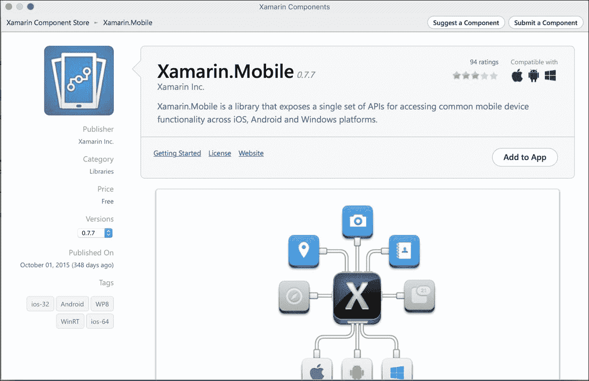
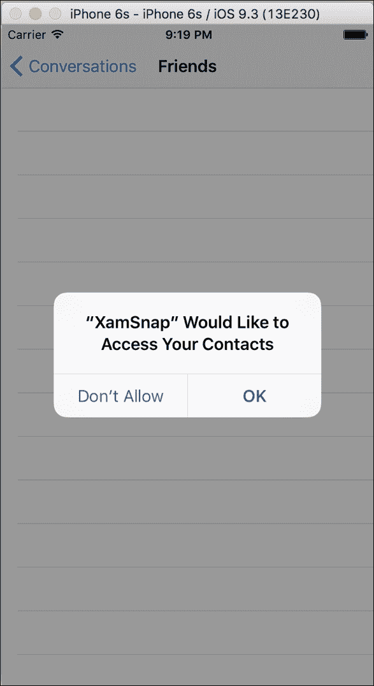
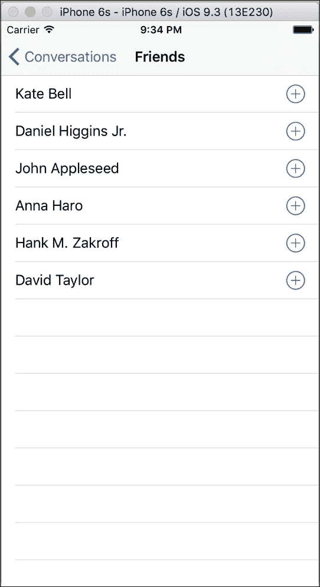
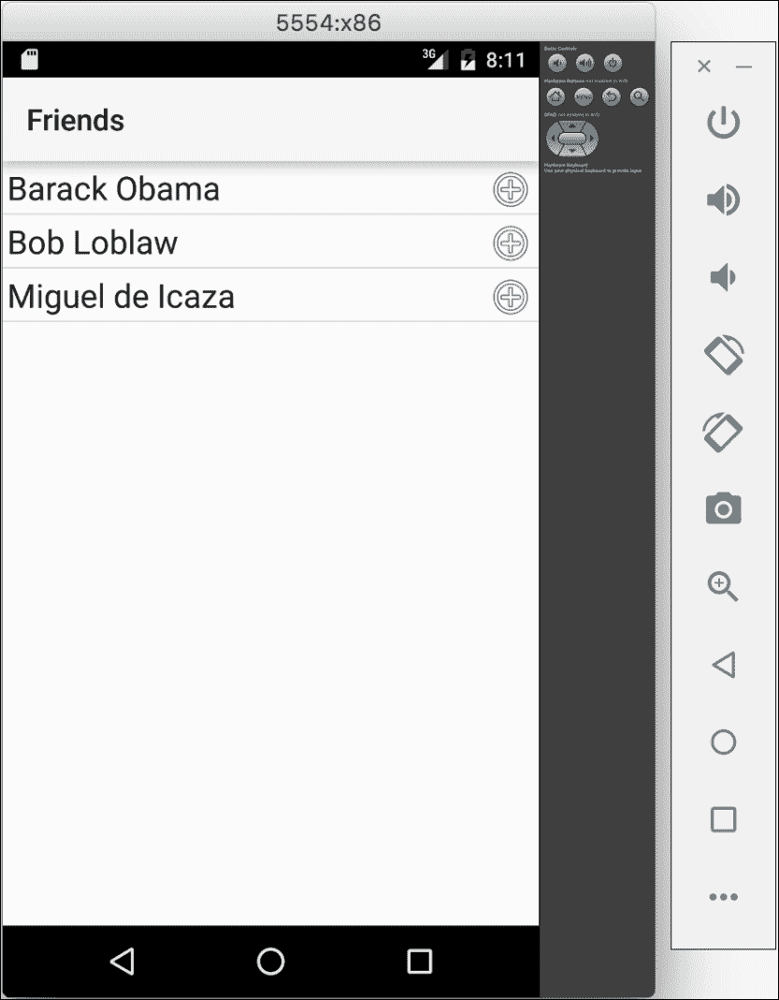
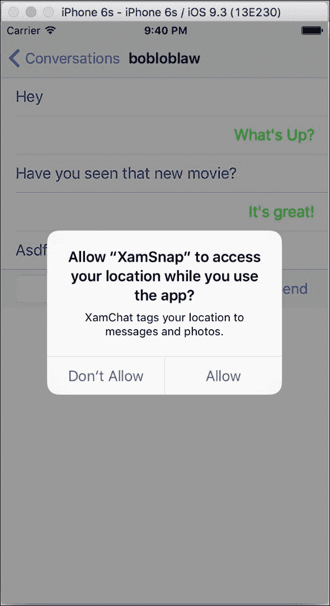
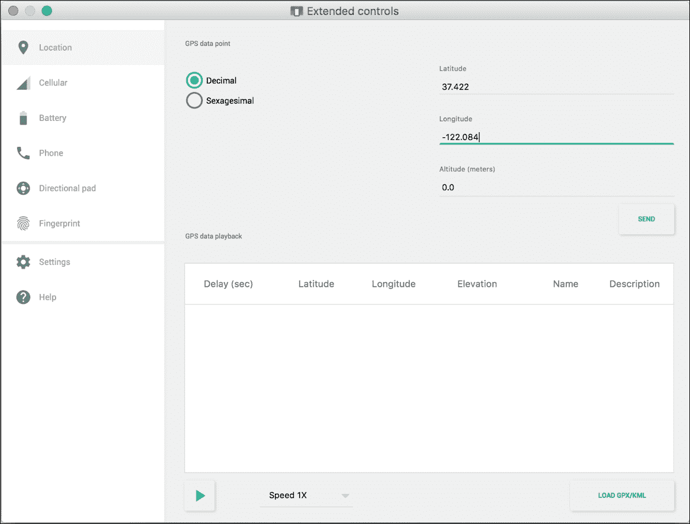
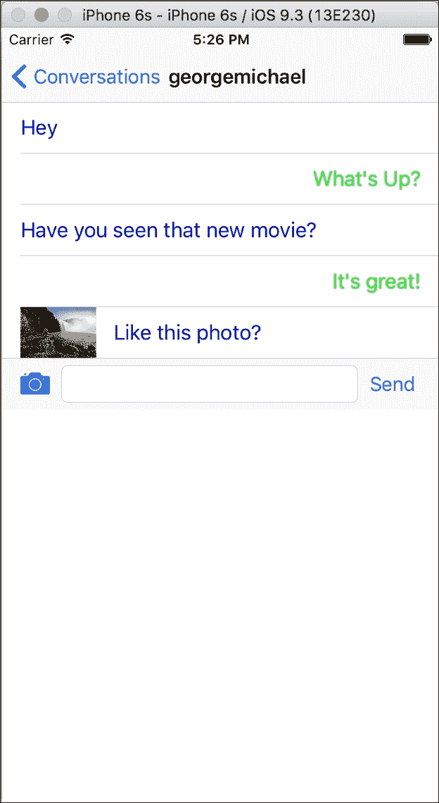
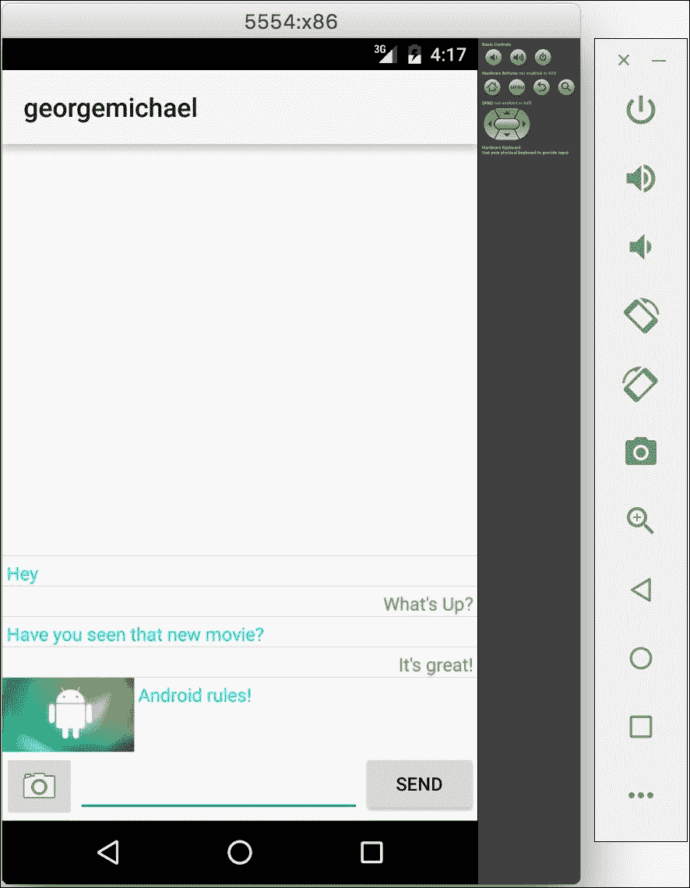

# 第八章：联系人、相机和位置

当前移动应用程序最关键的一些特性基于我们的设备可以收集的新类型数据。像 GPS 位置和相机这样的功能是 Instagram 或 Twitter 等现代应用程序的基石。开发一个应用程序而不使用这些功能是非常困难的。因此，让我们探讨使用 Xamarin 利用这一功能的方法。

在本章中，我们将执行以下操作：

+   介绍 Xamarin.Mobile 库

+   在 Android 和 iOS 上读取通讯录

+   获取我们设备的 GPS 位置

+   从相机和照片库中提取照片

# 介绍 Xamarin.Mobile

为了简化这些特性在多个平台上的开发，Xamarin 开发了一个名为 **Xamarin.Mobile** 的库。它为 iOS、Android 甚至 Windows 平台提供了一个单一的 API，用于访问联系人、GPS 位置、屏幕方向、相机和照片库。它还利用 **任务并行库**（**TPL**）提供一个现代的 C# API，使开发者比使用原生替代方案更高效。这使你能够使用 C# 中的 `async` 和 `await` 关键字编写优美、清晰的异步代码。你还可以在 iOS 和 Android 上重用相同的代码，除了 Android 平台所必需的一些差异。

要安装 Xamarin.Mobile，请在 **Xamarin Studio** 中打开 **Xamarin 组件商店**，并将 **Xamarin.Mobile** 组件添加到项目中，如下面的截图所示：



在我们深入了解如何使用 Xamarin.Mobile 之前，让我们回顾一下该库提供的命名空间和功能：

+   `Xamarin.Contacts`：这包含了使你能够与完整通讯录交互的类。它包括从联系人的照片、电话号码、地址、电子邮件、网站等所有内容。

+   `Xamarin.Geolocation`：结合加速度计，这可以让你访问设备的 GPS 位置，包括高度、屏幕方向、经度、纬度和速度。你可以明确跟踪设备的位置，或者随着时间的推移监听 GPS 位置的变化。

+   `Xamarin.Media`：这可以访问设备的摄像头（如果设备有多个摄像头）和内置照片库。这是向任何应用程序添加照片选择功能的一种简单方法。

Xamarin.Mobile 是一个开源项目，采用标准的 Apache 2.0 许可证。你可以为项目做贡献或在 GitHub 页面提交问题，地址是[`github.com/xamarin/Xamarin.Mobile`](https://github.com/xamarin/Xamarin.Mobile)。请随意在您的应用程序中使用 Xamarin.Mobile，或者为了自己的目的对其进行分叉和修改。

在本章中，我们将向之前章节构建的 XamSnap 示例应用程序添加许多功能。如有需要，你可能希望访问第六章，*XamSnap for Android*，或者参考本书附带的示例源代码。

# 访问联系人

为了开始探索 Xamarin.Mobile 提供的内容，让我们访问 Xamarin 应用程序内的地址簿。通过从用户的联系人列表加载朋友，来改进 XamSnap 的添加好友功能。确保从组件商店为 iOS 和 Android 项目添加 Xamarin.Mobile。

导航至`XamSnap`可移植类库。首先，我们需要将`IWebService`接口拆分，通过将一个方法移动到新的`IFriendService`接口中：

```kt
public interface IFriendService 
{ 
    Task<User[]> GetFriends(string userName); 
} 

```

接下来，在`FriendViewModel`中，我们需要使用新的`IFriendService`接口而不是旧的接口：

```kt
private IFriendService friendService =  
  ServiceContainer.Resolve<IFriendService>(); 

public async Task GetFriends() 
{ 
  //previous code here, use 'friendService' instead of 'service' 
  Friends = await friendService.GetFriends(settings.User.Name);  
} 

```

现在，我们需要在 iOS 项目中实现`IFriendService`，以便能够从设备的联系人列表中加载。导航至`XamSnap.iOS`项目，并添加一个实现`IFriendService`的新类：

```kt
public class ContactsService : IFriendService 
{ 
  public async Task<User[]> GetFriends(string userName) 
  { 
    var book = new Xamarin.Contacts.AddressBook(); 
    await book.RequestPermission(); 

```

```kt
    var users = new List<User>(); 
    foreach (var contact in book) 
    { 
      users.Add(new User 
      { 
        Name = contact.DisplayName, 
      }); 
    } 
    return users.ToArray();     
  } 
} 

```

要使用 Xamarin.Mobile 加载联系人，你首先必须创建一个`AddressBook`对象。接下来，我们需要调用`RequestPermissions`来请求用户允许访问地址簿。这是一个重要的步骤，因为 iOS 设备要求在应用程序访问用户联系人之前必须这样做。这防止了可能恶意应用在用户不知情的情况下获取联系人。

接下来，我们使用`foreach`遍历`AddressBook`对象，并创建现有应用程序已经理解的`User`对象的实例。这正是 MVVM 设计模式在分层方面的优势的绝佳例子。当我们更换模型层的逻辑时，UI 仍然可以正常工作，无需任何更改。

接下来，我们需要修改我们的`AppDelegate.cs`文件，以使用我们的`ContactsService`作为`IFriendService`接口：

```kt
ServiceContainer.Register<IFriendService>( 
  () => new ContactsService()); 

```

如果在这个时候编译并运行应用程序，你会看到标准的 iOS 弹窗，请求访问联系人，如下面的截图所示：



如果你意外点击了**不允许**，可以通过导航到设备上的**设置** | **隐私** | **联系人**来更改此设置。在 iOS 模拟器中，还可以通过关闭应用程序并前往**设置** | **通用** | **重置** | **重置位置与隐私**来重置所有隐私提示。

如果我们的应用程序被授予了正确的访问权限，我们应该能够看到联系人列表，而无需修改应用程序 UI 层的任何代码。以下屏幕截图显示了 iOS 模拟器中的默认联系人列表：



## 在 Android 上检索联系人

以非常类似的方式，我们可以使用 Xamarin.Mobile 在 Android 中获取联系人列表。Xamarin.Mobile 中的所有 API 在 Android 上都是相同的，除了在某些地方需要传递`Android.Content.Context`。这是因为许多原生 Android API 需要引用当前活动（或其他如`Application`的上下文）才能正常工作。首先，通过在 Xamarin Studio 中导航到**Android** | **Android Application**创建一个标准的 Android 应用程序项目。确保从组件商店向项目添加 Xamarin.Mobile。

按如下方式添加`IFriendService`的 Android 等效项：

```kt
public class ContactsService : IFriendService 
{ 
  public async Task<User[]> GetFriends(string userName) 
  { 
    var book = new  
        Xamarin.Contacts.AddressBook(Application.Context); 
    await book.RequestPermission(); 

    var users = new List<User>(); 
    foreach (var contact in book) 
    { 
      users.Add(new User 
      { 
        Name = contact.DisplayName, 
      }); 
    } 
    return users.ToArray();     
  } 
} 

```

这段调用 Xamarin.Mobile 的代码与我们为 iOS 编写的代码相同，不同之处在于这里需要为`AddressBook`构造函数中的 Android `Context`传递`Application.Context`。我们的代码修改完成了；但是，如果你现在运行应用程序，将会抛出异常。Android 需要在清单文件中要求权限，这样当从 Google Play 下载时，它会通知用户其访问通讯录的权限。

我们必须修改`AndroidManifest.xml`文件，并按以下方式声明一个权限：

1.  打开 Android 项目的项目选项。

1.  在**构建**下选择**Android Application**标签页。

1.  在**所需权限**部分，勾选**ReadContacts**。

1.  点击**OK**保存更改。

现在如果你运行应用程序，你将获得设备上所有联系人的列表，如下截图所示：



# 查找 GPS 位置

使用 Xamarin.Mobile 跟踪用户的 GPS 位置与访问他们的联系人一样简单。iOS 和 Android 设置访问权限的过程类似，但在位置的情况下，你无需从代码请求权限。iOS 会自动显示标准警报请求权限。而 Android 只需要在清单中进行设置。

举个例子，让我们为 XamSnap 应用添加一个功能，在聊天对话中为消息标记 GPS 位置。你可以将其视为像其他应用一样给照片标记位置。确保从组件商店向项目添加 Xamarin.Mobile。

首先，让我们实现一个用于存储纬度和经度的`Location`类：

```kt
public class Location
{
    public double Latitude { get; set; }
    public double Longitude { get; set; }
}
```

接下来，让我们在`Message`类中添加一个`Location`属性：

```kt
public Location Location { get; set; }
```

现在，让我们创建一个新的`ILocationService`接口，用于查询 GPS 位置：

```kt
public interface ILocationService
{
    Task<Location> GetCurrentLocation();
}
```

现在，我们需要更新`MessageViewModel`类，以使用位置服务并在新消息上标记 GPS 位置：

```kt
//As a member variable
private ILocationService locationService = 
  ServiceContainer.Resolve<ILocationService>();
//Then in SendMessage()
var location = await locationService.GetCurrentLocation();
var message = await service.SendMessage(new Message
{
    UserName = settings.User.Name,
    Conversation = Conversation.Id,
    Text = Text,
    Location = location,
});
```

接下来，让我们为 iOS 实现`ILocationService`接口。在 iOS 项目中创建一个新类：

```kt
public class LocationService : ILocationService 
{ 
  private const int Timeout = 3000; 
  private Geolocator _geolocator; 

  public async Task<Location> GetCurrentLocation() 
  { 
    try 
    { 
      //NOTE: wait until here to create Geolocator 
      //  so that the iOS prompt appears on GetCurrentLocation() 
      if (_geolocator == null) 
        _geolocator = new Geolocator(); 

      var location = await _geolocator.GetPositionAsync(Timeout); 

      Console.WriteLine("GPS location: {0},{1}", 
        location.Latitude, location.Longitude); 

      return new Location 
      { 
        Latitude = location.Latitude, 
        Longitude = location.Longitude, 
      }; 
    } 
    catch (Exception exc) 
    { 
      Console.WriteLine("Error finding GPS location: " + exc); 

      //If anything goes wrong, just return null 
      return null; 
    } 
  } 
} 

```

我们在这里所做的首先是在需要时创建一个`Geolocator`对象。这样可以延迟 iOS 权限弹窗，直到你实际去发送消息。然后我们使用`async`/`await`查询 GPS 定位，并设置三秒的超时时间。我们记录找到的位置并创建一个新的`Location`对象，供应用程序的其余部分使用。如果发生任何错误，我们确保记录它们并将我们的`Location`实例返回为`null`。

接下来，在`AppDelegate.cs`中注册我们的新服务：

```kt
ServiceContainer.Register<ILocationService>( 
  () => new LocationService()); 

```

最后，在我们的`Info.plist`文件中有一个设置是 iOS 访问用户位置所必需的，并且它还允许开发者在权限弹窗中显示一条消息。

打开`Info.plist`文件，并按如下所示更改：

1.  点击**源代码**标签。

1.  点击**添加新条目**行上的加号按钮。

1.  在下拉菜单中，选择**使用期间的位置访问描述**。

1.  在**值**字段中为用户输入文本。

如果你编译并运行应用程序，你应该会在添加新消息时看到一个 iOS 权限提示，如下面的截图所示：



如果你观察 Xamarin Studio 中的控制台日志，你将能够看到 GPS 坐标被添加到`Message`对象中。为了实际工作，你将需要部署到物理 iOS 设备上才能看到返回的 GPS 定位。

## 实现 Android 上的 GPS 定位

正如前一部分所述，使用 Xamarin.Mobile 获取 GPS 位置与我们在 iOS 上使用的 API 几乎相同。首先，我们需要像之前一样创建一个`ILocationService`，只需更改一行我们为 iOS 创建的代码：

```kt
if (_geolocator == null) 
  _geolocator = new Geolocator(Application.Context); 

```

然后，在`Application.cs`中注册我们的新服务：

```kt
ServiceContainer.Register<ILocationService>( 
  () => new LocationService()); 

```

同样，这看起来与 iOS 的代码相同，除了`Geolocator`的构造函数。如果在这一点上运行应用程序，它将开始运行且没有错误。然而，`Geolocator`对象不会触发任何事件。我们首先需要从 Android 清单文件中添加访问位置的权限。在`OnResume`中开始定位器，在`OnPause`中停止它也是一个好主意。这将通过在屏幕上不再显示此活动时停止 GPS 定位来节省电池。

让我们创建一个`AndroidManifest.xml`文件，并声明两个权限，如下所示：

1.  打开 Android 项目的项目选项。

1.  在**构建**下选择**Android 应用程序**标签。

1.  点击**添加 Android 清单**。

1.  在**所需权限**部分，勾选**AccessCoarseLocation**和**AccessFineLocation**。

1.  点击**确定**保存你的更改。

现在，如果你编译并运行应用程序，你将获得与新发送的消息关联的 GPS 定位信息。大多数 Android 模拟器都有模拟 GPS 定位的选项。x86 HAXM 模拟器位于底部点菜单下，然后是**扩展控制 | 位置**，如下面的截图所示：



# 访问照片库和相机

Xamarin.Mobile 的最后一个主要功能是访问照片，以使用户能够向你的应用程序添加自己的内容。使用一个名为`MediaPicker`的类，你可以从设备的相机或照片库中获取照片，并可以选择性地为操作显示你自己的 UI。

让我们修改`MessageViewModel`以支持照片。首先，添加以下属性：

```kt
public string Image { get; set; } 

```

接下来，我们需要修改`SendMessage`方法中的以下几行：

```kt
if (string.IsNullOrEmpty(Text) && string.IsNullOrEmpty(Image))
   throw new Exception("Message is blank.");

//Then further down 
var message = await service.SendMessage(new Message
{
     UserName = settings.User.Name,
     Conversation = Conversation.Id,
     Text = Text,
     Image = Image,
     Location = location,
});
//Clear our variables 
Text =
      Image = null;  

```

然后，我们需要修改 UI 层以提示选择照片。打开`MessagesController.cs`并在类的顶部添加以下变量：

```kt
UIBarButtonItem photo; 
MediaPicker picker; 

```

在`ViewDidLoad`方法中，我们需要设置`MediaPicker`和一个新的`UIBarButtonItem`来选择照片：

```kt
picker = new MediaPicker(); 
photo = new UIBarButtonItem(UIBarButtonSystemItem.Camera,  
  (sender, e) => 
  { 
    //In case the keyboard is up 
    message.ResignFirstResponder(); 

    var actionSheet = new UIActionSheet("Choose photo?"); 
    actionSheet.AddButton("Take Photo"); 
    actionSheet.AddButton("Photo Library"); 
    actionSheet.AddButton("Cancel"); 
    actionSheet.Clicked += OnActionSheetClicked; 
    actionSheet.CancelButtonIndex = 2; 
    actionSheet.ShowFrom(photo, true); 
  }); 

```

在这里我们使用`UIActionSheet`类来提示用户决定他们是想拍摄新照片还是打开现有照片。现在让我们实现`OnActionSheetClicked`方法：

```kt
async void OnActionSheetClicked( 
  object sender, UIButtonEventArgs e) 
{ 
  MediaPickerController controller = null; 
  try 
  { 
    if (e.ButtonIndex == 0) 
    { 
      if (!picker.IsCameraAvailable) 
      { 
        new UIAlertView("Oops!",  
          "Sorry, camera not available on this device!", null,  
          "Ok").Show(); 
        return; 
      } 

      controller = picker.GetTakePhotoUI( 
        new StoreCameraMediaOptions()); 
      PresentViewController(controller, true, null); 

      var file = await controller.GetResultAsync(); 
      messageViewModel.Image = file.Path; 
      Send(); 
    } 
    else if (e.ButtonIndex == 1) 
    { 
      controller = picker.GetPickPhotoUI(); 
      PresentViewController(controller, true, null); 

      var file = await controller.GetResultAsync(); 
      messageViewModel.Image = file.Path; 
      Send(); 
    } 
  } 
  catch (TaskCanceledException) 
  { 
    //Means the user just cancelled 
  } 
  finally 
  { 
    controller?.DismissViewController(true, null); 
  } 
} 

```

使用`MediaPicker`非常直接；你只需调用`GetTakePhotoUI`或`GetPickPhotoUI`来获取一个`MediaPickerController`实例。然后，你可以调用`PresentViewController`以模态形式在当前控制器顶部显示控制器。调用`GetResultAsync`之后，我们使用结果`MediaFile`对象将照片路径传递给我们的 ViewModel 层。还需要使用`try-catch`块，以防用户取消并调用`DismissViewController`隐藏模态界面。

接下来，我们需要修改`UITableViewSource`以显示照片：

```kt
public override UITableViewCell GetCell( 
  UITableView tableView, NSIndexPath indexPath)
  {
     var message = messageViewModel.Messages[indexPath.Row];
     bool isMyMessage = message.UserName == settings.User.Name;
     var cell = tableView.DequeueReusableCell( 
       isMyMessage ? MyCellName : TheirCellName);
     cell.TextLabel.Text = message.Text ?? string.Empty;
     cell.ImageView.Image = string.IsNullOrEmpty(message.Image) ?
       null : UIImage.FromFile(message.Image);
     return cell; 
  }  

```

我们需要处理的最后一个情况是在`ViewWillAppear`方法中：

```kt
//Just after subscribing to IsBusyChanged 
if (PresentedViewController != null) 
  return; 

```

如果我们不进行这项更改，选择照片后照片列表将会刷新，这可能导致一些奇怪的行为。

现在你应该能够运行应用程序并在屏幕上选择照片。以下屏幕截图显示了我从照片库中选择的 iOS 模拟器中的默认照片：



## 在 Android 上访问照片

与 iOS 相比，我们在 Android 上需要使用稍微不同的模式从相机或照片库中检索照片。Android 中的一个常见模式是调用`StartActivityForResult`从另一个应用程序启动活动。当此活动完成后，将调用`OnActivityResult`以通知你的活动操作已完成。因此，Xamarin.Mobile 在 Android 上不能使用与 iOS 相同的 API。

首先，让我们修改 Android 的布局以处理照片。在`Messages.axml`中的`EditText`之前添加一个新的`ImageButton`，如下所示：

```kt
<ImageButton 
  android:layout_width="wrap_content" 
  android:layout_height="wrap_content" 
  android:id="@+id/photoButton" 
  android:layout_alignParentLeft="true" 
  android:src="img/ic_menu_camera" /> 

```

然后在`EditText`中添加`android:layout_toRightOf="@+id/photoButton"`属性。

接下来，我们需要按照以下方式修改`MyMessageListItem`和`TheirMessageListItem`：

```kt
<!-MyMessageListItem--> 
<ImageView
   android:layout_width="wrap_content"
   android:layout_height="wrap_content"
   android:id="@+id/myMessageImage" />
<TextView   android:text="Message"
   android:layout_width="wrap_content"
   android:layout_height="wrap_content"
   android:id="@+id/myMessageText"
   android:layout_margin="3dp"
   android:textColor="@android:color/holo_blue_bright"
   android:layout_toRightOf="@id/myMessageImage" /> 
<!-TheirMessageListItem--> 
<ImageView
   android:layout_width="wrap_content"
   android:layout_height="wrap_content"
   android:id="@+id/theirMessageImage" />
<TextView
   android:text="Message"
   android:layout_width="wrap_content"
   android:layout_height="wrap_content"
   android:id="@+id/theirMessageText"
   android:layout_margin="3dp"
   android:textColor="@android:color/holo_green_light"
   android:layout_alignParentRight="true" />  

```

在这两种情况下，修改 Android XML 要容易得多，因为设计师在向现有视图的左右添加新视图时有时会有些挑剔。

现在，让我们在`MessagesActivity.cs`文件的顶部添加几个成员变量，如下所示：

```kt
MediaPicker picker; 
ImageButton photoButton; 
bool choosingPhoto; 

```

接下来，让我们按如下方式重新排列`OnCreate`方法：

```kt
protected override void OnCreate(Bundle savedInstanceState) 
{ 
  base.OnCreate(savedInstanceState); 

  Title = viewModel.Conversation.UserName; 
  SetContentView(Resource.Layout.Messages); 
  listView = FindViewById<ListView>(Resource.Id.messageList); 
  messageText = FindViewById<EditText>(Resource.Id.messageText); 
  sendButton = FindViewById<Button>(Resource.Id.sendButton); 
  photoButton = FindViewById<ImageButton>( 
    Resource.Id.photoButton); 

  picker = new MediaPicker(this); 

  listView.Adapter = 
    adapter = new Adapter(this); 
  sendButton.Click += (sender, e) => Send();

  photoButton.Click += (sender, e) => 
  { 
    var dialog = new AlertDialog.Builder(this) 
      .SetTitle("Choose photo?") 
      .SetPositiveButton("Take Photo", OnTakePhoto) 
      .SetNegativeButton("Photo Library", OnChoosePhoto) 
      .SetNeutralButton("Cancel", delegate { }) 
      .Create(); 
    dialog.Show(); 
  }; 
} 

async void Send() 
{ 
  viewModel.Text = messageText.Text; 
  try 
  { 
    await viewModel.SendMessage(); 
    messageText.Text = string.Empty; 
    adapter.NotifyDataSetInvalidated(); 
  } 
  catch (Exception exc) 
  { 
    DisplayError(exc); 
  } 
} 

```

我们在这里所做的就是当点击`photoButton`时创建一个`AlertDialog`。这与我们在 iOS 上所做的完全相同，为用户提供选项，要么拍照，要么从现有的照片库中选择。我们还把`sendButton`的点击处理程序移到了一个`Send`方法中，这样我们可以重用它。

现在，让我们实现所需的`OnTakePhoto`和`OnChoosePhoto`方法：

```kt
 void OnTakePhoto(object sender, EventArgs e)
 {
     var intent = picker.GetTakePhotoUI(
       new StoreCameraMediaOptions());
     choosingPhoto = true;
     StartActivityForResult(intent, 1);
 }
 void OnChoosePhoto(object sender, EventArgs e)
 {
     var intent = picker.GetPickPhotoUI();
     choosingPhoto = true;
     StartActivityForResult(intent, 1);
 } 

```

在每种情况下，我们都会调用`GetPickPhotoUI`或`GetTakePhotoUI`以获取一个 Android `Intent`对象的实例。这个对象用于在应用程序内启动新的活动。`StartActivityForResult`也会启动`Intent`对象，并期望从新活动中返回一个结果。

接下来，我们需要实现`OnActivityResult`以处理当新活动完成时会发生什么：

```kt
protected async override void OnActivityResult(
  int requestCode, Result resultCode, Intent data)
{
   if (resultCode == Result.Ok)
   {
       var file = await data.GetMediaFileExtraAsync(this);
       viewModel.Image = file.Path;
       Send();
   }
} 

```

如果成功，我们将获取一个`MediaFile`并将它的路径传递给我们的 ViewModel 层。我们调用之前设置的`Send`方法，该方法用于发送消息。

我们还需要在`OnResume`方法中添加以下代码：

```kt
if (choosingPhoto) 
{
   choosingPhoto = false;
   return;
} 

```

这可以防止用户导航到新活动以选择照片然后返回时出现一些奇怪的行为。这和我们之前在 iOS 上需要做的事情非常相似。

为了使这些更改生效，我们需要修改我们的`AndroidManifest.xml`文件，并按如下声明两个权限：

1.  打开 Android 项目的项目选项。

1.  在**构建**下选择**Android 应用程序**标签页。

1.  点击**添加 Android 清单**。

1.  在**所需权限**部分，勾选**相机**和**写入外部存储**。

1.  点击**确定**以保存更改。

你现在应该能够运行应用程序并发送照片作为消息，如下截图所示：



# 概要

在本章中，我们了解了 Xamarin.Mobile 库以及它如何以跨平台的方式加速常见任务。我们从地址簿中检索联系人，并随时间设置 GPS 位置更新。最后，我们从相机和照片库中加载照片。

完成本章后，你应该完全掌握 Xamarin.Mobile 库及其为跨平台开发提供的常见功能。它提供了干净、现代的 API，具有`async`/`await`功能，可以跨 iOS、Android 和 Windows Phone 访问。使用 Xamarin.Mobile 在不同平台上访问联系人、GPS 和照片是非常简单的。

在下一章中，我们将使用 Windows Azure 创建一个真实的网络服务，来驱动我们的 XamSnap 应用程序。我们将使用一个称为 Azure Functions 的功能，并在 iOS 和 Android 上实现推送通知。
